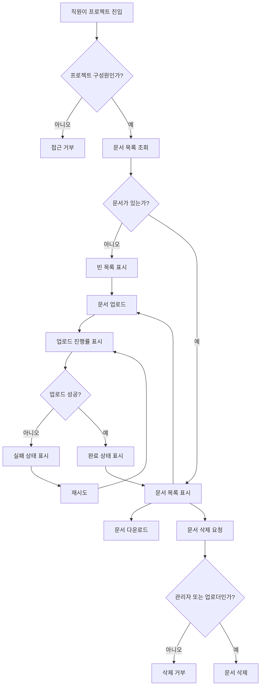

# 사내 프로젝트 문서 공유 PRD

## Applicability
| Contract | Required / N/A | Evidence |
|---|---|---|
| Pages/routes or screen IDs | Required | 업로드, 목록, 다운로드, 삭제, 구성원 관리가 사용자 화면에서 수행됨 |
| Empty/loading/error/success/recovery state matrix | Required | 업로드 진행률, 빈 목록, 실패 후 재시도, 업로드 완료 상태가 명시됨 |
| Mermaid user or system flow | Required | 업로드부터 공유, 다운로드, 삭제까지 다단계 문서 생명주기가 있음 |

## Context and Problem
사내 직원이 프로젝트별 문서를 한곳에 업로드하고 같은 프로젝트 구성원과 공유할 수 있는 내부 문서 공유 기능이 필요하다. 현재 1차 출시는 핵심 문서 작업인 업로드, 목록 조회, 다운로드, 삭제에 집중하며, 검색과 외부 공유는 제외한다.

4주 내 내부 베타 출시를 목표로 하므로 권한, 상태 처리, 실패 복구, 기본 성능 목표를 명확히 정의해 구현 범위를 고정한다.

## Goals
- 직원이 자신이 속한 프로젝트에 문서를 업로드할 수 있다.
- 같은 프로젝트 구성원은 해당 프로젝트 문서 목록을 보고 다운로드할 수 있다.
- 프로젝트 관리자는 구성원 초대, 제거, 문서 삭제를 할 수 있다.
- 일반 구성원은 본인이 업로드한 문서만 삭제할 수 있다.
- 업로드 진행률, 빈 목록, 실패 후 재시도, 업로드 완료 상태를 제공한다.
- 내부 베타 기준으로 4주 내 사용 가능한 1차 범위를 출시한다.

## Non-goals
- 문서 검색
- 외부 사용자 또는 외부 링크 공유
- 문서 버전 관리
- 문서 미리보기
- 문서 공동 편집
- 승인 워크플로
- 감사 로그 화면
- 실제 SLA 확정

## Users, Roles, and Permissions
| Role | Description | Permissions |
|---|---|---|
| 직원 | 사내 인증을 통과한 사용자 | 자신이 소속된 프로젝트 접근 |
| 프로젝트 구성원 | 특정 프로젝트에 초대된 직원 | 프로젝트 문서 목록 조회, 다운로드, 문서 업로드, 본인 업로드 문서 삭제 |
| 프로젝트 관리자 | 프로젝트 관리 권한이 있는 구성원 | 구성원 초대·제거, 프로젝트 내 모든 문서 삭제, 목록 조회, 다운로드, 업로드 |

## Functional Requirements
| ID | Requirement | Priority |
|---|---|---|
| FR-001 | 사용자는 본인이 구성원인 프로젝트의 문서 목록에만 접근할 수 있어야 한다. | P0 |
| FR-002 | 프로젝트 구성원은 해당 프로젝트에 문서를 업로드할 수 있어야 한다. | P0 |
| FR-003 | 업로드 중인 문서는 진행률을 표시해야 한다. | P0 |
| FR-004 | 업로드 실패 시 실패 상태와 재시도 액션을 제공해야 한다. | P0 |
| FR-005 | 업로드 완료 후 완료 상태를 표시하고 문서 목록에 반영해야 한다. | P0 |
| FR-006 | 프로젝트 문서가 없을 때 빈 목록 상태를 표시해야 한다. | P0 |
| FR-007 | 프로젝트 구성원은 해당 프로젝트 문서를 다운로드할 수 있어야 한다. | P0 |
| FR-008 | 일반 구성원은 본인이 업로드한 문서만 삭제할 수 있어야 한다. | P0 |
| FR-009 | 프로젝트 관리자는 프로젝트 내 모든 문서를 삭제할 수 있어야 한다. | P0 |
| FR-010 | 프로젝트 관리자는 직원을 프로젝트 구성원으로 초대할 수 있어야 한다. | P0 |
| FR-011 | 프로젝트 관리자는 프로젝트 구성원을 제거할 수 있어야 한다. | P0 |
| FR-012 | 구성원 제거 후 해당 사용자는 해당 프로젝트 문서 목록, 다운로드, 업로드, 삭제에 접근할 수 없어야 한다. | P0 |
| FR-013 | 삭제된 문서는 목록에서 제거되고 더 이상 다운로드할 수 없어야 한다. | P0 |
| FR-014 | 검색과 외부 공유 기능은 1차 출시에서 노출하지 않아야 한다. | P1 |
| FR-015 | 문서 목록은 제품 목표로 2초 안에 사용자에게 보이는 것을 지향하되, 실제 SLA는 확정 전까지 비계약 목표로 관리한다. | P1 |

## Pages and Routes
| Page or screen ID | Route, deep link, or explicit TBD + owner | Roles | Purpose |
|---|---|---|---|
| SCR-001 Project Document List | TBD, owner: Product Owner + Engineering Lead, before implementation planning | 프로젝트 구성원, 프로젝트 관리자 | 프로젝트 문서 목록 조회, 빈 목록 확인, 다운로드, 삭제 진입 |
| SCR-002 Upload Document | TBD, owner: Product Owner + Engineering Lead, before implementation planning | 프로젝트 구성원, 프로젝트 관리자 | 파일 선택, 업로드 진행률, 실패 재시도, 완료 상태 표시 |
| SCR-003 Project Members | TBD, owner: Product Owner + Engineering Lead, before implementation planning | 프로젝트 관리자 | 구성원 초대 및 제거 |

## State Matrix
| Surface | Empty | Loading | Error | Success | Recovery |
|---|---|---|---|---|---|
| Project Document List | 문서가 없다는 상태와 업로드 액션 표시 | 목록 로딩 표시 | 목록 조회 실패 메시지 표시 | 문서명, 업로드한 사용자, 업로드 시각, 다운로드/삭제 가능 액션 표시 | 다시 시도 액션 제공 |
| Upload Document | 업로드할 파일 선택 전 상태 | 업로드 진행률 표시 | 업로드 실패 메시지와 실패한 파일 표시 | 업로드 완료 상태 표시 및 목록 반영 | 재시도 액션 제공 |
| Download Document | N/A | 다운로드 요청 중 상태 표시 | 다운로드 실패 메시지 표시 | 파일 다운로드 시작 | 다시 시도 액션 제공 |
| Delete Document | N/A | 삭제 처리 중 상태 표시 | 삭제 실패 메시지 표시 | 문서가 목록에서 제거됨 | 다시 시도 또는 목록 새로고침 제공 |
| Project Members | 구성원이 없을 수 없음. 최소 관리자는 존재한다고 가정 | 구성원 목록 로딩 표시 | 구성원 조회/초대/제거 실패 메시지 표시 | 구성원 목록과 초대/제거 결과 표시 | 다시 시도 액션 제공 |

## User or System Flow

## Authorization and Data Boundaries
- 서버는 모든 요청에서 사용자 인증 상태와 프로젝트 구성원 여부를 검증해야 한다.
- 문서 목록, 업로드, 다운로드, 삭제는 프로젝트 단위 권한 경계 안에서만 허용된다.
- 일반 구성원의 삭제 권한은 `document.uploaderId == currentUser.id` 조건을 서버에서 검증해야 한다.
- 프로젝트 관리자의 전체 문서 삭제 권한은 서버의 프로젝트 관리자 권한으로 검증해야 한다.
- 구성원 초대·제거는 프로젝트 관리자만 수행할 수 있다.
- 구성원 제거 후에는 기존 세션이나 클라이언트 상태와 무관하게 서버 권한 검증에서 접근이 차단되어야 한다.
- UI에서 버튼을 숨기는 것은 보조 수단이며, 권한의 최종 판단은 서버에서 수행한다.
- 문서는 프로젝트 ID에 귀속되어 저장되어야 하며, 다른 프로젝트의 문서가 목록이나 다운로드 응답에 섞이면 안 된다.

## Non-functional Requirements
- NFR-001: 문서 목록은 “2초 안에 보이는 것”을 제품 목표로 추적한다. 단, 실제 SLA 수치와 측정 기준은 Product Owner가 확정해야 한다.
- NFR-002: 업로드 진행률은 사용자가 업로드가 진행 중임을 인지할 수 있을 정도로 갱신되어야 한다.
- NFR-003: 실패 상태는 사용자가 같은 작업을 재시도할 수 있는 명확한 액션을 포함해야 한다.
- NFR-004: 내부 베타에서는 사내 인증 사용자만 접근 가능해야 한다.

## Acceptance Criteria
| ID | Requirement | Given | When | Then | Verification |
|---|---|---|---|---|---|
| AC-001 | FR-001 | 사용자가 프로젝트 구성원이 아님 | 프로젝트 문서 목록에 접근함 | 접근이 거부된다 | 권한 테스트 |
| AC-002 | FR-002 | 사용자가 프로젝트 구성원임 | 파일을 선택해 업로드함 | 해당 프로젝트에 문서가 생성된다 | E2E/API 테스트 |
| AC-003 | FR-003 | 업로드가 진행 중임 | 업로드 화면을 봄 | 진행률이 표시된다 | UI 테스트 |
| AC-004 | FR-004 | 업로드가 실패함 | 실패 상태를 봄 | 실패 메시지와 재시도 액션이 표시된다 | UI/E2E 테스트 |
| AC-005 | FR-005 | 업로드가 성공함 | 업로드 완료 후 목록을 봄 | 완료 상태가 표시되고 문서가 목록에 보인다 | E2E 테스트 |
| AC-006 | FR-006 | 프로젝트에 문서가 없음 | 문서 목록을 봄 | 빈 목록 상태가 표시된다 | UI 테스트 |
| AC-007 | FR-007 | 사용자가 프로젝트 구성원임 | 문서 다운로드를 요청함 | 파일 다운로드가 시작된다 | E2E/API 테스트 |
| AC-008 | FR-008 | 일반 구성원이 다른 사용자의 문서를 봄 | 삭제를 요청함 | 삭제가 거부된다 | 권한 테스트 |
| AC-009 | FR-008 | 일반 구성원이 본인 문서를 봄 | 삭제를 요청함 | 문서가 삭제된다 | E2E/API 테스트 |
| AC-010 | FR-009 | 프로젝트 관리자가 문서를 봄 | 삭제를 요청함 | 업로더와 관계없이 문서가 삭제된다 | 권한 테스트 |
| AC-011 | FR-010 | 프로젝트 관리자가 직원 초대를 요청함 | 초대가 완료됨 | 직원이 프로젝트 구성원이 된다 | E2E/API 테스트 |
| AC-012 | FR-011, FR-012 | 프로젝트 관리자가 구성원을 제거함 | 제거된 사용자가 프로젝트 문서에 접근함 | 접근이 거부된다 | 권한 테스트 |
| AC-013 | FR-013 | 문서가 삭제됨 | 동일 문서 다운로드를 요청함 | 다운로드가 실패하거나 접근 불가로 처리된다 | API 테스트 |
| AC-014 | FR-014 | 사용자가 1차 출시 화면을 사용함 | 문서 기능을 탐색함 | 검색과 외부 공유 기능이 노출되지 않는다 | UI 검수 |
| AC-015 | FR-015 | 문서 목록 성능을 측정함 | 내부 베타 환경에서 목록을 로드함 | 2초 목표 대비 측정값이 기록된다. SLA 위반 판정은 하지 않는다 | 성능 측정 리포트 |

## Assumptions and Open Decisions

### 합리적 가정
- 사용자는 이미 사내 인증을 통과한 직원이다.
- 프로젝트와 프로젝트 관리자 개념은 기존 시스템 또는 베타 범위 내에서 제공된다.
- 최소 1명의 프로젝트 관리자가 항상 존재한다.
- 문서 메타데이터에는 문서 ID, 프로젝트 ID, 파일명, 업로더 ID, 업로드 시각, 저장 위치가 포함된다.
- 1차 출시에서는 단일 파일 업로드를 기본으로 한다.
- 삭제는 사용자 관점에서 즉시 목록에서 사라지는 삭제로 처리한다.
- 파일 형식, 용량 제한, 바이러스 검사 정책은 별도 보안 기준이 없으면 내부 베타 기본 정책으로 제한한다.

### 열린 결정
| ID | Decision | Owner | Needed By |
|---|---|---|---|
| OD-001 | 문서 목록 실제 SLA 수치와 측정 기준 | Product Owner | 베타 전 성능 검수 계획 수립 전 |
| OD-002 | 파일 최대 용량 및 허용 확장자 | Product Owner + Security | 업로드 구현 전 |
| OD-003 | 삭제가 물리 삭제인지 소프트 삭제인지 | Product Owner + Engineering | 삭제 API 설계 전 |
| OD-004 | 구성원 초대 방식: 즉시 추가인지 초대 수락 방식인지 | Product Owner | 구성원 관리 구현 전 |
| OD-005 | 프로젝트 관리자 지정/변경 방식 | Product Owner | 권한 모델 확정 전 |
| OD-006 | 다운로드 URL 만료 시간 또는 접근 방식 | Engineering + Security | 다운로드 구현 전 |

## Risks and Mitigations
| Risk | Impact | Mitigation |
|---|---|---|
| 실제 SLA 미확정 | 성능 완료 기준이 모호해질 수 있음 | 2초는 목표로만 측정하고, SLA 판정은 OD-001 확정 후 적용 |
| 권한 검증 누락 | 다른 프로젝트 문서 노출 또는 무단 삭제 가능 | 서버 권한 테스트를 P0 acceptance에 포함 |
| 업로드 실패 케이스 부족 | 베타 사용자가 문서 등록을 완료하지 못함 | 실패 상태와 재시도를 1차 범위 P0로 고정 |
| 파일 정책 미확정 | 보안 또는 저장 비용 리스크 | OD-002를 업로드 구현 전 필수 결정으로 관리 |
| 4주 일정 압박 | 범위 확장 시 베타 지연 | 검색, 외부 공유, 버전 관리, 미리보기 제외 범위 유지 |

## Delivery
| Phase | Requirement IDs | Verifiable exit condition |
|---|---|---|
| Phase 1: 권한 및 프로젝트 접근 기반 | FR-001, FR-010, FR-011, FR-012 | 구성원/관리자 권한 테스트가 통과하고 비구성원 접근이 차단됨 |
| Phase 2: 문서 업로드 및 상태 처리 | FR-002, FR-003, FR-004, FR-005 | 업로드 진행률, 실패 재시도, 완료 상태가 E2E로 검증됨 |
| Phase 3: 목록 및 다운로드 | FR-006, FR-007, FR-015 | 빈 목록, 문서 목록, 다운로드가 검증되고 목록 로드 시간이 측정됨 |
| Phase 4: 삭제 및 베타 범위 잠금 | FR-008, FR-009, FR-013, FR-014 | 권한별 삭제 동작이 검증되고 검색/외부 공유가 노출되지 않음 |
| Internal Beta | All P0 | 사내 베타 대상 프로젝트에서 업로드, 목록, 다운로드, 삭제, 구성원 관리가 사용 가능함 |