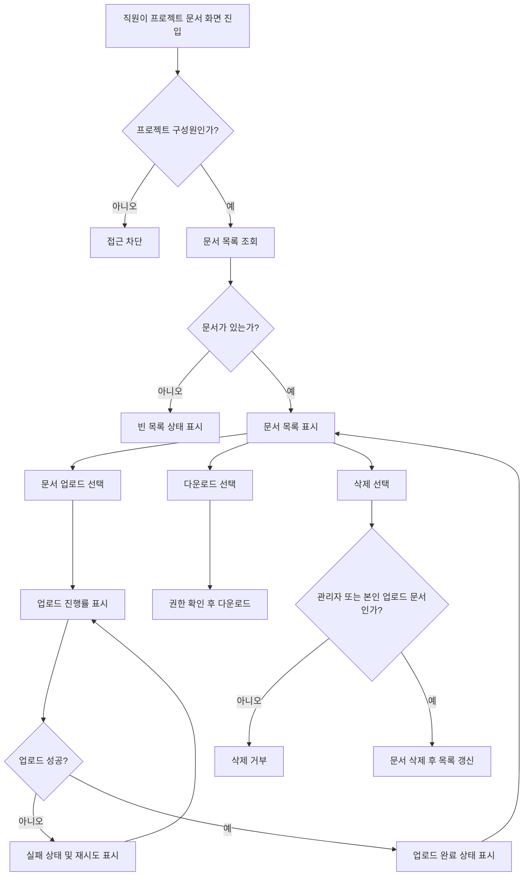

# 사내 프로젝트 문서 공유 PRD

## Applicability

| Contract | Required / N/A | Evidence |
|---|---|---|
| Pages/routes or screen IDs | Required | 업로드, 목록, 다운로드, 삭제, 구성원 관리가 사용자 화면에서 수행됨 |
| Empty/loading/error/success/recovery state matrix | Required | 업로드 진행률, 빈 목록, 실패 후 재시도, 업로드 완료 상태가 명시됨 |
| Mermaid user or system flow | Required | 업로드부터 공유, 다운로드, 삭제까지 다단계 문서 생명주기가 있음 |

## Context and Problem

직원들이 프로젝트별 문서를 업로드하고 같은 프로젝트 구성원과 공유할 수 있는 내부 문서 공유 기능이 필요하다. 현재 1차 출시는 핵심 문서 작업인 업로드, 목록 조회, 다운로드, 삭제에 집중하며 검색과 외부 공유는 제외한다.

4주 내 내부 베타 출시를 목표로 하므로 권한 모델, 상태 처리, 실패 복구, 기본 성능 목표를 명확히 정의해 구현 범위를 고정한다.

## Goals

- 직원이 프로젝트별 문서를 업로드하고 프로젝트 구성원에게 공유할 수 있다.
- 프로젝트 구성원이 프로젝트 문서 목록을 보고 다운로드할 수 있다.
- 프로젝트 관리자와 일반 구성원의 삭제 권한을 구분한다.
- 업로드 진행률, 완료, 실패, 재시도, 빈 목록 상태를 제공한다.
- 4주 내 내부 베타 가능한 범위로 1차 기능을 제한한다.

## Non-goals

- 문서 검색
- 외부 사용자 또는 외부 링크 공유
- 문서 공동 편집
- 문서 버전 관리
- 세부 감사 로그 UI
- 실제 SLA 확정

## Users, Roles, and Permissions

| Role | Description | Permissions |
|---|---|---|
| 직원 | 사내 인증을 통과한 사용자 | 자신이 속한 프로젝트 접근 |
| 프로젝트 구성원 | 특정 프로젝트에 초대된 직원 | 해당 프로젝트 문서 목록 조회, 업로드, 다운로드, 본인이 올린 문서 삭제 |
| 프로젝트 관리자 | 특정 프로젝트의 관리자 | 구성원 초대·제거, 해당 프로젝트 내 모든 문서 삭제, 목록 조회, 업로드, 다운로드 |

## Functional Requirements

| ID | Requirement | Priority |
|---|---|---|
| FR-001 | 사용자는 본인이 구성원인 프로젝트의 문서 목록을 볼 수 있어야 한다. | Must |
| FR-002 | 문서 목록은 문서명, 업로드한 사용자, 업로드 완료 시각, 파일 크기, 다운로드 액션, 삭제 가능 여부를 표시해야 한다. | Must |
| FR-003 | 사용자는 본인이 구성원인 프로젝트에 문서를 업로드할 수 있어야 한다. | Must |
| FR-004 | 업로드 중에는 파일별 진행률을 표시해야 한다. | Must |
| FR-005 | 업로드 성공 시 완료 상태를 표시하고 문서 목록에 반영해야 한다. | Must |
| FR-006 | 업로드 실패 시 실패 상태와 재시도 액션을 제공해야 한다. | Must |
| FR-007 | 문서가 없는 프로젝트에서는 빈 목록 상태를 표시해야 한다. | Must |
| FR-008 | 프로젝트 구성원은 같은 프로젝트의 문서를 다운로드할 수 있어야 한다. | Must |
| FR-009 | 일반 구성원은 본인이 업로드한 문서만 삭제할 수 있어야 한다. | Must |
| FR-010 | 프로젝트 관리자는 해당 프로젝트의 모든 문서를 삭제할 수 있어야 한다. | Must |
| FR-011 | 프로젝트 관리자는 프로젝트 구성원을 초대할 수 있어야 한다. | Must |
| FR-012 | 프로젝트 관리자는 프로젝트 구성원을 제거할 수 있어야 한다. | Must |
| FR-013 | 구성원 제거 후 해당 사용자는 프로젝트 문서 목록, 업로드, 다운로드, 삭제에 접근할 수 없어야 한다. | Must |
| FR-014 | 검색 기능은 1차 출시 범위에 포함하지 않는다. | Must |
| FR-015 | 외부 공유 기능은 1차 출시 범위에 포함하지 않는다. | Must |

## Pages and Routes

| Page or screen ID | Route, deep link, or explicit TBD + owner | Roles | Purpose |
|---|---|---|---|
| SCR-001 Project Documents | TBD: 제품/프론트엔드 리드가 라우팅 규칙 확정 | 프로젝트 구성원, 프로젝트 관리자 | 프로젝트 문서 목록, 업로드, 다운로드, 삭제 |
| SCR-002 Project Members | TBD: 제품/프론트엔드 리드가 라우팅 규칙 확정 | 프로젝트 관리자 | 구성원 초대 및 제거 |

## State Matrix

| Surface | Empty | Loading | Error | Success | Recovery |
|---|---|---|---|---|---|
| 문서 목록 | “아직 업로드된 문서가 없음” 상태와 업로드 액션 표시 | 목록 로딩 상태 표시 | 목록 조회 실패 메시지 표시 | 문서 목록 표시 | 다시 시도 액션 |
| 문서 업로드 | N/A | 파일별 진행률 표시 | 업로드 실패 상태 표시 | 업로드 완료 상태 표시 후 목록 반영 | 실패한 파일 재시도 |
| 다운로드 | N/A | 다운로드 요청 중 상태 표시 | 다운로드 실패 메시지 표시 | 파일 다운로드 시작 | 다시 시도 |
| 삭제 | N/A | 삭제 처리 중 상태 표시 | 삭제 실패 메시지 표시 | 목록에서 문서 제거 | 다시 시도 |
| 구성원 관리 | 구성원이 없을 경우 관리자 본인 또는 기본 안내 표시 | 구성원 목록 로딩 상태 표시 | 초대·제거 실패 메시지 표시 | 구성원 목록 갱신 | 다시 시도 |

## User or System Flow

## Authorization and Data Boundaries

- 서버는 모든 요청에서 사용자의 프로젝트 구성원 여부를 검증해야 한다.
- UI에서 버튼을 숨기는 것은 권한 제어로 간주하지 않는다.
- 프로젝트 구성원이 아닌 사용자는 해당 프로젝트의 문서 메타데이터, 파일 다운로드 URL, 업로드 API, 삭제 API에 접근할 수 없어야 한다.
- 일반 구성원은 `uploaded_by_user_id`가 본인인 문서만 삭제할 수 있다.
- 프로젝트 관리자는 해당 프로젝트 범위 안의 모든 문서를 삭제할 수 있다.
- 구성원 제거 즉시 해당 사용자의 프로젝트 문서 접근 권한은 무효화되어야 한다.
- 문서는 프로젝트 단위로 격리되어야 하며, 다른 프로젝트의 문서가 목록이나 다운로드 응답에 섞이면 안 된다.

## Non-functional Requirements

- 문서 목록은 사용자가 화면에 진입한 뒤 2초 안에 보이는 것을 목표로 한다.
- 실제 SLA는 아직 확정하지 않는다.
- 2초 목표의 측정 기준, 대상 환경, 백분위 기준은 제품 책임자가 결정해야 한다.
- 업로드 실패 시 사용자가 같은 파일을 다시 선택하지 않아도 재시도할 수 있어야 한다는 가정으로 설계한다.
- 내부 베타 기준으로 사내 인증 사용자를 대상으로 한다.

## Acceptance Criteria

| ID | Requirement | Given | When | Then | Verification |
|---|---|---|---|---|---|
| AC-001 | FR-001 | 사용자가 프로젝트 구성원이다 | 문서 화면에 진입한다 | 해당 프로젝트 문서 목록이 표시된다 | 기능 테스트 |
| AC-002 | FR-001, FR-013 | 사용자가 프로젝트 구성원이 아니다 | 문서 목록을 요청한다 | 접근이 거부된다 | API 권한 테스트 |
| AC-003 | FR-002 | 문서가 존재한다 | 목록이 표시된다 | 문서명, 업로더, 업로드 완료 시각, 크기, 다운로드 액션, 삭제 가능 여부가 보인다 | UI 테스트 |
| AC-004 | FR-003, FR-004 | 구성원이 파일을 선택한다 | 업로드를 시작한다 | 파일별 업로드 진행률이 표시된다 | UI/API 통합 테스트 |
| AC-005 | FR-005 | 업로드가 성공한다 | 업로드 응답을 받는다 | 완료 상태가 표시되고 목록에 문서가 추가된다 | 통합 테스트 |
| AC-006 | FR-006 | 업로드가 실패한다 | 실패 응답 또는 네트워크 오류가 발생한다 | 실패 상태와 재시도 액션이 표시된다 | 오류 처리 테스트 |
| AC-007 | FR-006 | 업로드 실패 상태다 | 사용자가 재시도를 선택한다 | 동일 파일 업로드가 다시 시도된다 | UI 테스트 |
| AC-008 | FR-007 | 프로젝트에 문서가 없다 | 목록 조회가 완료된다 | 빈 목록 상태가 표시된다 | UI 테스트 |
| AC-009 | FR-008 | 사용자가 프로젝트 구성원이다 | 문서 다운로드를 선택한다 | 파일 다운로드가 시작된다 | 통합 테스트 |
| AC-010 | FR-009 | 일반 구성원이 본인이 올린 문서를 선택한다 | 삭제를 요청한다 | 문서가 삭제되고 목록에서 사라진다 | 권한 테스트 |
| AC-011 | FR-009 | 일반 구성원이 타인이 올린 문서를 선택한다 | 삭제를 요청한다 | 삭제가 거부된다 | API 권한 테스트 |
| AC-012 | FR-010 | 프로젝트 관리자가 문서를 선택한다 | 삭제를 요청한다 | 업로더와 무관하게 문서가 삭제된다 | 권한 테스트 |
| AC-013 | FR-011 | 프로젝트 관리자가 직원을 초대한다 | 초대가 성공한다 | 직원이 프로젝트 구성원이 된다 | 통합 테스트 |
| AC-014 | FR-012, FR-013 | 프로젝트 관리자가 구성원을 제거한다 | 제거가 성공한다 | 제거된 사용자는 프로젝트 문서에 접근할 수 없다 | 권한 테스트 |
| AC-015 | FR-014 | 사용자가 문서 화면에 진입한다 | 기능을 확인한다 | 검색 UI와 검색 API 호출이 제공되지 않는다 | 범위 검증 |
| AC-016 | FR-015 | 사용자가 문서 화면에 진입한다 | 기능을 확인한다 | 외부 공유 UI와 외부 공유 API 호출이 제공되지 않는다 | 범위 검증 |

## Assumptions and Open Decisions

### 합리적 가정

- 사내 인증과 기본 사용자 계정 체계는 이미 존재한다.
- 프로젝트와 프로젝트 관리자 개념은 이미 존재하거나 1차 출시 전에 제공된다.
- 한 문서는 하나의 프로젝트에만 속한다.
- 업로드 완료 전 문서는 다른 구성원 목록에 노출하지 않는다.
- 삭제는 1차 출시에서 복구 불가능한 삭제로 처리한다.
- 문서 다운로드 권한은 다운로드 요청 시점에 다시 검증한다.
- 내부 베타에서는 사내 사용자만 접근한다.

### 열린 결정

| ID | Decision | Owner | Needed by |
|---|---|---|---|
| OD-001 | 문서 목록 2초 목표의 실제 SLA 여부, 측정 환경, 백분위 기준 | 제품 책임자 | 베타 성능 기준 확정 전 |
| OD-002 | 업로드 가능한 최대 파일 크기와 허용 파일 형식 | 제품 책임자, 보안/인프라 | 개발 착수 전 |
| OD-003 | 삭제 시 확인 모달 필요 여부와 삭제 복구 정책 | 제품 책임자 | 삭제 UI 구현 전 |
| OD-004 | 구성원 초대 방식: 이메일 초대, 사내 사용자 검색, 또는 둘 다 | 제품 책임자 | 구성원 관리 구현 전 |
| OD-005 | 프로젝트 관리자 지정·변경 방식 | 제품 책임자 | 권한 관리 구현 전 |
| OD-006 | 문서 저장 기간과 보관 정책 | 보안/컴플라이언스, 제품 책임자 | 베타 운영 전 |

## Risks and Mitigations

| Risk | Impact | Mitigation |
|---|---|---|
| SLA가 확정되지 않아 성능 기준이 모호함 | 베타 합격 기준 논쟁 가능 | 2초는 목표로만 두고 OD-001을 베타 전 결정 |
| 파일 크기·형식 제한 미정 | 업로드 구현과 인프라 비용 영향 | OD-002를 개발 착수 전 확정 |
| UI 기반 권한 처리로 오해될 가능성 | 문서 유출 위험 | 모든 권한을 서버에서 검증하도록 명시 |
| 구성원 제거 후 기존 다운로드 URL이 살아 있을 가능성 | 제거된 사용자의 접근 위험 | 다운로드 요청 시점 권한 검증 및 만료 URL 사용 |
| 4주 일정 대비 구성원 관리까지 포함됨 | 일정 지연 가능 | 1차 범위를 검색·외부 공유 제외로 고정하고 Must 요구사항만 구현 |

## Delivery

| Phase | Requirement IDs | Verifiable exit condition |
|---|---|---|
| Week 1: 권한·데이터 모델 확정 | FR-001, FR-002, FR-009, FR-010, FR-013 | 프로젝트 구성원, 관리자, 문서 소유자 기준 권한 테스트가 정의됨 |
| Week 2: 문서 목록·업로드 | FR-001, FR-002, FR-003, FR-004, FR-005, FR-006, FR-007 | 목록, 빈 상태, 업로드 진행률, 완료, 실패 재시도가 동작함 |
| Week 3: 다운로드·삭제·구성원 관리 | FR-008, FR-009, FR-010, FR-011, FR-012, FR-013 | 다운로드, 삭제 권한, 초대, 제거가 통합 테스트를 통과함 |
| Week 4: 내부 베타 안정화 | FR-014, FR-015, 전체 AC | 검색·외부 공유 제외가 확인되고 핵심 수용 기준이 통과함 |

검증 참고: 사용자 요청에 따라 파일을 만들지 않았으므로 PRD validator는 실행하지 않았습니다.