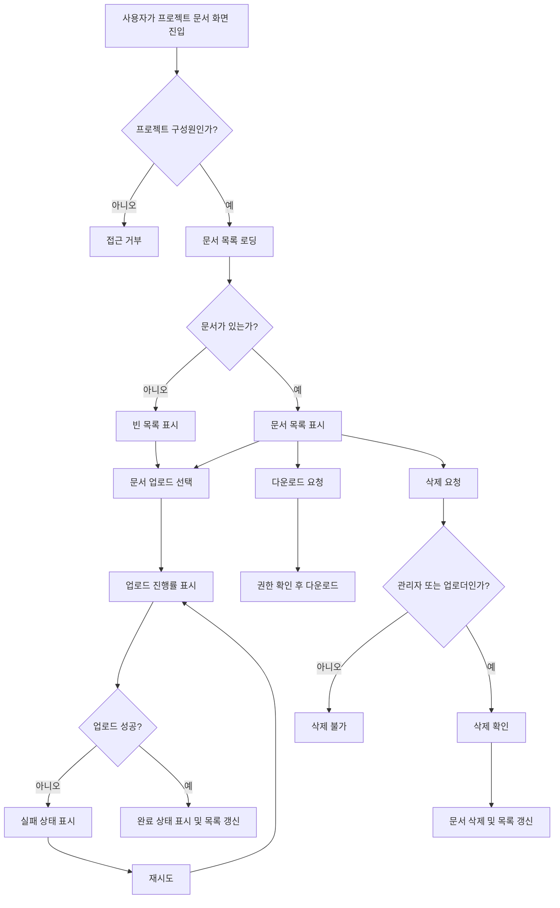

# 사내 프로젝트 문서 공유 PRD

## Applicability

| Contract | Required / N/A | Evidence |
|---|---|---|
| Pages/routes or screen IDs | Required | 업로드, 목록, 다운로드, 삭제, 구성원 관리이 모두 사용자 화면이 필요함 |
| Empty/loading/error/success/recovery state matrix | Required | 업로드 진행률, 빈 목록, 실패 후 재시도, 업로드 완료 상태가 명시됨 |
| Mermaid user or system flow | Required | 문서 업로드부터 공유, 다운로드, 삭제까지 다단계 수명주기가 있음 |

## Context and problem

사내 직원이 프로젝트별 문서를 안전하게 업로드하고 같은 프로젝트 구성원에게 공유할 수 있는 기본 문서 공유 기능이 필요하다. 현재 브리프 기준 1차 출시는 문서의 업로드, 목록 조회, 다운로드, 삭제에 집중하며, 프로젝트 관리자는 구성원 관리와 문서 삭제 권한을 가진다.

4주 내 내부 베타를 목표로 하므로 검색, 외부 공유, 고급 문서 관리 기능은 제외하고 핵심 권한 모델과 업로드 상태 경험을 안정적으로 제공한다.

## Goals

- 직원이 프로젝트별 문서를 업로드하고 프로젝트 구성원에게 공유할 수 있다.
- 프로젝트 구성원이 자신이 속한 프로젝트의 문서 목록을 볼 수 있다.
- 프로젝트 구성원이 허용된 문서를 다운로드할 수 있다.
- 문서 삭제 권한을 역할과 업로더 기준으로 제한한다.
- 업로드 중 진행률, 실패 후 재시도, 완료 상태, 빈 목록 상태를 제공한다.
- 내부 베타에서 사용할 수 있는 최소 기능을 4주 내 제공한다.

## Non-goals

- 문서 검색
- 외부 사용자 또는 외부 링크 공유
- 문서 버전 관리
- 문서 미리보기
- 승인 워크플로
- 감사 리포트 또는 고급 관리자 콘솔
- 실제 SLA 확정

## Users, roles, and permissions

| Role | Description | Permissions |
|---|---|---|
| 직원 | 사내 계정을 가진 기본 사용자 | 자신이 구성원인 프로젝트 접근 가능 |
| 일반 구성원 | 특정 프로젝트에 소속된 직원 | 프로젝트 문서 업로드, 목록 조회, 다운로드, 본인이 업로드한 문서 삭제 |
| 프로젝트 관리자 | 특정 프로젝트의 관리자 | 구성원 초대, 구성원 제거, 프로젝트 내 모든 문서 삭제, 목록 조회, 다운로드, 업로드 |
| 비구성원 | 프로젝트에 속하지 않은 직원 | 해당 프로젝트 문서와 구성원 정보 접근 불가 |

## Functional requirements

| ID | Requirement | Priority |
|---|---|---|
| FR-001 | 사용자는 자신이 구성원인 프로젝트의 문서 목록을 조회할 수 있어야 한다. | P0 |
| FR-002 | 문서 목록은 파일명, 업로더, 업로드 일시, 파일 크기, 다운로드 동작, 삭제 가능 여부를 표시해야 한다. | P0 |
| FR-003 | 사용자는 자신이 구성원인 프로젝트에 문서를 업로드할 수 있어야 한다. | P0 |
| FR-004 | 업로드 중에는 파일별 진행률을 표시해야 한다. | P0 |
| FR-005 | 업로드 실패 시 실패 상태와 재시도 동작을 제공해야 한다. | P0 |
| FR-006 | 업로드 완료 시 완료 상태를 표시하고 문서 목록에 반영해야 한다. | P0 |
| FR-007 | 문서가 없는 프로젝트에서는 빈 목록 상태를 표시해야 한다. | P0 |
| FR-008 | 프로젝트 구성원은 프로젝트 문서를 다운로드할 수 있어야 한다. | P0 |
| FR-009 | 일반 구성원은 본인이 업로드한 문서만 삭제할 수 있어야 한다. | P0 |
| FR-010 | 프로젝트 관리자는 프로젝트 내 모든 문서를 삭제할 수 있어야 한다. | P0 |
| FR-011 | 프로젝트 관리자는 프로젝트 구성원을 초대할 수 있어야 한다. | P0 |
| FR-012 | 프로젝트 관리자는 프로젝트 구성원을 제거할 수 있어야 한다. | P0 |
| FR-013 | 비구성원은 프로젝트 문서 목록, 다운로드, 업로드, 삭제, 구성원 관리에 접근할 수 없어야 한다. | P0 |
| FR-014 | 삭제 전 사용자 확인 단계를 제공해야 한다. | P1 |
| FR-015 | 삭제 완료 후 목록에서 해당 문서를 제거하고 성공 상태를 표시해야 한다. | P1 |

## Pages and routes

| Page or screen ID | Route, deep link, or explicit TBD + owner | Roles | Purpose |
|---|---|---|---|
| SCR-PROJECT-DOCS | `/projects/:projectId/documents` | 프로젝트 관리자, 일반 구성원 | 문서 목록 조회, 업로드, 다운로드, 삭제 |
| SCR-UPLOAD-STATUS | SCR-PROJECT-DOCS 내 업로드 영역 | 프로젝트 관리자, 일반 구성원 | 업로드 진행률, 실패, 재시도, 완료 상태 표시 |
| SCR-MEMBER-MANAGEMENT | `/projects/:projectId/members` 또는 기존 프로젝트 설정 화면 내 탭 TBD, Owner: Product Owner | 프로젝트 관리자 | 구성원 초대 및 제거 |
| SCR-ACCESS-DENIED | 기존 권한 오류 화면 또는 TBD, Owner: Engineering | 비구성원, 권한 없는 사용자 | 접근 불가 안내 |

## State matrix

| Surface | Empty | Loading | Error | Success | Recovery |
|---|---|---|---|---|---|
| 문서 목록 | “업로드된 문서가 없음” 상태 표시 | 목록 로딩 표시 | 목록 조회 실패 메시지 표시 | 문서 목록 표시 | 다시 시도 버튼 제공 |
| 업로드 영역 | 선택된 파일 없음 | 파일별 진행률 표시 | 업로드 실패 상태 표시 | 업로드 완료 상태 표시 | 실패 파일 재시도 버튼 제공 |
| 다운로드 | N/A | 다운로드 요청 중 상태 표시 | 다운로드 실패 메시지 표시 | 파일 다운로드 시작 | 다시 다운로드 버튼 제공 |
| 삭제 | N/A | 삭제 처리 중 상태 표시 | 삭제 실패 메시지 표시 | 목록에서 문서 제거 및 성공 상태 표시 | 다시 삭제 버튼 제공 |
| 구성원 관리 | 구성원이 관리자 본인뿐인 상태 표시 가능 | 구성원 목록 로딩 표시 | 초대/제거 실패 메시지 표시 | 초대/제거 반영 | 다시 시도 버튼 제공 |

## User or system flow

## Authorization and data boundaries

- 모든 문서 접근 권한은 서버에서 검증해야 한다. UI에서 버튼을 숨기는 것만으로 권한을 처리하면 안 된다.
- 프로젝트 구성원만 해당 프로젝트의 문서 목록, 다운로드, 업로드 기능을 사용할 수 있다.
- 문서 삭제는 서버에서 다음 조건 중 하나를 만족할 때만 허용한다.
  - 요청자가 해당 프로젝트의 프로젝트 관리자
  - 요청자가 해당 문서의 업로더
- 프로젝트 구성원 초대와 제거는 프로젝트 관리자만 수행할 수 있다.
- 구성원 제거 후 해당 사용자는 즉시 해당 프로젝트 문서 목록, 다운로드, 업로드, 삭제 권한을 잃는다.
- 문서는 프로젝트 단위로 격리되어야 하며, 다른 프로젝트의 문서 ID를 직접 요청해도 접근할 수 없어야 한다.
- 다운로드 URL 또는 파일 접근 토큰이 있다면 프로젝트 구성원 권한을 반영해야 하며, 비구성원에게 재사용 가능하면 안 된다.

## Non-functional requirements

| ID | Requirement | Owner / Decision |
|---|---|---|
| NFR-001 | 문서 목록은 사용자가 화면에 진입한 후 2초 안에 보이는 것을 목표로 한다. 단, 이는 제품 목표이며 SLA가 아니다. | 실제 SLA는 Product Owner 결정 필요 |
| NFR-002 | 권한 검증 실패 시 데이터 존재 여부를 과도하게 노출하지 않는 오류 응답을 제공한다. | Engineering |
| NFR-003 | 업로드 진행률은 사용자가 업로드가 진행 중임을 인지할 수 있을 만큼 주기적으로 갱신되어야 한다. | Engineering |
| NFR-004 | 내부 베타 범위에서는 사내 인증 사용자만 사용할 수 있어야 한다. | Product / Security |

## Acceptance criteria

| ID | Requirement | Given | When | Then | Verification |
|---|---|---|---|---|---|
| AC-001 | FR-001 | 사용자가 프로젝트 구성원이다 | 문서 화면에 진입한다 | 해당 프로젝트 문서 목록을 볼 수 있다 | 기능 테스트 |
| AC-002 | FR-007 | 프로젝트에 문서가 없다 | 문서 화면에 진입한다 | 빈 목록 상태가 표시된다 | UI 테스트 |
| AC-003 | FR-003, FR-004 | 프로젝트 구성원이 파일을 선택했다 | 업로드를 시작한다 | 파일별 업로드 진행률이 표시된다 | 기능/UI 테스트 |
| AC-004 | FR-005 | 업로드가 실패했다 | 실패 상태가 표시된다 | 사용자는 같은 파일 업로드를 재시도할 수 있다 | 실패 주입 테스트 |
| AC-005 | FR-006 | 업로드가 성공했다 | 업로드 완료 후 | 완료 상태가 표시되고 문서 목록에 파일이 추가된다 | 기능 테스트 |
| AC-006 | FR-008 | 프로젝트 구성원이 문서 목록을 보고 있다 | 다운로드를 선택한다 | 파일 다운로드가 시작된다 | 기능 테스트 |
| AC-007 | FR-009 | 일반 구성원이 다른 사용자가 올린 문서를 보고 있다 | 삭제를 시도한다 | 삭제가 거부된다 | 권한 테스트 |
| AC-008 | FR-009 | 일반 구성원이 본인이 올린 문서를 보고 있다 | 삭제를 확인한다 | 문서가 삭제되고 목록에서 제거된다 | 권한/기능 테스트 |
| AC-009 | FR-010 | 프로젝트 관리자가 문서를 보고 있다 | 임의 문서 삭제를 확인한다 | 문서가 삭제되고 목록에서 제거된다 | 권한/기능 테스트 |
| AC-010 | FR-011 | 프로젝트 관리자가 구성원 관리 화면에 있다 | 직원을 초대한다 | 초대된 직원이 프로젝트 구성원이 된다 | 기능 테스트 |
| AC-011 | FR-012 | 프로젝트 관리자가 기존 구성원을 제거한다 | 제거가 완료된다 | 제거된 사용자는 프로젝트 문서에 접근할 수 없다 | 권한 테스트 |
| AC-012 | FR-013 | 비구성원이 프로젝트 문서 URL에 접근한다 | 화면 또는 API를 요청한다 | 문서 데이터 접근이 거부된다 | 권한/API 테스트 |
| AC-013 | FR-014, FR-015 | 삭제 권한이 있는 사용자가 삭제를 선택했다 | 확인 후 삭제가 성공한다 | 성공 상태가 표시되고 목록이 갱신된다 | UI/기능 테스트 |
| AC-014 | NFR-001 | 정상적인 내부 베타 환경이다 | 사용자가 문서 화면에 진입한다 | 목록 표시 시간 측정값을 수집할 수 있다 | 성능 계측 확인 |

## Assumptions and open decisions

### 합리적 가정

- 사내 직원 인증 시스템은 이미 존재하며, 1차 출시에서는 별도 회원가입을 만들지 않는다.
- 프로젝트와 프로젝트 관리자 역할은 기존 시스템에 존재하거나 베타 전에 생성 가능하다.
- 업로드 가능한 파일 형식은 1차 출시에서 제한하지 않되, 보안상 실행 파일 차단 등 기본 정책은 사내 보안 기준을 따른다.
- 문서 삭제는 소프트 삭제 또는 하드 삭제 중 구현팀이 기존 저장소 정책에 맞춰 선택할 수 있다. 사용자에게는 삭제된 문서가 목록과 다운로드에서 사라지는 것이 핵심 요구사항이다.
- 구성원 초대는 사내 직원 계정을 대상으로 한다.
- “같은 프로젝트 구성원에게 공유”는 별도 알림 발송이 아니라 구성원이 목록에서 접근 가능한 상태를 의미한다.

### 열린 결정

| ID | Decision | Owner | Needed by |
|---|---|---|---|
| OD-001 | 문서 목록 2초 목표를 SLA로 확정할지, 단순 UX 목표로 유지할지 | Product Owner | 베타 전 성능 기준 확정 |
| OD-002 | 파일 최대 크기, 허용/차단 확장자, 총 저장 용량 제한 | Product Owner / Security | 업로드 구현 전 |
| OD-003 | 다운로드 링크 만료 시간 또는 직접 스트리밍 방식 | Engineering / Security | 다운로드 구현 전 |
| OD-004 | 구성원 초대 시 알림을 보낼지 여부 | Product Owner | 구성원 관리 구현 전 |
| OD-005 | 삭제된 문서 복구 필요 여부 | Product Owner | 삭제 정책 확정 전 |
| OD-006 | 프로젝트 관리자 본인을 제거할 수 있는지, 마지막 관리자 제거를 막을지 | Product Owner | 구성원 제거 구현 전 |

## Risks and mitigations

| Risk | Impact | Mitigation |
|---|---|---|
| 권한 검증이 UI 중심으로 구현될 위험 | 비구성원 또는 권한 없는 사용자의 문서 접근 가능 | 모든 목록, 다운로드, 업로드, 삭제 API에서 서버 권한 검증 |
| 파일 업로드 실패 원인이 사용자에게 불명확할 위험 | 베타 사용성 저하 | 실패 상태와 재시도 제공, 파일 크기/형식 제한이 확정되면 메시지 반영 |
| 2초 목록 목표가 실제 데이터 규모와 맞지 않을 위험 | 성능 기대치 불일치 | 베타에서 목록 표시 시간 계측, SLA는 PO 결정으로 분리 |
| 구성원 제거 후 접근 권한이 캐시나 링크에 남을 위험 | 보안 문제 | 다운로드 권한을 요청 시점에 재검증하거나 짧은 만료 토큰 사용 |
| 4주 일정 내 범위 확장 위험 | 베타 지연 | 검색, 외부 공유, 버전 관리, 미리보기 제외를 명확히 유지 |

## Delivery

| Phase | Requirement IDs | Verifiable exit condition |
|---|---|---|
| Week 1: 권한/데이터 모델 확정 | FR-001, FR-009, FR-010, FR-013, OD-002, OD-003 | 프로젝트 구성원/관리자/업로더 기준 권한 테스트 케이스 확정 |
| Week 2: 문서 목록·업로드 구현 | FR-001, FR-002, FR-003, FR-004, FR-005, FR-006, FR-007 | 목록, 빈 상태, 업로드 진행률, 실패 재시도, 완료 상태가 동작 |
| Week 3: 다운로드·삭제·구성원 관리 구현 | FR-008, FR-009, FR-010, FR-011, FR-012, FR-014, FR-015 | 다운로드, 삭제 권한, 구성원 초대/제거 권한 테스트 통과 |
| Week 4: 내부 베타 안정화 | 전체 P0, NFR-001~NFR-004 | 내부 베타 시나리오 테스트 통과, 목록 표시 시간 계측 가능 |

파일을 만들지 않았고 저장소도 탐색하지 않았습니다. PRD 검증 스크립트는 파일 저장이 필요한 절차라 실행하지 않았습니다.