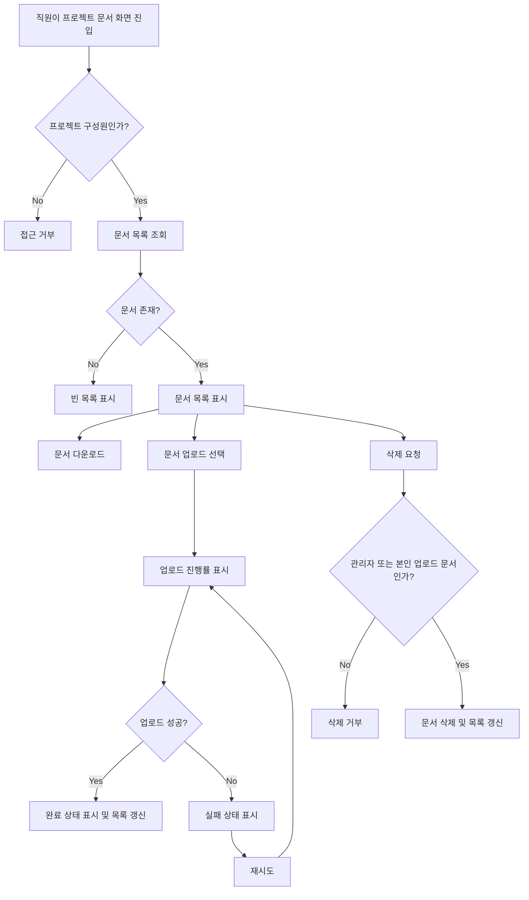

# 사내 프로젝트 문서 공유 PRD

## Applicability

| Contract | Required / N/A | Evidence |
|---|---:|---|
| Pages/routes or screen IDs | Required | 직원이 업로드, 목록, 다운로드, 삭제, 구성원 관리를 수행하는 사용자 노출 기능 |
| Empty/loading/error/success/recovery state matrix | Required | 업로드 진행률, 빈 목록, 실패 후 재시도, 업로드 완료 상태가 명시됨 |
| Mermaid user or system flow | Required | 업로드, 공유, 삭제 권한, 다운로드까지 다단계 생명주기 존재 |

## Context and Problem

사내 직원은 프로젝트별 문서를 한곳에 업로드하고 같은 프로젝트 구성원과 공유해야 한다. 현재 요구 범위는 4주 내 내부 베타를 목표로 하는 1차 출시이며, 업로드, 목록, 다운로드, 삭제에 집중한다. 프로젝트 관리자는 구성원 관리와 문서 삭제 권한을 갖고, 일반 구성원은 본인이 업로드한 문서만 삭제할 수 있어야 한다.

## Goals

- 직원이 프로젝트별 문서를 업로드하고 프로젝트 구성원에게 공유할 수 있다.
- 프로젝트 구성원이 자신이 속한 프로젝트의 문서 목록을 확인하고 다운로드할 수 있다.
- 업로드 중 진행률, 완료, 실패 및 재시도 상태를 제공한다.
- 권한에 따라 문서 삭제와 구성원 관리 기능을 제한한다.
- 4주 내 내부 베타에서 핵심 문서 공유 흐름을 검증한다.

## Non-goals

- 검색 기능
- 외부 공유 또는 공개 링크
- 문서 공동 편집
- 문서 미리보기
- 버전 관리
- 감사 로그, 보존 정책, DLP 등 고급 컴플라이언스 기능
- 확정 SLA 제공

## Users, Roles, and Permissions

| Role | Description | Permissions |
|---|---|---|
| 직원 | 사내 인증 사용자 | 본인이 속한 프로젝트 접근 |
| 프로젝트 구성원 | 특정 프로젝트에 소속된 직원 | 프로젝트 문서 목록 조회, 다운로드, 문서 업로드, 본인 업로드 문서 삭제 |
| 프로젝트 관리자 | 특정 프로젝트의 관리자 | 구성원 초대, 구성원 제거, 프로젝트 내 모든 문서 삭제, 목록 조회, 다운로드, 업로드 |

## Functional Requirements

| ID | Requirement | Priority |
|---|---|---:|
| FR-001 | 사용자는 자신이 속한 프로젝트 목록 또는 특정 프로젝트 문서 화면에 접근할 수 있어야 한다. | P0 |
| FR-002 | 프로젝트 구성원은 해당 프로젝트에 문서를 업로드할 수 있어야 한다. | P0 |
| FR-003 | 업로드 중 사용자는 파일별 진행률을 볼 수 있어야 한다. | P0 |
| FR-004 | 업로드 성공 시 완료 상태가 표시되고 문서 목록에 반영되어야 한다. | P0 |
| FR-005 | 업로드 실패 시 실패 상태와 재시도 동작을 제공해야 한다. | P0 |
| FR-006 | 프로젝트 구성원은 해당 프로젝트의 문서 목록을 볼 수 있어야 한다. | P0 |
| FR-007 | 문서가 없을 때 빈 목록 상태를 표시해야 한다. | P0 |
| FR-008 | 프로젝트 구성원은 해당 프로젝트의 문서를 다운로드할 수 있어야 한다. | P0 |
| FR-009 | 일반 구성원은 본인이 업로드한 문서만 삭제할 수 있어야 한다. | P0 |
| FR-010 | 프로젝트 관리자는 프로젝트 내 모든 문서를 삭제할 수 있어야 한다. | P0 |
| FR-011 | 프로젝트 관리자는 프로젝트 구성원을 초대할 수 있어야 한다. | P0 |
| FR-012 | 프로젝트 관리자는 프로젝트 구성원을 제거할 수 있어야 한다. | P0 |
| FR-013 | 구성원 제거 후 해당 사용자는 해당 프로젝트 문서 목록, 다운로드, 업로드, 삭제에 접근할 수 없어야 한다. | P0 |
| FR-014 | 삭제된 문서는 목록에서 제거되고 더 이상 다운로드할 수 없어야 한다. | P0 |
| FR-015 | 시스템은 권한 없는 요청을 서버에서 거부해야 한다. UI 숨김만으로 권한을 처리해서는 안 된다. | P0 |

## Pages and Routes

| Page or screen ID | Route, deep link, or explicit TBD + owner | Roles | Purpose |
|---|---|---|---|
| SCR-001 Project Documents | `TBD: Web/App owner to decide route before implementation start` | 프로젝트 구성원, 프로젝트 관리자 | 프로젝트 문서 목록, 업로드, 다운로드, 삭제 |
| SCR-002 Upload Status | SCR-001 내 업로드 영역 또는 모달, UI owner 결정 | 프로젝트 구성원, 프로젝트 관리자 | 업로드 진행률, 성공, 실패, 재시도 표시 |
| SCR-003 Project Members | `TBD: Web/App owner to decide route before implementation start` | 프로젝트 관리자 | 구성원 초대 및 제거 |

## State Matrix

| Surface | Empty | Loading | Error | Success | Recovery |
|---|---|---|---|---|---|
| 문서 목록 | “문서 없음” 상태 표시 | 최초 목록 로딩 표시 | 목록 조회 실패 표시 | 문서명, 업로더, 업로드 일시, 다운로드/삭제 액션 표시 | 다시 불러오기 |
| 업로드 | 업로드 대기 상태 | 파일별 진행률 표시 | 업로드 실패 표시 | 업로드 완료 표시 및 목록 반영 | 실패 파일 재시도 |
| 다운로드 | N/A | 다운로드 시작 상태 | 다운로드 실패 표시 | 파일 다운로드 시작 또는 완료 | 다시 다운로드 |
| 삭제 | N/A | 삭제 처리 중 표시 | 삭제 실패 표시 | 목록에서 문서 제거 | 다시 삭제 |
| 구성원 관리 | 구성원 없음 가능 | 구성원 목록 로딩 표시 | 초대/제거 실패 표시 | 구성원 추가/제거 반영 | 다시 시도 |

## User or System Flow

## Authorization and Data Boundaries

- 프로젝트 문서는 프로젝트 단위로 격리한다.
- 사용자는 자신이 소속된 프로젝트의 문서만 조회, 업로드, 다운로드할 수 있다.
- 일반 구성원은 본인이 업로드한 문서만 삭제할 수 있다.
- 프로젝트 관리자는 해당 프로젝트의 모든 문서를 삭제할 수 있다.
- 프로젝트 관리자는 해당 프로젝트의 구성원만 초대·제거할 수 있다.
- 구성원 제거 즉시 해당 프로젝트에 대한 접근 권한은 만료되어야 한다.
- 모든 권한 검사는 서버에서 수행해야 한다.
- 파일 다운로드 URL 또는 파일 식별자는 권한 없는 사용자가 재사용할 수 없어야 한다.

## Non-functional Requirements

- 목록 표시 성능 목표: 문서 목록은 사용자가 화면에 진입한 뒤 2초 안에 보이는 것을 목표로 한다.
- 실제 SLA: TBD, 제품 책임자 결정 필요.
- 내부 베타 범위에서는 업로드, 목록, 다운로드, 삭제, 구성원 관리의 기본 안정성을 우선한다.
- 파일 크기 제한, 허용 확장자, 바이러스 검사 여부는 열린 결정으로 둔다.
- 장애 시 사용자가 재시도 가능한 상태를 제공해야 한다.

## Acceptance Criteria

| ID | Requirement | Given | When | Then | Verification |
|---|---|---|---|---|---|
| AC-001 | FR-002 | 프로젝트 구성원인 사용자가 문서 화면에 있다 | 파일을 선택해 업로드한다 | 업로드가 시작된다 | 기능 테스트 |
| AC-002 | FR-003 | 업로드가 진행 중이다 | 사용자가 업로드 영역을 본다 | 파일별 진행률이 표시된다 | UI 테스트 |
| AC-003 | FR-004 | 업로드가 성공했다 | 처리가 완료된다 | 완료 상태가 표시되고 문서 목록에 새 문서가 보인다 | E2E 테스트 |
| AC-004 | FR-005 | 업로드가 실패했다 | 실패 응답을 받는다 | 실패 상태와 재시도 액션이 표시된다 | E2E 테스트 |
| AC-005 | FR-005 | 실패한 업로드가 있다 | 사용자가 재시도를 선택한다 | 동일 파일 업로드를 다시 시도한다 | E2E 테스트 |
| AC-006 | FR-006 | 프로젝트 구성원이 문서 화면에 진입한다 | 목록 조회가 성공한다 | 해당 프로젝트 문서만 표시된다 | API + E2E 테스트 |
| AC-007 | FR-007 | 프로젝트에 문서가 없다 | 목록 조회가 성공한다 | 빈 목록 상태가 표시된다 | UI 테스트 |
| AC-008 | FR-008 | 프로젝트 구성원이 문서 목록을 보고 있다 | 다운로드를 선택한다 | 문서 다운로드가 시작된다 | E2E 테스트 |
| AC-009 | FR-009 | 일반 구성원이 타인이 올린 문서를 보고 있다 | 삭제를 요청한다 | 서버가 삭제를 거부한다 | API 권한 테스트 |
| AC-010 | FR-009 | 일반 구성원이 본인이 올린 문서를 보고 있다 | 삭제를 요청한다 | 문서가 삭제되고 목록에서 사라진다 | E2E 테스트 |
| AC-011 | FR-010 | 프로젝트 관리자가 문서를 보고 있다 | 삭제를 요청한다 | 문서가 삭제되고 더 이상 다운로드되지 않는다 | E2E + API 테스트 |
| AC-012 | FR-011 | 프로젝트 관리자가 구성원 관리 화면에 있다 | 직원을 초대한다 | 해당 직원이 프로젝트 구성원이 된다 | E2E 테스트 |
| AC-013 | FR-012, FR-013 | 프로젝트 관리자가 구성원을 제거한다 | 제거된 사용자가 프로젝트에 접근한다 | 접근이 거부된다 | API 권한 테스트 |
| AC-014 | FR-014 | 문서가 삭제되었다 | 사용자가 기존 다운로드 요청을 시도한다 | 다운로드가 거부되거나 파일 없음 상태가 반환된다 | API 테스트 |
| AC-015 | FR-015 | 권한 없는 사용자가 API를 직접 호출한다 | 목록, 다운로드, 업로드, 삭제를 요청한다 | 서버가 요청을 거부한다 | API 보안 테스트 |

## Assumptions and Open Decisions

### 합리적 가정

- 사내 직원 인증 시스템은 이미 존재한다.
- 프로젝트와 프로젝트 관리자 역할은 이미 존재하거나 1차 출시 전에 생성된다.
- 1차 출시는 웹 또는 사내 업무 앱의 일부로 제공된다.
- 문서 메타데이터에는 최소한 문서명, 업로더, 업로드 일시, 파일 크기가 포함된다.
- 삭제는 1차 출시에서 사용자에게 즉시 사라지는 삭제로 처리한다. 물리 삭제 또는 소프트 삭제 방식은 구현에서 결정 가능하다.
- 초대 대상은 사내 직원으로 제한한다.

### 열린 결정

| Decision | Owner | Needed by | Impact |
|---|---|---|---|
| 실제 목록 조회 SLA 확정 | 제품 책임자 | 베타 전 성능 기준 확정 시점 | 성능 목표, 모니터링, 인프라 비용 |
| 파일 최대 크기 | 제품 책임자 + 엔지니어링 | 업로드 구현 전 | 업로드 UX, 저장소 비용, 실패 처리 |
| 허용 파일 형식 | 제품 책임자 + 보안 담당 | 업로드 구현 전 | 보안, 사용자 오류 처리 |
| 바이러스 검사 또는 보안 스캔 필요 여부 | 보안 담당 | 베타 배포 전 | 출시 범위, 업로드 처리 시간 |
| 구성원 초대 방식 | 제품 책임자 | 구성원 관리 구현 전 | 즉시 추가, 초대 수락, 알림 필요 여부 |
| 삭제 복구 가능 여부 | 제품 책임자 | 삭제 API 구현 전 | 데이터 모델, 운영 대응 |
| 알림 제공 여부 | 제품 책임자 | 베타 범위 확정 전 | 초대/업로드 완료 커뮤니케이션 범위 |
| 화면 라우트 및 IA | Web/App owner | 프론트엔드 구현 전 | 내비게이션, 딥링크, QA 범위 |

## Risks and Mitigations

| Risk | Impact | Mitigation |
|---|---|---|
| 권한 처리 누락 | 프로젝트 문서 유출 가능 | 서버 권한 테스트를 P0 수용 기준으로 포함 |
| 파일 크기·형식 미확정 | 업로드 구현 지연 | 1주차에 열린 결정 확정 |
| 실제 SLA 미확정 | 성능 완료 기준 불명확 | 베타에서는 “2초 목표”로 측정하고 SLA는 별도 결정 |
| 4주 일정 내 구성원 관리까지 포함 | 범위 초과 가능 | 검색, 외부 공유, 미리보기, 버전 관리는 명시 제외 |
| 업로드 실패 UX 부족 | 내부 베타 사용성 저하 | 실패 상태와 재시도를 P0로 지정 |

## Delivery

| Phase | Requirement IDs | Verifiable exit condition |
|---|---|---|
| Week 1: 범위·권한·데이터 모델 확정 | FR-001, FR-006, FR-015 | 프로젝트 단위 접근 권한과 문서 메타데이터 모델 합의, 열린 결정 중 파일 크기/형식 초안 확정 |
| Week 2: 업로드·목록 구현 | FR-002, FR-003, FR-004, FR-005, FR-006, FR-007 | 업로드 진행률, 완료, 실패 재시도, 빈 목록이 테스트 환경에서 동작 |
| Week 3: 다운로드·삭제·구성원 관리 구현 | FR-008, FR-009, FR-010, FR-011, FR-012, FR-013, FR-014 | 역할별 다운로드, 삭제, 초대, 제거 권한 테스트 통과 |
| Week 4: 내부 베타 안정화 | 전체 P0 | AC-001부터 AC-015까지 통과, 알려진 P0 버그 없음, 목록 2초 목표 측정 결과 보고 |