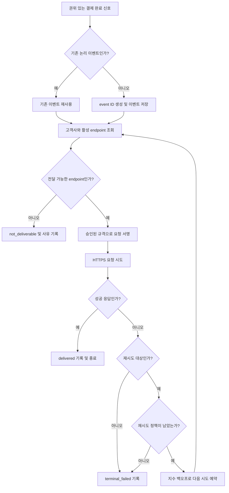

# 결제 완료 웹훅 전달 API PRD

## Applicability

| Contract | Required / N/A | Evidence |
|---|---|---|
| Pages/routes or screen IDs | N/A | 이번 범위에는 사용자 UI가 없으며 endpoint 등록은 기존 내부 API가 담당한다. |
| Empty/loading/error/success/recovery state matrix | N/A | 사용자에게 노출되는 화면이나 UI 상태가 없다. 전달 상태는 서버 내부 상태로 관리한다. |
| Mermaid user or system flow | Required | 결제 완료 감지, 이벤트 저장, 서명, 전달, 성공 또는 재시도로 이어지는 다단계 시스템 수명주기가 존재한다. |

## Context and problem

결제 완료 사실을 고객사 시스템에 비동기로 전달할 수단이 필요하다. 고객사 endpoint가 일시적으로 응답하지 않거나 네트워크 장애가 발생할 수 있으므로 최초 전달 실패 시 재시도가 필요하다.

전달 방식은 최소 1회(at-least-once)이며 동일 이벤트가 중복 전달될 수 있다. 따라서 고객사는 이벤트를 식별하고 중복 처리를 방지할 수 있어야 한다.

웹훅 서명 방식과 secret rotation 정책, 처리량 및 지연 SLA는 아직 확정되거나 측정되지 않았다. 해당 값을 근거 없이 본 PRD에서 확정하지 않는다.

## Goals

- 결제가 완료되면 해당 고객사의 등록된 HTTPS endpoint로 웹훅을 전달한다.
- 모든 유효한 이벤트에 대해 최소 한 번의 전달 시도를 보장한다.
- 일시적 네트워크 실패에 지수 백오프 재시도를 적용한다.
- 모든 재시도에서 동일한 event ID를 제공한다.
- 고객사별 endpoint, payload, secret 및 전달 이력을 격리한다.
- 향후 운영과 SLA 수립에 필요한 전달 결과 및 지연 데이터를 측정한다.
- 보안 담당자가 확정한 서명 및 secret rotation 정책을 프로덕션 출시 전에 적용한다.

## Non-goals

- endpoint 등록·수정·삭제 API 신규 개발
- endpoint 관리 UI
- 웹훅 전달 이력 또는 replay 대시보드
- 운영자나 고객사의 수동 재전송
- 정확히 한 번(exactly-once) 처리 보장
- 이벤트 간 전달 순서 보장
- 고객사 비즈니스 로직의 중복 처리 방지 구현
- 근거가 없는 처리량, 가용성 또는 전달 지연 SLA 설정
- 결제 완료 이외의 이벤트 유형 지원

## Users, roles, and permissions

| 역할 | 책임 및 권한 |
|---|---|
| 결제 시스템 | 권위 있는 결제 완료 신호와 결제·고객사 식별자를 제공한다. |
| 웹훅 전달 서비스 | 이벤트 생성, 고객사 endpoint 조회, 서명, 전달, 재시도 및 결과 기록을 수행한다. |
| endpoint 등록 내부 API | 고객사에 귀속된 활성 HTTPS endpoint와 서명에 필요한 secret 정보를 제공한다. |
| 고객사 수신 시스템 | 웹훅을 수신하고 서명을 검증하며 event ID를 기준으로 중복 처리를 방지한다. |
| 내부 운영자 | 서버 로그와 지표를 통해 실패를 조사할 수 있다. 수동 재전송 권한은 1차 출시에 없다. |
| 보안 담당자 | 서명 규격, secret 저장·배포·교체·폐기 정책을 승인한다. |

## Functional requirements

| ID | Requirement | Priority |
|---|---|---|
| FR-001 | 시스템은 권위 있는 결제 완료 신호를 수신하면 해당 결제와 고객사에 귀속된 `payment.completed` 이벤트를 생성해야 한다. 동일한 결제 완료 신호를 중복 소비하더라도 별개의 논리 이벤트를 중복 생성하지 않아야 한다. | Must |
| FR-002 | 이벤트는 최초 외부 전달을 시도하기 전에 내구성 있게 저장되어야 하며, 고객사 ID, event ID, 이벤트 유형, 생성 시각, payload 버전 및 결제 식별자와 연결되어야 한다. | Must |
| FR-003 | event ID는 시스템 전체에서 고유하고 변경 불가능해야 한다. 동일 이벤트의 최초 전달과 모든 재시도는 같은 event ID와 동일한 논리 payload를 사용해야 한다. | Must |
| FR-004 | 요청은 최소한 event ID, 이벤트 유형, 이벤트 생성 시각, payload 스키마 버전 및 결제 완료 데이터를 포함해야 한다. 정확한 필드와 개인정보 포함 범위는 출시 전 확정된 버전 계약을 따라야 한다. | Must |
| FR-005 | 시스템은 이벤트에 귀속된 고객사의 활성 HTTPS endpoint만 조회하여 전달해야 한다. endpoint가 없거나 비활성 상태이면 외부 요청을 보내지 않고 그 사유를 내부 상태로 기록해야 한다. | Must |
| FR-006 | 각 유효한 이벤트에 대해 최소 한 번의 전달 시도를 수행해야 한다. 고객사 endpoint가 처리 가능한 상태로 재시도 허용 기간 내 복구된 경우, 일시적 실패 때문에 이벤트가 즉시 유실되어서는 안 된다. | Must |
| FR-007 | 재시도 대상으로 분류된 실패에는 설정 가능한 지수 백오프를 적용해야 한다. 초기 간격, 배수, 최대 간격, 요청 timeout, jitter, 최대 시도 횟수 또는 재시도 기간은 하드코딩하지 않고 출시 전 확정된 정책으로 설정 가능해야 한다. | Must |
| FR-008 | 성공, 재시도 대기, 최종 실패를 구분해야 한다. 동일 이벤트가 성공한 후에는 자동 재시도를 계속하지 않아야 한다. | Must |
| FR-009 | 모든 요청에는 고객사가 출처와 무결성을 검증할 수 있는 서명이 포함되어야 한다. 서명 알고리즘, 헤더, canonicalization 및 검증 허용 시간은 보안 담당자가 승인한 규격을 따른다. 승인 전 프로덕션 출시는 불가하다. | Must |
| FR-010 | 시스템은 보안 담당자가 승인한 secret rotation 정책을 지원해야 한다. 교체 주기, 이전 secret의 중첩 허용 기간 및 긴급 폐기 동작은 확정 전 임의 구현하지 않는다. | Must |
| FR-011 | 전달 시도마다 event ID, 고객사 ID, endpoint 식별자, 시도 번호, 시도 시각, 결과 분류, HTTP 상태 코드(있는 경우), 소요 시간 및 다음 재시도 시각을 기록해야 한다. secret과 민감한 payload 원문은 로그에 남기지 않아야 한다. | Must |
| FR-012 | 고객사 응답 body는 전달 성공 판단에 필요하지 않으며, 민감정보 유입을 방지하기 위해 기본 운영 로그에 저장하지 않아야 한다. | Should |
| FR-013 | 내부 운영자는 고객사 범위를 명시한 서버 측 권한 검사를 통과한 경우에만 전달 상태를 조회할 수 있다. 1차 출시에서는 조회 결과를 이용한 수동 재전송 기능을 제공하지 않는다. | Must |

## Pages and routes

N/A — 사용자에게 노출되는 화면이나 route가 없다.

## State matrix

N/A — 사용자 UI 상태가 없다. 서버 내부 전달 상태는 `pending`, `in_progress`, `retry_scheduled`, `delivered`, `terminal_failed`, `not_deliverable`로 관리한다. 구체적인 저장 모델과 상태명은 구현 세부사항이지만 다음 전이는 보장되어야 한다.

- 성공한 이벤트는 다시 자동 전달되지 않는다.
- 재시도 대상 실패는 다음 시각과 함께 대기 상태가 된다.
- 재시도 정책을 소진한 이벤트는 최종 실패 상태가 된다.
- endpoint가 없거나 비활성인 이벤트는 전달 불가 사유가 기록된다.

## User or system flow

## Authorization and data boundaries

- 모든 이벤트, endpoint, secret 및 전달 이력은 반드시 하나의 고객사 ID에 귀속되어야 한다.
- 고객사 ID는 외부 요청 값만 신뢰하지 않고 인증된 내부 결제 및 endpoint 데이터에서 결정해야 한다.
- endpoint 조회 시 이벤트의 고객사 ID와 endpoint 소유 고객사 ID가 일치해야 한다. 불일치하면 전달을 차단하고 보안 이벤트로 기록한다.
- 한 고객사의 작업 큐, 조회 또는 캐시 키를 통해 다른 고객사의 endpoint, secret, payload 또는 전달 이력이 반환되어서는 안 된다.
- secret은 승인된 비밀 저장소 또는 동등한 보호 수단으로 보관하고 일반 데이터 저장소·로그·메트릭에 평문으로 노출하지 않는다.
- 운영자 조회 권한은 서버에서 검사해야 하며 로그 또는 UI의 숨김만으로 권한을 대체할 수 없다.
- HTTPS 인증서 검증을 비활성화해서는 안 된다.
- redirect 허용 여부, 사설 네트워크 endpoint 정책 및 SSRF 방어 규칙은 보안 담당자의 출시 전 결정이 필요하다.

## Non-functional requirements

| ID | Requirement |
|---|---|
| NFR-001 | 이벤트 저장 및 전달 예약은 프로세스 재시작이나 일시적 작업자 장애로 이벤트가 조용히 유실되지 않도록 복구 가능해야 한다. |
| NFR-002 | 전달 처리량, 최초 시도 지연, 성공까지 걸린 시간, 시도 횟수, 결과 분류 및 재시도 큐 적체량을 측정할 수 있어야 한다. |
| NFR-003 | 1차 출시 전 부하 및 장애 주입 시험을 수행하되, 측정 전 처리량이나 지연 SLA를 선언하지 않는다. |
| NFR-004 | payload 스키마는 명시적으로 버전 관리해야 하며, 동일 버전의 필드 의미를 호환되지 않게 변경해서는 안 된다. |
| NFR-005 | 로그, 메트릭 및 오류 메시지는 secret, 서명 원문, 결제수단 정보 등 민감정보를 포함하지 않아야 한다. |
| NFR-006 | 한 고객사의 느리거나 실패하는 endpoint가 다른 고객사의 전달을 무기한 차단하지 않도록 고객사별 작업 격리 또는 동등한 보호를 제공해야 한다. 구체적인 동시성 수치는 측정 후 결정한다. |

## Acceptance criteria

| ID | Requirement | Given | When | Then | Verification |
|---|---|---|---|---|---|
| AC-001 | FR-001, FR-002 | 유효한 고객사와 결제 완료 신호가 있고 같은 논리 신호가 중복 수신됨 | 이벤트 생성 처리가 반복 실행됨 | 하나의 논리 이벤트와 하나의 event ID만 생성되고 외부 시도 전에 저장됨 | 통합 테스트 |
| AC-002 | FR-003, FR-004 | 하나의 저장된 이벤트가 있음 | 최초 요청과 재시도 요청을 캡처함 | 두 요청의 event ID, 이벤트 유형, 생성 시각, 스키마 버전 및 논리 payload가 동일함 | 계약 테스트 |
| AC-003 | FR-005, FR-013 | A 고객사의 이벤트와 A·B 고객사의 endpoint가 존재함 | A 이벤트를 전달함 | A의 활성 HTTPS endpoint만 선택되고 B의 endpoint로 요청이 전송되지 않음 | 테넌트 격리 통합 테스트 |
| AC-004 | FR-005 | endpoint가 없거나 비활성인 고객사의 이벤트가 있음 | 전달 작업을 실행함 | 외부 요청 없이 `not_deliverable` 상태와 사유가 기록됨 | 통합 테스트 |
| AC-005 | FR-006, FR-007 | endpoint의 첫 요청에서 timeout이 발생하고 이후 성공 응답을 반환함 | 전달 작업과 예약된 재시도가 실행됨 | 최초 시도가 기록되고 지수 백오프 후 동일 event ID로 재시도되어 성공함 | 장애 주입 테스트 |
| AC-006 | FR-007 | 연속된 재시도 대상 실패가 발생함 | 재시도가 예약됨 | 각 간격이 승인된 지수 백오프 설정을 따르며 설정값 변경에 코드 수정이 필요하지 않음 | 단위 및 구성 테스트 |
| AC-007 | FR-008 | endpoint가 성공으로 정의된 응답을 반환함 | 전달 결과를 처리함 | 이벤트가 `delivered`가 되고 추가 자동 재시도가 예약되지 않음 | 통합 테스트 |
| AC-008 | FR-008 | 재시도 불가 응답 또는 재시도 정책 소진이 발생함 | 결과를 처리함 | 이벤트가 `terminal_failed`가 되고 정확한 결과 분류와 시도 이력이 남음 | 통합 테스트 |
| AC-009 | FR-009 | 보안 승인 서명 규격과 공식 테스트 벡터가 있음 | 웹훅 요청을 생성함 | 생성된 서명이 테스트 벡터와 일치하며 payload 변조 시 검증에 실패함 | 보안 계약 테스트 |
| AC-010 | FR-010 | 승인된 rotation 정책에 따라 secret 교체가 진행됨 | 정책이 정의한 교체 전·중·후 요청을 검증함 | 각 단계의 서명과 폐기 동작이 승인 정책 및 테스트 벡터를 충족함 | 보안 통합 테스트 |
| AC-011 | FR-011, FR-012 | 성공, timeout, HTTP 오류가 각각 발생함 | 전달 시도 이력을 조회함 | 필수 메타데이터와 결과가 기록되며 secret, 서명 원문 및 고객사 응답 body는 기록되지 않음 | 로그 검사 |
| AC-012 | NFR-001 | 이벤트 저장 이후 작업자가 비정상 종료됨 | 작업자가 복구됨 | 성공 처리되지 않은 이벤트가 복구되어 승인된 정책에 따라 다시 시도됨 | 복구 테스트 |
| AC-013 | NFR-002, NFR-003 | 대표 부하 및 실패 시나리오가 정의됨 | 출시 전 성능 시험을 수행함 | 처리량·지연·성공률·큐 적체 측정 결과가 기록되며 근거 없는 SLA가 릴리스 기준에 포함되지 않음 | 성능 시험 보고서 |
| AC-014 | NFR-006 | A 고객사의 endpoint가 지속적으로 느리고 B 고객사의 endpoint는 정상임 | 두 고객사의 이벤트를 동시에 처리함 | A의 장애가 B의 전달 작업을 무기한 차단하지 않음 | 격리 부하 테스트 |

## Assumptions and open decisions

### 합리적 가정

| ID | 가정 | 변경 시 영향 |
|---|---|---|
| A-001 | 결제 시스템은 동일한 논리적 결제 완료를 식별할 수 있는 안정적인 원본 식별자를 제공한다. | 제공되지 않으면 FR-001의 중복 이벤트 생성을 막기 위한 별도 deduplication key가 필요하다. |
| A-002 | 웹훅 전달은 결제 완료 처리의 응답 경로를 막지 않는 비동기 작업이다. | 동기 전달이 필요하면 결제 API의 장애 전파와 지연 정책을 다시 설계해야 한다. |
| A-003 | HTTP `2xx`를 전달 성공으로 본다. 연결·DNS·TLS·timeout과 `429`, `5xx`는 재시도 대상으로, 그 밖의 `4xx`는 기본적으로 최종 실패로 본다. | 응답 분류 정책에 따라 재시도량과 고객사 장애 복구 가능성이 달라진다. 출시 전 확인이 필요하다. |
| A-004 | 1차 출시에서는 서로 다른 이벤트 간 순서를 보장하지 않는다. | 순서 보장이 필요하면 고객사·결제별 직렬화와 head-of-line blocking 정책이 필요하다. |
| A-005 | 기존 내부 API가 endpoint의 고객사 소유권과 기본 HTTPS 형식을 검증한다. 전달 서비스도 조회 결과의 고객사 일치와 TLS 인증서는 독립적으로 확인한다. | 기존 API가 이를 보장하지 않으면 등록·조회 계약 보강이 선행되어야 한다. |
| A-006 | “최소 1회”는 모든 저장된 이벤트에 최소 한 번 요청을 시도하고, 승인된 재시도 기간 동안 일시적 장애에서 복구하는 의미다. endpoint가 영구적으로 불가용한 경우 실제 수신까지 무한 보장한다는 의미는 아니다. | 무기한 전달 보장이 필요하면 보존 비용과 운영 복구 기능 범위가 크게 달라진다. |

### 열린 결정

| ID | 결정 사항 | 담당 | 결정 시점 |
|---|---|---|---|
| OD-001 | 서명 알고리즘, 서명 대상, 헤더 이름, canonicalization, timestamp 및 replay 허용 범위 | 보안 담당자 | 보안 구현 시작 전, 프로덕션 출시 필수 |
| OD-002 | secret 생성·배포 방식, rotation 주기, 중첩 허용 기간, 긴급 폐기 및 고객사 통지 방식 | 보안 담당자 | secret 관리 구현 전, 프로덕션 출시 필수 |
| OD-003 | 초기 백오프, 배수, 최대 간격, jitter, 요청 timeout, 최대 시도 횟수 또는 재시도 기간, 실패 이벤트 보존 기간 | 백엔드 책임자·SRE·제품 담당자 | 통합 테스트 전 |
| OD-004 | 결제 완료의 정확한 발생 조건: 승인, 매입, 비동기 확정, 부분 결제 또는 다중 매입 처리 | 결제 도메인 책임자·제품 담당자 | 이벤트 producer 구현 전 |
| OD-005 | payload 필드, 금액·통화 표현, 결제 식별자, 개인정보 포함 여부와 스키마 버전 | 결제 도메인 책임자·보안 담당자 | 계약 테스트 작성 전 |
| OD-006 | 재시도 중 endpoint가 변경된 경우 최초 endpoint를 유지할지 최신 활성 endpoint를 사용할지 | 제품 담당자·백엔드 책임자 | 전달 데이터 모델 확정 전 |
| OD-007 | `429`, `5xx` 및 각 `4xx`의 최종 재시도 분류와 `Retry-After` 준수 여부 | 백엔드 책임자·SRE | 재시도 구현 전 |
| OD-008 | redirect 허용 여부, DNS 재해석 방어, 사설·loopback·link-local 주소 허용 정책 등 outbound SSRF/egress 정책 | 보안 담당자 | 네트워크 연동 전 |
| OD-009 | 처리량과 지연의 기준선, 목표치 및 SLA 설정 여부 | 제품 담당자·SRE | 실제 부하 측정 및 초기 운영 데이터 확보 후 |

## Risks and mitigations

| Risk | Impact | Mitigation |
|---|---|---|
| 고객사가 중복 이벤트를 비멱등하게 처리 | 중복 청구 후속 작업 또는 중복 알림 | 안정적인 event ID 제공, 모든 재시도에서 ID 유지, 고객사 연동 문서에 deduplication 요구 명시 |
| 결제 완료 신호 중복으로 별도 이벤트 생성 | event ID가 달라 고객사가 중복임을 식별하지 못함 | 원본 결제 완료 식별자 기반으로 논리 이벤트 생성을 멱등하게 처리 |
| 장기 장애 endpoint로 재시도 적체 | 정상 고객사 전달 지연 및 비용 증가 | 재시도 한도와 보존 정책 확정, 고객사별 격리, 적체 지표와 경보 |
| 서명·rotation 미확정 상태로 출시 | 위조 요청 또는 secret 노출 대응 실패 | OD-001과 OD-002 승인 및 보안 테스트를 출시 차단 조건으로 설정 |
| 테넌트 매핑 오류 | 다른 고객사로 결제 데이터 유출 | 서버 측 소유권 검사, 복합 tenant key, 교차 고객사 통합 테스트 |
| payload에 과도한 결제 정보 포함 | 개인정보 또는 결제정보 노출 | 최소 필드 원칙, OD-005 보안 검토, 로그 redaction |
| 악성 endpoint 등록 | SSRF 또는 내부망 접근 | HTTPS/TLS 검증과 승인된 egress 정책 적용, redirect 및 DNS 정책 보안 검토 |
| SLA 없이 운영 상태 판단이 어려움 | 지연과 용량 문제를 늦게 발견 | 출시일부터 실제 지표를 수집하고 측정 결과에 근거해 SLA를 별도 결정 |

## Delivery

| Phase | Requirement IDs | Verifiable exit condition |
|---|---|---|
| 0. 계약 및 보안 결정 | FR-004, FR-007, FR-009, FR-010, FR-011 | OD-001~OD-008 담당자 승인, payload·서명·재시도 테스트 벡터 확정 |
| 1. 이벤트 및 전달 엔진 | FR-001~FR-008, NFR-001, NFR-004 | AC-001~AC-008 및 AC-012 통과 |
| 2. 보안·격리·운영 계측 | FR-009~FR-013, NFR-002, NFR-005, NFR-006 | AC-009~AC-011 및 AC-014 통과, 보안 검토 승인 |
| 3. 출시 검증 | NFR-002, NFR-003, NFR-006 | 장애·복구·격리·부하 시험 완료, 측정 결과 기록, 미확정 서명·rotation 결정이 없음 |
| 4. 출시 후 기준선 수립 | NFR-002, NFR-003 | 실제 처리량과 지연 분포를 검토하고 OD-009를 결정하거나 추가 측정 계획을 승인 |

문서를 파일로 저장하지 않았으므로 PRD 파일 validator는 실행하지 않았다.