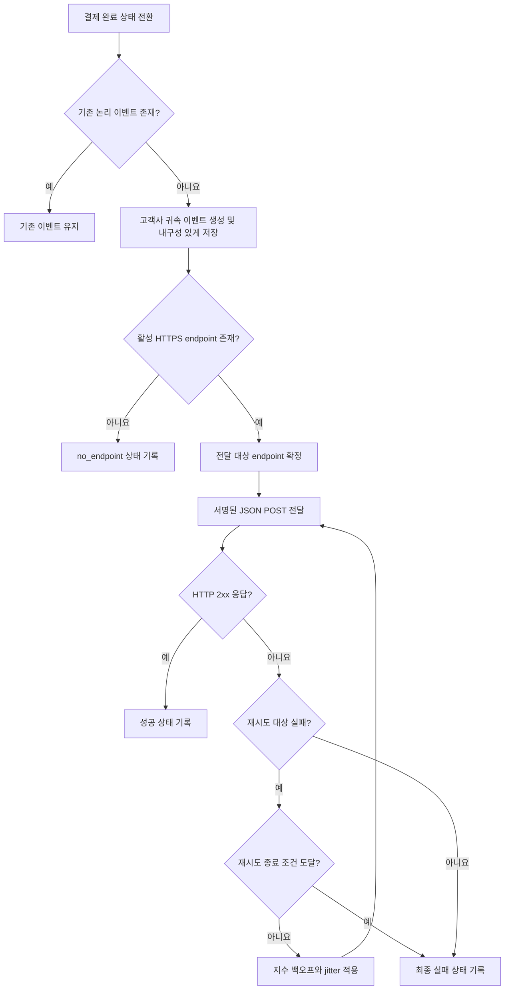

# 결제 완료 웹훅 전달 API PRD

## Applicability

| Contract | Required / N/A | Evidence |
|---|---|---|
| Pages/routes or screen IDs | N/A | 이번 범위에는 UI가 없으며 endpoint 등록도 기존 내부 API가 담당한다. |
| Empty/loading/error/success/recovery state matrix | N/A | 사용자에게 노출되는 화면이나 상태가 없다. 전달 상태는 내부 시스템 상태로 관리한다. |
| Mermaid user or system flow | Required | 결제 완료 감지, 이벤트 생성, 전달, 재시도로 이어지는 다단계 시스템 생명주기가 존재한다. |

## Context and problem

결제가 완료되면 해당 고객사가 등록한 HTTPS endpoint로 `payment.completed` 이벤트를 전달해야 한다.

네트워크 오류나 처리 중 장애가 발생해도 이벤트가 유실되지 않아야 하며, 최소 1회 전달 특성상 고객사가 동일 이벤트를 중복 수신할 수 있다. 따라서 모든 전달 시도에서 변하지 않는 event ID를 제공해야 한다.

고객사별 endpoint, 이벤트 payload, secret 및 전달 이력은 다른 고객사와 격리되어야 한다.

서명 방식, secret rotation 정책, 재시도 세부 파라미터, 처리량 및 지연 SLA는 아직 확정되지 않았다. 이 PRD는 확정된 요구사항과 합리적 가정을 구현 계약으로 정의하고, 출시 전 결정이 필요한 항목은 별도로 명시한다.

## Goals

- 결제 완료 이벤트를 등록된 고객사 HTTPS endpoint에 자동 전달한다.
- 전달 대상 이벤트를 장애에도 유실되지 않도록 내구성 있게 관리한다.
- 네트워크 실패 시 지수 백오프로 자동 재시도한다.
- 중복 수신을 식별할 수 있는 안정적인 event ID를 제공한다.
- 고객사 간 endpoint, 이벤트 데이터, secret 및 전달 이력을 격리한다.
- 처리량, 지연, 성공률 및 재시도 현황을 측정할 수 있게 한다.

## Non-goals

- endpoint 등록·수정·삭제 API 개발
- 고객사용 또는 운영자용 UI
- replay 대시보드
- 수동 재전송 기능
- 이벤트 전달 순서 보장
- 정확히 1회(exactly-once) 전달
- 확정 근거가 없는 처리량·지연 SLA 설정
- 결제 완료 이외의 이벤트 타입 지원

## Users, roles, and permissions

| 역할 | 권한과 책임 |
|---|---|
| 결제 시스템 | 결제가 완료 상태로 전환되었음을 전달하고 웹훅 이벤트 생성을 유발한다. |
| 웹훅 전달 서비스 | 고객사 endpoint 조회, 이벤트 보관, 서명, 전송 및 재시도를 수행한다. |
| endpoint 관리 내부 API | 고객사에 귀속된 활성 HTTPS endpoint와 관련 secret 정보를 관리한다. |
| 고객사 수신 서버 | 이벤트를 수신하고 event ID를 기준으로 중복 처리를 방지한다. |
| 내부 운영자 | 운영상 필요한 전달 상태와 오류를 확인할 수 있다. 1차 출시에서는 수동 재전송할 수 없다. |

## Functional requirements

| ID | Requirement | Priority |
|---|---|---|
| FR-01 | 결제가 처음 완료 상태로 전환되면 해당 결제에 대한 논리적 `payment.completed` 이벤트를 생성해야 한다. 동일한 완료 전환이 중복 입력되어도 새로운 논리적 이벤트를 중복 생성해서는 안 된다. | Must |
| FR-02 | 이벤트에는 전역적으로 고유하고 생성 후 변경되지 않는 `event_id`가 있어야 한다. 같은 이벤트의 최초 전달과 모든 재시도는 동일한 `event_id`를 사용해야 한다. | Must |
| FR-03 | 이벤트 payload는 최소한 `event_id`, `event_type`, `schema_version`, `occurred_at`, `data.payment_id`, `data.status`를 포함해야 한다. `event_type`은 `payment.completed`, `data.status`는 `completed`로 한다. | Must |
| FR-04 | 결제 완료 처리와 이벤트 전달 예약 사이의 장애로 이벤트가 유실되지 않아야 한다. 프로세스 종료나 일시적 인프라 장애 후에도 미전달 이벤트를 다시 처리할 수 있어야 한다. | Must |
| FR-05 | 이벤트 생성 시점에 해당 고객사에 활성화된 HTTPS endpoint가 있으면 그 endpoint를 전달 대상으로 확정해야 한다. 재시도 중 endpoint 설정이 변경되더라도 기존 이벤트의 대상은 바뀌지 않는다. | Must |
| FR-06 | 전달 서비스는 확정된 endpoint에 HTTPS `POST` 요청으로 JSON payload를 전송해야 한다. 정상적인 TLS 인증서 검증을 우회해서는 안 된다. | Must |
| FR-07 | endpoint가 유효한 HTTP `2xx` 응답을 반환하면 해당 이벤트 전달을 성공으로 기록하고 자동 재시도를 종료해야 한다. | Must |
| FR-08 | DNS·연결·TLS·요청 전송·응답 대기 과정에서 네트워크 실패나 timeout이 발생하면 지수 백오프로 자동 재시도해야 한다. 동시 재시도 집중을 줄이기 위해 jitter를 적용한다. | Must |
| FR-09 | 각 전달 시도에는 내부적으로 구분 가능한 attempt 번호 또는 attempt ID를 기록해야 한다. 전달 횟수가 달라도 외부 payload의 `event_id`는 유지되어야 한다. | Must |
| FR-10 | 재시도가 설정된 종료 조건에 도달하면 이벤트를 최종 실패 상태로 기록하고 자동 재시도를 중단해야 한다. 종료 조건과 보관 정책은 출시 전 열린 결정 OD-03으로 확정한다. | Must |
| FR-11 | 활성 endpoint가 없는 고객사의 결제 완료 이벤트는 외부 전송을 시도하지 않고 `no_endpoint` 상태와 사유를 기록해야 한다. endpoint가 나중에 등록되어도 1차 출시에서는 해당 이벤트를 자동 replay하지 않는다. | Must |
| FR-12 | endpoint, event, payload, secret, delivery attempt 및 상태 데이터는 모두 고객사 식별자에 귀속되어야 한다. 조회와 처리 시 서버 측에서 고객사 소유권을 검증해야 한다. | Must |
| FR-13 | production 전달 요청에는 보안 담당자가 승인한 무결성·발신자 검증용 서명을 포함해야 한다. 서명 알고리즘, 헤더 형식, timestamp 및 secret rotation 동작은 OD-01과 OD-02 확정 후 구현한다. | Must |
| FR-14 | 고객사 수신 서버가 중복 수신을 안전하게 처리할 수 있도록 API 문서에 event ID 기반 멱등 처리 필요성과 전달 순서가 보장되지 않음을 명시해야 한다. | Must |
| FR-15 | 이벤트 생성 시각, 최초·최근 시도 시각, 시도 횟수, 성공·실패 상태, HTTP 상태 코드, 표준화된 오류 분류를 내부적으로 기록해야 한다. secret, 서명 원문 및 민감한 결제 정보는 로그에 남기지 않는다. | Must |
| FR-16 | payload에 카드번호, 인증정보, secret 등 이벤트 처리에 불필요한 결제·보안 민감정보를 포함해서는 안 된다. | Must |

## Pages and routes

N/A — 사용자에게 노출되는 화면이 없다.

## State matrix

N/A — 사용자에게 노출되는 화면 상태가 없다.

## User or system flow

## Authorization and data boundaries

- 모든 endpoint, event, attempt 및 secret 레코드는 반드시 `customer_id`에 귀속되어야 한다.
- 전달 작업은 event의 `customer_id`와 endpoint의 `customer_id`가 일치할 때만 실행해야 한다.
- 고객사 식별자는 요청 payload나 작업 메시지의 값만 신뢰하지 않고, 서버 측 저장 데이터와 대조해야 한다.
- 고객사 A의 endpoint, payload, 전달 상태, 오류 상세 또는 secret이 고객사 B의 조회·전달·로그에 노출되어서는 안 된다.
- secret은 평문 로그에 남기지 않으며, 저장 및 접근은 조직의 secret 관리 기준을 따라야 한다.
- endpoint 관리 내부 API는 고객사 소유권 확인과 HTTPS URL 검증을 수행해야 한다. 사설망·메타데이터 주소 등 내부 자원에 대한 서버 측 요청 위조 방지 정책은 보안 담당자의 승인을 받아야 한다.
- 내부 운영자 접근은 업무상 필요한 최소 권한으로 제한하고 감사 가능한 주체 정보를 남겨야 한다.
- production에서는 서명 방식이 확정·승인되기 전 unsigned 웹훅을 허용하지 않는다.

## Non-functional requirements

### 신뢰성

- 이벤트 저장 이후 전달 프로세스가 재시작되어도 미완료 이벤트를 다시 처리할 수 있어야 한다.
- 전달은 최소 1회 시도되며, 중복 전달이 발생할 수 있다.
- 정확히 1회 전달이나 이벤트 간 순서는 보장하지 않는다.
- 네트워크 실패 재시도는 지수 백오프와 jitter를 사용한다.

### 보안

- HTTPS만 허용하고 TLS 인증서를 정상적으로 검증한다.
- production 요청에는 승인된 서명을 적용한다.
- secret과 민감정보를 로그 및 오류 메시지에서 마스킹한다.
- 고객사 데이터 격리를 서버 측에서 강제한다.

### 관측 가능성

다음 지표를 수집해야 하지만, 근거가 확보되기 전 목표 수치는 설정하지 않는다.

- 결제 완료부터 이벤트 생성까지의 지연
- 이벤트 생성부터 최초 전달 시도까지의 지연
- 이벤트 생성부터 성공 응답까지의 종단 간 지연
- 전달 시도 및 성공·실패 건수
- 재시도 횟수와 최종 실패 건수
- 오류 유형 및 HTTP 응답 코드 분포
- 대기 중인 이벤트 수와 가장 오래 대기한 이벤트의 경과 시간

처리량 및 지연 SLA는 실제 트래픽 측정 결과를 기반으로 별도 승인한다.

## Acceptance criteria

| ID | Requirement | Given | When | Then | Verification |
|---|---|---|---|---|---|
| AC-01 | FR-01, FR-02 | 고객사에 활성 endpoint가 있고 결제가 완료되지 않은 상태이다. | 결제가 완료 상태로 전환된다. | 하나의 이벤트와 고유한 `event_id`가 생성되고 전달 대상으로 예약된다. | 통합 테스트 및 저장 데이터 확인 |
| AC-02 | FR-01, FR-02 | 동일 결제 완료 전환에 대한 이벤트가 이미 존재한다. | 동일한 완료 입력이 다시 처리된다. | 새로운 논리 이벤트나 새로운 `event_id`가 생성되지 않는다. | 중복 입력 통합 테스트 |
| AC-03 | FR-03, FR-06 | 전달 가능한 이벤트가 존재한다. | 고객사 endpoint로 전송한다. | HTTPS POST의 JSON payload에 필수 envelope와 결제 식별 정보가 포함된다. | 계약 테스트 |
| AC-04 | FR-04 | 이벤트가 저장되었지만 전달 성공 전 프로세스가 종료된다. | 전달 서비스가 복구된다. | 기존 이벤트가 유실되지 않고 다시 전달 대상이 된다. | 장애 주입 통합 테스트 |
| AC-05 | FR-05 | 이벤트 생성 당시 endpoint A가 활성 상태이다. | 이벤트 생성 후 설정이 endpoint B로 변경되고 기존 이벤트가 재시도된다. | 기존 이벤트는 endpoint A로 재시도된다. | 통합 테스트 |
| AC-06 | FR-07 | endpoint가 요청에 HTTP 2xx로 응답한다. | 전달 시도가 완료된다. | 이벤트가 성공 상태가 되고 추가 자동 재시도가 예약되지 않는다. | 통합 테스트 |
| AC-07 | FR-08, FR-09 | 최초 전달에서 네트워크 실패가 발생한다. | 재시도 조건이 충족된다. | 지수 백오프와 jitter가 적용된 다음 시도가 예약되고 동일한 `event_id`가 사용된다. | 시간 제어 기반 통합 테스트 |
| AC-08 | FR-10 | 이벤트가 확정된 재시도 종료 조건에 도달한다. | 마지막 시도도 실패한다. | 이벤트가 최종 실패로 기록되고 추가 자동 재시도가 생성되지 않는다. | 재시도 정책 테스트 |
| AC-09 | FR-11 | 결제 완료 시 고객사에 활성 endpoint가 없다. | 이벤트 생성 절차가 실행된다. | 외부 요청 없이 `no_endpoint` 상태와 사유가 기록되며 이후 endpoint 등록만으로 자동 replay되지 않는다. | 통합 테스트 |
| AC-10 | FR-12 | 서로 다른 두 고객사의 endpoint와 이벤트가 존재한다. | 한 고객사의 전달 작업 또는 조회가 수행된다. | 다른 고객사의 endpoint, payload, secret 또는 전달 이력에 접근하거나 전송할 수 없다. | 권한·테넌시 음성 테스트 |
| AC-11 | FR-13 | 보안 담당자가 서명 규격을 승인했다. | production 웹훅을 전송한다. | 승인 규격에 맞는 서명이 포함되고 고객사가 문서화된 절차로 검증할 수 있다. | 고정 테스트 벡터 기반 계약 테스트 및 보안 검토 |
| AC-12 | FR-15, FR-16 | 성공, HTTP 오류, 네트워크 오류가 각각 발생한다. | 전달 결과가 기록된다. | 상태, 시각, 시도 횟수 및 표준 오류 분류는 조회 가능하고 secret과 금지된 민감정보는 로그에 존재하지 않는다. | 통합 테스트 및 로그 검사 |
| AC-13 | FR-14 | 같은 이벤트가 두 번 전달된다. | 두 요청을 비교한다. | 두 요청의 `event_id`는 같으며 문서에 이를 멱등 키로 사용하도록 명시되어 있다. | 계약 및 문서 검토 |
| AC-14 | NFR 관측 가능성 | 테스트 이벤트가 생성되고 성공 또는 실패한다. | 지표 수집 결과를 확인한다. | 정의된 지연, 결과, 재시도 및 backlog 지표가 실제 실행 결과와 연결되어 기록된다. | 메트릭 통합 테스트 |

## Assumptions and open decisions

### 합리적 가정

| ID | Assumption | 영향 |
|---|---|---|
| AS-01 | 1차 출시에서는 고객사별 활성 endpoint가 최대 하나다. | 여러 endpoint fan-out은 지원하지 않는다. |
| AS-02 | 최소 1회 전달은 “성공 수신을 영구 보장”한다는 의미가 아니라, 활성 endpoint가 있는 이벤트를 내구성 있게 보관하고 최소 한 번 시도하며 정의된 실패 조건에서 재시도한다는 의미다. | 고객사 장애가 영구 지속되면 최종 실패할 수 있다. |
| AS-03 | 동일 결제의 동일 완료 전환은 하나의 논리 이벤트에 대응한다. | 상위 시스템의 중복 입력이 별도 event ID를 만들지 않는다. |
| AS-04 | endpoint는 이벤트 생성 시점의 값을 snapshot으로 고정한다. | 설정 변경이 진행 중인 재시도의 목적지를 바꾸지 않는다. |
| AS-05 | 1차 payload는 최소 이벤트 envelope와 `payment_id`, `status`만을 필수 계약으로 삼는다. | 금액, 통화, 주문정보 등 추가 필드는 별도 schema 결정 없이는 계약에 포함하지 않는다. |
| AS-06 | 이벤트 간 전달 순서는 보장하지 않는다. | 고객사는 `occurred_at`과 자신의 도메인 상태를 기준으로 처리해야 한다. |
| AS-07 | endpoint 등록 API와 고객사 인증 기능은 이미 존재한다. | 이번 구현은 해당 API의 소유권이 검증된 활성 endpoint를 소비한다. |

### 열린 결정

| ID | Decision needed | Owner | Decision point / release impact |
|---|---|---|---|
| OD-01 | 서명 알고리즘, canonical payload 규칙, 서명 헤더, timestamp 및 replay 방어 방식 | 보안 담당자 | 구현 완료 및 production 출시 전 필수 |
| OD-02 | secret 발급·저장·노출 방식, rotation 주기, 이전·신규 secret의 중첩 유효기간 및 폐기 절차 | 보안 담당자 | 구현 완료 및 production 출시 전 필수 |
| OD-03 | 최초 backoff, 배수, 최대 간격, jitter 방식, 최대 시도 횟수 또는 최대 재시도 기간, 요청 timeout | 플랫폼 책임자 + 제품 책임자 | 부하·복구 특성에 영향을 주므로 운영 리허설 전 필수 |
| OD-04 | HTTP 비-2xx 응답별 재시도 정책. 특히 408, 409, 425, 429 및 5xx의 처리 여부와 `Retry-After` 지원 여부 | 플랫폼 책임자 + API 책임자 | 재시도 로직과 고객 계약 확정 전 필수 |
| OD-05 | 이벤트 및 attempt 이력 보관 기간과 삭제·익명화 정책 | 데이터·보안 담당자 | production 데이터 보관 정책 승인 전 필수 |
| OD-06 | endpoint URL의 사설망, loopback, link-local, DNS rebinding 방지 규칙 | 보안 담당자 | production 보안 검토 전 필수 |
| OD-07 | 실제 트래픽 기준 처리량 목표와 전달 지연 SLA | 제품 책임자 + SRE | 계측 데이터 확보 후 결정. 근거 확보 전 출시 기준 수치로 사용하지 않음 |
| OD-08 | 추가 payment payload 필드와 schema 호환성·버전 변경 정책 | 결제 도메인 책임자 + API 책임자 | 외부 API 계약 공개 전 필수 |

## Risks and mitigations

| Risk | Impact | Mitigation |
|---|---|---|
| 동일 이벤트 중복 전달 | 고객사에서 결제 후속 처리가 중복 실행될 수 있음 | 안정적인 event ID 제공, 재시도 간 ID 유지, 고객사 멱등 처리 문서화 |
| 결제 완료와 이벤트 생성 사이 장애 | 이벤트 유실 | 원자적 저장 또는 동등한 내구성 패턴 적용, 복구 테스트 |
| 다수 이벤트의 동시 재시도 | 고객사 및 내부 시스템 부하 급증 | 지수 백오프, jitter, 재시도 파라미터 설정 가능 구조 및 backlog 관측 |
| endpoint 오설정 또는 장기 장애 | 반복 실패와 backlog 증가 | timeout, 종료 조건, 최종 실패 상태, 운영 지표와 경보 |
| 고객사 간 데이터 혼합 | 정보 유출 및 잘못된 endpoint 전송 | 모든 리소스의 고객사 귀속, 서버 측 소유권 검증, 교차 고객사 음성 테스트 |
| URL 기반 내부망 접근 | SSRF 및 내부 자원 노출 | HTTPS 검증과 OD-06 보안 정책 적용 |
| 서명·rotation 규격 미확정 | 고객사가 발신자와 payload 무결성을 검증할 수 없음 | OD-01·02를 production 출시 차단 조건으로 지정 |
| 근거 없는 SLA 설정 | 잘못된 용량 계획과 운영 약속 | 먼저 지표를 수집하고 실제 측정 후 SLA 승인 |
| 로그에 민감정보 노출 | 보안 사고 | payload 최소화, secret·민감정보 마스킹, 로그 검사 |

## Delivery

| Phase | Requirement IDs | Verifiable exit condition |
|---|---|---|
| 1. 이벤트 계약 및 내구성 | FR-01~FR-05, FR-11 | 중복 완료 입력, endpoint 부재, 프로세스 장애 복구에 관한 AC-01~AC-05와 AC-09 통과 |
| 2. 전달 및 재시도 | FR-06~FR-10 | OD-03·04가 승인되고 성공, 네트워크 실패, backoff, 종료 조건에 관한 AC-06~AC-08 통과 |
| 3. 보안 및 데이터 격리 | FR-12, FR-13, FR-16 | OD-01·02·06 승인, 교차 고객사 음성 테스트와 서명 계약 테스트 및 보안 검토 통과 |
| 4. 운영 관측 및 문서화 | FR-14, FR-15 | AC-12~AC-14 통과, 중복·순서·실패 의미와 수신자 멱등 처리 문서 공개 준비 완료 |
| 5. Production 출시 승인 | 전체 | 모든 Must AC 통과, 열린 결정 중 production 선행 항목 승인, rollback·장애 대응 절차 준비 완료. 처리량·지연 SLA는 측정 전 수치 없이 유지 가능 |