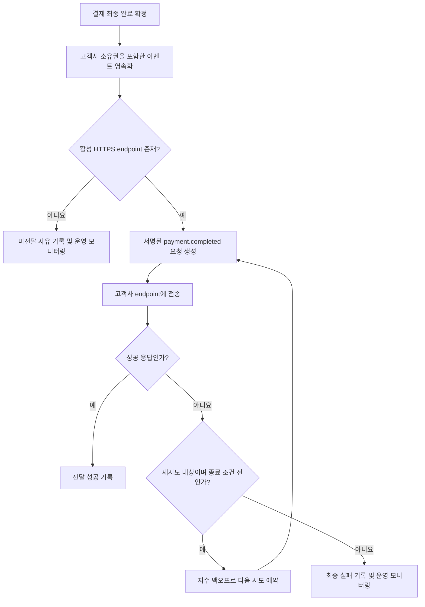

# 결제 완료 웹훅 전달 API PRD

## Applicability

| Contract | Required / N/A | Evidence |
|---|---|---|
| Pages/routes or screen IDs | N/A | 이번 범위에는 UI가 없으며 endpoint 등록은 기존 내부 API가 담당한다. |
| Empty/loading/error/success/recovery state matrix | N/A | 사용자 화면이 없는 서버 간 전달 기능이다. 전달 상태는 시스템 상태와 승인 조건으로 정의한다. |
| Mermaid user or system flow | Required | 결제 완료 감지, 이벤트 생성, 전달, 재시도라는 다단계 시스템 수명주기가 존재한다. |

## Context and problem

결제가 완료되면 해당 고객사가 사전에 등록한 HTTPS endpoint로 결제 완료 이벤트를 전달해야 한다.

네트워크 장애나 고객사 endpoint의 일시적 장애가 발생할 수 있으므로 전달 작업은 결제 처리 요청과 분리되어 내구성 있게 관리되어야 한다. 전달은 최소 1회(at-least-once) 방식이므로 고객사는 동일 이벤트를 여러 번 받을 수 있으며, 중복 처리를 방지할 수 있도록 재시도 전반에서 동일하게 유지되는 event ID가 필요하다.

서명 검증 방식과 secret rotation 정책은 아직 결정되지 않았다. 이 항목들은 외부 고객사에 실제 전달을 시작하기 전 확정되어야 하는 보안 출시 조건이다.

## Goals

- 확정된 결제 완료 건마다 올바른 고객사 endpoint에 웹훅 이벤트를 전달한다.
- 프로세스 재시작이나 일시적 네트워크 장애에도 전달 대상 이벤트가 유실되지 않게 한다.
- 네트워크 및 재시도 대상 오류에 지수 백오프를 적용한다.
- 모든 재시도에서 동일한 event ID를 제공해 고객사가 중복 이벤트를 식별할 수 있게 한다.
- 고객사별 endpoint, 이벤트, 결제 데이터 및 전달 이력을 격리한다.
- 전달 결과와 재시도 상태를 운영자가 내부적으로 관측할 수 있게 한다.
- 실제 측정 데이터를 수집해 향후 처리량 및 지연 SLA를 결정할 기반을 마련한다.

## Non-goals

- endpoint 등록·수정·삭제 API의 신규 구현
- endpoint 관리 UI
- replay 대시보드
- 운영자 또는 고객사의 수동 재전송 기능
- 고객사 시스템의 멱등성 구현
- 이벤트 간 전달 순서 보장
- 근거가 없는 처리량, 전달 지연 또는 가용성 SLA 설정
- 결제 완료 외 다른 이벤트 유형의 전달

## Users, roles, and permissions

| 주체 | 역할 및 권한 |
|---|---|
| 결제 시스템 | 결제의 최종 완료 상태를 확정하고 웹훅 이벤트 생성을 유발한다. |
| 웹훅 전달 서비스 | 고객사에 속한 이벤트와 활성 endpoint를 조회하고 전달·재시도 상태를 기록한다. 다른 고객사의 데이터에는 접근하거나 전달해서는 안 된다. |
| 고객사 endpoint | 자기 고객사에 속한 결제 완료 이벤트만 수신한다. event ID를 이용한 중복 제거 책임을 가진다. |
| 내부 운영자 | 기존 권한 체계 내에서 전달 상태와 오류를 진단할 수 있다. 이번 범위에서는 수동 재전송할 수 없다. |
| 보안 담당자 | 서명 방식, secret 수명주기, rotation 및 네트워크 송신 보안 정책을 확정한다. |

## Functional requirements

| ID | Requirement | Priority |
|---|---|---|
| FR-01 | 결제 시스템에서 결제가 최종 완료 상태로 확정된 건마다 `payment.completed` 이벤트를 정확히 하나 생성해야 한다. 동일 결제 완료 전환을 중복 소비하더라도 별개의 논리 이벤트가 추가 생성되어서는 안 된다. | P0 |
| FR-02 | 결제 완료 상태의 커밋이 성공했다면 대응하는 웹훅 이벤트가 프로세스 종료나 재시작으로 유실되지 않고 전달 대상으로 복구되어야 한다. 결제 커밋과 이벤트 영속화 사이의 유실 가능성을 제거해야 한다. | P0 |
| FR-03 | 각 논리 이벤트에는 시스템 전체에서 고유하고 변경되지 않는 `event_id`가 있어야 한다. 최초 시도와 모든 재시도는 같은 `event_id`를 사용해야 한다. | P0 |
| FR-04 | 최초 전달 시도는 이벤트가 생성될 당시 해당 고객사에 유효한 것으로 판정된 HTTPS endpoint만 대상으로 해야 한다. endpoint가 없거나 비활성 상태라면 외부 요청을 보내지 않고 사유를 기록해야 한다. | P0 |
| FR-05 | 웹훅 요청은 최소 `event_id`, `event_type`, `schema_version`, `occurred_at`, 결제 완료 데이터를 포함해야 한다. `event_type`은 1차 출시에서 `payment.completed`이다. | P0 |
| FR-06 | 성공으로 판정되지 않은 재시도 대상 결과에 지수 백오프를 적용해야 한다. 다음 시도 시각과 현재 시도 횟수를 내구성 있게 기록하고, 재시작 후에도 재시도 일정을 복구해야 한다. | P0 |
| FR-07 | 한 이벤트가 여러 번 전달될 수 있음을 API 계약에 명시해야 한다. 재시도 요청의 event ID와 논리적 이벤트 본문은 최초 요청과 동일해야 한다. 전달 시도별 메타데이터는 내부 기록으로 분리한다. | P0 |
| FR-08 | 고객사 식별자를 기준으로 이벤트, 결제 데이터, endpoint 설정 및 전달 이력을 격리해야 한다. 한 고객사의 이벤트를 다른 고객사의 endpoint로 전달해서는 안 된다. | P0 |
| FR-09 | 각 전달 시도에 대해 고객사, event ID, endpoint 식별자, 시도 횟수, 요청 시각, 결과 분류, HTTP 상태 코드(있는 경우), 오류 유형 및 다음 시도 시각을 기록해야 한다. secret과 민감한 결제 데이터는 로그에 평문으로 남기지 않는다. | P0 |
| FR-10 | 자동 재시도 종료 조건에 도달한 이벤트는 최종 실패 상태로 전환하고 운영 모니터링 대상이 되게 해야 한다. 1차 출시에서는 이 상태에서 수동 재전송을 제공하지 않는다. | P0 |
| FR-11 | 외부 요청에는 보안 담당자가 승인한 서명 정보를 포함해야 한다. 수신 고객사가 event ID, 본문 무결성 및 서명 유효성을 검증할 수 있어야 한다. 구체적인 알고리즘과 헤더 규격은 열린 결정 OD-01 확정 후 반영한다. | P0 |
| FR-12 | 동일 event ID가 이미 전달 처리 중이거나 완료된 경우, 중복 작업자가 별개의 논리 이벤트를 생성하지 않아야 한다. 동시 실행으로 실제 요청이 중복될 가능성은 at-least-once 특성으로 허용한다. | P0 |

## User or system flow

## Authorization and data boundaries

- 모든 이벤트와 전달 작업은 변경 불가능한 고객사 식별자에 귀속되어야 한다.
- endpoint 조회 시 요청이나 작업자가 제공한 임의의 고객사 식별자를 신뢰하지 않고, 이벤트 소유권과 endpoint 소유권이 일치하는지 서버에서 검증해야 한다.
- 전달 직전 이벤트의 고객사와 endpoint의 고객사가 일치하지 않으면 요청을 차단하고 보안 오류로 기록해야 한다.
- 결제 데이터 조회 역시 이벤트에 기록된 고객사 범위 안에서만 수행해야 한다.
- 내부 운영 권한은 조회 권한과 실행 권한을 분리해야 한다. 이번 출시에는 수동 재전송 실행 권한이 존재하지 않는다.
- 웹훅은 HTTPS만 허용하며 정상적인 TLS 인증서 검증을 우회해서는 안 된다.
- endpoint 등록 API가 기존 기능이더라도, 전달 서비스가 임의 URL로 외부 요청을 수행한다는 점에서 SSRF 및 송신 네트워크 정책은 별도 보안 검토 대상이다.
- 서명 secret은 고객사별로 격리하고 애플리케이션 로그, 오류 메시지 또는 이벤트 본문에 노출해서는 안 된다.

## Non-functional requirements

### 신뢰성

- 결제 완료 이벤트는 전달 성공 또는 정의된 최종 실패 상태에 도달할 때까지 내구성 있게 보존되어야 한다.
- 작업자 종료, 배포 및 재시작 이후에도 대기 중인 이벤트와 다음 재시도 시각을 복구할 수 있어야 한다.
- at-least-once는 중복 가능성을 포함하며 exactly-once 전달을 보장하지 않는다.
- 고객사 endpoint가 재시도 기간 내내 접근 불가능한 경우 성공 전달 자체는 보장할 수 없다. 재시도 기간과 종료 조건은 OD-03에서 결정한다.

### 보안 및 개인정보

- 외부 요청에는 해당 이벤트 처리에 필요한 최소한의 결제 데이터만 포함한다.
- 로그와 모니터링 데이터에서 secret, 인증정보 및 민감 결제정보를 마스킹한다.
- 서명 검증 규격과 rotation 정책은 보안 승인 전 임의로 확정하지 않는다.
- endpoint URL의 허용 범위, DNS 재해석, 사설망 접근 및 리디렉션 처리 정책은 보안 검토를 거쳐야 한다.

### 관측성

수치 목표를 설정하지 않고 다음 항목을 측정한다.

- 시간 구간별 생성·시도·성공·재시도·최종 실패 이벤트 수
- 이벤트 생성부터 최초 시도 및 성공까지의 지연 분포
- 고객사별·결과 분류별 전달 실패율
- 대기열 깊이와 가장 오래 대기 중인 이벤트의 경과 시간
- 시도 횟수 및 HTTP 응답군별 분포

고객사 식별자는 접근 통제된 내부 관측 환경에서만 사용하며, 외부 고객사의 데이터가 서로 노출되어서는 안 된다.

### 성능 및 SLA

- 1차 출시에서는 처리량과 전달 지연의 수치 SLA를 정의하지 않는다.
- 출시 후 실제 트래픽과 지연 분포를 측정한 뒤 제품·플랫폼 담당자가 용량 목표와 SLA 제안안을 작성한다.
- 측정 전 임의의 TPS, 응답 시간 또는 성공률 목표를 출시 승인 조건으로 사용하지 않는다.

## Acceptance criteria

| ID | Requirement | Given | When | Then | Verification |
|---|---|---|---|---|---|
| AC-01 | FR-01, FR-02 | 결제가 완료 전 상태이고 전달 작업자가 중단될 수 있는 환경에서 | 결제 완료 전환이 커밋되고 시스템을 재시작하면 | 해당 결제의 이벤트 하나가 복구되어 전달 대상이 된다. | 통합 테스트 및 장애 주입 테스트 |
| AC-02 | FR-01 | 동일한 결제 완료 신호가 중복 입력되었을 때 | 신호를 두 번 이상 처리하면 | 논리적인 `payment.completed` 이벤트는 하나만 존재한다. | 통합 테스트 |
| AC-03 | FR-03, FR-07 | 한 이벤트의 최초 요청이 네트워크 실패했을 때 | 자동 재시도가 실행되면 | 최초 요청과 재시도 요청의 `event_id`, 이벤트 유형, 버전 및 논리적 본문이 같다. | 계약 테스트 |
| AC-04 | FR-04 | 고객사에 활성 HTTPS endpoint가 등록되어 있을 때 | 결제 완료 이벤트가 생성되면 | 해당 고객사가 소유한 endpoint로만 요청이 전송된다. | 통합 테스트 |
| AC-05 | FR-04 | 활성 endpoint가 없거나 URL이 HTTPS가 아닐 때 | 이벤트 전달을 처리하면 | 외부 요청 없이 미전달 사유가 기록된다. | 통합 테스트 |
| AC-06 | FR-05 | 유효한 이벤트가 있을 때 | 요청 본문을 생성하면 | 필수 envelope 필드와 승인된 결제 완료 데이터가 스키마에 맞게 포함된다. | 스키마·계약 테스트 |
| AC-07 | FR-06 | 재시도 대상으로 분류된 실패가 연속 발생할 때 | 각 시도가 실패하면 | 다음 시도 간격이 승인된 지수 백오프 정책에 따라 계산되고 일정이 영속화된다. | 단위 테스트 및 가상 시계 통합 테스트 |
| AC-08 | FR-06 | 재시도 대기 중 서비스가 재시작됐을 때 | 작업 처리가 재개되면 | 기존 시도 횟수와 다음 시도 시각을 유지한 채 작업이 재개된다. | 복구 테스트 |
| AC-09 | FR-08 | 고객사 A의 이벤트와 고객사 B의 endpoint가 있을 때 | A의 이벤트에 B의 endpoint를 연결하려는 요청이 발생하면 | 외부 전달이 차단되고 소유권 불일치가 기록된다. | 테넌트 격리 보안 테스트 |
| AC-10 | FR-09 | 전달이 성공하거나 실패했을 때 | 내부 기록과 로그를 검사하면 | 필수 진단 정보는 존재하고 secret 및 민감 필드는 노출되지 않는다. | 로그 검사 테스트 |
| AC-11 | FR-10 | 이벤트가 승인된 재시도 종료 조건에 도달했을 때 | 마지막 자동 시도가 실패하면 | 이벤트가 최종 실패로 기록되고 추가 자동 시도가 없으며 운영 경보 대상이 된다. | 통합 테스트 |
| AC-12 | FR-11 | 유효한 secret과 확정된 서명 규격이 있을 때 | 웹훅 요청을 생성하면 | 고객사가 규격에 따라 서명과 본문 무결성을 검증할 수 있다. 변조된 본문은 검증에 실패한다. | 보안 계약 테스트 |
| AC-13 | FR-12 | 동일 event ID의 작업을 복수 작업자가 동시에 획득하려 할 때 | 동시 처리가 발생하면 | 별개의 이벤트 레코드는 생성되지 않으며 모든 요청은 동일 event ID를 사용한다. | 동시성 테스트 |
| AC-14 | 관측성 | 성공·재시도·최종 실패 이벤트가 발생했을 때 | 운영 지표를 조회하면 | 정의된 건수, 지연 분포, 대기열 및 실패 분류를 고객사 간 노출 없이 확인할 수 있다. | 지표 통합 테스트 |

## Assumptions and open decisions

### 합리적 가정

| ID | Assumption | 근거 및 영향 |
|---|---|---|
| AS-01 | HTTP `2xx` 응답을 전달 성공으로 간주한다. | 일반적인 웹훅 계약이며 구현 가능한 기본값이다. 최종 응답 정책 확정 시 변경 가능하다. |
| AS-02 | 연결 실패, DNS 실패, TLS 실패, timeout, HTTP `408`, `429`, `5xx`는 재시도 대상으로 보고, 그 외 `4xx`는 기본적으로 최종 실패로 본다. | 일시적 오류와 요청 자체의 영구 오류를 구분하기 위한 초기 정책이다. OD-02에서 확정한다. |
| AS-03 | 이벤트 간 순서와 결제별 순차 전달은 보장하지 않는다. | 브리프에 순서 보장 요구가 없으며 병렬 처리와 재시도로 순서가 바뀔 수 있다. |
| AS-04 | 고객사는 event ID를 영속적으로 기록해 멱등 처리한다. | at-least-once 방식에서는 수신 측 중복 제거가 필요하다. |
| AS-05 | 기존 내부 API가 endpoint와 고객사의 소유 관계 및 활성 상태를 제공한다. | endpoint 등록 자체는 기존 내부 API의 책임이다. 전달 서비스는 소유권을 별도로 재검증한다. |
| AS-06 | 이벤트 시간은 결제가 최종 완료된 시각이며 UTC 기준의 명확한 오프셋을 포함해 전달한다. | 재시도 시각이 아니라 비즈니스 이벤트 발생 시각을 안정적으로 제공하기 위함이다. |

### 열린 결정

| ID | Decision needed | Owner | 결정 시점 / 영향 |
|---|---|---|---|
| OD-01 | 서명 알고리즘, canonicalization 방식, 헤더명, timestamp·replay 방어, secret 저장 방식, rotation 주기 및 구·신 secret 중첩 허용 기간 | 보안 담당자 | 외부 고객사 연동 테스트 전. 미확정 시 FR-11과 AC-12를 충족할 수 없어 외부 출시 불가 |
| OD-02 | HTTP 상태별 최종 성공·재시도·즉시 실패 분류, timeout, 리디렉션 허용 여부 | 플랫폼 담당자 + 보안 담당자 | 재시도 구현 확정 전 |
| OD-03 | 최대 시도 횟수 또는 최대 재시도 기간, 지수 계수, 초기·최대 간격, jitter 방식 | 플랫폼 담당자 + 제품 담당자 | 운영 배포 전. 근거가 없으므로 부하·장애 실험 결과를 바탕으로 결정 |
| OD-04 | 이벤트 생성 후 endpoint 또는 secret이 변경된 경우 기존 이벤트가 생성 시점 설정을 사용할지 최신 설정을 사용할지 | 제품 담당자 + 보안 담당자 | 데이터 모델 확정 전. rotation 동작과 전달 대상 예측 가능성에 영향 |
| OD-05 | `payment.completed`의 결제 데이터 필드 목록, 민감정보 분류 및 `schema_version` 초기값 | 결제 도메인 담당자 + 보안 담당자 | 고객사 계약 테스트 작성 전 |
| OD-06 | endpoint 미등록 상태를 즉시 최종 실패로 볼지, 일정 기간 자동 대기할지 | 제품 담당자 | 상태 모델과 운영 경보 구현 전 |
| OD-07 | 이벤트 및 전달 이력의 보존 기간과 삭제 정책 | 데이터·보안 담당자 | 운영 배포 전. 재시도 가능 기간과 감사·개인정보 요구에 영향 |
| OD-08 | 외부 endpoint에 대한 허용 포트·IP 범위, 사설망 차단, DNS rebinding 및 SSRF 방어 정책 | 보안 담당자 | 외부 네트워크 연결 허용 전 |
| OD-09 | 실제 트래픽 측정 후 처리량·지연·성공률의 목표 또는 SLA를 설정할지 여부 | 제품 담당자 + 플랫폼 담당자 | 1차 출시 후 관측 데이터 검토 시점 |

## Risks and mitigations

| Risk | Impact | Mitigation |
|---|---|---|
| 결제 커밋과 이벤트 생성 사이에서 장애 발생 | 결제는 완료됐지만 웹훅이 영구 유실됨 | 두 상태 사이의 원자적 영속성 또는 동일한 유실 방지 보장을 설계하고 장애 주입 테스트 수행 |
| 재시도로 동일 이벤트가 중복 전달됨 | 고객사의 중복 결제 후처리 | 변경되지 않는 event ID 제공, at-least-once 계약 명시, 고객사 멱등 처리 가이드 제공 |
| tenant 또는 endpoint 연결 오류 | 다른 고객사에 결제 데이터 유출 | 이벤트·endpoint 소유권 서버 검증, tenant 범위 쿼리, 교차 고객사 보안 테스트 |
| 장기 장애 endpoint로 재시도가 누적됨 | 대기열 증가 및 다른 고객사 전달 지연 | jitter가 포함된 백오프, 종료 조건, 고객사별 실패 관측 및 격리 전략 확정 |
| secret rotation 중 서명 검증 실패 | 정상 이벤트의 대량 거부 | 구·신 secret 중첩 기간과 key 식별 규격을 OD-01에서 확정하고 rotation 계약 테스트 수행 |
| 악성 또는 오등록 endpoint | SSRF, 내부망 접근, 정보 유출 | HTTPS 강제, TLS 검증, 송신 네트워크 및 DNS 정책 보안 승인 |
| 과도한 로그 기록 | secret 또는 결제정보 노출 | 허용 필드 기반 구조화 로그, 마스킹 및 로그 검사 자동화 |
| 측정 전 수치 목표 설정 | 현실과 맞지 않는 SLA 또는 과도한 설계 | 1차 출시에서는 측정 항목만 정의하고 실제 데이터 수집 후 목표 설정 |

## Delivery

| Phase | Requirement IDs | Verifiable exit condition |
|---|---|---|
| 1. 계약 및 보안 결정 | FR-04, FR-05, FR-06, FR-10, FR-11 | OD-01~OD-08 중 구현·외부 출시에 필요한 결정이 승인되고 이벤트 스키마, 응답 분류, 재시도 및 보안 계약 테스트가 작성됨 |
| 2. 이벤트 영속화 및 격리 | FR-01, FR-02, FR-03, FR-08, FR-12 | 중복 완료 신호, 프로세스 중단 및 교차 고객사 시나리오에서 AC-01~AC-03, AC-09, AC-13 통과 |
| 3. 전달 및 자동 재시도 | FR-04, FR-05, FR-06, FR-07, FR-10, FR-11 | 정상 전달, 네트워크 장애, HTTP 오류, 재시작, 서명 변조 및 최종 실패 시나리오 통과 |
| 4. 관측성 및 출시 검증 | FR-09 | 필수 지표·로그가 생성되고 민감정보 비노출, 고객사 격리 및 SSRF 방어 검증 통과 |
| 5. 제한적 1차 출시 | FR-01~FR-12 | 승인된 고객사 대상으로 실제 지연·처리량·실패 데이터를 수집할 수 있고 replay 대시보드나 수동 재전송 없이 운영 절차가 준비됨 |

1차 외부 출시의 핵심 차단 조건은 서명·secret rotation 정책, 재시도 종료 정책, payload 스키마 및 외부 송신 보안 정책의 확정이다. 처리량과 지연 SLA는 출시 전 임의로 만들지 않으며, 출시 후 측정 결과를 근거로 별도 결정한다.