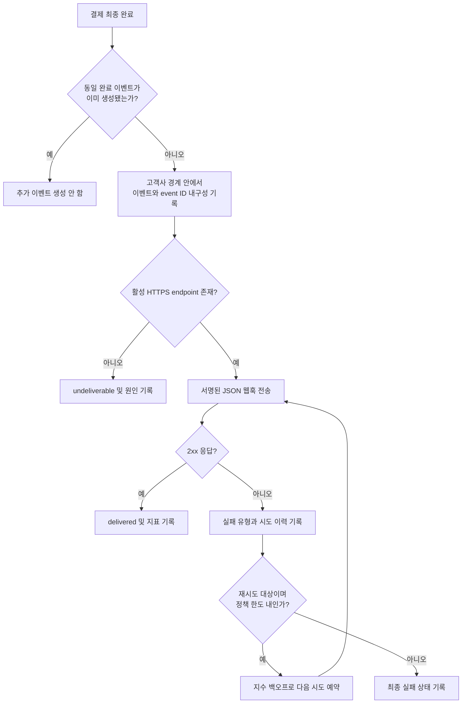

# 결제 완료 웹훅 전달 API PRD

## Applicability

| Contract | Required / N/A | Evidence |
|---|---|---|
| Pages/routes or screen IDs | N/A | 이번 범위에는 사용자 UI가 없으며 endpoint 등록은 기존 내부 API가 담당한다. |
| Empty/loading/error/success/recovery state matrix | N/A | 사용자에게 노출되는 화면이나 상태가 없다. 전달 상태는 시스템 기록과 운영 로그로 관리한다. |
| Mermaid user or system flow | Required | 결제 완료 감지, 이벤트 생성, 전달, 재시도로 이어지는 다단계 시스템 생명주기가 존재한다. |

## Context and problem

고객사는 자사 시스템에서 결제 완료 사실을 비동기로 수신해야 한다. 플랫폼은 결제가 완료되면 해당 고객사에 등록된 HTTPS endpoint로 웹훅 이벤트를 전달해야 한다.

네트워크 장애와 프로세스 중단이 발생해도 이벤트가 유실되지 않아야 하므로 최소 1회 전달을 보장한다. 이에 따라 고객사가 동일 이벤트를 여러 번 받을 수 있으며, 고객사가 중복을 식별할 수 있도록 재시도 간 변하지 않는 event ID를 제공해야 한다.

서명 검증 방식과 secret rotation 정책, 처리량 및 지연 목표는 아직 확정되지 않았다.

## Goals

- 결제 완료 이벤트를 올바른 고객사의 등록된 HTTPS endpoint에 전달한다.
- 일시적인 네트워크 실패 시 지수 백오프로 자동 재시도한다.
- 시스템 장애가 발생해도 전달 대상 이벤트가 유실되지 않도록 최소 1회 전달을 보장한다.
- 모든 전달 시도에서 동일한 event ID를 제공해 고객사가 중복 이벤트를 식별할 수 있게 한다.
- 고객사 간 endpoint, 이벤트 payload 및 전달 이력을 격리한다.
- 운영자가 이벤트와 전달 시도의 결과를 추적할 수 있게 한다.
- 실제 측정을 위한 처리량 및 전달 지연 지표를 수집한다.

## Non-goals

- endpoint 등록·수정·삭제용 신규 API 또는 UI
- 웹훅 replay 대시보드
- 운영자 또는 고객사의 수동 재전송 기능
- 고객사별 전달 순서 보장
- exactly-once 전달
- 처리량 또는 전달 지연 SLA의 수치 확정
- 결제 완료 이외 이벤트 유형 지원
- 서명 검증 방식 또는 secret rotation 주기의 임의 결정

## Users, roles, and permissions

| 역할 | 권한 및 책임 |
|---|---|
| 고객사 시스템 | 자기 고객사에 등록된 endpoint에서 웹훅을 수신하고 event ID로 중복을 제거한다. |
| 결제 도메인 시스템 | 결제가 최종 완료 상태가 되었음을 신뢰 가능한 내부 이벤트로 알린다. |
| 웹훅 전달 시스템 | 고객사 경계를 적용해 이벤트 생성, 전달, 재시도 및 전달 이력 기록을 수행한다. |
| 내부 운영자 | 승인된 내부 관측 수단을 통해 전달 상태와 실패 원인을 조회한다. 수동 재전송은 할 수 없다. |
| 보안 담당자 | 서명 방식, secret 관리·교체 정책 및 운영 허용 조건을 확정한다. |

## Functional requirements

| ID | Requirement | Priority |
|---|---|---|
| FR-01 | 결제가 처음으로 최종 완료 상태가 되면 결제 및 고객사 식별자와 연결된 웹훅 이벤트를 하나 생성해야 한다. 동일 결제 완료 신호가 중복 처리되어도 별개의 논리 이벤트를 추가 생성해서는 안 된다. | Must |
| FR-02 | 이벤트는 전달 작업이 시작되기 전에 내구성 있게 기록되어야 하며, 프로세스 중단 또는 재시작으로 유실되어서는 안 된다. | Must |
| FR-03 | 이벤트마다 전역적으로 고유하고 불변인 event ID를 생성해야 한다. 동일 이벤트의 모든 재시도는 같은 event ID를 사용해야 한다. | Must |
| FR-04 | payload에는 최소한 `event_id`, `event_type`, `occurred_at`, `schema_version`, 결제 식별자와 결제 완료 사실을 표현하는 데이터가 포함되어야 한다. | Must |
| FR-05 | `event_type`은 결제 완료를 나타내는 안정적인 값이어야 하며, payload의 필드 의미와 데이터 형식은 문서화된 schema version으로 관리해야 한다. | Must |
| FR-06 | 이벤트는 해당 이벤트의 고객사에 연결된 활성 HTTPS endpoint로만 전달해야 한다. 다른 고객사의 endpoint로 전달해서는 안 된다. | Must |
| FR-07 | HTTP 요청은 JSON payload로 전송하고 event ID와 event type을 요청 본문 또는 명시된 헤더에서 식별할 수 있게 해야 한다. | Must |
| FR-08 | 고객사 endpoint의 2xx 응답을 전달 성공으로 처리해야 한다. 연결 실패, DNS 실패, TLS 실패, timeout 등 응답을 받지 못한 네트워크 실패는 전달 실패로 기록하고 재시도해야 한다. | Must |
| FR-09 | 재시도 간 대기 시간은 시도 횟수에 따라 증가하는 지수 백오프를 적용해야 한다. 동시 재시도의 집중을 줄이기 위해 jitter 적용 여부를 설정 가능하게 설계한다. | Must |
| FR-10 | 하나의 이벤트가 동시에 중복 실행되지 않도록 조정해야 한다. 다만 장애 경계에서 중복 전달은 허용되며 최소 1회 전달 의미를 유지해야 한다. | Must |
| FR-11 | 각 전달 시도에 대해 고객사 ID, event ID, 시도 시각, 시도 번호, 결과, HTTP 상태 코드(있는 경우), 실패 분류 및 다음 재시도 예정 시각을 기록해야 한다. secret과 민감한 payload 값은 로그에 기록하지 않아야 한다. | Must |
| FR-12 | 활성 endpoint가 없을 경우 외부 요청을 보내지 않고 해당 이벤트를 `undeliverable` 상태와 원인으로 기록해야 한다. | Must |
| FR-13 | endpoint URL이나 DNS 처리 과정에서 내부망 및 메타데이터 서비스 등 허용되지 않은 대상에 연결되지 않도록 서버 측 요청 위조 방어 정책을 적용해야 한다. | Must |
| FR-14 | 확정된 보안 정책에 따라 각 요청에 무결성과 발신자를 검증할 수 있는 서명을 포함해야 한다. 서명 없는 상태로 외부 프로덕션 출시해서는 안 된다. | Must |
| FR-15 | 이벤트 생성 시각부터 최초 시도·성공까지의 지연, 시도 수, 성공·실패·재시도 수, 실패 유형을 측정 가능한 형태로 기록해야 한다. | Must |
| FR-16 | 자동 전달 및 자동 재시도 외에 replay 또는 수동 재전송을 실행하는 외부·내부 기능을 제공하지 않는다. | Must |

## Pages and routes

N/A — 사용자에게 노출되는 화면이 없다.

## State matrix

N/A — 사용자에게 노출되는 화면 상태가 없다.

## User or system flow

## Authorization and data boundaries

- 모든 이벤트, endpoint 조회, 전달 작업 및 전달 이력은 서버가 확인한 고객사 ID를 기준으로 처리해야 한다.
- 고객사 ID를 요청 payload나 endpoint 응답 등 외부 입력만으로 신뢰해서는 안 된다.
- 이벤트의 고객사 ID와 endpoint 소유 고객사 ID가 일치하지 않으면 전달을 차단하고 보안 오류로 기록해야 한다.
- 저장소 조회와 갱신에는 고객사 조건이 강제되어야 하며, event ID만으로 다른 고객사의 이벤트를 조회하거나 갱신할 수 없어야 한다.
- 작업 큐 메시지에는 고객사 경계를 재구성하는 데 필요한 식별자가 포함되어야 하며, 작업 실행 시 소유권을 다시 검증해야 한다.
- 고객사 A의 이벤트 payload, endpoint, secret 및 전달 이력은 고객사 B에게 노출되거나 B의 전달 작업에 사용되어서는 안 된다.
- 내부 운영자 접근은 기존 내부 인증·권한 체계를 사용하고 감사 가능해야 한다.
- payload에는 결제 완료 통지에 필요한 필드만 포함한다. 결제수단 원문, 인증정보 및 불필요한 개인정보는 포함하지 않는다.
- secret은 평문 로그, 오류 메시지 또는 전달 이력에 남겨서는 안 된다.

## Non-functional requirements

| ID | Requirement |
|---|---|
| NFR-01 | 전달 의미는 exactly-once가 아닌 최소 1회(at-least-once)이다. 고객사는 중복 수신을 정상 상황으로 취급할 수 있어야 한다. |
| NFR-02 | 이벤트 생성과 전달 예약 사이의 장애로 이벤트가 유실되지 않아야 한다. |
| NFR-03 | HTTPS 인증서 검증을 우회하거나 평문 HTTP로 자동 폴백해서는 안 된다. |
| NFR-04 | endpoint 응답 대기 시간이 전체 worker 용량을 무기한 점유하지 않도록 timeout을 적용해야 한다. 구체적인 값은 측정 및 운영 검증 후 확정한다. |
| NFR-05 | 재시도 정책의 초기 간격, 증가 계수, 최대 간격, 최대 시도 횟수 또는 최대 재시도 기간은 설정 가능해야 한다. 실제 값은 출시 전 결정한다. |
| NFR-06 | 처리량, 큐 대기 시간, 최초 전달 지연, 최종 성공 지연, 성공률 및 재시도율을 측정해야 한다. 측정 전 수치 SLA를 약속하지 않는다. |
| NFR-07 | 로그와 지표는 event ID 및 고객사 ID를 기준으로 추적 가능해야 하되 secret과 불필요한 결제 데이터는 포함하지 않는다. |
| NFR-08 | payload schema 변경은 `schema_version`으로 식별 가능해야 하며, 기존 고객사 통합을 예고 없이 깨뜨리지 않아야 한다. |

## Acceptance criteria

| ID | Requirement | Given | When | Then | Verification |
|---|---|---|---|---|---|
| AC-01 | FR-01, FR-02 | endpoint가 등록된 고객사의 결제가 완료됨 | 동일 완료 신호를 한 번 이상 처리함 | 하나의 논리 이벤트가 내구성 있게 기록되고 전달 대상으로 남음 | 통합 테스트 및 장애 주입 테스트 |
| AC-02 | FR-03, FR-04, FR-07 | 하나의 이벤트가 여러 번 전달됨 | 각 HTTP 요청을 비교함 | 모든 요청의 event ID가 같고 필수 payload 필드가 존재함 | 계약 테스트 |
| AC-03 | FR-06 | 서로 다른 endpoint를 가진 고객사 A와 B가 존재함 | A의 결제가 완료됨 | 요청은 A의 endpoint에만 전송되고 B의 데이터는 포함되지 않음 | 다중 고객사 통합 테스트 |
| AC-04 | FR-08, FR-11 | endpoint가 2xx를 반환함 | 웹훅을 전송함 | 이벤트가 성공 처리되고 시도 이력이 기록되며 추가 재시도가 예약되지 않음 | 통합 테스트 |
| AC-05 | FR-08, FR-09 | endpoint 연결이 일시적으로 실패함 | 웹훅 전달을 시도함 | 실패가 기록되고 이전보다 증가하는 대기 시간을 적용한 재시도가 예약됨 | fake endpoint 및 시간 제어 테스트 |
| AC-06 | FR-10, NFR-01 | 성공 응답 기록 경계에서 worker가 중단됨 | 작업이 복구됨 | 이벤트는 유실되지 않으며 같은 event ID로 다시 전달될 수 있음 | 장애 주입 테스트 |
| AC-07 | FR-12 | 고객사에 활성 endpoint가 없음 | 결제가 완료됨 | 외부 요청 없이 이벤트가 `undeliverable`로 기록됨 | 통합 테스트 |
| AC-08 | FR-13, NFR-03 | endpoint가 비 HTTPS이거나 차단 대상 주소로 해석됨 | 전달을 시도함 | 연결이 차단되고 보안 실패 사유가 기록됨 | 보안 테스트 |
| AC-09 | FR-14 | 보안 담당자가 서명 규격을 확정함 | 웹훅을 전송함 | 확정된 규격의 서명 정보가 포함되고 고객사가 변조를 검출할 수 있음 | 보안 계약 테스트 |
| AC-10 | FR-11, NFR-07 | 전달 성공과 실패가 발생함 | 운영 기록을 조회함 | event ID로 시도 이력을 추적할 수 있고 secret 및 금지된 데이터가 노출되지 않음 | 로그 검사 및 보안 테스트 |
| AC-11 | FR-15, NFR-06 | 이벤트 생성 및 전달 시도가 발생함 | 관측 지표를 조회함 | 처리량, 지연, 결과 및 재시도 지표를 계산할 수 있음 | 메트릭 검증 테스트 |
| AC-12 | FR-16 | 이벤트가 실패 상태임 | 제공 API와 운영 기능을 점검함 | replay 대시보드와 수동 재전송 기능이 존재하지 않음 | API·권한·UI 범위 검사 |

## Assumptions and open decisions

### 합리적 가정

| ID | 가정 | 영향 |
|---|---|---|
| A-01 | “결제 완료”는 결제 도메인이 정의한 되돌릴 수 없는 최종 완료 상태를 의미한다. | 승인, 처리 중 등 중간 상태에서는 웹훅을 생성하지 않는다. |
| A-02 | 기존 내부 API가 endpoint의 고객사 소유권과 HTTPS 형식을 검증하고 활성 상태를 제공한다. | 본 기능은 endpoint 관리 기능을 추가하지 않고 등록 정보를 소비한다. |
| A-03 | 2xx만 성공으로 간주한다. 네트워크 실패, 408, 429 및 5xx는 재시도 대상으로 보고 그 외 4xx는 기본적으로 영구 실패로 분류한다. | 불필요한 4xx 반복을 줄이며, 최종 분류는 OD-03에서 확정한다. |
| A-04 | 고객사별 이벤트 전달 순서는 보장하지 않는다. | 병렬 처리와 재시도로 이벤트 순서가 바뀔 수 있음을 고객사 문서에 명시한다. |
| A-05 | endpoint 변경은 변경 이후 새로 생성된 이벤트부터 적용하고, 이미 생성된 이벤트는 생성 시점의 endpoint 식별 정보를 사용한다. | 재시도 도중 대상이 예기치 않게 바뀌는 일을 방지한다. 삭제 또는 보안 차단 상태는 전달 전에 다시 확인한다. |
| A-06 | endpoint 응답 본문은 성공 판정에 사용하지 않으며 크기를 제한해 폐기할 수 있다. | 응답 데이터 저장과 민감정보 유입을 최소화한다. |
| A-07 | `occurred_at`은 전달 시각이 아니라 결제가 완료된 시각이다. | 재시도하더라도 이벤트 의미와 시간이 변하지 않는다. |

### 열린 결정

| ID | 결정 사항 | 결정권자 | 결정 시점 / 출시 영향 |
|---|---|---|---|
| OD-01 | 서명 알고리즘, canonicalization 방식, 헤더 이름, timestamp·replay 방어 및 검증 절차 | 보안 담당자 | 구현 완료 전 확정. 외부 프로덕션 출시 차단 조건 |
| OD-02 | secret 생성·보관·노출 방식, rotation 주기, 이전·신규 secret 중첩 허용 기간 및 폐기 절차 | 보안 담당자 | 외부 프로덕션 출시 전 확정 |
| OD-03 | HTTP 상태별 재시도 여부와 endpoint timeout | 백엔드·SRE·보안 담당자 | 부하 및 실패 시나리오 시험 전 확정 |
| OD-04 | 지수 백오프의 초기 간격, 증가 계수, 최대 간격, jitter, 최대 시도 횟수 또는 최대 재시도 기간 | 백엔드·SRE 담당자 | 프로덕션 출시 전 확정. 근거는 부하·복구 시험 결과로 남김 |
| OD-05 | 결제 완료 payload의 정확한 필드와 민감정보 분류 | 결제 도메인·보안·고객 통합 담당자 | 계약 테스트 작성 전 확정 |
| OD-06 | endpoint 변경·삭제 시 이미 대기 중인 이벤트를 중단할지, 생성 당시 대상으로 계속 보낼지에 대한 최종 정책 | 제품·보안 담당자 | 구현 확정 전 결정. A-05가 임시 기본값 |
| OD-07 | 측정된 기준선에 따른 처리량, 전달 지연 및 성공률 목표 | 제품·SRE 담당자 | 프로덕션 관측 데이터 확보 후 별도 승인. 1차 출시 차단 조건은 아님 |
| OD-08 | 자동 재시도 소진 후 이벤트의 보존 기간과 운영 알림 정책 | SRE·보안·제품 담당자 | 프로덕션 출시 전 확정. 수동 재전송 기능 추가를 의미하지 않음 |

## Risks and mitigations

| Risk | Impact | Mitigation |
|---|---|---|
| 동일 이벤트 중복 전달 | 고객사가 결제를 중복 반영할 수 있음 | 불변 event ID 제공, at-least-once 의미와 고객사 중복 제거 책임 문서화 |
| 결제 기록과 이벤트 생성 사이의 장애 | 완료 이벤트 유실 | 전달 전 내구성 기록과 장애 주입 테스트 적용 |
| 잘못된 고객사 endpoint 선택 | 심각한 데이터 유출 | 고객사 ID 기반 조회, 실행 시 소유권 재검증, 다중 고객사 격리 테스트 |
| 악성 endpoint를 통한 SSRF | 내부 시스템 접근 | HTTPS 강제, DNS/IP 재검증, 차단 주소 정책, redirect 정책을 보안 검토에 포함 |
| 무제한 재시도 | 비용 증가 및 장애 증폭 | 설정 가능한 상한, 상태별 재시도 분류, jitter, 운영 지표 및 알림 |
| 서명 정책 미확정 | 위조·변조 검증 불가 | OD-01·OD-02를 외부 프로덕션 출시 게이트로 지정 |
| 근거 없는 SLA 약속 | 잘못된 용량 설계 및 고객 기대 형성 | 1차 출시에서 계측만 수행하고 실측 이후 목표 승인 |
| payload schema 변경 | 고객사 연동 장애 | schema version 제공, 호환성 계약 테스트 및 변경 정책 문서화 |

## Delivery

| Phase | Requirement IDs | Verifiable exit condition |
|---|---|---|
| 1. 이벤트 계약 및 내구성 기반 | FR-01~FR-05, FR-15 | 중복 완료 신호와 프로세스 장애 시험에서 이벤트가 유실·중복 생성되지 않고 필수 지표가 기록됨 |
| 2. 격리된 전달 및 재시도 | FR-06~FR-13 | 2xx 성공, 네트워크 실패, 상태 코드 분류, 백오프, endpoint 부재, 고객사 격리 및 SSRF 테스트 통과 |
| 3. 보안 계약 확정 및 적용 | FR-14 | OD-01과 OD-02가 승인되고 서명 생성·변조 검출·rotation 호환 계약 테스트 통과 |
| 4. 출시 검증 | FR-01~FR-16, NFR-01~NFR-08 | 모든 acceptance criteria 통과, OD-03~OD-06 및 OD-08 확정, 운영 지표·알림 확인, replay·수동 재전송 기능이 범위에 포함되지 않았음이 확인됨 |
| 5. 출시 후 기준선 측정 | FR-15, NFR-06 | 실제 처리량과 지연 분포를 측정하고 OD-07의 목표 설정 여부를 별도 승인함 |