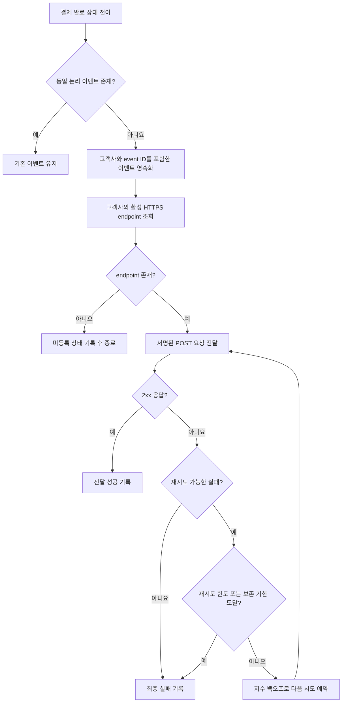

# 결제 완료 웹훅 전달 API PRD

## Applicability

| Contract | Required / N/A | Evidence |
|---|---|---|
| Pages/routes or screen IDs | N/A | 이번 범위에 UI가 없으며 endpoint 등록도 기존 내부 API가 담당한다. |
| Empty/loading/error/success/recovery state matrix | N/A | 사용자에게 노출되는 화면이나 인터랙션 상태가 없다. |
| Mermaid user or system flow | Required | 결제 완료부터 이벤트 생성, 전달, 재시도 또는 종료까지 다단계 시스템 수명주기가 존재한다. |

## Context and problem

고객사는 결제 완료 사실을 자체 시스템에 반영하기 위해 결제 상태를 별도로 조회하지 않고도 신뢰성 있게 통지받아야 한다.

시스템은 결제 완료 이벤트를 고객사별로 격리하여 등록된 HTTPS endpoint로 전달해야 한다. 전달 방식은 최소 1회(at-least-once)이므로 동일 이벤트가 중복 전달될 수 있으며, 고객사가 중복을 식별할 수 있는 안정적인 event ID가 필요하다.

## Goals

- 결제 완료 시 고객사의 등록된 HTTPS endpoint로 이벤트를 비동기 전달한다.
- 일시적인 네트워크 또는 수신 시스템 장애 시 지수 백오프로 재시도한다.
- 동일 이벤트의 모든 재시도에서 같은 event ID를 제공한다.
- 고객사 간 endpoint, payload, secret 및 전달 이력을 격리한다.
- 전달 성공 여부와 재시도 동작을 운영자가 관측할 수 있게 한다.
- 보안 담당자가 확정한 방식에 따라 payload의 출처와 무결성을 검증할 수 있는 서명을 제공한다.

## Non-goals

- endpoint 등록·수정·삭제 API 신규 개발
- endpoint 관리 UI
- replay 대시보드
- 운영자 또는 고객사의 수동 재전송
- 정확히 한 번(exactly-once) 전달 보장
- 고객사 시스템 내부의 중복 제거 구현
- 1차 출시에서 처리량 또는 전달 지연 SLA 보장
- 결제 완료 외 다른 이벤트 유형 지원

## Users, roles, and permissions

- **고객사 수신 시스템:** 자기 고객사에 속한 결제 완료 이벤트만 수신하고 서명을 검증한다.
- **결제 시스템:** 결제 완료 상태 전이를 발생시키고 웹훅 이벤트 생성을 요청한다.
- **웹훅 전달 서비스:** 고객사 정보를 기준으로 endpoint를 조회하고 이벤트 전달 및 자동 재시도를 수행한다.
- **내부 운영자:** 로그와 메트릭을 통해 전달 상태를 관측한다. 1차 출시에서는 수동 재전송할 수 없다.
- **보안 담당자:** 서명 규격, secret 취급 방식 및 rotation 정책을 확정한다.
- **기존 endpoint 등록 API:** 고객사 소유권이 검증된 HTTPS endpoint와 관련 설정을 관리한다.

## Functional requirements

| ID | Requirement | Priority |
|---|---|---|
| FR-01 | 결제가 최초로 완료 상태에 도달하면 해당 결제와 고객사에 연결된 `payment.completed` 이벤트를 하나 생성해야 한다. 동일 완료 상태 전이의 중복 처리로 새로운 논리 이벤트가 생성되어서는 안 된다. | Must |
| FR-02 | 각 논리 이벤트에는 전역적으로 고유하고 변경되지 않는 `event_id`가 있어야 하며, 최초 전달과 모든 자동 재시도에서 같은 값을 사용해야 한다. | Must |
| FR-03 | 전달 대상은 이벤트의 `customer_id`에 속하며 기존 내부 API에 등록된 활성 HTTPS endpoint여야 한다. 다른 고객사의 endpoint를 사용할 수 없다. | Must |
| FR-04 | endpoint 조회 결과가 없거나 비활성 상태이면 외부 요청을 보내지 않고 사유를 내부 전달 상태에 기록해야 한다. | Must |
| FR-05 | 외부 요청은 HTTPS `POST`로 전송하며 요청 본문은 명시된 이벤트 envelope를 따라야 한다. | Must |
| FR-06 | 수신 endpoint가 2xx 응답을 반환하면 해당 endpoint에 대한 이벤트 전달을 성공으로 처리하고 추가 자동 재시도를 중단해야 한다. | Must |
| FR-07 | 재시도 가능한 실패에는 지수 백오프를 적용해야 하며, 동일 이벤트와 endpoint 조합의 시도 횟수 및 다음 시도 가능 시각을 영속적으로 기록해야 한다. 프로세스 재시작으로 예정된 재시도가 유실되어서는 안 된다. | Must |
| FR-08 | 최소 1회 전달을 위해 외부 요청을 시작하기 전에 이벤트와 전달 대상을 영속화해야 한다. 일시적 내부 장애나 작업자 재시작 후에도 미완료 전달을 다시 처리해야 한다. | Must |
| FR-09 | 재시도 한도 또는 보존 기한에 도달한 전달은 최종 실패 상태로 전환하고 자동 재시도를 중단해야 한다. 구체적인 한도는 OD-03 확정값을 설정으로 적용한다. | Must |
| FR-10 | 보안 담당자가 확정한 서명 규격에 따라 전송 본문을 서명하고 검증에 필요한 식별 정보와 서명을 HTTP header에 포함해야 한다. 서명 규격이 확정되기 전에는 운영 출시할 수 없다. | Must |
| FR-11 | 각 시도에 대해 `event_id`, `customer_id`, endpoint 식별자, 시도 횟수, 결과 분류, HTTP 상태 코드(있는 경우), 요청 시각 및 응답 완료 시각을 기록해야 한다. secret과 결제 민감정보는 로그에 남기지 않는다. | Must |
| FR-12 | 자동 재시도는 원래 생성된 논리 이벤트를 재사용해야 하며 새로운 `event_id`를 생성하거나 결제 완료 이벤트를 재해석해서는 안 된다. | Must |
| FR-13 | 1차 출시에서는 운영 API를 포함한 어떤 경로로도 과거 이벤트 수동 재전송 기능을 제공하지 않는다. | Must |

### 이벤트 envelope

```json
{
  "event_id": "evt_<unique-id>",
  "event_type": "payment.completed",
  "occurred_at": "<RFC 3339 UTC timestamp>",
  "api_version": "<version>",
  "data": {
    "payment_id": "<customer-visible payment identifier>",
    "status": "completed",
    "completed_at": "<RFC 3339 UTC timestamp>"
  }
}
```

- `event_id`는 논리 이벤트의 멱등성 키다.
- `occurred_at`은 이벤트가 생성된 시각이 아니라 결제 완료 상태가 확정된 시각을 나타낸다.
- payload에는 고객사 연동에 필요한 최소 필드만 포함한다.
- 통화, 금액, 주문 식별자 등 추가 필드는 기존 결제 데이터 계약과 고객사 요구가 확인된 후 버전 계약을 통해 추가한다.

## Pages and routes

N/A — 사용자에게 노출되는 화면이 없다.

## State matrix

N/A — 사용자에게 노출되는 화면 상태가 없다.

## User or system flow



## Authorization and data boundaries

- 모든 이벤트, endpoint 조회, 전달 작업 및 이력은 서버가 확인한 `customer_id`를 기준으로 처리해야 한다.
- `customer_id`는 외부 요청 payload나 호출자가 임의로 지정한 값이 아니라 결제 레코드의 소유 관계에서 도출해야 한다.
- endpoint 조회 시 이벤트의 `customer_id`를 필수 조건으로 사용해야 한다.
- 한 고객사의 작업자가 다른 고객사의 endpoint, secret 또는 전달 레코드를 조회하거나 사용할 수 없어야 한다.
- 전달 작업에는 endpoint URL을 임의로 덮어쓰는 입력을 허용하지 않는다.
- secret은 고객사별로 격리하고 평문 로그, 오류 메시지 또는 메트릭 label에 노출하지 않는다.
- endpoint URL이 내부망 또는 메타데이터 서비스에 접근할 가능성에 대한 SSRF 통제 정책은 기존 endpoint 등록 API의 검증 범위를 확인한 뒤 OD-04로 확정한다.
- 운영자가 로그나 전달 이력을 열람하는 권한은 기존 내부 접근통제를 따른다. 이 PRD는 신규 운영 권한을 부여하지 않는다.

## Non-functional requirements

- **신뢰성:** 전달 대기 상태는 외부 요청 전에 영속화하며 서비스 재시작 후 복구할 수 있어야 한다.
- **보안:** 모든 외부 전달은 HTTPS만 허용하고, 운영 출시는 서명 규격 확정을 전제로 한다.
- **격리:** 저장, 조회, 실행 및 관측 단계 모두에서 고객사 경계를 유지해야 한다.
- **관측성:** 아래 항목을 고객사 식별정보가 과도하게 노출되지 않는 방식으로 측정해야 한다.
  - 생성된 이벤트 수
  - 전달 성공·재시도·최종 실패·endpoint 미등록 건수
  - 시도 횟수
  - 결제 완료부터 최초 전달 시도까지의 지연
  - 결제 완료부터 성공 응답까지의 지연
  - 외부 요청 소요 시간
- **성능과 SLA:** 근거가 없으므로 처리량, 타임아웃, 동시성 및 지연 목표 수치를 이 PRD에서 지정하지 않는다. 1차 출시 관측 결과를 바탕으로 소유자와 목표치를 정한다.
- **순서:** 서로 다른 이벤트 간 도착 순서는 보장하지 않는다. 고객사는 `occurred_at`과 자체 상태 규칙을 사용해야 한다.
- **호환성:** envelope의 의미를 깨는 변경은 `api_version`을 변경해야 한다.

## Acceptance criteria

| ID | Requirement | Given | When | Then | Verification |
|---|---|---|---|---|---|
| AC-01 | FR-01, FR-02, FR-12 | 같은 결제 완료 상태 전이가 중복 처리됨 | 이벤트 생성 로직이 여러 번 실행됨 | 논리 이벤트는 하나이며 모든 전달 시도의 `event_id`가 동일함 | 통합 테스트 및 저장 레코드 검사 |
| AC-02 | FR-03, FR-04 | 고객사 A 이벤트와 고객사 A·B의 endpoint가 존재함 | 이벤트가 전달됨 | A의 활성 endpoint에만 요청되고 B에는 요청되지 않음 | 격리 통합 테스트 |
| AC-03 | FR-04 | 고객사에 활성 endpoint가 없음 | 결제가 완료됨 | 외부 요청 없이 endpoint 미등록 상태와 사유가 기록됨 | 통합 테스트 |
| AC-04 | FR-05, FR-10 | 활성 HTTPS endpoint와 유효한 secret 설정이 있음 | 전달 요청이 생성됨 | POST 본문이 envelope 계약을 따르고 확정된 서명 규격의 header를 포함함 | 계약 테스트 및 서명 검증 테스트 |
| AC-05 | FR-06 | endpoint가 2xx를 반환함 | 이벤트가 전달됨 | 성공 상태가 기록되고 추가 시도가 예약되지 않음 | 통합 테스트 |
| AC-06 | FR-07, FR-08 | 첫 전달에서 재시도 가능한 실패가 발생함 | 전달 작업자가 재시작됨 | 같은 `event_id`로 다음 시도가 복구되며 지수 백오프에 따른 다음 실행 시각이 적용됨 | 장애 주입 통합 테스트 |
| AC-07 | FR-09 | 전달이 확정된 한도 또는 보존 기한에 도달함 | 마지막 실패가 발생함 | 최종 실패 상태로 전환되고 추가 자동 시도가 생성되지 않음 | 경계값 테스트 |
| AC-08 | FR-11 | 전달 성공과 실패가 각각 발생함 | 이력을 조회하거나 로그를 검사함 | 필수 관측 필드는 존재하고 secret 및 금지된 민감정보는 없음 | 로그·메트릭 검사 |
| AC-09 | FR-13 | 최종 실패 이벤트가 존재함 | 1차 출시 API와 운영 기능을 점검함 | 수동 재전송 또는 replay 실행 경로가 존재하지 않음 | API·권한·기능 검사 |
| AC-10 | FR-03 | HTTP 또는 유효하지 않은 endpoint가 등록 데이터에 존재함 | 전달이 시도됨 | 요청은 전송되지 않고 안전한 오류 상태로 기록됨 | 보안 통합 테스트 |

## Assumptions and open decisions

### 합리적 가정

- **A-01:** 2xx 응답만 전달 성공으로 간주한다.
- **A-02:** 연결 실패, DNS 실패, TLS 실패, 타임아웃, HTTP 408, 429 및 5xx를 재시도 가능한 실패로 분류한다. 그 외 4xx는 기본적으로 최종 실패로 처리한다.
- **A-03:** 서로 다른 이벤트 간 전달 순서는 보장하지 않는다.
- **A-04:** endpoint 등록 API가 고객사 소유권과 기본 URL 형식을 검증한다. 웹훅 전달 서비스도 HTTPS 여부를 방어적으로 재검증한다.
- **A-05:** endpoint가 결제 완료 후 변경되면 아직 시작되지 않은 다음 전달 시도는 현재 활성 endpoint를 사용한다. 감사 목적의 endpoint 식별자는 각 시도에 기록한다.
- **A-06:** 1차 출시의 웹훅 payload는 결제 및 연동에 필요한 최소 정보만 제공하며 카드·계좌 정보 등 결제수단 민감정보를 포함하지 않는다.
- **A-07:** 최소 1회 보장은 활성 endpoint가 존재하고 자동 재시도 정책 범위 안에 있는 전달에 적용된다. 영구 실패나 정책 한도 이후의 성공까지 보장한다는 의미는 아니다.

### 열린 결정

| ID | 결정 사항 | 소유자 | 결정 시점 / 영향 |
|---|---|---|---|
| OD-01 | 서명 알고리즘, 서명 대상 원문, timestamp 및 header 명칭, 허용 시간 오차 | 보안 담당자 | 구현 착수 전 확정. 미확정 시 FR-10 및 AC-04 구현·검증 불가 |
| OD-02 | secret 발급·저장 방식과 rotation 주기, 이전·신규 secret 동시 유효 기간 | 보안 담당자 | 운영 출시 전 확정. 무중단 rotation과 검증 계약에 영향 |
| OD-03 | 요청 타임아웃, 최초 지연, 백오프 배수, 최대 간격, 최대 시도 횟수 또는 보존 기한 | 서비스 소유자 | 통합 테스트 전 설정 확정. 수치는 부하·장애 실험 근거로 결정 |
| OD-04 | endpoint 등록 및 전달 단계의 SSRF 방어 범위: 사설 IP, DNS 재바인딩, redirect 처리 | 보안 담당자·기존 등록 API 소유자 | 구현 착수 전 책임 경계 확정 |
| OD-05 | 고객사당 활성 endpoint 수: 하나만 허용할지 복수 endpoint를 지원할지 | 제품·기존 API 소유자 | 데이터 모델 확정 전 결정. 본 PRD의 기본 계약은 결제 이벤트당 등록된 활성 대상 각각에 독립 전달 상태를 두는 방식으로 확장 가능해야 함 |
| OD-06 | 1차 운영 관측 이후 처리량과 전달 지연 목표 및 SLA 도입 여부 | 서비스 소유자·제품 | 출시 후 측정 데이터 확보 시 결정 |

## Risks and mitigations

| Risk | Impact | Mitigation |
|---|---|---|
| 중복 전달 | 고객사가 동일 결제를 중복 반영할 수 있음 | 안정적인 `event_id` 제공, 문서에서 고객사 멱등 처리를 필수 연동 조건으로 명시 |
| 이벤트 유실 | 고객사가 결제 완료를 인지하지 못함 | 외부 요청 전 영속화, 재시도 상태 저장, 재시작 복구 테스트 |
| 재시도 폭주 | 장애 고객사가 시스템 자원을 과도하게 점유함 | 지수 백오프, 고객사별 격리 가능한 실행 제어, OD-03에서 상한 결정 |
| 고객사 간 데이터 노출 | 보안 사고 및 계약 위반 | 서버 유도 tenant 식별자, 조회 조건 강제, 교차 고객사 격리 테스트 |
| secret 유출 | 위조 웹훅 가능 | 비밀 저장소 사용, 로그 마스킹, 최소 권한 접근, OD-02 확정 |
| 악성 endpoint를 통한 SSRF | 내부 서비스 또는 메타데이터 노출 | HTTPS 강제, URL·DNS·redirect 정책을 OD-04에서 확정하고 보안 테스트 |
| 미확정 서명 계약 | 고객사가 안전하게 출처를 검증할 수 없음 | OD-01과 OD-02를 운영 출시 차단 조건으로 지정 |
| SLA를 근거 없이 약속 | 운영 능력과 고객 기대 불일치 | 먼저 실제 지연·처리량을 계측하고 OD-06에서 목표 결정 |

## Delivery

| Phase | Requirement IDs | Verifiable exit condition |
|---|---|---|
| 0. 보안·운영 계약 확정 | FR-07, FR-09, FR-10 | OD-01~OD-04가 승인된 기술 계약과 설정값으로 기록됨 |
| 1. 이벤트 생성 및 격리 | FR-01, FR-02, FR-03, FR-04, FR-08, FR-12 | AC-01~AC-03 및 고객사 교차 접근 테스트 통과 |
| 2. 전달·서명·재시도 | FR-05, FR-06, FR-07, FR-09, FR-10 | AC-04~AC-07 및 장애 복구 테스트 통과 |
| 3. 관측성과 출시 검증 | FR-11, FR-13 | AC-08~AC-10 통과, 필수 메트릭 확인, replay·수동 재전송 경로가 없음이 검증됨 |
| 출시 후 측정 | NFR 관측 지표, OD-06 | 실제 처리량과 지연 분포가 수집되고 SLA 설정 여부를 판단할 근거가 마련됨 |