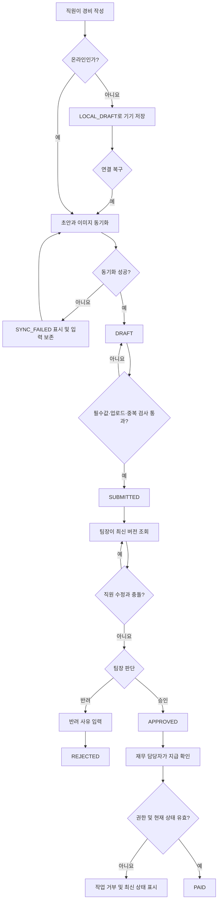

# 모바일 경비 승인 PRD

## Applicability

| Contract | Required / N/A | Evidence |
|---|---|---|
| Pages/routes or screen IDs | Required | 직원 제출, 팀장 승인, 재무 지급 처리 등 역할별 사용자 화면이 필요하다. 라우트는 미정이므로 안정적인 화면 ID를 정의한다. |
| Empty/loading/error/success/recovery state matrix | Required | 오프라인 동기화, 이미지 업로드 실패, 권한 변경, 동시 수정 충돌을 사용자에게 명확히 표시해야 한다. |
| Mermaid user or system flow | Required | 초안 작성부터 제출, 승인·반려, 지급 완료까지 다단계 생명주기가 존재한다. |

## Context and problem

직원이 모바일에서 영수증을 제출하고 팀장과 재무 담당자가 순차적으로 처리할 수 있는 경비 승인 기능이 필요하다.

모바일 네트워크 단절, 이미지 업로드 실패, 중복 요청, 처리 중 권한 변경, 승인과 수정이 동시에 발생하는 상황에서도 데이터 유실이나 잘못된 승인이 없어야 한다. 현재 경비 제출·승인·지급 상태를 한 흐름에서 추적하기 어렵다는 문제를 해결한다.

## Goals

- 직원이 영수증 사진, 금액, 카테고리로 경비를 제출할 수 있다.
- 직원이 오프라인에서도 초안을 작성하고 이후 안전하게 동기화할 수 있다.
- 팀장이 자기 팀에 귀속된 요청만 승인 또는 반려할 수 있다.
- 재무 담당자가 승인된 요청을 지급 완료로 처리할 수 있다.
- 재시도나 중복 조작으로 동일 요청이 여러 번 생성·처리되지 않는다.
- 모든 상태 변경의 주체, 시각, 변경 전후 상태를 추적할 수 있다.
- 사용자 화면이 WCAG 2.2 AA를 충족한다.

## Non-goals

1차 출시에서는 다음을 제외한다.

- 다중 통화 입력, 환율 계산 및 환차손익 처리
- ERP 자동 전송 또는 ERP 상태 동기화
- 법인카드 명세 자동 대사
- OCR을 이용한 금액·카테고리 자동 추출
- 다단계 또는 금액별 결재선
- 경비 분할, 합산 및 부분 지급
- 승인·지급 알림 채널 연동
- 지급 완료 후 사용자 화면에서의 취소 또는 되돌리기

## Users, roles, and permissions

| 역할 | 허용 작업 | 제한 |
|---|---|---|
| 직원 | 자신의 초안 생성·수정·삭제, 요청 제출, 자신의 요청과 처리 결과 조회 | 다른 직원 요청 조회 불가. 승인 완료·반려·지급 완료 요청 수정 불가 |
| 팀장 | 담당 팀의 제출 요청 조회, 승인, 반려 및 반려 사유 입력 | 다른 팀 요청 조회·처리 불가. 자신의 팀장 권한이 유효한 동안만 처리 가능 |
| 재무 담당자 | 승인된 요청 조회, 지급 완료 처리 | 미승인 요청을 지급 완료 처리할 수 없음 |
| 시스템 | 동기화, 중복 방지, 버전 충돌 감지, 감사 이력 기록 | 사용자 권한을 대신 우회할 수 없음 |

한 사용자가 복수 역할을 가질 수 있지만, 각 요청은 해당 작업에 필요한 권한으로 서버에서 독립적으로 검증한다.

## 상태 모델

| 상태 | 설명 | 가능한 다음 상태 |
|---|---|---|
| `LOCAL_DRAFT` | 기기에만 저장된 초안 | `SYNCING`, 삭제 |
| `SYNCING` | 서버 동기화 또는 이미지 업로드 진행 중 | `DRAFT`, `SYNC_FAILED` |
| `SYNC_FAILED` | 동기화 또는 업로드 실패 | `SYNCING`, 로컬 수정, 삭제 |
| `DRAFT` | 서버에 동기화됐지만 제출하지 않은 초안 | `SUBMITTED`, 수정, 삭제 |
| `SUBMITTED` | 팀장 판단 대기 | `SUBMITTED`(수정 버전 반영), `APPROVED`, `REJECTED` |
| `APPROVED` | 팀장 승인 완료, 지급 대기 | `PAID` |
| `REJECTED` | 반려 완료 | 종료 |
| `PAID` | 지급 완료 | 종료 |

`SYNCING`과 `SYNC_FAILED`는 사용자에게 표시되는 동기화 상태이며, 서버의 업무 상태와 별도로 관리할 수 있다.

## Functional requirements

| ID | Requirement | Priority |
|---|---|---|
| FR-001 | 직원은 영수증 이미지 1개, 금액, 카테고리를 입력해 초안을 저장할 수 있어야 한다. | Must |
| FR-002 | 금액은 조직의 단일 기준 통화로 저장하며 0보다 커야 한다. 카테고리는 제출 시점에 활성 상태여야 한다. | Must |
| FR-003 | 필수 항목이 유효하고 이미지 업로드가 완료된 초안만 제출할 수 있어야 한다. | Must |
| FR-004 | 직원은 자신이 생성한 초안과 요청만 조회할 수 있어야 한다. | Must |
| FR-005 | 직원은 `SUBMITTED` 상태의 요청을 팀장이 처리하기 전까지 수정할 수 있어야 한다. 수정 시 요청 버전이 증가해야 한다. | Must |
| FR-006 | 오프라인에서 작성하거나 수정한 초안은 앱 재시작 후에도 유지되어야 하며, 연결 복구 시 자동 동기화를 시도해야 한다. | Must |
| FR-007 | 자동 동기화 실패 시 입력 내용을 보존하고 실패 원인과 수동 재시도 수단을 제공해야 한다. | Must |
| FR-008 | 이미지 업로드 진행 상태를 표시해야 하며, 실패 시 이미 입력한 금액·카테고리를 유지한 채 이미지 업로드만 재시도할 수 있어야 한다. | Must |
| FR-009 | 각 초안에는 클라이언트에서 생성한 고유 식별자를 부여하고, 같은 식별자의 제출 재시도는 하나의 요청만 생성해야 한다. | Must |
| FR-010 | 같은 직원이 동일한 이미지 체크섬, 금액, 카테고리 조합을 다시 제출하면 중복으로 차단하고 기존 요청을 안내해야 한다. | Must |
| FR-011 | 팀장은 요청에 기록된 담당 팀이 현재 자신의 관리 범위인 경우에만 요청을 조회하고 처리할 수 있어야 한다. | Must |
| FR-012 | 팀장은 `SUBMITTED` 요청을 승인하거나 반려할 수 있으며, 반려 시 공백이 아닌 사유를 반드시 입력해야 한다. | Must |
| FR-013 | 팀장 작업 시 화면에 표시된 요청 버전과 현재 서버 버전이 일치해야 한다. 일치하지 않으면 처리를 적용하지 않고 최신 요청을 다시 확인하게 해야 한다. | Must |
| FR-014 | 직원 수정과 팀장 처리가 동시에 요청되면 서버가 먼저 확정한 작업만 적용해야 한다. 수정이 먼저면 팀장의 판단을 재확인하고, 판단이 먼저면 직원의 수정을 거부한다. | Must |
| FR-015 | 승인 또는 반려 API의 동일 작업 재시도는 중복 상태 변경이나 중복 감사 기록을 만들지 않아야 한다. | Must |
| FR-016 | 재무 담당자는 `APPROVED` 상태의 요청만 `PAID`로 변경할 수 있어야 한다. | Must |
| FR-017 | 지급 완료 작업의 동일 요청 재시도는 한 번만 반영되어야 한다. | Must |
| FR-018 | 역할 또는 팀 권한은 화면 진입 시뿐 아니라 조회와 모든 상태 변경 요청 시점에 서버에서 다시 검증해야 한다. | Must |
| FR-019 | 조회 후 권한이 상실된 사용자의 후속 작업은 거부하고, 화면에서 접근 권한 변경 사실을 안내한 뒤 해당 데이터를 제거해야 한다. | Must |
| FR-020 | 요청 생성·수정·제출·승인·반려·지급 완료에 대해 행위자, 시각, 이전 상태, 이후 상태, 요청 버전을 감사 이력으로 기록해야 한다. | Must |
| FR-021 | 직원은 자신의 요청 상태와 반려 사유를 조회할 수 있어야 한다. | Must |
| FR-022 | 카테고리 비활성화 등 제출 시점의 검증 실패는 영향을 받은 필드를 표시하며 수정 가능한 상태로 유지해야 한다. | Must |

## Pages and routes

| Page or screen ID | Route, deep link, or explicit TBD + owner | Roles | Purpose |
|---|---|---|---|
| `EXPENSE_LIST` | TBD — 모바일 개발 책임자, 구현 착수 전 확정 | 직원 | 자신의 초안 및 제출 요청 조회 |
| `EXPENSE_EDITOR` | TBD — 모바일 개발 책임자, 구현 착수 전 확정 | 직원 | 영수증·금액·카테고리 입력, 저장, 동기화 및 제출 |
| `EXPENSE_DETAIL` | TBD — 모바일 개발 책임자, 구현 착수 전 확정 | 직원 | 처리 상태와 반려 사유 조회 |
| `APPROVAL_QUEUE` | TBD — 제품 책임자, 구현 착수 전 확정 | 팀장 | 담당 팀의 승인 대기 요청 조회 |
| `APPROVAL_DETAIL` | TBD — 제품 책임자, 구현 착수 전 확정 | 팀장 | 요청 확인, 승인 또는 사유를 포함한 반려 |
| `PAYMENT_QUEUE` | TBD — 제품 책임자, 구현 착수 전 확정 | 재무 담당자 | 승인 후 지급 대기 요청 조회 |
| `PAYMENT_DETAIL` | TBD — 제품 책임자, 구현 착수 전 확정 | 재무 담당자 | 승인 정보 확인 및 지급 완료 처리 |

## State matrix

| Surface | Empty | Loading | Error | Success | Recovery |
|---|---|---|---|---|---|
| 직원 요청 목록 | 요청 없음과 새 요청 작성 CTA 표시 | 목록 로딩 표시 | 조회 실패와 재시도 표시 | 상태별 요청 목록 표시 | 연결 복구 또는 수동 새로고침 |
| 경비 작성 | 빈 입력 폼 표시 | 로컬 초안 또는 카테고리 로딩 표시 | 카테고리 조회 실패 또는 로컬 저장 실패 표시 | 저장 상태와 제출 가능 여부 표시 | 입력 보존 후 재시도 |
| 이미지 업로드 | 이미지 선택 안내 | 진행 중 표시, 중복 제출 방지 | 실패 원인과 재시도 표시 | 미리보기와 업로드 완료 표시 | 동일 이미지 재업로드 또는 이미지 교체 |
| 오프라인 초안 | 기존 초안이 없으면 빈 작성 화면 | 로컬 데이터 복원 표시 | 로컬 저장 공간 등 저장 실패 표시 | 기기에 저장됨 표시 | 연결 복구 시 자동 동기화, 수동 재시도 |
| 초안 동기화 | 동기화 대상 없음 | 동기화 중 표시 | 실패 항목과 원인 표시 | 동기화 완료 표시 | 내용 보존 후 항목별 재시도 |
| 팀장 승인함 | 승인 대기 없음 | 목록 로딩 표시 | 조회 실패 또는 권한 상실 표시 | 담당 팀 요청 표시 | 재조회, 권한 상실 시 목록 제거 |
| 승인 상세 | 해당 요청 없음 | 최신 버전 로딩 표시 | 권한 오류, 버전 충돌 또는 처리 실패 표시 | 승인·반려 완료 표시 | 충돌 시 최신 버전 재조회 및 판단 재입력 |
| 재무 지급함 | 지급 대기 없음 | 목록 로딩 표시 | 조회 실패 또는 권한 상실 표시 | 승인된 요청 표시 | 재조회, 권한 상실 시 목록 제거 |
| 지급 상세 | 해당 요청 없음 | 최신 상태 로딩 표시 | 이미 처리됨, 상태 변경 또는 권한 오류 표시 | 지급 완료 표시 | 최신 상태 재조회 |
| 중복 제출 | 해당 없음 | 중복 검사 중 표시 | 검사 실패 시 제출 미완료 표시 | 중복이 아니면 제출 완료 | 중복이면 기존 요청으로 이동하거나 편집 화면 유지 |

## User or system flow

## Authorization and data boundaries

- 모든 조회와 변경 권한은 서버에서 검증한다. 화면에서 버튼이나 데이터를 숨기는 것만으로 권한을 보장하지 않는다.
- 직원 요청은 생성한 직원과 동일 조직의 허용된 팀장·재무 담당자만 접근할 수 있다.
- 요청에는 제출 시점의 조직 및 담당 팀 식별자를 저장한다.
- 팀장은 현재 자신이 관리하는 팀과 요청의 담당 팀이 일치할 때만 접근할 수 있다.
- 재무 담당자는 동일 조직의 승인된 요청에만 접근할 수 있다.
- 직원, 팀장 또는 재무 담당자의 역할이 변경되면 다음 조회나 변경 요청부터 변경된 권한을 적용한다.
- 목록 API뿐 아니라 상세 조회, 이미지 접근, 승인·반려·지급 API에도 동일한 데이터 경계를 적용한다.
- 영수증 이미지 접근은 인증·인가된 요청으로 제한하며 공개 URL로 노출하지 않는다.
- 클라이언트가 전달한 역할, 팀, 상태, 행위자 값은 권한 판단의 신뢰 근거로 사용하지 않는다.
- 상태 전이는 서버에서 원자적으로 처리하며 예상 상태와 요청 버전이 일치할 때만 성공한다.

## Non-functional requirements

### 접근성

- NFR-001: 직원·팀장·재무 담당자 화면은 WCAG 2.2 AA를 목표로 구현하고 출시 전 접근성 검증을 수행한다.
- NFR-002: 모든 작업은 키보드 및 보조기술로 수행 가능해야 하며, 입력 필드에는 프로그램적으로 연결된 레이블과 오류 설명이 있어야 한다.
- NFR-003: 업로드, 동기화, 충돌, 승인 결과 등 상태 변화는 색상만으로 전달하지 않고 텍스트 및 접근 가능한 상태 메시지로 제공한다.
- NFR-004: 승인·반려·지급 완료 같은 주요 작업에는 명확한 포커스 이동과 결과 안내를 제공한다.

### 데이터 신뢰성 및 보안

- NFR-005: 클라이언트 재시도는 고유 작업 키를 사용해 멱등 처리한다.
- NFR-006: 로컬 초안에는 인증 토큰을 저장하지 않으며, 앱 로그아웃 또는 계정 변경 시 다른 계정에서 열람할 수 없어야 한다.
- NFR-007: 전송 중인 요청과 영수증 이미지는 조직의 기존 보안 기준을 적용한다.
- NFR-008: 업무 상태 변경과 감사 이력 기록은 하나의 원자적 결과로 처리한다.

### 성능

현 단계에서는 근거 없는 목표 수치를 정의하지 않는다.

다음 지표를 계측한 후 제품 책임자와 엔지니어링 책임자가 출시 기준을 결정한다.

- 요청 목록 및 상세 화면 로딩 시간
- 이미지 업로드 성공률과 소요 시간
- 연결 복구 후 동기화 완료 시간
- 제출·승인·반려·지급 API의 성공률 및 응답 시간
- 버전 충돌과 중복 차단 발생률

성능 목표 수치와 측정 환경은 베타 측정 완료 후, 정식 출시 승인 전에 확정한다.

## Acceptance criteria

| ID | Requirement | Given | When | Then | Verification |
|---|---|---|---|---|---|
| AC-001 | FR-001~003 | 직원이 유효한 이미지·금액·카테고리를 입력했다 | 이미지 업로드 후 제출한다 | 하나의 `SUBMITTED` 요청이 생성된다 | API·모바일 통합 테스트 |
| AC-002 | FR-002, FR-022 | 금액이 0 이하이거나 카테고리가 비활성 상태다 | 제출을 시도한다 | 제출되지 않고 영향받은 필드에 오류가 표시된다 | 경계값 UI·API 테스트 |
| AC-003 | FR-003, FR-008 | 이미지 업로드가 완료되지 않았거나 실패했다 | 제출을 시도한다 | 제출이 차단되고 입력값을 유지한 채 업로드를 재시도할 수 있다 | 네트워크 오류 통합 테스트 |
| AC-004 | FR-006, FR-007 | 직원이 오프라인에서 초안을 작성했다 | 앱을 종료·재실행한 뒤 연결이 복구된다 | 초안이 복원되고 자동 동기화되며 실패 시 내용이 보존된다 | 오프라인 E2E 테스트 |
| AC-005 | FR-009, FR-015, FR-017 | 동일 작업 키의 요청이 이미 성공했다 | 제출·승인 또는 지급 요청이 재전송된다 | 기존 결과가 반환되고 상태 변경과 감사 기록이 추가되지 않는다 | API 멱등성 테스트 |
| AC-006 | FR-010 | 같은 직원의 동일 이미지 체크섬·금액·카테고리 요청이 존재한다 | 다시 제출한다 | 신규 요청이 생성되지 않고 기존 요청이 안내된다 | 중복 검사 통합 테스트 |
| AC-007 | FR-004 | 직원 A가 인증됐다 | 직원 B의 요청을 목록·상세·이미지 API로 조회한다 | 서버가 접근을 거부하고 데이터가 노출되지 않는다 | 권한 API 테스트 |
| AC-008 | FR-011, FR-012 | 팀장이 담당 팀의 `SUBMITTED` 요청을 보고 있다 | 승인한다 | 요청이 `APPROVED`가 되고 행위가 기록된다 | 역할 기반 E2E 테스트 |
| AC-009 | FR-012 | 팀장이 반려 사유를 비워 둔다 | 반려를 실행한다 | 반려되지 않고 사유 입력 오류가 표시된다 | UI·API 검증 테스트 |
| AC-010 | FR-012 | 팀장이 유효한 반려 사유를 입력했다 | 반려를 실행한다 | 요청이 `REJECTED`가 되고 직원이 사유를 조회할 수 있다 | E2E 테스트 |
| AC-011 | FR-011, FR-018 | 팀장이 다른 팀의 요청 식별자를 알고 있다 | 상세 조회 또는 승인 API를 호출한다 | 서버가 접근을 거부한다 | 권한 우회 테스트 |
| AC-012 | FR-005, FR-013, FR-014 | 팀장과 직원이 같은 요청 버전을 보고 있다 | 직원 수정이 먼저 확정된 뒤 팀장이 승인한다 | 승인이 적용되지 않고 팀장에게 최신 내용 재확인이 요구된다 | 동시성 통합 테스트 |
| AC-013 | FR-014 | 팀장 승인이 먼저 확정됐다 | 직원이 이전 버전으로 수정한다 | 수정이 거부되고 최신 `APPROVED` 상태가 표시된다 | 동시성 통합 테스트 |
| AC-014 | FR-016 | 재무 담당자가 `APPROVED` 요청을 조회했다 | 지급 완료 처리한다 | 요청이 한 번만 `PAID`로 변경된다 | 역할 기반 E2E 테스트 |
| AC-015 | FR-016 | 요청이 `SUBMITTED` 또는 `REJECTED` 상태다 | 재무 담당자가 지급 완료 API를 호출한다 | 상태 변경이 거부된다 | 상태 전이 API 테스트 |
| AC-016 | FR-018, FR-019 | 사용자가 화면을 연 뒤 역할 또는 팀 권한을 상실했다 | 승인·반려·지급 또는 재조회를 시도한다 | 작업이 거부되고 권한 변경 안내 후 보호 데이터가 화면에서 제거된다 | 권한 변경 E2E 테스트 |
| AC-017 | FR-020 | 요청의 상태 변경이 성공했다 | 감사 이력을 조회한다 | 행위자, 시각, 이전·이후 상태와 버전이 기록되어 있다 | 데이터 통합 테스트 |
| AC-018 | NFR-001~004 | 출시 후보 빌드가 준비됐다 | 자동 및 수동 접근성 검증을 수행한다 | 식별된 WCAG 2.2 AA 차단 결함이 해결된다 | 접근성 감사 |
| AC-019 | 성능 NFR | 베타 사용 데이터가 수집됐다 | 제품·엔지니어링 책임자가 지표를 검토한다 | 측정 환경과 정식 출시 성능 기준이 기록되고 승인된다 | 출시 결정 기록 검토 |

## Assumptions and open decisions

### 합리적 가정

- A-001: 1차 출시는 조직별로 하나의 기준 통화만 사용한다. 통화 선택 UI는 제공하지 않는다.
- A-002: 경비 한 건에는 영수증 이미지 한 개만 첨부한다.
- A-003: `SUBMITTED` 요청은 팀장 판단 전까지 직원이 수정할 수 있다.
- A-004: 제출 시점의 담당 팀을 요청에 저장하며, 직원이 이후 다른 팀으로 이동해도 기존 요청의 담당 팀은 바뀌지 않는다.
- A-005: 새로 해당 팀을 담당하게 된 팀장은 기존 제출 요청을 이어서 처리할 수 있다.
- A-006: 카테고리 목록과 사용자·팀·역할 정보는 기존 조직 시스템에서 제공된다.
- A-007: 지급 완료는 실제 송금 실행이 아니라 재무 담당자가 외부 지급 사실을 기록하는 행위다.
- A-008: 정확히 동일한 요청 재전송은 고유 초안 ID로, 별도로 생성된 동일 요청은 이미지 체크섬·직원·금액·카테고리 조합으로 탐지한다.
- A-009: 반려된 요청은 직접 수정·재제출하지 않는다. 직원은 필요한 경우 새 요청을 작성한다.
- A-010: 사용자 기기의 로컬 초안은 해당 로그인 계정 영역에 격리한다.

### 열린 결정

| ID | 결정 필요 사항 | 영향 | 결정 책임자 / 시점 |
|---|---|---|---|
| OD-001 | 서버가 허용할 이미지 형식, 파일 크기 및 해상도 제한 | 검증 규칙, 업로드 UX, 저장 비용 | 엔지니어링·보안 책임자 / 구현 착수 전 |
| OD-002 | 요청에 경비 발생일, 가맹점, 메모 같은 추가 필드가 필요한지 | 데이터 모델과 작성 화면 | 제품·재무 책임자 / 디자인 확정 전 |
| OD-003 | 같은 원본을 재촬영하거나 편집한 이미지까지 탐지할지 | 중복 탐지 정확도, 오탐 처리 UX | 제품·재무 책임자 / 베타 전 |
| OD-004 | 잠재적 중복을 완전 차단할지, 경고 후 제출을 허용할지 | 정상 요청 오탐 시 업무 진행 가능성 | 재무 책임자 / 구현 착수 전 |
| OD-005 | 지급 완료 오입력에 대한 관리자 정정 절차와 감사 정책 | 운영 복구 및 내부 통제 | 재무·보안 책임자 / 정식 출시 전 |
| OD-006 | 반려 요청을 수정해 재제출할지, 항상 신규 요청으로 만들지 | 요청 이력 및 직원 UX | 제품·재무 책임자 / 구현 착수 전 |
| OD-007 | 영수증과 로컬 초안의 보존·삭제 기간 | 저장 비용, 개인정보 및 사내 정책 | 보안·재무 책임자 / 정식 출시 전 |
| OD-008 | 베타 측정 후 적용할 성능 목표 수치와 측정 환경 | 정식 출시 승인 기준 | 제품·엔지니어링 책임자 / 베타 종료 후 |
| OD-009 | 역할별 푸시·이메일 알림을 1차 출시에 포함할지 | 백그라운드 연동과 사용자 처리 시간 | 제품 책임자 / 범위 확정 전 |

OD-004와 OD-006은 현재 각각 “중복 차단”과 “반려 후 신규 요청”을 임시 기준으로 삼는다. 결정이 변경되면 FR-010, 상태 모델 및 관련 수용 기준을 함께 갱신해야 한다.

## Risks and mitigations

| 위험 | 영향 | 완화 |
|---|---|---|
| 불안정한 네트워크에서 제출이 반복됨 | 중복 요청 생성 | 초안 ID 및 작업 키 기반 멱등 처리 |
| 이미지 업로드 실패 후 입력 유실 | 직원 재작업 | 메타데이터와 로컬 초안 보존, 이미지 단독 재시도 |
| 이미지 체크섬 기반 탐지의 오탐·미탐 | 정상 요청 차단 또는 중복 지급 | 기존 요청 안내, 지표 수집, OD-003·004 확정 |
| 팀·역할 정보가 처리 중 변경됨 | 권한 없는 조회 또는 승인 | 모든 서버 요청에서 현재 권한 재검증 |
| 승인과 직원 수정이 경쟁함 | 확인하지 않은 내용 승인 | 버전 기반 조건부 변경과 충돌 시 명시적 재확인 |
| 지급 완료 오입력 | 재무 기록 불일치 | 감사 이력 기록 및 정식 출시 전 정정 절차 확정 |
| 로컬 초안에 민감 정보가 남음 | 계정 간 정보 노출 | 계정별 격리, 로그아웃 정책 및 보존 기간 확정 |
| 성능 기준이 미정임 | 출시 품질 판단 불가 | 베타 계측 후 책임자 승인으로 수치 확정 |

## Delivery

| Phase | Requirement IDs | Verifiable exit condition |
|---|---|---|
| 1. 기반 모델 및 권한 | FR-001~005, FR-011, FR-018, FR-020 | 상태 전이, 조직·소유권·팀 권한 및 감사 기록 API 테스트 통과 |
| 2. 모바일 작성·동기화 | FR-006~010, FR-022 | 앱 재시작, 오프라인 복구, 업로드 실패, 중복 제출 E2E 테스트 통과 |
| 3. 승인·지급 흐름 | FR-012~017, FR-021 | 승인·반려·지급 및 멱등 처리 E2E 테스트 통과 |
| 4. 동시성·권한 변경 강화 | FR-013, FR-014, FR-018, FR-019 | 수정·승인 경쟁 조건과 처리 중 권한 변경 테스트 통과 |
| 5. 출시 검증 | NFR-001~008, FR-001~022 | WCAG 2.2 AA 차단 결함 해소, 보안·권한 회귀 테스트 통과, 열린 결정 중 출시 차단 항목 확정 |
| 6. 베타 성능 기준 확정 | 성능 NFR, AC-019 | 실제 측정 결과를 기반으로 정식 출시 성능 기준과 측정 환경 승인 |