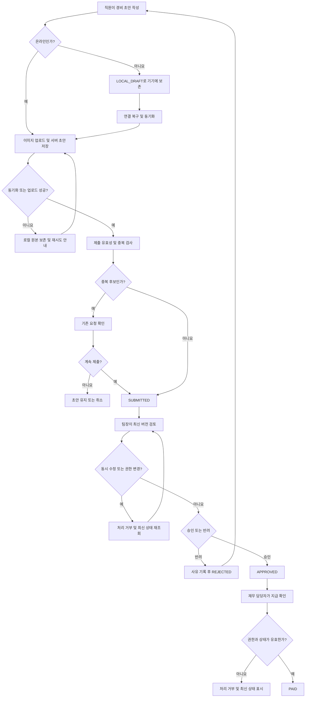

# 모바일 경비 승인 PRD

## Applicability

| Contract | Required / N/A | Evidence |
|---|---|---|
| Pages/routes or screen IDs | Required | 직원 제출, 팀장 승인, 재무 지급 처리 등 역할별 사용자 화면이 필요하다. |
| Empty/loading/error/success/recovery state matrix | Required | 오프라인 동기화, 이미지 업로드 실패, 중복 감지, 권한 변경, 동시 수정 충돌을 사용자에게 명시해야 한다. |
| Mermaid user or system flow | Required | 작성부터 제출, 승인·반려, 지급 완료까지 다단계 상태 전이가 존재한다. |

## Context and problem

직원이 모바일에서 경비를 제출하고, 팀장과 재무 담당자가 순차적으로 처리할 수 있는 경비 승인 기능이 필요하다.

모바일 네트워크 불안정, 영수증 이미지 업로드 실패, 동일 경비의 중복 제출, 처리 도중 권한 또는 요청 내용 변경 때문에 경비가 유실되거나 잘못 승인되는 상황을 방지해야 한다. 각 역할이 접근할 수 있는 데이터와 실행 가능한 상태 전이를 서버에서 강제해야 한다.

## Goals

- 직원이 영수증 사진, 금액, 카테고리를 입력해 경비를 제출할 수 있다.
- 네트워크가 없어도 초안을 작성하고 연결 복구 후 안전하게 동기화할 수 있다.
- 팀장이 자신에게 할당된 팀의 요청만 승인하거나 사유와 함께 반려할 수 있다.
- 재무 담당자가 승인된 요청을 지급 완료로 처리할 수 있다.
- 중복 제출과 동시 수정으로 인한 이중 처리 또는 잘못된 승인을 방지한다.
- 모든 중요 상태 변경의 수행자와 시점을 추적할 수 있다.
- 주요 사용자 흐름이 WCAG 2.2 AA를 충족한다.

### 성공 지표

1차 출시에는 임의의 목표 수치를 두지 않고 다음 항목을 측정한다.

- 경비 작성 시작 대비 제출 완료율
- 이미지 업로드 실패율과 재시도 성공률
- 오프라인 초안 동기화 성공률
- 중복 경고 발생률 및 경고 후 제출률
- 제출부터 승인·반려까지 걸린 시간
- 승인부터 지급 완료까지 걸린 시간
- 동시 수정 충돌 발생률
- 접근성 자동 검사 및 수동 핵심 흐름 통과율

성능 및 안정성 목표치는 실제 사용 데이터 확보 후 제품·엔지니어링 담당자가 결정한다.

## Non-goals

- 다중 통화 입력, 환율 변환 및 환차 처리
- ERP·회계 시스템과의 자동 연동
- 부분 승인 또는 부분 지급
- 다단계 승인선 및 대결 승인
- 영수증 OCR을 이용한 자동 입력
- 여러 건의 일괄 승인 또는 일괄 지급
- 승인·지급 완료 상태의 관리자 취소 또는 되돌리기
- 회계 분개 및 세금 신고 자동화

## Users, roles, and permissions

| 역할 | 허용 행위 | 데이터 범위 |
|---|---|---|
| 직원 | 초안 생성·수정·삭제, 경비 제출, 본인 요청 조회, 반려 요청 수정 및 재제출 | 자신이 작성한 경비와 로컬 초안 |
| 팀장 | 제출된 요청 조회, 승인, 반려 및 반려 사유 입력 | 자신에게 할당된 팀 소유의 요청 |
| 재무 담당자 | 승인된 요청 조회, 지급 완료 처리 | 권한이 부여된 조직 범위의 승인 요청 |
| 시스템 | 동기화, 중복 후보 감지, 상태 전이 검증, 감사 기록 | 요청 처리에 필요한 최소 범위 |

한 사용자가 여러 역할을 가질 수 있으며, 각 행위의 권한은 현재 활성화된 역할이 아니라 서버에 저장된 실제 권한과 데이터 범위로 판단한다.

## 상태 모델

| 상태 | 설명 | 가능한 다음 상태 |
|---|---|---|
| `LOCAL_DRAFT` | 기기에만 저장된 초안 | `DRAFT` |
| `DRAFT` | 서버에 동기화됐지만 제출되지 않은 초안 | `SUBMITTED` |
| `SUBMITTED` | 팀장 검토 대기 | `APPROVED`, `REJECTED` |
| `REJECTED` | 반려 사유가 기록된 요청 | `SUBMITTED` |
| `APPROVED` | 팀장이 승인한 요청 | `PAID` |
| `PAID` | 재무 담당자가 지급 완료로 표시한 최종 상태 | 없음 |

동기화 실패, 업로드 실패 및 충돌은 별도의 경비 업무 상태가 아니라 해당 요청에 표시되는 처리 상태다.

## Functional requirements

| ID | Requirement | Priority |
|---|---|---|
| FR-01 | 시스템은 모든 조회 및 변경 요청에서 현재 사용자의 인증 상태, 역할, 조직 및 팀 범위를 서버에서 검증해야 한다. | Must |
| FR-02 | 직원은 영수증 이미지 1장 이상, 0보다 큰 금액, 활성 카테고리를 포함한 경비 초안을 생성하고 수정할 수 있어야 한다. | Must |
| FR-03 | 1차 출시의 금액은 조직의 단일 기준 통화로 저장하며 직원이 통화를 선택하거나 환율을 입력할 수 없어야 한다. | Must |
| FR-04 | 영수증 이미지 업로드 진행 상태와 실패 원인을 표시하고, 실패한 이미지에 대해 재시도 또는 교체를 제공해야 한다. 모든 필수 이미지 업로드가 완료되기 전에는 제출할 수 없다. | Must |
| FR-05 | 제출 시 필수 필드, 이미지 업로드 완료 여부, 카테고리 유효성 및 사용자 권한을 서버에서 다시 검증하고, 성공한 요청을 `SUBMITTED`로 전환해야 한다. | Must |
| FR-06 | 동일한 제출 또는 동기화 작업의 네트워크 재시도에는 클라이언트 작업 식별자를 사용해 하나의 서버 요청만 생성해야 한다. | Must |
| FR-07 | 시스템은 동일 직원의 기존 요청과 영수증 파일 내용 해시 및 금액이 모두 같은 신규 요청을 중복 후보로 표시해야 한다. 직원은 기존 요청을 확인한 뒤 취소하거나 중복임을 인지하고 제출을 계속할 수 있어야 한다. | Must |
| FR-08 | 직원은 자신의 요청 목록과 상세 정보, 현재 상태, 반려 사유 및 처리 이력을 조회할 수 있어야 한다. | Must |
| FR-09 | 직원은 `SUBMITTED` 요청을 팀장이 처리하기 전까지 수정할 수 있다. 수정하면 요청 버전이 증가하고 팀장 화면에는 변경 사실이 반영되어야 한다. | Must |
| FR-10 | 직원은 `REJECTED` 요청을 수정해 재제출할 수 있다. 재제출 시 이전 반려 이력은 보존되고 상태는 `SUBMITTED`로 변경된다. | Must |
| FR-11 | 팀장은 자신에게 할당된 팀의 `SUBMITTED` 요청만 검토하고 승인 또는 반려할 수 있어야 한다. | Must |
| FR-12 | 반려 시 공백이 아닌 반려 사유가 필수이며, 승인 시 상태는 `APPROVED`, 반려 시 상태는 `REJECTED`가 되어야 한다. | Must |
| FR-13 | 팀장의 승인·반려 명령은 화면에 표시한 요청 버전을 포함해야 한다. 서버 버전이 다르면 처리를 수행하지 않고 최신 내용을 다시 확인하도록 안내해야 한다. | Must |
| FR-14 | 승인과 직원 수정이 동시에 발생하면 서버가 먼저 확정한 작업만 성공해야 한다. 승인 후 수정은 거부되고, 수정 후 이전 버전에 대한 승인은 충돌로 거부되어야 한다. | Must |
| FR-15 | 재무 담당자는 `APPROVED` 요청만 `PAID`로 변경할 수 있어야 한다. 이미 지급 완료됐거나 다른 상태인 요청에 대한 반복 명령은 추가 상태 변경을 만들지 않아야 한다. | Must |
| FR-16 | 직원은 오프라인에서 초안을 생성·수정할 수 있고, 앱은 로컬 저장 여부와 미동기화 상태를 표시해야 한다. 연결 복구 시 사용자가 동기화를 재개할 수 있어야 한다. | Must |
| FR-17 | 오프라인 초안 동기화는 요청 데이터와 영수증 업로드를 완료한 후 서버 초안으로 확정해야 한다. 일부 단계 실패 시 로컬 원본을 보존하고 실패 지점부터 재시도할 수 있어야 한다. | Must |
| FR-18 | 같은 서버 초안이 다른 기기에서 변경되어 동기화 충돌이 발생하면 어느 한쪽을 자동 덮어쓰지 않고 서버 버전과 로컬 버전 중 하나를 사용자가 선택하게 해야 한다. | Must |
| FR-19 | 작성 또는 검토 도중 권한이 변경되면 다음 서버 조회·변경 시점부터 새 권한을 적용해야 한다. 권한이 없는 승인·반려·지급 작업은 저장하지 않아야 한다. | Must |
| FR-20 | 오프라인 중 직원의 제출 권한이 없어졌다면 로컬 초안을 삭제하지 않고 기기에 보존하되 동기화·제출을 중단하고 권한 안내를 표시해야 한다. | Must |
| FR-21 | 제출, 수정, 재제출, 승인, 반려, 지급 완료 및 권한 오류에 대해 요청 ID, 상태 전이, 수행자, 시각과 요청 버전을 감사 기록으로 남겨야 한다. 영수증 이미지나 반려 사유 전문을 일반 애플리케이션 로그에 기록해서는 안 된다. | Must |

## Pages and routes

| Page or screen ID | Route, deep link, or explicit TBD + owner | Roles | Purpose |
|---|---|---|---|
| EXP-01 경비 목록 | 앱 내부 `Expenses` 탭; 외부 딥링크 N/A | 직원 | 본인 요청과 동기화 상태 조회 |
| EXP-02 경비 작성·수정 | 앱 내부 `Expenses/New`, `Expenses/{id}/Edit`; 외부 딥링크 N/A | 직원 | 온라인·오프라인 초안 작성, 이미지 업로드, 제출 |
| EXP-03 경비 상세 | 앱 내부 `Expenses/{id}`; 외부 딥링크 N/A | 직원, 팀장, 재무 담당자 | 역할별 허용 정보와 처리 이력 조회 |
| APR-01 승인 대기 목록 | 앱 내부 `Approvals` 탭; 외부 딥링크 N/A | 팀장 | 담당 팀의 제출 요청 조회 |
| APR-02 승인 검토 | 앱 내부 `Approvals/{id}`; 외부 딥링크 N/A | 팀장 | 최신 요청 검토, 승인 또는 반려 |
| FIN-01 지급 대기 목록 | 앱 내부 `Payments` 탭; 외부 딥링크 N/A | 재무 담당자 | 승인된 요청 조회 |
| FIN-02 지급 처리 | 앱 내부 `Payments/{id}`; 외부 딥링크 N/A | 재무 담당자 | 지급 완료 처리 |
| SYNC-01 동기화 문제 | EXP-01/02 내 상태 패널 | 직원 | 실패, 충돌, 권한 변경 및 재시도 처리 |

## State matrix

| Surface | Empty | Loading | Error | Success | Recovery |
|---|---|---|---|---|---|
| 직원 경비 목록 | “제출한 경비가 없습니다”와 작성 버튼 | 목록 로딩 표시 | 재조회 안내 | 상태별 요청 목록 | 재시도 또는 오프라인 캐시 표시 |
| 경비 작성 | 빈 필수 필드와 입력 안내 | 이미지 업로드·동기화 진행률 | 필드 오류, 업로드 실패, 권한 오류 | 로컬 저장, 동기화 또는 제출 완료 표시 | 이미지 재시도·교체, 초안 보존, 권한 재확인 |
| 중복 확인 | 해당 없음 | 기존 요청 조회 중 | 중복 검사 실패 시 제출 보류 및 재시도 | 기존 요청 요약과 계속/취소 선택 | 검사 재시도 |
| 승인 대기 목록 | “승인 대기 요청이 없습니다” | 목록 로딩 표시 | 권한 또는 네트워크 오류 | 담당 팀 요청 목록 | 권한 재확인 또는 재조회 |
| 승인 검토 | 해당 없음 | 최신 버전 로딩 | 권한 변경, 버전 충돌, 상태 변경 오류 | 승인·반려 완료 | 최신 버전 새로고침 후 재검토 |
| 지급 대기/처리 | “지급 대기 요청이 없습니다” | 목록 또는 처리 중 표시 | 권한 변경, 상태 변경 오류 | 지급 완료 표시 | 최신 상태 새로고침 |
| 오프라인 동기화 | 미동기화 초안 없음 | 항목별 동기화 진행 | 업로드 실패, 버전 충돌, 권한 상실 | 동기화 완료 | 재시도, 이미지 교체, 버전 선택 |

## User or system flow

## Authorization and data boundaries

- 모든 권한 검사는 서버에서 수행한다. 메뉴나 버튼을 숨기는 것만으로 권한을 보장해서는 안 된다.
- 직원은 작성자 ID가 본인인 요청만 조회하거나 수정할 수 있다.
- 팀장은 요청에 기록된 승인 담당 팀이 자신의 현재 관리 범위에 포함될 때만 조회 및 처리할 수 있다.
- 재무 담당자는 자신에게 부여된 조직 범위의 `APPROVED` 요청만 조회하고 지급 완료 처리할 수 있다.
- 요청 ID를 직접 변경해 다른 사용자의 요청에 접근하는 경우 서버는 데이터 존재 여부를 불필요하게 노출하지 않는 권한 오류를 반환한다.
- 승인·반려·지급 처리 시 서버가 권한, 현재 상태 및 요청 버전을 하나의 원자적 처리 단위에서 검증한다.
- 역할이나 팀 권한이 회수된 사용자의 기존 세션에도 다음 서버 요청부터 변경된 권한을 적용한다.
- 영수증 이미지 접근 URL은 인증·인가를 거쳐야 하며 공개 고정 URL로 노출하지 않는다.
- 로컬 초안과 영수증은 앱의 보호된 저장 영역에 보관하고 일반 사진 앨범이나 다른 앱에 자동 공개하지 않는다.
- 데이터 보존 및 삭제 기간은 조직 정책 확정 전까지 기존 회사 보안·개인정보 정책을 따른다.

## Non-functional requirements

### 접근성

- EXP-01부터 FIN-02까지의 핵심 흐름은 WCAG 2.2 AA를 목표로 한다.
- 모든 입력에는 프로그램적으로 연결된 레이블과 오류 설명을 제공한다.
- 상태, 오류, 승인 여부를 색상만으로 전달하지 않는다.
- 키보드 및 보조기술로 모든 주요 동작을 수행할 수 있어야 한다.
- 이미지 추가·교체, 충돌 해결, 승인·반려 및 지급 완료에 접근 가능한 이름을 제공한다.
- 동기화 및 업로드 상태 변화는 화면 낭독기에 과도한 반복 없이 전달한다.
- 동작 영역, 포커스 표시, 텍스트 확대 및 명암비는 WCAG 2.2 AA 기준을 충족해야 한다.

### 성능 및 관측성

1차 출시 전 다음 지표를 계측하되, 근거 없는 수치 목표를 출시 조건으로 두지 않는다.

| 지표 | 측정 범위 | 목표 결정 책임자 및 시점 |
|---|---|---|
| 화면 데이터 표시 시간 | 경비·승인·지급 목록 및 상세 | 엔지니어링 리드와 제품 책임자, 베타 측정 후 GA 목표 확정 |
| 이미지 업로드 시간 및 성공률 | 파일 크기·네트워크 유형별 | 모바일 리드, 베타 측정 후 확정 |
| 오프라인 동기화 완료 시간 및 성공률 | 연결 복구부터 서버 확정까지 | 모바일·백엔드 리드, 베타 측정 후 확정 |
| 승인·지급 명령 처리 시간과 충돌률 | 상태 전이 API | 백엔드 리드, 베타 측정 후 확정 |

### 신뢰성 및 보안

- 재시도 때문에 동일 제출이나 지급 처리가 중복 생성되지 않아야 한다.
- 앱 종료, 네트워크 단절 또는 업로드 실패 후에도 저장됐다고 표시한 로컬 초안을 복구할 수 있어야 한다.
- 민감한 영수증 데이터는 전송 및 저장 시 회사 표준 보안 정책을 적용한다.
- 운영 로그에는 영수증 이미지, 인증 정보 및 반려 사유 전문을 남기지 않는다.
- 클라이언트 시각을 상태 전이의 권한 판단이나 처리 순서 기준으로 사용하지 않는다.

## Acceptance criteria

| ID | Requirement | Given | When | Then | Verification |
|---|---|---|---|---|---|
| AC-01 | FR-02, FR-03, FR-05 | 직원이 금액·카테고리·영수증 중 하나를 누락했거나 금액이 0 이하일 때 | 제출을 시도한다 | 서버는 제출을 거부하고 필드별 오류를 반환하며 초안은 보존된다 | API 통합 테스트, UI 테스트 |
| AC-02 | FR-03 | 조직의 기준 통화가 설정되어 있을 때 | 직원이 경비를 작성한다 | 통화 선택이나 환율 입력 없이 해당 기준 통화로 금액이 저장·표시된다 | UI 및 API 테스트 |
| AC-03 | FR-04 | 영수증 업로드가 실패했을 때 | 직원이 제출하거나 재시도한다 | 제출은 차단되고 실패 이미지의 재시도·교체가 가능하며 입력값은 유지된다 | 네트워크 오류 주입 E2E 테스트 |
| AC-04 | FR-06 | 같은 작업 식별자의 제출 응답이 유실됐을 때 | 앱이 동일 제출을 재시도한다 | 서버에는 하나의 경비 요청만 존재하고 동일 결과가 반환된다 | API 통합 테스트 |
| AC-05 | FR-07 | 같은 직원에게 동일 파일 해시와 금액의 기존 요청이 있을 때 | 신규 제출을 시도한다 | 기존 요청 요약과 중복 경고가 표시되고 직원의 취소 또는 계속 선택이 기록된다 | API 및 E2E 테스트 |
| AC-06 | FR-08, FR-10 | 직원 요청이 반려됐을 때 | 직원이 상세를 열고 수정 후 재제출한다 | 반려 사유와 과거 이력이 보이며 새 버전이 `SUBMITTED`가 된다 | E2E 테스트 |
| AC-07 | FR-11, FR-12 | 팀장에게 담당 팀의 제출 요청이 있을 때 | 승인 또는 사유를 입력해 반려한다 | 유효한 요청만 `APPROVED` 또는 `REJECTED`로 전환되고 수행자·시각이 기록된다 | 권한 및 상태 전이 통합 테스트 |
| AC-08 | FR-01, FR-11 | 다른 팀의 요청 ID를 알고 있는 팀장이 있을 때 | 목록·상세 조회 또는 승인 API를 호출한다 | 요청 데이터가 노출되지 않고 상태도 변경되지 않는다 | 서버 권한 테스트 |
| AC-09 | FR-12 | 팀장이 빈 값 또는 공백만 있는 사유로 반려할 때 | 반려를 확정한다 | 서버가 요청을 거부하고 요청은 `SUBMITTED`로 유지된다 | API 및 UI 테스트 |
| AC-10 | FR-09, FR-13, FR-14 | 팀장이 버전 3을 검토하는 동안 직원 수정으로 버전 4가 됐을 때 | 팀장이 버전 3 승인을 제출한다 | 승인은 저장되지 않고 최신 내용을 다시 검토하라는 충돌 상태가 표시된다 | 동시성 통합 테스트 |
| AC-11 | FR-14 | 팀장의 승인이 먼저 확정됐을 때 | 직원이 이전 버전 수정을 저장한다 | 수정은 거부되고 요청은 `APPROVED`로 유지된다 | 동시성 통합 테스트 |
| AC-12 | FR-15 | 재무 담당자가 승인된 요청을 보고 있을 때 | 지급 완료를 확정한다 | 요청은 한 번만 `PAID`가 되고 수행자와 시각이 기록된다 | API 및 E2E 테스트 |
| AC-13 | FR-15 | 재무 담당자가 `SUBMITTED`, `REJECTED` 또는 `PAID` 요청을 지급 처리할 때 | 지급 완료 명령을 보낸다 | 서버는 상태 변경을 거부하거나 기존 완료 결과를 반환하며 추가 전이를 만들지 않는다 | 상태 전이 테스트 |
| AC-14 | FR-16, FR-17 | 기기가 오프라인일 때 | 직원이 사진과 필수 정보를 입력하고 저장한 뒤 앱을 재실행한다 | 초안과 이미지가 복구되고 미동기화 상태가 표시된다 | 오프라인 E2E 테스트 |
| AC-15 | FR-17 | 이미지 동기화 도중 연결이 끊겼을 때 | 연결 복구 후 재시도한다 | 로컬 원본과 입력값을 잃지 않고 완료되지 않은 단계부터 동기화를 재개한다 | 네트워크 단절 E2E 테스트 |
| AC-16 | FR-18 | 같은 초안의 서버 버전과 오프라인 로컬 버전이 모두 변경됐을 때 | 동기화를 시도한다 | 자동 덮어쓰기 없이 두 버전의 차이와 선택지가 제공된다 | 충돌 E2E 테스트 |
| AC-17 | FR-19 | 팀장이 검토 화면을 연 뒤 해당 팀 관리 권한을 잃었을 때 | 승인 또는 반려를 시도한다 | 서버는 처리를 거부하고 최신 권한 안내를 표시하며 상태는 유지된다 | 권한 변경 통합 테스트 |
| AC-18 | FR-20 | 직원이 오프라인 초안을 가진 상태에서 제출 권한을 잃었을 때 | 연결 후 동기화를 시도한다 | 서버 요청은 생성되지 않고 로컬 초안은 보존되며 권한 오류가 표시된다 | 권한 변경 E2E 테스트 |
| AC-19 | FR-21 | 경비 상태가 제출부터 지급 완료까지 변경됐을 때 | 감사 기록을 조회한다 | 각 전이의 요청 ID, 전·후 상태, 수행자, 시각, 버전이 존재하고 민감한 전문은 일반 로그에 없다 | 감사 로그 검사 |
| AC-20 | 접근성 NFR | 핵심 화면이 구현됐을 때 | 자동 검사와 보조기술 기반 수동 검사를 수행한다 | WCAG 2.2 AA 위반이 출시 예외로 승인되지 않은 채 남아 있지 않는다 | 접근성 자동 검사 및 수동 테스트 |

## Assumptions and open decisions

### 합리적 가정

| ID | 가정 | 영향 |
|---|---|---|
| AS-01 | 직원·팀장·재무 담당자의 인증과 역할 데이터는 기존 사내 계정 시스템에서 제공된다. | 본 기능은 별도 회원가입이나 역할 관리 화면을 만들지 않는다. |
| AS-02 | 1차 출시에서는 조직별 기준 통화 하나가 사전에 설정되어 있다. | 통화 선택과 환율 계산 없이 금액만 입력한다. |
| AS-03 | 경비가 제출될 때 승인 담당 팀을 기록하고, 이후 일반 직원의 팀 이동만으로 기존 요청의 승인 담당 팀을 자동 변경하지 않는다. | 처리 중인 요청의 승인 책임이 예측 가능하게 유지된다. 관리자 재배정 기능은 v1 범위 밖이다. |
| AS-04 | 직원은 팀장 처리 전까지 제출 요청을 수정할 수 있다. | 승인 시 버전 검증과 충돌 UI가 필요하다. |
| AS-05 | 중복 감지는 지급이나 제출을 무조건 차단하는 회계 판정이 아니라 사용자 확인을 요구하는 안전장치다. | 같은 영수증을 정당하게 다시 사용해야 하는 예외를 허용하되 기록한다. |
| AS-06 | `APPROVED` 및 `PAID` 상태의 금액·카테고리·이미지는 수정할 수 없다. | 승인 이후 회계 데이터의 일관성을 유지한다. |
| AS-07 | 반려 사유와 상태 이력은 해당 경비를 제출한 직원에게 공개된다. | 직원이 수정 방향을 이해하고 재제출할 수 있다. |
| AS-08 | 인터넷 연결 복구 후 동기화는 자동 감지할 수 있지만, 대용량 이미지 전송이나 오류 복구에는 명시적인 사용자 재시도를 허용한다. | 백그라운드 실행 제약과 데이터 사용량 문제를 피할 수 있다. |

### 열린 결정

| ID | 결정 필요 사항 | 선택지 및 영향 | 책임자 | 결정 시점 |
|---|---|---|---|---|
| OD-01 | 허용 이미지 형식, 장수 및 파일 크기 제한 | 제한값은 모바일 메모리, 업로드 비용 및 보안 검증에 영향을 준다. | 모바일·백엔드·보안 리드 | 이미지 API 계약 확정 전 |
| OD-02 | 금액의 최대값과 소수 자릿수 | 기준 통화의 회계 규칙과 서버 데이터 타입 및 입력 UI에 영향을 준다. | 재무 책임자·백엔드 리드 | 데이터 모델 확정 전 |
| OD-03 | 카테고리 목록과 비활성화 정책 | 고정 목록 또는 관리형 목록 여부와 기존 초안 처리 방식에 영향을 준다. | 재무·제품 책임자 | UI/API 계약 확정 전 |
| OD-04 | 중복 후보 범위 | `SUBMITTED` 이상만 비교할지, 반려·초안까지 포함할지에 따라 오탐과 누락이 달라진다. | 재무·제품 책임자 | 중복 검사 구현 전 |
| OD-05 | 여러 팀장이 있는 팀의 승인 권한 | 모든 팀장이 처리할지 지정 승인자만 처리할지 권한 모델에 영향을 준다. | 업무 운영·제품 책임자 | 권한 API 확정 전 |
| OD-06 | 조직·팀 개편 시 미처리 요청의 재배정 절차 | 기존 팀 유지, 자동 이동 또는 관리자 재배정 중 선택해야 한다. | 업무 운영·보안 책임자 | 운영 시범 전 |
| OD-07 | 로컬 초안과 영수증의 보존 기간 | 자동 삭제 정책은 개인정보, 기기 저장 공간 및 사용자 복구 경험에 영향을 준다. | 보안·법무·제품 책임자 | 베타 출시 전 |
| OD-08 | 성능 목표 수치 | 베타 계측 결과에 따라 화면 표시, 업로드, 동기화 및 상태 전이 목표를 확정한다. | 제품·엔지니어링 책임자 | 베타 측정 완료 후, GA 전 |

## Risks and mitigations

| 위험 | 영향 | 완화 방안 |
|---|---|---|
| 불안정한 네트워크에서 제출 재시도로 요청이 중복 생성됨 | 이중 승인·지급 가능성 | 작업 식별자 기반 멱등 처리, 중복 후보 경고, 감사 기록 |
| 이미지 업로드 일부 성공 후 앱 종료 | 영수증 없는 불완전 요청 또는 데이터 유실 | 제출 전 전체 업로드 검증, 로컬 원본 보존, 단계별 재시도 |
| 직원 수정과 팀장 승인이 동시에 발생 | 팀장이 확인하지 않은 내용 승인 | 요청 버전과 원자적 상태 전이, 충돌 시 최신 버전 재검토 |
| 역할·팀 권한이 변경됐지만 기존 화면이 남아 있음 | 무권한 조회 또는 처리 | 모든 서버 요청에서 실시간 권한 재검증, 실패 후 민감 정보 제거 |
| 이미지 해시만으로 중복을 단정함 | 정상 경비 차단 또는 중복 누락 | 중복 후보로만 표시하고 사용자 확인 기록, 운영 데이터로 규칙 개선 |
| 오프라인 영수증이 기기에 장기간 남음 | 개인정보 노출 및 저장 공간 증가 | 보호된 저장소 사용, 보존 기간 확정, 동기화 완료 후 정책에 따른 정리 |
| 성능 목표가 확정되지 않음 | 출시 품질 판단 불명확 | 베타에서 지표 계측 후 GA 전에 목표 및 회귀 기준 확정 |
| WCAG 목표가 개발 후반에만 검증됨 | 수정 비용 증가 및 출시 지연 | 디자인·컴포넌트 단계부터 자동 검사와 보조기술 수동 검사를 포함 |

## Delivery

| Phase | Requirement IDs | Verifiable exit condition |
|---|---|---|
| 1. 상태·권한 기반 구축 | FR-01, FR-03, FR-19, FR-21 | 역할별 데이터 범위, 상태 전이, 버전 및 감사 기록에 대한 서버 테스트가 통과한다. |
| 2. 직원 온라인 제출 | FR-02, FR-04, FR-05, FR-06, FR-07, FR-08 | 작성·업로드·중복 확인·멱등 제출·목록/상세 흐름이 E2E 테스트를 통과한다. |
| 3. 승인·반려·지급 | FR-09, FR-10, FR-11, FR-12, FR-13, FR-14, FR-15 | 팀 범위 승인, 필수 반려 사유, 동시 수정 충돌 및 지급 완료 상태 전이 테스트가 통과한다. |
| 4. 오프라인 및 권한 변경 복구 | FR-16, FR-17, FR-18, FR-20 | 앱 재실행, 네트워크 단절, 다기기 충돌 및 권한 상실 시 초안 보존·복구 E2E 테스트가 통과한다. |
| 5. 접근성·계측 및 베타 | 전체 FR 및 NFR | WCAG 2.2 AA 핵심 흐름 검사가 완료되고 성능·업로드·동기화 지표가 수집 가능하며, OD-08 목표 결정에 필요한 베타 데이터가 확보된다. |