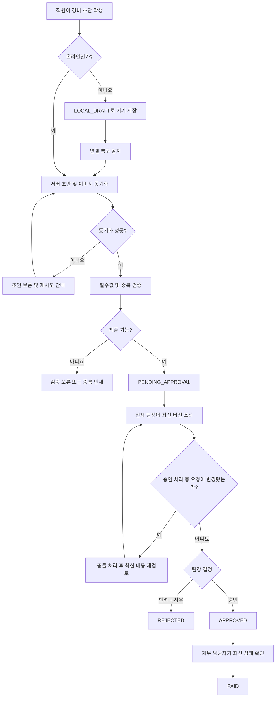

# 모바일 경비 승인 PRD

## Applicability

| Contract | Required / N/A | Evidence |
|---|---|---|
| Pages/routes or screen IDs | Required | 직원·팀장·재무 담당자가 모바일 화면에서 요청을 작성하고 상태별 업무를 수행한다. |
| Empty/loading/error/success/recovery state matrix | Required | 오프라인 동기화, 이미지 업로드 실패, 권한 변경, 동시 수정 충돌을 사용자에게 표시하고 복구해야 한다. |
| Mermaid user or system flow | Required | 초안 작성부터 제출, 승인·반려, 지급 완료까지 다단계 상태 수명주기가 존재한다. |

## Context and problem

직원은 모바일에서 영수증을 촬영하거나 첨부해 경비를 제출하고, 팀장과 재무 담당자는 역할별로 승인 및 지급 상태를 처리할 수 있어야 한다.

모바일 환경에서는 연결 단절, 이미지 업로드 실패, 중복 전송이 발생할 수 있다. 또한 요청 검토 중 직원의 수정, 사용자의 역할·팀 변경으로 인해 잘못된 승인이나 권한 노출이 발생할 수 있으므로 서버 기준의 상태 및 권한 검증이 필요하다.

## Goals

- 직원이 영수증 사진, 금액, 카테고리를 포함한 경비 요청을 모바일에서 제출할 수 있다.
- 오프라인에서도 초안을 작성하고, 연결 복구 후 안전하게 동기화할 수 있다.
- 팀장은 현재 자신이 담당하는 팀의 요청만 승인하거나 사유와 함께 반려할 수 있다.
- 재무 담당자는 승인된 요청만 지급 완료로 표시할 수 있다.
- 재시도에 의한 중복 생성과 동일 영수증의 명백한 중복 제출을 방지한다.
- 권한 변경과 동시 수정 상황에서도 잘못된 조회 또는 상태 변경을 막는다.
- 핵심 사용자 흐름이 WCAG 2.2 AA를 충족한다.

## Non-goals

1차 출시에는 다음을 포함하지 않는다.

- 다중 통화 입력, 환율 계산 및 환차손익 처리
- ERP·회계 시스템 자동 연동
- 분할 승인 또는 다단계 승인
- 대리 승인, 승인 위임 및 임시 팀장
- 경비 정책에 따른 자동 승인·자동 반려
- 지급 계좌 관리 또는 실제 송금 실행
- OCR을 통한 금액·카테고리 자동 입력
- 푸시·이메일 알림
- 승인·지급 완료 상태를 일반 사용자가 되돌리는 기능

## Users, roles, and permissions

| Role | Permitted behavior | Restrictions |
|---|---|---|
| 직원 | 자기 초안 생성·수정·삭제, 자기 요청 제출 및 조회 | 다른 직원의 요청을 조회할 수 없다. 승인·반려·지급 처리를 할 수 없다. |
| 팀장 | 현재 담당 팀의 제출 대기 요청 조회, 승인, 사유를 입력한 반려 | 다른 팀 요청을 조회하거나 처리할 수 없다. 승인 완료·반려·지급 완료 요청의 결정을 변경할 수 없다. |
| 재무 담당자 | 승인된 요청 조회, 지급 완료 처리 | 제출 대기 요청을 승인·반려할 수 없으며, 승인되지 않은 요청을 지급 완료로 만들 수 없다. |
| 시스템 | 동기화, 중복 방지, 권한·버전·상태 검증, 감사 기록 생성 | 클라이언트가 전달한 역할이나 팀 정보를 권한 판단의 근거로 신뢰하지 않는다. |

한 사용자가 복수 역할을 보유할 수 있지만, 각 작업은 해당 작업에 필요한 현재 권한을 서버에서 독립적으로 검증한다.

## Expense lifecycle

| Status | Meaning | Allowed transition |
|---|---|---|
| `LOCAL_DRAFT` | 기기에만 저장된 오프라인 초안 | `SYNCED_DRAFT` |
| `SYNCED_DRAFT` | 서버에 동기화되었으나 제출되지 않은 초안 | `PENDING_APPROVAL`, 삭제 |
| `PENDING_APPROVAL` | 팀장 검토 대기 | 직원 수정 후 동일 상태 유지, `APPROVED`, `REJECTED` |
| `APPROVED` | 팀장 승인 완료 | `PAID` |
| `REJECTED` | 사유와 함께 반려 완료 | 종결 |
| `PAID` | 재무 담당자가 지급 완료로 표시 | 종결 |

`REJECTED` 요청을 수정해 재제출하는 경우 기존 요청을 변경하지 않고 새 초안으로 복제한다. 이를 통해 기존 결정과 감사 이력을 보존한다.

## Functional requirements

| ID | Requirement | Priority |
|---|---|---|
| FR-01 | 직원은 영수증 이미지 1장, 0보다 큰 금액, 유효한 카테고리를 포함한 경비 초안을 생성·수정·삭제할 수 있어야 한다. | Must |
| FR-02 | 통화는 조직에 설정된 단일 기준 통화로 고정하고, 직원에게 통화 선택 기능을 제공하지 않아야 한다. | Must |
| FR-03 | 초안은 온라인 여부와 관계없이 기기에 보존되어야 하며, 오프라인 상태임을 사용자에게 표시해야 한다. | Must |
| FR-04 | 연결이 복구되면 로컬 초안을 서버 초안과 동기화해야 한다. 동기화 성공 전에는 로컬 데이터를 삭제하지 않아야 한다. | Must |
| FR-05 | 동기화 실패 시 실패한 초안을 식별해 상태와 원인을 표시하고, 자동 재시도와 사용자의 수동 재시도를 지원해야 한다. | Must |
| FR-06 | 제출은 모든 필수값 검증과 영수증 이미지 업로드가 성공한 온라인 상태에서만 완료되어야 한다. 실패 시 입력 내용은 초안으로 유지되어야 한다. | Must |
| FR-07 | 각 초안과 제출 시도에 클라이언트 생성 고유 키를 사용하여 타임아웃이나 재시도로 동일 요청이 두 번 생성되지 않도록 해야 한다. | Must |
| FR-08 | 동일 직원이 동일한 이미지 체크섬과 금액으로 생성한 기존 요청이 있으면 중복 가능성을 표시하고 기본적으로 새 제출을 차단해야 한다. | Must |
| FR-09 | 제출 시점의 직원 소속 팀을 요청에 기록하고, 해당 팀의 현재 팀장만 `PENDING_APPROVAL` 요청을 조회하고 처리할 수 있어야 한다. | Must |
| FR-10 | 팀장은 `PENDING_APPROVAL` 요청을 승인하거나 반려할 수 있으며, 반려 시 공백이 아닌 사유 입력이 필수여야 한다. | Must |
| FR-11 | 재무 담당자는 `APPROVED` 요청만 `PAID`로 변경할 수 있으며, 처리자와 처리 시각을 기록해야 한다. | Must |
| FR-12 | 모든 조회 및 상태 변경 요청은 서버에서 현재 역할, 조직, 팀 범위 및 요청 상태를 검증해야 한다. | Must |
| FR-13 | 권한이나 팀 소속이 변경된 사용자는 다음 조회 또는 작업 시점부터 변경된 권한을 적용받아야 한다. 이미 열린 화면에서 작업하더라도 서버가 다시 검증해야 한다. | Must |
| FR-14 | 요청에는 단조 증가하는 버전을 부여하고, 직원 수정·팀장 결정·지급 완료 시 클라이언트가 확인한 버전과 서버 최신 버전이 일치할 때만 처리해야 한다. | Must |
| FR-15 | 버전 충돌 시 작업을 적용하지 않고 최신 요청을 다시 불러오도록 안내해야 한다. 승인 검토 중 요청이 수정되었다면 팀장은 변경 내용을 다시 검토해야 한다. | Must |
| FR-16 | 요청 생성, 제출, 수정, 승인, 반려, 지급 완료 및 실패한 권한 검증에 대해 행위자·시각·이전 상태·이후 상태를 감사 기록으로 남겨야 한다. | Must |
| FR-17 | 직원은 자기 요청의 현재 상태, 반려 사유, 지급 완료 여부를 조회할 수 있어야 한다. | Must |
| FR-18 | 목록은 역할에 맞는 업무 상태로 구분해야 한다. 직원은 자기 요청, 팀장은 자기 팀의 승인 대기, 재무 담당자는 승인 및 지급 완료 요청을 조회할 수 있어야 한다. | Must |

## Data requirements

| Entity | Required data |
|---|---|
| Expense request | 요청 ID, 조직 ID, 직원 ID, 제출 당시 팀 ID, 금액, 기준 통화, 카테고리 ID, 이미지 참조, 이미지 체크섬, 상태, 버전, 생성·수정 시각 |
| Submission identity | 클라이언트 초안 ID, 제출 멱등 키 |
| Rejection | 반려 사유, 반려자 ID, 반려 시각 |
| Approval | 승인자 ID, 승인 시각, 승인 당시 요청 버전 |
| Payment completion | 처리자 ID, 처리 시각 |
| Audit record | 행위자, 작업, 요청 ID, 이전·이후 상태, 요청 버전, 발생 시각 |

금액은 부동소수점이 아닌 통화 최소 단위 기준의 정수 또는 동등하게 정밀도가 보장되는 형식으로 저장한다.

## Pages and routes

실제 URL은 클라이언트 기술 방식 결정 후 엔지니어링 책임자가 확정한다. 아래 화면 ID는 분석·디자인·테스트에서 안정적인 식별자로 사용한다.

| Page or screen ID | Route, deep link, or explicit TBD + owner | Roles | Purpose |
|---|---|---|---|
| EXP-LIST | TBD — Engineering, UI 구현 시작 전 | 직원 | 자기 요청과 상태 조회 |
| EXP-EDIT | TBD — Engineering, UI 구현 시작 전 | 직원 | 온라인·오프라인 초안 작성 및 수정 |
| EXP-DETAIL | TBD — Engineering, UI 구현 시작 전 | 직원 | 제출 결과, 반려 사유 및 지급 상태 조회 |
| APR-INBOX | TBD — Engineering, UI 구현 시작 전 | 팀장 | 자기 팀의 승인 대기 요청 조회 |
| APR-DETAIL | TBD — Engineering, UI 구현 시작 전 | 팀장 | 영수증·금액·카테고리 검토 및 승인·반려 |
| FIN-QUEUE | TBD — Engineering, UI 구현 시작 전 | 재무 담당자 | 승인 및 지급 완료 요청 조회 |
| FIN-DETAIL | TBD — Engineering, UI 구현 시작 전 | 재무 담당자 | 승인 요청 확인 및 지급 완료 처리 |

## State matrix

| Surface | Empty | Loading | Error | Success | Recovery |
|---|---|---|---|---|---|
| 직원 요청 목록 | “등록된 경비가 없습니다”와 작성 버튼 표시 | 목록 스켈레톤 및 중복 요청 방지 | 재조회 가능한 오류 표시 | 요청별 상태와 동기화 여부 표시 | 새로고침 또는 연결 복구 후 자동 재조회 |
| 초안 작성 | 빈 필드와 영수증 추가 안내 | 이미지 처리·동기화 진행 상태 표시 | 필드 오류, 저장 실패 또는 용량·형식 오류 표시 | 로컬 저장, 서버 동기화 또는 제출 완료를 구분해 표시 | 입력 보존 후 재저장·재업로드·재제출 |
| 오프라인 초안 | 해당 없음 | 로컬 저장 중 표시 | 로컬 저장 실패를 명시 | “기기에 저장됨, 연결 시 동기화” 표시 | 연결 복구 시 자동 동기화 및 수동 재시도 |
| 이미지 업로드 | 이미지 미첨부 안내 | 진행 상태와 취소 가능 여부 표시 | 실패 원인과 재시도 표시 | 미리보기와 업로드 완료 표시 | 동일 초안에서 이미지 재선택 또는 재업로드 |
| 승인함 | “승인 대기 요청이 없습니다” 표시 | 목록 스켈레톤 | 권한·네트워크 오류 구분 | 현재 팀의 승인 대기 요청 표시 | 권한 재확인, 재로그인 또는 재조회 |
| 승인 상세 | 해당 없음 | 최신 버전 조회 중 표시 | 권한 상실·버전 충돌·이미 처리됨을 구분 | 승인 또는 반려 결과 표시 | 최신 데이터로 새로고침 후 재검토 |
| 지급 목록·상세 | “지급할 요청이 없습니다” 표시 | 목록 또는 처리 진행 표시 | 권한 오류·버전 충돌·잘못된 상태 표시 | 지급 완료 처리자와 시각 표시 | 최신 상태 재조회 후 가능한 작업만 제공 |

## User or system flow

## Authorization and data boundaries

- 모든 요청은 인증된 조직 범위 안에서만 접근할 수 있다.
- 직원의 요청 ID를 알고 있더라도 소유자가 아니면 조회·수정할 수 없다.
- 팀장 권한은 서버의 현재 팀장-팀 관계를 기준으로 판단한다.
- 재무 담당자 권한은 서버의 현재 조직 역할을 기준으로 판단한다.
- 목록 필터링이나 버튼 숨김은 편의 기능이며 권한 통제가 아니다. 상세 조회와 변경 API가 각각 권한을 검증해야 한다.
- 팀장이나 재무 담당자의 권한이 제거되면 이미 열어 둔 화면에서도 이후 조회·처리를 거부한다.
- 권한 오류 응답은 다른 조직 또는 접근 불가능한 요청의 존재 여부와 상세 정보를 노출하지 않아야 한다.
- 승인 또는 반려 후 직원의 팀이 변경되더라도 기존 요청의 제출 당시 팀과 처리 감사 기록은 변경하지 않는다.
- 영수증 이미지 접근에도 요청 데이터와 동일한 권한 검증을 적용한다. 추측 가능한 공개 URL을 사용하지 않는다.
- 클라이언트가 전달한 조직 ID, 팀 ID, 역할, 요청 상태를 신뢰해 권한이나 상태 전이를 결정하지 않는다.

## Non-functional requirements

### Accessibility

- 핵심 흐름은 WCAG 2.2 AA를 목표로 한다.
- 모든 입력에는 프로그램적으로 연결된 레이블과 오류 설명을 제공한다.
- 상태와 오류를 색상만으로 구분하지 않는다.
- 키보드 및 보조기술만으로 초안 작성, 제출, 승인·반려, 지급 완료가 가능해야 한다.
- 이미지 추가 기능은 카메라 촬영만 강제하지 않고 기존 파일 선택 대안을 제공한다.
- 동기화·업로드·승인 결과와 버전 충돌은 적절한 라이브 영역 또는 동등한 방식으로 전달한다.
- 포커스 순서, 포커스 표시, 터치 대상 크기, 명도 대비 및 인증 흐름은 WCAG 2.2 AA 기준으로 검증한다.

### Reliability and integrity

- 제출과 상태 변경은 멱등성을 보장해야 한다.
- 이미지 업로드 성공과 요청 제출 성공을 혼동하지 않아야 한다.
- 이미지가 없는 불완전한 요청은 `PENDING_APPROVAL`로 전환할 수 없다.
- 상태 전이와 감사 기록 생성은 논리적으로 하나의 작업으로 처리되어야 한다.
- 동기화되지 않은 로컬 초안은 성공 확인 전까지 유지해야 한다.

### Security and privacy

- 전송 중 데이터와 서버 저장 데이터는 조직의 기존 보안 기준을 적용한다.
- 로컬 초안과 영수증은 선택된 모바일 플랫폼이 제공하는 보호된 앱 저장소를 사용한다.
- 로그와 오류 추적 정보에 영수증 이미지, 전체 반려 사유 또는 인증 정보를 기록하지 않는다.
- 이미지 파일은 실제 콘텐츠 유형을 검사하고 실행 가능한 콘텐츠로 제공하지 않는다.

### Performance measurement

현재 수치 목표는 설정하지 않는다. 1차 출시에는 다음 지표를 측정할 수단을 포함하고, 베타 측정 후 Product와 Engineering이 목표값을 결정한다.

- 요청 목록 및 상세 화면의 체감 로딩 시간
- 이미지 업로드 성공률과 완료 시간
- 제출 성공률과 완료 시간
- 연결 복구 후 초안 동기화 성공률과 완료 시간
- 승인·반려·지급 완료 API 성공률
- 버전 충돌 및 중복 차단 발생률

## Acceptance criteria

| ID | Requirement | Given | When | Then | Verification |
|---|---|---|---|---|---|
| AC-01 | FR-01, FR-02 | 직원이 새 초안을 작성한다 | 이미지·금액·카테고리 중 하나가 없거나 금액이 0 이하인 상태로 제출한다 | 제출되지 않고 해당 필드에 접근 가능한 오류가 표시된다 | UI 자동화 + API 테스트 |
| AC-02 | FR-03, FR-04 | 기기가 오프라인이다 | 직원이 이미지·금액·카테고리를 입력하고 저장한다 | 초안이 `LOCAL_DRAFT`로 보존되고 오프라인 상태가 표시된다 | 오프라인 통합 테스트 |
| AC-03 | FR-04, FR-05 | 저장된 `LOCAL_DRAFT`가 있다 | 연결이 복구된다 | 자동 동기화를 시도하고, 성공 시 `SYNCED_DRAFT`, 실패 시 초안 보존과 재시도 기능을 제공한다 | 네트워크 전환 테스트 |
| AC-04 | FR-05, FR-06 | 이미지 업로드 중 네트워크가 끊긴다 | 업로드가 실패한다 | 제출 요청은 생성되지 않고 다른 입력은 유지되며 이미지 재업로드가 가능하다 | 장애 주입 테스트 |
| AC-05 | FR-07 | 동일 멱등 키의 제출 요청이 타임아웃으로 반복된다 | 서버가 반복 요청을 수신한다 | 하나의 경비 요청만 존재하고 모든 성공 응답은 동일 요청을 가리킨다 | API 통합 테스트 |
| AC-06 | FR-08 | 동일 직원의 기존 요청과 이미지 체크섬 및 금액이 같은 초안이 있다 | 직원이 제출한다 | 새 요청 생성을 차단하고 기존 요청으로 이동할 수 있는 안내를 표시한다 | API + UI 테스트 |
| AC-07 | FR-09, FR-10, FR-12 | 팀장에게 자기 팀과 다른 팀의 요청이 존재한다 | 승인함과 상세 요청에 접근한다 | 자기 팀 요청만 조회·처리할 수 있고 다른 팀 요청은 직접 ID로도 접근할 수 없다 | 권한 통합 테스트 |
| AC-08 | FR-10 | 팀장이 승인 대기 요청을 반려한다 | 사유가 공백이다 | 반려되지 않고 사유 입력 오류가 표시된다 | UI + API 테스트 |
| AC-09 | FR-10, FR-16 | 팀장이 최신 버전의 승인 대기 요청을 승인 또는 사유와 함께 반려한다 | 서버가 요청을 처리한다 | 상태와 결정자·시각·버전·사유가 일관되게 기록된다 | API + 감사 기록 테스트 |
| AC-10 | FR-11, FR-12 | 재무 담당자가 승인 요청과 비승인 요청을 조회한다 | 지급 완료 처리를 시도한다 | `APPROVED`만 `PAID`가 되며 처리자와 시각이 기록된다 | 상태 전이 테스트 |
| AC-11 | FR-13 | 팀장이 승인 상세를 열어 둔 뒤 해당 팀장 권한을 잃는다 | 승인 또는 반려를 시도한다 | 서버가 작업을 거부하고 화면은 권한 변경을 알린다 | 권한 변경 통합 테스트 |
| AC-12 | FR-14, FR-15 | 팀장이 버전 N을 검토하는 동안 직원 수정으로 버전 N+1이 생성된다 | 팀장이 버전 N으로 승인한다 | 승인은 적용되지 않고 최신 버전을 다시 검토하도록 안내한다 | 동시성 테스트 |
| AC-13 | FR-14, FR-15 | 직원이 버전 N을 수정하는 동안 팀장이 먼저 승인한다 | 직원이 버전 N으로 저장한다 | 수정은 적용되지 않으며 승인된 원본 또는 새 초안 복제 선택지를 제공한다 | 동시성 테스트 |
| AC-14 | FR-17, FR-18 | 직원·팀장·재무 담당자가 각각 로그인한다 | 목록과 상세 화면을 조회한다 | 역할별 허용 데이터와 작업만 표시되며 서버 응답 범위도 동일하다 | 역할별 E2E 테스트 |
| AC-15 | FR-01~FR-18 | 보조기술 또는 키보드 사용자가 핵심 흐름을 수행한다 | 작성·제출·승인·반려·지급 완료를 완료한다 | 차단 없이 완료되고 WCAG 2.2 AA 감사에서 핵심 흐름의 위반 사항이 없다 | 자동 접근성 검사 + 수동 감사 |

## Assumptions and open decisions

### 합리적 가정

- A-01. 기존 인증 시스템에서 사용자, 조직, 역할 및 현재 팀 소속을 제공한다.
- A-02. 1차 출시는 조직별로 하나의 기준 통화를 사용한다.
- A-03. 경비 하나에는 영수증 이미지 1장만 첨부한다.
- A-04. 오프라인에서는 초안 작성·수정만 허용하며, 제출·승인·반려·지급 완료에는 연결이 필요하다.
- A-05. 직원은 `PENDING_APPROVAL` 상태에서 요청을 수정할 수 있다. 수정 시 버전이 증가하며 팀장은 최신 내용을 다시 검토한다.
- A-06. 승인·반려·지급 완료는 일반 UI에서 되돌릴 수 없는 종결성 작업이다.
- A-07. 반려된 요청의 재제출은 원본 수정이 아니라 새 초안 복제로 처리한다.
- A-08. 중복 재시도는 멱등 키로 강제 방지하고, 동일 파일 중복은 이미지 체크섬과 금액으로 차단한다.
- A-09. 재무 담당자의 “지급 완료”는 실제 송금이 아니라 업무 상태 기록이다.
- A-10. 카테고리는 조직이 제공하는 활성 카테고리 목록에서 하나를 선택한다.

### 열린 결정

| ID | Decision | Owner | Decision point |
|---|---|---|---|
| OD-01 | 네이티브 앱, PWA 또는 기존 모바일 웹 중 제공 플랫폼과 오프라인 저장 방식 | Product + Engineering | 기술 설계 승인 전 |
| OD-02 | 허용 이미지 형식, 파일 수, 파일 크기 상한 및 압축 정책 | Product + Engineering + Security | 업로드 API 계약 확정 전 |
| OD-03 | 동일 파일이 아닌 재촬영·크롭 이미지까지 탐지할지, 의심 중복에 예외 제출을 허용할지 | Product + Finance | 중복 탐지 상세 설계 전 |
| OD-04 | 직원이 `PENDING_APPROVAL` 상태를 직접 취소할 수 있게 할지 | Product + Finance | 상태 전이 API 확정 전 |
| OD-05 | 로그아웃·계정 변경 시 동기화되지 않은 로컬 초안을 유지, 삭제 또는 별도 보관할지 | Product + Security | 로컬 저장 구현 전 |
| OD-06 | 카테고리 목록의 관리 주체와 비활성 카테고리가 포함된 기존 초안의 처리 방식 | Product + Finance | 데이터 계약 확정 전 |
| OD-07 | 지급 완료 오처리를 정정하는 관리자 절차와 감사 정책 | Finance + Security | 운영 준비 완료 전 |
| OD-08 | 베타 측정 결과에 따른 성능 목표값과 출시 판정 기준 | Product + Engineering | 베타 종료 후 정식 출시 판정 전 |

## Risks and mitigations

| Risk | Impact | Mitigation |
|---|---|---|
| 오프라인 초안 손실 | 영수증 재촬영과 사용자 신뢰 저하 | 로컬 저장 성공을 확인하고 서버 동기화 성공 전 데이터를 유지한다. |
| 재시도로 인한 중복 요청 | 이중 승인 또는 이중 지급 | 초안 ID와 제출 멱등 키를 서버에서 강제하고 명백한 동일 이미지 제출을 차단한다. |
| 이미지 업로드와 제출 상태 불일치 | 영수증 없는 승인 요청 생성 | 업로드 완료된 이미지 참조가 있을 때만 제출 상태 전이를 허용한다. |
| 오래 열린 승인 화면에서 잘못된 승인 | 변경 전 금액 또는 카테고리 승인 | 요청 버전을 비교하고 충돌 시 최신 내용을 다시 검토하게 한다. |
| 팀·역할 변경 후 잔여 접근 | 개인정보 노출 또는 무권한 처리 | 모든 조회와 변경 작업에서 서버가 현재 권한을 다시 평가한다. |
| 로컬 기기의 영수증 노출 | 개인·재무 정보 유출 | 보호된 앱 저장소를 사용하고 로그아웃 처리 정책을 OD-05에서 확정한다. |
| 체크섬 기반 탐지의 한계 | 재촬영된 영수증 중복 누락 | 1차 출시 한계를 운영에 고지하고 OD-03에서 고급 탐지 필요성을 결정한다. |
| 성능 기준 부재 | 출시 품질 판단이 주관적이 됨 | 1차 출시에서 지표를 수집하고 정식 출시 판정 전 목표값을 확정한다. |

## Delivery

| Phase | Requirement IDs | Verifiable exit condition |
|---|---|---|
| 1. 기반 및 온라인 제출 | FR-01, FR-02, FR-06, FR-07, FR-16, FR-17 | 직원이 온라인에서 유효한 요청을 한 번만 제출하고 자기 상태를 조회하며 감사 기록이 생성된다. |
| 2. 오프라인 및 업로드 복구 | FR-03, FR-04, FR-05 | 네트워크 단절 상태의 초안과 이미지가 손실되지 않고 연결 복구 후 동기화된다. |
| 3. 승인 및 지급 흐름 | FR-09, FR-10, FR-11, FR-18 | 팀장과 재무 담당자가 허용된 요청에 대해 전체 상태 흐름을 완료한다. |
| 4. 무결성 및 권한 강화 | FR-08, FR-12, FR-13, FR-14, FR-15 | 중복, 교차 팀 접근, 권한 변경 및 승인-수정 경합 테스트가 모두 통과한다. |
| 5. 출시 검증 | FR-01~FR-18 | 전체 수용 기준, WCAG 2.2 AA 핵심 흐름 감사, 보안·오프라인 테스트가 통과하고 성능 측정 대시보드가 준비된다. |