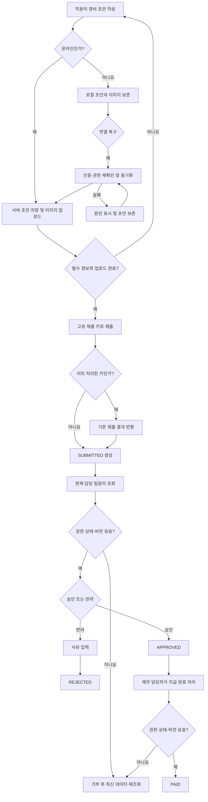

# 모바일 경비 승인 PRD

## Applicability

| Contract | Required / N/A | Evidence |
|---|---|---|
| Pages/routes or screen IDs | Required | 직원 제출, 팀장 승인, 재무 지급 처리를 위한 사용자 화면이 필요함 |
| Empty/loading/error/success/recovery state matrix | Required | 오프라인 동기화, 업로드 실패, 권한 변경, 동시 수정 등 복구 가능한 상태가 존재함 |
| Mermaid user or system flow | Required | 작성 → 제출 → 승인/반려 → 지급 완료의 다단계 수명주기를 가짐 |

## Context and problem

직원은 모바일에서 영수증과 경비 정보를 제출하고, 팀장은 자기 팀의 요청을 검토하며, 재무 담당자는 승인된 요청의 지급 여부를 관리해야 한다.

모바일 환경에서는 연결 중단, 이미지 업로드 실패, 중복 전송이 발생할 수 있다. 또한 제출 이후 팀 구성이나 권한이 바뀌거나, 직원의 수정과 팀장의 승인이 동시에 발생할 수 있으므로 서버 기준의 일관된 상태·권한 처리가 필요하다.

## Goals

- 직원이 영수증 사진, 금액, 카테고리를 이용해 경비를 제출할 수 있다.
- 오프라인에서도 초안을 작성하고 연결 복구 후 안전하게 동기화할 수 있다.
- 팀장은 현재 자기 팀에 속한 직원의 요청만 승인 또는 반려할 수 있다.
- 반려 시 사유를 기록하고 직원에게 전달한다.
- 재무 담당자는 승인된 요청을 지급 완료로 표시할 수 있다.
- 중복 제출, 업로드 실패, 권한 변경 및 동시 수정을 데이터 손상 없이 처리한다.
- 핵심 사용자 흐름이 WCAG 2.2 AA를 충족한다.

## Non-goals

1차 출시에서 다음은 제외한다.

- 다중 통화 입력, 환율 계산 및 환차손익 처리
- ERP 또는 회계 시스템과의 자동 연동
- 분할 승인 또는 다단계 결재선
- 일괄 승인 및 일괄 지급
- 법인카드 거래 자동 대사
- OCR을 이용한 금액·카테고리 자동 추출
- 부분 지급, 지급 취소 및 지급 실패 처리
- 경비 정책 위반 자동 판정

## Users, roles, and permissions

| 역할 | 권한 |
|---|---|
| 직원 | 자신의 초안 작성·수정·삭제, 자신의 경비 제출 및 처리 상태 조회 |
| 팀장 | 현재 자기 팀 직원이 제출한 요청 조회, 승인 또는 반려 |
| 재무 담당자 | 승인된 전체 요청 조회, 지급 완료 처리 |
| 시스템 관리자 | 사용자 역할, 팀 소속, 카테고리 등 기준 정보 관리. 관리자 화면 자체는 본 PRD 범위 밖 |

한 사용자가 여러 역할을 가질 수 있다. 모든 작업의 실제 권한은 화면 노출 여부가 아니라 요청 처리 시점에 서버가 확인한다.

## 상태 모델

| 상태 | 의미 | 허용되는 다음 상태 |
|---|---|---|
| `LOCAL_DRAFT` | 기기에만 저장된 오프라인 초안 | `SYNCING`, 삭제 |
| `SYNCING` | 서버 동기화 또는 이미지 업로드 진행 중 | `DRAFT`, `SYNC_FAILED` |
| `SYNC_FAILED` | 동기화가 완료되지 않음 | `SYNCING`, `LOCAL_DRAFT`, 삭제 |
| `DRAFT` | 서버에 저장됐으나 제출되지 않은 초안 | `SUBMITTED`, 삭제 |
| `SUBMITTED` | 팀장 검토 대기 | `APPROVED`, `REJECTED` |
| `APPROVED` | 팀장 승인 완료, 지급 대기 | `PAID` |
| `REJECTED` | 반려 완료 | 종료 |
| `PAID` | 지급 완료 | 종료 |

`APPROVED`, `REJECTED`, `PAID`는 1차 출시에서 되돌릴 수 없는 종결 상태로 취급한다.

## Functional requirements

| ID | Requirement | Priority |
|---|---|---|
| FR-01 | 직원은 영수증 이미지 1개 이상, 양수인 금액, 활성 카테고리를 입력해 경비 초안을 저장할 수 있어야 한다. | Must |
| FR-02 | 통화는 조직에 설정된 단일 기준 통화를 사용하며, 직원에게 통화 선택 UI를 제공하지 않는다. | Must |
| FR-03 | 직원은 제출 전에 자신의 초안을 수정하거나 삭제할 수 있어야 한다. | Must |
| FR-04 | 필수 정보와 모든 이미지 업로드가 완료된 초안만 제출할 수 있어야 한다. | Must |
| FR-05 | 앱은 오프라인 상태에서 초안을 기기에 보존하고, 연결 복구 시 인증 상태와 권한을 재확인한 후 동기화를 시도해야 한다. | Must |
| FR-06 | 동기화 실패 시 로컬 초안과 이미지를 보존하고 실패 원인, 재시도 상태 및 수동 재시도 수단을 제공해야 한다. | Must |
| FR-07 | 제출 요청에는 논리적 제출을 식별하는 고유 키를 사용하며, 동일 키의 재전송은 경비 요청을 추가 생성하지 않고 기존 결과를 반환해야 한다. | Must |
| FR-08 | 제출된 경비는 서버가 처리한 요청 ID, 현재 상태, 버전, 제출자, 제출 시점 및 변경 이력을 가져야 한다. | Must |
| FR-09 | 직원은 자신의 요청 목록과 상세에서 제출, 승인, 반려, 지급 완료 상태를 확인할 수 있어야 한다. | Must |
| FR-10 | 팀장은 승인 또는 반려 실행 시점에 현재 자기 팀에 속한 직원의 `SUBMITTED` 요청만 처리할 수 있어야 한다. | Must |
| FR-11 | 팀장이 요청을 반려하려면 공백만으로 구성되지 않은 반려 사유를 입력해야 한다. 반려 사유는 해당 직원과 권한 있는 사용자에게 표시되어야 한다. | Must |
| FR-12 | 팀장이 요청을 승인하면 요청은 원자적으로 `SUBMITTED`에서 `APPROVED`로 변경되고 처리자와 처리 시점이 기록되어야 한다. | Must |
| FR-13 | 재무 담당자는 `APPROVED` 요청만 `PAID`로 변경할 수 있으며 처리자와 처리 시점을 기록해야 한다. | Must |
| FR-14 | 승인, 반려 또는 지급 요청마다 사용자가 조회한 상태와 버전을 서버에 전달해야 한다. 서버의 최신 상태·버전과 다르면 변경을 거부하고 최신 데이터를 반환해야 한다. | Must |
| FR-15 | 작업 중 역할이나 팀 소속이 변경되어 권한이 사라진 경우, 서버는 작업을 거부하고 화면은 최신 권한 및 데이터를 다시 불러와야 한다. 입력 중이던 반려 사유 등 미전송 데이터는 가능한 한 유지한다. | Must |
| FR-16 | 이미지별 업로드 진행 및 실패 상태를 표시하고, 성공한 이미지를 다시 업로드하지 않은 채 실패한 이미지만 재시도할 수 있어야 한다. | Must |
| FR-17 | 서버에 확정된 모든 상태 변경은 요청 ID, 이전·이후 상태, 수행자, 수행 시점과 함께 감사 이력으로 남아야 한다. | Must |
| FR-18 | 카테고리가 초안 작성 이후 비활성화된 경우 기존 선택값은 초안에 보존하되 제출은 차단하고 활성 카테고리 재선택을 안내해야 한다. | Should |

## Pages and routes

네이티브 앱 라우트 형식은 기술 설계에서 결정하되 다음 화면 ID는 안정적으로 사용한다.

| Page or screen ID | Route, deep link, or explicit TBD + owner | Roles | Purpose |
|---|---|---|---|
| EXPENSE-LIST | TBD — 모바일 개발 책임자, 구현 착수 전 | 직원 | 본인 요청 및 상태 조회 |
| EXPENSE-EDIT | TBD — 모바일 개발 책임자, 구현 착수 전 | 직원 | 초안 작성·수정, 이미지 업로드 및 제출 |
| EXPENSE-DETAIL | TBD — 모바일 개발 책임자, 구현 착수 전 | 직원, 팀장, 재무 | 요청 상세와 처리 이력 조회 |
| TEAM-APPROVAL-LIST | TBD — 모바일 개발 책임자, 구현 착수 전 | 팀장 | 자기 팀의 승인 대기 요청 조회 |
| EXPENSE-DECISION | EXPENSE-DETAIL 내부 동작 | 팀장 | 승인 또는 사유를 포함한 반려 |
| FINANCE-PAYMENT-LIST | TBD — 모바일 개발 책임자, 구현 착수 전 | 재무 담당자 | 승인된 지급 대기 요청 조회 |
| SYNC-STATUS | EXPENSE-LIST 및 EXPENSE-EDIT 내 공통 상태 영역 | 직원 | 오프라인 초안과 동기화 실패 상태 확인 |

## State matrix

| Surface | Empty | Loading | Error | Success | Recovery |
|---|---|---|---|---|---|
| 직원 요청 목록 | “제출한 경비가 없음”과 작성 CTA | 목록 로딩 표시 | 재조회 안내 | 상태별 요청 표시 | 다시 시도 |
| 경비 작성 | 빈 입력 폼 | 초안 또는 카테고리 로딩 | 초안 로드 실패 | 저장됨 표시 | 입력 보존 후 재시도 |
| 이미지 업로드 | 이미지 추가 안내 | 이미지별 진행 상태 | 실패 이미지와 원인 표시 | 미리보기 및 완료 표시 | 실패 이미지만 재시도 또는 제거 |
| 오프라인 동기화 | 동기화 대상 없음 | 대기/동기화 중 표시 | 인증, 권한, 네트워크 또는 데이터 오류 구분 | 동기화 완료 및 서버 요청 ID 표시 | 로그인, 데이터 수정 또는 수동 재시도 |
| 팀장 승인 목록 | 승인 대기 요청 없음 | 목록 로딩 표시 | 조회 실패 | 자기 팀 요청만 표시 | 다시 시도 |
| 승인·반려 | 해당 동작 없음 | 중복 탭 방지 및 처리 중 표시 | 권한·버전·상태 오류 안내 | 변경된 상태 표시 | 최신 요청 재조회 후 필요 시 재처리 |
| 재무 지급 목록 | 지급 대기 요청 없음 | 목록 로딩 표시 | 조회 실패 | 승인된 요청 표시 | 다시 시도 |
| 지급 완료 | 해당 동작 없음 | 처리 중 표시 | 권한·버전·상태 오류 안내 | 지급 완료 표시 | 최신 요청 재조회 후 필요 시 재처리 |

## User or system flow

## Authorization and data boundaries

- 직원은 자신의 초안과 요청만 생성·조회·수정·삭제할 수 있다.
- 제출 이후 직원은 요청을 수정하거나 삭제할 수 없다.
- 팀장 권한은 요청에 저장된 과거 팀 정보가 아니라 처리 시점의 현재 팀 소속을 기준으로 검증한다.
- 팀장은 자기 팀 요청만 조회할 수 있으며, 다른 팀 요청 ID를 직접 호출해도 서버가 상세 정보나 존재 여부를 노출하지 않아야 한다.
- 재무 담당자는 조직 내 승인된 요청을 조회하고 지급 완료로 변경할 수 있다.
- 역할, 팀 소속 및 요청 상태는 모든 조회와 변경 API에서 서버가 검증한다.
- 이미지 접근은 해당 경비 요청을 조회할 권한이 있는 사용자에게만 허용한다.
- 권한 실패와 버전 충돌은 일반 서버 오류와 구분 가능한 오류 코드로 제공하되, 권한 없는 리소스의 민감한 정보는 응답에 포함하지 않는다.
- 조직 간 데이터 분리가 필요한 제품이라면 모든 조회·변경은 조직 경계를 함께 검증한다.

## Non-functional requirements

### 접근성

- NFR-01: 사용자 대면 핵심 흐름은 WCAG 2.2 AA를 목표가 아닌 출시 요구사항으로 적용한다.
- NFR-02: 모든 입력과 동작에는 접근 가능한 이름, 오류 설명 및 키보드·보조기술로 인식 가능한 상태가 있어야 한다.
- NFR-03: 색상만으로 승인·반려·오류·동기화 상태를 구분하지 않는다.
- NFR-04: 포커스 표시, 포커스 순서, 터치 타깃, 명도 대비, 확대 및 동적 글자 크기를 지원한다.
- NFR-05: 업로드·동기화·승인 결과 같은 비동기 상태 변화는 스크린 리더가 인식할 수 있어야 하며 불필요하게 포커스를 이동시키지 않는다.

### 신뢰성 및 데이터 일관성

- NFR-06: 클라이언트 재시도 또는 중복 탭이 동일 논리 작업을 중복 생성하거나 중복 상태 전이시키지 않아야 한다.
- NFR-07: 승인, 반려 및 지급 상태 변경은 원자적으로 처리한다.
- NFR-08: 앱 종료 또는 네트워크 단절 후에도 아직 제출되지 않은 로컬 초안과 동기화 상태를 복구할 수 있어야 한다.
- NFR-09: 저장된 영수증 이미지와 전송 구간은 조직의 기존 보안 기준을 따른다. 구체적인 보관·암호화 정책은 열린 결정 OD-05에 따른다.

### 성능

현재 수치 목표를 임의로 설정하지 않는다.

- NFR-10: 이미지 업로드 성공률·소요 시간, 동기화 지연, 목록·상세 조회 시간, 승인·반려·지급 처리 시간을 측정할 수 있어야 한다.
- NFR-11: 제품 책임자와 기술 책임자는 내부 파일럿 측정 결과를 바탕으로 정식 출시 전 성능 목표와 경고 임계치를 확정한다.
- NFR-12: 측정은 네트워크 유형, 성공·실패 여부 및 앱 버전을 구분할 수 있어야 하며 영수증 이미지나 반려 사유 같은 민감 데이터는 분석 이벤트에 포함하지 않는다.

## Acceptance criteria

| ID | Requirement | Given | When | Then | Verification |
|---|---|---|---|---|---|
| AC-01 | FR-01~04 | 직원이 유효한 이미지, 금액, 카테고리를 입력함 | 제출함 | 요청이 한 번 생성되고 `SUBMITTED`가 됨 | API·E2E 테스트 |
| AC-02 | FR-04, FR-16 | 이미지 중 하나가 업로드되지 않음 | 직원이 제출함 | 제출이 차단되고 실패 이미지가 식별되며 재시도할 수 있음 | E2E 테스트 |
| AC-03 | FR-05~06 | 직원이 오프라인에서 초안과 이미지를 저장함 | 앱을 재시작한 뒤 연결이 복구됨 | 초안이 유지되고 자동 동기화되거나 복구 가능한 오류가 표시됨 | 오프라인 E2E 테스트 |
| AC-04 | FR-07 | 같은 제출 키의 요청이 네트워크 재시도로 여러 번 전송됨 | 서버가 요청을 처리함 | 하나의 요청만 존재하고 모든 호출에 동일한 결과가 반환됨 | 통합·동시성 테스트 |
| AC-05 | FR-09~10 | 팀장에게 다른 팀의 요청 ID가 주어짐 | 목록 또는 상세를 조회하거나 결정 API를 호출함 | 요청 정보가 노출되지 않고 작업이 거부됨 | 권한 통합 테스트 |
| AC-06 | FR-10, FR-12 | 팀장이 자기 팀의 `SUBMITTED` 요청을 최신 버전으로 조회함 | 승인함 | 요청이 `APPROVED`가 되고 처리자와 시점이 기록됨 | API·E2E 테스트 |
| AC-07 | FR-11 | 팀장이 반려 사유를 비우거나 공백만 입력함 | 반려를 시도함 | 반려가 차단되고 해당 입력 오류에 포커스가 이동함 | UI·접근성 테스트 |
| AC-08 | FR-11 | 팀장이 유효한 사유로 요청을 반려함 | 반려가 완료됨 | 상태가 `REJECTED`가 되고 직원이 사유를 조회할 수 있음 | API·E2E 테스트 |
| AC-09 | FR-13 | 재무 담당자가 `APPROVED` 요청을 최신 버전으로 조회함 | 지급 완료를 실행함 | 상태가 `PAID`가 되고 처리자와 시점이 기록됨 | API·E2E 테스트 |
| AC-10 | FR-13 | 재무 담당자가 `SUBMITTED` 또는 `REJECTED` 요청을 처리함 | 지급 완료를 시도함 | 서버가 상태 전이를 거부하고 원래 상태를 유지함 | API 테스트 |
| AC-11 | FR-14 | 두 사용자가 같은 요청 버전을 조회함 | 한 명의 변경 완료 후 다른 사용자가 변경함 | 두 번째 변경은 충돌로 거부되고 최신 상태·버전이 제공됨 | 동시성 통합 테스트 |
| AC-12 | FR-15 | 팀장이 요청을 연 뒤 다른 팀으로 이동하거나 권한을 잃음 | 승인 또는 반려함 | 서버가 작업을 거부하고 UI가 최신 권한을 반영함 | 권한 변경 통합 테스트 |
| AC-13 | FR-16 | 여러 이미지 중 한 이미지만 업로드에 실패함 | 직원이 재시도함 | 성공한 이미지는 유지되고 실패한 이미지만 다시 업로드됨 | 통합·E2E 테스트 |
| AC-14 | FR-17 | 요청이 제출, 승인, 지급 완료됨 | 권한 있는 사용자가 이력을 조회함 | 각 상태 변경의 이전·이후 상태, 수행자 및 시점이 확인됨 | API 테스트 |
| AC-15 | FR-18 | 초안의 카테고리가 비활성화됨 | 직원이 초안을 열어 제출함 | 기존 값은 보이지만 제출이 차단되고 재선택 안내가 제공됨 | 통합·E2E 테스트 |
| AC-16 | NFR-01~05 | 핵심 화면과 정상·오류·복구 흐름이 준비됨 | 자동 및 수동 접근성 검증을 수행함 | 발견된 WCAG 2.2 A/AA 실패가 출시 전 해결됨 | axe 등 자동 검사 및 보조기술 수동 테스트 |
| AC-17 | NFR-10~12 | 내부 파일럿 빌드가 배포됨 | 핵심 작업을 수행함 | 정의된 성능 지표가 민감 정보 없이 수집되고 기준선 보고서를 만들 수 있음 | 이벤트 검증 및 대시보드 확인 |

## Assumptions and open decisions

### 합리적 가정

- A-01: 1차 출시에서는 조직별로 하나의 기준 통화만 사용한다.
- A-02: 한 경비 요청에 영수증 이미지를 여러 장 첨부할 수 있다.
- A-03: 제출 후에는 직원이 요청을 수정하거나 회수할 수 없다. 따라서 승인과 직원 수정의 충돌은 제출 직전 동기화 또는 다른 승인 주체 간의 동시 처리에서 주로 발생한다.
- A-04: 반려된 요청은 동일 요청을 재제출하지 않고, 직원이 필요한 경우 새 경비 요청을 작성한다.
- A-05: 지급 완료는 실제 자금 이체를 실행하는 기능이 아니라 외부에서 지급된 사실을 기록하는 수동 상태 변경이다.
- A-06: 서버 시간을 상태 변경과 감사 이력의 기준 시각으로 사용한다.
- A-07: 오프라인 초안 자동 동기화는 서버 제출이 아니라 서버 초안 저장까지만 수행한다. 직원의 명시적인 제출 동작 없이 승인 대기 상태로 전환하지 않는다.
- A-08: 앱에서 로그아웃해도 로컬 초안을 다른 계정에 노출하지 않으며, 같은 사용자로 재인증해야 동기화할 수 있다.

### 열린 결정

| ID | 결정 사항 | 영향 | 결정 책임자 / 시점 |
|---|---|---|---|
| OD-01 | 지원 이미지 형식, 장수, 파일당 용량과 총용량 제한 | 클라이언트 검증, 업로드 API, 저장 비용 | 제품·기술 책임자 / API 계약 확정 전 |
| OD-02 | 금액의 최대값 및 기준 통화의 소수 자릿수 규칙 | 입력 컴포넌트와 서버 검증 | 재무 정책 책임자 / 개발 착수 전 |
| OD-03 | 반려 사유의 최대 길이와 허용 문자 정책 | 데이터 모델, UI 카운터 및 API 검증 | 제품 책임자 / API 계약 확정 전 |
| OD-04 | 서로 다른 제출 키를 가진 실질적 중복 경비의 판정 기준과 차단 또는 경고 정책 | 이미지 해시, 비교 기간, 오탐 처리 및 개인정보 처리 | 제품·재무 책임자 / 1차 출시 범위 확정 전 |
| OD-05 | 영수증 이미지와 경비 기록의 보관 기간, 삭제 및 암호화 기준 | 저장소 수명주기와 보안 설계 | 보안·재무 정책 책임자 / 운영 배포 전 |
| OD-06 | 팀 소속 변경 후 기존 요청의 승인 주체가 새 팀장인지 기존 팀장인지 | 승인 큐 조회 및 권한 규칙 | 제품·인사 정책 책임자 / 권한 API 확정 전 |
| OD-07 | 직원이 동시에 여러 팀에 소속될 수 있는지와 해당 요청의 승인 팀 결정 방식 | 데이터 모델과 권한 판정 | 제품·인사 정책 책임자 / 데이터 모델 확정 전 |
| OD-08 | 성능 목표 및 경고 임계치 | 출시 기준과 용량 계획 | 제품·기술 책임자 / 내부 파일럿 측정 후 정식 출시 전 |

OD-04가 확정되기 전까지 1차 구현은 동일 제출 키의 기술적 중복만 차단한다. 내용이 유사하지만 제출 키가 다른 요청은 자동 차단하지 않는다.

## Risks and mitigations

| Risk | Impact | Mitigation |
|---|---|---|
| 불안정한 연결로 제출 응답이 유실됨 | 동일 경비가 여러 번 생성될 수 있음 | 제출 고유 키와 서버 멱등 처리 적용 |
| 대용량 이미지 또는 앱 종료로 업로드 실패 | 초안 손실 또는 반복 업로드 | 이미지별 상태 저장, 실패분 재시도, 로컬 복구 |
| 권한 정보가 화면 진입 후 변경됨 | 다른 팀 요청을 처리할 수 있음 | 모든 조회·변경 시 서버에서 현재 권한 재검증 |
| 동시에 승인·반려·지급 처리함 | 마지막 요청이 앞선 결정을 덮어씀 | 상태와 버전 조건부 변경, 원자적 전이 |
| 로컬 초안이 다른 로그인 사용자에게 노출됨 | 개인정보·경비 정보 유출 | 사용자별 암호화 저장 영역 및 재인증 후 동기화 |
| 유사도 기반 중복 검출의 오탐 | 정상 경비 제출 차단 | 정책 확정 전 자동 차단 금지, 멱등 중복만 차단 |
| 미확정 성능 목표가 출시 직전 문제로 드러남 | 업로드 및 승인 경험 저하 | 파일럿 계측, 기준선 보고서, 정식 출시 전 목표 확정 |
| 접근성이 마지막 단계에서만 검증됨 | WCAG 2.2 AA 미충족 | 컴포넌트 단계 자동 검사와 핵심 흐름 수동 검증을 완료 조건에 포함 |

## Delivery

| Phase | Requirement IDs | Verifiable exit condition |
|---|---|---|
| 1. 도메인·API 기반 | FR-02, FR-07~08, FR-10~15, FR-17 | 상태 전이, 멱등성, 권한 및 버전 충돌 통합 테스트 통과 |
| 2. 직원 작성·제출 | FR-01~04, FR-09, FR-16, FR-18 | 온라인 작성, 이미지 재시도, 제출 및 상태 조회 E2E 테스트 통과 |
| 3. 오프라인 동기화 | FR-05~06 | 오프라인 작성, 앱 재시작, 연결 복구 및 실패 복구 E2E 테스트 통과 |
| 4. 승인·지급 UI | FR-10~15 | 팀장 승인·반려, 권한 변경, 동시 처리 및 재무 지급 E2E 테스트 통과 |
| 5. 출시 검증 | NFR-01~12, FR-17 | WCAG 2.2 AA 검증 완료, 감사 이력 검증, 성능 기준선 보고서 작성 및 OD-08 결정 완료 |

요청에 따라 파일을 생성하지 않았으므로 PRD 파일 검증기는 실행하지 않았다.