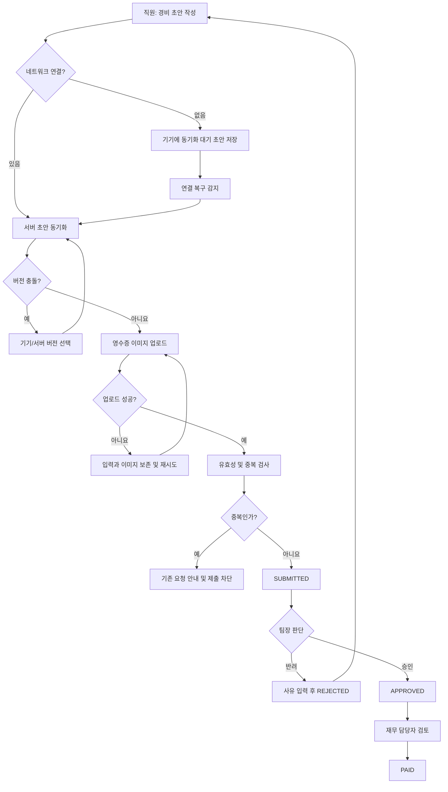

# 모바일 경비 승인 PRD

## Applicability

| Contract | Required / N/A | Evidence |
|---|---|---|
| Pages/routes or screen IDs | Required | 직원 제출, 팀장 승인, 재무 지급 처리 화면이 필요한 사용자 기능 |
| Empty/loading/error/success/recovery state matrix | Required | 오프라인 동기화, 이미지 업로드 실패, 중복 및 충돌 상태를 사용자에게 표시해야 함 |
| Mermaid user or system flow | Required | 초안 작성부터 제출, 승인·반려, 지급 완료까지 다단계 상태 전이가 존재함 |

## Context and problem

직원은 모바일에서 경비 영수증과 필수 정보를 제출하고, 팀장은 담당 팀의 요청을 검토하며, 재무 담당자는 승인된 요청의 지급 여부를 기록해야 한다.

모바일 환경에서는 연결 단절, 이미지 업로드 실패, 동일 요청의 재전송, 권한 변경 및 오래된 화면에서의 승인 같은 문제가 발생할 수 있다. 이러한 상황에서도 데이터 유실, 중복 지급 및 권한을 벗어난 처리가 발생하지 않아야 한다.

## Goals

- 직원이 모바일에서 영수증 사진, 금액, 카테고리를 포함한 경비 요청을 작성하고 제출할 수 있다.
- 네트워크가 없어도 초안을 작성하고, 연결 복구 후 안전하게 동기화할 수 있다.
- 팀장이 서버에서 확인된 자기 팀 요청만 승인하거나 사유와 함께 반려할 수 있다.
- 재무 담당자가 승인된 요청을 지급 완료로 표시할 수 있다.
- 중복 제출, 업로드 실패, 권한 변경 및 동시 상태 변경으로 인한 잘못된 처리를 방지한다.
- 전체 사용자 흐름이 WCAG 2.2 AA를 충족한다.

## Non-goals

1차 출시에서는 다음을 제공하지 않는다.

- 요청별 통화 선택 또는 환율 변환을 포함한 다중 통화
- ERP와의 자동 데이터 송수신
- 은행 이체나 카드 정산 등 실제 지급 실행
- 영수증 OCR 또는 자동 카테고리 분류
- 여러 요청을 한 번에 승인하거나 지급 완료 처리하는 일괄 작업
- 승인 완료 또는 지급 완료 상태의 취소·복원
- 충돌한 오프라인 초안의 필드 단위 자동 병합

## Users, roles, and permissions

| 역할 | 허용 행위 | 제한 |
|---|---|---|
| 직원 | 자기 요청 작성, 조회, 제출, 반려 요청 수정 및 재제출 | 다른 직원 요청 조회 불가, 제출 후 심사 중인 요청 수정 불가 |
| 팀장 | 담당 팀에 귀속된 제출 요청 조회, 승인, 반려 | 다른 팀 요청 처리 불가, 반려 사유 없이 반려 불가 |
| 재무 담당자 | 승인 요청 조회, 지급 완료 표시 | 미승인 또는 반려 요청을 지급 완료로 변경 불가 |
| 시스템 | 동기화, 중복 판정, 상태·버전 검증, 감사 기록 생성 | 사용자 권한을 우회해 상태를 변경할 수 없음 |

역할이 중첩된 사용자는 각 행위에 필요한 권한을 별도로 검증받는다. 자기 요청 승인 정책은 열린 결정 `OD-06`을 따른다.

## Functional requirements

| ID | Requirement | Priority |
|---|---|---|
| FR-01 | 직원은 영수증 사진 1장, 0보다 큰 금액, 활성 카테고리를 입력해 초안을 작성할 수 있어야 한다. | Must |
| FR-02 | 시스템은 필수 입력과 이미지 업로드가 완료된 요청만 제출해야 하며, 유효하지 않은 필드를 해당 위치에서 설명해야 한다. | Must |
| FR-03 | 오프라인에서 작성하거나 수정한 초안은 기기에 보존되고 `동기화 대기`로 표시되어야 한다. 연결 복구 시 자동 동기화를 시도하며 사용자가 수동 재시도할 수도 있어야 한다. | Must |
| FR-04 | 이미지 업로드 실패 시 나머지 입력과 원본 이미지를 유지하고 실패 원인, 재시도 동작 및 현재 동기화 상태를 제공해야 한다. 이미지가 성공적으로 저장되기 전에는 제출 완료로 표시하지 않는다. | Must |
| FR-05 | 각 제출 시도에는 클라이언트 생성 제출 키를 사용해야 한다. 같은 키의 재전송은 새 요청을 만들지 않고 기존 결과를 반환해야 한다. 동일 직원·영수증 파일 해시·금액·카테고리가 일치하는 별도 요청은 중복 후보로 차단하고 기존 요청을 안내해야 한다. | Must |
| FR-06 | 요청 상태는 `DRAFT`, `SUBMITTED`, `APPROVED`, `REJECTED`, `PAID`로 관리하며 정의된 전이만 허용해야 한다. | Must |
| FR-07 | 직원은 자기 `DRAFT` 또는 `REJECTED` 요청만 수정할 수 있다. 반려 요청을 재제출하면 동일 요청 ID를 유지하고 새 버전의 `SUBMITTED` 상태가 되며 이전 반려 이력은 보존되어야 한다. | Must |
| FR-08 | 팀장은 현재 서버 권한상 자신이 담당하는 팀에 귀속된 `SUBMITTED` 요청만 승인 또는 반려할 수 있어야 한다. 반려에는 공백이 아닌 사유가 필수다. | Must |
| FR-09 | 재무 담당자는 `APPROVED` 요청만 `PAID`로 변경할 수 있어야 한다. 지급 완료 처리에는 처리자와 처리 시각을 기록해야 한다. | Must |
| FR-10 | 서버는 모든 조회 및 변경 시점에 현재 사용자 역할, 조직 및 팀 권한을 다시 검증해야 한다. 화면 진입 후 권한이 회수된 경우에도 후속 행위를 거부하고 최신 권한 상태를 안내해야 한다. | Must |
| FR-11 | 요청을 변경하는 모든 API는 요청 버전 또는 동등한 조건부 변경 값을 검증해야 한다. 오래된 버전에 대한 수정·승인·반려·지급 처리는 적용하지 않고 충돌 응답과 최신 상태를 반환해야 한다. | Must |
| FR-12 | 같은 초안이 여러 기기에서 변경되어 서버 버전과 충돌하면 자동 덮어쓰기하지 않아야 한다. 사용자는 서버 버전과 기기 버전을 확인하고 하나를 선택해 재시도할 수 있어야 한다. | Should |
| FR-13 | 상태 변경, 반려 사유, 주요 데이터 수정, 중복 차단 및 권한·버전 충돌에 대해 요청 ID, 행위자, 시각, 변경 전후 상태와 요청 버전을 서버 감사 기록에 남겨야 한다. | Must |
| FR-14 | 조직마다 하나의 기준 통화만 사용해야 한다. 지급 완료 표시는 내부 상태 기록이며 ERP 호출이나 실제 자금 이동을 발생시키지 않아야 한다. | Must |
| FR-15 | 목록과 상세 화면은 사용자가 볼 수 있는 요청만 서버에서 반환해야 하며, 클라이언트에서 숨기는 방식만으로 접근을 제한해서는 안 된다. | Must |

## Pages and routes

| Page or screen ID | Route, deep link, or explicit TBD + owner | Roles | Purpose |
|---|---|---|---|
| EXP-01 내 경비 목록 | `/expenses` | 직원 | 자기 요청 및 동기화·처리 상태 조회 |
| EXP-02 경비 작성/수정 | `/expenses/new`, `/expenses/{id}/edit` | 직원 | 온라인·오프라인 초안 작성, 수정 및 제출 |
| EXP-03 경비 상세 | `/expenses/{id}` | 직원, 권한 있는 팀장, 재무 담당자 | 영수증, 입력 정보, 반려 사유 및 처리 이력 조회 |
| EXP-04 팀 승인함 | `/approvals` | 팀장 | 담당 팀의 제출 요청 조회 및 검토 |
| EXP-05 재무 지급함 | `/payments` | 재무 담당자 | 승인 요청 조회 및 지급 완료 처리 |
| EXP-06 동기화 충돌 해결 | 경로 TBD — 모바일 기술 책임자, UI 구현 착수 전 결정 | 직원 | 기기 초안과 서버 초안 비교 및 보존 버전 선택 |

라우트는 모바일 웹과 네이티브 앱 중 어느 전달 방식을 선택하더라도 동일한 화면 ID를 유지한다.

## State matrix

| Surface | Empty | Loading | Error | Success | Recovery |
|---|---|---|---|---|---|
| 내 경비 목록 | 요청 없음과 작성 CTA 표시 | 목록 스켈레톤 및 기존 캐시 구분 | 재조회 실패와 마지막 갱신 시각 표시 | 요청별 업무·동기화 상태 표시 | 재시도 또는 새 요청 작성 |
| 경비 작성/수정 | 빈 필수 입력과 안내 표시 | 기존 초안 또는 카테고리 로딩 표시 | 필드 오류, 저장 실패 또는 충돌을 해당 위치에 표시 | 기기 저장, 서버 저장, 제출 완료 상태를 구분 | 입력을 보존한 채 저장·동기화·제출 재시도 |
| 이미지 업로드 | 사진 선택 안내 | 진행 중 상태와 중복 탭 방지 | 실패 원인과 미제출 상태 표시 | 미리보기와 업로드 완료 표시 | 원본 유지 후 재시도 또는 사진 교체 |
| 오프라인 동기화 | 대기 항목 없음 | 항목별 동기화 중 표시 | 네트워크·서버·버전 충돌을 구분 | 마지막 동기화 시각 표시 | 자동 재시도, 수동 재시도 또는 충돌 해결 |
| 팀 승인함 | 검토할 요청 없음 | 목록·상세 로딩 | 권한 상실, 최신 상태 변경 또는 조회 실패 표시 | 승인·반려 결과와 최신 상태 표시 | 새로고침 후 최신 버전에서 다시 판단 |
| 재무 지급함 | 지급 대기 요청 없음 | 목록·상세 로딩 | 권한 상실, 비승인 상태 또는 버전 충돌 표시 | 지급 완료 처리자·시각 표시 | 최신 상태 새로고침 후 재시도 |
| 중복 제출 | 해당 없음 | 중복 검사 중 표시 | 검사 실패 시 제출 완료로 간주하지 않음 | 중복 없음 또는 기존 요청 안내 | 검사 재시도; 기존 요청 상세로 이동 |
| 경비 상세 | 허용된 요청이 없으면 목록 복귀 안내 | 상세 로딩 | 접근 거부, 삭제·미존재, 네트워크 오류 구분 | 최신 데이터와 상태 이력 표시 | 권한에 따라 목록 복귀 또는 재조회 |

## User or system flow

상태 전이 계약:

| 현재 상태 | 행위자/동작 | 다음 상태 |
|---|---|---|
| `DRAFT` | 직원 제출 | `SUBMITTED` |
| `REJECTED` | 직원 수정 시작 | `DRAFT` |
| `SUBMITTED` | 팀장 승인 | `APPROVED` |
| `SUBMITTED` | 팀장 사유 입력 후 반려 | `REJECTED` |
| `APPROVED` | 재무 담당자 지급 완료 | `PAID` |

그 외 상태 전이는 1차 출시에서 허용하지 않는다.

## Authorization and data boundaries

- 모든 요청은 `organization_id`, `employee_id`, `team_id_at_submission`에 귀속된다.
- 직원 조회 조건은 현재 조직과 자기 `employee_id`를 모두 만족해야 한다.
- 팀장 조회 및 처리 조건은 현재 조직과 요청의 `team_id_at_submission`에 대한 현재 팀장 권한을 모두 만족해야 한다.
- 재무 담당자는 현재 조직의 재무 역할이 유효한 경우에만 승인 요청을 조회·처리할 수 있다.
- 팀 이동 전 제출된 요청은 제출 당시 팀에 계속 귀속한다. 해당 팀의 현재 팀장이 처리한다.
- 요청 ID를 직접 조작해도 권한 범위 밖 데이터의 존재 여부나 내용을 노출하지 않아야 한다.
- 승인, 반려 및 지급 완료 시 권한과 요청 버전을 하나의 서버 트랜잭션 안에서 재검증해야 한다.
- 역할 또는 팀 권한이 변경된 사용자의 기존 세션과 캐시는 후속 서버 요청의 권한 검사를 대신할 수 없다.
- 영수증 원본과 오프라인 초안은 인증된 사용자만 접근 가능한 앱 저장 영역에 보관하고, 로그나 오류 메시지에 이미지 내용 및 민감 정보를 포함하지 않는다.
- 제출 성공 후 남은 기기 초안은 서버 저장 확인 전에는 삭제하지 않으며, 확인 후 로컬 보존 정책에 따라 제거한다.

## Non-functional requirements

| ID | Requirement |
|---|---|
| NFR-01 | 사용자 대상 화면과 핵심 흐름은 WCAG 2.2 AA를 충족해야 한다. 키보드 조작, 명확한 포커스, 폼 레이블·오류 연결, 충분한 대비, 확대 대응 및 상태 변경의 보조기술 알림을 포함한다. |
| NFR-02 | 업로드, 동기화, 승인 및 지급 완료 작업은 반복 요청에도 중복 상태 변경을 만들지 않아야 한다. |
| NFR-03 | 전송 중 데이터는 암호화하고 영수증 접근에는 인증과 서버 권한 검사를 적용해야 한다. |
| NFR-04 | 초기 출시에 목록 로딩 시간, 상세 로딩 시간, 이미지 업로드 성공률·소요 시간, 동기화 성공률·지연 및 승인 처리 응답 시간을 측정할 수 있어야 한다. 목표 수치는 측정 후 `OD-05`에서 결정한다. |
| NFR-05 | 네트워크 상태와 관계없이 사용자에게 `기기 저장`, `동기화 대기`, `동기화 실패`, `서버 저장`, `제출 완료`를 혼동 없이 구분해 표시해야 한다. |

## Acceptance criteria

| ID | Requirement | Given | When | Then | Verification |
|---|---|---|---|---|---|
| AC-01 | FR-01, FR-02 | 직원이 유효한 사진·금액·카테고리를 입력했다 | 제출한다 | 요청이 한 번 생성되고 `SUBMITTED`가 된다 | E2E |
| AC-02 | FR-02 | 사진, 금액 또는 카테고리가 누락되거나 금액이 0 이하다 | 제출한다 | 제출되지 않고 해당 필드에 이해 가능한 오류가 표시된다 | E2E·접근성 검사 |
| AC-03 | FR-03 | 기기가 오프라인이다 | 직원이 초안을 작성하고 앱을 다시 연다 | 입력과 사진이 유지되고 `동기화 대기`가 표시된다 | 오프라인 E2E |
| AC-04 | FR-03 | 동기화 대기 초안이 있다 | 연결이 복구된다 | 자동 동기화되고 같은 초안에 서버 ID가 연결된다 | 통합·E2E |
| AC-05 | FR-04 | 이미지 업로드 중 연결이 끊기거나 서버가 실패한다 | 업로드가 실패한다 | 입력과 원본 사진이 유지되며 요청은 제출 완료로 표시되지 않고 재시도가 제공된다 | 장애 주입 E2E |
| AC-06 | FR-05 | 같은 제출 키의 요청이 이미 처리되었다 | 클라이언트가 요청을 재전송한다 | 새 요청 없이 기존 요청 ID와 결과가 반환된다 | API 통합 |
| AC-07 | FR-05 | 동일 직원의 사진 해시·금액·카테고리가 일치하는 요청이 존재한다 | 별도 제출 키로 제출한다 | 신규 제출이 차단되고 기존 요청으로 이동할 수 있다 | API 통합·E2E |
| AC-08 | FR-08, FR-15 | 팀장에게 A팀 권한만 있다 | A팀과 B팀 요청을 조회하거나 처리한다 | A팀 요청만 반환·처리되고 B팀 요청은 서버에서 거부된다 | 권한 통합 테스트 |
| AC-09 | FR-08 | 팀장이 제출 요청을 반려하려 한다 | 반려 사유가 비어 있다 | 상태가 변경되지 않고 사유 입력 오류가 표시된다 | E2E |
| AC-10 | FR-08 | 팀장이 유효한 사유를 입력했다 | 현재 버전 요청을 반려한다 | 요청이 `REJECTED`가 되고 사유가 직원 상세에 표시된다 | E2E |
| AC-11 | FR-09, FR-14 | 재무 담당자가 `APPROVED` 요청을 보고 있다 | 지급 완료를 선택한다 | 요청이 `PAID`가 되고 처리자·시각이 기록되며 외부 지급이나 ERP 호출은 발생하지 않는다 | 통합·E2E |
| AC-12 | FR-09 | 요청이 `SUBMITTED` 또는 `REJECTED`다 | 재무 담당자가 지급 완료 API를 호출한다 | 서버가 거부하고 상태는 유지된다 | API 통합 |
| AC-13 | FR-10 | 팀장이 승인 화면을 연 뒤 해당 팀 권한을 잃었다 | 승인 또는 반려를 시도한다 | 변경이 적용되지 않고 권한 변경 안내가 표시된다 | 권한 변경 E2E |
| AC-14 | FR-11 | 팀장이 버전 3을 검토하는 동안 요청이 버전 4가 되었다 | 버전 3을 승인한다 | 승인이 적용되지 않고 최신 상태를 다시 확인하도록 안내된다 | 동시성 통합·E2E |
| AC-15 | FR-07, FR-11 | 요청이 `SUBMITTED` 상태다 | 오래된 기기 초안이 해당 요청을 수정하려 한다 | 서버가 수정을 거부하고 제출된 버전을 보존한다 | 오프라인 충돌 테스트 |
| AC-16 | FR-07 | 직원의 요청이 반려되었다 | 수정 후 재제출한다 | 요청 ID는 유지되고 버전이 증가하며 이전 반려 사유가 감사 이력에 남는다 | 통합·E2E |
| AC-17 | FR-12 | 동일 초안이 서버와 기기에서 각각 변경되었다 | 기기 버전을 동기화한다 | 어느 버전도 자동으로 덮어쓰지 않고 선택 화면이 제공된다 | 다중 기기 E2E |
| AC-18 | FR-13 | 요청 데이터나 상태가 변경되었다 | 변경이 성공한다 | 행위자, 시각, 변경 내용, 상태 및 버전을 포함한 감사 기록이 생성된다 | API 통합 |
| AC-19 | NFR-01 | 핵심 화면과 흐름이 출시 후보 상태다 | 자동·수동 접근성 검사를 수행한다 | 확인된 WCAG 2.2 AA 위반이 출시 차단 기준에 따라 해소된다 | axe 계열 자동 검사·키보드·스크린리더 수동 검사 |
| AC-20 | NFR-04 | 출시 후보가 테스트 환경에 배포되었다 | 핵심 흐름을 실행한다 | 정의된 성능·신뢰성 지표가 누락이나 민감 정보 없이 수집된다 | 관측성 검증 |

## Assumptions and open decisions

### 합리적 가정

| ID | Assumption |
|---|---|
| AS-01 | 1차 출시에서는 경비 요청당 영수증 이미지 1장이 필수다. |
| AS-02 | 조직별 기준 통화는 사전에 하나가 설정되어 있으며 직원이 요청마다 변경하지 않는다. |
| AS-03 | 카테고리는 조직이 제공하는 활성 목록에서 선택하며 직원이 임의 문자열로 만들 수 없다. |
| AS-04 | 제출 당시 팀을 요청에 스냅샷으로 저장한다. 직원이 이후 팀을 이동해도 기존 요청은 원래 팀의 현재 팀장이 처리한다. |
| AS-05 | `SUBMITTED`, `APPROVED`, `PAID` 상태의 업무 데이터는 수정할 수 없다. 변경이 필요하면 별도 운영 정책이 필요하다. |
| AS-06 | 반려된 요청은 새 요청을 복제하지 않고 같은 요청을 수정·재제출한다. |
| AS-07 | 정확한 영수증 파일 해시, 금액 및 카테고리가 모두 같은 요청은 합법적인 별도 경비가 아니라 중복으로 취급한다. |
| AS-08 | 서버 시각을 승인, 반려 및 지급 완료의 공식 처리 시각으로 사용한다. |

### 열린 결정

| ID | Decision | 영향 | Owner / 결정 시점 |
|---|---|---|---|
| OD-01 | 네이티브 앱, PWA 또는 반응형 웹 중 1차 전달 방식 | 오프라인 저장소, 백그라운드 동기화, 카메라·파일 접근 방식 | 제품·모바일 기술 책임자 / 기술 설계 전 |
| OD-02 | 허용 이미지 형식, 최대 파일 크기, 압축 및 EXIF 제거 정책 | 업로드 검증, 저장 비용, 개인정보 및 실패 UX | 보안·기술 책임자 / 업로드 API 확정 전 |
| OD-03 | 카테고리 목록의 초기 제공 방식과 변경 책임자 | 카테고리 API 및 비활성 카테고리 표시 방식 | 제품·재무 책임자 / 데이터 모델 확정 전 |
| OD-04 | 지급 완료 시 지급일, 지급 참조번호 또는 메모를 추가로 요구할지 여부 | 지급 화면과 데이터 모델 | 재무 책임자 / 지급 기능 구현 전 |
| OD-05 | 목록·상세·업로드·동기화·상태 변경의 성능 목표 수치 | 출시 기준과 용량 계획 | 기술 책임자 / 베타 측정 결과 검토 후 |
| OD-06 | 역할이 중첩된 팀장의 자기 경비 승인 허용 여부 및 금지 시 대체 승인자 | 권한 규칙과 요청 라우팅 | 재무·내부통제 책임자 / 승인 API 구현 전 |
| OD-07 | 오탐 중복 요청을 예외 승인하는 역할과 절차 제공 여부 | 중복 차단 UX와 감사 정책 | 제품·재무 책임자 / 제출 API 확정 전 |
| OD-08 | 로컬 초안 보존 기간과 로그아웃·기기 분실 시 삭제 정책 | 개인정보 보호와 오프라인 복구 가능성 | 보안·제품 책임자 / 출시 전 |

`OD-01`, `OD-02`, `OD-06`은 구현 방식 또는 권한 모델을 바꾸므로 개발 착수 전에 확정해야 한다. `OD-05`는 브리프에 따라 측정 데이터를 확보한 뒤 확정한다.

## Risks and mitigations

| Risk | Impact | Mitigation |
|---|---|---|
| 불안정한 연결로 제출 요청이 반복됨 | 중복 경비 및 중복 지급 위험 | 제출 키 기반 멱등성, 영수증 해시 중복 검사, 상태별 단일 전이 |
| 이미지 업로드 실패 후 입력이 유실됨 | 재작성 부담과 제출 포기 | 원본·입력 로컬 보존, 업로드와 제출 상태 분리, 명시적 재시도 |
| 팀장 권한 변경이 열린 화면에 반영되지 않음 | 권한 밖 승인·반려 | 모든 처리 시 서버 재인가, 권한과 상태 변경을 같은 트랜잭션에서 검증 |
| 오래된 화면에서 승인 또는 지급 처리 | 검토하지 않은 버전에 대한 처리 | 낙관적 버전 검증, 충돌 시 변경 거부 및 최신 데이터 재조회 |
| 오프라인 초안이 서버 데이터를 덮어씀 | 최신 입력 유실 | 기준 버전 검증, 충돌 화면, 필드 단위 자동 병합 금지 |
| 영수증 이미지가 기기나 로그에 노출됨 | 개인정보·재무정보 노출 | 보호된 앱 저장 영역, 로그 마스킹, 보존 정책 확정 |
| 중복 판정 오탐 | 정상 경비 제출 불가 | 기존 요청 상세 제공, 예외 절차를 `OD-07`에서 결정 |
| 성능 목표가 미정임 | 출시 판단 기준 불명확 | 초기 계측 포함, 베타 측정 후 `OD-05`로 목표 확정 |

## Delivery

| Phase | Requirement IDs | Verifiable exit condition |
|---|---|---|
| 1. 직원 작성 및 동기화 | FR-01–FR-05, FR-07, FR-12, NFR-05 | 온라인·오프라인 작성, 이미지 실패 복구, 멱등 제출, 중복 차단 및 초안 충돌 시나리오가 테스트 환경에서 통과 |
| 2. 승인 및 지급 흐름 | FR-06, FR-08–FR-11, FR-14, FR-15 | 팀 범위 승인·반려, 권한 변경, 동시성 충돌, 승인 요청의 지급 완료 및 허용되지 않은 상태 전이가 모두 서버 테스트에서 검증 |
| 3. 감사·보안·접근성 | FR-13, NFR-01–NFR-03 | 감사 기록과 데이터 경계가 검증되고 핵심 흐름의 WCAG 2.2 AA 검사가 완료 |
| 4. 계측 및 출시 준비 | NFR-04 | 성능·업로드·동기화 지표가 수집되며 베타 측정 결과와 `OD-05` 결정 일정이 기록됨 |

파일을 생성하지 않았으므로 PRD 파일 검증기는 실행하지 않았다.