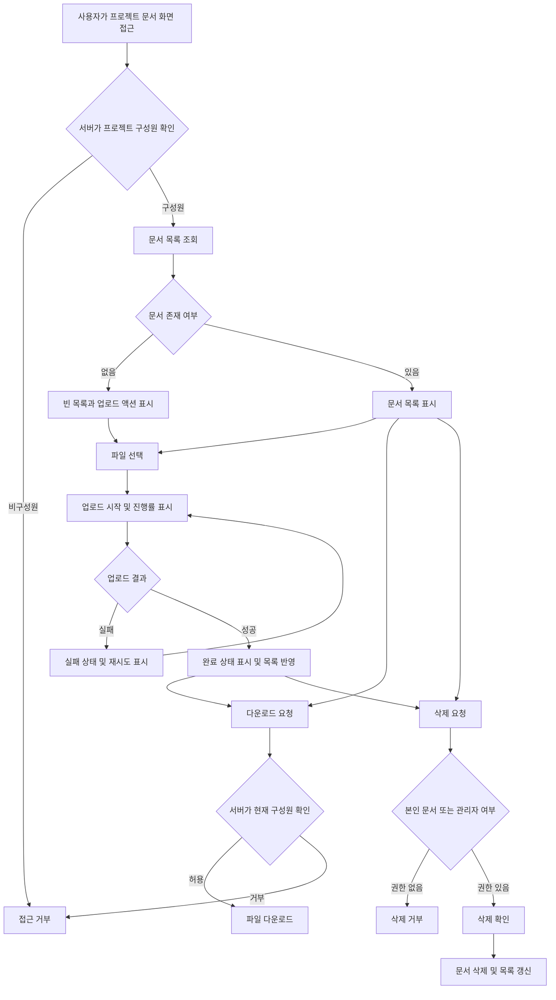

# 사내 프로젝트 문서 공유 PRD

## Applicability

| Contract | Required / N/A | Evidence |
|---|---|---|
| Pages/routes or screen IDs | Required | 프로젝트별 문서 목록, 업로드 및 상태 표시 UI가 필요함 |
| Empty/loading/error/success/recovery state matrix | Required | 빈 목록, 업로드 진행률, 실패 후 재시도, 완료 상태가 명시됨 |
| Mermaid user or system flow | Required | 업로드·검증·공유·다운로드·삭제로 이어지는 다단계 수명주기가 존재함 |

## Context and problem

직원들이 프로젝트 문서를 프로젝트 구성원에게 안전하게 공유할 수 있는 공통 공간이 필요하다. 현재 브리프의 핵심은 프로젝트 단위 접근 제어와 기본적인 문서 수명주기 관리다.

1차 출시는 4주 내 내부 베타를 목표로 하며, 다음 기능으로 범위를 제한한다.

- 문서 업로드
- 문서 목록 조회
- 문서 다운로드
- 권한에 따른 문서 삭제

프로젝트 구성원 초대·제거는 관리자의 최종 권한에 포함되지만, “1차 출시는 업로드·목록·다운로드·삭제만 포함”한다는 범위에 따라 베타에서는 기존 구성원 정보를 사용하는 것으로 가정한다.

## Goals

- 직원이 자신이 참여한 프로젝트에 문서를 업로드하고 구성원과 공유할 수 있다.
- 프로젝트 구성원이 프로젝트 문서 목록을 확인하고 다운로드할 수 있다.
- 일반 구성원과 프로젝트 관리자에게 서로 다른 삭제 권한을 적용한다.
- 업로드 진행, 실패, 재시도, 완료 상태를 사용자가 명확히 확인할 수 있다.
- 4주 내 실제 사내 사용자가 검증할 수 있는 내부 베타를 제공한다.

## Non-goals

1차 출시에는 다음을 포함하지 않는다.

- 문서 검색, 필터 및 정렬 설정
- 외부 사용자 또는 공개 링크를 통한 공유
- 프로젝트 구성원 초대·제거 UI 및 API
- 문서 미리보기
- 문서 편집 및 공동 편집
- 문서 버전 관리
- 폴더 또는 태그 관리
- 사용자별 세부 권한 설정
- 모바일 전용 애플리케이션

## Users, roles, and permissions

| 역할 | 문서 목록 | 업로드 | 다운로드 | 본인 문서 삭제 | 다른 사용자의 문서 삭제 | 구성원 관리 |
|---|---:|---:|---:|---:|---:|---:|
| 프로젝트 관리자 | 허용 | 허용 | 허용 | 허용 | 허용 | 최종 제품에서는 허용, 1차 출시 제외 |
| 일반 구성원 | 허용 | 허용 | 허용 | 허용 | 불가 | 불가 |
| 프로젝트 비구성원 | 불가 | 불가 | 불가 | 불가 | 불가 | 불가 |

- 사용자는 프로젝트마다 다른 역할을 가질 수 있다.
- 삭제 권한은 UI 노출 여부와 관계없이 서버에서 검증해야 한다.
- 문서 소유자는 업로드를 완료한 사용자 ID로 판단한다.

## Functional requirements

| ID | Requirement | Priority |
|---|---|---|
| FR-001 | 인증된 사용자는 자신이 현재 구성원인 프로젝트의 문서 화면에만 접근할 수 있다. | Must |
| FR-002 | 프로젝트 구성원은 해당 프로젝트의 문서 목록을 조회할 수 있다. 각 항목에는 최소한 파일명, 업로더, 업로드 완료 시각 및 다운로드·삭제 가능 액션이 표시된다. | Must |
| FR-003 | 문서가 없는 프로젝트에는 빈 목록 안내와 업로드 진입점을 표시한다. | Must |
| FR-004 | 프로젝트 구성원은 로컬 파일을 선택해 현재 프로젝트에 업로드할 수 있다. | Must |
| FR-005 | 업로드가 진행되는 동안 파일별 진행률을 백분율 또는 동등한 진행 표시로 제공한다. | Must |
| FR-006 | 업로드에 실패하면 실패 상태와 재시도 액션을 표시한다. 재시도는 동일 파일의 업로드를 새로 시작한다. | Must |
| FR-007 | 업로드가 성공하면 완료 상태를 표시하고, 완료된 문서를 해당 프로젝트 목록에서 조회 및 다운로드할 수 있게 한다. | Must |
| FR-008 | 업로드가 완전히 성공하기 전의 파일은 다른 구성원의 일반 문서 목록에 노출하거나 다운로드할 수 있게 해서는 안 된다. | Must |
| FR-009 | 프로젝트 구성원은 목록의 문서를 다운로드할 수 있다. 다운로드 요청 시점에도 프로젝트 구성원 여부를 서버에서 다시 검증한다. | Must |
| FR-010 | 일반 구성원은 자신이 업로드한 문서만 삭제할 수 있다. | Must |
| FR-011 | 프로젝트 관리자는 해당 프로젝트의 모든 문서를 삭제할 수 있다. | Must |
| FR-012 | 삭제 전 사용자 확인을 받고, 성공 후 문서를 목록에서 제거한다. 삭제된 문서는 이후 목록 조회 또는 다운로드가 불가능해야 한다. | Must |
| FR-013 | 목록 조회, 업로드, 다운로드 또는 삭제가 실패하면 사용자가 실패 사실을 인지할 수 있는 메시지를 제공한다. 복구 가능한 실패에는 재시도 수단을 제공한다. | Must |
| FR-014 | 같은 파일명의 문서를 여러 번 업로드할 수 있으며, 각 업로드는 별도 문서 ID를 가진 독립 항목으로 취급한다. | Should |
| FR-015 | 프로젝트 비구성원이 화면 URL이나 문서 식별자를 직접 입력해도 문서 메타데이터 또는 파일 내용이 노출되지 않아야 한다. | Must |

## Pages and routes

| Page or screen ID | Route, deep link, or explicit TBD + owner | Roles | Purpose |
|---|---|---|---|
| DOC-LIST | `/projects/:projectId/documents` | 관리자, 일반 구성원 | 문서 목록 조회, 업로드, 다운로드 및 삭제 |
| DOC-UPLOAD-ITEM | DOC-LIST 내부 상태 컴포넌트 | 관리자, 일반 구성원 | 파일별 업로드 진행률, 실패, 재시도 및 완료 표시 |
| DOC-DELETE-CONFIRM | DOC-LIST 내부 확인 대화상자 | 삭제 권한 보유자 | 대상 파일 확인 후 삭제 실행 |
| DOC-ACCESS-DENIED | 공통 오류 화면 또는 상태, 상세 경로는 프론트엔드 책임자가 개발 착수 전 결정 | 비구성원 또는 권한 상실 사용자 | 프로젝트 또는 문서 접근 거부 안내 |

다운로드는 별도 사용자 화면을 요구하지 않으며, 권한 검증을 거친 파일 응답으로 제공한다.

## State matrix

| Surface | Empty | Loading | Error | Success | Recovery |
|---|---|---|---|---|---|
| 문서 목록 | “등록된 문서가 없습니다” 및 업로드 액션 표시 | 목록 로딩 표시 | 조회 실패 메시지 | 문서 항목 표시 | 목록 다시 불러오기 |
| 업로드 | 선택된 파일 없음 | 파일별 진행률 표시 | 파일별 실패 원인 또는 일반 오류 표시 | 완료 상태 표시 후 목록 반영 | 동일 파일 재시도 |
| 다운로드 | N/A | 다운로드 시작 또는 처리 중 상태 | 다운로드 실패 또는 접근 거부 안내 | 브라우저 다운로드 시작 | 다시 다운로드 |
| 삭제 | N/A | 삭제 액션 비활성화 및 처리 중 표시 | 삭제 실패 메시지, 기존 항목 유지 | 목록에서 대상 제거 | 다시 삭제 |
| 접근 권한 | N/A | 권한 확인 중 로딩 | 접근 거부 또는 권한 확인 실패 | 문서 화면 표시 | 이전 화면 이동 또는 다시 시도 |

업로드 완료 표시는 사용자가 결과를 확인할 수 있을 만큼 유지하되, 정확한 유지 시간은 UI 구현 단계의 가역적 세부사항으로 둔다.

## User or system flow

## Authorization and data boundaries

- 모든 목록·업로드·다운로드·삭제 요청은 인증된 사용자만 수행할 수 있다.
- 서버는 요청마다 사용자와 대상 프로젝트의 현재 구성원 관계를 검증한다.
- 문서는 정확히 하나의 프로젝트에 속해야 한다.
- 문서 메타데이터와 파일 내용은 해당 프로젝트 구성원에게만 노출한다.
- 클라이언트가 전달한 프로젝트 ID, 문서 소유자 ID 또는 역할을 권한 판단의 근거로 신뢰하지 않는다.
- 일반 구성원의 삭제 요청은 서버에 저장된 업로더 ID와 현재 사용자 ID가 일치할 때만 허용한다.
- 관리자의 전체 문서 삭제 권한은 대상 프로젝트에서의 관리자 역할을 기준으로 한다.
- 권한이 없는 삭제 요청은 문서를 변경하지 않는다.
- 삭제 후에는 기존 문서 ID나 다운로드 주소를 사용하더라도 파일에 접근할 수 없어야 한다.
- 업로드 도중 실패한 불완전 파일은 프로젝트 공유 문서로 취급하지 않는다.
- 사용자가 프로젝트에서 제거될 경우 기존에 업로드한 문서의 소유권 기록은 유지하되, 해당 사용자의 접근 권한은 제거되는 것으로 가정한다.

## Non-functional requirements

### 성능

- 문서 목록은 사용자가 화면에 진입한 후 **2초 이내에 보이는 것을 제품 목표**로 한다.
- 2초는 현재 SLA나 출시 차단 기준이 아니다.
- 측정 시작·종료 시점, 데이터 규모, 백분위수 및 네트워크 조건은 제품 책임자가 베타 전에 결정한다.
- 내부 베타에서는 목록 표시 시간을 측정할 수 있는 로그 또는 성능 계측을 제공하는 것을 권장한다. 구체적인 분석 도구는 본 PRD에서 지정하지 않는다.

### 보안

- 전송 구간과 저장 파일 보호는 회사의 기존 인증·스토리지 보안 기준을 따른다.
- 다운로드 응답 또는 임시 다운로드 주소는 권한 없는 사용자에게 재사용 가능한 형태로 노출되어서는 안 된다.
- 파일명과 사용자 입력은 화면 표시 시 안전하게 처리되어야 한다.
- 허용 파일 형식, 파일 크기 제한 및 악성 파일 검사 정책은 열린 결정으로 관리한다.

### 신뢰성 및 사용성

- 하나의 파일 업로드 실패가 다른 업로드 항목의 상태를 성공으로 오인하게 해서는 안 된다.
- 실패한 작업은 성공한 것처럼 목록에 반영하지 않는다.
- 중복 클릭이나 네트워크 재시도로 동일 삭제 요청이 반복되더라도 사용자에게 모순된 최종 상태를 보여주지 않아야 한다.
- 접근성 수준과 지원 브라우저 범위는 회사 공통 웹 기준이 존재하면 이를 따른다.

## Acceptance criteria

| ID | Requirement | Given | When | Then | Verification |
|---|---|---|---|---|---|
| AC-001 | FR-001, FR-015 | 프로젝트 비구성원이 프로젝트 또는 문서 ID를 알고 있음 | 목록이나 문서에 직접 접근함 | 문서 메타데이터와 파일 내용이 노출되지 않고 접근이 거부됨 | API 권한 통합 테스트 |
| AC-002 | FR-002 | 프로젝트에 완료된 문서가 존재함 | 구성원이 문서 화면에 진입함 | 각 문서의 파일명, 업로더, 완료 시각과 허용된 액션이 표시됨 | UI 통합 테스트 |
| AC-003 | FR-003 | 프로젝트에 완료된 문서가 없음 | 구성원이 문서 화면에 진입함 | 빈 목록 안내와 업로드 액션이 표시됨 | UI 테스트 |
| AC-004 | FR-004, FR-005 | 구성원이 유효한 파일을 선택함 | 업로드를 시작함 | 해당 파일의 업로드 진행 상태가 완료 전까지 표시됨 | UI 및 업로드 통합 테스트 |
| AC-005 | FR-006 | 업로드가 네트워크 또는 서버 오류로 실패함 | 실패 응답을 수신함 | 실패 상태와 재시도 액션이 표시되고 재시도로 새 업로드가 시작됨 | 오류 주입 통합 테스트 |
| AC-006 | FR-007, FR-008 | 파일 업로드가 진행 중임 | 업로드가 아직 완료되지 않음 | 다른 구성원의 일반 목록 및 다운로드 대상에 해당 파일이 나타나지 않음 | 동시 세션 통합 테스트 |
| AC-007 | FR-007 | 업로드가 성공함 | 완료 응답을 수신함 | 완료 상태가 표시되고 문서가 목록과 다운로드 대상에 반영됨 | E2E 테스트 |
| AC-008 | FR-009 | 현재 프로젝트 구성원이 완료된 문서를 선택함 | 다운로드를 요청함 | 권한 검증 후 원본 파일 다운로드가 시작됨 | API 및 E2E 테스트 |
| AC-009 | FR-009, FR-015 | 사용자가 다운로드 요청 전에 프로젝트 권한을 상실함 | 기존 문서 ID 또는 다운로드 경로로 요청함 | 다운로드가 거부됨 | API 권한 통합 테스트 |
| AC-010 | FR-010 | 일반 구성원이 자신이 올린 문서를 보고 있음 | 삭제를 확인함 | 문서가 삭제되고 목록 및 다운로드에서 제거됨 | E2E 테스트 |
| AC-011 | FR-010 | 일반 구성원이 다른 사용자의 문서 ID를 알고 있음 | 삭제 API를 직접 호출함 | 요청이 거부되고 문서는 유지됨 | API 권한 통합 테스트 |
| AC-012 | FR-011 | 관리자가 프로젝트 내 다른 사용자의 문서를 보고 있음 | 삭제를 확인함 | 문서가 삭제되고 목록 및 다운로드에서 제거됨 | E2E 테스트 |
| AC-013 | FR-012 | 삭제 권한이 있는 사용자가 삭제 액션을 선택함 | 확인 전에는 취소하고, 이후 다시 열어 확인함 | 취소 시 문서가 유지되고 확인 시에만 삭제됨 | UI 테스트 |
| AC-014 | FR-013 | 목록 조회 또는 삭제 요청이 복구 가능한 오류로 실패함 | 오류 응답을 수신함 | 오류가 표시되고 재시도 후 성공 상태로 복구할 수 있음 | 오류 주입 테스트 |
| AC-015 | FR-014 | 같은 이름의 문서가 이미 존재함 | 동일 파일명의 새 문서를 업로드함 | 기존 문서를 덮어쓰지 않고 별도 항목으로 등록됨 | API 및 UI 통합 테스트 |
| AC-016 | 성능 목표 | 제품 책임자가 측정 조건을 확정함 | 베타 환경에서 문서 목록 표시 시간을 측정함 | 측정값이 기록되며 2초 목표 대비 결과를 확인할 수 있음 | 성능 측정 보고서 |

## Assumptions and open decisions

### 합리적 가정

구현 진행을 위해 다음을 기본값으로 사용한다. 열린 결정에서 변경될 수 있다.

- A-001: 1차 출시 시 프로젝트와 구성원·관리자 역할 정보는 기존 사내 시스템 또는 사전 설정된 데이터에서 제공된다.
- A-002: 구성원 초대·제거 기능은 관리자의 최종 권한이지만 1차 내부 베타 범위에는 포함하지 않는다.
- A-003: 업로드 재시도는 중단 지점부터 이어 올리기가 아니라 파일 전체를 다시 업로드한다.
- A-004: 동일 파일명을 허용하며 문서 ID로 항목을 구분한다. 자동 덮어쓰기는 하지 않는다.
- A-005: 삭제된 문서는 사용자 관점에서 즉시 접근 불가능하다. 내부적으로 즉시 삭제할지 복구 가능한 삭제를 사용할지는 구현 정책으로 결정할 수 있다.
- A-006: 별도의 문서 버전은 없으며 같은 파일을 다시 올리면 새로운 문서로 취급한다.
- A-007: 프로젝트에서 제거된 사용자가 올린 기존 문서는 자동 삭제되지 않고 프로젝트에 남는다.
- A-008: 문서 목록의 기본 정렬은 최신 업로드 완료 순이다.
- A-009: 1차 출시는 사내 인증을 완료한 웹 사용자 환경을 대상으로 한다.

### 열린 결정

| ID | 결정 사항 | 제안 기본값 | 결정 책임자 | 결정 시점 / 영향 |
|---|---|---|---|---|
| OD-001 | 1차 출시에 구성원 초대·제거를 정말 제외할지 여부 | 제외하고 기존 구성원 데이터 사용 | 제품 책임자 | 개발 착수 전. 포함 시 4주 일정과 화면·권한 범위 재산정 필요 |
| OD-002 | 파일당 최대 크기와 사용자·프로젝트별 저장 한도 | 회사 기존 스토리지 정책 사용 | 제품 책임자·기술 책임자 | 업로드 개발 착수 전. 클라이언트 검증과 인프라 비용에 영향 |
| OD-003 | 허용 또는 차단할 파일 형식 | 기본 허용 목록 또는 회사 보안 정책 적용 | 보안 책임자·제품 책임자 | 베타 배포 전. 업로드 검증과 사용자 안내에 영향 |
| OD-004 | 악성코드 검사 필요 여부와 검사 중 문서 상태 | 사내 파일 보안 기준 적용 | 보안 책임자 | 업로드 백엔드 확정 전. 업로드 완료 시점과 다운로드 허용 조건에 영향 |
| OD-005 | 삭제 파일의 보존·복구 기간 | 사용자에게는 즉시 삭제로 표시 | 보안·정보관리 책임자 | 데이터 모델 확정 전. 물리 삭제 및 복구 운영에 영향 |
| OD-006 | 목록 성능 목표의 측정 기준: 데이터 규모, 네트워크, 시작·종료점, 백분위수 | 내부 베타 계측 후 SLA 결정 | 제품 책임자 | 베타 시작 전 측정 기준 확정, 베타 종료 후 SLA 결정 |
| OD-007 | 내부 베타 대상 프로젝트와 사용자 수 | 대표 프로젝트 소수로 시작 | 제품 책임자 | 베타 모집 전. 테스트 데이터와 지원 계획에 영향 |
| OD-008 | 지원 브라우저 및 접근성 기준 | 회사 공통 웹 기준 적용 | 제품·프론트엔드 책임자 | QA 계획 확정 전 |
| OD-009 | 업로드 중 페이지 이탈 시 경고 또는 백그라운드 지속 여부 | 페이지 이탈 시 업로드 중단 및 경고 | 제품 책임자 | UI 구현 전. 업로드 상태 관리 방식에 영향 |

## Risks and mitigations

| Risk | Impact | Mitigation |
|---|---|---|
| 1차 범위와 관리자 구성원 관리 요구가 충돌함 | 4주 일정 초과 또는 베타에서 권한 설정 불가 | OD-001을 개발 착수 전에 확정하고, 제외 시 베타 구성원을 사전 등록 |
| 파일 크기·형식 정책이 늦게 결정됨 | 업로드 재작업 및 보안 위험 | OD-002~004를 업로드 백엔드 확정 전에 결정 |
| UI에서만 삭제 권한을 제한함 | API 직접 호출로 다른 사용자의 문서 삭제 가능 | 모든 삭제 요청에서 서버 권한 테스트를 필수화 |
| 다운로드 주소가 재사용됨 | 권한을 잃은 사용자가 파일에 계속 접근할 가능성 | 다운로드 시점 권한 검증 또는 짧은 유효기간의 보호된 접근 방식 적용 |
| 업로드 실패 파일이 정상 문서로 노출됨 | 손상 파일 공유 및 사용자 혼란 | 업로드 완료 전 문서를 비공개 상태로 유지하고 완료 전환을 원자적으로 처리 |
| 2초 목표가 SLA로 오해됨 | 검증 기준과 출시 판단의 혼선 | 베타에서는 목표와 측정값만 보고하고, SLA는 제품 책임자가 별도 확정 |
| 대용량 파일 또는 동시 업로드가 일정에 영향을 줌 | 성능 저하와 실패 증가 | 한도와 동시 업로드 정책을 조기에 확정하고 대표 크기로 오류 주입 테스트 |
| 삭제 정책이 확정되지 않음 | 개인정보·보존 정책 위반 또는 복구 불가 | OD-005를 데이터 모델 확정 전에 보안·정보관리 담당자와 결정 |

## Delivery

| Phase | Requirement IDs | Verifiable exit condition |
|---|---|---|
| 1주차: 범위·권한·기술 기준 확정 | FR-001, FR-008~FR-015 | OD-001~005의 베타 적용값이 결정되고 역할별 API 권한 테스트 설계가 승인됨 |
| 2주차: 핵심 API 및 기본 목록 | FR-001~FR-004, FR-008~FR-012, FR-015 | 구성원 계정으로 목록·업로드·다운로드가 가능하고 역할별 삭제 API 테스트가 통과함 |
| 3주차: 상태 UX 및 오류 복구 | FR-005~FR-007, FR-013, FR-014 | 빈 목록, 진행률, 실패, 재시도, 완료, 삭제 확인 상태가 구현되고 오류 주입 테스트가 통과함 |
| 4주차: 통합 검증 및 내부 베타 | 전체 FR, AC-001~AC-016 | 필수 인수 기준이 통과하고, 알려진 문제·성능 측정 조건·베타 대상자가 문서화되어 내부 사용자가 접근 가능함 |

내부 베타 출시의 최소 조건은 모든 `Must` 요구사항의 인수 기준 통과다. FR-014의 동일 파일명 정책이 출시 전에 다른 방식으로 결정되면 관련 요구사항과 AC-015를 함께 수정한다. 파일을 생성하지 않았으므로 별도 PRD 검증기는 실행하지 않았다.