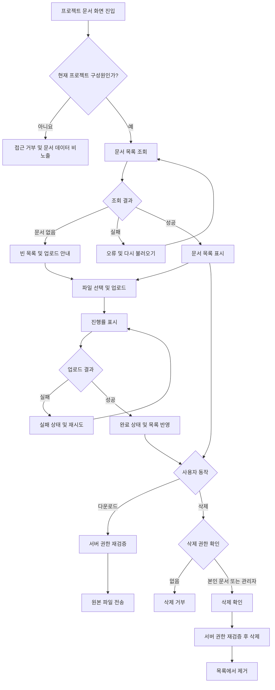

# 사내 프로젝트 문서 공유 PRD

## Applicability

| Contract | Required / N/A | Evidence |
|---|---|---|
| Pages/routes or screen IDs | Required | 문서 목록, 업로드, 다운로드, 삭제가 이루어지는 사용자 화면이 필요함 |
| Empty/loading/error/success/recovery state matrix | Required | 빈 목록, 업로드 진행률, 실패 후 재시도, 완료 상태가 명시적으로 요구됨 |
| Mermaid user or system flow | Required | 업로드·권한 확인·목록 반영·다운로드·삭제로 이어지는 다단계 흐름임 |

## Context and problem

프로젝트 문서가 개인 저장공간이나 여러 채널에 분산되어 있어, 프로젝트 구성원이 필요한 문서를 한곳에서 찾고 안전하게 공유하기 어렵다.

직원은 자신이 참여 중인 프로젝트에 문서를 업로드하고 동일 프로젝트 구성원과 공유할 수 있어야 한다. 프로젝트 관리자는 프로젝트 문서를 관리할 수 있어야 하며, 일반 구성원의 삭제 권한은 자신이 업로드한 문서로 제한되어야 한다.

4주 내 내부 베타 출시를 목표로 한다.

## Goals

- 프로젝트 구성원이 프로젝트별 문서를 업로드하고 목록에서 확인할 수 있다.
- 같은 프로젝트의 현재 구성원만 문서를 조회하고 다운로드할 수 있다.
- 일반 구성원과 프로젝트 관리자에게 서로 다른 삭제 권한을 적용한다.
- 업로드 진행률, 성공, 실패, 재시도 상태를 명확히 제공한다.
- 문서 목록의 체감 표시 시간을 측정하고 2초 이내 표시를 제품 목표로 관리한다.
- 업로드, 목록, 다운로드, 삭제로 제한된 내부 베타를 4주 내 제공한다.

## Non-goals

1차 내부 베타에서는 다음을 제공하지 않는다.

- 문서 검색, 필터링 및 전문 검색
- 프로젝트 외부 사용자 또는 공개 링크를 통한 공유
- 폴더, 태그, 문서 버전 관리
- 공동 편집 및 미리보기
- 문서별 별도 접근 권한 설정
- 휴지통 및 사용자 직접 복구
- 이 PRD 안에서의 프로젝트 생성·수정·종료
- 별도의 구성원 초대·제거 UI 구현

구성원 초대·제거는 프로젝트 관리자의 역할이지만, 1차 범위에는 업로드·목록·다운로드·삭제만 포함한다. 따라서 베타에서는 기존 프로젝트 및 구성원 관리 기능이 존재한다고 가정한다. 이 가정이 성립하지 않으면 구성원 관리 범위는 출시 전에 다시 결정해야 한다.

## Users, roles, and permissions

| 역할 | 문서 목록 조회·다운로드 | 문서 업로드 | 본인 문서 삭제 | 다른 구성원 문서 삭제 | 구성원 초대·제거 |
|---|---:|---:|---:|---:|---:|
| 프로젝트 관리자 | 가능 | 가능 | 가능 | 가능 | 가능하나 1차 UI 범위에서는 제외 |
| 일반 구성원 | 가능 | 가능 | 가능 | 불가 | 불가 |
| 비구성원 또는 제거된 구성원 | 불가 | 불가 | 불가 | 불가 | 불가 |

- 권한은 화면 노출 여부가 아니라 서버에서 매 요청마다 검증한다.
- 프로젝트 관리자는 해당 프로젝트 범위에서만 관리자 권한을 가진다.
- 구성원 제거 후에는 다음 요청부터 해당 프로젝트 문서에 접근할 수 없다.
- 구성원 제거 전에 올린 문서는 자동 삭제하지 않으며 프로젝트에 남는다. 프로젝트 관리자는 해당 문서를 삭제할 수 있다.

## Functional requirements

우선순위 정의:

- `P0`: 내부 베타 출시 필수
- `P1`: 베타 품질 향상을 위해 필요하지만 출시 차단 여부는 제품 책임자가 결정

| ID | Requirement | Priority |
|---|---|---|
| FR-01 | 시스템은 현재 사용자가 구성원인 프로젝트의 문서 화면에만 접근을 허용해야 한다. | P0 |
| FR-02 | 문서 목록은 선택한 프로젝트에 속한 업로드 완료 문서만 표시해야 한다. | P0 |
| FR-03 | 각 문서에는 최소한 원본 파일명, 파일 크기, 업로더, 업로드 완료 시각, 사용자가 실행할 수 있는 동작이 표시되어야 한다. | P0 |
| FR-04 | 목록에 문서가 없으면 빈 목록임을 설명하고 업로드 행동을 안내해야 한다. | P0 |
| FR-05 | 구성원은 로컬 파일을 선택해 현재 프로젝트에 업로드할 수 있어야 한다. | P0 |
| FR-06 | 업로드 중에는 파일명, 진행률 및 진행 중 상태를 표시해야 한다. 진행률은 전송된 바이트를 기준으로 표시한다. | P0 |
| FR-07 | 업로드 성공 시 완료 상태를 표시하고 해당 문서를 목록에 반영해야 한다. 다운로드 가능한 목록에는 서버가 업로드 완료로 확정한 문서만 포함한다. | P0 |
| FR-08 | 업로드 실패 시 실패 상태와 재시도 동작을 제공해야 한다. 같은 화면 세션에서는 파일을 다시 선택하지 않고 재시도할 수 있어야 한다. | P0 |
| FR-09 | 구성원은 권한이 있는 문서의 원본 파일을 다운로드할 수 있어야 한다. | P0 |
| FR-10 | 일반 구성원은 자신이 업로드한 문서만 삭제할 수 있어야 한다. | P0 |
| FR-11 | 프로젝트 관리자는 해당 프로젝트에 속한 모든 문서를 삭제할 수 있어야 한다. | P0 |
| FR-12 | 삭제 전에는 대상 파일명을 포함한 확인 절차를 제공해야 한다. 성공 시 목록에서 제거하고, 실패 시 문서를 유지하며 오류와 재시도 동작을 제공해야 한다. | P0 |
| FR-13 | 목록 조회 실패 시 오류 상태와 다시 불러오기 동작을 제공해야 한다. 재시도 중에는 중복 요청을 방지해야 한다. | P0 |
| FR-14 | 다운로드 실패 시 오류를 알리고 다시 다운로드할 수 있어야 한다. | P1 |
| FR-15 | 구성원이 제거되거나 역할이 변경되면 이후 문서 요청에는 최신 프로젝트 권한을 적용해야 한다. | P0 |

### 최소 데이터 계약

문서 레코드는 최소한 다음 정보를 가져야 한다.

- 문서 식별자
- 소속 프로젝트 식별자
- 원본 파일명
- 파일 크기
- 업로더 사용자 식별자
- 업로드 완료 시각
- 업로드 상태
- 저장된 파일을 찾기 위한 내부 참조값

파일 저장 위치나 스토리지 제품은 이 PRD에서 지정하지 않는다.

## Pages and routes

| Page or screen ID | Route, deep link, or explicit TBD + owner | Roles | Purpose |
|---|---|---|---|
| DOC-01 프로젝트 문서 | `/projects/:projectId/documents`를 기본 가정. 기존 프로젝트 라우팅 규칙과 다르면 엔지니어링 리드가 개발 착수 시 확정 | 프로젝트 관리자, 일반 구성원 | 목록 조회, 업로드 상태 확인, 다운로드 및 권한에 따른 삭제 |
| DOC-02 삭제 확인 | DOC-01 내 모달 또는 대화상자 | 삭제 권한이 있는 구성원 | 대상 파일 확인 후 삭제 확정 또는 취소 |

별도의 업로드 완료 페이지나 오류 페이지는 만들지 않고 DOC-01 내 상태로 처리한다.

## State matrix

| Surface | Empty | Loading | Error | Success | Recovery |
|---|---|---|---|---|---|
| 문서 목록 | “아직 문서가 없습니다”와 업로드 안내 표시 | 최초 조회 진행 상태 표시 | 목록을 불러오지 못했다는 메시지 표시 | 업로드 완료 문서와 허용된 동작 표시 | `다시 불러오기` 실행 |
| 업로드 항목 | 파일 미선택 상태 | 파일명과 0~100% 진행률 표시 | 실패 원인에 대한 사용자용 메시지와 실패 상태 표시 | 업로드 완료 상태를 표시하고 목록에 반영 | 같은 화면 세션에서는 `재시도`; 페이지를 새로 열었으면 파일 재선택 |
| 삭제 | 삭제 확인 전에는 변화 없음 | 확인 후 처리 중 상태, 중복 실행 방지 | 문서를 목록에 유지하고 실패 메시지 표시 | 문서를 목록에서 제거하고 완료 알림 표시 | 삭제 재시도 또는 취소 |
| 다운로드 | 해당 없음 | 다운로드 시작 상태 또는 브라우저 기본 동작 | 다운로드 실패 메시지 표시 | 원본 파일 다운로드 시작 | `다시 다운로드` 실행 |
| 권한 없음 | 해당 없음 | 권한 확인 중 상태 | 접근 불가 화면을 표시하고 문서 데이터는 노출하지 않음 | 해당 없음 | 접근 가능한 프로젝트 화면으로 이동 |

## User or system flow

## Authorization and data boundaries

- 모든 목록, 업로드, 다운로드, 삭제 요청은 인증된 사용자와 대상 프로젝트를 기준으로 서버에서 권한을 검증한다.
- 요청 URL이나 문서 식별자를 변경하더라도 다른 프로젝트의 문서 또는 메타데이터를 조회할 수 없어야 한다.
- 문서 식별자만으로 다운로드하거나 삭제할 수 없으며, 문서의 소속 프로젝트와 사용자의 현재 프로젝트 구성원 여부를 함께 검증한다.
- 일반 구성원 삭제 요청은 현재 사용자 식별자와 문서의 업로더 식별자가 일치할 때만 허용한다.
- 프로젝트 관리자 삭제 요청은 사용자가 해당 문서가 속한 프로젝트의 현재 관리자인 경우에만 허용한다.
- UI에서 삭제 버튼을 숨기는 것과 별개로, 권한 없는 직접 API 요청은 거부해야 한다.
- 업로드 완료가 확정되지 않은 파일은 목록이나 다운로드 인터페이스에 노출하지 않는다.
- 구성원 제거 후에도 기존에 내려받은 로컬 사본을 회수하는 기능은 제공하지 않는다.
- 삭제된 문서의 실제 보존·복구 정책은 열린 결정으로 관리하되, 사용자 인터페이스에서는 삭제 성공 직후 접근할 수 없어야 한다.

## Non-functional requirements

### 성능

- `NFR-01`: 문서 목록은 화면 진입 후 2초 이내에 사용자에게 보이는 것을 제품 목표로 한다.
- 이 수치는 확정 SLA가 아니며, 내부 베타에서 측정할 성능 목표다.
- 측정 시작점은 문서 화면 진입으로, 종료점은 목록 또는 빈 상태가 화면에 표시된 시점으로 가정한다.
- 네트워크 조건, 대상 백분위수, 허용 문서 수 및 정식 SLA는 제품 책임자가 베타 종료 전 결정한다.

### 보안

- `NFR-02`: 전송 구간은 회사의 기존 인증 및 암호화 기준을 따라야 한다.
- `NFR-03`: 파일명 등 사용자 입력값은 화면에 안전하게 출력하여 스크립트 실행이나 마크업 삽입이 발생하지 않아야 한다.
- `NFR-04`: 권한 거부 응답은 다른 프로젝트 문서의 존재 여부, 파일명, 업로더 등의 정보를 노출하지 않아야 한다.

### 신뢰성 및 사용성

- `NFR-05`: 업로드 또는 삭제 요청 처리 중 같은 동작의 중복 실행을 막아야 한다.
- `NFR-06`: 실패 메시지는 사용자가 재시도 가능한 오류와 권한 부족처럼 재시도로 해결되지 않는 오류를 구분해야 한다.
- `NFR-07`: 업로드 성공 응답을 받은 문서는 새로고침 없이 현재 목록에서 확인할 수 있어야 한다.

## Acceptance criteria

| ID | Requirement | Given | When | Then | Verification |
|---|---|---|---|---|---|
| AC-01 | FR-01, NFR-04 | 사용자가 프로젝트 구성원이 아닐 때 | 해당 프로젝트 문서 화면이나 API에 접근하면 | 접근이 거부되고 문서 목록 및 메타데이터가 노출되지 않는다 | 비구성원 UI 및 직접 API 통합 테스트 |
| AC-02 | FR-02, FR-03 | 프로젝트에 업로드 완료 문서가 있을 때 | 구성원이 문서 화면을 열면 | 해당 프로젝트의 완료 문서만 파일명, 크기, 업로더, 완료 시각과 함께 표시된다 | 목록 API 및 UI 테스트 |
| AC-03 | FR-04 | 프로젝트에 완료 문서가 없을 때 | 목록 조회가 성공하면 | 빈 목록 안내와 업로드 동작이 표시된다 | UI 테스트 |
| AC-04 | FR-05, FR-06 | 구성원이 유효한 파일을 선택했을 때 | 업로드를 시작하면 | 파일명과 진행 상태가 표시되고 전송량에 따라 진행률이 갱신된다 | 브라우저 통합 테스트 |
| AC-05 | FR-07, NFR-07 | 업로드가 서버에서 완료됐을 때 | 성공 응답을 받으면 | 완료 상태가 표시되고 문서가 새로고침 없이 목록에 나타난다 | 업로드 성공 통합 테스트 |
| AC-06 | FR-08 | 업로드가 네트워크 또는 서버 오류로 실패했을 때 | 사용자가 같은 화면 세션에서 재시도를 선택하면 | 파일 재선택 없이 업로드가 다시 시작되고 진행률이 초기화된다 | 오류 주입 통합 테스트 |
| AC-07 | FR-09 | 현재 프로젝트 구성원이 완료 문서를 보고 있을 때 | 다운로드를 실행하면 | 서버가 권한을 재검증하고 원본 파일명으로 다운로드를 시작한다 | 다운로드 API 및 파일 무결성 테스트 |
| AC-08 | FR-10 | 일반 구성원이 다른 사용자의 문서를 보고 있을 때 | UI 또는 직접 API로 삭제를 시도하면 | UI에는 삭제 동작이 제공되지 않고 직접 요청은 거부된다 | 권한 단위·통합 테스트 |
| AC-09 | FR-10, FR-12 | 일반 구성원이 자신이 올린 문서를 보고 있을 때 | 삭제를 확인하면 | 삭제가 성공하고 해당 문서가 목록과 후속 다운로드 요청에서 사라진다 | UI 및 API 통합 테스트 |
| AC-10 | FR-11, FR-12 | 프로젝트 관리자가 프로젝트 내 다른 구성원의 문서를 보고 있을 때 | 삭제를 확인하면 | 삭제가 성공하고 문서가 목록과 후속 다운로드 요청에서 사라진다 | 관리자 권한 통합 테스트 |
| AC-11 | FR-12 | 삭제 요청이 실패했을 때 | 오류 응답을 받으면 | 문서가 목록에 유지되고 오류 및 재시도 동작이 표시된다 | 오류 주입 UI 테스트 |
| AC-12 | FR-13 | 목록 조회가 실패했을 때 | 사용자가 다시 불러오기를 선택하면 | 단일 재조회가 실행되고 성공 시 목록 또는 빈 상태로 전환된다 | 오류 주입 통합 테스트 |
| AC-13 | FR-14 | 다운로드가 실패했을 때 | 오류가 반환되면 | 실패 안내와 다시 다운로드 동작이 제공된다 | UI 테스트 |
| AC-14 | FR-15 | 사용자가 프로젝트에서 제거된 상태일 때 | 기존 화면이나 문서 URL로 목록·업로드·다운로드·삭제를 요청하면 | 다음 요청부터 모두 거부된다 | 권한 변경 통합 테스트 |
| AC-15 | NFR-01 | 내부 베타 측정 환경에서 | 사용자가 문서 화면에 진입하면 | 화면 진입부터 목록 또는 빈 상태 표시까지의 시간이 기록되고 2초 목표 대비 결과를 확인할 수 있다 | 성능 계측 결과 검토 |
| AC-16 | NFR-03 | 파일명에 HTML 또는 스크립트 형태의 문자열이 포함될 때 | 목록과 오류 메시지에 파일명을 표시하면 | 문자열이 실행되지 않고 텍스트로만 표시된다 | 보안 테스트 |

## Assumptions and open decisions

### 합리적 가정

| ID | 가정 | 영향 |
|---|---|---|
| AS-01 | 사내 인증, 프로젝트, 구성원 및 프로젝트 관리자 역할 데이터가 이미 존재한다. | 1차 범위에서 별도의 프로젝트·구성원 관리 시스템을 만들지 않는다. |
| AS-02 | 1차 베타 사용자는 회사 내부 직원으로 제한된다. | 외부 사용자 계정과 공개 링크 접근은 고려하지 않는다. |
| AS-03 | 문서는 하나의 프로젝트에만 소속된다. | 문서 하나를 여러 프로젝트에 연결하는 모델은 지원하지 않는다. |
| AS-04 | 업로드한 사용자가 프로젝트에서 제거되어도 문서는 프로젝트 자산으로 남는다. | 관리자는 해당 문서를 계속 조회하고 삭제할 수 있다. |
| AS-05 | 업로드 재시도는 현재 화면 세션에서만 파일 재선택 없이 지원한다. | 새로고침이나 브라우저 재실행 후에는 파일을 다시 선택해야 한다. |
| AS-06 | 삭제는 사용자 관점에서 즉시 효력이 발생한다. | 삭제 성공 후 목록과 다운로드에서 즉시 접근할 수 없어야 한다. |
| AS-07 | 목록 기본 정렬은 최신 업로드 완료 시각 내림차순이다. | 검색·필터 없이도 최근 문서를 먼저 볼 수 있다. |
| AS-08 | 한 번에 하나 이상의 파일을 선택하는 다중 업로드는 필수 범위가 아니다. | 초기 구현은 단일 파일 업로드로 출시할 수 있다. |

### 열린 결정

| ID | 결정 필요 사항 | 임시 처리 | 책임자 / 결정 시점 |
|---|---|---|---|
| OD-01 | 기존 구성원 초대·제거 기능이 실제로 제공되는가? | 존재한다고 가정하고 연동만 수행 | 제품 책임자·엔지니어링 리드 / 1주 차 종료 전 |
| OD-02 | 허용 파일 형식, 단일 파일 최대 크기 및 사용자·프로젝트별 저장 한도 | 개발 환경에서는 설정값으로 관리하고 운영 기본값은 임의 확정하지 않음 | 제품 책임자·보안 담당자 / 1주 차 종료 전 |
| OD-03 | 악성코드 검사, 실행 파일 차단 등 업로드 보안 정책 | 회사의 기존 파일 업로드 정책을 우선 적용 | 보안 담당자 / 베타 업로드 개방 전 |
| OD-04 | 삭제 파일의 물리 삭제 시점, 관리자 복구 가능 기간 및 백업 보존 정책 | UI에서는 즉시 삭제된 것으로 처리 | 제품 책임자·보안/인프라 담당자 / 2주 차 종료 전 |
| OD-05 | 2초 목표의 대상 백분위수, 네트워크 환경, 최대 문서 수 및 정식 SLA | 내부 베타에서는 측정만 하고 SLA로 고지하지 않음 | 제품 책임자 / 베타 결과 검토 시 |
| OD-06 | 동일한 파일명 또는 동일 내용의 중복 업로드 허용 여부 | 중복을 허용하고 각 업로드를 별도 문서로 취급 | 제품 책임자 / 2주 차 종료 전 |
| OD-07 | 여러 파일 동시 업로드를 베타에 포함할지 여부 | 단일 파일 업로드를 기준으로 구현 | 제품 책임자 / 1주 차 종료 전 |
| OD-08 | 다운로드 및 삭제 이력에 대한 감사 로그 보존 요구 | 기존 사내 감사 로깅이 있으면 연동하고 신규 정책은 만들지 않음 | 보안 담당자 / 2주 차 종료 전 |

OD-01~OD-03은 구현 및 보안 범위를 바꿀 수 있으므로 베타 출시 전 반드시 닫아야 한다.

## Risks and mitigations

| 위험 | 영향 | 완화 방안 |
|---|---|---|
| 기존 프로젝트 권한 데이터가 없거나 최신 상태를 제공하지 못함 | 비구성원이 문서에 접근하거나 정상 사용자가 차단될 수 있음 | 1주 차에 권한 소스와 역할 변경 전파 방식을 검증하고, 실패 시 베타 범위를 재조정 |
| 파일 크기와 형식 정책 결정 지연 | 업로드 API 및 오류 UX 확정 지연 | 제한값을 설정 가능하게 구현하고 OD-02 결정 기한을 1주 차로 고정 |
| 업로드 성공 직후 목록 반영 불일치 | 사용자가 재업로드하여 중복 문서가 생길 수 있음 | 서버 완료 응답과 목록 레코드 생성을 일관되게 처리하고 성공 즉시 목록 갱신 |
| 재시도 중 중복 업로드 | 동일 문서가 여러 개 만들어질 수 있음 | 처리 중 중복 클릭을 막고, 요청 식별자 또는 동등한 중복 방지 방법을 구현 단계에서 적용 |
| 삭제 권한을 UI에만 적용 | 직접 API 호출로 다른 사용자의 문서가 삭제될 수 있음 | 서버 권한 테스트를 필수 수용 기준으로 적용 |
| 대형 파일 또는 긴 목록으로 2초 목표 미달 | 사용성이 저하되고 SLA 결정 근거가 부족해짐 | 목록 응답 크기와 표시 시간을 계측하고 베타 데이터로 페이지네이션 및 SLA 필요성을 결정 |
| 악성 파일 업로드 | 사내 사용자 및 시스템 보안 위험 | 베타 전 회사 보안 정책 확인, 필요 시 형식 차단 또는 검사 절차 적용 |
| 4주 일정에 열린 결정이 누적됨 | 핵심 기능 통합 및 검증 시간 부족 | 1주 차에 권한·파일 정책·다중 업로드 범위를 확정하고 범위 추가를 제한 |

## Delivery

| Phase | Requirement IDs | Verifiable exit condition |
|---|---|---|
| 1주 차: 계약 및 기반 확인 | FR-01, FR-02, FR-03, FR-15 | 기존 인증·프로젝트·역할 연동이 확인되고, 비구성원 차단 및 문서 데이터 계약에 대한 테스트가 통과함 |
| 2주 차: 핵심 문서 흐름 | FR-04, FR-05, FR-06, FR-07, FR-08, NFR-07 | 빈 목록, 단일 파일 업로드, 진행률, 완료, 실패 및 재시도 흐름이 통합 환경에서 동작함 |
| 3주 차: 다운로드·삭제·오류 복구 | FR-09, FR-10, FR-11, FR-12, FR-13, FR-14, NFR-02~NFR-06 | 역할별 다운로드·삭제 권한 테스트와 목록·삭제·다운로드 오류 복구 테스트가 통과함 |
| 4주 차: 내부 베타 검증 | FR-01~FR-15, NFR-01~NFR-07 | P0 수용 기준이 통과하고, 보안 관련 열린 결정이 해소되며, 2초 목표 측정 결과와 알려진 문제 목록이 기록된 상태로 내부 직원에게 배포 가능함 |

### 내부 베타 출시 기준

- 모든 P0 기능과 수용 기준 통과
- 비구성원, 일반 구성원, 프로젝트 관리자 권한 테스트 통과
- 업로드 진행·완료·실패·재시도 상태 확인
- 빈 목록 및 목록 조회 실패 복구 확인
- 다운로드와 삭제의 서버 권한 검증 확인
- OD-01, OD-02, OD-03 결정 완료
- 2초 목록 표시 목표에 대한 측정 가능 상태 확보
- 검색 및 외부 공유가 제품과 API에서 비활성화된 상태 확인