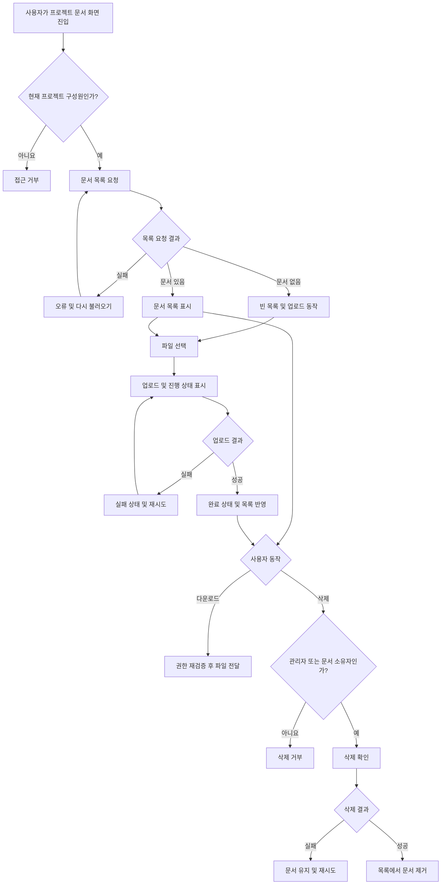

# 사내 프로젝트 문서 공유 PRD

## Applicability

| Contract | Required / N/A | Evidence |
|---|---|---|
| Pages/routes or screen IDs | Required | 직원이 문서 목록, 업로드 상태, 다운로드 및 삭제 기능을 사용하는 화면이 필요하다. |
| Empty/loading/error/success/recovery state matrix | Required | 빈 목록, 업로드 진행·완료·실패 및 재시도 상태가 명시적으로 요구되었다. |
| Mermaid user or system flow | Required | 파일 선택부터 업로드, 권한 확인, 목록 반영 및 재시도까지 다단계 생명주기가 존재한다. |

## Context and problem

프로젝트 문서가 개인 저장소나 여러 채널에 분산되면 같은 프로젝트 구성원이 필요한 문서를 찾거나 최신 자료를 공유하기 어렵다.

직원이 프로젝트별 문서를 한곳에 업로드하고 권한이 있는 구성원이 목록 조회와 다운로드를 할 수 있는 내부 문서 공유 기능을 제공한다. 프로젝트 관리자는 프로젝트 내 모든 문서를 관리하고, 일반 구성원은 자신이 업로드한 문서에 한해 삭제할 수 있어야 한다.

내부 베타는 4주 이내 출시를 목표로 한다.

## Goals

- 프로젝트 구성원이 프로젝트 단위로 문서를 업로드하고 공유할 수 있다.
- 구성원이 프로젝트 문서 목록을 확인하고 다운로드할 수 있다.
- 업로드 진행률과 성공·실패 상태를 명확히 제공한다.
- 실패한 업로드를 사용자가 다시 시도할 수 있다.
- 역할과 문서 소유권에 따라 서버에서 삭제 권한을 통제한다.
- 내부 베타에서 사용성과 목록 표시 성능을 측정할 수 있다.

## Non-goals

1차 출시에는 다음 항목을 포함하지 않는다.

- 문서 검색, 필터 및 정렬 설정
- 링크 기반 외부 공유 및 비회원 접근
- 문서 미리보기 및 온라인 편집
- 버전 관리와 변경 이력
- 폴더 또는 태그 분류
- 여러 프로젝트에 대한 일괄 업로드
- 프로젝트 생성·수정·삭제
- 프로젝트 구성원 초대·제거 UI 및 워크플로
- 확정된 운영 SLA 제공

구성원 초대·제거는 전체 기능 방향에는 포함되지만, “1차 출시는 업로드, 목록, 다운로드, 삭제만 포함”한다는 범위에 따라 이번 내부 베타에서는 제외한다.

## Users, roles, and permissions

| 역할 | 문서 목록 | 업로드 | 다운로드 | 문서 삭제 | 구성원 관리 |
|---|---:|---:|---:|---:|---:|
| 프로젝트 관리자 | 가능 | 가능 | 가능 | 프로젝트 내 모든 문서 | 향후 제공 |
| 일반 구성원 | 가능 | 가능 | 가능 | 본인이 업로드한 문서만 | 불가 |
| 프로젝트 비구성원 | 불가 | 불가 | 불가 | 불가 | 불가 |

- 모든 권한은 현재 프로젝트를 기준으로 평가한다.
- 관리자도 자신이 구성원으로 속한 프로젝트 범위 밖의 문서에는 접근할 수 없다.
- 화면에서 버튼을 숨기는 것만으로 권한을 처리하지 않으며, 서버가 모든 목록·업로드·다운로드·삭제 요청을 검증해야 한다.

## Functional requirements

| ID | Requirement | Priority |
|---|---|---|
| FR-01 | 인증된 사용자는 자신이 구성원인 프로젝트의 문서 공유 화면에 접근할 수 있다. | Must |
| FR-02 | 사용자는 로컬 파일을 선택해 현재 프로젝트에 업로드할 수 있다. | Must |
| FR-03 | 시스템은 업로드 중인 각 파일의 진행 상태를 사용자가 식별할 수 있는 형태로 표시한다. | Must |
| FR-04 | 업로드가 완료되면 해당 문서를 완료 상태로 표시하고 현재 프로젝트 문서 목록에 반영한다. | Must |
| FR-05 | 업로드에 실패하면 실패 상태와 재시도 동작을 제공한다. 재시도는 같은 프로젝트에 같은 파일을 다시 업로드한다. | Must |
| FR-06 | 시스템은 현재 프로젝트의 문서만 목록으로 제공하며, 문서명·업로더·업로드 시각과 사용 가능한 동작을 표시한다. | Must |
| FR-07 | 문서가 없는 프로젝트에서는 빈 목록 안내와 업로드 진입 동작을 표시한다. | Must |
| FR-08 | 프로젝트 구성원은 목록의 문서를 원본 파일로 다운로드할 수 있다. | Must |
| FR-09 | 일반 구성원은 자신이 업로드한 문서만 삭제할 수 있다. | Must |
| FR-10 | 프로젝트 관리자는 해당 프로젝트의 모든 문서를 삭제할 수 있다. | Must |
| FR-11 | 삭제 전 사용자에게 대상 문서를 식별할 수 있는 확인 절차를 제공한다. | Must |
| FR-12 | 삭제가 성공하면 해당 문서를 현재 목록에서 제거하고 완료 결과를 표시한다. | Must |
| FR-13 | 삭제가 실패하면 문서를 목록에 유지하고 실패 결과와 재시도 가능한 동작을 제공한다. | Must |
| FR-14 | 권한이 없거나 더 이상 존재하지 않는 문서에 대한 요청은 데이터를 노출하지 않고 거부한다. | Must |
| FR-15 | 사용자가 프로젝트에서 제거된 경우 이후의 목록·업로드·다운로드·삭제 요청을 거부한다. | Must |
| FR-16 | 프로젝트 구성원 초대·제거 기능은 1차 출시 범위 밖으로 관리하며, 기존 구성원 정보가 권한 판단의 기준이 된다. | Must |

## Pages and routes

| Page or screen ID | Route, deep link, or explicit TBD + owner | Roles | Purpose |
|---|---|---|---|
| DOC-LIST | TBD — 프론트엔드 리드가 개발 착수 전 기존 프로젝트 상세 IA에 맞춰 확정 | 프로젝트 관리자, 일반 구성원 | 문서 목록, 빈 상태, 업로드 진입, 다운로드 및 삭제 |
| DOC-UPLOAD-ITEM | DOC-LIST 내 상태 컴포넌트 | 프로젝트 관리자, 일반 구성원 | 파일별 업로드 진행률, 완료, 실패 및 재시도 표시 |
| DOC-DELETE-CONFIRM | DOC-LIST 내 확인 대화상자 | 삭제 권한이 있는 구성원 | 삭제 대상 확인 및 삭제 실행 |

별도 업로드 페이지는 두지 않고 문서 목록 화면에서 업로드하는 것으로 가정한다.

## State matrix

| Surface | Empty | Loading | Error | Success | Recovery |
|---|---|---|---|---|---|
| 문서 목록 | 문서가 없다는 안내와 업로드 동작 표시 | 목록 로딩 상태 표시 | 목록을 불러오지 못했다는 안내 | 문서와 허용된 동작 표시 | 목록 다시 불러오기 |
| 파일 업로드 | 선택된 파일 없음 | 파일별 진행 상태 표시 | 실패 파일과 실패 안내 표시 | 업로드 완료 상태 후 목록 반영 | 동일 파일 업로드 재시도 |
| 다운로드 | 해당 없음 | 다운로드 시작 처리 표시 | 다운로드 실패 또는 접근 불가 안내 | 브라우저를 통한 원본 파일 전달 | 다시 다운로드 |
| 문서 삭제 | 해당 없음 | 중복 요청을 막고 처리 중 표시 | 문서를 유지하고 삭제 실패 안내 | 목록에서 제거하고 완료 결과 표시 | 삭제 다시 시도 |
| 접근 권한 | 해당 없음 | 권한 확인 중 상태 | 비구성원 또는 권한 상실 안내 | 프로젝트 문서 화면 표시 | 권한이 복구된 후 화면 다시 불러오기 |

목록 로딩 실패와 빈 목록은 서로 다른 상태로 취급한다.

## User or system flow

## Authorization and data boundaries

- 모든 문서는 정확히 하나의 프로젝트에 귀속된다.
- 문서에는 최소한 고유 문서 ID, 프로젝트 ID, 원본 파일명, 업로더 사용자 ID, 업로드 시각, 저장 객체 식별자 및 상태가 연결되어야 한다.
- 클라이언트가 전달한 프로젝트 ID나 업로더 ID를 권한 판단의 신뢰 가능한 근거로 사용하지 않는다.
- 목록 조회 시 서버는 요청자가 현재 프로젝트 구성원인지 확인하고 해당 프로젝트 문서만 반환한다.
- 업로드 시작과 완료 처리 시 서버는 요청자의 현재 프로젝트 구성원 자격을 확인한다.
- 다운로드 시마다 현재 구성원 자격과 문서의 프로젝트 귀속을 다시 확인한다. 저장소의 영구 공개 URL을 제공하지 않는다.
- 삭제 시 서버는 다음 조건 중 하나를 검증한다.
  - 요청자가 해당 프로젝트 관리자이다.
  - 요청자가 일반 구성원이며 문서의 업로더 ID와 일치한다.
- 구성원 자격이나 관리자 역할이 변경되면 이후 요청부터 변경된 권한을 적용한다.
- 업로드가 실패하거나 중단된 파일이 정상 문서로 목록에 노출되어서는 안 된다.
- 존재하지 않는 문서와 접근할 수 없는 문서의 응답이 민감한 메타데이터를 노출해서는 안 된다.
- 구성원 초대·제거는 기존 사내 프로젝트 구성원 시스템이 담당한다고 가정한다.

## Non-functional requirements

| ID | Requirement |
|---|---|
| NFR-01 | 문서 목록은 화면 진입 후 2초 이내 사용 가능한 형태로 보이는 것을 제품 목표로 한다. 단, 측정 조건과 백분위가 정해지지 않았으므로 내부 베타의 출시 SLA나 차단 기준으로 사용하지 않는다. |
| NFR-02 | 내부 베타에서 목록 요청 시작부터 사용 가능한 목록 또는 빈 상태가 표시될 때까지의 시간을 측정할 수 있어야 한다. |
| NFR-03 | 업로드 진행 상태는 사용자가 업로드가 진행 중인지, 완료되었는지, 실패했는지를 구분할 수 있어야 한다. |
| NFR-04 | 동일한 삭제 요청이 반복되더라도 다른 문서가 삭제되거나 권한 범위를 벗어난 결과가 발생해서는 안 된다. |
| NFR-05 | 전송 및 저장 방식은 회사의 기존 인증·파일 저장·보안 정책을 따라야 한다. 해당 정책이 없다면 베타 착수 전에 보안 담당자가 기준을 정해야 한다. |

## Acceptance criteria

| ID | Requirement | Given | When | Then | Verification |
|---|---|---|---|---|---|
| AC-01 | FR-01, FR-06, FR-07 | 사용자가 프로젝트 구성원이다 | 문서 화면에 진입한다 | 해당 프로젝트의 문서만 표시되며, 문서가 없으면 빈 상태와 업로드 동작이 표시된다 | API 통합 테스트 및 UI 테스트 |
| AC-02 | FR-02, FR-03 | 구성원이 유효한 파일을 선택한다 | 업로드를 시작한다 | 파일별 업로드 진행 상태가 표시된다 | UI 통합 테스트 |
| AC-03 | FR-04 | 업로드가 서버에서 정상 완료된다 | 완료 응답을 받는다 | 완료 상태가 표시되고 문서가 현재 프로젝트 목록에 나타난다 | API·UI 통합 테스트 |
| AC-04 | FR-05 | 업로드 요청이 실패한다 | 실패 결과를 받는다 | 실패 상태와 재시도 동작이 표시되고, 재시도하면 같은 파일의 새 업로드가 시작된다 | 실패 주입 통합 테스트 |
| AC-05 | FR-08 | 현재 프로젝트 구성원이 목록의 문서를 선택한다 | 다운로드를 실행한다 | 서버가 권한을 검증하고 원본 파일을 전달한다 | API 권한 및 다운로드 테스트 |
| AC-06 | FR-09 | 일반 구성원이 자신이 업로드한 문서를 보고 있다 | 삭제를 확인한다 | 문서가 삭제되고 목록에서 제거된다 | API·UI 통합 테스트 |
| AC-07 | FR-09, FR-14 | 일반 구성원이 다른 구성원의 문서 ID를 알고 있다 | 직접 삭제 요청을 보낸다 | 서버가 요청을 거부하고 문서는 유지된다 | API 권한 테스트 |
| AC-08 | FR-10 | 프로젝트 관리자가 같은 프로젝트의 문서를 보고 있다 | 삭제를 확인한다 | 업로더와 관계없이 문서가 삭제된다 | API 권한 테스트 |
| AC-09 | FR-01, FR-14 | 프로젝트 비구성원이 문서 ID 또는 프로젝트 ID를 알고 있다 | 목록·업로드·다운로드·삭제를 요청한다 | 모든 요청이 거부되고 문서 내용과 민감한 메타데이터가 노출되지 않는다 | API 권한 테스트 |
| AC-10 | FR-11, FR-12 | 삭제 권한이 있는 사용자가 삭제를 선택한다 | 확인 절차에서 삭제를 확정한다 | 처리 중 중복 실행이 방지되고, 성공 후 완료 결과와 갱신된 목록이 표시된다 | UI 통합 테스트 |
| AC-11 | FR-13 | 삭제 요청이 실패한다 | 실패 응답을 받는다 | 문서가 목록에 유지되고 실패 안내와 재시도 동작이 표시된다 | 실패 주입 통합 테스트 |
| AC-12 | FR-15 | 문서 화면을 연 사용자가 프로젝트에서 제거된다 | 이후 문서 API를 호출한다 | 새 권한 상태에 따라 요청이 거부된다 | API 권한 변경 테스트 |
| AC-13 | NFR-01, NFR-02 | 내부 베타 측정 환경이 설정되어 있다 | 문서 화면을 여러 번 조회한다 | 목록 요청부터 목록 또는 빈 상태 표시까지의 시간이 기록되며 2초 목표 대비 결과를 확인할 수 있다 | 성능 계측 확인 및 베타 리포트 |
| AC-14 | FR-14 | 실패 또는 중단된 업로드가 존재한다 | 다른 구성원이 문서 목록을 조회한다 | 완료되지 않은 파일은 정상 다운로드 가능한 문서로 표시되지 않는다 | API 통합 테스트 |

## Assumptions and open decisions

### 합리적 가정

- A-01: 사내 인증과 사용자 계정 체계가 이미 존재하며 1차 출시에서 새 인증 시스템을 만들지 않는다.
- A-02: 프로젝트와 구성원·관리자 역할 정보가 기존 시스템에 존재하고 서버에서 조회할 수 있다.
- A-03: 1차 출시의 구성원 초대·제거는 기존 시스템이나 운영 절차로 수행한다.
- A-04: 프로젝트 문서 화면 안에서 파일을 선택하며 별도 업로드 페이지는 만들지 않는다.
- A-05: 동일한 파일명의 문서를 여러 번 업로드할 수 있으며 각각 별도 문서 ID를 갖는다. 자동 덮어쓰기는 하지 않는다.
- A-06: 다운로드는 변환본이 아닌 업로드된 원본 파일을 제공한다.
- A-07: 페이지 새로고침이나 브라우저 종료 이후에는 실패한 업로드의 로컬 파일을 보존하거나 자동 재개하지 않는다.
- A-08: 4주 목표는 내부 직원 대상 베타이며 외부 고객용 운영 수준이나 확정 SLA를 의미하지 않는다.

### 열린 결정

| ID | 결정 사항 | 영향 | 결정 책임자 | 결정 시점 |
|---|---|---|---|---|
| OD-01 | 허용 파일 형식, 단일 파일 최대 크기 및 사용자·프로젝트별 저장 한도 | 업로드 검증, UI 안내, 저장 비용 및 보안 | 제품 책임자 + 보안/인프라 담당 | 개발 1주 차 종료 전 |
| OD-02 | 악성코드 검사 필요 여부와 검사 중 문서 상태 | 다운로드 가능 시점, 상태 모델 및 베타 안전성 | 보안 담당자 | 개발 1주 차 종료 전 |
| OD-03 | 삭제를 즉시 영구 삭제할지, 복구 가능한 보존 기간을 둘지 | 저장소 처리, 복구 지원 및 개인정보 정책 | 제품 책임자 + 보안 담당자 | 삭제 API 구현 전 |
| OD-04 | 목록의 기본 정렬 기준과 페이지네이션 방식 | API 계약과 목록 사용성 | 제품 책임자 | 목록 API 구현 전 |
| OD-05 | 2초 목표의 측정 시작·종료점, 네트워크·데이터 조건, 대상 백분위 및 향후 SLA | 성능 합격 기준과 용량 계획 | 제품 책임자 | 베타 종료 전; SLA 확정 전 |
| OD-06 | 목록에 표시할 파일 크기와 파일 형식 등 추가 메타데이터 | API 응답과 화면 구성 | 제품 책임자 + 디자인 담당 | UI 구현 전 |
| OD-07 | 업로드 취소 기능 포함 여부 | 업로드 상태 및 네트워크 제어 | 제품 책임자 | 개발 1주 차 종료 전 |
| OD-08 | 구성원 초대·제거 기능의 후속 출시 시점과 관리 화면 | 전체 기능 완성도 및 운영 부담 | 제품 책임자 | 내부 베타 평가 후 |

OD-01과 OD-02가 정해지지 않으면 안전하고 검증 가능한 업로드 계약을 확정할 수 있으므로 개발 1주 차의 필수 결정으로 취급한다.

## Risks and mitigations

| Risk | Impact | Mitigation |
|---|---|---|
| 기존 프로젝트 구성원·역할 정보가 없거나 API로 조회할 수 없음 | 권한 모델과 4주 일정이 성립하지 않음 | 1주 차에 기존 권한 소스와 관리자 판별 API를 확인하고, 불가능하면 베타 범위를 재조정한다. |
| 파일 크기·형식·저장 한도가 늦게 결정됨 | 업로드 API와 UI 재작업 | OD-01을 1주 차 필수 결정으로 처리하고 서버와 클라이언트가 같은 제한을 사용한다. |
| UI에서만 삭제 권한을 제한함 | 직접 API 호출로 타인의 문서를 삭제할 수 있음 | 모든 삭제 요청에서 프로젝트, 역할 및 업로더를 서버가 검증하고 권한 테스트를 자동화한다. |
| 중단된 업로드가 정상 문서로 노출됨 | 손상 파일 또는 다운로드 실패 | 업로드 완료 전에는 문서를 정상 목록에 노출하지 않고 완료 상태 전환을 검증한다. |
| 2초 목표가 확정 SLA처럼 해석됨 | 검증 불가능한 출시 기준과 일정 충돌 | 베타에서는 계측과 목표 비교만 수행하고, SLA는 OD-05 결정 후 별도로 승인한다. |
| 프로젝트 제거 직후 기존 화면이나 URL로 접근함 | 권한 상실 사용자의 문서 접근 | 각 민감 요청에서 최신 구성원 권한을 서버가 재검증한다. |
| 4주 안에 구성원 관리까지 포함하려는 범위 확대 | 핵심 문서 흐름의 완성도 저하 | FR-16에 따라 구성원 관리 UI를 베타 범위에서 제외하고 후속 항목으로 관리한다. |

## Delivery

| Phase | Requirement IDs | Verifiable exit condition |
|---|---|---|
| 1주 차: 계약 및 기반 확인 | FR-01, FR-06, FR-14, FR-16, OD-01, OD-02 | 기존 인증·프로젝트·역할 데이터 연동 가능성이 확인되고, 업로드 제한과 보안 처리 방침 및 문서 API 계약이 확정된다. |
| 2주 차: 핵심 업로드·목록 | FR-02, FR-03, FR-04, FR-05, FR-06, FR-07 | 구성원이 파일을 업로드하고 진행·실패·재시도·완료 상태를 확인하며 프로젝트별 목록과 빈 상태를 볼 수 있다. |
| 3주 차: 다운로드·삭제·권한 | FR-08, FR-09, FR-10, FR-11, FR-12, FR-13, FR-14, FR-15 | 역할 및 소유권별 API 권한 테스트가 통과하고 다운로드와 삭제의 성공·실패 흐름이 동작한다. |
| 4주 차: 통합 검증 및 내부 베타 | FR-01–FR-16, NFR-01–NFR-05 | 핵심 인수 기준이 테스트되고 목록 표시 시간이 계측되며, 알려진 중대 권한·데이터 손실 결함 없이 내부 베타 배포 승인을 받는다. |

4주 일정은 A-01과 A-02가 성립하고, OD-01과 OD-02가 1주 차 안에 결정된다는 조건부 목표다. 저장하거나 별도 검증기를 실행하지 않았으며, 본 PRD는 제공된 브리프만을 근거로 작성했다.