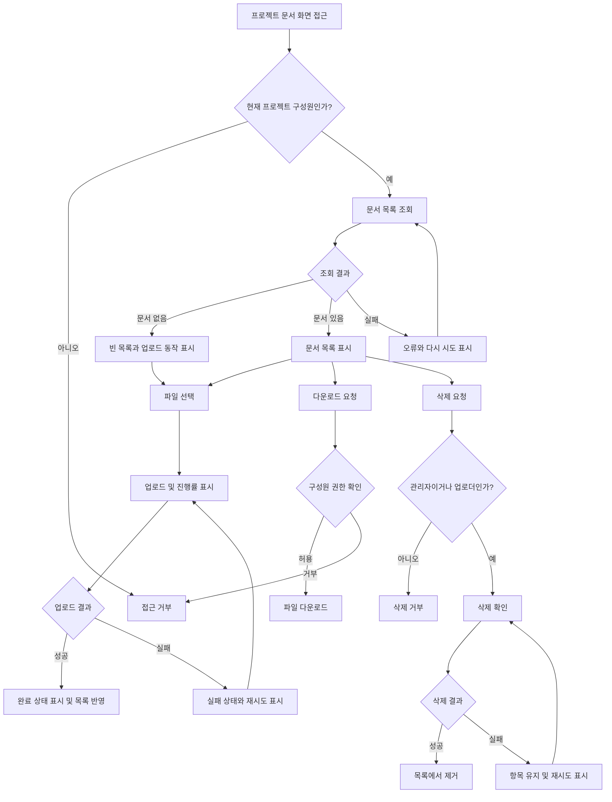

# 사내 프로젝트 문서 공유 PRD — 내부 베타 v1

## Applicability

| Contract | Required / N/A | Evidence |
|---|---|---|
| Pages/routes or screen IDs | Required | 직원이 문서를 업로드·조회·다운로드·삭제하는 사용자 화면이 필요하다. |
| Empty/loading/error/success/recovery state matrix | Required | 업로드 진행률, 빈 목록, 실패 후 재시도, 업로드 완료 상태가 명시적으로 요구되었다. |
| Mermaid user or system flow | Required | 업로드와 삭제가 권한 확인, 처리, 성공·실패 복구를 포함하는 다단계 흐름이다. |

## Context and problem

프로젝트 문서가 개인별 또는 분산된 위치에서 관리되면 구성원이 필요한 자료를 찾거나 최신 문서를 공유하기 어렵다. 프로젝트 구성원이 하나의 공간에서 문서를 업로드하고 다운로드할 수 있으며, 역할과 소유권에 따라 안전하게 삭제할 수 있는 내부 문서 공유 기능이 필요하다.

본 PRD는 4주 내 내부 베타를 목표로 하는 1차 출시 범위를 정의한다.

## Goals

- 프로젝트 구성원이 해당 프로젝트의 문서를 업로드하고 공유할 수 있다.
- 프로젝트 구성원이 업로드된 문서 목록을 확인하고 다운로드할 수 있다.
- 프로젝트 관리자와 일반 구성원에게 서로 다른 삭제 권한을 적용한다.
- 업로드 진행, 실패, 재시도 및 완료 상태를 명확히 제공한다.
- 내부 베타에서 목록 표시 시간을 측정해 정식 SLA 결정에 필요한 근거를 확보한다.

## Non-goals

- 문서 검색, 필터 및 전문 검색
- 사외 사용자 또는 공개 링크를 통한 외부 공유
- 문서 미리보기와 웹 편집
- 버전 관리 및 변경 이력
- 폴더 및 태그 기반 분류
- 문서 동시 편집
- 1차 출시 화면에서의 프로젝트 구성원 초대·제거
- 정식 가용성 또는 성능 SLA 확정

구성원 초대·제거는 프로젝트 관리자에게 필요한 기능이지만, “1차 출시는 업로드·목록·다운로드·삭제만 포함한다”는 범위에 따라 내부 베타 v1에서는 제외한다.

## Users, roles, and permissions

| 역할 | 접근 조건 | 업로드 | 목록·다운로드 | 삭제 | 구성원 관리 |
|---|---|---:|---:|---:|---:|
| 프로젝트 관리자 | 해당 프로젝트의 관리자 | 가능 | 가능 | 프로젝트 내 모든 문서 | v1 제외 |
| 일반 구성원 | 해당 프로젝트의 구성원 | 가능 | 가능 | 본인이 업로드한 문서만 | 불가 |
| 비구성원 | 프로젝트 구성원이 아님 | 불가 | 불가 | 불가 | 불가 |

## Functional requirements

| ID | Requirement | Priority |
|---|---|---|
| FR-001 | 인증된 사용자는 자신이 구성원인 프로젝트의 문서 화면에만 접근할 수 있어야 한다. | Must |
| FR-002 | 프로젝트 구성원은 로컬 파일 하나를 선택해 해당 프로젝트에 업로드할 수 있어야 한다. | Must |
| FR-003 | 업로드 중에는 대상 파일명, 업로드 중 상태 및 0~100% 진행률을 표시해야 한다. | Must |
| FR-004 | 업로드 실패 시 실패 상태와 재시도 동작을 제공해야 한다. 재시도할 수 없는 경우 파일 재선택이 필요함을 안내해야 한다. | Must |
| FR-005 | 업로드 성공 시 완료 상태를 표시하고, 완료된 문서를 목록에 반영해야 한다. | Must |
| FR-006 | 문서 목록에는 최소한 문서명, 업로더, 업로드 일시와 사용 가능한 작업을 표시해야 한다. 목록은 최신 업로드 순으로 정렬한다. | Must |
| FR-007 | 등록된 문서가 없으면 빈 목록 안내와 업로드 진입 동작을 표시해야 한다. | Must |
| FR-008 | 프로젝트 구성원은 목록에서 문서를 다운로드할 수 있어야 한다. | Must |
| FR-009 | 일반 구성원은 본인이 업로드한 문서만 삭제할 수 있어야 한다. | Must |
| FR-010 | 프로젝트 관리자는 해당 프로젝트의 모든 문서를 삭제할 수 있어야 한다. | Must |
| FR-011 | 삭제 전 확인을 받아야 하며, 성공 시 목록에서 문서를 제거하고 실패 시 문서를 유지한 채 실패 안내와 재시도 동작을 제공해야 한다. | Must |
| FR-012 | 목록 조회, 다운로드, 업로드 완료 및 삭제 시점마다 서버가 현재 프로젝트 구성원 여부와 필요한 역할·소유권을 검증해야 한다. | Must |
| FR-013 | 실패하거나 취소된 업로드는 완료된 문서 목록에 노출되어서는 안 된다. | Must |

## Pages and routes

| Page or screen ID | Route, deep link, or explicit TBD + owner | Roles | Purpose |
|---|---|---|---|
| DOC-01 프로젝트 문서 | 경로 TBD — 제품 책임자가 개발 1주 차 시작 전 결정 | 프로젝트 관리자, 일반 구성원 | 문서 업로드, 목록 조회, 다운로드 및 삭제 |
| DOC-02 접근 거부 | 공통 접근 거부 화면 또는 처리 방식 TBD — 제품 책임자·개발 리드가 개발 1주 차 내 결정 | 비구성원 또는 권한 상실 사용자 | 프로젝트 문서 접근이 허용되지 않음을 안내 |

## State matrix

| Surface | Empty | Loading | Error | Success | Recovery |
|---|---|---|---|---|---|
| 문서 목록 | “아직 문서가 없습니다”와 업로드 동작 표시 | 목록 로딩 표시 | 조회 실패 안내와 다시 시도 제공 | 문서명·업로더·일시·허용 작업 표시 | 목록 다시 불러오기 |
| 파일 업로드 | 선택된 파일 없음, 파일 선택 동작 표시 | 파일명과 0~100% 진행률 표시 | 업로드 실패 원인에 대한 일반 안내와 재시도 표시 | 업로드 완료 표시 후 목록 반영 | 동일 파일 재시도 또는 필요 시 파일 재선택 |
| 문서 다운로드 | N/A | 다운로드 시작 상태 또는 브라우저 기본 동작 | 다운로드 실패 또는 권한 상실 안내 | 파일 다운로드 시작 | 다시 시도 또는 목록 새로고침 |
| 문서 삭제 | N/A | 삭제 처리 중이며 중복 실행 방지 | 기존 목록 항목 유지, 실패 안내와 재시도 표시 | 목록에서 삭제된 문서 제거 | 삭제 다시 시도 |
| 접근 권한 | N/A | 권한 확인 중 | 인증 실패 또는 조회 실패 안내 | 구성원에게 문서 화면 표시 | 재로그인 또는 이전 화면 이동 |

## User or system flow

## Authorization and data boundaries

- 프로젝트는 문서 접근의 데이터 경계다.
- 사용자는 자신이 현재 구성원인 프로젝트의 문서와 메타데이터만 조회할 수 있다.
- 다운로드 URL이나 문서 식별자를 직접 입력하더라도 서버에서 프로젝트 구성원 여부를 다시 확인해야 한다.
- 삭제 권한은 서버에서 다음 기준으로 판정한다.
  - 프로젝트 관리자: 해당 프로젝트의 모든 문서 삭제 가능
  - 일반 구성원: 문서의 업로더 식별자가 현재 사용자와 일치할 때만 삭제 가능
- UI에서 삭제 버튼을 숨기는 것만으로 권한을 보장해서는 안 된다.
- 권한이 없는 조회·다운로드·삭제 요청은 문서 내용이나 존재 여부를 불필요하게 노출하지 않는 공통 거부 응답으로 처리한다.
- 업로드 시작 후 구성원 자격이 상실된 경우, 업로드 완료 처리 시 권한을 다시 확인하고 문서 생성을 완료하지 않는다.
- 삭제된 문서의 물리적 보관·복구 정책은 아직 결정되지 않았으므로 v1 계약 범위에 포함하지 않는다.

## Non-functional requirements

| ID | 영역 | Requirement |
|---|---|---|
| NFR-001 | 목록 성능 | 사용자가 문서 화면에 진입한 시점부터 목록의 문서 또는 빈 상태가 표시될 때까지 2초 이내를 제품 목표로 한다. 이는 확정 SLA나 출시 차단 기준이 아니다. |
| NFR-002 | 성능 측정 | 내부 베타에서 목록 표시 시간을 측정할 수 있어야 한다. 측정 구간, 백분위수, 네트워크 조건, 문서 수 기준과 목표 달성률은 제품 책임자가 베타 시작 전 확정한다. |
| NFR-003 | 권한 | 모든 문서 작업은 클라이언트 표시 상태와 무관하게 서버에서 현재 권한을 검증해야 한다. |
| NFR-004 | 데이터 정합성 | 업로드가 성공으로 확정되기 전에는 문서가 완료 목록에 나타나지 않아야 하며, 삭제 실패 시 목록과 실제 문서가 삭제된 것으로 표시되어서는 안 된다. |
| NFR-005 | 중복 실행 | 처리 중인 업로드·삭제 동작의 반복 입력으로 동일 작업이 의도치 않게 중복 완료되지 않아야 한다. |
| NFR-006 | 진단 가능성 | 목록 조회, 업로드, 다운로드 및 삭제 실패를 내부 베타에서 원인 분석할 수 있도록 요청 결과와 오류 유형을 기록해야 한다. 문서 내용 및 불필요한 개인정보는 로그에 남기지 않는다. |

## Acceptance criteria

| ID | Requirement | Given | When | Then | Verification |
|---|---|---|---|---|---|
| AC-001 | FR-001, FR-012 | 사용자가 프로젝트 A의 구성원이고 프로젝트 B의 구성원이 아닐 때 | 각 프로젝트의 문서 화면에 접근한다 | A는 접근할 수 있고 B는 거부된다 | 통합 테스트 |
| AC-002 | FR-002, FR-003 | 프로젝트 구성원이 유효한 파일을 선택했을 때 | 업로드를 시작한다 | 파일명, 업로드 중 상태와 0~100% 진행률이 표시된다 | UI·통합 테스트 |
| AC-003 | FR-004 | 업로드 요청이 실패하도록 설정했을 때 | 사용자가 재시도를 선택한다 | 업로드가 다시 실행되고 최신 처리 상태가 표시된다 | 통합 테스트 |
| AC-004 | FR-005, FR-006 | 업로드가 성공했을 때 | 완료 응답이 처리된다 | 완료 상태가 표시되고 문서가 최신 순 목록에 문서명·업로더·업로드 일시와 함께 나타난다 | 통합 테스트 |
| AC-005 | FR-007 | 프로젝트에 완료된 문서가 없을 때 | 목록 조회가 완료된다 | 빈 목록 안내와 업로드 동작이 표시된다 | UI 테스트 |
| AC-006 | FR-008, FR-012 | 프로젝트 구성원이 목록의 문서를 선택했을 때 | 다운로드를 요청한다 | 서버 권한 확인 후 해당 파일 다운로드가 시작된다 | 통합 테스트 |
| AC-007 | FR-008, FR-012 | 비구성원이 문서 식별자나 다운로드 주소를 알고 있을 때 | 직접 다운로드를 요청한다 | 파일과 메타데이터가 제공되지 않고 접근이 거부된다 | API 권한 테스트 |
| AC-008 | FR-009 | 일반 구성원이 자신이 올린 문서를 볼 때 | 삭제를 확인한다 | 삭제가 완료되고 목록에서 해당 문서가 제거된다 | 통합 테스트 |
| AC-009 | FR-009, FR-012 | 일반 구성원이 다른 사용자의 문서 삭제를 직접 요청할 때 | 삭제 API가 호출된다 | 삭제가 거부되고 문서는 유지된다 | API 권한 테스트 |
| AC-010 | FR-010 | 프로젝트 관리자가 다른 구성원이 올린 문서를 볼 때 | 삭제를 확인한다 | 삭제가 완료되고 목록에서 해당 문서가 제거된다 | 통합 테스트 |
| AC-011 | FR-011 | 삭제 요청이 실패하도록 설정했을 때 | 사용자가 삭제를 확인한다 | 문서가 목록에 유지되고 실패 안내 및 재시도 동작이 표시된다 | 통합 테스트 |
| AC-012 | FR-013, NFR-004 | 업로드가 실패하거나 중단되었을 때 | 문서 목록을 다시 조회한다 | 해당 업로드가 완료된 문서로 표시되지 않는다 | 통합 테스트 |
| AC-013 | FR-012 | 업로드 도중 사용자의 프로젝트 구성원 자격이 제거되었을 때 | 서버가 업로드 완료를 처리한다 | 완료가 거부되고 문서가 프로젝트 목록에 생성되지 않는다 | API·통합 테스트 |
| AC-014 | NFR-001, NFR-002 | 제품 책임자가 확정한 베타 측정 조건에서 | 문서 화면 진입부터 목록 또는 빈 상태 표시까지 측정한다 | 결과가 기록되고 2초 목표 대비 현황을 보고할 수 있다 | 성능 측정 보고서 |
| AC-015 | NFR-005 | 삭제 처리 중 사용자가 삭제 동작을 반복 입력할 때 | 요청이 처리된다 | 사용자 관점에서 한 번만 삭제되며 오류 상태가 발생하지 않는다 | 통합 테스트 |

파일 크기·형식 제한이 정해진 뒤에는 해당 경계값과 오류 메시지에 대한 수용 기준을 추가해야 한다.

## Assumptions and open decisions

### 합리적 가정

- 내부 베타 v1은 파일을 한 번에 하나씩 선택·업로드한다.
- 프로젝트와 구성원·관리자 역할 정보는 기존 사내 시스템에서 제공되며, 문서 기능은 이를 조회해 권한을 판단한다.
- 목록은 완료된 문서만 표시하고 최신 업로드 순으로 정렬한다.
- 최소 문서 메타데이터는 문서명, 업로더 식별자, 업로드 일시다.
- 삭제는 사용자 실수를 줄이기 위해 확인 단계를 거친다.
- 재시도 시 브라우저가 파일 데이터를 유지할 수 있으면 같은 파일로 재시도하고, 유지할 수 없으면 재선택을 안내한다.
- 내부 베타 대상자는 이미 생성된 프로젝트의 구성원이다.

### 열린 결정

| ID | 결정 사항 | 영향 | 결정 책임자 | 결정 시점 |
|---|---|---|---|---|
| OD-001 | 허용 파일 형식, 최대 파일 크기 및 사용자별·프로젝트별 저장 용량 | 검증, 오류 처리, 저장 비용 및 보안 | 제품 책임자·보안·개발 리드 | 개발 1주 차 종료 전 |
| OD-002 | 악성 파일 검사 필요 여부와 검사 중 사용자 상태 | 업로드 완료 정의와 보안 | 보안 책임자·제품 책임자 | 개발 1주 차 종료 전 |
| OD-003 | 목록 2초 목표의 측정 시작·종료점, 백분위수, 네트워크·기기 조건, 문서 수 기준 및 실제 SLA | 성능 설계와 출시 판정 | 제품 책임자 | 내부 베타 시작 전 |
| OD-004 | 삭제가 즉시 영구 삭제인지, 유예 삭제인지와 복구·감사 보관 기간 | 저장 구조, 사용자 지원, 개인정보 정책 | 제품 책임자·보안/법무 | 개발 1주 차 종료 전 |
| OD-005 | 프로젝트 구성원 및 관리자 정보의 기준 시스템과 권한 변경 전파 시간 | 모든 접근 제어 | 제품 책임자·개발 리드 | 개발 착수 전 |
| OD-006 | 구성원 초대·제거 기능을 문서 기능의 후속 범위에 포함할지, 기존 프로젝트 관리 화면에서 제공할지 | 후속 로드맵과 화면 범위 | 제품 책임자 | 내부 베타 회고 시 |
| OD-007 | 동일한 파일명의 문서를 허용할지와 사용자에게 구분하는 방법 | 목록 UX 및 저장 정책 | 제품 책임자 | 개발 1주 차 종료 전 |
| OD-008 | 다운로드 시 원본 파일명을 유지할지 및 비ASCII 파일명 처리 기준 | 브라우저 호환성과 UX | 개발 리드 | 개발 2주 차 종료 전 |

OD-001, OD-002, OD-004, OD-005는 구현 방식이나 보안 경계를 변경할 수 있으므로 개발 초기에 반드시 확정해야 한다.

## Risks and mitigations

| Risk | 영향 | Mitigation |
|---|---|---|
| v1 범위와 관리자 구성원 관리 요구가 혼동될 수 있음 | 4주 일정 초과 | v1에서는 기존 구성원 정보를 사용하고 초대·제거 UI를 제외한다. 범위 변경 시 일정과 요구사항을 재산정한다. |
| 파일 제한 및 악성 파일 정책 미결정 | 보안 취약점 또는 개발 재작업 | OD-001·002를 1주 차 안에 결정하고 결정 전 외부 공개를 금지한다. |
| UI에서만 삭제 권한을 제한할 가능성 | 타 사용자 문서의 무단 삭제 | 모든 조회·다운로드·삭제에 서버 권한 테스트를 포함한다. |
| 느린 목록 응답 | 사용자 불편 및 베타 평가 저하 | 측정 조건을 정의하고 베타에서 실제 지표를 수집한다. SLA는 수집 결과 후 결정한다. |
| 업로드 완료와 목록 반영 간 불일치 | 중복 업로드 또는 문서 누락 오인 | 완료 확정 후에만 목록에 반영하고 실패 시 명시적 재시도를 제공한다. |
| 삭제 정책 미결정 | 실수로 인한 복구 불가 또는 저장 비용 증가 | 베타 전 삭제·복구 정책을 확정하고 사용자 문구와 서버 동작을 일치시킨다. |
| 권한 변경 전파 지연 | 제거된 구성원의 일시적 접근 | 민감 작업마다 현재 권한을 확인하고 전파 지연 기준을 OD-005에서 확정한다. |

## Delivery

| Phase | Requirement IDs | Verifiable exit condition |
|---|---|---|
| 1주 차 — 범위·권한 기반 | FR-001, FR-012; OD-001~005, OD-007 | 역할별 접근 제어 API 테스트가 통과하고, 구현 차단 결정을 책임자가 확정한다. |
| 2주 차 — 업로드 | FR-002~005, FR-013; NFR-004~006 | 업로드 진행률, 성공, 실패, 재시도 및 중단 업로드 비노출 테스트가 통과한다. |
| 3주 차 — 목록·다운로드·삭제 | FR-006~011 | 빈 목록, 최신 순 목록, 다운로드 및 역할별 삭제 테스트가 통과한다. |
| 4주 차 — 통합·내부 베타 준비 | FR-001~013; NFR-001~006 | 전체 수용 기준이 통과하고, 알려진 결함과 성능 측정 결과가 기록되며 내부 베타 대상자가 핵심 흐름을 실행할 수 있다. |

내부 베타 진입 조건은 Must 요구사항의 수용 기준 통과, 권한 관련 고위험 결함 0건, 그리고 OD-001~005의 결정 완료다. 2초 성능 목표는 측정 대상이지만, 제품 책임자가 실제 SLA와 출시 차단 기준을 별도로 결정하기 전까지 단독 출시 차단 조건으로 사용하지 않는다.