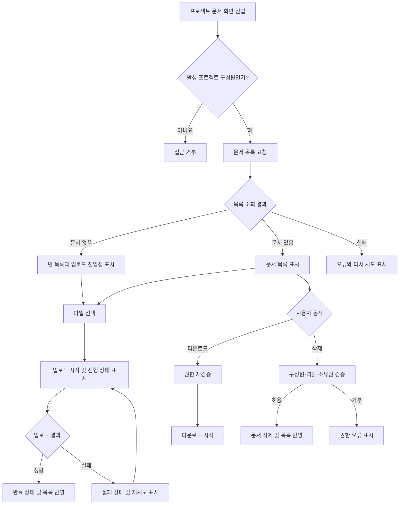

# 사내 프로젝트 문서 공유 PRD

## Applicability

| Contract | Required / N/A | Evidence |
|---|---|---|
| Pages/routes or screen IDs | Required | 사용자가 문서 목록, 업로드 상태, 삭제 기능을 사용하는 화면이 필요함 |
| Empty/loading/error/success/recovery state matrix | Required | 빈 목록, 업로드 진행·실패·재시도·완료 상태가 명시됨 |
| Mermaid user or system flow | Required | 업로드 및 다운로드·삭제가 권한 검증을 포함하는 다단계 흐름임 |

## Context and problem

프로젝트 구성원이 관련 문서를 한곳에 업로드하고 같은 프로젝트 구성원과 공유할 수 있는 내부 기능이 필요하다.

현재 브리프에서 요구하는 핵심은 프로젝트 단위 접근 통제와 기본 문서 수명주기 관리다. 사용자는 업로드 상태를 명확히 확인할 수 있어야 하며, 관리자와 일반 구성원의 삭제 권한이 구분되어야 한다.

4주 내 내부 베타 출시를 위해 1차 범위를 업로드, 목록, 다운로드, 삭제로 제한한다.

## Goals

- 프로젝트 구성원이 프로젝트별 문서를 업로드하고 공유할 수 있다.
- 프로젝트 구성원만 해당 프로젝트의 문서 목록을 조회하고 다운로드할 수 있다.
- 업로드 진행률과 성공·실패 상태를 사용자가 확인할 수 있다.
- 실패한 업로드를 다시 시도할 수 있다.
- 관리자와 일반 구성원에게 서로 다른 삭제 권한을 적용한다.
- 문서 목록이 빠르게 표시되는 경험을 제공한다.
- 4주 내 사내 사용자를 대상으로 내부 베타를 제공한다.

## Non-goals

다음 항목은 1차 내부 베타에 포함하지 않는다.

- 문서 검색, 필터, 정렬 기능
- 링크를 이용한 외부 공유
- 프로젝트 구성원 초대·제거 UI
- 문서 미리보기 및 온라인 편집
- 문서 버전 관리
- 폴더 또는 계층형 문서 구조
- 복수 문서 일괄 삭제
- 실제 SLA 보장 또는 대외 공표

프로젝트 관리자의 구성원 초대·제거 권한은 전체 제품의 도메인 규칙으로 유지하지만, 해당 관리 화면은 1차 범위에서 제외한다. 베타에서는 기존 프로젝트 구성원 관리 수단을 이용한다고 가정한다.

## Users, roles, and permissions

| 역할 | 문서 목록 | 업로드 | 다운로드 | 문서 삭제 | 구성원 관리 |
|---|---:|---:|---:|---:|---:|
| 프로젝트 관리자 | 가능 | 가능 | 가능 | 프로젝트 내 모든 문서 가능 | 가능하나 1차 UI 범위 제외 |
| 일반 구성원 | 가능 | 가능 | 가능 | 본인이 업로드한 문서만 가능 | 불가 |
| 프로젝트 비구성원 | 불가 | 불가 | 불가 | 불가 | 불가 |
| 프로젝트에서 제거된 사용자 | 불가 | 불가 | 불가 | 불가 | 불가 |

모든 권한은 화면 표시 여부와 별개로 서버에서 검증해야 한다.

## Functional requirements

| ID | Requirement | Priority |
|---|---|---|
| FR-001 | 시스템은 현재 사용자가 해당 프로젝트의 활성 구성원인지 서버에서 확인한 후 문서 기능 접근을 허용한다. | Must |
| FR-002 | 프로젝트 구성원은 프로젝트의 문서 목록과 각 문서의 파일명, 업로더, 업로드 완료 시각을 조회할 수 있다. | Must |
| FR-003 | 문서가 없을 때 시스템은 빈 목록 안내와 업로드 진입점을 표시한다. | Must |
| FR-004 | 프로젝트 구성원은 하나 이상의 로컬 파일을 선택해 현재 프로젝트에 업로드할 수 있다. | Must |
| FR-005 | 시스템은 업로드 중인 각 파일의 진행 상태를 사용자에게 표시한다. 수치 산출이 가능한 경우 0~100% 진행률을 표시한다. | Must |
| FR-006 | 업로드가 완료되면 해당 파일을 완료 상태로 표시하고 문서 목록에 반영한다. | Must |
| FR-007 | 업로드에 실패하면 실패한 파일과 실패 상태를 표시하고, 사용자가 해당 파일 업로드를 재시도할 수 있게 한다. | Must |
| FR-008 | 재시도는 실패한 파일을 대상으로 새 업로드를 수행하며, 성공하기 전에는 완료 문서로 노출하지 않는다. | Must |
| FR-009 | 프로젝트 구성원은 목록에서 문서를 다운로드할 수 있다. 다운로드 시점에도 프로젝트 구성원 권한을 다시 검증한다. | Must |
| FR-010 | 일반 구성원은 본인이 업로드한 문서만 삭제할 수 있다. | Must |
| FR-011 | 프로젝트 관리자는 프로젝트 내 모든 문서를 삭제할 수 있다. | Must |
| FR-012 | 삭제 권한이 없는 사용자에게는 삭제 동작을 제공하지 않으며, 직접 요청한 경우에도 서버가 이를 거부한다. | Must |
| FR-013 | 문서가 삭제되면 목록에서 제거되고 이후 다운로드할 수 없다. | Must |
| FR-014 | 프로젝트에서 제거된 사용자는 제거 반영 이후 해당 프로젝트의 목록 조회, 업로드, 다운로드, 삭제를 할 수 없다. | Must |
| FR-015 | 목록 조회, 업로드, 다운로드 또는 삭제가 실패하면 사용자에게 실패 사실과 가능한 다음 행동을 안내한다. | Must |

## Pages and routes

| Page or screen ID | Route, deep link, or explicit TBD + owner | Roles | Purpose |
|---|---|---|---|
| DOC-LIST | URL 구조 TBD — 제품 책임자와 프론트엔드 담당자가 개발 착수 전 결정 | 프로젝트 관리자, 일반 구성원 | 문서 목록, 빈 상태, 다운로드 및 삭제 |
| DOC-UPLOAD-QUEUE | DOC-LIST 내부 영역 또는 패널 — UI 형태는 디자인 담당자가 개발 1주 차에 결정 | 프로젝트 관리자, 일반 구성원 | 파일별 업로드 진행, 실패, 재시도, 완료 상태 |
| DOC-ACCESS-DENIED | 기존 공통 권한 오류 화면 사용 가정; 없으면 구현 방식 TBD — 프론트엔드 담당자 | 비구성원, 제거된 사용자 | 프로젝트 문서 접근 불가 안내 |

## State matrix

| Surface | Empty | Loading | Error | Success | Recovery |
|---|---|---|---|---|---|
| 문서 목록 | “등록된 문서가 없습니다” 안내와 업로드 동작 표시 | 목록 로딩 표시 | 조회 실패 안내와 다시 시도 제공 | 문서 메타데이터 및 허용된 동작 표시 | 목록 다시 불러오기 |
| 파일 업로드 | 선택된 파일 없음 | 파일별 진행 상태 또는 진행률 표시 | 실패 파일과 실패 상태 표시 | 완료 상태 표시 후 목록 반영 | 실패 파일 재시도 |
| 다운로드 | 해당 없음 | 다운로드 준비 또는 브라우저 다운로드 상태 | 다운로드 실패 안내 | 파일 다운로드 시작 | 다시 다운로드 |
| 문서 삭제 | 해당 없음 | 중복 동작을 막고 처리 중 표시 | 삭제 실패 안내, 기존 목록 유지 | 목록에서 문서 제거 | 다시 삭제 또는 목록 새로고침 |
| 접근 권한 | 해당 없음 | 권한 확인 중 표시 | 권한 확인 실패 안내 | 권한 있는 화면 표시 | 재시도 또는 이전 화면 이동 |

## User or system flow

## Authorization and data boundaries

- 모든 문서는 정확히 하나의 프로젝트에 귀속되어야 한다.
- 목록 조회, 업로드, 다운로드 및 삭제 요청에는 대상 프로젝트가 식별되어야 한다.
- 서버는 요청된 문서의 프로젝트와 사용자의 활성 프로젝트 구성원 자격을 대조해야 한다.
- 요청 경로나 문서 식별자를 임의로 변경해 다른 프로젝트의 문서에 접근할 수 없어야 한다.
- 일반 구성원의 삭제 권한은 인증된 사용자 ID와 문서 업로더 ID가 일치하는지 서버에서 검증한다.
- 프로젝트 관리자의 전체 삭제 권한은 요청 시점의 관리자 역할을 기준으로 판단한다.
- 구성원 제거 또는 역할 변경은 후속 요청부터 권한 판정에 반영되어야 한다.
- 삭제된 문서의 메타데이터나 저장 파일을 이후 다운로드할 수 없어야 한다.
- 실제 파일 다운로드 주소를 사용하는 경우, 비구성원이 재사용할 수 있는 영구 공개 URL이어서는 안 된다.
- 업로드가 완료되지 않은 파일은 정상 문서 목록 및 다운로드 대상으로 취급하지 않는다.

## Non-functional requirements

| ID | Category | Requirement |
|---|---|---|
| NFR-001 | 성능 목표 | 문서 목록은 사용자가 화면에 진입한 시점부터 사용 가능한 목록이 보일 때까지 2초 이내를 제품 목표로 한다. 이는 확정 SLA가 아니다. |
| NFR-002 | 측정 | NFR-001의 측정 환경, 데이터 규모, 네트워크 조건 및 백분위 기준은 제품 책임자가 베타 전 결정한다. 결정 전에는 개발 환경과 내부 베타 환경의 관측값을 별도로 기록한다. |
| NFR-003 | 보안 | 모든 문서 작업은 인증 및 프로젝트 단위 권한 검증을 거쳐야 한다. 클라이언트의 버튼 숨김만으로 권한을 통제하지 않는다. |
| NFR-004 | 무결성 | 실패하거나 중단된 업로드가 완료 문서로 표시되거나 다운로드되어서는 안 된다. |
| NFR-005 | 사용성 | 같은 업로드 항목에 진행 중, 실패, 완료 상태가 동시에 표시되어서는 안 되며 현재 상태가 구분 가능해야 한다. |

## Acceptance criteria

| ID | Requirement | Given | When | Then | Verification |
|---|---|---|---|---|---|
| AC-001 | FR-001, FR-014 | 사용자가 프로젝트의 활성 구성원이 아님 | 문서 화면 또는 API에 접근함 | 목록과 파일에 접근하지 못하고 권한 오류를 받음 | 역할별 API 통합 테스트 |
| AC-002 | FR-002 | 프로젝트에 완료된 문서가 존재함 | 구성원이 문서 화면에 진입함 | 해당 프로젝트 문서의 파일명, 업로더, 완료 시각이 표시됨 | UI 및 API 통합 테스트 |
| AC-003 | FR-003 | 프로젝트에 표시할 문서가 없음 | 목록 조회가 완료됨 | 빈 목록 안내와 업로드 동작이 표시됨 | UI 테스트 |
| AC-004 | FR-004, FR-005 | 구성원이 유효한 파일을 선택함 | 업로드를 시작함 | 파일별 업로드 상태가 표시되고 산출 가능한 경우 진행률이 갱신됨 | 업로드 UI 통합 테스트 |
| AC-005 | FR-006 | 파일 업로드가 성공함 | 서버가 업로드 완료를 확정함 | 완료 상태가 표시되고 해당 문서가 목록에 나타남 | API 및 UI 통합 테스트 |
| AC-006 | FR-007, FR-008 | 업로드 중 오류가 발생함 | 실패 응답을 수신함 | 실패한 파일이 식별되고 재시도 동작이 표시되며, 재시도 성공 시 한 개의 완료 문서로 반영됨 | 오류 주입 통합 테스트 |
| AC-007 | FR-009 | 사용자가 해당 프로젝트의 활성 구성원임 | 문서 다운로드를 요청함 | 권한 검증 후 올바른 파일 다운로드가 시작됨 | API 통합 테스트 |
| AC-008 | FR-009, FR-014 | 다운로드 주소나 문서 ID를 가진 사용자가 프로젝트에서 제거됨 | 다시 다운로드를 요청함 | 다운로드가 거부됨 | 권한 변경 통합 테스트 |
| AC-009 | FR-010, FR-012 | 일반 구성원이 다른 구성원이 업로드한 문서를 보고 있음 | 삭제를 시도함 | UI에서 삭제 동작이 제공되지 않고 직접 API 요청도 거부됨 | UI 테스트 및 API 권한 테스트 |
| AC-010 | FR-010, FR-013 | 일반 구성원이 본인이 업로드한 문서를 보고 있음 | 삭제를 실행함 | 문서가 삭제되고 목록과 다운로드 대상에서 제거됨 | API 및 UI 통합 테스트 |
| AC-011 | FR-011, FR-013 | 관리자가 프로젝트 내 다른 사용자의 문서를 보고 있음 | 삭제를 실행함 | 문서가 삭제되고 이후 다운로드할 수 없음 | 관리자 권한 통합 테스트 |
| AC-012 | FR-012 | 사용자가 다른 프로젝트의 문서 ID를 알고 있음 | 조회, 다운로드 또는 삭제를 요청함 | 요청이 거부되고 문서 내용이나 메타데이터가 노출되지 않음 | 교차 프로젝트 보안 테스트 |
| AC-013 | FR-015 | 목록 조회 또는 삭제 요청이 실패함 | 오류 응답을 수신함 | 실패 사실과 재시도 가능한 동작이 표시되며 기존 성공 데이터가 잘못 제거되지 않음 | 오류 상태 UI 테스트 |
| AC-014 | NFR-001, NFR-002 | 제품 책임자가 측정 조건을 확정함 | 내부 베타 환경에서 목록 표시 시간을 측정함 | 2초 목표 충족 여부를 기록하며 이를 SLA 달성으로 표현하지 않음 | 성능 측정 보고서 |

## Assumptions and open decisions

### 합리적 가정

- 회사의 기존 인증 체계를 사용하며 사용자는 사내 계정으로 식별된다.
- 프로젝트, 프로젝트 관리자 역할 및 구성원 정보는 기존 시스템에서 제공된다.
- 1차 베타에서는 별도의 구성원 초대·제거 화면을 개발하지 않는다.
- 문서 목록에는 업로드가 정상적으로 완료된 문서만 표시한다.
- 문서의 업로더는 업로드 완료 시점의 인증된 사용자로 기록되며 임의로 지정할 수 없다.
- 삭제는 사용자 관점에서 즉시 접근 불가능한 상태로 처리된다.
- 문서 삭제 전 확인 절차를 제공한다.
- 1차 베타의 대상은 사내 사용자이며 익명 접근은 허용하지 않는다.

### 열린 결정

| ID | Decision | Owner | Decision point / 영향 |
|---|---|---|---|
| OD-001 | 프로젝트 구성원 및 관리자 정보를 제공할 기존 시스템과 연동 방식 | 기술 책임자 | 개발 1주 차 전. 인증·권한 구현 방식에 영향 |
| OD-002 | 허용 파일 형식, 파일당 최대 크기, 한 번에 선택 가능한 파일 수 | 제품 책임자·보안 담당자 | 업로드 API 및 UI 개발 착수 전 |
| OD-003 | 동일 프로젝트 내 동일한 파일명 허용 여부와 표시 규칙 | 제품 책임자 | 데이터 모델 확정 전 |
| OD-004 | 삭제를 즉시 물리 삭제할지, 복구 가능한 논리 삭제로 운영할지 | 제품 책임자·보안 담당자 | 저장소 및 운영 정책 확정 전 |
| OD-005 | 악성코드 검사 필요 여부와 검사 중 문서의 노출 정책 | 보안 담당자 | 업로드 완료 정의 및 베타 배포 전 |
| OD-006 | 목록 기본 정렬 기준과 페이지네이션 또는 추가 로딩 기준 | 제품 책임자 | 목록 API 계약 확정 전 |
| OD-007 | 2초 목표의 측정 시작·종료점, 대상 데이터 규모, 네트워크 조건 및 백분위 | 제품 책임자 | 성능 검증 계획 수립 전. 실제 SLA는 별도 결정 |
| OD-008 | 구성원 제거가 권한 시스템에 반영되는 최대 지연 시간 | 제품 책임자·기술 책임자 | 권한 연동 설계 전 |
| OD-009 | 내부 베타에서 구성원 초대·제거를 기존 UI로 처리할지 운영자가 수동 처리할지 | 제품 책임자 | 베타 사용자 온보딩 전 |
| OD-010 | 업로드 중 페이지 이탈 시 경고, 취소 또는 백그라운드 지속 여부 | 제품 책임자·디자인 담당자 | 업로드 UX 구현 전 |

## Risks and mitigations

| Risk | Impact | Mitigation |
|---|---|---|
| 4주 일정에 비해 파일 저장 및 권한 연동의 불확실성이 큼 | 베타 일정 지연 | 1주 차에 OD-001, OD-002를 확정하고 업로드·권한 흐름을 우선 검증 |
| 클라이언트에서만 삭제 버튼을 제한할 가능성 | 타 사용자 문서의 무단 삭제 | 모든 문서 API에서 서버 권한 테스트를 필수화 |
| 구성원 제거 정보의 반영이 늦음 | 제거된 사용자가 계속 파일에 접근 | 권한 판정 시 최신 구성원 상태를 확인하고 OD-008 확정 |
| 실패한 업로드가 중복 문서로 생성됨 | 목록 혼란 및 저장 공간 낭비 | 완료 전 문서 비노출, 재시도 통합 테스트 및 중복 생성 방지 계약 정의 |
| 대용량 또는 위험 파일이 업로드됨 | 성능·보안 문제 | 베타 전 파일 제한과 악성코드 검사 정책 확정 |
| 2초 목표가 SLA로 오해됨 | 잘못된 출시 판단 또는 기대 형성 | 목표와 SLA를 문서·대시보드에서 구분하고 측정 조건을 별도 승인 |
| 삭제 정책이 늦게 결정됨 | 저장소와 복구 방식 재작업 | 1주 차에 OD-004 결정 |

## Delivery

| Phase | Requirement IDs | Verifiable exit condition |
|---|---|---|
| 1주 차: 계약 및 기반 검증 | FR-001, FR-014, OD-001~OD-006, OD-008 | 인증·프로젝트 권한 연동을 검증하고 API 계약, 파일 제한, 삭제 정책, 목록 규칙이 결정됨 |
| 2주 차: 핵심 문서 기능 | FR-002~FR-006, FR-009 | 구성원이 목록을 조회하고 파일을 업로드·다운로드할 수 있으며 빈 목록과 진행·완료 상태 테스트가 통과함 |
| 3주 차: 실패 복구 및 삭제 권한 | FR-007, FR-008, FR-010~FR-015 | 재시도, 일반 구성원 소유 문서 삭제, 관리자 전체 삭제 및 교차 프로젝트 권한 테스트가 통과함 |
| 4주 차: 통합 검증 및 내부 베타 | 전체 FR, NFR-001~NFR-005 | 주요 acceptance criteria가 통과하고 성능 측정 결과 및 알려진 제한사항이 기록되며 내부 베타 대상자가 접근 가능함 |

문서 저장이나 저장소 검증은 요청에 따라 수행하지 않았다. 따라서 별도 PRD 검증기 실행 결과는 없다.