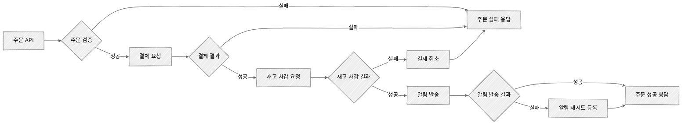

```mermaid
---
config:
  look: handDrawn
  theme: neutral
---
flowchart LR
    A["주문 API"] --> B{"주문 검증"}
    B -->|"성공"| C["결제 요청"]
    B -->|"실패"| X["주문 실패 응답"]

    C --> D{"결제 결과"}
    D -->|"성공"| E["재고 차감 요청"]
    D -->|"실패"| X

    E --> F{"재고 차감 결과"}
    F -->|"성공"| G["알림 발송"]
    F -->|"실패"| H["결제 취소"]
    H --> X

    G --> I{"알림 발송 결과"}
    I -->|"성공"| J["주문 성공 응답"]
    I -->|"실패"| K["알림 재시도 등록"]
    K --> J
```