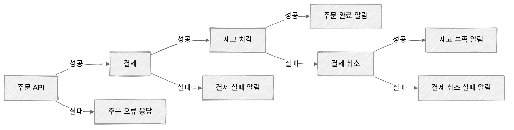

```mermaid
---
config:
  look: handDrawn
  theme: neutral
---
flowchart LR
    A["주문 API"] -->|"성공"| B["결제"]
    A -->|"실패"| F1["주문 오류 응답"]

    B -->|"성공"| C["재고 차감"]
    B -->|"실패"| F2["결제 실패 알림"]

    C -->|"성공"| D["주문 완료 알림"]
    C -->|"실패"| E["결제 취소"]
    
    E -->|"성공"| F3["재고 부족 알림"]
    E -->|"실패"| F4["결제 취소 실패 알림"]
```