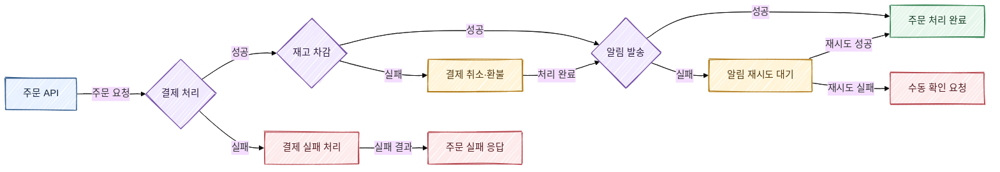

```mermaid
---
config:
  look: handDrawn
  theme: base
---
flowchart LR
    O["주문 API"] -->|"주문 요청"| P{"결제 처리"}

    P -->|"성공"| S{"재고 차감"}
    P -->|"실패"| PF["결제 실패 처리"]

    S -->|"성공"| N{"알림 발송"}
    S -->|"실패"| R["결제 취소·환불"]
    R -->|"처리 완료"| N

    N -->|"성공"| OK["주문 처리 완료"]
    N -->|"실패"| NR["알림 재시도 대기"]

    PF -->|"실패 결과"| FAIL["주문 실패 응답"]
    NR -->|"재시도 성공"| OK
    NR -->|"재시도 실패"| MANUAL["수동 확인 요청"]

    classDef entry fill:#E8F1FF,stroke:#315A8A,color:#14243A
    classDef process fill:#F1EAFE,stroke:#7651A8,color:#2D1E40
    classDef success fill:#E7F6EC,stroke:#398556,color:#173D25
    classDef failure fill:#FDEBEC,stroke:#B54850,color:#541D22
    classDef warning fill:#FFF4D8,stroke:#B07A18,color:#50360C

    class O entry
    class P,S,N process
    class OK success
    class PF,FAIL,MANUAL failure
    class R,NR warning
```