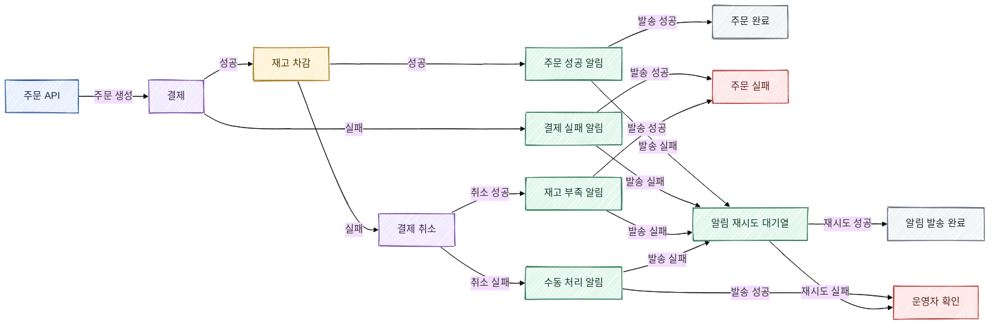

```mermaid
---
config:
  look: handDrawn
  theme: base
---
flowchart LR
    ORDER["주문 API"] -->|"주문 생성"| PAYMENT["결제"]

    PAYMENT -->|"성공"| STOCK["재고 차감"]
    PAYMENT -->|"실패"| PAY_FAIL_NOTICE["결제 실패 알림"]

    STOCK -->|"성공"| SUCCESS_NOTICE["주문 성공 알림"]
    STOCK -->|"실패"| CANCEL["결제 취소"]

    CANCEL -->|"취소 성공"| STOCK_FAIL_NOTICE["재고 부족 알림"]
    CANCEL -->|"취소 실패"| MANUAL_NOTICE["수동 처리 알림"]

    SUCCESS_NOTICE -->|"발송 성공"| DONE["주문 완료"]
    PAY_FAIL_NOTICE -->|"발송 성공"| FAILED["주문 실패"]
    STOCK_FAIL_NOTICE -->|"발송 성공"| FAILED
    MANUAL_NOTICE -->|"발송 성공"| REVIEW["운영자 확인"]

    SUCCESS_NOTICE -->|"발송 실패"| RETRY["알림 재시도 대기열"]
    PAY_FAIL_NOTICE -->|"발송 실패"| RETRY
    STOCK_FAIL_NOTICE -->|"발송 실패"| RETRY
    MANUAL_NOTICE -->|"발송 실패"| RETRY

    RETRY -->|"재시도 성공"| NOTICE_DONE["알림 발송 완료"]
    RETRY -->|"재시도 실패"| REVIEW

    classDef api fill:#E8F0FE,stroke:#315E9E,color:#172B4D
    classDef payment fill:#F2EAFE,stroke:#7651A8,color:#34234F
    classDef stock fill:#FFF3D6,stroke:#A87318,color:#4D3508
    classDef notice fill:#E4F7EE,stroke:#347A5A,color:#173D2C
    classDef failure fill:#FDE8E7,stroke:#B94A48,color:#5D2322
    classDef terminal fill:#F3F4F6,stroke:#606A78,color:#24292F

    class ORDER api
    class PAYMENT,CANCEL payment
    class STOCK stock
    class SUCCESS_NOTICE,PAY_FAIL_NOTICE,STOCK_FAIL_NOTICE,MANUAL_NOTICE,RETRY notice
    class FAILED,REVIEW failure
    class DONE,NOTICE_DONE terminal
```