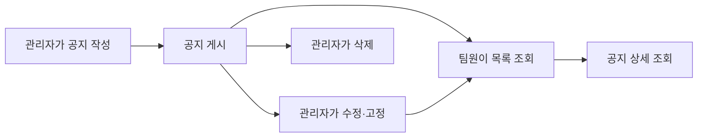

# 신규 팀 공지 기능 PRD

## 1. 적용 범위

| 항목 | 적용 | 근거 |
|---|---|---|
| 화면·경로 정의 | Required | 공지 목록·상세·작성 화면이 필요함 |
| 화면 상태 정의 | Required | 빈 목록, 로딩, 오류 상태가 사용자에게 노출됨 |
| 사용자 흐름 | Required | 작성 → 게시 → 조회 → 수정/삭제의 생명주기가 존재함 |
| 수치형 비기능 요구사항 | N/A | 트래픽 및 성능 목표 근거가 아직 없음 |

## 2. 배경과 문제

팀의 주요 안내가 메신저 대화에 섞여 구성원이 중요한 정보를 놓치거나, 과거 공지를 다시 찾기 어렵다. 팀 단위로 공지를 작성하고 지속적으로 열람할 수 있는 공식 공간이 필요하다.

## 3. 목표

- 팀 관리자가 공지를 작성·수정·삭제할 수 있다.
- 팀원이 공지 목록과 상세 내용을 확인할 수 있다.
- 중요한 공지를 목록 상단에 고정할 수 있다.
- 다른 팀의 공지에는 접근할 수 없다.

## 4. 제외 범위

- 댓글과 이모지 반응
- 예약 게시
- 읽음 확인 및 미열람자 관리
- 이메일·푸시·메신저 알림
- 파일 첨부
- 전사 공지

## 5. 사용자와 권한

| 역할 | 권한 |
|---|---|
| 팀 관리자 | 공지 작성, 수정, 삭제, 상단 고정, 조회 |
| 팀원 | 소속 팀 공지 조회 |
| 비소속 사용자 | 접근 불가 |

## 6. 기능 요구사항

| ID | 요구사항 | 우선순위 |
|---|---|---|
| FR-01 | 팀원은 최신순으로 공지 목록을 조회할 수 있다. | Must |
| FR-02 | 고정된 공지는 일반 공지보다 상단에 표시된다. | Must |
| FR-03 | 팀원은 공지 제목, 본문, 작성자, 게시·수정 일시를 확인할 수 있다. | Must |
| FR-04 | 팀 관리자는 제목과 본문을 입력해 공지를 게시할 수 있다. | Must |
| FR-05 | 팀 관리자는 소속 팀 공지를 수정하거나 삭제할 수 있다. | Must |
| FR-06 | 팀 관리자는 공지의 고정 여부를 변경할 수 있다. | Should |
| FR-07 | 삭제 전 사용자에게 확인 절차를 제공한다. | Must |
| FR-08 | 권한이 없거나 존재하지 않는 공지에 접근하면 내용을 노출하지 않는다. | Must |

## 7. 화면

- `/teams/{teamId}/notices`: 공지 목록
- `/teams/{teamId}/notices/{noticeId}`: 공지 상세
- `/teams/{teamId}/notices/new`: 공지 작성
- `/teams/{teamId}/notices/{noticeId}/edit`: 공지 수정

실제 경로는 기존 제품의 라우팅 규칙에 맞춰 조정한다.

## 8. 주요 화면 상태

| 화면 | 빈 상태 | 로딩 | 오류 | 성공 | 복구 |
|---|---|---|---|---|---|
| 목록 | “등록된 공지가 없습니다” | 로딩 표시 | 조회 실패 안내 | 공지 목록 표시 | 재시도 |
| 상세 | 해당 없음 | 로딩 표시 | 미존재·권한 오류 안내 | 공지 내용 표시 | 목록 이동 |
| 작성·수정 | 빈 입력 폼 | 저장 중 표시 | 저장 실패 및 입력값 유지 | 저장 후 상세 이동 | 재시도 |

## 9. 사용자 흐름

## 10. 권한 및 데이터 경계

- 모든 조회와 변경 요청에서 서버가 팀 소속 및 역할을 검증해야 한다.
- 화면에서 버튼을 숨기는 것만으로 권한을 통제하지 않는다.
- 사용자는 자신이 속한 팀의 공지만 조회할 수 있다.
- 관리자는 자신이 관리하는 팀의 공지만 변경할 수 있다.
- 공지 ID를 직접 조작해도 다른 팀의 공지 내용이 노출되어서는 안 된다.

## 11. 비기능 요구사항

- 목록 및 상세 조회 성능을 측정할 수 있어야 한다.
- 성능 목표치는 예상 사용량 확인 후 제품·개발 담당자가 개발 착수 전에 결정한다.
- 작성·수정·삭제 실패 시 중복 저장이나 입력 내용 유실을 방지해야 한다.
- 제목과 본문은 서버에서도 유효성 검사 및 안전한 출력 처리를 수행한다.

## 12. 인수 조건

| ID | 연결 요구사항 | Given | When | Then | 검증 |
|---|---|---|---|---|---|
| AC-01 | FR-01, FR-02 | 일반·고정 공지가 존재할 때 | 팀원이 목록을 열면 | 고정 공지가 상단에, 나머지는 최신순으로 표시된다 | 통합 테스트 |
| AC-02 | FR-03 | 공지가 존재할 때 | 팀원이 상세를 열면 | 제목, 본문, 작성자, 일시가 표시된다 | UI 테스트 |
| AC-03 | FR-04 | 팀 관리자가 유효한 내용을 입력했을 때 | 게시를 실행하면 | 공지가 저장되고 상세 화면으로 이동한다 | 통합 테스트 |
| AC-04 | FR-05, FR-07 | 관리자가 삭제를 선택했을 때 | 확인 절차를 완료하면 | 공지가 삭제되어 더 이상 조회되지 않는다 | 통합 테스트 |
| AC-05 | FR-06 | 관리자가 고정 여부를 변경하면 | 목록을 다시 조회했을 때 | 변경된 우선순위가 반영된다 | 통합 테스트 |
| AC-06 | FR-08 | 비소속 사용자가 공지에 접근할 때 | 조회 또는 변경을 요청하면 | 서버가 거부하며 공지 내용을 노출하지 않는다 | API 권한 테스트 |

## 13. 가정 및 미결정 사항

가정:

- 최초 버전은 텍스트 기반 제목과 본문만 지원한다.
- 팀 관리자만 공지를 관리한다.
- 공지는 게시 즉시 팀원에게 공개된다.

미결정:

- 제목·본문 글자 수 제한
- 동시에 고정할 수 있는 공지 수
- 공지 삭제를 영구 삭제로 할지 복구 가능한 삭제로 할지
- 신규 공지 알림을 후속 버전에 포함할지

## 14. 위험과 대응

- 중요한 공지가 지나치게 많이 고정될 수 있음 → 고정 개수 정책 결정
- 팀 간 데이터가 노출될 수 있음 → 모든 API에 팀 소속 기반 서버 권한 검사 적용
- 실수로 공지가 삭제될 수 있음 → 삭제 확인 및 복구 정책 검토
- 긴 본문으로 가독성이 저하될 수 있음 → 입력 제한과 본문 표시 규칙 결정

## 15. 출시 범위

| 단계 | 요구사항 | 완료 조건 |
|---|---|---|
| 1차 MVP | FR-01, FR-03, FR-04, FR-05, FR-07, FR-08 | 작성·조회·수정·삭제 및 권한 테스트 통과 |
| 1차 개선 | FR-02, FR-06 | 고정 공지 정렬과 권한 테스트 통과 |