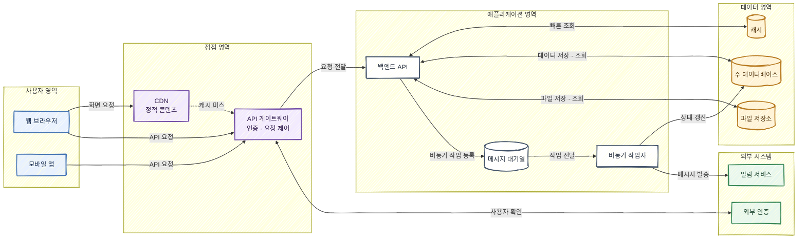

현재 프로젝트 정보가 없어, 범용 웹 서비스 아키텍처를 기준으로 구성했습니다. 작업 공간이 읽기 전용이고 Mermaid CLI가 없어 파일 저장과 SVG·PNG 렌더링 검증은 진행하지 못했습니다.



렌더링 명령은 다음과 같습니다.

```bash
mmdc -i architecture.mmd -o architecture.svg -b white
mmdc -i architecture.mmd -o architecture.png -b white -s 2
```