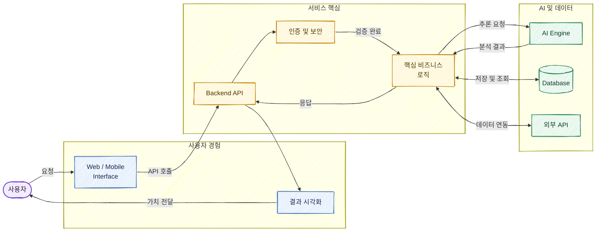

프로젝트 정보가 없어 Devpost에서 범용적으로 쓰기 좋은 “사용자 → 앱 → 백엔드 → AI·데이터 → 결과” 구조로 작성했습니다.

권장 방향은 `LR`이라 Devpost 본문에서 가로형 아키텍처 이미지로 잘 보입니다. 현재 작업공간이 읽기 전용이고 Mermaid CLI도 확인되지 않아 `.mmd`, SVG, PNG 파일 생성 및 시각 검증은 수행하지 못했습니다. 실제 서비스의 기능·기술 스택을 주시면 노드명을 프로젝트에 맞게 구체화할 수 있습니다.