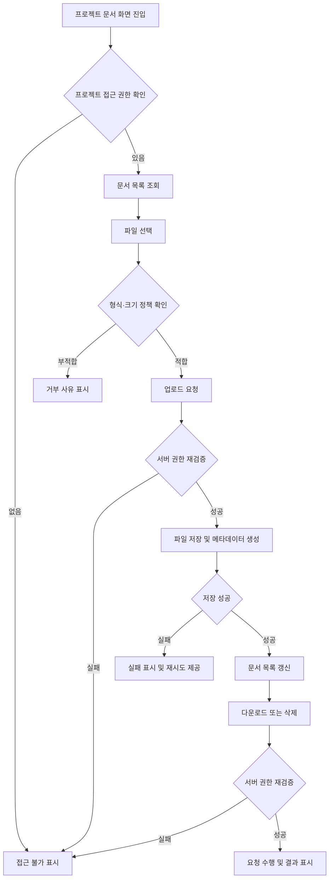

# 프로젝트별 문서 보관 PRD

## 1. 적용 범위

| 계약 항목 | 적용 | 근거 |
|---|---|---|
| 화면 및 경로 | Required | 사용자가 문서를 조회·업로드·관리하는 화면이 필요함 |
| 화면 상태 정의 | Required | 빈 목록, 업로드 중, 실패 등 사용자 노출 상태가 존재함 |
| 사용자·시스템 흐름 | Required | 파일 선택부터 저장, 권한 확인, 삭제까지 다단계 흐름임 |
| 권한 및 데이터 경계 | Required | 프로젝트 간 문서 노출을 서버에서 차단해야 함 |
| 수치형 비기능 요구사항 | N/A | 파일 크기, 보관 기간, 성능 목표에 대한 사업 근거가 아직 없음 |
| 규제·컴플라이언스 | N/A | 별도 보안 인증이나 법적 보관 의무가 제시되지 않음 |

## 2. 배경과 문제

프로젝트 진행 중 생성되는 기획서, 계약서, 이미지, 회의 자료 등이 메신저나 개인 저장소에 분산되어 있다. 이로 인해 프로젝트 참여자가 최신 자료를 찾기 어렵고, 프로젝트가 종료되거나 담당자가 변경될 때 자료가 유실될 수 있다.

각 프로젝트 내부에 전용 문서 보관 공간을 제공하여, 참여자가 해당 프로젝트의 자료를 한곳에서 업로드하고 조회할 수 있도록 한다.

## 3. 목표

- 프로젝트별로 독립된 문서 보관 공간을 제공한다.
- 프로젝트 참여자가 필요한 문서를 업로드하고 내려받을 수 있게 한다.
- 문서명, 등록자, 등록 시각 등 기본 정보를 제공한다.
- 프로젝트 권한에 따라 문서 접근과 관리 기능을 제한한다.
- 문서 처리 실패 시 원인과 복구 방법을 사용자에게 안내한다.

## 4. 목표가 아닌 것

MVP에서는 다음을 제공하지 않는다.

- 문서 본문 편집
- 공동 편집 및 댓글
- 파일 버전 관리
- 폴더 또는 태그 분류
- 문서 본문 검색
- 외부 사용자 공개 링크
- 프로젝트 간 문서 복사·이동
- 문서 승인 또는 결재
- 악성 파일의 완전한 탐지 보장

## 5. 사용자, 역할 및 권한

| 역할 | 목록 조회 | 다운로드 | 업로드 | 본인 문서 삭제 | 모든 문서 삭제 |
|---|---:|---:|---:|---:|---:|
| 프로젝트 관리자 | 가능 | 가능 | 가능 | 가능 | 가능 |
| 프로젝트 구성원 | 가능 | 가능 | 가능 | 가능 | 불가 |
| 프로젝트 비참여자 | 불가 | 불가 | 불가 | 불가 | 불가 |
| 시스템 관리자 | 정책 결정 필요 | 정책 결정 필요 | 정책 결정 필요 | 정책 결정 필요 | 정책 결정 필요 |

프로젝트 구성원의 삭제 범위는 초기 가정이며, 운영 정책에 따라 “삭제 불가”로 변경할 수 있다.

## 6. 기능 요구사항

| ID | 요구사항 | 우선순위 |
|---|---|---|
| FR-01 | 사용자는 접근 권한이 있는 프로젝트의 문서 목록을 조회할 수 있어야 한다. | Must |
| FR-02 | 목록에는 파일명, 파일 크기, 등록자, 등록 시각이 표시되어야 한다. | Must |
| FR-03 | 사용자는 로컬 파일을 선택하여 현재 프로젝트에 업로드할 수 있어야 한다. | Must |
| FR-04 | 업로드 전 허용되지 않는 파일 형식이나 크기를 확인하고 사용자에게 사유를 알려야 한다. | Must |
| FR-05 | 업로드 중인 파일별 진행 상태를 표시해야 한다. | Should |
| FR-06 | 업로드가 완료된 문서는 목록에서 확인할 수 있어야 한다. | Must |
| FR-07 | 사용자는 권한이 있는 문서를 원래 파일명으로 내려받을 수 있어야 한다. | Must |
| FR-08 | 사용자는 권한 범위 내에서 문서를 삭제할 수 있어야 한다. | Must |
| FR-09 | 삭제 전 파일명과 삭제 결과를 안내하는 확인 절차가 있어야 한다. | Must |
| FR-10 | 동일한 프로젝트에 같은 이름의 파일이 존재할 때 시스템은 충돌 정책에 따라 처리해야 한다. | Must |
| FR-11 | 파일 저장 실패, 네트워크 실패 또는 권한 상실 시 실패 원인을 안내하고 재시도 경로를 제공해야 한다. | Must |
| FR-12 | 프로젝트가 삭제되거나 보관 상태로 전환될 때 문서를 어떻게 처리할지 정해진 수명주기 정책을 적용해야 한다. | Must |
| FR-13 | 업로드·다운로드·삭제 요청마다 서버에서 프로젝트 접근 권한을 검증해야 한다. | Must |
| FR-14 | 파일 메타데이터와 저장 객체는 단일 프로젝트에 귀속되어야 한다. | Must |
| FR-15 | 삭제·업로드 등 주요 문서 변경 행위에는 수행자, 대상, 시각을 확인할 수 있는 감사 기록이 남아야 한다. | Should |

## 7. 화면 및 경로

구체적인 URL 구조는 기존 제품 라우팅 규칙을 따른다.

### 프로젝트 문서 화면

예시 경로: `/projects/:projectId/documents`

화면 구성:

- 프로젝트명과 “문서” 메뉴
- 파일 업로드 버튼 또는 드롭 영역
- 문서 목록
- 파일별 다운로드 및 삭제 액션
- 업로드 진행 및 실패 상태
- 빈 목록 안내

별도의 문서 상세 화면은 MVP에 포함하지 않는다.

## 8. 화면 상태

| 영역 | Empty | Loading | Error | Success | Recovery |
|---|---|---|---|---|---|
| 문서 목록 | 등록된 문서가 없다는 안내와 업로드 액션 표시 | 목록 로딩 표시 | 오류 메시지와 다시 시도 표시 | 문서와 메타데이터 표시 | 목록 다시 불러오기 |
| 파일 업로드 | 선택된 파일 없음 | 파일별 진행 상태 표시 | 실패 사유 표시 | 완료 표시 후 목록 반영 | 실패 파일만 재시도 |
| 다운로드 | 해당 없음 | 다운로드 준비 상태 표시 | 권한·파일 부재·통신 오류 안내 | 브라우저 다운로드 시작 | 다시 다운로드 |
| 삭제 | 해당 없음 | 중복 실행 방지 | 실패 사유 안내 | 목록에서 제거 | 다시 시도 또는 취소 |
| 접근 권한 | 해당 없음 | 권한 확인 중 | 접근 불가 안내 | 문서 화면 표시 | 프로젝트 화면으로 이동 |

## 9. 사용자 및 시스템 흐름

## 10. 권한 및 데이터 경계

- 모든 문서는 정확히 하나의 프로젝트에 귀속되어야 한다.
- 사용자가 전달한 `projectId`나 문서 ID만 신뢰해서는 안 된다.
- 서버는 목록 조회, 업로드, 다운로드, 삭제 요청마다 현재 사용자의 프로젝트 참여 여부와 역할을 확인해야 한다.
- 다운로드 주소를 알고 있더라도 권한 없는 사용자는 파일을 받을 수 없어야 한다.
- 저장소 객체가 직접 공개되는 영구 URL을 제공해서는 안 된다.
- 임시 다운로드 주소를 사용한다면 권한 확인 후 제한된 수명으로 발급해야 한다.
- 다른 프로젝트의 문서 ID를 요청하면 문서 내용이나 메타데이터가 노출되지 않아야 한다.
- 프로젝트에서 탈퇴하거나 제외된 사용자는 이후 해당 문서에 접근할 수 없어야 한다.
- DB 메타데이터 생성과 파일 저장 중 하나만 성공한 불완전 상태를 감지하고 정리할 수 있어야 한다.
- 삭제 정책이 논리 삭제인지 즉시 물리 삭제인지는 확정이 필요하다.

## 11. 비기능 요구사항

수치는 기술·운영 검증 후 확정한다.

- 보안: 전송 중 파일과 메타데이터를 보호해야 한다.
- 무결성: 다운로드된 파일은 업로드가 완료된 파일과 동일해야 한다.
- 안정성: 업로드 실패가 기존 문서 목록이나 다른 사용자의 작업에 영향을 주지 않아야 한다.
- 관측성: 업로드, 다운로드, 삭제 실패를 운영자가 파일 내용 노출 없이 추적할 수 있어야 한다.
- 접근성: 업로드와 파일별 액션을 키보드로 조작할 수 있고 상태 변경이 보조 기술에 전달되어야 한다.
- 파일 정책: 최대 파일 크기, 허용·차단 확장자, 프로젝트별 저장 한도를 출시 전에 제품·보안·인프라 담당자가 확정한다.
- 성능: 목록 조회 시간과 업로드 성공률을 측정할 수 있어야 하며 목표치는 예상 사용량 확인 후 결정한다.
- 보안 처리: 악성코드 검사 도입 여부가 확정될 때까지 실행 파일 등 고위험 형식의 허용 여부를 보수적으로 결정한다.

## 12. 인수 조건

| ID | 연결 요구사항 | Given | When | Then | 검증 |
|---|---|---|---|---|---|
| AC-01 | FR-01, FR-02 | 프로젝트 구성원이 문서 화면에 접근함 | 목록 조회가 완료됨 | 해당 프로젝트 문서와 기본 정보만 표시됨 | API·UI 통합 테스트 |
| AC-02 | FR-03, FR-06 | 업로드 가능한 파일이 선택됨 | 업로드가 성공함 | 문서가 현재 프로젝트 목록에 표시됨 | 통합 테스트 |
| AC-03 | FR-04 | 정책에 맞지 않는 파일이 선택됨 | 업로드를 시도함 | 저장되지 않고 거부 사유가 표시됨 | 경계값 테스트 |
| AC-04 | FR-07, FR-13 | 프로젝트 구성원이 문서를 선택함 | 다운로드를 요청함 | 권한 확인 후 원래 파일명으로 다운로드됨 | API·브라우저 테스트 |
| AC-05 | FR-08, FR-09 | 구성원이 다른 사용자의 문서를 보고 있음 | 삭제를 요청함 | 삭제가 거부됨 | 권한 테스트 |
| AC-06 | FR-08, FR-09 | 프로젝트 관리자가 문서를 선택함 | 확인 후 삭제함 | 문서가 더 이상 목록이나 다운로드에서 제공되지 않음 | 통합 테스트 |
| AC-07 | FR-11 | 업로드 중 저장 또는 통신 오류가 발생함 | 요청이 실패함 | 실패 상태와 재시도 액션이 표시되고 불완전 문서는 목록에 노출되지 않음 | 장애 주입 테스트 |
| AC-08 | FR-13, FR-14 | 비참여자가 문서 ID나 다운로드 주소를 알고 있음 | 조회 또는 다운로드를 요청함 | 파일과 메타데이터가 노출되지 않음 | 서버 권한 테스트 |
| AC-09 | FR-13 | 사용자가 프로젝트에서 제외됨 | 기존 주소로 다시 접근함 | 이후 모든 문서 요청이 거부됨 | 권한 변경 테스트 |
| AC-10 | FR-10 | 같은 이름의 문서가 이미 존재함 | 같은 이름으로 다시 업로드함 | 확정된 충돌 정책대로 처리되고 기존 파일이 묵시적으로 덮어써지지 않음 | 통합 테스트 |
| AC-11 | FR-12 | 프로젝트 상태가 삭제 또는 보관으로 변경됨 | 문서에 접근함 | 확정된 수명주기 정책대로 조회·다운로드·삭제가 제한됨 | 수명주기 테스트 |
| AC-12 | FR-15 | 문서가 업로드되거나 삭제됨 | 운영자가 감사 기록을 확인함 | 수행자, 대상 문서, 행위, 시각을 식별할 수 있음 | 로그 검증 |

## 13. 가정 및 미결정 사항

### MVP 가정

- 기존에 프로젝트와 프로젝트 구성원·관리자 역할이 존재한다.
- 구성원은 문서를 업로드하고 자신의 문서만 삭제할 수 있다.
- 관리자는 프로젝트 내 모든 문서를 삭제할 수 있다.
- 문서는 파일 단위의 평면 목록으로 관리한다.
- 파일 교체나 버전 추가 대신 각각 별도 업로드로 취급한다.

### 출시 전 반드시 결정할 사항

1. 동일 파일명 처리: 업로드 거부, 자동 이름 변경, 또는 중복 허용
2. 파일당 최대 크기와 프로젝트별 저장 한도
3. 허용·차단 파일 형식과 악성코드 검사 방식
4. 프로젝트 보관·삭제 시 문서 접근 및 실제 삭제 시점
5. 삭제 문서 복구 가능 여부와 보관 기간
6. 시스템 관리자의 문서 접근 범위
7. 문서 목록 정렬·페이지네이션 기준
8. 감사 기록을 MVP 필수 범위에 포함할지 여부

## 14. 위험과 완화 방안

| 위험 | 영향 | 완화 |
|---|---|---|
| 프로젝트 간 권한 누락 | 기밀 문서 유출 | 모든 문서 API에서 서버 권한 검증 및 교차 프로젝트 테스트 |
| 악성 파일 업로드 | 사용자·운영 환경 피해 | 고위험 형식 제한, 다운로드 헤더 통제, 검사 정책 확정 |
| 저장소와 DB 불일치 | 유령 문서 또는 고아 파일 발생 | 실패 보상 처리와 주기적 정합성 점검 |
| 대용량 파일로 비용 증가 | 저장·전송 비용 급증 | 파일·프로젝트 한도와 운영 지표 설정 |
| 실수로 문서 삭제 | 자료 유실 | 삭제 확인, 역할 제한, 복구 정책 결정 |
| 파일명을 통한 스크립트·경로 공격 | 보안 취약점 | 표시값 이스케이프, 저장 키와 원본 파일명 분리 |
| 동시 업로드 이름 충돌 | 파일 오인 또는 덮어쓰기 | 서버에서 원자적으로 충돌 정책 적용 |

## 15. 전달 계획

| 단계 | 포함 요구사항 | 검증 가능한 완료 조건 |
|---|---|---|
| 1. 권한 및 데이터 기반 | FR-13, FR-14 | 프로젝트 간 접근 차단 자동 테스트가 통과하고 문서가 프로젝트에 귀속됨 |
| 2. 기본 보관 기능 | FR-01~FR-04, FR-06, FR-07 | 권한 있는 사용자가 목록 조회, 업로드, 다운로드를 완료함 |
| 3. 관리 및 예외 처리 | FR-08~FR-12 | 삭제, 중복 파일, 실패 복구, 프로젝트 수명주기 테스트가 통과함 |
| 4. 사용성 및 운영성 | FR-05, FR-15 | 업로드 상태와 감사 기록을 UI·운영 환경에서 확인할 수 있음 |

이 문서는 아이디어 단계의 정보만으로 작성했기 때문에, 위의 8가지 미결정 사항을 확정하면 바로 화면 정의와 API·데이터 모델 설계로 이어갈 수 있는 상태입니다. 별도 파일을 생성하지 않았으므로 PRD 검증기는 실행하지 않았습니다.