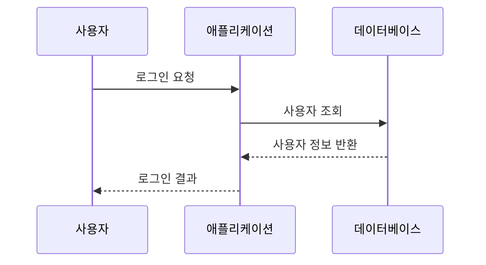
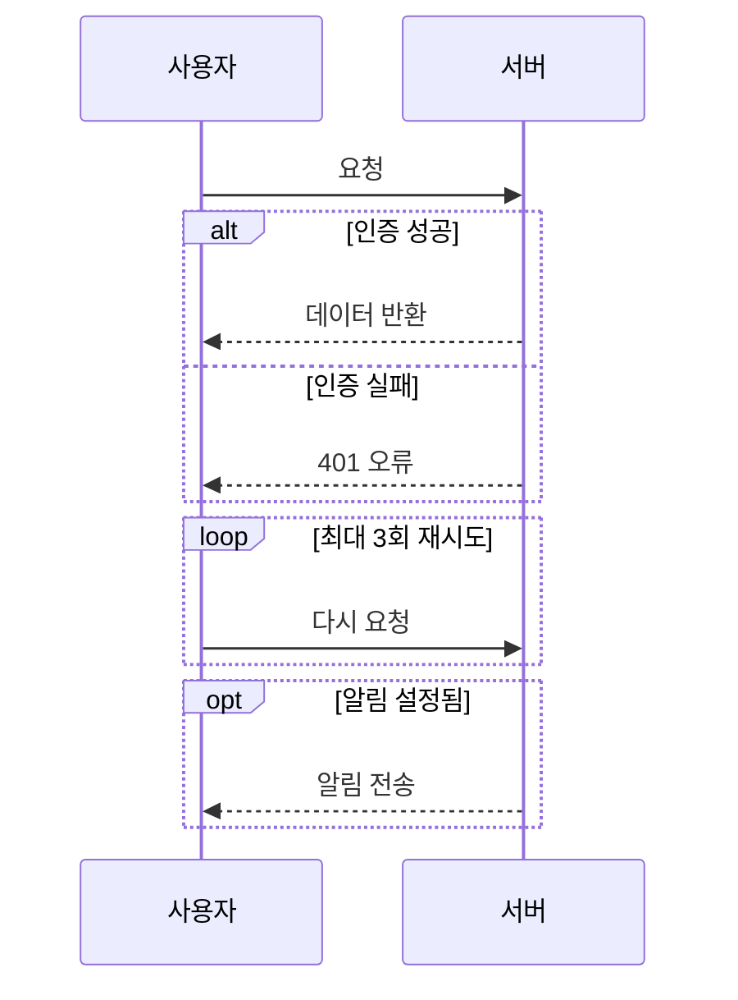
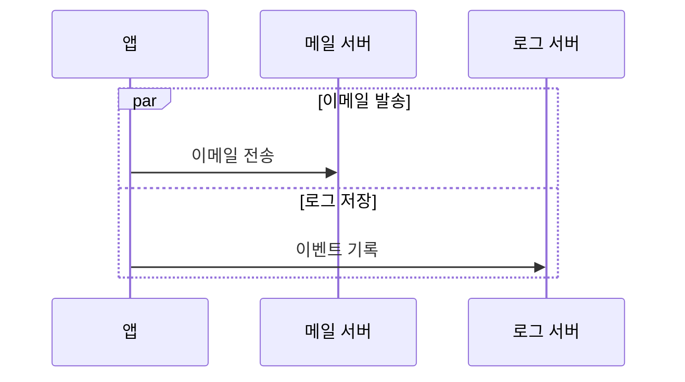

Mermaid 시퀀스 다이어그램은 참여자 간 메시지 흐름을 시간순으로 표현합니다. 기본 구조는 다음과 같습니다.

주요 문법:

- `sequenceDiagram`: 시퀀스 다이어그램 선언
- `participant A as 애플리케이션`: 참여자 정의
- `A->>B: 요청`: 실선 화살표 메시지
- `B-->>A: 응답`: 점선 화살표 메시지
- `activate A` / `deactivate A`: 활성화 구간 표시
- `A->>+B` / `B-->>-A`: 메시지와 동시에 활성화/비활성화
- `Note right of A: 설명`: 참여자 옆 메모
- `Note over A,B: 공통 설명`: 여러 참여자 위 메모

조건 분기는 `alt`, 반복은 `loop`, 선택적 흐름은 `opt`로 표현합니다.

병렬 처리는 `par`를 사용합니다.

화살표는 보통 다음처럼 구분합니다.

- `->>`: 실선 + 화살촉
- `-->>`: 점선 + 화살촉
- `->`: 실선
- `-->`: 점선
- `-x` / `--x`: 메시지가 대상에서 종료됨
- `-)` / `--)`: 비동기 메시지 표현

실무에서는 참여자를 먼저 명시하고, 요청은 실선(`->>`), 응답은 점선(`-->>`)으로 통일하면 읽기 쉽습니다.