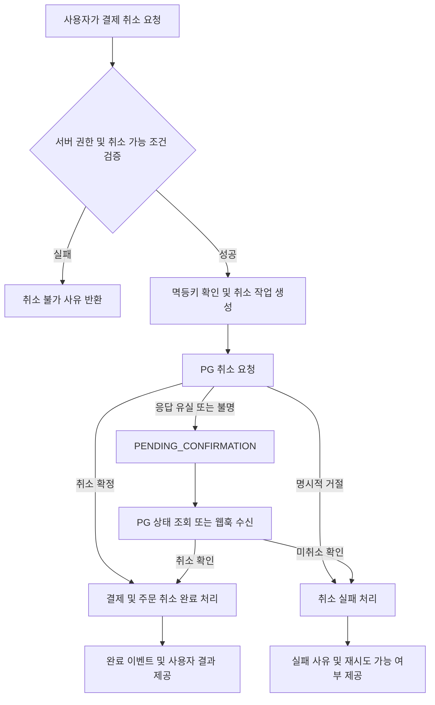

# 결제 취소 PRD

## 1. Applicability

| Contract | 적용 여부 | 근거 |
|---|---|---|
| 문제·목표·비목표 | Required | 기능 범위와 성공 조건을 정의해야 함 |
| 사용자·역할·권한 | Required | 주문 소유권과 운영자 권한 검증이 필요함 |
| 기능 요구사항 | Required | 취소 가능 조건, 처리 상태 및 실패 정책이 필요함 |
| 화면·경로 | Required | 고객 및 운영자가 취소 상태를 확인해야 함 |
| 상태 매트릭스 | Required | 취소 요청부터 성공·실패까지 비동기 상태가 존재함 |
| 사용자·시스템 흐름 | Required | 서비스, 결제대행사(PG), 웹훅이 참여하는 다단계 흐름임 |
| 인가·데이터 경계 | Required | 타인의 결제 취소 및 중복 환급을 방지해야 함 |
| 비기능 요구사항 | Required | 멱등성, 감사 추적, 데이터 정합성이 필요함 |
| Acceptance Criteria | Required | 구현과 QA 완료 여부를 관찰 가능한 기준으로 검증해야 함 |
| 정량 SLA | N/A | 사업·PG 운영 기준이 제공되지 않아 수치를 임의로 정의하지 않음 |
| 부분 취소 | N/A | 본 문서의 MVP는 결제 전액 취소만 대상으로 가정함 |

## 2. 배경 및 문제

현재 결제가 완료된 주문을 고객이나 운영자가 일관된 절차로 취소하고, 처리 결과를 확인할 수 있는 표준 기능이 필요하다.

결제 취소는 주문 상태 변경만으로 완료되지 않는다. PG 취소 결과와 내부 결제 원장, 주문 상태가 일치해야 하며, 중복 요청·웹훅 지연·네트워크 오류가 발생해도 이중 환급이나 잘못된 취소 완료 표시가 발생하지 않아야 한다.

## 3. 목표

- 취소 가능한 결제를 고객 또는 권한 있는 운영자가 전액 취소할 수 있다.
- 모든 취소 요청에 대해 진행 중, 성공, 실패 상태를 확인할 수 있다.
- 반복 요청이나 재시도가 발생해도 한 결제에 중복 취소가 실행되지 않는다.
- PG 결과와 내부 결제·주문 상태의 정합성을 유지한다.
- 취소 요청자, 사유, 처리 결과를 감사 가능한 형태로 기록한다.

## 4. 비목표

- 상품 단위 또는 금액 단위의 부분 취소
- 교환 및 반품 물류 처리
- 현금·계좌이체 등 PG 외부에서 진행되는 수동 환급
- 취소 수수료 및 위약금 계산
- 카드사별 환급 완료일까지 보장하는 기능
- 취소 가능 기간 등 구체적인 사업 정책 확정

## 5. 사용자, 역할 및 권한

| 역할 | 권한 |
|---|---|
| 고객 | 자신이 소유한 주문의 취소 가능 여부 조회 및 취소 요청 |
| 고객지원 운영자 | 권한이 부여된 상점·테넌트 내 결제 조회 및 취소 요청 |
| 관리자 | 운영자 권한 관리, 취소 내역 및 감사 기록 조회 |
| 시스템 | PG 취소 요청, 결과 수신, 상태 갱신 및 정합성 복구 |

화면에서 버튼을 숨기는 것은 인가 수단으로 인정하지 않는다. 모든 조회와 취소 요청은 서버에서 사용자, 주문 소유권, 역할 및 테넌트 경계를 검증해야 한다.

## 6. 기능 요구사항

| ID | 요구사항 | 우선순위 |
|---|---|---|
| FR-001 | 시스템은 결제 상태와 취소 정책을 기준으로 취소 가능 여부를 반환해야 한다. | Must |
| FR-002 | 고객은 자신이 소유한 주문의 결제만 취소 요청할 수 있어야 한다. | Must |
| FR-003 | 운영자는 권한이 부여된 테넌트 또는 상점의 결제만 취소할 수 있어야 한다. | Must |
| FR-004 | 시스템은 취소 요청 시 사유를 수집하고 요청자·요청 시각과 함께 저장해야 한다. | Must |
| FR-005 | 시스템은 동일 결제에 대한 취소 요청을 멱등하게 처리해야 한다. | Must |
| FR-006 | 유효한 요청이 접수되면 취소 상태를 `REQUESTED` 또는 `PROCESSING`으로 기록하고 PG 취소를 요청해야 한다. | Must |
| FR-007 | PG가 취소를 확정한 경우에만 결제와 주문을 취소 완료 상태로 변경해야 한다. | Must |
| FR-008 | PG가 취소를 거절하면 실패 사유를 기록하고 사용자에게 재시도 가능 여부를 안내해야 한다. | Must |
| FR-009 | 응답 유실 또는 결과 불명 상태에서는 취소를 실패로 단정하지 않고 `PENDING_CONFIRMATION` 상태로 관리해야 한다. | Must |
| FR-010 | 시스템은 PG 웹훅 또는 상태 조회 결과를 검증한 후 내부 상태에 반영해야 한다. | Must |
| FR-011 | 이미 취소된 결제에 대한 재요청은 추가 PG 취소 없이 기존 성공 결과를 반환해야 한다. | Must |
| FR-012 | 취소 처리 중인 결제에는 새로운 결제 취소 작업을 중복 생성하지 않아야 한다. | Must |
| FR-013 | 고객과 운영자는 취소 상태, 취소 금액, 요청 시각 및 결과를 조회할 수 있어야 한다. | Must |
| FR-014 | 모든 상태 전이와 PG 요청·응답은 민감정보를 제외하고 감사 기록으로 남겨야 한다. | Must |
| FR-015 | 내부 상태와 PG 상태가 불일치하면 자동 또는 운영자 재확인 대상으로 식별해야 한다. | Should |
| FR-016 | 취소 완료 후 기존 주문 후속 처리에 필요한 내부 이벤트를 한 번만 발행해야 한다. | Should |

### 취소 가능 조건

다음 조건을 모두 충족할 때만 취소 요청을 허용한다.

- 결제가 승인 완료된 상태다.
- 결제가 이미 전액 취소되지 않았다.
- 동일 결제의 취소가 처리 중이지 않다.
- 주문이 사업 정책상 취소 가능한 상태다.
- 요청자가 주문 소유자이거나 적절한 운영 권한을 보유한다.
- PG가 해당 거래의 취소를 지원한다.

취소 불가능한 경우 시스템은 내부 정보나 PG 비밀정보를 노출하지 않는 범위에서 사유 코드를 반환한다.

## 7. 화면 및 경로

| 화면 | 주요 기능 |
|---|---|
| 주문 상세 | 취소 가능 여부, 취소 버튼, 처리 상태 및 결과 표시 |
| 취소 확인 | 취소 금액 확인, 사유 입력, 최종 확인 |
| 취소 결과 | 접수·처리 중·완료·실패 결과와 다음 행동 안내 |
| 운영자 결제 상세 | 결제 및 취소 이력 조회, 권한 기반 취소 요청 |
| 운영자 정합성 관리 | 결과 불명 또는 PG 불일치 건 조회 및 재확인 |

구체적인 URL 구조는 기존 주문·운영자 라우팅 규칙을 따른다.

## 8. 사용자 화면 상태

| 화면 | Empty | Loading | Error | Success | Recovery |
|---|---|---|---|---|---|
| 주문 상세 | 결제 정보 없음 안내 | 결제 상태 조회 표시 | 재조회 안내 | 취소 가능 여부 표시 | 새로고침 또는 문의 |
| 취소 확인 | 취소 대상 없음 | 요청 제출 중 | 검증·접수 오류 표시 | 접수 결과로 이동 | 입력 수정 또는 재조회 |
| 취소 결과 | 해당 이력 없음 | 최신 상태 확인 중 | 상태 조회 실패 | 처리 상태와 결과 표시 | 재조회 또는 고객지원 안내 |
| 운영자 정합성 관리 | 대상 없음 | 목록 조회 중 | 조회 오류 | 불일치 대상 표시 | 재조회 또는 PG 상태 확인 |

## 9. 사용자 및 시스템 흐름

## 10. 상태 모델

| 상태 | 의미 | 허용되는 다음 상태 |
|---|---|---|
| `REQUESTED` | 요청이 검증되어 접수됨 | `PROCESSING`, `REJECTED` |
| `PROCESSING` | PG 취소 요청 수행 중 | `SUCCEEDED`, `FAILED`, `PENDING_CONFIRMATION` |
| `PENDING_CONFIRMATION` | PG 처리 결과가 불명확함 | `SUCCEEDED`, `FAILED` |
| `SUCCEEDED` | PG 취소가 확인되고 내부 반영이 완료됨 | 없음 |
| `FAILED` | PG가 미취소 상태임이 확인됨 | 정책에 따른 새 요청 |
| `REJECTED` | 권한 또는 취소 조건 검증에 실패함 | 없음 |

`SUCCEEDED`는 최종 상태다. 상태 전이는 이전 상태와 함께 원자적으로 검증하여 역행이나 중복 완료 처리를 방지한다.

## 11. 인가 및 데이터 경계

- 서버는 인증된 사용자 ID와 주문 소유자 ID를 비교해야 한다.
- 운영자 요청은 역할뿐 아니라 대상 테넌트·상점 접근 권한도 확인해야 한다.
- 클라이언트가 전달한 결제 금액, 사용자 ID 또는 PG 거래 상태를 신뢰하지 않는다.
- 취소 금액은 서버가 저장된 원거래 정보를 기준으로 계산한다.
- PG 웹훅은 서명, 출처 검증 또는 PG가 제공하는 동등한 검증 절차를 통과해야 한다.
- PG 거래키, 카드정보, 인증정보 및 내부 오류 상세는 사용자 응답에 노출하지 않는다.
- 감사 기록 조회 역시 역할과 테넌트 경계를 적용한다.

## 12. 비기능 요구사항

| ID | 요구사항 |
|---|---|
| NFR-001 | 취소 API는 멱등키 또는 동일한 효과의 서버 측 중복 방지 장치를 제공해야 한다. |
| NFR-002 | 결제 상태, 주문 상태 및 취소 원장 갱신은 정합성이 보장되는 트랜잭션 경계에서 처리해야 한다. |
| NFR-003 | 외부 호출 실패 시 무제한 재시도를 금지하고, 재시도 가능 오류와 영구 오류를 구분해야 한다. |
| NFR-004 | 로그에는 카드번호, 인증 토큰, PG 비밀키 등 결제 민감정보를 기록하지 않아야 한다. |
| NFR-005 | 요청 ID, 결제 ID, 취소 ID를 이용해 취소 처리 과정을 추적할 수 있어야 한다. |
| NFR-006 | 처리 시간, 실패율, 결과 불명 건수, PG·내부 상태 불일치 건수를 관측할 수 있어야 한다. |

정량 임계값과 경보 기준은 출시 전 결제 운영 책임자와 엔지니어링 책임자가 결정한다.

## 13. Acceptance Criteria

| ID | 관련 요구사항 | Given | When | Then | 검증 방법 |
|---|---|---|---|---|---|
| AC-001 | FR-001, FR-002 | 고객이 소유한 취소 가능 주문이 있을 때 | 고객이 주문 상세를 조회하면 | 취소 가능 상태와 전액 취소 금액이 표시된다. | API·UI 통합 테스트 |
| AC-002 | FR-002 | 고객 A가 고객 B의 주문 ID를 알고 있을 때 | 고객 A가 취소 API를 호출하면 | 요청이 거부되고 PG 취소 요청은 생성되지 않는다. | 인가 통합 테스트 및 PG mock 검증 |
| AC-003 | FR-003 | 운영자에게 대상 상점 권한이 없을 때 | 운영자가 취소를 요청하면 | 요청이 거부되고 결제 상태는 변경되지 않는다. | 권한 통합 테스트 |
| AC-004 | FR-001 | 이미 취소됐거나 정책상 취소 불가능한 주문일 때 | 취소 요청을 제출하면 | 취소 불가 코드가 반환되고 취소 작업이 생성되지 않는다. | API 테스트 및 DB 검증 |
| AC-005 | FR-004, FR-006 | 유효한 결제와 취소 사유가 있을 때 | 사용자가 취소를 확정하면 | 요청자, 사유, 시각을 포함한 취소 작업이 생성된다. | DB 및 감사 로그 검증 |
| AC-006 | FR-005, FR-011 | 동일 멱등키로 같은 취소 요청을 반복할 때 | 요청이 두 번 이상 수신되면 | 단일 취소 작업과 동일한 응답이 반환되고 PG 호출은 최대 한 번 발생한다. | 동시성 통합 테스트 |
| AC-007 | FR-012 | 결제가 `PROCESSING` 상태일 때 | 새로운 취소 요청이 들어오면 | 새 작업을 만들지 않고 현재 처리 상태를 반환한다. | 동시 요청 테스트 |
| AC-008 | FR-007 | PG가 전액 취소 성공을 확정했을 때 | 결과가 처리되면 | 결제·주문·취소 작업이 완료 상태가 되고 취소 금액은 원결제 금액과 일치한다. | PG mock 및 DB 통합 테스트 |
| AC-009 | FR-008 | PG가 취소를 명시적으로 거절했을 때 | 응답이 처리되면 | 취소 작업은 실패 상태가 되고 주문은 취소 완료로 표시되지 않는다. | 오류 응답 통합 테스트 |
| AC-010 | FR-009 | PG 요청 후 타임아웃이 발생했을 때 | 즉시 결과를 확정할 수 없으면 | 상태가 `PENDING_CONFIRMATION`으로 저장되고 실패나 성공으로 단정되지 않는다. | 타임아웃 통합 테스트 |
| AC-011 | FR-010 | 유효한 PG 웹훅이 도착했을 때 | 웹훅 거래가 내부 결제와 일치하면 | 허용된 상태 전이에 따라 취소 결과가 한 번 반영된다. | 웹훅 통합 테스트 |
| AC-012 | FR-010 | 서명이 잘못됐거나 거래가 일치하지 않는 웹훅이 도착했을 때 | 웹훅을 처리하면 | 요청이 거부되고 결제·주문 상태는 변경되지 않는다. | 보안 테스트 |
| AC-013 | FR-011 | 이미 `SUCCEEDED`인 결제에 취소 요청이 들어올 때 | 요청을 처리하면 | 기존 성공 결과를 반환하고 추가 PG 호출과 원장 변경이 발생하지 않는다. | 회귀 테스트 |
| AC-014 | FR-013 | 취소가 처리 중이거나 완료됐을 때 | 고객이 주문 상세를 조회하면 | 현재 상태, 취소 금액, 요청 시각 및 적절한 안내가 표시된다. | UI 통합 테스트 |
| AC-015 | FR-014 | 취소 상태가 전이될 때 | 운영자가 감사 기록을 조회하면 | 요청자, 이전·이후 상태, 시각, 결과 코드가 확인되며 민감정보는 노출되지 않는다. | 감사 로그·보안 검증 |
| AC-016 | FR-015 | PG는 취소 완료지만 내부 결제가 미취소인 경우 | 정합성 확인 작업이 실행되면 | 해당 결제가 불일치 대상으로 식별되어 재확인할 수 있다. | 정합성 배치 테스트 |
| AC-017 | FR-016 | 동일한 성공 웹훅이 반복 수신될 때 | 성공 처리를 재실행하면 | 완료 이벤트와 후속 처리는 각각 한 번만 발생한다. | 이벤트 멱등성 테스트 |
| AC-018 | NFR-004 | 취소 성공·실패·타임아웃이 발생할 때 | 로그와 오류 응답을 검사하면 | 카드정보, 인증 토큰 및 PG 비밀정보가 포함되지 않는다. | 로그 보안 검사 |

## 14. 가정 및 미결정 사항

### 가정

- MVP는 승인 완료된 PG 결제의 전액 취소만 지원한다.
- 결제 승인, 주문 및 사용자 소유권 정보가 서버에 저장되어 있다.
- PG가 멱등 취소 또는 거래 상태 조회 수단을 제공한다.
- 취소 완료는 카드사 입금 완료가 아니라 PG의 취소 승인 완료를 의미한다.

### 출시 전 결정 필요

- 주문 상태별 취소 가능 정책과 취소 가능 기간
- 취소 사유의 필수 여부 및 표준 사유 코드
- 배송·서비스 이행 시작 이후 취소 승인 주체
- `PENDING_CONFIRMATION` 재확인 주기와 운영자 개입 기준
- 고객에게 표시할 PG 오류 메시지 매핑
- 운영자별 취소 한도 또는 추가 승인 절차
- 취소 완료 알림 채널과 발송 정책
- 정량 성능 목표 및 운영 경보 임계값

## 15. 위험 및 완화 방안

| 위험 | 영향 | 완화 방안 |
|---|---|---|
| 중복 요청으로 인한 이중 환급 | 금전 손실 | 멱등키, 결제 단위 잠금, PG 거래 상태 재확인 |
| PG 성공 후 내부 저장 실패 | 상태 불일치 | 결과 불명 상태, 웹훅, 정합성 점검 및 재처리 |
| 내부 성공 처리 후 PG 취소 실패 | 잘못된 고객 안내 | PG 성공 확인 전에 최종 완료 상태로 변경 금지 |
| 위조 웹훅 | 부정 취소 또는 상태 변조 | 서명·출처·거래 일치 검증 |
| 동시 취소 요청 | 중복 작업·이벤트 발생 | 조건부 상태 전이와 데이터베이스 제약 |
| 과도한 오류 정보 노출 | 보안 정보 유출 | 외부 오류 코드 표준화 및 민감정보 마스킹 |
| 부분 취소 요구 유입 | 데이터 모델 재작업 | 취소 원장을 결제와 분리하고 향후 금액 단위 확장을 고려 |

## 16. Delivery

| 단계 | 요구사항 ID | 검증 가능한 종료 조건 |
|---|---|---|
| 1. 정책·도메인 확정 | FR-001~FR-004 | 취소 가능 조건, 권한, 상태 모델 및 미결정 정책이 승인됨 |
| 2. 취소 처리 구현 | FR-005~FR-012, NFR-001~NFR-003 | 성공·거절·타임아웃·중복·동시 요청 테스트가 통과함 |
| 3. 고객·운영 화면 | FR-013 | 모든 화면 상태와 권한별 동작에 대한 통합 테스트가 통과함 |
| 4. 감사·정합성 | FR-014~FR-016, NFR-004~NFR-006 | 감사 로그, 중복 이벤트, 웹훅 보안 및 불일치 탐지 테스트가 통과함 |
| 5. 출시 승인 | AC-001~AC-018 | 모든 Must Acceptance Criteria가 통과하고 미결정 운영 정책의 담당자 승인이 기록됨 |

이 PRD는 응답으로만 작성되어 파일 검증기는 실행하지 않았다. 가장 큰 미결정 사항은 취소 가능 기간과 주문 상태별 정책이며, 해당 결정은 `FR-001`의 실제 판정 규칙과 QA 테스트 케이스를 확정하기 전에 필요하다.