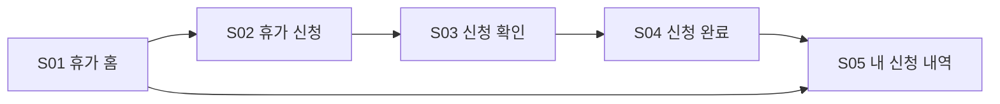
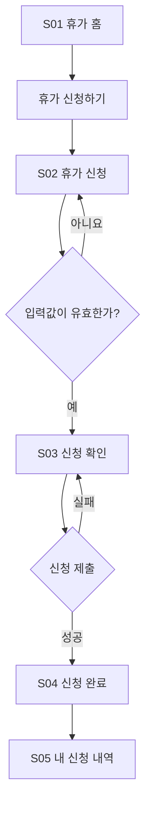

읽기 전용 환경이라 파일 대신 바로 옮겨 쓸 수 있는 형태로 작성했습니다. “5종” 산출물 안에 핵심 화면도 5개로 구성했습니다.

## 1. IA

기능 요구사항:

- FR-001: 잔여 휴가를 확인한다.
- FR-002: 휴가 종류와 기간을 입력한다.
- FR-003: 신청 내용을 검토하고 제출한다.
- FR-004: 신청 결과와 처리 상태를 확인한다.



| ID | 화면 | 경로 | 주요 기능 |
|---|---|---|---|
| S01 | 휴가 홈 | `/leave` | 잔여 일수 확인, 신청 진입 |
| S02 | 휴가 신청 | `/leave/new` | 종류·기간·사유 입력 |
| S03 | 신청 확인 | `/leave/review` | 입력 내용 최종 검토 |
| S04 | 신청 완료 | `/leave/complete` | 접수 결과 안내 |
| S05 | 내 신청 내역 | `/leave/history` | 신청 상태 조회 |

접근 권한은 로그인한 일반 직원으로 제한한다.

---

## 2. 사용자 흐름



예외 흐름:

- 잔여 휴가 부족 → 신청 차단 후 부족 일수 안내
- 시작일이 종료일보다 늦음 → 날짜 필드 오류 표시
- 기존 신청과 기간 중복 → 중복 신청 안내
- 네트워크 오류 → 입력 내용 유지 및 재시도 제공
- 세션 만료 → 로그인 후 작성 화면으로 복귀

---

## 3. 화면 상세 정의

### S01 휴가 홈

- 대상: 직원
- 연결 요구사항: FR-001, FR-004
- 구성:
  - 올해 잔여 휴가
  - 사용·예정 휴가 요약
  - 최근 신청 3건
  - `휴가 신청하기` 버튼
  - `전체 내역 보기` 링크
- 상태:
  - Loading: 잔여 일수와 신청 카드 스켈레톤
  - Empty: “아직 신청한 휴가가 없습니다.”
  - Error: “휴가 정보를 불러오지 못했습니다.” + `다시 시도`
  - Unauthorized: 로그인 화면으로 이동

### S02 휴가 신청

- 대상: 직원
- 연결 요구사항: FR-002
- 입력 항목:

| 항목 | 필수 | 규칙 |
|---|---:|---|
| 휴가 종류 | 예 | 연차, 오전 반차, 오후 반차 |
| 시작일 | 예 | 오늘 이후의 근무일 |
| 종료일 | 예 | 시작일 이후, 반차는 시작일과 동일 |
| 사용 일수 | 자동 | 선택 기간과 근무일 기준 계산 |
| 사유 | 아니요 | 최대 200자 |
| 인수인계 메모 | 아니요 | 최대 500자 |

- 주요 버튼: `신청 내용 확인`
- Validation:
  - 잔여 휴가보다 신청 일수가 많으면 진행 불가
  - 날짜 역전 및 기존 신청과의 중복 차단
  - 오류는 해당 필드 바로 아래 표시
- Offline: 입력값을 유지하고 연결 복구 후 재시도

### S03 신청 확인

- 대상: 직원
- 연결 요구사항: FR-003
- 표시 정보:
  - 휴가 종류
  - 기간과 총 사용 일수
  - 차감 후 예상 잔여 일수
  - 사유 및 인수인계 메모
  - 승인 예정자
- 주요 버튼:
  - 보조: `수정하기`
  - 기본: `휴가 신청하기`
- 제출 중에는 버튼을 비활성화하고 `신청 중…` 표시
- 실패 시 내용은 유지하고 상단 오류 배너와 `다시 신청` 제공

### S04 신청 완료

- 대상: 직원
- 연결 요구사항: FR-003, FR-004
- 표시 정보:
  - “휴가 신청이 완료되었습니다.”
  - 신청 번호
  - 신청 기간
  - 현재 상태 `승인 대기`
  - 승인 예정자
- 주요 버튼:
  - `신청 내역 보기`
  - `휴가 홈으로`
- 새로고침해도 중복 신청되지 않도록 신청 ID 기준으로 조회

### S05 내 신청 내역

- 대상: 직원
- 연결 요구사항: FR-004
- 구성:
  - 연도 필터
  - 상태 필터: 전체, 승인 대기, 승인, 반려, 취소
  - 신청 목록
  - 항목별 종류, 기간, 사용 일수, 상태 표시
- 상태:
  - Empty: “조건에 맞는 휴가 신청이 없습니다.” + `필터 초기화`
  - Error: 재시도 버튼 제공
  - Success: 최신 신청 순으로 표시
- 모바일에서는 표 대신 카드 목록을 사용한다.

공통 반응형 기준:

- Desktop ≥1024px: 최대 너비 960px, 요약과 입력 영역 2열 허용
- Mobile <768px: 1열, 주요 버튼 화면 하단 고정
- 터치 영역 최소 44×44px, 모든 필드에 명시적 레이블 적용

---

## 4. 간단 와이어프레임

```text
[S01 휴가 홈]
┌────────────────────────────┐
│ 휴가                       │
│ 잔여 12일 · 사용 3일       │
│                            │
│ [ 휴가 신청하기 ]          │
│                            │
│ 최근 신청                  │
│ 07.20~07.21  승인 대기      │
│ 05.03        승인           │
│ [ 전체 내역 보기 ]         │
└────────────────────────────┘

[S02 휴가 신청]
┌────────────────────────────┐
│ ← 휴가 신청                │
│ 휴가 종류 [연차      ▼]    │
│ 시작일   [2026.08.10]      │
│ 종료일   [2026.08.11]      │
│ 사용 일수  2일             │
│ 사유     [             ]   │
│ 인수인계 [             ]   │
│ [ 신청 내용 확인 ]         │
└────────────────────────────┘

[S03 신청 확인]
┌────────────────────────────┐
│ 신청 내용을 확인해주세요   │
│ 연차 · 08.10~08.11 · 2일   │
│ 차감 후 잔여: 10일         │
│ 승인 예정자: 김팀장        │
│ [수정하기] [휴가 신청하기] │
└────────────────────────────┘

[S04 신청 완료]
┌────────────────────────────┐
│ ✓ 휴가 신청이 완료되었습니다│
│ 신청번호 LV-20260810-01    │
│ 상태: 승인 대기            │
│ [ 신청 내역 보기 ]         │
│ [ 휴가 홈으로 ]            │
└────────────────────────────┘

[S05 내 신청 내역]
┌────────────────────────────┐
│ 내 신청 내역               │
│ [2026 ▼] [전체 상태 ▼]     │
│ 연차  08.10~08.11  승인대기 │
│ 반차  05.03         승인    │
│ 연차  03.14         반려    │
└────────────────────────────┘
```

---

## 5. 개발 핸드오프

| 요구사항 | 화면 | 주요 컴포넌트 |
|---|---|---|
| FR-001 | S01, S02 | `LeaveBalanceCard` |
| FR-002 | S02 | `LeaveRequestForm`, `DateRangePicker` |
| FR-003 | S03, S04 | `RequestSummary`, `SubmitButton` |
| FR-004 | S01, S04, S05 | `LeaveStatusBadge`, `LeaveRequestList` |

예상 API:

- `GET /api/leave/balance`
- `POST /api/leave/requests`
- `GET /api/leave/requests`
- `GET /api/leave/requests/:id`

상태값:

```text
PENDING   승인 대기
APPROVED  승인
REJECTED  반려
CANCELED  취소
```

구현 전 확인할 정책:

- 주말·공휴일의 휴가 일수 제외 기준
- 휴가 종류와 최소 신청 단위
- 승인자 자동 지정 방식
- 승인 전 직원이 직접 취소할 수 있는지 여부

요구사항·화면·흐름 간 누락은 없으며, 접근성·반응형·빈 상태·오류·제출 상태까지 포함했습니다.