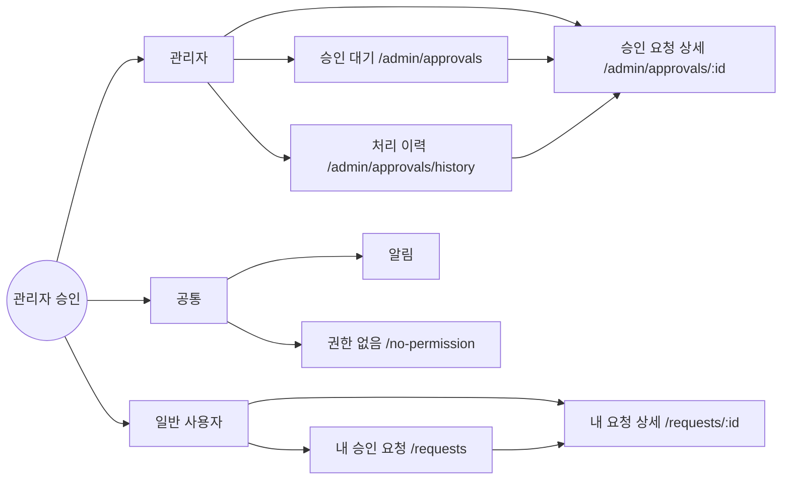
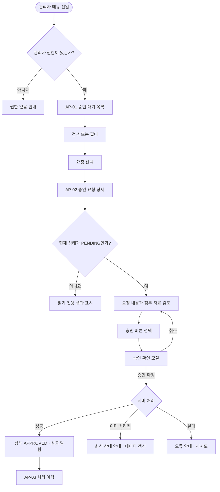
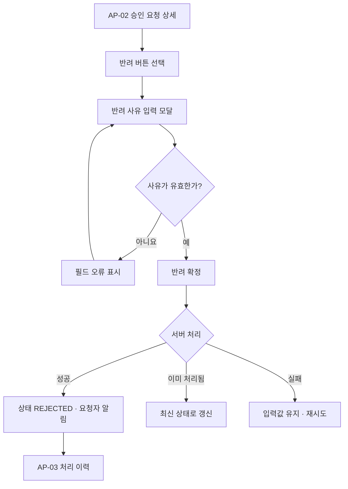
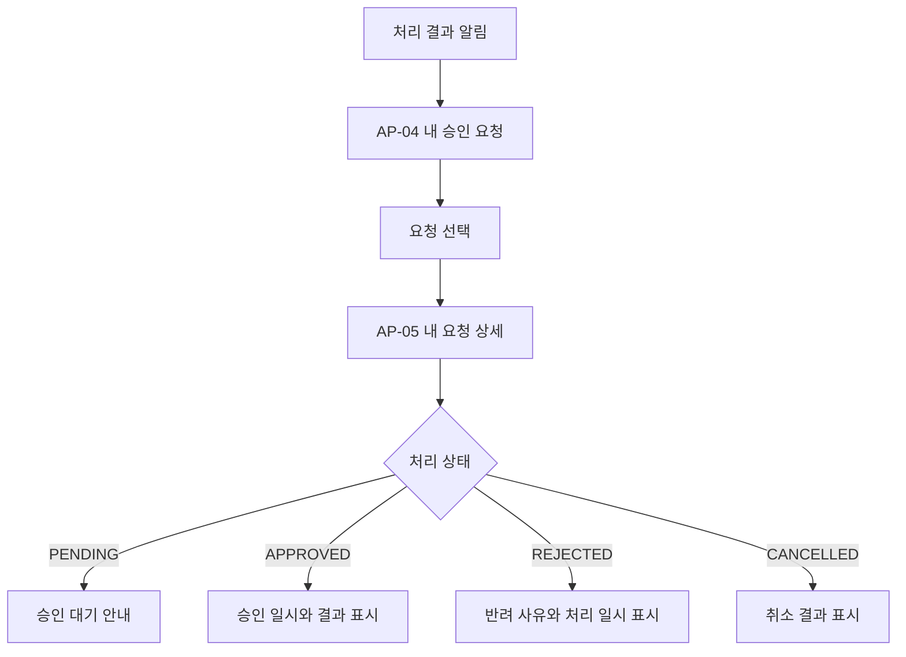

프로젝트에 별도 PRD나 기존 화면 구조가 없어, 아래 가정을 기준으로 작성했습니다.

- 승인 대상은 사용자·게시물·업무 요청 등 공통 `승인 요청` 객체로 추상화
- 역할은 `관리자`, `일반 사용자` 두 종류
- 관리자는 승인·반려 가능, 일반 사용자는 자신의 요청 상태만 조회
- 반려 사유는 필수, 승인 메모는 선택
- 승인 완료 후 변경할 수 없으며 모든 처리는 감사 로그에 기록
- 일괄 승인은 초기 범위에서 제외

## 1. IA



### 메뉴 구조

```text
관리자
└─ 승인 관리
   ├─ 승인 대기
   └─ 처리 이력

일반 사용자
└─ 내 승인 요청
   └─ 요청 상세
```

### 화면 및 권한

| ID | 화면 | Route | 관리자 | 일반 사용자 | 주요 기능 |
|---|---|---|---:|---:|---|
| AP-01 | 승인 대기 목록 | `/admin/approvals` | 가능 | 불가 | 검색, 필터, 정렬, 상세 진입 |
| AP-02 | 승인 요청 상세 | `/admin/approvals/:id` | 가능 | 불가 | 요청 검토, 승인, 반려 |
| AP-03 | 처리 이력 | `/admin/approvals/history` | 가능 | 불가 | 승인·반려 결과 및 감사 로그 조회 |
| AP-04 | 내 승인 요청 | `/requests` | 가능 | 가능 | 본인 요청 상태 조회 |
| AP-05 | 내 요청 상세 | `/requests/:id` | 가능 | 본인 요청만 | 처리 결과와 반려 사유 확인 |
| AP-06 | 권한 없음 | `/no-permission` | 가능 | 가능 | 이전 화면 또는 홈 이동 |

### 상태 모델

```text
PENDING(승인 대기)
 ├─ APPROVED(승인)
 ├─ REJECTED(반려)
 └─ CANCELLED(요청자가 취소)
```

`APPROVED`, `REJECTED`, `CANCELLED`는 종료 상태로 간주합니다.

---

## 2. User Flow

### Flow A — 관리자가 요청을 승인



### Flow B — 관리자가 요청을 반려



### Flow C — 요청자가 처리 결과 확인



### 핵심 예외 흐름

- URL 직접 접근 시 서버에서 관리자 권한을 재검증합니다.
- 다른 관리자가 먼저 처리한 경우 `409 Conflict`로 판단하고 최신 상태를 다시 불러옵니다.
- 승인·반려 요청 중 버튼을 비활성화해 중복 제출을 방지합니다.
- 인증 만료 시 로그인 화면으로 이동하고, 로그인 후 원래 상세 화면으로 복귀합니다.
- 네트워크 오류 시 작성한 반려 사유를 유지합니다.

---

## 3. Lo-fi Wireframe

### AP-01 승인 대기 목록 — Desktop

```text
┌──────────────────────────────────────────────────────────────────────┐
│ Logo   대시보드   승인 관리                           관리자 ▾       │
├───────────────┬──────────────────────────────────────────────────────┤
│ 승인 관리     │ 승인 대기                               [새로고침]   │
│ ├ 승인 대기 ● │ 처리할 요청을 검토하세요.                             │
│ └ 처리 이력   │                                                      │
│               │ ┌──────────────────────────────────────────────────┐ │
│               │ │ 검색 [요청자·제목____________] [상태: 대기 ▾]   │ │
│               │ │ 유형 [전체 ▾] 기간 [최근 30일 ▾] [초기화]       │ │
│               │ └──────────────────────────────────────────────────┘ │
│               │                                                      │
│               │ 총 24건                         [오래된 순 ▾]        │
│               │ ┌────┬────────────┬────────┬────────┬────────────┐  │
│               │ │상태│ 요청       │요청자  │유형    │요청 일시   │  │
│               │ ├────┼────────────┼────────┼────────┼────────────┤  │
│               │ │대기│계정 권한…  │김관리  │권한변경│07-27 10:21│  │
│               │ │대기│콘텐츠 공개 │이사용  │게시물  │07-27 09:10│  │
│               │ │대기│정보 수정…  │박사용  │정보수정│07-26 17:42│  │
│               │ └────┴────────────┴────────┴────────┴────────────┘  │
│               │                         ‹ 이전  1  2  3  다음 ›     │
└───────────────┴──────────────────────────────────────────────────────┘
```

상태 처리:

- Loading: 테이블 행과 필터 영역 스켈레톤
- Empty: “승인 대기 중인 요청이 없습니다.” + `[필터 초기화]`
- Error: “요청 목록을 불러오지 못했습니다.” + `[다시 시도]`
- No permission: AP-06으로 이동
- 검색 결과 없음: 검색어 유지 + `[검색 초기화]`

### AP-02 승인 요청 상세 — Desktop

```text
┌──────────────────────────────────────────────────────────────────────┐
│ ← 승인 대기                  요청 #APR-20260727-018     [승인 대기] │
├───────────────────────────────────────────┬──────────────────────────┤
│ 요청 정보                                 │ 처리                      │
│                                           │                           │
│ 요청 유형   계정 권한 변경                │ 현재 상태                 │
│ 요청자      김관리 · kim@example.com      │ [승인 대기]               │
│ 요청 일시   2026-07-27 10:21              │                           │
│ 대상        프로젝트 A                    │ 승인 메모 (선택)           │
│                                           │ ┌───────────────────────┐ │
│ 요청 내용                                 │ │ 내부 기록을 입력하세요 │ │
│ ┌───────────────────────────────────────┐ │ └───────────────────────┘ │
│ │ 프로젝트 A의 편집자 권한을 요청합니다.│ │                           │
│ └───────────────────────────────────────┘ │ [반려하기]   [승인하기]   │
│                                           │                           │
│ 첨부 자료                                 │ 처리 후에는 변경할 수      │
│ [권한요청서.pdf  1.2MB] [미리보기]        │ 없습니다.                  │
│                                           │                           │
│ 변경 내용                                 │                           │
│ 기존 권한: 조회자 → 요청 권한: 편집자     │                           │
├───────────────────────────────────────────┴──────────────────────────┤
│ 감사 이력                                                            │
│ 10:21 김관리 요청 생성                                                │
└──────────────────────────────────────────────────────────────────────┘
```

승인 확인 모달:

```text
┌──────────────────────────────────────┐
│ 요청을 승인할까요?                   │
│ 승인 즉시 요청자에게 결과가 전달되고 │
│ 처리 결과는 변경할 수 없습니다.      │
│                                      │
│                 [취소] [승인 확정]   │
└──────────────────────────────────────┘
```

반려 모달:

```text
┌──────────────────────────────────────────┐
│ 요청 반려                                │
│ 요청자가 이해할 수 있도록 사유를         │
│ 입력해 주세요.                           │
│                                          │
│ 반려 사유 *                              │
│ ┌──────────────────────────────────────┐ │
│ │ 예: 요청 권한과 담당 업무가 일치하지 │ │
│ │ 않습니다.                            │ │
│ └──────────────────────────────────────┘ │
│ 10자 이상, 500자 이하             42/500 │
│                                          │
│                 [취소] [반려 확정]       │
└──────────────────────────────────────────┘
```

검증 및 상태:

- 반려 사유: 공백 제외 10~500자, 필수
- 처리 중: 선택한 버튼을 `승인 처리 중…` 또는 `반려 처리 중…`으로 변경하고 양쪽 버튼 비활성화
- 처리 성공: 상태 배지 갱신, 처리 영역 읽기 전용 전환, 성공 토스트 표시
- 충돌: “다른 관리자가 이미 처리했습니다.” 배너와 최신 처리자·처리 시각 표시
- 서버 오류: 입력값을 유지하고 재시도 제공

### AP-03 처리 이력 — Desktop

```text
┌──────────────────────────────────────────────────────────────────────┐
│ 처리 이력                                            [CSV 내보내기] │
├──────────────────────────────────────────────────────────────────────┤
│ [검색____________] [결과: 전체 ▾] [처리자 ▾] [기간 ▾] [초기화]     │
├────────┬──────────────┬────────┬────────┬──────────────┬─────────────┤
│ 결과   │ 요청         │ 요청자 │ 처리자 │ 처리 일시    │ 사유/메모   │
├────────┼──────────────┼────────┼────────┼──────────────┼─────────────┤
│ 승인   │ 계정 권한…   │ 김관리 │ 최고관 │ 07-27 11:02 │ 상세 보기 > │
│ 반려   │ 콘텐츠 공개  │ 이사용 │ 최고관 │ 07-27 10:45 │ 상세 보기 > │
└────────┴──────────────┴────────┴────────┴──────────────┴─────────────┘
```

### AP-01 승인 대기 목록 — Mobile

```text
┌──────────────────────────────┐
│ ☰  승인 대기          관리자 │
├──────────────────────────────┤
│ [검색____________________]   │
│ [상태 ▾] [유형 ▾] [정렬 ▾]  │
│                              │
│ 승인 대기 24건               │
│ ┌──────────────────────────┐ │
│ │ [대기] 계정 권한 변경    │ │
│ │ 김관리 · 권한변경        │ │
│ │ 2026-07-27 10:21       > │ │
│ └──────────────────────────┘ │
│ ┌──────────────────────────┐ │
│ │ [대기] 콘텐츠 공개       │ │
│ │ 이사용 · 게시물          │ │
│ │ 2026-07-27 09:10       > │ │
│ └──────────────────────────┘ │
│                              │
│          [더 보기]           │
└──────────────────────────────┘
```

### AP-02 승인 요청 상세 — Mobile

```text
┌──────────────────────────────┐
│ ←  요청 상세       [대기]    │
├──────────────────────────────┤
│ 계정 권한 변경               │
│ 김관리 · 2026-07-27 10:21    │
│                              │
│ 요청 내용                    │
│ ┌──────────────────────────┐ │
│ │ 프로젝트 A 편집자 권한… │ │
│ └──────────────────────────┘ │
│                              │
│ 변경 내용                    │
│ 조회자 → 편집자              │
│                              │
│ 첨부 자료                    │
│ [권한요청서.pdf]             │
│                              │
│ 처리 이력                    │
│ 10:21 요청 생성              │
├──────────────────────────────┤
│ [반려하기]      [승인하기]   │
└──────────────────────────────┘
```

모바일에서는 상세 본문만 스크롤하고 처리 버튼은 하단에 고정합니다. 버튼과 필터의 터치 영역은 최소 `44×44px`로 유지합니다.

## 접근성·구현 기준

- 상태를 색상만으로 표현하지 않고 `승인`, `반려`, `대기` 텍스트를 함께 표시
- 모달 최초 포커스를 제목 또는 첫 입력 필드에 두고, 닫힐 때 실행 버튼으로 복귀
- 모든 필터와 입력에 명시적인 `<label>` 제공
- 처리 성공 메시지는 `aria-live="polite"`, 오류 배너는 `role="alert"` 적용
- 권한 검증과 상태 전이는 반드시 서버에서도 수행
- 승인·반려 API는 요청 ID와 현재 버전을 함께 받아 동시 처리 충돌 방지
- 감사 로그에는 요청 ID, 이전·변경 상태, 처리자, 처리 시각, 사유를 기록합니다.