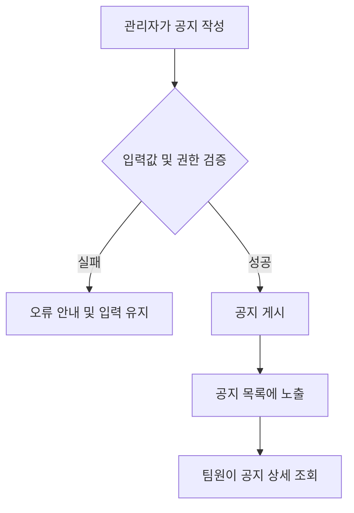

# 신규 팀 공지 기능 PRD

## Applicability

| Contract | Required / N/A | Evidence |
|---|---|---|
| Pages/routes or screen IDs | Required | 공지 목록·상세·작성 화면이 필요함 |
| Empty/loading/error/success/recovery state matrix | Required | 사용자에게 조회·등록 결과를 표시해야 함 |
| Mermaid user or system flow | Required | 작성, 게시, 조회로 이어지는 흐름이 존재함 |

## Context and problem

팀의 중요 정보가 일반 대화에 섞여 구성원이 공지를 놓치거나 다시 찾기 어렵다. 관리자가 공지를 별도로 게시하고 팀원이 한곳에서 확인할 수 있는 기능이 필요하다.

## Goals

- 관리자가 팀 공지를 작성·수정·삭제할 수 있다.
- 팀원이 최신 공지를 쉽게 확인할 수 있다.
- 공지와 일반 메시지를 명확히 구분한다.

## Non-goals

- 예약 게시 및 반복 공지
- 이메일·푸시 알림
- 공지 열람 여부 통계
- 댓글 및 승인 워크플로

## Users, roles, and permissions

- 팀 관리자: 공지 작성, 수정, 삭제, 조회
- 팀원: 자신이 속한 팀의 공지 조회
- 비회원 및 다른 팀 사용자: 접근 불가

## Functional requirements

| ID | Requirement | Priority |
|---|---|---|
| FR-01 | 관리자는 제목과 본문을 입력해 공지를 게시할 수 있다. | Must |
| FR-02 | 팀 구성원은 공지 목록을 최신 게시순으로 볼 수 있다. | Must |
| FR-03 | 팀 구성원은 공지 상세 내용을 볼 수 있다. | Must |
| FR-04 | 작성 권한이 있는 관리자는 공지를 수정·삭제할 수 있다. | Must |
| FR-05 | 목록과 상세 화면에 작성자 및 게시·수정 시각을 표시한다. | Should |
| FR-06 | 제목과 본문의 필수 입력값을 검증하고 실패 원인을 안내한다. | Must |

## Pages and routes

| Page or screen ID | Route, deep link, or explicit TBD + owner | Roles | Purpose |
|---|---|---|---|
| NOTICE-LIST | TBD — 개발 착수 전 제품 담당자 확정 | 팀원, 관리자 | 공지 목록 조회 |
| NOTICE-DETAIL | TBD — 개발 착수 전 제품 담당자 확정 | 팀원, 관리자 | 공지 상세 조회 |
| NOTICE-EDITOR | TBD — 개발 착수 전 제품 담당자 확정 | 관리자 | 공지 작성·수정 |

## State matrix

| Surface | Empty | Loading | Error | Success | Recovery |
|---|---|---|---|---|---|
| 공지 목록 | 공지가 없음을 안내 | 로딩 표시 | 조회 실패 안내 | 공지 목록 표시 | 다시 시도 |
| 공지 상세 | N/A | 로딩 표시 | 삭제·권한·조회 오류 안내 | 상세 내용 표시 | 목록 이동 또는 재시도 |
| 공지 작성·수정 | 빈 입력 폼 | 저장 중 표시 | 필드·저장 오류 안내 | 게시 완료 후 상세 이동 | 입력값을 유지한 채 재시도 |

## User or system flow

## Authorization and data boundaries

- 서버는 모든 작성·수정·삭제 요청에서 관리자 권한을 검증한다.
- 사용자는 자신이 현재 속한 팀의 공지만 조회할 수 있다.
- 수정·삭제 대상 공지가 요청자의 팀에 속하는지 서버에서 검증한다.
- UI에서 버튼을 숨기는 것만으로 권한 검증을 대체하지 않는다.

## Non-functional requirements

- 접근성: 키보드 조작과 명확한 오류 메시지를 지원한다.
- 보안: 공지 본문 출력 시 악성 스크립트가 실행되지 않아야 한다.
- 성능 목표 수치는 예상 사용량 확인 후 제품·개발 담당자가 착수 전에 결정한다.

## Acceptance criteria

| ID | Requirement | Given | When | Then | Verification |
|---|---|---|---|---|---|
| AC-01 | FR-01, FR-06 | 관리자가 유효한 제목과 본문을 입력함 | 게시를 실행함 | 공지가 생성되고 상세 화면이 표시됨 | 기능 테스트 |
| AC-02 | FR-02, FR-03 | 팀에 공지가 존재함 | 팀원이 목록과 상세를 조회함 | 최신순 목록과 선택한 공지가 표시됨 | 기능 테스트 |
| AC-03 | FR-04 | 관리자가 기존 공지를 선택함 | 수정 또는 삭제함 | 변경 내용이 반영되거나 목록에서 제거됨 | 기능 테스트 |
| AC-04 | FR-01, FR-04 | 일반 팀원이 접근함 | 작성·수정·삭제를 요청함 | 서버가 요청을 거부함 | 권한 테스트 |
| AC-05 | FR-02, FR-03 | 다른 팀의 공지가 존재함 | 사용자가 직접 접근을 시도함 | 서버가 내용을 노출하지 않음 | 데이터 경계 테스트 |
| AC-06 | FR-06 | 필수 입력값이 누락됨 | 게시를 실행함 | 오류가 표시되고 입력 내용이 유지됨 | 기능 테스트 |

## Assumptions and open decisions

- MVP에서는 팀 관리자만 공지를 관리한다고 가정한다.
- 공지 제목·본문의 글자 수 제한은 UX 및 저장 정책 확정 후 결정한다.
- 관리자 역할의 세부 범위와 공지 삭제 방식(즉시 삭제 또는 복구 가능)은 개발 착수 전에 확정해야 한다.

## Risks and mitigations

- 중요 공지를 놓칠 수 있음 → 이후 읽음 표시나 알림 기능의 필요성을 검토
- 잘못된 공지 삭제 → 삭제 전 확인 절차 제공
- 팀 간 정보 노출 → 서버 권한 및 팀 소속 검증 테스트 필수

## Delivery

| Phase | Requirement IDs | Verifiable exit condition |
|---|---|---|
| 1. 조회 | FR-02, FR-03, FR-05 | 권한이 있는 팀원이 목록과 상세를 조회할 수 있음 |
| 2. 관리 | FR-01, FR-04, FR-06 | 관리자가 공지를 생성·수정·삭제하고 권한 테스트를 통과함 |