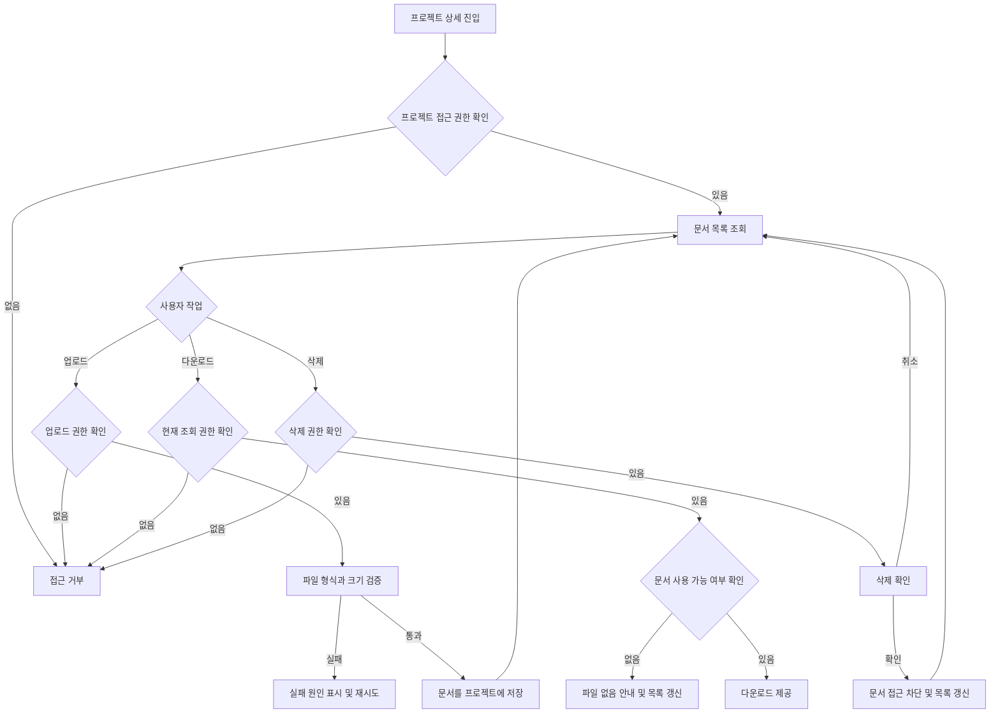

# 프로젝트별 문서 보관 PRD

## Applicability

| Contract | Required / N/A | Evidence |
|---|---|---|
| Pages/routes or screen IDs | Required | 사용자가 프로젝트에서 문서를 조회·등록·관리하는 화면이 필요함 |
| Empty/loading/error/success/recovery state matrix | Required | 목록 조회, 업로드, 다운로드, 삭제 과정에서 사용자 상태 처리가 필요함 |
| Mermaid user or system flow | Required | 업로드부터 권한 검증, 저장, 조회, 삭제까지 다단계 흐름이 존재함 |

## Context and problem

프로젝트 진행 과정에서 발생하는 기획서, 계약서, 회의 자료 등의 문서를 프로젝트 단위로 모아 보관할 공간이 필요하다.

현재 문서가 외부 메신저, 개인 저장소 또는 여러 위치에 분산되면 다음 문제가 발생한다.

- 어떤 문서가 특정 프로젝트에 속하는지 파악하기 어렵다.
- 프로젝트 참여자가 최신 자료를 찾기 어렵다.
- 프로젝트와 관계없는 사용자가 문서에 접근할 위험이 있다.
- 문서 등록자, 등록 시각 등 기본 이력을 확인하기 어렵다.

본 기능은 각 프로젝트 안에서 문서를 등록하고, 프로젝트 참여자가 권한에 따라 조회·다운로드·삭제할 수 있도록 한다.

## Goals

- 문서를 특정 프로젝트에 귀속해 보관할 수 있다.
- 프로젝트 참여자가 해당 프로젝트의 문서를 쉽게 찾고 다운로드할 수 있다.
- 사용자 역할에 따라 등록·조회·삭제 권한을 서버에서 통제한다.
- 업로드 결과와 실패 원인을 사용자가 명확하게 확인할 수 있다.
- 문서의 기본 메타데이터를 제공한다.

## Non-goals

초기 범위에는 다음 기능을 포함하지 않는다.

- 문서 본문 편집 및 공동 편집
- 문서 승인 또는 전자결재
- 문서 버전 관리
- 폴더 계층 및 사용자 정의 분류 체계
- 문서 본문 검색 또는 OCR
- 외부 공개 링크
- 프로젝트 간 문서 이동·복사
- 댓글, 멘션 및 문서별 알림
- 대량 업로드 및 대량 다운로드
- 휴지통 또는 사용자 직접 복구

## Users, roles, and permissions

| 역할 | 문서 목록/정보 조회 | 다운로드 | 업로드 | 삭제 |
|---|---:|---:|---:|---:|
| 프로젝트 관리자 | 가능 | 가능 | 가능 | 가능 |
| 프로젝트 멤버 | 가능 | 가능 | 가능 | 본인이 등록한 문서만 가능 |
| 프로젝트 조회자 | 가능 | 가능 | 불가 | 불가 |
| 프로젝트 비참여자 | 불가 | 불가 | 불가 | 불가 |

역할 명칭이 기존 제품과 다를 경우 기존 프로젝트 권한 체계에 매핑한다. 권한 판단은 화면 노출 여부와 무관하게 서버에서 수행해야 한다.

## Functional requirements

| ID | Requirement | Priority |
|---|---|---|
| FR-001 | 사용자는 접근 권한이 있는 프로젝트의 문서 목록을 조회할 수 있어야 한다. | Must |
| FR-002 | 목록에는 파일명, 파일 크기, 등록자, 등록 일시가 표시되어야 한다. | Must |
| FR-003 | 문서 목록은 기본적으로 등록 일시 내림차순으로 정렬되어야 한다. | Must |
| FR-004 | 업로드 권한이 있는 사용자는 로컬 파일을 선택해 현재 프로젝트에 등록할 수 있어야 한다. | Must |
| FR-005 | 시스템은 업로드 전에 허용 파일 형식과 최대 파일 크기를 검증해야 한다. 구체적인 정책은 출시 전 결정한다. | Must |
| FR-006 | 업로드 중에는 진행 상태를 표시하고 중복 제출을 방지해야 한다. | Must |
| FR-007 | 업로드가 실패하면 기존 문서 목록을 유지하고 실패 원인과 재시도 방법을 제공해야 한다. | Must |
| FR-008 | 조회 권한이 있는 사용자는 문서를 다운로드할 수 있어야 한다. | Must |
| FR-009 | 다운로드 요청 시점마다 사용자의 현재 프로젝트 접근 권한을 서버에서 다시 검증해야 한다. | Must |
| FR-010 | 삭제 권한이 있는 사용자는 확인 절차를 거쳐 문서를 삭제할 수 있어야 한다. | Must |
| FR-011 | 삭제 완료된 문서는 목록과 일반 다운로드 경로에서 즉시 접근할 수 없어야 한다. | Must |
| FR-012 | 서로 다른 문서가 동일한 파일명을 가질 수 있어야 하며, 시스템은 각 문서를 고유 식별자로 구분해야 한다. | Must |
| FR-013 | 사용자는 파일명으로 현재 프로젝트의 문서 목록을 검색할 수 있어야 한다. | Should |
| FR-014 | 목록이 여러 페이지에 걸칠 경우 페이지네이션 또는 연속 로딩 방식으로 추가 문서를 조회할 수 있어야 한다. | Should |
| FR-015 | 업로드, 다운로드 또는 삭제 대상이 이미 제거됐거나 접근 불가능하면 안전한 오류 메시지와 목록 복귀 수단을 제공해야 한다. | Must |
| FR-016 | 프로젝트가 삭제 또는 보관 상태로 변경될 때 문서 접근 정책은 프로젝트 생명주기 정책을 따라야 한다. | Must |

## Pages and routes

| Page or screen ID | Route, deep link, or explicit TBD + owner | Roles | Purpose |
|---|---|---|---|
| `PROJECT-DOCUMENT-LIST` | 기존 프로젝트 상세 화면 하위 탭. 실제 route는 제품/프론트엔드 담당자가 구현 착수 전 확정 | 관리자, 멤버, 조회자 | 문서 목록 조회, 검색, 다운로드 및 권한별 작업 진입 |
| `PROJECT-DOCUMENT-UPLOAD` | `PROJECT-DOCUMENT-LIST` 내 모달 또는 패널. UI 담당자가 설계 시 확정 | 관리자, 멤버 | 파일 선택, 검증 및 업로드 |
| `PROJECT-DOCUMENT-DELETE-CONFIRM` | 문서 목록 내 확인 다이얼로그 | 관리자, 삭제 가능한 멤버 | 문서 삭제 확인 |

별도 문서 상세 화면은 MVP에 포함하지 않는다.

## State matrix

| Surface | Empty | Loading | Error | Success | Recovery |
|---|---|---|---|---|---|
| 문서 목록 | “등록된 문서가 없습니다” 안내. 업로드 권한이 있으면 등록 버튼 표시 | 목록 스켈레톤 또는 로딩 표시 | 목록을 불러오지 못했다는 안내 | 권한이 있는 문서 목록 표시 | 다시 시도 |
| 검색 결과 | “검색 결과가 없습니다”와 검색 초기화 제공 | 검색 진행 표시 | 검색 실패 안내 | 일치하는 문서 표시 | 검색어 초기화 또는 다시 시도 |
| 문서 업로드 | 파일 미선택 상태와 선택 안내 | 진행 상태 표시, 중복 제출 차단 | 파일별 실패 원인 표시 | 목록에 새 문서 반영 및 완료 피드백 | 동일 파일 재시도 또는 다른 파일 선택 |
| 문서 다운로드 | N/A | 요청 처리 상태 표시 | 권한 없음, 파일 없음 또는 일시적 실패를 구분해 안내 | 브라우저 다운로드 시작 | 목록 복귀 또는 다시 시도 |
| 문서 삭제 | N/A | 삭제 버튼 비활성화 및 처리 상태 표시 | 기존 목록 유지, 삭제 실패 안내 | 목록에서 문서 제거 및 완료 피드백 | 다시 시도 또는 취소 |

## User or system flow

## Authorization and data boundaries

- 모든 문서는 정확히 하나의 프로젝트에 귀속되어야 한다.
- 문서 목록, 메타데이터, 다운로드 및 삭제 요청에는 프로젝트 식별자와 문서 식별자가 함께 사용되어야 한다.
- 서버는 문서가 요청된 프로젝트에 실제로 속하는지 검증해야 한다.
- URL이나 문서 식별자를 추측하더라도 다른 프로젝트의 문서에 접근할 수 없어야 한다.
- 목록 조회, 다운로드, 업로드 및 삭제 시점마다 현재 사용자와 프로젝트 역할을 검증해야 한다.
- 프로젝트에서 제외된 사용자는 기존 다운로드 주소를 알고 있어도 문서에 접근할 수 없어야 한다.
- 다운로드용 임시 주소를 사용하는 경우 다른 사용자나 장기간 접근에 재사용되지 않도록 제한해야 한다.
- 파일명과 파일 메타데이터는 사용자 입력으로 취급하며, 화면 출력 및 다운로드 응답에서 안전하게 처리해야 한다.
- 악성 또는 위험 파일 대응 정책은 출시 전 보안 담당자가 결정해야 한다.
- 삭제 문서의 실제 보관 기간과 물리적 제거 방식은 데이터 보존 정책에 따라 별도로 확정한다.

## Non-functional requirements

근거 없는 수치를 지정하지 않고, 아래 항목의 목표값과 검증 기준을 출시 전 담당자가 확정한다.

| 항목 | Requirement |
|---|---|
| 성능 | 문서 목록 조회와 다운로드 시작 시간의 목표값을 제품·백엔드 담당자가 부하 특성을 확인한 뒤 확정한다. |
| 용량 | 파일당 최대 크기, 프로젝트당 문서 수 또는 총용량 제한을 제품·인프라 담당자가 확정한다. |
| 보안 | 저장 파일에 대한 악성 파일 검사 여부와 허용·차단 확장자 정책을 보안 담당자가 확정한다. |
| 안정성 | 업로드 실패 시 불완전한 문서가 정상 목록에 노출되지 않아야 한다. |
| 무결성 | 저장된 파일과 메타데이터는 동일한 프로젝트 및 고유 문서 식별자로 연결되어야 한다. |
| 관측성 | 업로드·다운로드·삭제 실패를 원인별로 조사할 수 있는 운영 로그가 제공되어야 한다. 로그에 파일 본문이나 민감한 다운로드 자격정보를 남겨서는 안 된다. |
| 접근성 | 업로드, 다운로드, 삭제 및 오류 상태는 키보드와 보조기술로 인지하고 조작할 수 있어야 한다. |

## Acceptance criteria

| ID | Requirement | Given | When | Then | Verification |
|---|---|---|---|---|---|
| AC-001 | FR-001, FR-002, FR-003 | 프로젝트 멤버이고 문서가 등록되어 있음 | 문서 화면에 진입함 | 문서가 최신 등록순으로 표시되고 필수 메타데이터가 보임 | UI 통합 테스트 |
| AC-002 | FR-004, FR-005, FR-006 | 업로드 권한이 있음 | 허용 범위의 파일을 선택해 업로드함 | 진행 상태가 표시되고 한 개의 문서로 등록됨 | UI/API 통합 테스트 |
| AC-003 | FR-005, FR-007 | 업로드 권한이 있음 | 허용되지 않은 형식 또는 크기의 파일을 선택함 | 저장되지 않고 실패 원인 및 재선택 방법이 표시됨 | 경계값 테스트 |
| AC-004 | FR-007 | 업로드 도중 저장 요청이 실패함 | 실패 응답을 받음 | 불완전한 문서는 목록에 표시되지 않고 재시도할 수 있음 | 장애 주입 통합 테스트 |
| AC-005 | FR-008, FR-009 | 현재 프로젝트 조회 권한이 있음 | 문서 다운로드를 요청함 | 권한 검증 후 해당 파일의 다운로드가 시작됨 | API 권한 테스트 |
| AC-006 | FR-009 | 프로젝트에서 제외된 사용자가 기존 문서 식별자 또는 주소를 알고 있음 | 다운로드를 요청함 | 파일 내용이나 메타데이터가 노출되지 않고 접근이 거부됨 | API 보안 테스트 |
| AC-007 | FR-010, FR-011 | 삭제 가능한 문서가 존재함 | 삭제를 확인함 | 문서가 목록에서 제거되고 기존 일반 다운로드 요청도 실패함 | UI/API 통합 테스트 |
| AC-008 | FR-010 | 일반 멤버가 다른 사용자의 문서를 조회 중임 | 삭제를 요청함 | 서버가 삭제를 거부하고 문서는 유지됨 | API 권한 테스트 |
| AC-009 | FR-012 | 동일한 파일명의 문서가 이미 있음 | 같은 이름의 다른 파일을 업로드함 | 기존 문서를 덮어쓰지 않고 별도 문서로 등록됨 | API 통합 테스트 |
| AC-010 | FR-013 | 여러 문서가 등록되어 있음 | 파일명 일부를 검색함 | 현재 프로젝트 안의 일치 문서만 표시됨 | UI/API 검색 테스트 |
| AC-011 | FR-015 | 목록에 표시된 문서가 다른 요청에서 먼저 삭제됨 | 다운로드 또는 삭제를 요청함 | 안전한 오류가 표시되고 목록을 갱신할 수 있음 | 동시성 통합 테스트 |
| AC-012 | FR-001, FR-008 | 프로젝트 비참여자가 프로젝트와 문서 식별자를 알고 있음 | 목록 또는 다운로드 API를 호출함 | 다른 프로젝트의 존재나 문서 정보가 노출되지 않음 | API 보안 테스트 |
| AC-013 | FR-016 | 프로젝트가 삭제 또는 보관 상태임 | 사용자가 문서 작업을 요청함 | 확정된 프로젝트 생명주기 정책에 따라 일관되게 허용 또는 거부됨 | 상태 전이 테스트 |
| AC-014 | FR-014 | 한 번에 표시할 수 있는 수보다 많은 문서가 있음 | 다음 페이지 또는 추가 로딩을 요청함 | 중복이나 누락 없이 다음 문서가 표시됨 | UI/API 통합 테스트 |

## Assumptions and open decisions

### 적용한 가정

- 기존 서비스에 프로젝트와 프로젝트 참여자 역할 체계가 존재한다.
- 조회자는 문서를 다운로드할 수 있다.
- 멤버는 자신이 등록한 문서만 삭제할 수 있고, 관리자는 모든 문서를 삭제할 수 있다.
- MVP에서는 한 번에 한 파일만 업로드한다.
- 동일한 파일명의 문서는 별도 항목으로 허용한다.
- 문서 미리보기와 버전 관리는 MVP 범위에서 제외한다.

### 출시 전 결정이 필요한 사항

| Decision ID | 결정 사항 | 영향 | Owner / 결정 시점 |
|---|---|---|---|
| OD-001 | 허용 파일 형식과 파일당 최대 크기 | 클라이언트·서버 검증, 저장 비용, 보안 | 제품·보안·인프라 / 구현 착수 전 |
| OD-002 | 프로젝트당 문서 수 또는 총 저장 용량 제한 | 업로드 정책과 오류 처리 | 제품·인프라 / 출시 전 |
| OD-003 | 삭제 파일의 보존 기간과 물리적 삭제 방식 | 복구 가능성, 저장 비용, 개인정보 처리 | 제품·보안 / 데이터 모델 확정 전 |
| OD-004 | 보관된 프로젝트의 문서를 계속 조회·다운로드할 수 있는지 | FR-016 상태 전이 | 제품 / 구현 착수 전 |
| OD-005 | 악성 파일 검사 적용 여부와 실패 시 처리 | 업로드 처리 흐름과 운영 대응 | 보안·백엔드 / 구현 착수 전 |
| OD-006 | 기존 프로젝트 역할과 본 문서의 관리자·멤버·조회자 매핑 | 전체 권한 모델 | 제품·백엔드 / API 설계 전 |

## Risks and mitigations

| Risk | Impact | Mitigation |
|---|---|---|
| 문서 식별자만으로 다운로드가 허용됨 | 프로젝트 간 정보 유출 | 모든 요청에서 사용자, 프로젝트, 문서 귀속 관계를 서버에서 검증 |
| 대용량 또는 악성 파일 업로드 | 비용 증가 또는 보안 사고 | 크기·형식 제한, 위험 파일 정책 및 필요 시 검사 절차 적용 |
| 업로드 중 장애로 불완전 데이터가 남음 | 손상 문서 노출 | 저장 완료 전에는 정상 목록에 노출하지 않고 실패 자원을 정리 |
| 삭제와 다운로드가 동시에 발생함 | 삭제된 문서가 계속 제공될 수 있음 | 삭제 상태 확인과 다운로드 권한 검증을 요청 시점에 수행 |
| 역할 정의가 기존 서비스와 불일치함 | 과도하거나 부족한 권한 부여 | OD-006을 API 설계 전에 확정하고 권한 테스트 작성 |
| 저장 한도가 정의되지 않음 | 예측하지 못한 저장 비용 | OD-001과 OD-002를 출시 전에 확정 |

## Delivery

| Phase | Requirement IDs | Verifiable exit condition |
|---|---|---|
| 1. 정책 및 권한 확정 | FR-005, FR-009, FR-010, FR-016 | OD-001, OD-003, OD-004, OD-005, OD-006이 결정되고 권한 매트릭스가 승인됨 |
| 2. 문서 저장·조회 기반 | FR-001, FR-002, FR-003, FR-004, FR-005, FR-012 | 권한 있는 사용자가 문서를 등록하고 목록에서 메타데이터를 확인할 수 있음 |
| 3. 다운로드·삭제 및 보안 | FR-008, FR-009, FR-010, FR-011, FR-015, FR-016 | 역할별 API 권한 테스트와 프로젝트 간 접근 차단 테스트가 통과함 |
| 4. 사용자 상태 처리 | FR-006, FR-007 | 목록 및 업로드의 빈 상태, 로딩, 오류, 성공, 재시도가 UI 테스트를 통과함 |
| 5. 탐색성 및 확장 | FR-013, FR-014 | 검색과 다페이지 목록에서 프로젝트 간 혼입, 중복, 누락이 없음을 검증함 |

중요한 미결정 사항은 파일 제한, 삭제 보존 정책, 보관 프로젝트의 접근 정책, 기존 역할 매핑이다. 현재 작업 공간이 읽기 전용이고 PRD를 파일로 저장하지 않았으므로 스킬의 파일 검증기는 실행하지 않았다.