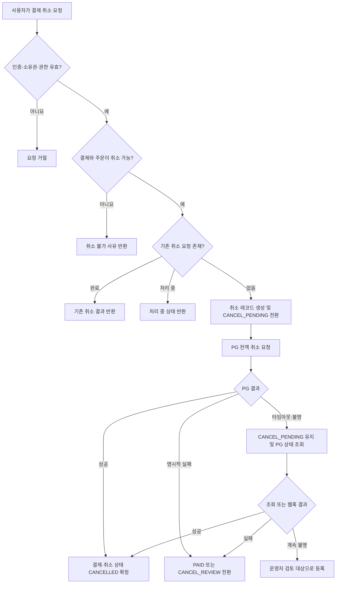

# 결제 취소 PRD

## Applicability

| Contract | Required / N/A | Evidence |
|---|---|---|
| Pages/routes or screen IDs | Required | 구매자와 운영자가 결제 취소를 요청하고 결과를 확인하는 사용자 화면이 필요함 |
| Empty/loading/error/success/recovery state matrix | Required | PG 응답 지연, 취소 실패, 중복 요청 등 사용자에게 구분되어야 하는 상태가 존재함 |
| Mermaid user or system flow | Required | 사용자 요청, 서버 검증, PG 취소, 내부 상태 반영으로 이어지는 다단계 생명주기임 |

## Context and problem

결제 완료 후 주문 진행 전 구매자가 거래를 철회하거나 운영자가 결제를 취소해야 할 수 있다. 현재 표준화된 취소 정책과 상태 관리가 없으면 다음 문제가 발생한다.

- 취소 불가능한 주문이 취소되는 정책 위반
- 중복 요청으로 인한 PG 중복 호출
- PG와 내부 결제 상태의 불일치
- 다른 사용자의 결제를 취소하는 권한 침해
- 실패 또는 처리 중 상태를 사용자가 알 수 없음

본 PRD에서 결제 취소는 결제대행사(PG)를 통해 승인된 결제 금액 전체를 원 결제수단으로 반환하는 행위를 의미한다.

## Goals

- 구매자가 취소 가능한 결제를 직접 전액 취소할 수 있다.
- 운영자가 권한 범위 안에서 결제를 전액 취소할 수 있다.
- 동일 결제에 대한 취소 요청을 멱등하게 처리한다.
- PG와 내부 시스템 간 취소 결과를 추적하고 불일치를 복구할 수 있다.
- 사용자에게 취소 가능 여부와 최종 처리 결과를 명확하게 안내한다.

## Non-goals

- 부분 취소
- 주문 상품 일부만 선택하는 품목 단위 취소
- 계좌 또는 포인트를 통한 수동 환불
- 교환 및 반품 물류 처리
- 차지백 및 결제 분쟁 처리
- 취소 수수료나 위약금 계산
- 여러 결제수단이 조합된 복합결제 취소

## Users, roles, and permissions

| 역할 | 권한 |
|---|---|
| 구매자 | 자신이 결제한 주문의 취소 가능 여부 조회 및 취소 요청 |
| 고객지원 운영자 | 담당 조직 또는 테넌트에 속한 결제 조회 및 정책 범위 내 취소 |
| 결제 관리자 | 담당 조직의 결제 취소, 실패 건 조회 및 재처리 요청 |
| 시스템 작업자 | PG 웹훅 처리, 상태 동기화 및 불일치 복구 |

운영자 권한은 역할 이름만으로 판단하지 않고 서버에서 조직·테넌트·담당 범위를 함께 검증한다.

## Functional requirements

| ID | Requirement | Priority |
|---|---|---|
| FR-01 | 시스템은 결제 상태, 주문 상태, 취소 이력 및 사용자 권한을 기준으로 취소 가능 여부를 반환해야 한다. | Must |
| FR-02 | 구매자는 본인이 소유한 결제에 대해서만 전액 취소를 요청할 수 있어야 한다. | Must |
| FR-03 | 운영자는 서버에서 검증된 역할과 데이터 접근 범위 안에서만 취소를 요청할 수 있어야 한다. | Must |
| FR-04 | 취소 가능한 결제는 `PAID` 상태이며 주문이 출고·서비스 제공 등 취소 불가능 단계에 진입하지 않은 결제로 제한해야 한다. | Must |
| FR-05 | 취소 요청이 승인되면 시스템은 취소 레코드를 생성하고 결제를 `CANCEL_PENDING` 상태로 전환한 뒤 PG에 원거래 전액 취소를 요청해야 한다. | Must |
| FR-06 | PG 취소가 성공하면 결제와 취소 레코드를 `CANCELLED`로 확정하고 PG 거래 식별자, 취소 금액 및 처리 시각을 보관해야 한다. | Must |
| FR-07 | 확정된 취소 금액은 최초 승인 금액과 통화가 일치해야 한다. | Must |
| FR-08 | PG가 취소를 거절하면 취소 레코드에 실패 사유를 기록하고 결제 상태를 재시도 가능 여부에 따라 `PAID` 또는 `CANCEL_REVIEW`로 전환해야 한다. | Must |
| FR-09 | 동일한 결제와 멱등성 키로 반복된 요청은 PG에 중복 취소를 요청하지 않고 최초 요청 결과를 반환해야 한다. | Must |
| FR-10 | 서로 다른 요청이 동시에 접수되더라도 하나의 유효한 취소 처리만 시작되어야 한다. | Must |
| FR-11 | `CANCEL_PENDING` 상태에서는 추가 취소 요청을 시작하지 않고 현재 처리 상태를 반환해야 한다. | Must |
| FR-12 | 시스템은 신뢰할 수 있는 PG 웹훅 또는 상태 조회 결과를 이용해 지연된 취소 결과를 반영할 수 있어야 한다. | Must |
| FR-13 | PG 성공 후 내부 반영이 실패한 건은 불일치 상태로 식별되어 자동 동기화 또는 운영자 검토 대상이 되어야 한다. | Must |
| FR-14 | 모든 취소 시도에 요청자, 역할, 대상 결제, 요청 시각, 사유, 결과 및 PG 참조값을 감사 로그로 남겨야 한다. | Must |
| FR-15 | 구매자 및 운영자는 결제 상세에서 취소 상태와 실패 시 가능한 다음 행동을 확인할 수 있어야 한다. | Must |
| FR-16 | 운영자 취소 요청에는 사유 입력이 필수이며 구매자 사유 수집 여부는 정책 설정을 따라야 한다. | Should |

## Pages and routes

| Page or screen ID | Route, deep link, or explicit TBD + owner | Roles | Purpose |
|---|---|---|---|
| PAY-DETAIL | `/orders/{orderId}/payment` | 구매자 | 결제 및 취소 가능 여부 확인 |
| PAY-CANCEL-CONFIRM | `/orders/{orderId}/payment/cancel` | 구매자 | 취소 대상 금액 확인 및 최종 요청 |
| OPS-PAY-DETAIL | `/admin/payments/{paymentId}` | 운영자, 결제 관리자 | 결제 조회, 취소 실행 및 이력 확인 |
| OPS-CANCEL-REVIEW | `/admin/payments/cancel-review` | 결제 관리자 | 실패·불일치 건 확인 및 재처리 요청 |

실제 제품의 기존 라우팅 규칙이 다르면 프론트엔드 책임자가 개발 착수 전에 경로를 확정하되 화면 ID는 유지한다.

## State matrix

| Surface | Empty | Loading | Error | Success | Recovery |
|---|---|---|---|---|---|
| 구매자 결제 상세 | 결제 정보 없음 안내 | 결제·취소 상태 조회 중 | 조회 실패 및 재시도 제공 | 상태와 취소 가능 여부 표시 | 새로고침 또는 재조회 |
| 취소 확인 화면 | 취소 가능한 결제 없음 | 요청 제출 중, 중복 입력 차단 | 실패 사유와 다음 행동 표시 | 취소 완료 또는 처리 중 표시 | 재조회, 허용된 경우 재시도, 고객지원 연결 |
| 운영자 결제 상세 | 대상 결제 없음 | 결제·이력 조회 중 | 조회 또는 취소 실패 표시 | 취소 결과와 감사 이력 표시 | 상태 동기화 또는 검토 요청 |
| 취소 검토 목록 | 검토 대상 없음 | 목록 조회 중 | 조회 실패 | 불일치·실패 건 표시 | 새로고침 또는 개별 상태 동기화 |

## User or system flow

## Authorization and data boundaries

- 모든 권한 검증은 서버에서 수행한다. 취소 버튼을 숨기는 것은 권한 통제가 아니다.
- 구매자 요청은 인증 사용자 ID와 결제의 구매자 ID가 일치해야 한다.
- 운영자 요청은 역할과 함께 결제가 속한 조직 또는 테넌트에 대한 접근 권한을 검증해야 한다.
- 클라이언트가 전달한 취소 금액, 통화, 결제 상태를 신뢰하지 않고 서버의 원 결제 기록을 사용한다.
- PG 웹훅은 서명, 발신 검증 또는 PG가 제공하는 동등한 검증 절차를 통과한 경우에만 반영한다.
- 로그와 사용자 응답에 카드번호, 인증정보, PG 비밀키 등 민감정보를 노출하지 않는다.
- 취소 API는 추측 가능한 주문 ID만으로 결제 존재 여부나 타인의 결제 정보를 노출해서는 안 된다.
- 감사 로그의 보존 기간과 접근 권한은 기존 결제·보안 정책을 따른다.

## Non-functional requirements

| ID | Requirement |
|---|---|
| NFR-01 | 결제 취소 API와 PG 연동 구간에 구조화된 로그와 상관관계 식별자를 제공해야 한다. |
| NFR-02 | 취소 요청과 상태 전이는 트랜잭션 또는 동등한 동시성 제어를 통해 중복 처리를 방지해야 한다. |
| NFR-03 | PG 타임아웃을 취소 실패로 단정하지 않고 결과 미확정 상태로 관리해야 한다. |
| NFR-04 | 취소 성공·실패·처리 지연·상태 불일치 건을 운영 지표로 구분할 수 있어야 한다. |
| NFR-05 | 구체적인 응답시간, 재시도 횟수, 알림 임계치는 PG 특성과 기존 서비스 기준을 확인한 뒤 결제 백엔드 책임자가 개발 착수 전에 확정한다. |

## Acceptance criteria

| ID | Requirement | Given | When | Then | Verification |
|---|---|---|---|---|---|
| AC-01 | FR-01, FR-04 | 본인 소유이며 결제 상태가 `PAID`이고 주문이 취소 가능한 단계일 때 | 구매자가 결제 상세를 조회하면 | 취소 가능 상태와 전액 취소 버튼이 표시된다. | UI 및 API 통합 테스트 |
| AC-02 | FR-01, FR-04 | 주문이 이미 출고되었거나 결제가 `CANCELLED`일 때 | 취소 가능 여부를 조회하면 | 취소 불가로 응답하고 사유를 제공한다. | 정책 단위 테스트 |
| AC-03 | FR-02, FR-03 | 사용자가 소유하지 않았고 운영 권한도 없는 결제가 있을 때 | 해당 결제의 취소를 요청하면 | PG를 호출하지 않고 접근을 거절한다. | API 권한 테스트 및 PG mock 호출 검증 |
| AC-04 | FR-05, FR-06, FR-07 | 취소 가능한 승인 결제가 있고 PG가 취소 성공을 반환할 때 | 사용자가 전액 취소를 요청하면 | PG에 원 승인 금액과 통화로 한 번 요청되고 결제 상태가 `CANCELLED`가 된다. | PG sandbox 통합 테스트 |
| AC-05 | FR-07 | 클라이언트가 원 승인 금액과 다른 금액을 전달할 때 | 전액 취소를 요청하면 | 서버는 클라이언트 금액을 신뢰하지 않고 원 결제 금액만 사용하거나 요청을 거절한다. | API 변조 테스트 |
| AC-06 | FR-09 | 동일 결제에 같은 멱등성 키를 가진 취소 요청이 이미 처리되었을 때 | 요청을 반복하면 | 기존 결과가 반환되고 PG 추가 호출은 발생하지 않는다. | 통합 테스트 및 호출 횟수 검증 |
| AC-07 | FR-10, FR-11 | 동일 결제에 여러 취소 요청이 동시에 도착할 때 | 요청들이 병렬 처리되면 | 하나의 취소 레코드와 하나의 PG 취소 호출만 생성된다. | 동시성 통합 테스트 |
| AC-08 | FR-08 | PG가 취소 불가를 명시적으로 반환할 때 | 취소를 요청하면 | 실패 사유가 기록되고 결제는 이중 취소 가능한 상태가 되지 않으며 사용자에게 다음 행동이 안내된다. | PG 오류 응답 통합 테스트 |
| AC-09 | FR-12 | PG 요청이 타임아웃되어 결과를 알 수 없을 때 | 서버가 응답을 처리하면 | 결제는 `CANCEL_PENDING`을 유지하고 즉시 재취소하지 않는다. | 타임아웃 장애 주입 테스트 |
| AC-10 | FR-12 | `CANCEL_PENDING` 결제에 유효한 PG 취소 성공 웹훅이 도착할 때 | 웹훅을 검증하고 처리하면 | 결제와 취소 레코드가 `CANCELLED`로 확정된다. | 서명 포함 웹훅 통합 테스트 |
| AC-11 | FR-12 | 서명이 없거나 유효하지 않은 PG 웹훅이 도착할 때 | 웹훅 처리를 시도하면 | 상태를 변경하지 않고 요청을 거절하며 보안 이벤트를 기록한다. | 보안 통합 테스트 |
| AC-12 | FR-13 | PG에는 취소 성공이지만 내부 상태 반영이 실패한 거래가 있을 때 | 동기화 작업이 PG 상태를 조회하면 | 내부 상태가 `CANCELLED`로 복구되거나 운영자 검토 대상으로 등록된다. | 장애 복구 통합 테스트 |
| AC-13 | FR-14, FR-16 | 운영자가 취소 사유를 입력하지 않았을 때 | 취소를 제출하면 | 취소 요청이 시작되지 않고 사유 입력 오류가 반환된다. | API 및 UI 검증 테스트 |
| AC-14 | FR-14 | 취소 요청이 성공하거나 실패했을 때 | 처리 이력을 조회하면 | 요청자, 역할, 대상, 시각, 사유, 결과 및 PG 참조값이 감사 로그에 존재한다. | 감사 로그 통합 테스트 |
| AC-15 | FR-15 | 취소가 완료되었을 때 | 사용자가 결제 상세를 다시 조회하면 | 취소 완료 상태가 표시되고 추가 취소 동작은 제공되지 않는다. | E2E 테스트 |
| AC-16 | FR-02, FR-03 | 다른 테넌트의 운영자가 결제 ID를 알고 있을 때 | 결제 조회 또는 취소를 요청하면 | 결제 정보가 노출되지 않고 PG도 호출되지 않는다. | 테넌트 경계 보안 테스트 |

## Assumptions and open decisions

### Assumptions

- 1차 출시 범위는 단일 PG, 단일 결제수단으로 승인된 결제의 전액 취소다.
- 주문 서비스는 결제 서비스가 조회할 수 있는 취소 가능 여부 또는 주문 진행 상태를 제공한다.
- 취소 완료 후 금액은 PG가 원 결제수단으로 반환한다.
- PG는 취소 API와 거래 상태 조회 또는 웹훅 중 하나 이상의 결과 확인 수단을 제공한다.
- 기존 인증, 역할 관리 및 감사 로그 기반을 재사용할 수 있다.

### Open decisions

| ID | Decision | Owner | Decision point |
|---|---|---|---|
| OD-01 | 배송 준비, 출고, 서비스 이용 등 어떤 주문 단계까지 구매자 취소를 허용할지 | 상품·운영 책임자 | 개발 착수 전 |
| OD-02 | PG 실패 중 자동 재시도가 가능한 오류 코드와 최대 재시도 정책 | 결제 백엔드 책임자 | PG 연동 설계 전 |
| OD-03 | 구매자 취소 사유를 필수 또는 선택으로 받을지 | 상품 책임자 | 화면 개발 전 |
| OD-04 | `CANCEL_REVIEW` 건에 대한 운영 알림 채널과 대응 기준 | 운영 책임자 | 운영 배포 전 |
| OD-05 | 감사 로그와 취소 데이터의 보존 기간 | 보안·컴플라이언스 책임자 | 출시 전 |
| OD-06 | 부분 취소 및 복합결제 취소를 후속 범위로 지원할지 | 상품 책임자 | 후속 로드맵 수립 시 |

## Risks and mitigations

| Risk | Impact | Mitigation |
|---|---|---|
| PG 성공 후 내부 반영 실패 | 고객에게 금액은 반환됐지만 서비스에는 결제 완료로 표시됨 | 결과 미확정 상태, PG 상태 조회, 웹훅 및 검토 목록 운영 |
| 중복 또는 동시 취소 요청 | PG 중복 호출과 상태 충돌 | 멱등성 키, 결제 단위 동시성 제어, 유일 제약 |
| 주문 상태와 결제 상태의 시차 | 이미 이행 중인 주문이 취소될 수 있음 | 취소 직전 서버 간 상태 재검증 및 원자적 예약/확정 계약 정의 |
| 권한 검증 누락 | 타인 또는 타 테넌트 결제 취소 | 서버 기반 소유권·역할·테넌트 검증 및 경계 테스트 |
| PG 타임아웃을 실패로 오인 | 사용자가 재요청해 중복 처리가 발생함 | `CANCEL_PENDING` 유지 후 상태 조회 |
| 사용자 안내 부족 | 반복 요청 및 고객지원 문의 증가 | 처리 중·실패·완료 상태와 다음 행동을 구분하여 표시 |

## Delivery

| Phase | Requirement IDs | Verifiable exit condition |
|---|---|---|
| 1. 도메인 및 정책 | FR-01, FR-04, FR-07 | 취소 가능 정책과 상태 전이 단위 테스트가 통과한다. |
| 2. 권한 및 취소 API | FR-02, FR-03, FR-05, FR-09, FR-10, FR-11 | 권한·멱등성·동시성 통합 테스트가 통과한다. |
| 3. PG 연동 및 복구 | FR-06, FR-08, FR-12, FR-13 | 성공, 거절, 타임아웃, 웹훅 및 불일치 복구 테스트가 통과한다. |
| 4. 사용자·운영 화면 | FR-15, FR-16 | 구매자와 운영자의 주요 취소 흐름 E2E 테스트가 통과한다. |
| 5. 감사 및 출시 검증 | FR-14, NFR-01~05 | 감사 로그와 운영 지표를 확인하고 AC-01~16의 출시 대상 테스트가 통과한다. |