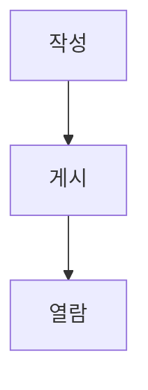

# 공지 PRD

## Applicability
| Contract | Required / N/A | Evidence |
|---|---|---|
| Pages/routes | Required | 관리자가 공지를 작성하고 직원이 읽는 화면 |
| State matrix | Required | 목록과 편집 저장의 사용자 가시 상태 |
| User flow | Required | 작성부터 게시·열람까지 다단계 |

## Context and problem
팀 공지를 한 곳에서 작성하고 읽는다.

## Goals
공지 게시와 열람을 제공한다.

## Non-goals
외부 공개는 제외한다.

## Users, roles, and permissions
관리자만 작성하고 직원은 읽는다.

## Functional requirements
| ID | Requirement | Priority |
|---|---|---|
| FR-101 | 관리자는 공지를 게시한다. | P0 |

## Pages and routes
| Page | Route | Roles |
|---|---|---|
| 공지 | `/notices` | 관리자, 직원 |

## State matrix
| Surface | Empty | Loading | Error | Success | Recovery |
|---|---|---|---|---|---|
| 목록 | 안내 | spinner | 오류 | 목록 | 재시도 |

## User flow

## Authorization and data boundaries
서버가 관리자 역할을 검사한다.

## Non-functional requirements
기존 서비스 기준을 따른다.

## Acceptance criteria
| ID | Requirement | Given | When | Then | Verification |
|---|---|---|---|---|---|
| AC-101 | FR-101 | 관리자 | 게시 | 공지가 저장된다 | 통합 테스트 |

## Assumptions and open decisions
없음.

## Risks and mitigations
권한 우회는 서버 검사로 막는다.

## Delivery
| Phase | Requirement IDs | Verifiable exit condition |
|---|---|---|
| Phase 1 | FR-101 | 통합 테스트 통과 |
