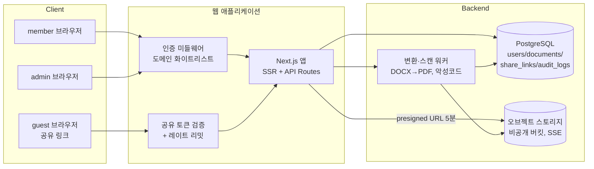
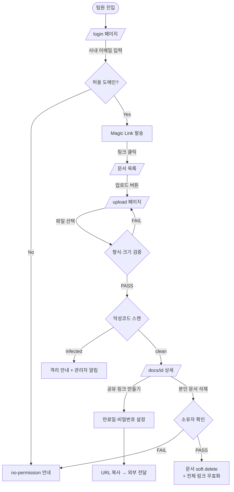
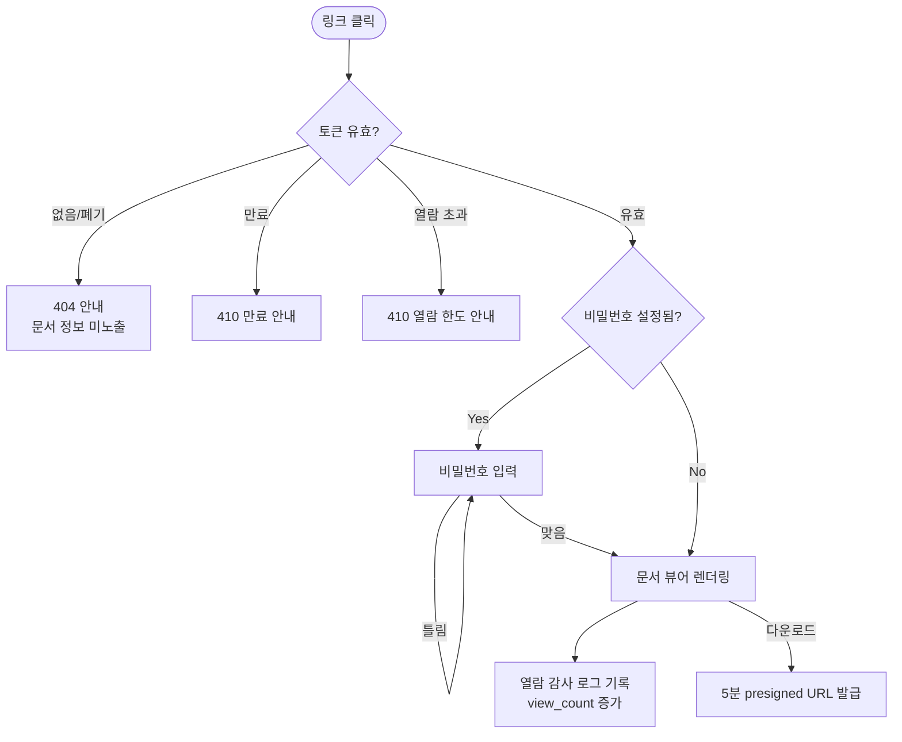
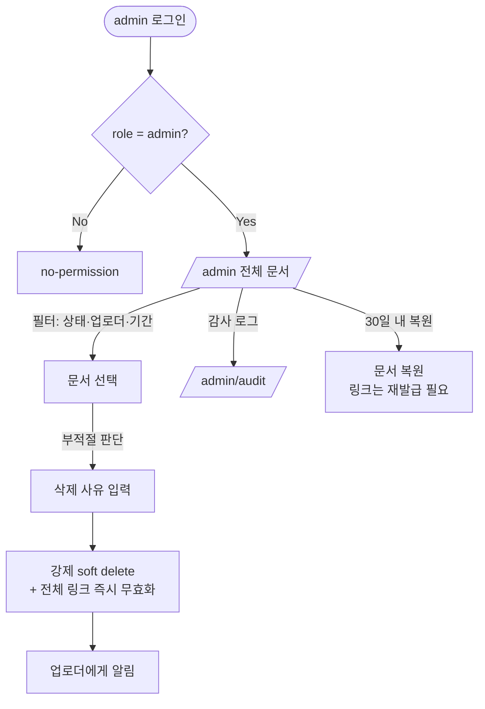

# 사내 문서 공유 서비스 (Internal Document Sharing) PRD

> **Version**: 1.0
> **Created**: 2026-07-26
> **Status**: Draft
> **Type**: product-feature

## 1. Overview

### 1.1 Problem Statement

팀원이 작성한 문서(제안서, 계약서 초안, 리서치 자료 등 PDF/DOCX)를 외부 협력사·고객에게 전달할 때 현재는 이메일 첨부 또는 개인 클라우드 드라이브 링크를 사용한다. 이로 인해 다음 문제가 발생한다.

- **버전 파편화**: 같은 문서의 서로 다른 사본이 메일함마다 존재해 어떤 것이 최신인지 알 수 없다.
- **회수 불가**: 한 번 보낸 첨부파일은 회수할 수 없다. 잘못된 문서를 보내도 되돌릴 방법이 없다.
- **통제 부재**: 누가 어떤 문서를 외부에 전달했는지 조직이 파악하지 못한다. 부적절한 문서(기밀 유출, 잘못된 자료)가 유통돼도 관리자가 개입할 수단이 없다.
- **외부 마찰**: 외부 열람자에게 계정 가입을 요구하면 전달이 지연되거나 아예 이뤄지지 않는다.

즉, **"사내에서 올리고, 외부에는 링크 한 줄로 전달하되, 조직이 통제권을 잃지 않는"** 경로가 없다.

### 1.2 Goals

- 팀원이 PDF/DOCX 문서를 업로드하고 **링크 하나로** 외부에 공유할 수 있게 한다.
- 링크 수령자는 **계정 없이** 브라우저에서 문서를 열람할 수 있게 한다.
- 관리자가 조직 내 **모든 문서를 조회하고 부적절한 문서를 삭제**할 수 있게 한다.
- 문서 삭제·링크 폐기 시 **기존에 배포된 링크가 즉시 무효화**되어 회수가 실질적으로 동작하게 한다.
- 누가 무엇을 올리고 공유했으며 누가 열람했는지 **감사 로그**로 남긴다.

### 1.3 Non-Goals (Out of Scope)

- 문서 편집·공동 작성(Google Docs류 실시간 협업) — 열람 전용이다.
- 문서 본문 전문(full-text) 검색 — v1은 파일명·업로더·업로드일 기준 필터만 제공.
- 폴더 트리·계층적 디렉터리 구조 — v1은 플랫한 문서 목록.
- 워터마크, DRM, 화면 캡처 방지 등 열람자 단말 제어.
- 외부 열람자 계정 시스템(가입/로그인) — 링크 기반 접근만.
- PDF/DOCX 외 파일 형식(PPTX, XLSX, 이미지, ZIP).
- 모바일 네이티브 앱 — 반응형 웹으로 대응.
- SSO(SAML/OIDC) 연동 — v1은 사내 이메일 도메인 기반 인증.

### 1.4 Scope

| 포함 | 제외 |
|------|------|
| 사내 이메일 도메인 기반 로그인 | SSO(SAML/OIDC), 소셜 로그인 |
| PDF/DOCX 업로드 (파일당 ≤ 50MB) | PPTX/XLSX/이미지/ZIP 업로드 |
| 문서 목록 조회 + 파일명/업로더/기간 필터 | 문서 본문 전문 검색 |
| 공유 링크 생성 (만료일·폐기 지원) | 열람자별 개별 계정 발급 |
| 링크를 통한 외부 열람(로그인 불필요) | 워터마크·다운로드 차단·DRM |
| 본인 문서 삭제 | 휴지통/복원 (v1은 soft delete + 관리자 복원만) |
| 관리자 전체 문서 조회 및 강제 삭제 | 조직/부서 단위 권한 위임 |
| 업로드·공유·열람·삭제 감사 로그 | BI 수준 사용 통계 대시보드 |
| 반응형 웹 (Desktop/Mobile) | 네이티브 모바일 앱 |

## 2. User Stories

### 2.1 Primary User

- **As a 사내 팀원(`member`)**, I want to 문서를 업로드하고 링크를 복사해 외부 협력사에 보내고 싶다, so that 메일 첨부·용량 제한·버전 혼란 없이 최신 문서 한 부만 전달할 수 있다.
- **As a 링크 수령자(`guest`)**, I want to 받은 링크를 클릭해 별도 가입 없이 브라우저에서 바로 문서를 보고 싶다, so that 자료 확인에 드는 마찰이 없다.
- **As a 관리자(`admin`)**, I want to 조직의 모든 문서를 조회하고 부적절한 문서를 삭제하고 싶다, so that 기밀 유출·오배포를 발견 즉시 차단할 수 있다.

### 2.2 Acceptance Criteria (Gherkin)

```gherkin
Scenario: 사내 팀원이 문서를 업로드한다
  Given 사내 이메일 도메인 계정으로 로그인한 member가 /upload 페이지에 있고
  When 25MB짜리 PDF 파일을 선택하고 "업로드"를 누르면
  Then 업로드가 성공하고 문서 상세 페이지(/docs/{id})로 이동하며
  And 문서 목록(/)에 해당 문서가 "나의 문서"로 표시된다

Scenario: 허용되지 않은 파일 형식 업로드를 거부한다
  Given member가 /upload 페이지에 있고
  When 확장자가 .pdf 이지만 실제 내용이 실행 파일인 파일을 업로드하면
  Then 서버가 매직 넘버(content sniffing) 검사로 이를 감지하고
  And 400 INVALID_FILE_TYPE 에러와 "PDF 또는 DOCX 파일만 업로드할 수 있습니다" 메시지를 표시한다

Scenario: 공유 링크를 생성한다
  Given member가 본인이 업로드한 문서 상세 페이지에 있고
  When "공유 링크 만들기"를 누르고 만료일을 7일로 선택하면
  Then 추측 불가능한 토큰이 포함된 URL(/s/{token})이 생성되고
  And 클립보드 복사 버튼과 만료 일시가 화면에 표시된다

Scenario: 외부인이 링크로 문서를 열람한다
  Given 유효한 공유 링크 URL을 가진 비로그인 guest가 있고
  When 해당 URL로 접속하면
  Then 로그인 없이 문서 뷰어가 렌더링되고
  And 열람 이벤트(토큰, 접속 시각, IP, User-Agent)가 감사 로그에 기록된다

Scenario: 만료된 링크는 열람할 수 없다
  Given 만료일이 지난 공유 링크가 있고
  When guest가 해당 URL로 접속하면
  Then 410 LINK_EXPIRED 상태와 "이 링크는 만료되었습니다. 공유한 담당자에게 문의하세요." 안내가 표시되고
  And 문서 내용이나 파일명이 노출되지 않는다

Scenario: 관리자가 부적절한 문서를 삭제한다
  Given admin이 /admin 페이지에서 전체 문서 목록을 보고 있고
  When 특정 문서를 선택하고 삭제 사유를 입력한 뒤 "삭제"를 확인하면
  Then 문서가 soft delete 처리되고 해당 문서의 모든 공유 링크가 즉시 무효화되며
  And 이후 그 링크로 접속하면 404 DOCUMENT_NOT_FOUND가 반환되고
  And 삭제 행위(관리자 ID, 사유, 시각)가 감사 로그에 기록된다

Scenario: 다른 팀원의 문서는 삭제할 수 없다
  Given member A가 로그인해 있고 문서 D는 member B가 업로드했으며
  When member A가 DELETE /api/v1/documents/{D} 를 직접 호출하면
  Then 403 FORBIDDEN이 반환되고 문서는 삭제되지 않는다
```

### 2.3 User Roles

> **목적**: 역할을 영문 문자열로 통일 선언. 이후 페이지 권한·API authorization·`/screen-spec` Audience 매핑의 단일 키로 사용.

| Role Key | 한국어 명칭 | 권한 범위 | 비고 |
|----------|------------|----------|------|
| `guest` | 링크 수령자(외부인) | 유효한 공유 토큰을 가진 문서 1건에 대해서만 read | 로그인 없음. 세션 없음. 토큰이 곧 권한 |
| `member` | 사내 팀원 | 전체 문서 목록 read, 문서 create, **본인 문서** update/delete, 본인 문서의 공유 링크 create/revoke | 사내 이메일 도메인 계정. RLS 적용 |
| `admin` | 관리자 | 전체 문서 read/delete, 전체 공유 링크 revoke, 감사 로그 read, member 목록 read | `member` 권한 포함. service_role |

**규칙**:
- Role Key는 영문 소문자 단일 단어를 사용한다.
- 이후 모든 페이지/API 명세에서 이 키를 그대로 인용한다.
- `guest`는 계정이 아니라 **"유효 토큰 보유 상태"** 를 가리키는 의사(pseudo) 역할이다. 서버는 `guest` 요청에 대해 토큰이 지정하는 **단일 문서 1건**만 반환해야 하며, 목록·검색·타 문서 접근은 어떤 경우에도 허용하지 않는다.

## 3. Functional Requirements

| ID | Requirement | Priority | Dependencies |
|----|------------|----------|--------------|
| FR-001 | 사내 이메일 도메인(허용 도메인 화이트리스트) 계정으로 로그인/로그아웃할 수 있다. 화이트리스트 외 도메인은 가입·로그인 불가 | P0 (Must) | - |
| FR-002 | `member`는 PDF/DOCX 파일을 업로드할 수 있다. 파일당 최대 50MB, 확장자 + 매직 넘버 이중 검증, 사용자당 총 저장 용량 5GB 제한 | P0 (Must) | FR-001 |
| FR-003 | `member`는 조직의 문서 목록을 조회할 수 있다. 파일명 부분일치, 업로더, 업로드 기간으로 필터링하며 20건 단위 페이지네이션 | P0 (Must) | FR-002 |
| FR-004 | `member`는 문서 상세(파일명, 업로더, 크기, 업로드일, 열람 수, 공유 링크 목록)를 조회하고 원본을 다운로드할 수 있다 | P0 (Must) | FR-002 |
| FR-005 | `member`는 본인 문서에 대해 공유 링크를 생성할 수 있다. 토큰은 CSPRNG 기반 128비트 이상 랜덤값이며 URL-safe 인코딩한다. 생성 시 만료일을 지정한다(기본 7일, 최대 90일) | P0 (Must) | FR-004 |
| FR-006 | `guest`는 공유 링크 URL로 로그인 없이 문서를 열람할 수 있다. 뷰어는 브라우저 내 렌더링(PDF: 인라인 뷰어, DOCX: 서버 측 PDF 변환 후 렌더링)을 기본으로 하고 다운로드 버튼을 제공한다 | P0 (Must) | FR-005 |
| FR-007 | 공유 링크는 만료일 도과, 소유자 폐기(revoke), 문서 삭제 중 하나라도 발생하면 즉시 무효화된다. 무효 링크 접근 시 문서 내용·파일명·업로더를 노출하지 않는다 | P0 (Must) | FR-005 |
| FR-008 | `member`는 본인이 업로드한 문서를 삭제(soft delete)할 수 있다. 삭제 시 해당 문서의 모든 공유 링크가 함께 무효화된다 | P0 (Must) | FR-004 |
| FR-009 | `admin`은 조직의 모든 문서를 조회하고, 부적절한 문서를 사유와 함께 강제 삭제할 수 있다. 강제 삭제된 문서는 업로더 화면에서도 "관리자에 의해 삭제됨" 상태로 표시된다 | P0 (Must) | FR-003 |
| FR-010 | 업로드/링크 생성/링크 폐기/열람/다운로드/삭제 이벤트를 감사 로그에 기록한다. 로그 항목: 액터(user_id 또는 token_id), 액션, 대상 문서, 시각, IP, User-Agent | P0 (Must) | FR-002, FR-006 |
| FR-011 | `admin`은 감사 로그를 문서별·기간별로 조회할 수 있다 | P1 (Should) | FR-010 |
| FR-012 | 공유 링크 열람 시 접근 제한 옵션을 설정할 수 있다: (a) 열람 비밀번호, (b) 최대 열람 횟수. 미설정 시 만료일까지 무제한 열람 | P1 (Should) | FR-005 |
| FR-013 | 업로드된 파일에 대해 백그라운드 악성코드 스캔을 수행하고, 감염 판정 시 문서를 자동 격리하고 업로더·관리자에게 알린다. 스캔 완료 전에는 공유 링크 생성이 차단된다 | P1 (Should) | FR-002 |
| FR-014 | 공유 링크 엔드포인트에 IP 기준 레이트 리밋(분당 30회)을 적용해 토큰 대량 추측(enumeration) 시도를 차단하고, 임계 초과 시 감사 로그에 경고를 남긴다 | P1 (Should) | FR-006 |
| FR-015 | `admin`이 삭제한 문서를 보존 기간(30일) 내에 복원할 수 있다. 복원 시 공유 링크는 무효 상태를 유지하며 재발급이 필요하다 | P2 (Could) | FR-009 |
| FR-016 | 문서 업로드 시 만료 정책(기본 보존 1년)을 지정하고, 만료 도래 문서를 배치로 자동 정리한다 | P2 (Could) | FR-002 |

## 4. Non-Functional Requirements

### 4.0 Scale Grade (규모 등급)

**선택 등급: Startup (소규모 서비스)** — 브리프의 "초기 스타트업 수준" 진술에 근거한다.

| 항목 | 값 |
|------|-----|
| 예상 DAU | 300–800 (사내 팀원 기준) + 외부 링크 열람자 일 200–500회 |
| 피크 동시접속 | 100–300 |
| 등급 근거 | 사내 전 구성원 사용 + 외부 열람 트래픽. 서비스가 1시간 중단되면 문서 전달이 지연되지만 매출 직접 손실은 없음 |

| 등급 | 일일 사용자(DAU) | 동시접속 | 데이터량 | 추천 인프라 비용 |
|------|-----------------|---------|---------|----------------|
| **Startup (선택)** | 1,000 ≤ DAU < 10,000 | 100 ≤ CC < 1,000 | 1-10GB | $20-100/월 |

> 안정적인 관리형 DB + 오브젝트 스토리지 + 기본 모니터링(에러 추적, 업타임 체크) 수준이면 충분하다. 오토스케일링·메시지 큐·멀티 리전은 v1 범위 밖이다.

### 4.1 Performance SLA

| 지표 | 목표값 |
|------|--------|
| Response Time (p95) — 목록/상세 API | < 500ms |
| Response Time (p95) — 공유 링크 첫 렌더 | < 1.5s (10MB 문서 기준) |
| 업로드 처리 (50MB 파일) | < 30s (10Mbps 업링크 가정) |
| DOCX → PDF 변환 | < 20s (비동기 처리, 완료 전 "변환 중" 상태 노출) |
| Throughput (RPS) | 50 RPS (피크) |

### 4.2 Availability SLA

| 항목 | 값 |
|------|-----|
| 목표 Uptime | 99% (Startup 등급) |
| 허용 다운타임(월) | 7.3시간 |
| 계획 점검 | 업무 시간 외(23:00–06:00 KST) 공지 후 수행 |

### 4.3 Data Requirements

| 항목 | 값 |
|------|-----|
| 현재 데이터량 | 0 (신규 서비스) |
| 1년 후 예상 문서 저장량 | 약 5–8GB (월 300건 × 평균 2MB × 12개월 + 변환본) |
| 월간 증가율 | 약 8% |
| 문서 보존 기간 | 기본 1년 (FR-016), soft delete 후 30일 경과 시 물리 삭제 |
| 감사 로그 보존 기간 | 1년 |
| 백업 | 일 1회 스냅샷, 7일 보관 |

### 4.4 Recovery

| 항목 | 목표값 |
|------|--------|
| RTO (복구 시간) | 8시간 |
| RPO (복구 시점) | 24시간 (일 1회 백업 기준) |

### 4.5 Security

- **Authentication**:
  - `member`/`admin`: **Required** — 사내 이메일 도메인 화이트리스트 기반 인증. 세션은 HttpOnly + Secure + SameSite=Lax 쿠키.
  - `guest`: **None (의도된 설계)** — 공유 링크 토큰이 유일한 접근 자격이다. 이는 "외부인이 가입 없이 열람"이라는 핵심 요구를 만족시키기 위한 의도적 결정이며, 아래 보완 통제를 **함께 구현하는 조건**에서만 허용한다.
- **공유 토큰 보완 통제 (필수)**:
  - 토큰은 CSPRNG 128비트 이상, URL-safe base64. 순차 ID·UUIDv1·타임스탬프 파생값 금지.
  - DB에는 토큰 원문이 아닌 해시(SHA-256)를 저장한다.
  - 기본 만료 7일, 최대 90일. 무기한 링크는 생성 불가.
  - 공유 뷰어 페이지에 `<meta name="robots" content="noindex, nofollow">` 및 `X-Robots-Tag: noindex` 헤더를 적용해 검색엔진 색인을 차단한다.
  - `Referrer-Policy: no-referrer` 를 적용해 외부 링크 클릭 시 토큰이 Referer 헤더로 유출되지 않게 한다.
  - 공유 엔드포인트 IP 레이트 리밋 분당 30회(FR-014). 초과 시 429.
  - 무효/존재하지 않는 토큰의 응답은 상태 코드만 다르고 본문에 문서 메타데이터를 포함하지 않는다.
- **Authorization**:
  - 모든 문서 변경 API는 서버 측에서 소유자 검사를 수행한다. 클라이언트가 보낸 role/owner 값을 신뢰하지 않는다.
  - `admin` 판정은 DB의 role 컬럼으로만 하고, 요청 파라미터·헤더로 승격 불가.
  - 목록 조회는 `member` 이상만 가능하며, `guest` 토큰으로는 어떤 목록 API도 호출할 수 없다.
- **Data encryption**:
  - In transit: 전 구간 TLS 1.2+ (HSTS 적용).
  - At rest: 오브젝트 스토리지 서버측 암호화(SSE), DB 볼륨 암호화.
  - 원본 파일은 공개 버킷에 두지 않는다. 다운로드는 단기(5분) presigned URL 또는 애플리케이션 프록시로만 제공한다.
- **File safety**: 확장자 + 매직 넘버 이중 검증(FR-002), 업로드 파일명 정규화(경로 순회·스크립트 문자 제거), 백그라운드 악성코드 스캔(FR-013), 뷰어 렌더링 시 CSP 적용.
- **Audit**: FR-010의 감사 로그는 append-only로 취급하며 애플리케이션 경로에서 수정/삭제 API를 제공하지 않는다.

### 4.6 Quality

- 핵심 권한 로직(문서 소유자 검사, 토큰 유효성 검사, admin 판정)은 단위 테스트 커버리지 90% 이상.
- FR-007(링크 무효화 3경로)·FR-009(관리자 강제 삭제)는 통합 테스트 필수.
- 에러 응답은 `{ error: { code, message } }` 형태로 통일하고, 내부 스택 트레이스·파일 경로를 노출하지 않는다.

## 5. Technical Design

### 5.1 API Specification

공통 사항:
- Base URL: `/api/v1`
- 인증: `member`/`admin` 엔드포인트는 세션 쿠키 기반. `guest` 엔드포인트는 URL 경로의 토큰만 사용.
- 에러 형식: `{ "error": { "code": "STRING_CODE", "message": "사용자 노출 문구" } }`
- 공통 에러: `401 UNAUTHORIZED`(미인증), `403 FORBIDDEN`(권한 부족), `429 RATE_LIMITED`, `500 INTERNAL_ERROR`

#### `POST /api/v1/auth/login`
- **Description**: 사내 이메일로 로그인 링크(Magic Link)를 발송한다.
- **Auth**: None
- **Request**: `email` (string, required)
- **Response 200**: `{ "sent": true }` — 이메일 존재 여부와 무관하게 동일 응답(계정 열거 방지)
- **Errors**: `400 INVALID_EMAIL`(형식 오류), `403 DOMAIN_NOT_ALLOWED`(허용 도메인 아님 — 안내 목적상 명시), `429 RATE_LIMITED`(동일 이메일 5분 3회 초과)

#### `POST /api/v1/auth/verify`
- **Description**: Magic Link 토큰을 검증하고 세션을 발급한다.
- **Auth**: None
- **Request**: `token` (string, required)
- **Response 200**: `{ "user": { "id", "email", "name", "role" } }` + Set-Cookie(session)
- **Errors**: `400 INVALID_TOKEN`, `410 TOKEN_EXPIRED`(발급 후 15분 초과)

#### `POST /api/v1/documents`
- **Description**: 문서를 업로드한다. `multipart/form-data`.
- **Auth**: Required (`member`, `admin`)
- **Request**: `file` (binary, required, ≤50MB, PDF/DOCX), `title` (string, optional — 미지정 시 파일명 사용)
- **Response 201**: `{ "id", "title", "fileName", "sizeBytes", "mimeType", "scanStatus": "pending", "uploadedAt", "uploader": { "id", "name" } }`
- **Errors**: `400 INVALID_FILE_TYPE`(확장자/매직 넘버 불일치), `413 FILE_TOO_LARGE`(50MB 초과), `507 QUOTA_EXCEEDED`(사용자 저장 용량 5GB 초과)

#### `GET /api/v1/documents`
- **Description**: 조직 문서 목록을 조회한다. soft delete된 문서는 제외한다.
- **Auth**: Required (`member`, `admin`)
- **Request**: `q` (string, optional — 파일명 부분일치), `uploaderId` (string, optional), `from`/`to` (ISO date, optional), `cursor` (string, optional), `limit` (int, optional, default 20, max 100)
- **Response 200**: `{ "items": [ { "id", "title", "fileName", "sizeBytes", "uploadedAt", "uploader", "shareLinkCount", "viewCount" } ], "nextCursor": string | null }`
- **Errors**: `400 INVALID_QUERY`(날짜 형식·limit 범위 오류)

#### `GET /api/v1/documents/{id}`
- **Description**: 문서 상세와 해당 문서의 공유 링크 목록을 조회한다. 공유 링크 목록은 소유자 또는 `admin`에게만 포함된다.
- **Auth**: Required (`member`, `admin`)
- **Response 200**: `{ "id", "title", "fileName", "sizeBytes", "mimeType", "scanStatus", "uploadedAt", "uploader", "viewCount", "shareLinks": [ { "id", "url", "expiresAt", "revokedAt", "viewCount", "hasPassword", "maxViews" } ] }`
- **Errors**: `404 DOCUMENT_NOT_FOUND`(미존재 또는 삭제됨)

#### `GET /api/v1/documents/{id}/download`
- **Description**: 원본 파일 다운로드용 단기 presigned URL을 발급한다.
- **Auth**: Required (`member`, `admin`)
- **Response 200**: `{ "url": "https://...", "expiresIn": 300 }`
- **Errors**: `404 DOCUMENT_NOT_FOUND`, `409 SCAN_IN_PROGRESS`(악성코드 스캔 미완료), `423 DOCUMENT_QUARANTINED`(감염 격리됨)

#### `DELETE /api/v1/documents/{id}`
- **Description**: 문서를 soft delete한다. 해당 문서의 모든 공유 링크를 즉시 무효화한다.
- **Auth**: Required — 문서 소유자(`member`) 또는 `admin`
- **Request**: `reason` (string, `admin`이 타인 문서를 삭제할 때 required, ≤500자)
- **Response 200**: `{ "id", "deletedAt", "revokedLinkCount" }`
- **Errors**: `403 FORBIDDEN`(타인 문서를 `member`가 삭제 시도), `404 DOCUMENT_NOT_FOUND`, `400 REASON_REQUIRED`

#### `POST /api/v1/documents/{id}/share-links`
- **Description**: 공유 링크를 생성한다. 토큰 원문은 이 응답에서 **단 한 번만** 반환된다(DB에는 해시 저장).
- **Auth**: Required — 문서 소유자(`member`) 또는 `admin`
- **Request**: `expiresInDays` (int, optional, default 7, max 90), `password` (string, optional, 8자 이상), `maxViews` (int, optional, ≥1)
- **Response 201**: `{ "id", "url": "https://.../s/{token}", "expiresAt", "hasPassword", "maxViews" }`
- **Errors**: `403 FORBIDDEN`, `404 DOCUMENT_NOT_FOUND`, `409 SCAN_IN_PROGRESS`(스캔 완료 전 공유 차단), `400 INVALID_EXPIRY`(0 이하 또는 90 초과)

#### `DELETE /api/v1/share-links/{linkId}`
- **Description**: 공유 링크를 즉시 폐기한다.
- **Auth**: Required — 링크 소유자(`member`) 또는 `admin`
- **Response 200**: `{ "id", "revokedAt" }`
- **Errors**: `403 FORBIDDEN`, `404 LINK_NOT_FOUND`

#### `GET /api/v1/share/{token}`
- **Description**: 공유 링크 열람용 문서 메타데이터를 반환한다. 토큰이 지정하는 **단일 문서 1건**만 반환하며 목록·검색을 제공하지 않는다. 호출 시 열람 이벤트를 기록한다.
- **Auth**: None (`guest`) — 토큰이 유일한 자격
- **Request**: `password` (string, 링크에 비밀번호가 설정된 경우 required — 헤더 `X-Share-Password`로 전달)
- **Response 200**: `{ "title", "fileName", "sizeBytes", "mimeType", "viewUrl": "https://... (5분 만료)", "downloadUrl": "https://... (5분 만료)", "expiresAt" }`
- **Errors**: `401 PASSWORD_REQUIRED`(비밀번호 미입력), `403 PASSWORD_INCORRECT`, `404 LINK_NOT_FOUND`(존재하지 않거나 폐기됨 — 문서 메타데이터 미포함), `410 LINK_EXPIRED`, `410 VIEW_LIMIT_EXCEEDED`, `423 DOCUMENT_QUARANTINED`, `429 RATE_LIMITED`(IP 분당 30회 초과)

#### `GET /api/v1/admin/documents`
- **Description**: 삭제·격리 문서를 포함한 전체 문서를 조회한다.
- **Auth**: Required (`admin`)
- **Request**: `status` (enum: `active` | `deleted` | `quarantined` | `all`, default `all`), `q`, `uploaderId`, `from`/`to`, `cursor`, `limit`
- **Response 200**: `{ "items": [ { "id", "title", "uploader", "status", "uploadedAt", "deletedAt", "deletedBy", "deleteReason", "shareLinkCount", "viewCount" } ], "nextCursor": string | null }`
- **Errors**: `403 FORBIDDEN`

#### `GET /api/v1/admin/audit-logs`
- **Description**: 감사 로그를 조회한다.
- **Auth**: Required (`admin`)
- **Request**: `documentId` (string, optional), `actorId` (string, optional), `action` (enum: `upload` | `share_create` | `share_revoke` | `view` | `download` | `delete`, optional), `from`/`to`, `cursor`, `limit`
- **Response 200**: `{ "items": [ { "id", "action", "actorType": "user" | "share_token", "actorId", "documentId", "ip", "userAgent", "createdAt" } ], "nextCursor": string | null }`
- **Errors**: `403 FORBIDDEN`

#### `POST /api/v1/admin/documents/{id}/restore`
- **Description**: soft delete된 문서를 복원한다(FR-015). 공유 링크는 무효 상태를 유지한다.
- **Auth**: Required (`admin`)
- **Response 200**: `{ "id", "restoredAt" }`
- **Errors**: `403 FORBIDDEN`, `404 DOCUMENT_NOT_FOUND`, `410 RETENTION_EXPIRED`(30일 경과로 물리 삭제됨)

### 5.2 Database Schema

```sql
-- 사용자 (사내 팀원 / 관리자)
CREATE TABLE users (
  id           UUID PRIMARY KEY DEFAULT gen_random_uuid(),
  email        CITEXT NOT NULL UNIQUE,           -- 사내 도메인 화이트리스트 검증 후 생성
  name         TEXT NOT NULL,
  role         TEXT NOT NULL DEFAULT 'member',   -- 'member' | 'admin'
  created_at   TIMESTAMPTZ NOT NULL DEFAULT now(),
  last_login_at TIMESTAMPTZ,
  CONSTRAINT users_role_chk CHECK (role IN ('member', 'admin'))
);

-- 문서
CREATE TABLE documents (
  id            UUID PRIMARY KEY DEFAULT gen_random_uuid(),
  uploader_id   UUID NOT NULL REFERENCES users(id) ON DELETE RESTRICT,
  title         TEXT NOT NULL,
  file_name     TEXT NOT NULL,                   -- 정규화된 원본 파일명
  storage_key   TEXT NOT NULL,                   -- 비공개 버킷 오브젝트 키
  mime_type     TEXT NOT NULL,                   -- application/pdf | application/vnd.openxmlformats-officedocument.wordprocessingml.document
  size_bytes    BIGINT NOT NULL,
  checksum      TEXT NOT NULL,                   -- SHA-256, 중복 업로드 감지용
  scan_status   TEXT NOT NULL DEFAULT 'pending', -- 'pending' | 'clean' | 'infected'
  preview_key   TEXT,                            -- DOCX→PDF 변환본 키 (PDF 원본은 NULL)
  status        TEXT NOT NULL DEFAULT 'active',  -- 'active' | 'deleted' | 'quarantined'
  view_count    INTEGER NOT NULL DEFAULT 0,
  expires_at    TIMESTAMPTZ,                     -- 보존 정책 (FR-016)
  deleted_at    TIMESTAMPTZ,
  deleted_by    UUID REFERENCES users(id),
  delete_reason TEXT,
  created_at    TIMESTAMPTZ NOT NULL DEFAULT now(),
  CONSTRAINT documents_size_chk CHECK (size_bytes > 0 AND size_bytes <= 52428800),
  CONSTRAINT documents_status_chk CHECK (status IN ('active','deleted','quarantined')),
  CONSTRAINT documents_scan_chk CHECK (scan_status IN ('pending','clean','infected'))
);
CREATE INDEX idx_documents_uploader ON documents(uploader_id, created_at DESC);
CREATE INDEX idx_documents_status ON documents(status, created_at DESC);

-- 공유 링크
CREATE TABLE share_links (
  id             UUID PRIMARY KEY DEFAULT gen_random_uuid(),
  document_id    UUID NOT NULL REFERENCES documents(id) ON DELETE CASCADE,
  created_by     UUID NOT NULL REFERENCES users(id) ON DELETE RESTRICT,
  token_hash     TEXT NOT NULL UNIQUE,           -- SHA-256(token). 원문은 저장하지 않음
  password_hash  TEXT,                           -- bcrypt/argon2, NULL이면 비밀번호 없음
  max_views      INTEGER,                        -- NULL이면 무제한
  view_count     INTEGER NOT NULL DEFAULT 0,
  expires_at     TIMESTAMPTZ NOT NULL,           -- NOT NULL: 무기한 링크 금지
  revoked_at     TIMESTAMPTZ,
  created_at     TIMESTAMPTZ NOT NULL DEFAULT now(),
  CONSTRAINT share_links_maxviews_chk CHECK (max_views IS NULL OR max_views >= 1)
);
CREATE INDEX idx_share_links_document ON share_links(document_id);
CREATE INDEX idx_share_links_lookup ON share_links(token_hash) WHERE revoked_at IS NULL;

-- 감사 로그 (append-only)
CREATE TABLE audit_logs (
  id           BIGSERIAL PRIMARY KEY,
  action       TEXT NOT NULL,                    -- upload | share_create | share_revoke | view | download | delete | restore | rate_limit_warn
  actor_type   TEXT NOT NULL,                    -- 'user' | 'share_token' | 'system'
  actor_id     TEXT,                             -- user_id 또는 share_link_id
  document_id  UUID REFERENCES documents(id) ON DELETE SET NULL,
  ip           INET,
  user_agent   TEXT,
  metadata     JSONB,                            -- 삭제 사유, 실패 코드 등
  created_at   TIMESTAMPTZ NOT NULL DEFAULT now()
);
CREATE INDEX idx_audit_document ON audit_logs(document_id, created_at DESC);
CREATE INDEX idx_audit_action ON audit_logs(action, created_at DESC);
```

**접근 제어 규칙(RLS 수준)**:
- `documents` SELECT: `member`는 `status='active'` 행만, `admin`은 전체.
- `documents` UPDATE/DELETE: `uploader_id = current_user_id` 또는 `admin`.
- `share_links` SELECT: 문서 소유자 또는 `admin`. `guest` 경로는 RLS를 우회하지 않고 서버 측 전용 조회 함수(토큰 해시 일치 + 미폐기 + 미만료)로만 접근한다.
- `audit_logs`: 애플리케이션 경로에서 INSERT/SELECT만. UPDATE/DELETE 권한 부여 금지.

### 5.3 Architecture Diagram



### 5.4 Pages

| Route | Audience | Auth | Linked FRs | Has FE Components | Primary State | Responsive |
|-------|----------|------|-----------|-------------------|---------------|-----------|
| `/login` | guest | Optional | FR-001 | Yes | success / error | Desktop / Mobile |
| `/` (문서 목록) | member, admin | Required | FR-003 | Yes | success / empty | Desktop / Mobile |
| `/upload` | member, admin | Required | FR-002, FR-013 | Yes | success / error | Desktop / Mobile |
| `/docs/{id}` | member, admin | Required | FR-004, FR-005, FR-008 | Yes | success / error | Desktop / Mobile |
| `/s/{token}` (공유 열람) | guest, member, admin | **None (토큰)** | FR-006, FR-007, FR-012, FR-014 | Yes | success / error | Desktop / Mobile |
| `/admin` (전체 문서) | admin | Required | FR-009, FR-015 | Yes | success / empty | Desktop only |
| `/admin/audit` (감사 로그) | admin | Required | FR-010, FR-011 | Yes | success / empty | Desktop only |
| `/api/v1/*` | - | Required (`/share/*` 제외) | FR-001~FR-016 | **No** (API) | - | - |

**규칙**:
- `Audience`는 §2.3 Role Key를 그대로 사용한다.
- `/s/{token}`은 유일하게 인증 없이 접근 가능한 페이지이며, 토큰 검증 실패 시 문서 메타데이터를 일절 노출하지 않는다.

### 5.4.1 Page State Matrix

| Route | loading | empty | error | success | no-permission | 비고 |
|-------|---------|-------|-------|---------|---------------|------|
| `/login` | ✓ | - | ✓ | ✓ | ✓ | 허용 도메인 외 이메일 → no-permission 안내 |
| `/` | ✓ | ✓ | ✓ | ✓ | - | 문서 0건 시 empty("아직 업로드된 문서가 없습니다") |
| `/upload` | ✓ | - | ✓ | ✓ | - | 업로드 진행률 표시, 스캔 대기 시 "검사 중" 배지 |
| `/docs/{id}` | ✓ | - | ✓ | ✓ | ✓ | 타인 문서에서는 삭제/공유 버튼 미노출(no-permission) |
| `/s/{token}` | ✓ | - | ✓ | ✓ | ✓ | 만료/폐기/열람 초과 → error, 비밀번호 필요 → no-permission 입력 폼 |
| `/admin` | ✓ | ✓ | ✓ | ✓ | ✓ | admin 아니면 no-permission, 필터 결과 0건 시 empty |
| `/admin/audit` | ✓ | ✓ | ✓ | ✓ | ✓ | 기간 필터 결과 0건 시 empty |

**상태 정의**:
- `loading`: 데이터 fetch 중 (스피너/스켈레톤)
- `empty`: 정상 응답이지만 결과 0건
- `error`: 4xx/5xx 응답 또는 클라이언트 검증 실패
- `success`: 정상 응답 + 결과 ≥1건
- `no-permission`: 인증은 됐으나 권한 부족, 또는 추가 자격(공유 비밀번호) 필요

**규칙**: 체크된 상태(✓)마다 `/screen-spec`에서 1줄 이상 마이크로카피 또는 UI 처리를 명시한다.

### 5.5 User Flow

#### Flow A: 사내 팀원 (업로드 → 공유)



#### Flow B: 외부 링크 수령자



#### Flow C: 관리자



## 6. Implementation Phases

### Phase 1: MVP

- [ ] 사내 이메일 도메인 화이트리스트 + Magic Link 인증 (FR-001)
- [ ] DB 스키마 및 RLS 정책 구성 (users / documents / share_links / audit_logs)
- [ ] PDF/DOCX 업로드 + 확장자·매직 넘버 이중 검증 + 용량 제한 (FR-002)
- [ ] 문서 목록/상세/다운로드 (FR-003, FR-004)
- [ ] 공유 링크 생성(CSPRNG 토큰, 해시 저장, 만료일) (FR-005)
- [ ] 공유 링크 열람 페이지 `/s/{token}` + noindex/no-referrer 헤더 (FR-006)
- [ ] 링크 무효화 3경로(만료·폐기·문서 삭제) (FR-007)
- [ ] 본인 문서 삭제 (FR-008)
- [ ] 관리자 전체 문서 조회 + 강제 삭제(사유 필수) (FR-009)
- [ ] 감사 로그 기록 (FR-010)

**Deliverable**: 사내 팀원이 문서를 올려 외부에 링크로 공유하고, 관리자가 부적절 문서를 삭제하면 링크가 즉시 죽는 동작하는 서비스.

### Phase 2: Enhancement

- [ ] 감사 로그 조회 UI (FR-011)
- [ ] 공유 링크 비밀번호 / 최대 열람 횟수 (FR-012)
- [ ] 백그라운드 악성코드 스캔 + 격리 (FR-013)
- [ ] 공유 엔드포인트 IP 레이트 리밋 + 경고 로깅 (FR-014)
- [ ] DOCX → PDF 변환 파이프라인 및 "변환 중" 상태 UI

**Deliverable**: 외부 공개 경로의 보안 통제가 갖춰지고, DOCX도 브라우저에서 바로 열람되는 상태.

### Phase 3: Operations

- [ ] 관리자 문서 복원(30일 보존) (FR-015)
- [ ] 문서 보존 정책 및 만료 자동 정리 배치 (FR-016)
- [ ] 업타임/에러 모니터링, 일 1회 백업 자동화
- [ ] 부하 테스트(50 RPS) 및 p95 SLA 검증

**Deliverable**: 운영 가능한 상태 — 백업/복구, 보존 정책, 성능 목표 검증 완료.

## 7. Success Metrics

| Metric | Target | Measurement |
|--------|--------|-------------|
| 문서 공유 링크 생성 수 | 출시 후 8주 내 주당 60건 이상 | `audit_logs` action='share_create' 주간 집계 |
| 외부 열람 성공률 | 유효 링크 접근 중 정상 렌더 비율 ≥ 98% | `/s/{token}` 200 응답 / (200 + 5xx) 비율 |
| 이메일 첨부 대체율 | 사내 설문에서 "외부 문서 전달 시 이 서비스 사용" ≥ 70% | 출시 8주 후 사내 설문 |
| 링크 회수 실효성 | 문서 삭제 후 해당 링크 접근이 100% 차단 | 통합 테스트 + `audit_logs`에서 삭제 이후 200 응답 0건 확인 |
| 부적절 문서 대응 시간 | 관리자 신고 접수 후 삭제까지 중앙값 < 30분 | 신고 시각 대비 `documents.deleted_at` 차이 |
| 열람 p95 응답 시간 | < 1.5s (10MB 문서) | APM p95 지표 (`/s/{token}` 첫 렌더) |
| 인증 우회 사고 | 0건 | 감사 로그 이상 탐지 + 분기별 보안 점검 |
