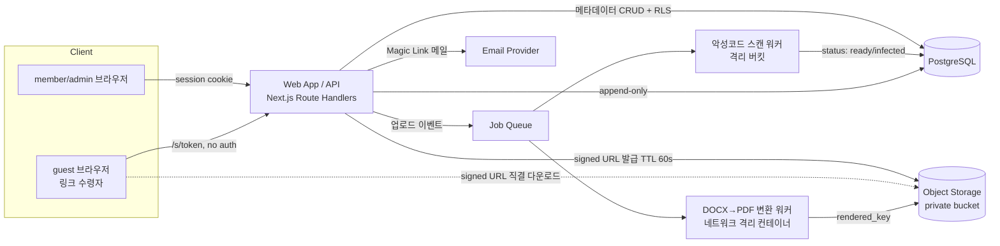
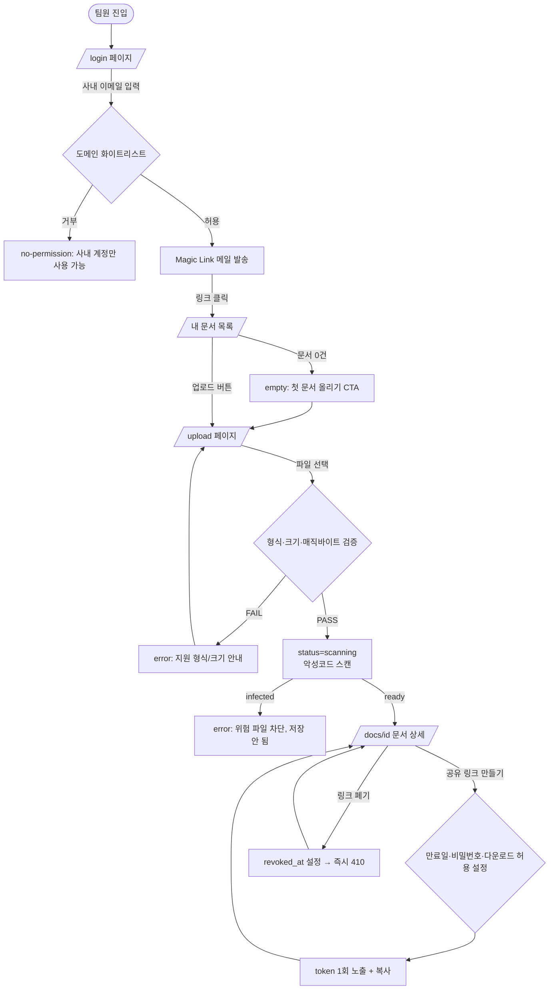
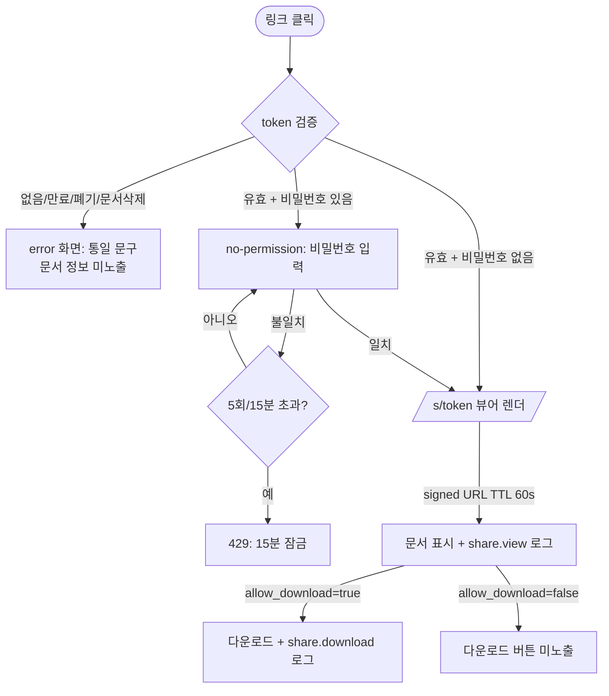
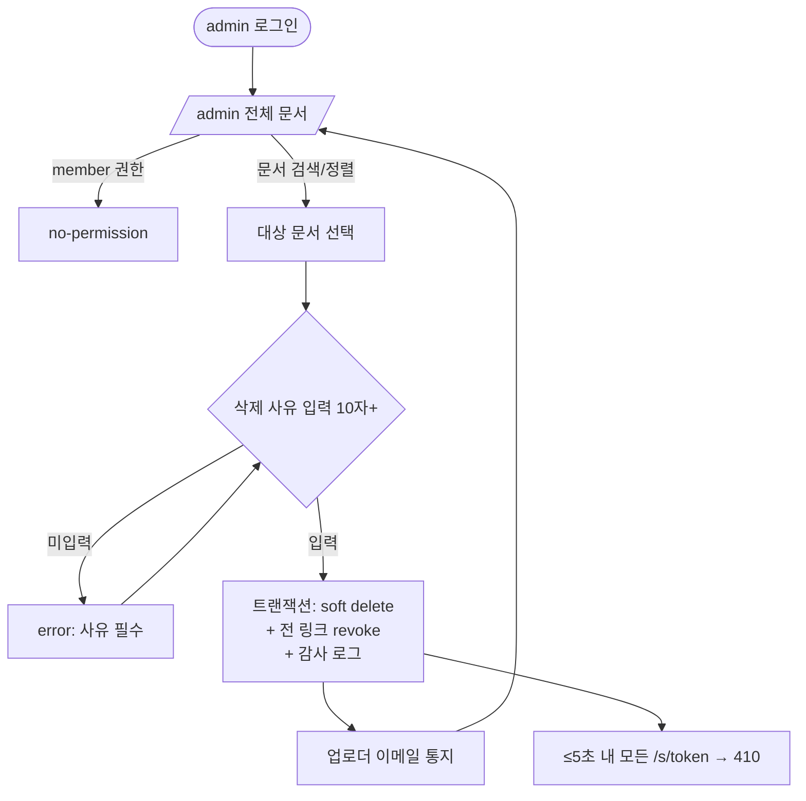

# 사내 문서 공유 서비스 (DocShare) PRD

> **Version**: 1.0
> **Created**: 2026-07-26
> **Status**: Draft
> **Type**: product-feature

> **Context Note (Phase 1 분석 결과)**: 현재 리포지토리(`wigtn-plugins-with-claude-code`)는 Claude Code 플러그인 정의(agents/commands/skills)만 포함하며 애플리케이션 코드·`package.json` 런타임 의존성·DB 스키마가 존재하지 않는다. 따라서 본 기능은 **greenfield**로 간주하고, §5의 기술 설계는 기존 코드 패턴 재사용이 아니라 신규 스택 제안으로 작성한다. 기존 PRD는 `docs/prd/PRD_opus5-harness-tuning.md` 1건이며 본 기능과 도메인 중복 없음.

---

## 1. Overview

### 1.1 Problem Statement

팀원이 PDF/DOCX 문서를 공유하려면 현재는 이메일 첨부나 메신저 파일 전송에 의존한다. 이 방식은 (1) 같은 문서의 버전이 여러 개로 흩어지고, (2) 사외 파트너·고객에게 보낼 때 파일이 무제한 재배포되며, (3) 잘못 공유된 문서를 **회수할 방법이 없다**.

특히 "사내 문서지만 링크를 받은 외부인은 열람 가능해야 한다"는 요구는 **인증 없이 접근 가능한 표면**을 만든다. 링크 자체가 사실상 자격증명(bearer credential)이 되므로, 링크 유출 = 문서 유출이다. 따라서 본 서비스의 핵심 문제는 "파일을 올리고 링크를 만드는 것"이 아니라 **공유 링크의 수명과 회수를 통제하는 것**이다.

### 1.2 Goals

- 팀원이 PDF/DOCX 문서를 업로드하고 **1개 이상의 공유 링크**를 생성해 사내외에 배포할 수 있다.
- 공유 링크 수령자는 **로그인 없이** 브라우저에서 문서를 열람할 수 있다.
- 관리자는 부적절한 문서를 삭제할 수 있고, 삭제 시 **해당 문서의 모든 공유 링크가 즉시 무효화**된다 (평균 무효화 지연 < 5초).
- 문서의 업로드/공유/열람/삭제가 **감사 로그로 추적**되어, 유출 사고 시 "누가 언제 어떤 링크로 봤는지" 재구성할 수 있다.
- 초기 스타트업 규모(Startup Grade)에서 운영 인력 없이 굴러가는 수준의 단순한 인프라로 시작한다.

### 1.3 Non-Goals (Out of Scope)

- **문서 편집·공동 편집**: 본 서비스는 read-only 배포 채널이다. Google Docs 대체가 아니다.
- **버전 관리(diff, 롤백)**: 같은 파일의 재업로드는 별개 문서로 취급한다 (Phase 3 이후 검토).
- **DRM / 다운로드 완전 차단**: 브라우저 뷰어에서 렌더된 문서는 스크린샷·재촬영이 가능하다. 워터마킹은 P2, 완전한 유출 방지는 **불가능하다고 명시**한다.
- **전문(full-text) 검색**: MVP는 파일명·업로더·태그 기준 메타데이터 검색만 제공한다.
- **PDF/DOCX 외 파일 형식** (xlsx, pptx, 이미지, zip): Phase 3 이후.
- **외부 열람자 계정 시스템**: guest는 계정을 만들지 않는다. 링크 = 접근 수단.
- **SSO(SAML/OIDC) 연동**: MVP는 사내 도메인 Magic Link 로그인. SSO는 P2.

### 1.4 Scope

| 포함 | 제외 |
|------|------|
| 사내 도메인 이메일 Magic Link 로그인 | SAML/OIDC SSO, 소셜 로그인 |
| PDF/DOCX 업로드 (파일당 ≤ 50MB) | xlsx/pptx/이미지/압축파일 업로드 |
| 브라우저 내 문서 뷰어 (PDF 네이티브 / DOCX → PDF 변환 렌더) | 문서 편집, 코멘트, 공동 작업 |
| 공유 링크 생성 (만료일, 선택적 비밀번호, 다운로드 허용 토글) | 수신자별 개별 권한(ACL), 이메일 초대 플로우 |
| 공유 링크 폐기(revoke) 및 문서 삭제 시 연쇄 무효화 | 이미 다운로드된 파일 회수, DRM |
| 관리자 전체 문서 조회·강제 삭제 | 조직/부서 계층, 팀 스페이스 |
| 감사 로그(업로드/공유/열람/삭제) + 링크별 열람 카운트 | BI 대시보드, 리포트 export |
| 업로드 시 MIME/매직바이트 검증 + 악성파일 스캔 | 콘텐츠 기반 자동 검열(NSFW/DLP 분류) |

---

## 2. User Stories

### 2.1 Primary User

- **As a 팀원(member)**, I want to 문서를 올리고 만료일이 걸린 공유 링크를 만들어 외부 파트너에게 보내고 싶다, so that 이메일 첨부처럼 영구히 남지 않고 필요한 기간만 열람되게 할 수 있다.
- **As a 외부 수령자(guest)**, I want to 받은 링크를 클릭해 회원가입 없이 바로 문서를 보고 싶다, so that 계정 만들 필요 없이 즉시 내용을 확인할 수 있다.
- **As a 관리자(admin)**, I want to 부적절하거나 잘못 공유된 문서를 즉시 삭제하고 링크를 죽이고 싶다, so that 유출 범위를 최소화할 수 있다.

### 2.2 Acceptance Criteria (Gherkin)

```gherkin
Scenario: 사내 팀원이 PDF를 업로드한다
  Given 사내 도메인(@company.com) 계정으로 로그인한 member가
  When /upload 에서 12MB PDF 파일을 선택하고 제출하면
  Then 업로드가 성공하고 문서 상세(/docs/{id})로 이동하며
   And 문서 상태가 "scanning"에서 스캔 완료 후 "ready"로 바뀐다
   And audit_logs에 action=document.upload 레코드가 1건 생성된다

Scenario: 허용되지 않은 파일 형식 업로드 거부
  Given 로그인한 member가
  When 확장자를 .pdf로 바꾼 실행파일(매직바이트 MZ)을 업로드하면
  Then 서버는 400 INVALID_FILE_TYPE 을 반환하고
   And 파일은 영구 저장소에 남지 않는다

Scenario: 공유 링크 생성 후 외부인이 열람한다
  Given member가 소유한 status=ready 문서가 있고
  When 만료 7일 짜리 공유 링크를 생성하면
  Then 128비트 이상 엔트로피의 추측 불가능한 token이 발급되고
  When 로그아웃 상태의 브라우저로 /s/{token} 에 접근하면
  Then 문서 뷰어가 렌더되고 audit_logs에 action=share.view 가 기록된다

Scenario: 만료된 공유 링크
  Given expires_at 이 과거인 공유 링크가 있고
  When guest가 /s/{token} 에 접근하면
  Then 410 LINK_EXPIRED 가 반환되고 문서 내용·파일명이 응답에 포함되지 않는다

Scenario: 비밀번호가 걸린 공유 링크
  Given 비밀번호가 설정된 공유 링크가 있고
  When guest가 /s/{token} 에 접근하면
  Then 비밀번호 입력 화면이 표시되고
  When 잘못된 비밀번호를 5회 초과 입력하면
  Then 429 TOO_MANY_ATTEMPTS 가 반환되고 해당 token은 15분간 잠긴다

Scenario: 관리자가 부적절한 문서를 삭제한다
  Given admin으로 로그인했고 대상 문서에 활성 공유 링크가 3개 있을 때
  When /admin 에서 해당 문서를 사유와 함께 삭제하면
  Then 문서는 soft delete 되고 3개 링크 모두 revoked_at 이 설정되며
   And 5초 이내에 /s/{token} 접근이 모두 410 을 반환하고
   And 기존에 발급된 스토리지 signed URL 도 무효화된다(§4.5 참조)

Scenario: 권한 없는 사용자가 관리자 화면에 접근
  Given member 권한으로 로그인한 사용자가
  When /admin 에 접근하면
  Then no-permission 화면이 표시되고 API는 403 FORBIDDEN 을 반환한다
```

### 2.3 User Roles

> **목적**: 역할을 영문 문자열로 통일 선언. 이후 페이지 권한·API authorization·`/screen-spec` Audience 매핑의 단일 키로 사용.

| Role Key | 한국어 명칭 | 권한 범위 | 비고 |
|----------|------------|----------|------|
| `guest` | 링크 수령 외부 열람자 | 유효한 share token이 가리키는 문서 1건만 read | 계정 없음. 인증 주체는 **token 자체** |
| `member` | 사내 팀원 | 본인 문서 create/read/update/delete, 본인 문서의 링크 발급·폐기, 타인 문서 목록은 조회 불가 | 사내 도메인 이메일 소유자. RLS 적용 |
| `admin` | 관리자 | 전체 문서 read/delete, 전체 링크 폐기, 감사 로그 열람 | service_role. 업로드는 member와 동일하게 가능 |

**규칙**:
- Role Key는 영문 소문자 단일 단어
- 이후 모든 페이지/API 명세에서 이 키를 그대로 인용
- `guest`는 세션이 아니라 **token 기반 접근**이다. 서버는 guest 요청에 대해 "이 token이 유효한가"만 검사하며, 어떤 사용자 컨텍스트도 부여하지 않는다.
- `admin`은 `member`의 상위집합이 아니라 별도 권한 축이다 — admin도 타인 문서 **내용 열람**은 감사 로그가 남는 조건으로만 허용한다.

---

## 3. Functional Requirements

| ID | Requirement | Priority | Dependencies |
|----|------------|----------|--------------|
| FR-001 | 사내 도메인(허용 도메인 화이트리스트) 이메일로 Magic Link 로그인. 화이트리스트 외 도메인은 가입 거부 | P0 (Must) | - |
| FR-002 | PDF/DOCX 파일 업로드. 확장자 + Content-Type + **매직바이트** 3중 검증, 파일당 최대 50MB, 계정당 총 5GB 쿼터 | P0 (Must) | FR-001 |
| FR-003 | 업로드 파일 악성코드 스캔. 스캔 완료 전 문서 status=`scanning`이며 공유 링크 생성 불가 | P0 (Must) | FR-002 |
| FR-004 | 내 문서 목록 조회 (파일명·업로드일·공유 링크 수·열람 수, 파일명 부분일치 검색, 페이지네이션 20건/page) | P0 (Must) | FR-002 |
| FR-005 | 문서 상세 열람 (브라우저 내 뷰어). DOCX는 서버에서 PDF로 변환 후 렌더 | P0 (Must) | FR-002 |
| FR-006 | 공유 링크 생성. 옵션: 만료일(기본 7일, 최대 90일, 무기한 불가), 비밀번호(선택), 다운로드 허용 여부(기본 false) | P0 (Must) | FR-002, FR-003 |
| FR-007 | 공유 링크로 비로그인 열람 (`/s/{token}`). 만료·폐기·삭제된 링크는 문서 메타데이터 노출 없이 410 반환 | P0 (Must) | FR-006 |
| FR-008 | 공유 링크 폐기(revoke). 폐기 즉시(≤5초) 해당 링크 접근 불가 | P0 (Must) | FR-006 |
| FR-009 | 관리자 전체 문서 목록 조회 (업로더·업로드일·활성 링크 수·총 열람 수 기준 정렬/필터) | P0 (Must) | FR-001 |
| FR-010 | 관리자 문서 강제 삭제 (사유 필수 입력). soft delete + 전체 링크 연쇄 폐기 + 업로더에게 이메일 통지 | P0 (Must) | FR-009 |
| FR-011 | 업로더 본인 문서 삭제 (동일하게 링크 연쇄 폐기) | P1 (Should) | FR-004 |
| FR-012 | 감사 로그 기록: `document.upload` / `document.delete` / `share.create` / `share.revoke` / `share.view` / `share.download` / `auth.login`. 기록 항목: actor(또는 token id), 대상, IP, User-Agent, timestamp | P1 (Should) | FR-001 |
| FR-013 | 링크별 열람 통계 (총 열람 수, 최근 열람 시각, 고유 IP 수)를 문서 상세에서 확인 | P1 (Should) | FR-012 |
| FR-014 | 관리자 감사 로그 조회 화면 (기간·actor·action 필터, CSV export) | P2 (Could) | FR-012 |
| FR-015 | 열람 페이지에 수령자 식별 워터마크(접근 IP/시각) 오버레이 | P2 (Could) | FR-007 |
| FR-016 | SSO(OIDC) 로그인 연동 | P3 (Won't, 이번 릴리스 제외) | FR-001 |

---

## 4. Non-Functional Requirements

### 4.0 Scale Grade (규모 등급)

**선택 등급: `Startup` (소규모 서비스)**

> 근거: 브리프의 "예상 사용자 규모는 초기 스타트업 수준". 사내 팀원(member)은 수십~수백 명 규모지만, **공유 링크를 받는 외부 열람자(guest)가 트래픽의 다수**를 차지하므로 DAU는 사내 인원수보다 크게 잡는다. 경계값 원칙에 따라 DAU 1,000 이상 10,000 미만 구간 → Startup.

| 항목 | 가정값 | 비고 |
|------|--------|------|
| 사내 member 수 | 30 ~ 200명 | 인증 대상 |
| 예상 DAU | 1,000 ~ 3,000 | member 200 + guest 링크 열람 다수 |
| 피크 동시접속 | 100 ~ 300 | 업무시간 10~11시, 자료 배포 직후 스파이크 |
| 1시간 다운 시 영향 | 외부 파트너에게 보낸 링크가 끊겨 신뢰도 손상. 단, 매출 직결은 아님 | → 99% uptime으로 충분 |

| 등급 | 일일 사용자(DAU) | 동시접속 | 데이터량 | 추천 인프라 비용 |
|------|-----------------|---------|---------|----------------|
| Hobby | < 1,000 | < 100 | < 1GB | 무료~$20/월 |
| **Startup (선택)** | **1,000 ≤ DAU < 10,000** | **100 ≤ CC < 1,000** | **1-10GB** | **$20-100/월** |
| Growth | 10,000 ≤ DAU < 100,000 | 1,000 ≤ CC < 10,000 | 10-100GB | $100-1,000/월 |
| Enterprise | ≥ 100,000 | ≥ 10,000 | ≥ 100GB | $1,000+/월 |

> **주의**: 파일 스토리지는 Startup 기준 1-10GB를 **초과할 가능성이 높다** (50MB × 200명 × 월 5건 = 월 50GB). 스토리지는 별도 오브젝트 스토리지(S3 호환)로 분리하고, §4.3에서 별도 산정한다. DB 자체는 메타데이터만 다루므로 Startup 범위(< 10GB) 유지.

### 4.1 Performance SLA

| 지표 | 목표값 |
|------|--------|
| Response Time (p95) — 메타데이터 API (목록/상세/링크 생성) | < 400ms |
| Response Time (p95) — 공유 링크 첫 접근 `/s/{token}` | < 800ms (토큰 검증 + signed URL 발급 포함) |
| Response Time (p95) — 파일 다운로드 TTFB | < 1s (CDN/오브젝트 스토리지 직결) |
| 업로드 처리 (50MB 기준, 스캔 제외) | < 30s |
| 악성코드 스캔 완료까지 | p95 < 60s (비동기, 사용자 대기 없음) |
| DOCX → PDF 변환 | p95 < 20s (비동기, 최초 열람 시 캐시) |
| Throughput (RPS) | 50 RPS 정상 처리 (피크 100 RPS 버스트 허용) |

> Startup 등급 가이드(p95 < 500ms, RPS < 100)를 기준으로 하되, 파일 I/O가 개입하는 경로는 위와 같이 별도 목표를 둔다.

### 4.2 Availability SLA

| 등급 | 추천 Uptime | 허용 다운타임(월) |
|------|------------|-----------------|
| Hobby | 95% | 36시간 |
| **Startup (선택)** | **99%** | **7.3시간** |
| Growth | 99.9% | 43.8분 |
| Enterprise | 99.99% | 4.3분 |

- 목표 Uptime: **99%** (월 허용 다운타임 7.3시간)
- 배포는 무중단을 지향하되 필수는 아님. 심야 점검창(02:00-04:00 KST) 허용.
- **부분 저하 허용**: 악성코드 스캔 워커 / DOCX 변환 워커가 죽어도 기존 문서 열람은 계속되어야 한다 (업로드만 큐에 적체).

### 4.3 Data Requirements

| 항목 | 값 |
|------|-----|
| 현재 데이터량 | 0 (신규 서비스) |
| 예상 초기 데이터량 (3개월) | 메타데이터 DB ~200MB / 파일 스토리지 ~150GB |
| 월간 증가율 | 파일 스토리지 +40~60GB/월 (member 200명 × 월 5건 × 평균 25MB 가정), DB +30% |
| 데이터 보존 기간 | 문서 파일: soft delete 후 **30일 유예 → 물리 삭제**. 감사 로그: **1년**. 열람 통계 집계치: 무기한 |
| 백업 | DB 일 1회 자동 백업, 7일 보관. 오브젝트 스토리지는 버저닝 30일 |

### 4.4 Recovery

| 항목 | 설명 | 값 |
|------|------|-----|
| RTO (복구 시간) | 장애 발생 후 서비스 복구까지 허용 시간 | **8시간** (Startup 기본 24시간보다 강화 — 외부 파트너 노출 링크가 끊기는 영향 고려) |
| RPO (복구 시점) | 허용 가능한 데이터 손실 시간 범위 | **24시간** (일 1회 백업 기준). 단, 업로드 파일은 오브젝트 스토리지 버저닝으로 사실상 RPO ≈ 0 |

### 4.5 Security

> 본 기능은 "인증 없이 접근 가능한 공개 엔드포인트가 사내 문서를 서빙한다"는 구조를 필연적으로 갖는다. 아래 항목은 선택이 아니라 **P0 구현 조건**이다.

**Authentication**
- member/admin: **Required** — 사내 도메인 화이트리스트 이메일 Magic Link. 세션 쿠키는 `HttpOnly; Secure; SameSite=Lax`, 유효기간 7일, 슬라이딩 갱신.
- guest: **None (token-bearer)** — `/s/{token}` 및 그 하위 API만 인증 예외. 이 경로에서 **문서 소유자·업로더 이메일·다른 문서 정보를 절대 응답에 포함하지 않는다**.

**공유 토큰 규격 (핵심 통제)**
- token은 **CSPRNG 기반 최소 128bit 엔트로피** (예: 32자 base62). 순번·UUIDv1·타임스탬프 파생 금지.
- DB에는 token 원문이 아니라 **SHA-256 해시를 저장**하고 조회 시 해시 비교 (DB 유출 시 링크 즉시 악용 방지).
- 만료 상한 90일. **무기한 링크 생성 불가** (기본 7일).
- `robots.txt`로 `/s/*` 크롤링 차단 + 응답에 `X-Robots-Tag: noindex, nofollow`.
- `/s/{token}` 페이지에서 외부 링크 클릭 시 `Referrer-Policy: no-referrer`로 token 유출 방지.

**Authorization**
- 모든 문서 조회 쿼리는 `owner_id = current_user` 또는 `role = admin` 조건을 **DB 레벨(RLS)** 에서 강제. 애플리케이션 코드 단독 검사 금지.
- IDOR 방지: 문서 ID는 순차 정수 대신 ULID/UUIDv4.
- admin 액션(FR-010)은 사유 입력 필수 + 감사 로그 필수.

**파일 취급**
- 업로드 검증 3중: 확장자 화이트리스트(`.pdf`, `.docx`) + Content-Type + **매직바이트**(`%PDF`, `PK\x03\x04` + `[Content_Types].xml` 존재).
- 악성코드 스캔 통과 전 파일은 격리 버킷에 두고 어떤 경로로도 서빙하지 않는다.
- 원본 파일은 **비공개 버킷**에만 저장하고, 서빙은 **단기 signed URL(TTL ≤ 60초)** 로만 한다. 공개 버킷 금지.
  - 문서 삭제 시 이미 발급된 signed URL이 최대 60초 살아있을 수 있음을 **명시적 잔존 위험**으로 수용한다. 즉시성이 필요하면 스토리지 객체 키를 rotate(=삭제 시 객체 이동)하여 0초로 만든다 — MVP는 60초 수용, Phase 2에서 rotate 도입.
- PDF 렌더는 샌드박스된 뷰어에서 수행하고 JS 실행을 비활성화 (악성 PDF의 embedded JS 차단).
- DOCX 변환 워커는 네트워크 격리된 컨테이너에서 실행 (매크로/외부 리소스 fetch 차단).

**Data encryption**
- In transit: 전 구간 TLS 1.2+ (HSTS 포함).
- At rest: 오브젝트 스토리지 SSE 활성화, DB 볼륨 암호화.
- 공유 링크 비밀번호는 **bcrypt/argon2 해시** 저장 (평문·역가역 암호화 금지).

**Abuse 방지 (Rate Limiting)**
| 대상 | 한도 |
|------|------|
| Magic Link 발송 | 이메일당 5회/시간, IP당 20회/시간 |
| 공유 링크 비밀번호 시도 | token당 5회/15분 초과 시 15분 잠금 |
| `/s/{token}` 접근 | IP당 60회/분 (토큰 브루트포스 탐지) |
| 업로드 | 계정당 30건/시간 |

**로깅/개인정보**
- 감사 로그에 IP·User-Agent를 저장하므로 **개인정보 처리방침 고지 대상**. 보존 1년 후 자동 파기.
- 로그·에러 리포트에 share token 원문을 **절대 기록하지 않는다** (해시 앞 8자만 기록).

---

## 5. Technical Design

### 5.1 API Specification

베이스 경로: `/api/v1`. 형식: REST + JSON. 인증: 세션 쿠키(member/admin) 또는 URL path의 share token(guest).

공통 에러 포맷:
```json
{ "error": { "code": "INVALID_FILE_TYPE", "message": "PDF 또는 DOCX 파일만 업로드할 수 있습니다." } }
```

#### `POST /api/v1/auth/magic-link`
- **Description**: 사내 도메인 이메일로 로그인 링크 발송 (FR-001)
- **Auth**: None
- **Request**: `email` (string, required, RFC5322)
- **Response 200**: `{ "sent": true }` — **이메일 존재 여부와 무관하게 항상 동일 응답** (계정 열거 방지)
- **Errors**: `400 INVALID_EMAIL` / `403 DOMAIN_NOT_ALLOWED` (화이트리스트 외 도메인) / `429 RATE_LIMITED`

#### `POST /api/v1/auth/verify`
- **Description**: Magic Link 토큰 검증 및 세션 발급
- **Auth**: None
- **Request**: `token` (string, required, 15분 유효, 1회용)
- **Response 200**: `{ "user": { "id": "usr_01H...", "email": "...", "role": "member" } }` + `Set-Cookie: session=...`
- **Errors**: `400 INVALID_TOKEN` / `410 TOKEN_EXPIRED` / `409 TOKEN_ALREADY_USED`

#### `POST /api/v1/documents`
- **Description**: 문서 업로드 (FR-002). multipart/form-data
- **Auth**: Required (`member`, `admin`)
- **Request**: `file` (binary, required, ≤50MB, PDF/DOCX), `title` (string, optional, 기본값 = 원본 파일명)
- **Response 201**:
  ```json
  { "id": "doc_01H...", "title": "2026 사업계획.pdf", "mimeType": "application/pdf",
    "sizeBytes": 12582912, "status": "scanning", "createdAt": "2026-07-26T04:12:00Z" }
  ```
- **Errors**: `400 INVALID_FILE_TYPE` (확장자/MIME/매직바이트 불일치) / `413 FILE_TOO_LARGE` / `401 UNAUTHORIZED` / `429 RATE_LIMITED` / `507 QUOTA_EXCEEDED` (계정 5GB 초과)

#### `GET /api/v1/documents`
- **Description**: 내 문서 목록 (FR-004)
- **Auth**: Required (`member`, `admin` — 본인 소유분만)
- **Request**: `q` (string, optional, 파일명 부분일치), `cursor` (string, optional), `limit` (int, optional, 기본 20, 최대 50)
- **Response 200**: `{ "items": [{ "id", "title", "sizeBytes", "status", "activeShareCount", "viewCount", "createdAt" }], "nextCursor": "..." }`
- **Errors**: `401 UNAUTHORIZED`

#### `GET /api/v1/documents/{id}`
- **Description**: 문서 상세 + 공유 링크 목록 (FR-005, FR-013)
- **Auth**: Required (소유자 또는 `admin`)
- **Response 200**: `{ "id", "title", "status", "sizeBytes", "createdAt", "owner": {...}, "shares": [{ "id", "url", "expiresAt", "hasPassword", "allowDownload", "viewCount", "lastViewedAt", "revokedAt" }] }`
- **Errors**: `401 UNAUTHORIZED` / `403 FORBIDDEN` (타인 문서) / `404 NOT_FOUND`

#### `GET /api/v1/documents/{id}/content`
- **Description**: 인증 사용자용 문서 렌더링 URL 발급
- **Auth**: Required (소유자 또는 `admin`)
- **Response 200**: `{ "url": "https://storage.../signed?...", "expiresIn": 60 }`
- **Errors**: `403 FORBIDDEN` / `404 NOT_FOUND` / `409 NOT_READY` (status=scanning/failed)

#### `DELETE /api/v1/documents/{id}`
- **Description**: 본인 문서 삭제 (FR-011). soft delete + 전체 링크 연쇄 폐기
- **Auth**: Required (소유자)
- **Response 204**: (no content)
- **Errors**: `403 FORBIDDEN` / `404 NOT_FOUND`

#### `POST /api/v1/documents/{id}/shares`
- **Description**: 공유 링크 생성 (FR-006)
- **Auth**: Required (소유자 또는 `admin`)
- **Request**: `expiresInDays` (int, optional, 기본 7, 1~90), `password` (string, optional, 8자 이상), `allowDownload` (boolean, optional, 기본 false)
- **Response 201**: `{ "id": "shr_01H...", "url": "https://docshare.company.com/s/{token}", "expiresAt": "...", "hasPassword": true, "allowDownload": false }`
  - **token 원문은 이 응답에서 단 1회만 반환**된다. 이후 조회 API는 마스킹된 URL만 제공.
- **Errors**: `400 INVALID_EXPIRY` (범위 밖 또는 무기한 요청) / `403 FORBIDDEN` / `409 DOCUMENT_NOT_READY` (스캔 미완료 — FR-003)

#### `DELETE /api/v1/shares/{shareId}`
- **Description**: 공유 링크 폐기 (FR-008)
- **Auth**: Required (소유자 또는 `admin`)
- **Response 204**: (no content)
- **Errors**: `403 FORBIDDEN` / `404 NOT_FOUND`

#### `GET /api/v1/shares/public/{token}`
- **Description**: 공유 링크 메타 조회 — guest 열람 진입점 (FR-007)
- **Auth**: None (token-bearer)
- **Response 200**: `{ "title": "2026 사업계획.pdf", "requiresPassword": false, "allowDownload": false, "viewerUrl": "https://storage.../signed?...", "expiresIn": 60 }`
  - `requiresPassword: true`이면 `viewerUrl`은 **포함하지 않고** `{ "title": null, "requiresPassword": true }` 만 반환 (인증 전 파일명 노출 방지)
- **Errors**: `404 NOT_FOUND` (존재하지 않는 token) / `410 LINK_EXPIRED` (만료) / `410 LINK_REVOKED` (폐기·문서 삭제) / `429 RATE_LIMITED`
  - **주의**: 404와 410 응답 본문에 문서 정보를 일절 포함하지 않는다.

#### `POST /api/v1/shares/public/{token}/unlock`
- **Description**: 비밀번호 보호 링크 해제
- **Auth**: None (token-bearer)
- **Request**: `password` (string, required)
- **Response 200**: `{ "title": "...", "viewerUrl": "...", "expiresIn": 60 }`
- **Errors**: `401 INVALID_PASSWORD` / `429 TOO_MANY_ATTEMPTS` (5회/15분 초과 시 15분 잠금) / `410 LINK_EXPIRED`

#### `GET /api/v1/admin/documents`
- **Description**: 전체 문서 목록 (FR-009)
- **Auth**: Required (`admin`)
- **Request**: `q` (string, optional), `ownerId` (string, optional), `sort` (enum: `createdAt` | `viewCount`, 기본 `createdAt`), `cursor`, `limit`
- **Response 200**: `{ "items": [{ "id", "title", "owner": { "id", "email" }, "sizeBytes", "activeShareCount", "viewCount", "createdAt", "deletedAt" }], "nextCursor": "..." }`
- **Errors**: `401 UNAUTHORIZED` / `403 FORBIDDEN`

#### `DELETE /api/v1/admin/documents/{id}`
- **Description**: 관리자 강제 삭제 (FR-010). soft delete + 전체 링크 연쇄 폐기 + 업로더 이메일 통지
- **Auth**: Required (`admin`)
- **Request**: `reason` (string, required, 10자 이상)
- **Response 200**: `{ "deleted": true, "revokedShareCount": 3 }`
- **Errors**: `400 REASON_REQUIRED` / `403 FORBIDDEN` / `404 NOT_FOUND`

#### `GET /api/v1/admin/audit-logs`
- **Description**: 감사 로그 조회 (FR-014)
- **Auth**: Required (`admin`)
- **Request**: `from`, `to` (ISO8601, optional), `action` (enum, optional), `actorId` (optional), `documentId` (optional), `cursor`, `limit`
- **Response 200**: `{ "items": [{ "id", "action", "actorId", "actorEmail", "documentId", "shareIdHashPrefix", "ip", "userAgent", "createdAt" }], "nextCursor": "..." }`
- **Errors**: `403 FORBIDDEN`

### 5.2 Database Schema

```
users
  id            ULID   PK
  email         text   UNIQUE NOT NULL          -- 사내 도메인 화이트리스트 검증 후 생성
  role          enum('member','admin') NOT NULL DEFAULT 'member'
  created_at    timestamptz NOT NULL
  last_login_at timestamptz

documents
  id            ULID   PK                        -- 순차 정수 금지 (IDOR 방지)
  owner_id      ULID   FK -> users.id  NOT NULL
  title         text   NOT NULL
  storage_key   text   NOT NULL                  -- 비공개 버킷 객체 키
  mime_type     text   NOT NULL                  -- application/pdf | ...wordprocessingml.document
  size_bytes    bigint NOT NULL
  status        enum('scanning','ready','infected','failed') NOT NULL DEFAULT 'scanning'
  rendered_key  text                             -- DOCX→PDF 변환 결과 캐시 (nullable)
  deleted_at    timestamptz                      -- soft delete
  deleted_by    ULID   FK -> users.id
  delete_reason text
  created_at    timestamptz NOT NULL
  INDEX (owner_id, created_at DESC) WHERE deleted_at IS NULL
  INDEX (status)

share_links
  id            ULID   PK
  document_id   ULID   FK -> documents.id ON DELETE CASCADE  NOT NULL
  token_hash    bytea  UNIQUE NOT NULL            -- SHA-256(token). 원문 미저장
  password_hash text                              -- argon2id, nullable
  expires_at    timestamptz NOT NULL              -- NOT NULL = 무기한 링크 불가 (§4.5)
  allow_download boolean NOT NULL DEFAULT false
  revoked_at    timestamptz
  created_by    ULID   FK -> users.id NOT NULL
  created_at    timestamptz NOT NULL
  INDEX (token_hash)                              -- 조회 핫패스
  INDEX (document_id) WHERE revoked_at IS NULL

share_views                                        -- 열람 통계 원본 (FR-013)
  id            ULID   PK
  share_link_id ULID   FK -> share_links.id NOT NULL
  ip_hash       bytea  NOT NULL                    -- IP는 해시 저장 (고유 방문자 카운트용)
  user_agent    text
  viewed_at     timestamptz NOT NULL
  INDEX (share_link_id, viewed_at DESC)

audit_logs                                         -- FR-012, 1년 보존
  id            ULID   PK
  action        enum('auth.login','document.upload','document.delete',
                     'share.create','share.revoke','share.view','share.download') NOT NULL
  actor_id      ULID   FK -> users.id              -- guest 액션이면 NULL
  document_id   ULID
  share_hash_prefix text                           -- token 해시 앞 8자만 (원문 금지)
  ip            inet
  user_agent    text
  metadata      jsonb                              -- reason 등
  created_at    timestamptz NOT NULL
  INDEX (created_at DESC), INDEX (document_id), INDEX (actor_id)
```

**RLS 정책 (§4.5 Authorization 강제)**
- `documents`: `SELECT/UPDATE/DELETE` — `owner_id = auth.uid() OR auth.role() = 'admin'`, 그리고 `deleted_at IS NULL`
- `share_links`: 소유 문서의 링크만. guest 경로는 앱이 아니라 **service_role의 전용 함수**로 token_hash 단건 조회만 수행 (테이블 전체 노출 금지)
- `audit_logs`: `admin`만 SELECT. INSERT는 service_role 전용, UPDATE/DELETE 불가(append-only)

**삭제 시 연쇄 동작 (FR-010/FR-011)** — 단일 트랜잭션:
1. `documents.deleted_at = now()`, `deleted_by`, `delete_reason` 설정
2. 해당 문서의 모든 `share_links.revoked_at = now()`
3. 토큰 검증 캐시(있다면) 무효화 → 5초 내 반영
4. `audit_logs`에 `document.delete` 기록
5. (비동기) 30일 후 스토리지 객체 물리 삭제 배치

### 5.3 Architecture Diagram



**스택 제안 (greenfield)**: Next.js(App Router) + PostgreSQL(RLS) + S3 호환 오브젝트 스토리지 + 큐 기반 비동기 워커 2종(스캔/변환) + 트랜잭셔널 이메일. Startup 등급이므로 관리형 서비스 조합으로 시작하고 자체 K8s는 도입하지 않는다.

### 5.4 Pages

| Route | Audience | Auth | Linked FRs | Has FE Components | Primary State | Responsive |
|-------|----------|------|-----------|-------------------|---------------|-----------|
| `/login` | guest(미인증 방문자) | Optional | FR-001 | Yes | success / error | Desktop / Mobile |
| `/` (내 문서) | member, admin | Required | FR-004, FR-011 | Yes | success / empty | Desktop / Mobile |
| `/upload` | member, admin | Required | FR-002, FR-003 | Yes | success / error | Desktop / Mobile |
| `/docs/{id}` | member, admin | Required | FR-005, FR-006, FR-008, FR-013 | Yes | success | Desktop / Mobile |
| `/s/{token}` | guest | **None** (token) | FR-007 | Yes | success / error | Desktop / Mobile |
| `/admin` | admin | Required | FR-009, FR-010 | Yes | success / empty | Desktop only |
| `/admin/audit` | admin | Required | FR-014 | Yes | success / empty | Desktop only |
| `/api/v1/*` | - | Required (일부 None) | FR-001~FR-014 | **No** (API) | - | - |

**규칙 준수**: `Audience`는 §2.3 Role Key 사용. `Has FE Components: Yes` 행이 7개 → §5.4.1·§5.5 작성 대상.

> `/s/{token}`은 유일하게 인증 없이 렌더되는 페이지다. 이 페이지의 레이아웃에는 **전역 내비게이션·로그인 사용자 정보·다른 문서로의 링크를 넣지 않는다** (별도 minimal layout).

### 5.4.1 Page State Matrix

| Route | loading | empty | error | success | no-permission | 비고 |
|-------|---------|-------|-------|---------|---------------|------|
| `/login` | ✓ | - | ✓ | ✓ | ✓ | 메일 발송 중 loading / 화이트리스트 외 도메인 → no-permission |
| `/` | ✓ | ✓ | ✓ | ✓ | - | 업로드 0건 시 empty (첫 업로드 CTA) |
| `/upload` | ✓ | - | ✓ | ✓ | ✓ | 업로드 진행률 loading / 쿼터 초과·형식 오류 → error / 쿼터 초과는 no-permission이 아닌 error 처리 |
| `/docs/{id}` | ✓ | ✓ | ✓ | ✓ | ✓ | 공유 링크 0개 시 링크 섹션 empty / 스캔 중(status=scanning)은 loading 변형 / 타인 문서 → no-permission |
| `/s/{token}` | ✓ | - | ✓ | ✓ | ✓ | 만료·폐기·삭제 → error(410 전용 화면) / 비밀번호 요구 → no-permission(잠금 해제 폼) |
| `/admin` | ✓ | ✓ | ✓ | ✓ | ✓ | 문서 0건 시 empty / member 접근 → no-permission |
| `/admin/audit` | ✓ | ✓ | ✓ | ✓ | ✓ | 필터 결과 0건 시 empty |

**상태 정의**:
- `loading`: 데이터 fetch 중 (스피너/스켈레톤)
- `empty`: 정상 응답이지만 결과 0건
- `error`: 4xx/5xx 응답 또는 클라이언트 검증 실패
- `success`: 정상 응답 + 결과 ≥1건
- `no-permission`: 인증은 됐으나 권한 부족 (또는 token 잠금 상태)

**규칙**: 체크된 상태(✓)마다 `/screen-spec`에서 1줄 이상 마이크로카피 또는 UI 처리 명시 요구.

> **마이크로카피 보안 제약**: `/s/{token}`의 error 화면은 만료/폐기/삭제/존재하지않음을 **구분해서 알려주지 않는다**. 통일 문구: "이 링크는 더 이상 사용할 수 없습니다. 공유한 분에게 문의해 주세요." (토큰 유효성 오라클 방지)

### 5.5 User Flow

#### Flow A: 사내 팀원 (member) — 업로드 → 공유



#### Flow B: 외부 수령자 (guest) — 링크 열람



#### Flow C: 관리자 (admin) — 부적절 문서 삭제



---

## 6. Implementation Phases

### Phase 1: MVP — 업로드부터 공유 링크 회수까지 (P0 전량)
- [ ] 프로젝트 스캐폴딩 + DB 스키마 마이그레이션 (users / documents / share_links / share_views / audit_logs)
- [ ] FR-001 사내 도메인 Magic Link 로그인 + 세션 (계정 열거 방지 응답 포함)
- [ ] FR-002 업로드 3중 검증(확장자/MIME/매직바이트) + 50MB·5GB 쿼터
- [ ] FR-003 악성코드 스캔 워커 + status 전이(scanning → ready/infected), 스캔 전 공유 차단
- [ ] FR-004 내 문서 목록 (검색·커서 페이지네이션)
- [ ] FR-005 문서 뷰어 (PDF 네이티브 + DOCX→PDF 변환 워커, JS 비활성 샌드박스)
- [ ] FR-006 공유 링크 생성 (128bit token, 해시 저장, 만료 1~90일, argon2 비밀번호, 다운로드 토글)
- [ ] FR-007 `/s/{token}` 비로그인 열람 (410 통일 문구, 메타 미노출, noindex)
- [ ] FR-008 링크 폐기 + FR-010 관리자 강제 삭제(사유 필수) + FR-009 관리자 목록
- [ ] RLS 정책 적용 및 IDOR/권한 테스트 (member↔member, member→admin 경로)
- [ ] Rate limit 4종 (§4.5) 적용
**Deliverable**: 사내 팀원이 문서를 올려 만료·비밀번호가 걸린 링크로 외부에 공유하고, 관리자가 삭제하면 5초 내 전 링크가 죽는 동작하는 서비스

### Phase 2: Enhancement — 추적성과 운영
- [ ] FR-011 업로더 본인 문서 삭제
- [ ] FR-012 감사 로그 전체 액션 기록 (append-only, token 원문 미기록)
- [ ] FR-013 링크별 열람 통계 (총/최근/고유 IP)
- [ ] FR-014 관리자 감사 로그 화면 + CSV export
- [ ] 삭제 시 스토리지 객체 키 rotate로 signed URL 잔존 60초 → 0초 (§4.5 잔존 위험 해소)
- [ ] 30일 유예 후 물리 삭제 배치 + 백업/복구 리허설 (RTO 8h 검증)
- [ ] 기본 모니터링·알림 (업로드 실패율, 스캔 큐 적체, 410 급증 = 브루트포스 신호)
**Deliverable**: 유출 사고 시 열람 이력을 재구성할 수 있고, 삭제가 스토리지 레벨까지 즉시 반영되는 운영 가능 상태

### Phase 3: Optional — 억제력 강화 (P2)
- [ ] FR-015 열람자 워터마크 오버레이
- [ ] 링크 접근 도메인/IP 제한 옵션
- [ ] 파일 형식 확장 (xlsx, pptx)
**Deliverable**: 유출 억제 옵션과 확장 포맷 지원

---

## 7. Success Metrics

| Metric | Target | Measurement |
|--------|--------|-------------|
| 공유 링크 생성 성공률 | ≥ 99% | `share.create` 성공 / 시도 (서버 로그) |
| 만료일이 설정된 링크 비율 | 100% (구조적 강제) | `share_links.expires_at IS NULL` 건수 = 0 확인 쿼리 |
| 링크 폐기·문서 삭제 후 접근 차단 지연 | p95 ≤ 5초 | 삭제 트랜잭션 커밋 시각 vs 이후 첫 410 응답 시각 |
| guest 링크 열람 성공률 | ≥ 98% (만료/폐기 제외) | `/s/{token}` 2xx / (2xx + 5xx) |
| 업로드 → 열람 가능(ready) 소요 | p95 < 60초 | `documents.created_at` → status=ready 전이 시각 |
| 악성 파일 차단 건수 | 탐지된 건 100% 차단 (서빙 0건) | status=infected 문서에 대한 서빙 요청 로그 = 0 |
| 사내 member 주간 활성 비율 | 출시 8주 후 ≥ 40% | 주간 로그인 member / 전체 member |
| 이메일 첨부 대체율 | 출시 12주 후 팀 문서 공유의 ≥ 50% | 분기 설문 + 링크 생성 건수 추이 |
| 감사 로그 커버리지 | 정의된 7개 action 100% 기록 | 샘플 시나리오 실행 후 로그 존재 검증 (E2E 테스트) |

---

## Open Questions (구현 전 확인 필요)

1. **허용 도메인**: 사내 도메인이 1개인가, 계열사/외주 포함 다중인가? 화이트리스트 관리 UI가 필요한가(현재 환경변수 가정)?
2. **외부 열람 정책의 한계선**: "링크만 있으면 누구나"가 정말 요구사항인가, 아니면 "이메일을 입력받아 최소한 누가 봤는지 남긴다"가 더 맞는가? 후자면 FR-007 설계가 바뀐다.
3. **관리자 지정 방법**: 최초 admin은 어떻게 만드는가 (시드 스크립트 / 특정 이메일 하드코딩)?
4. **admin의 문서 내용 열람 범위**: 삭제 판단을 위해 admin이 모든 문서를 열어볼 수 있어야 하는가? 그렇다면 열람 사실을 업로더에게 통지할 것인가?
5. **법적 요구**: 감사 로그의 IP 수집·1년 보존이 사내 개인정보 처리방침에 반영되어 있는가?
