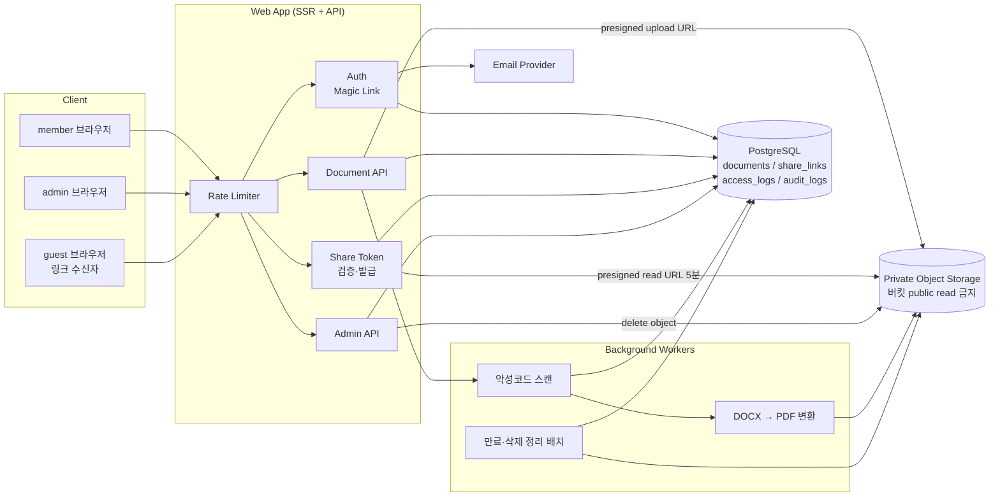
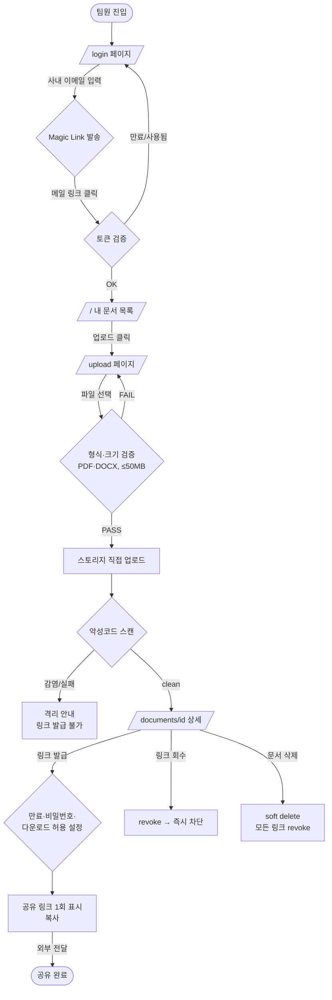
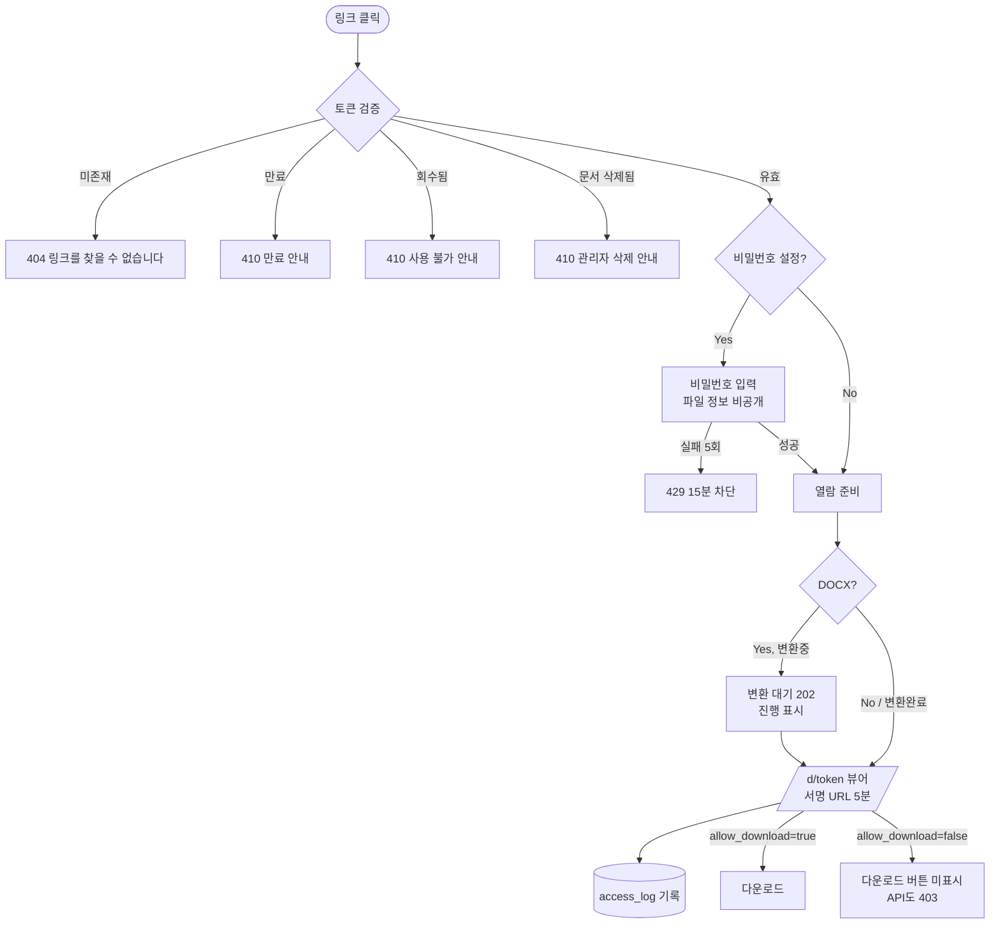
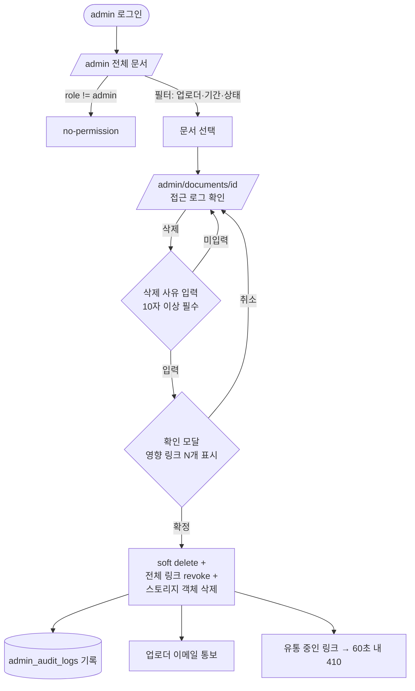

# 사내 문서 공유 서비스 (Internal Document Sharing) PRD

> **Version**: 1.0
> **Created**: 2026-07-26
> **Status**: Draft
> **Type**: product-feature

---

## 1. Overview

### 1.1 Problem Statement

사내 팀원이 PDF·DOCX 문서를 공유할 때 현재는 이메일 첨부나 개인 메신저에 파일을 직접 전달한다. 이 방식은 세 가지 문제를 낳는다.

1. **버전 혼선**: 같은 문서의 여러 사본이 각자 로컬에 흩어져 어떤 것이 최신인지 알 수 없다.
2. **외부 공유 불가/과잉**: 외부 파트너(고객사, 협력사, 외주 인력)에게 보낼 때 계정을 만들어 줄 수 없어 파일 자체를 넘기게 되고, 한 번 넘긴 파일은 회수·추적이 불가능하다.
3. **통제 부재**: 부적절하거나 유출 위험이 있는 문서가 사내에 돌아다녀도 이를 일괄 회수하거나 차단할 주체·수단이 없다.

이 서비스는 **"사내 팀원이 문서를 올리면 링크가 나오고, 그 링크만 있으면 계정 없이도 열람할 수 있으며, 관리자는 언제든 그 링크를 죽일 수 있다"**는 하나의 흐름으로 위 세 문제를 해결한다.

### 1.2 Goals

- 사내 팀원이 **3-step 이내**(파일 선택 → 업로드 → 링크 복사)로 문서를 공유 링크로 전환할 수 있다.
- 링크 수신자는 **계정 생성·로그인 없이** 브라우저에서 문서를 열람할 수 있다.
- 관리자는 부적절한 문서를 **즉시 삭제**할 수 있고, 삭제된 문서의 모든 공유 링크는 그 즉시 무효화된다.
- 모든 문서에 대해 **누가 언제 올렸고, 누가 언제 열람했는지** 감사 기록이 남는다.
- "공개 링크"의 위험을 제어할 수 있도록 링크 단위 **만료·비밀번호·다운로드 허용 여부**를 업로더가 설정할 수 있다.

### 1.3 Non-Goals (Out of Scope)

- **문서 편집/공동 작업**: 열람 전용. 온라인 편집, 코멘트, 실시간 협업은 하지 않는다.
- **폴더/워크스페이스 계층 구조**: v1은 플랫한 문서 목록 + 태그 없음. (Phase 3 후보)
- **PDF/DOCX 외 포맷**: 이미지·동영상·XLSX·PPTX는 v1 미지원.
- **전문(全文) 검색**: 파일 내용 인덱싱은 하지 않는다. 파일명·업로더 기준 검색만 제공.
- **DRM / 워터마크 / 화면 캡처 방지**: 열람 가능한 사람은 내용을 복제할 수 있다고 전제한다. 이 PRD는 "유출 방지"가 아니라 "접근 통제 + 추적 + 회수"를 목표로 한다.
- **SSO(SAML/OIDC) 연동**: v1은 사내 이메일 도메인 기반 Magic Link. (Phase 3 후보)
- **모바일 네이티브 앱**: 반응형 웹만.

### 1.4 Scope

| 포함 | 제외 |
|------|------|
| PDF / DOCX 업로드 (단일 파일, 최대 50MB) | 이미지, 동영상, XLSX, PPTX, ZIP |
| 사내 이메일 도메인 기반 로그인 (Magic Link) | SSO(SAML/OIDC), 소셜 로그인 |
| 문서별 공유 링크 생성 (unguessable token) | 이메일 초대 기반 개별 권한 부여 |
| 링크 단위 만료일 / 비밀번호 / 다운로드 허용 설정 | 시청 시간 제한, IP 화이트리스트 |
| 브라우저 내 문서 뷰어 (PDF 네이티브, DOCX → PDF 변환) | 온라인 편집, 코멘트, 버전 diff |
| 업로더 본인 문서 삭제 | 휴지통/복원 UI (soft delete는 하되 복원은 admin CLI) |
| 관리자 전체 문서 조회 및 강제 삭제 | 관리자 문서 내용 수정 |
| 열람/다운로드 접근 로그 및 감사 로그 | BI 대시보드, 외부 SIEM 연동 |
| 반응형 웹 (Desktop / Mobile) | 네이티브 앱, 오프라인 모드 |

---

## 2. User Stories

### 2.1 Primary User

**주 사용자 — 사내 팀원 (`member`)**

> As a **사내 팀원**, I want to **문서를 올리고 링크 하나만 복사해서 전달**하고 싶다, so that **파일을 첨부로 돌리지 않고도 사내·사외 누구와든 최신 문서를 공유할 수 있다**.

**보조 사용자 1 — 링크 수신자 (`guest`)**

> As a **링크를 받은 외부인**, I want to **계정 가입 없이 링크만으로 문서를 바로 열람**하고 싶다, so that **협업을 위해 불필요한 계정을 만들지 않아도 된다**.

**보조 사용자 2 — 관리자 (`admin`)**

> As a **관리자**, I want to **사내에 올라온 모든 문서를 조회하고 부적절한 문서를 즉시 삭제**하고 싶다, so that **유출·규정 위반 문서가 링크를 통해 계속 유통되는 것을 차단할 수 있다**.

### 2.2 Acceptance Criteria (Gherkin)

```gherkin
Scenario: 사내 팀원이 문서를 업로드하고 공유 링크를 얻는다
  Given 나는 사내 이메일 도메인(@company.com)으로 로그인한 member이다
  And 나는 12MB 크기의 유효한 PDF 파일을 가지고 있다
  When /upload 페이지에서 해당 파일을 선택하고 "업로드"를 누른다
  Then 업로드 진행률이 표시되고
  And 완료 후 문서 상세 페이지로 이동하며
  And "링크 복사" 버튼과 함께 https://<host>/d/{32자 이상 랜덤 토큰} 형태의 공유 링크가 표시된다
  And documents 테이블에 owner_id = 내 user_id, status = 'active' 인 레코드가 생성된다

Scenario: 허용되지 않은 파일 형식 업로드 시 거부된다
  Given 나는 로그인한 member이다
  When 확장자가 .exe 이거나 MIME sniffing 결과가 application/pdf·DOCX가 아닌 파일을 업로드한다
  Then 업로드는 서버에서 거부되고
  And 415 UNSUPPORTED_FILE_TYPE 에러와 함께 "PDF 또는 DOCX 파일만 올릴 수 있습니다" 메시지가 표시되며
  And 스토리지에 파일이 남지 않는다

Scenario: 파일 크기 초과 시 거부된다
  Given 나는 로그인한 member이다
  When 50MB를 초과하는 PDF를 업로드한다
  Then 클라이언트에서 선제 차단되고, 우회 시 서버가 413 FILE_TOO_LARGE로 거부한다

Scenario: 링크를 받은 외부인이 로그인 없이 문서를 연다
  Given 유효하고 만료되지 않은 공유 링크 /d/{token} 이 있다
  And 해당 링크에 비밀번호가 설정되어 있지 않다
  When 로그인하지 않은 상태로 그 링크에 접속한다
  Then 문서 뷰어가 렌더링되어 내용을 볼 수 있고
  And document_access_logs에 (share_link_id, ip_hash, user_agent, viewed_at) 레코드가 1건 기록된다
  And 로그인 요구 화면이 나타나지 않는다

Scenario: 비밀번호가 걸린 링크는 비밀번호 확인 후에만 열린다
  Given 공유 링크에 비밀번호가 설정되어 있다
  When 링크에 접속한다
  Then 문서 내용 대신 비밀번호 입력 화면이 표시되고
  And 올바른 비밀번호 입력 시에만 뷰어가 렌더링된다
  And 5회 연속 실패 시 해당 IP에 대해 15분간 429로 차단된다

Scenario: 만료된 링크는 열리지 않는다
  Given 공유 링크의 expires_at 이 현재 시각보다 과거이다
  When 그 링크에 접속한다
  Then 문서 내용이 노출되지 않고
  And 410 LINK_EXPIRED 상태의 "이 링크는 만료되었습니다" 안내 화면이 표시된다
  And 원본 파일에 대한 어떠한 서명 URL도 발급되지 않는다

Scenario: 존재하지 않는 토큰은 존재 여부를 알려주지 않는다
  Given 임의로 추측한 토큰 문자열이 있다
  When 그 링크에 접속한다
  Then 404 NOT_FOUND 화면이 표시되고
  And 응답 본문·응답 시간으로 "토큰이 존재하지만 만료됨"과 "토큰 자체가 없음"을 구별할 수 없다

Scenario: 관리자가 부적절한 문서를 삭제하면 링크가 즉시 죽는다
  Given 나는 admin이고, 다른 사용자가 올린 문서 D가 활성 상태이다
  And 문서 D에 대한 공유 링크 L이 발급되어 유통 중이다
  When /admin에서 문서 D를 선택하고 사유를 입력한 뒤 "삭제"를 확정한다
  Then documents.status = 'deleted', deleted_at, deleted_by, deletion_reason 이 기록되고
  And 문서 D의 모든 share_links가 revoked 처리되며
  And 링크 L에 접속하면 60초 이내에 410 DOCUMENT_REMOVED가 반환되고
  And 이미 발급된 서명 URL도 스토리지 객체 삭제로 인해 무효가 되며
  And admin_audit_logs에 (actor_id, action='document.delete', target_id, reason, at) 이 기록된다

Scenario: 일반 사용자는 남의 문서를 삭제할 수 없다
  Given 나는 member이고, 문서 D의 소유자가 아니다
  When DELETE /api/v1/documents/{D} 를 직접 호출한다
  Then 403 FORBIDDEN이 반환되고 문서는 그대로 유지된다

Scenario: 일반 사용자는 관리자 페이지에 접근할 수 없다
  Given 나는 role = 'member' 로 로그인했다
  When /admin 에 접근한다
  Then no-permission 화면이 표시되고, 서버 API는 403 FORBIDDEN을 반환한다

Scenario: 업로더가 링크를 회수한다
  Given 나는 문서 D의 소유자이고, 링크 L을 발급했다
  When 문서 상세 페이지에서 링크 L의 "회수"를 누른다
  Then share_links.revoked_at 이 기록되고
  And 링크 L 접속 시 410 LINK_REVOKED가 반환된다
```

### 2.3 User Roles

> **목적**: 역할을 영문 문자열로 통일 선언. 이후 페이지 권한·API authorization·`/screen-spec` Audience 매핑의 단일 키로 사용.

| Role Key | 한국어 명칭 | 권한 범위 | 비고 |
|----------|------------|----------|------|
| `guest` | 링크 수신자 (비로그인) | 유효한 공유 토큰이 있는 문서 1건만 read. 목록·검색·업로드 불가 | 사내/사외 무관. 인증 주체가 아니라 **토큰 보유자**. 접근 로그만 기록 |
| `member` | 사내 팀원 | 문서 업로드, 본인 문서 read/update/delete, 본인 문서의 공유 링크 발급·회수, 사내 문서 목록 read | 사내 이메일 도메인 화이트리스트 통과자만. RLS: `owner_id = auth.uid()` (쓰기), 사내 목록은 `status='active'` read |
| `admin` | 관리자 | `member` 전체 권한 + 전체 문서 read/delete + 전체 접근 로그 조회 + 사용자 비활성화 | service_role. 삭제는 반드시 사유 필수 + `admin_audit_logs` 기록. **문서 내용 열람도 로그 대상** |

**규칙**:
- Role Key는 영문 소문자 단일 단어. 이후 모든 페이지/API 명세에서 이 키를 그대로 인용한다.
- `guest`는 세션이 아니라 **share token** 으로 식별된다. 토큰은 권한 그 자체이므로 §4.5의 토큰 요구사항(엔트로피, 만료, 회수)이 곧 접근 통제이다.
- `admin` 승격은 애플리케이션 UI로 하지 않는다(v1). DB 직접 변경 + 감사 기록.

---

## 3. Functional Requirements

| ID | Requirement | Priority | Dependencies |
|----|------------|----------|--------------|
| FR-001 | 사내 이메일 도메인(화이트리스트) 기반 Magic Link 로그인/로그아웃. 도메인 외 이메일은 발송 자체를 거부하되, 응답은 "발송했습니다"로 통일해 도메인 존재 여부를 노출하지 않는다 | P0 (Must) | - |
| FR-002 | `member`가 PDF/DOCX 단일 파일(≤50MB)을 업로드. 확장자 + MIME + 매직바이트 3중 검증, 서버 측 재검증 필수 | P0 (Must) | FR-001 |
| FR-003 | 업로드된 문서는 비공개 스토리지에 저장되고, 직접 URL로는 절대 접근 불가(모든 접근은 애플리케이션 경유 서명 URL) | P0 (Must) | FR-002 |
| FR-004 | 문서별 공유 링크 생성. 토큰은 CSPRNG 기반 최소 128bit(base62 22자 이상), 추측 불가 | P0 (Must) | FR-002 |
| FR-005 | `guest`가 로그인 없이 공유 링크로 문서를 브라우저에서 열람 (PDF 인라인 뷰어, DOCX는 서버에서 PDF로 변환 후 렌더) | P0 (Must) | FR-004 |
| FR-006 | 공유 링크 옵션 설정: 만료일(기본 30일), 비밀번호(선택), 다운로드 허용 여부(기본 허용) | P0 (Must) | FR-004 |
| FR-007 | 업로더 본인의 공유 링크 회수(revoke). 회수 즉시 해당 링크 접근 차단 | P0 (Must) | FR-004 |
| FR-008 | `member`의 본인 문서 목록 조회(페이지네이션, 파일명 검색, 최신순 정렬) | P0 (Must) | FR-002 |
| FR-009 | 업로더 본인 문서 삭제(soft delete). 삭제 시 해당 문서의 모든 공유 링크 자동 회수 | P0 (Must) | FR-002, FR-007 |
| FR-010 | `admin`이 전체 문서 목록을 조회(업로더/기간/상태 필터) | P0 (Must) | FR-001, FR-008 |
| FR-011 | `admin`이 임의 문서를 **사유 입력 필수**로 강제 삭제. 삭제 시 (a) 모든 공유 링크 revoke, (b) 스토리지 객체 삭제, (c) `admin_audit_logs` 기록, (d) 업로더에게 이메일 통보 | P0 (Must) | FR-010, FR-009 |
| FR-012 | 접근 로그 기록: 공유 링크 열람/다운로드 시 (share_link_id, ip_hash, user_agent, referrer, at). IP는 원문 저장하지 않고 salted hash | P0 (Must) | FR-005 |
| FR-013 | 업로더가 본인 문서의 접근 로그(열람 횟수, 최근 열람 시각)를 문서 상세에서 확인 | P1 (Should) | FR-012 |
| FR-014 | 사내 문서 목록: `member`가 사내 전체 활성 문서를 조회. 단 열람은 공유 링크와 동일한 권한 경로를 탄다 | P1 (Should) | FR-008 |
| FR-015 | 업로드 시 서버 측 바이러스/악성코드 스캔. 스캔 실패·감염 시 격리하고 링크 발급 차단 | P1 (Should) | FR-002 |
| FR-016 | 링크 생성/열람/삭제에 대한 rate limit (링크 열람 IP당 60req/min, 비밀번호 시도 5회/15min, 업로드 계정당 20건/hour) | P1 (Should) | FR-004, FR-005 |
| FR-017 | 만료된 링크·삭제 문서에 대한 스토리지 정리 배치(일 1회): 삭제 후 30일 경과 문서의 원본 객체 완전 파기 | P1 (Should) | FR-009, FR-011 |
| FR-018 | 문서 상세에서 링크 다중 발급(수신자별로 다른 링크·만료·비밀번호를 각각 부여) | P2 (Could) | FR-004 |
| FR-019 | `admin`이 사용자 계정 비활성화. 비활성 사용자의 모든 활성 링크를 일괄 회수 | P2 (Could) | FR-011 |
| FR-020 | 열람자 이메일 확인(링크 열람 전 이메일 입력 → 확인 코드) 옵션 | P3 (Won't) | FR-005 |
| FR-021 | SSO(SAML/OIDC), 폴더 구조, 전문 검색, 워터마크 | P3 (Won't) | - |

**미해결 결정 사항 (구현 전 확정 필요)**

| # | 이슈 | 기본 결정(제안) |
|---|------|----------------|
| D-1 | "링크만 있으면 외부인도 열람"이 규정상 허용되는 문서 범위 | v1은 **전 문서 허용 + 기본 만료 30일 + 링크 회수 기능**으로 완화. 향후 문서 등급(대외비/사내한정) 도입 시 사내한정은 링크 발급 차단 |
| D-2 | DOCX 렌더링 방식 | 서버 측 LibreOffice headless → PDF 변환 후 캐시. 변환 실패 시 "다운로드만 가능" 폴백 |
| D-3 | 삭제 시 원본 즉시 파기 vs 30일 유예 | 오삭제 복구를 위해 **30일 유예 후 파기**(FR-017). 단 링크 접근은 삭제 시점에 즉시 차단 |

---

## 4. Non-Functional Requirements

### 4.0 Scale Grade (규모 등급)

**선택 등급: Startup (소규모 서비스)** — 브리프의 "초기 스타트업 수준"에 근거.

| 항목 | 값 |
|------|-----|
| Scale Grade | **Startup** |
| 예상 DAU | 1,000 ~ 3,000 (사내 팀원 + 외부 링크 열람자 합산) |
| 사내 계정 수 | 50 ~ 200 |
| 피크 동시접속 | 100 ~ 300 |
| 문서 업로드량 | 일 100 ~ 300건 |
| 데이터량 | 초기 5GB, 1년 후 40 ~ 60GB 예상 |
| 인프라 비용 목표 | $50 ~ $150/월 (스토리지 포함) |

> 참고 경계값: DAU 1,000 이상 → Startup, 10,000 이상 → Growth. 외부 링크 열람이 예상보다 확산되면 Growth로 재평가한다.

### 4.1 Performance SLA

| 지표 | 목표값 |
|------|--------|
| Response Time (p95) — API 일반(목록/상세) | < 400ms |
| Response Time (p95) — 공유 링크 열람 첫 바이트(TTFB) | < 600ms |
| Response Time (p95) — 10MB PDF 뷰어 첫 페이지 렌더 | < 3s |
| DOCX → PDF 변환 (10MB 기준) | < 20s (비동기, 진행 상태 표시) |
| 업로드 처리량 (50MB 파일) | < 60s (클라이언트 → 스토리지 직접 업로드) |
| Throughput (RPS) | 평상시 20 RPS, 피크 80 RPS 처리 |

> Startup 등급 가이드(p95 < 500ms, RPS < 100) 범위 내. 문서 렌더는 파일 I/O가 지배적이라 별도 목표를 둔다.

### 4.2 Availability SLA

| 항목 | 값 |
|------|-----|
| 목표 Uptime | **99%** (Startup 등급) |
| 허용 다운타임 | 월 7.3시간 |
| 계획 점검 | 사내 업무시간 외(평일 22:00 이후), 사전 공지 |
| 저하 모드 | 변환 서비스 장애 시 DOCX는 "다운로드만" 폴백으로 서비스 지속 |

| 등급 | 추천 Uptime | 허용 다운타임(월) |
|------|------------|-----------------|
| Hobby | 95% | 36시간 |
| **Startup (선택)** | **99%** | **7.3시간** |
| Growth | 99.9% | 43.8분 |
| Enterprise | 99.99% | 4.3분 |

### 4.3 Data Requirements

| 항목 | 값 |
|------|-----|
| 현재 데이터량 | 0 (신규) → 초기 마이그레이션 시 약 5GB |
| 월간 증가율 | 약 4GB/월 (일 200건 × 평균 700KB × 30일 ≈ 4.2GB) |
| 1년 후 예상 | 45 ~ 55GB (Startup 상단, Growth 경계 근접 → 12개월 시점 재평가) |
| 문서 보존 기간 | 활성 문서 무기한. 삭제 문서는 30일 유예 후 원본 파기 |
| 접근 로그 보존 | 12개월 (이후 월별 집계만 남기고 원본 로그 파기) |
| 감사 로그(`admin_audit_logs`) 보존 | 3년 (삭제 불가, append-only) |
| 백업 | 일 1회 스냅샷(DB), 스토리지는 버저닝 + 30일 보존 |

### 4.4 Recovery

| 항목 | 설명 | 목표값 |
|------|------|--------|
| RTO (복구 시간) | 장애 발생 후 서비스 복구까지 허용 시간 | **8시간** |
| RPO (복구 시점) | 허용 가능한 데이터 손실 범위 | **24시간** (일 1회 스냅샷 기준) |
| 오삭제 복구 | 삭제 후 30일 내 admin 요청 시 DB soft-delete 해제 + 스토리지 버전 복원 | 영업일 1일 내 |

### 4.5 Security

이 서비스의 보안 핵심은 **"공유 링크 = 자격증명"** 이라는 점이다. 링크가 곧 접근 권한이므로 아래 항목은 P0이다.

**Authentication**
- `member` / `admin`: **Required**. 사내 이메일 도메인 화이트리스트 + Magic Link (토큰 유효 10분, 1회용).
- `guest`: **None** (의도된 설계). 인증 대신 **share token** 이 접근 통제 수단.
- 세션: HttpOnly + Secure + SameSite=Lax 쿠키, 유효기간 7일, 슬라이딩 갱신.

**Authorization**
- 모든 문서 접근은 서버 측 권한 검사를 통과해야 한다. 클라이언트 라우팅 가드는 UX용일 뿐 통제 수단이 아니다.
- DB Row Level Security: `documents`는 `owner_id = auth.uid()` 또는 `role = 'admin'` 만 write. 공유 링크 경로는 서버(service_role)가 토큰 검증 후 대리 조회.
- **IDOR 방지**: `/api/v1/documents/{id}` 는 소유자·admin 외 403. 문서 ID는 UUIDv4로 순차 추측 불가.

**Share Token 요구사항 (P0)**
| 항목 | 요구사항 |
|------|---------|
| 엔트로피 | CSPRNG 128bit 이상 (base62 22자 이상). 순차/타임스탬프 기반 금지 |
| 저장 | DB에 **해시(SHA-256)** 로 저장. 평문 토큰은 발급 시 1회만 반환 |
| 기본 만료 | 30일. 무기한 옵션은 명시적으로 선택해야 하며 경고 표시 |
| 회수 | 업로더·admin이 즉시 revoke 가능. revoke는 캐시 무효화까지 60초 내 반영 |
| 노출 방지 | 링크 페이지에 `Referrer-Policy: no-referrer`, `X-Robots-Tag: noindex, nofollow` 적용. sitemap 미포함 |
| 열거 방어 | 존재하지 않는 토큰과 만료된 토큰의 응답을 **타이밍·본문 모두 구별 불가**하게 처리. IP당 60req/min rate limit |

**File Security (P0)**
- 업로드 검증: 확장자 + Content-Type + **매직바이트** 3중 검증, 서버 측 필수(클라이언트 검증만으로 불가).
- 저장 파일명은 서버 생성 UUID. 원본 파일명은 DB에만 보관하고 응답 시 이스케이프.
- 뷰어/다운로드 응답: `Content-Disposition: attachment` (또는 inline 시 `Content-Type` 고정), `X-Content-Type-Options: nosniff`.
- **HTML/SVG 렌더 금지**: PDF는 sandboxed iframe 또는 클라이언트 PDF 렌더러로만 표시. 원본 파일을 서비스 도메인에서 HTML로 서빙하지 않는다(저장형 XSS 차단).
- 스토리지 버킷은 **비공개**. public read 설정 금지. 모든 접근은 유효기간 5분 이내의 서명 URL.
- 악성코드 스캔(FR-015): 스캔 완료 전 문서는 `status='scanning'` 으로 링크 발급 차단.

**Data encryption**
- **In transit**: 전 구간 TLS 1.2+ (HSTS 포함). HTTP는 301 리다이렉트.
- **At rest**: 스토리지·DB 모두 저장 시 암호화(제공자 관리 키). 링크 비밀번호는 bcrypt/argon2 해시.
- **PII 최소화**: 접근 로그의 IP는 원문 저장 금지, salted SHA-256. salt는 애플리케이션 시크릿.

**Audit & Compliance**
- `admin`의 삭제·열람 행위는 전부 `admin_audit_logs`에 append-only 기록(사유 필수).
- 문서 강제 삭제 시 업로더에게 이메일 통보(사후 이의제기 경로 확보).
- 사내 정보보호 정책에 따른 외부 공유 허용 범위는 D-1로 트래킹.

**Rate limiting / Abuse**
| 대상 | 한도 |
|------|------|
| 공유 링크 열람 | IP당 60 req/min |
| 링크 비밀번호 시도 | IP+토큰당 5회/15min, 초과 시 429 |
| Magic Link 발송 | 이메일당 5회/hour |
| 업로드 | 계정당 20건/hour, 500MB/day |

### 4.6 Quality

| 항목 | 기준 |
|------|------|
| 테스트 커버리지 | 권한 검사(authorization) 및 토큰 검증 경로는 **분기 커버리지 100%**, 전체 라인 70% 이상 |
| 필수 회귀 테스트 | §2.2의 모든 Scenario를 자동화 테스트로 1:1 매핑 |
| 정적 분석 | typecheck + lint 무경고, 의존성 취약점 스캔(high 이상 0건) |
| 로깅 | 인증 실패, 403, 토큰 검증 실패, admin 삭제는 구조화 로그 필수. 문서 내용·평문 토큰은 로그 금지 |
| 접근성 | 뷰어·업로드 폼 WCAG 2.1 AA (키보드 조작, 포커스 표시, 에러 메시지 연결) |

---

## 5. Technical Design

### 5.1 API Specification

Base URL: `/api/v1` · 형식: REST + JSON · 인증: 세션 쿠키(`member`/`admin`) 또는 share token(경로 파라미터).

공통 에러 포맷:
```json
{ "error": { "code": "FORBIDDEN", "message": "이 문서에 접근할 권한이 없습니다." } }
```

---

#### `POST /api/v1/auth/magic-link`
- **Description**: 사내 이메일로 Magic Link 발송. 도메인 화이트리스트 외 이메일은 실제 발송하지 않으나 응답은 동일하게 반환(계정 열거 방지).
- **Auth**: None
- **Request**: `email` (string, required, RFC5322)
- **Response 200**: `{ "sent": true }`
- **Errors**: 400 `INVALID_EMAIL` / 429 `RATE_LIMITED` (이메일당 5회/hour)

#### `POST /api/v1/auth/verify`
- **Description**: Magic Link 토큰 검증 후 세션 발급.
- **Auth**: None
- **Request**: `token` (string, required, 1회용, 유효 10분)
- **Response 200**: `{ "user": { "id": "uuid", "email": "...", "role": "member|admin" } }` + `Set-Cookie: session=...; HttpOnly; Secure; SameSite=Lax`
- **Errors**: 401 `INVALID_TOKEN` / 410 `TOKEN_EXPIRED`

#### `POST /api/v1/auth/logout`
- **Description**: 세션 파기.
- **Auth**: Required (`member`, `admin`)
- **Request**: 없음
- **Response 204**: 본문 없음
- **Errors**: 401 `UNAUTHORIZED`

---

#### `POST /api/v1/documents/upload-url`
- **Description**: 업로드용 사전 서명 URL 발급 (클라이언트 → 스토리지 직접 업로드). 파일명/크기/타입을 사전 검증.
- **Auth**: Required (`member`, `admin`)
- **Request**: `filename` (string, required, ≤255자), `size_bytes` (int, required, ≤52428800), `content_type` (string, required, `application/pdf` \| `application/vnd.openxmlformats-officedocument.wordprocessingml.document`)
- **Response 200**: `{ "document_id": "uuid", "upload_url": "https://...", "expires_in": 300 }`
- **Errors**: 400 `INVALID_INPUT` / 401 `UNAUTHORIZED` / 413 `FILE_TOO_LARGE` / 415 `UNSUPPORTED_FILE_TYPE` / 429 `RATE_LIMITED`

#### `POST /api/v1/documents/{document_id}/complete`
- **Description**: 업로드 완료 통보. 서버가 스토리지 객체의 **매직바이트·실제 크기를 재검증**하고 악성코드 스캔을 큐에 등록. 검증 실패 시 객체를 삭제한다.
- **Auth**: Required (owner)
- **Request**: 없음 (document_id는 경로)
- **Response 200**: `{ "id": "uuid", "filename": "...", "status": "scanning|active", "created_at": "..." }`
- **Errors**: 401 `UNAUTHORIZED` / 403 `FORBIDDEN` (owner 아님) / 404 `NOT_FOUND` / 415 `UNSUPPORTED_FILE_TYPE` (재검증 실패) / 422 `UPLOAD_INCOMPLETE`

#### `GET /api/v1/documents`
- **Description**: 문서 목록. `scope=mine`(기본) 또는 `scope=org`(FR-014).
- **Auth**: Required (`member`, `admin`)
- **Request** (query): `scope` (mine\|org, default mine), `q` (string, 파일명 부분일치, optional), `cursor` (string, optional), `limit` (int, 1~50, default 20)
- **Response 200**: `{ "items": [{ "id", "filename", "size_bytes", "content_type", "owner": {"id","email"}, "status", "share_link_count", "view_count", "created_at" }], "next_cursor": "..." }`
- **Errors**: 400 `INVALID_INPUT` / 401 `UNAUTHORIZED`

#### `GET /api/v1/documents/{document_id}`
- **Description**: 문서 상세 + 활성 공유 링크 목록 + 열람 통계.
- **Auth**: Required (owner 또는 `admin`)
- **Request**: 없음
- **Response 200**: `{ "id", "filename", "size_bytes", "status", "owner", "created_at", "share_links": [{ "id", "url", "expires_at", "has_password", "allow_download", "view_count", "revoked_at" }], "stats": { "view_count", "download_count", "last_viewed_at" } }`
- **Errors**: 401 `UNAUTHORIZED` / 403 `FORBIDDEN` / 404 `NOT_FOUND`

#### `DELETE /api/v1/documents/{document_id}`
- **Description**: 문서 soft delete. 해당 문서의 모든 공유 링크를 즉시 revoke.
- **Auth**: Required (owner 또는 `admin`)
- **Request**: `reason` (string, `admin`이 타인 문서 삭제 시 **required**, 10~500자)
- **Response 200**: `{ "id": "uuid", "status": "deleted", "revoked_link_count": 3 }`
- **Errors**: 400 `REASON_REQUIRED` / 401 `UNAUTHORIZED` / 403 `FORBIDDEN` / 404 `NOT_FOUND` / 409 `ALREADY_DELETED`

---

#### `POST /api/v1/documents/{document_id}/share-links`
- **Description**: 공유 링크 발급. 평문 토큰은 이 응답에서 **1회만** 반환된다(DB에는 해시 저장).
- **Auth**: Required (owner 또는 `admin`)
- **Request**: `expires_in_days` (int, 1~365, default 30, `null`이면 무기한 — 명시적 확인 필요), `password` (string, optional, 8자 이상), `allow_download` (bool, default true)
- **Response 201**: `{ "id": "uuid", "url": "https://host/d/{token}", "expires_at": "2026-08-25T00:00:00Z", "has_password": false, "allow_download": true }`
- **Errors**: 400 `INVALID_INPUT` / 401 `UNAUTHORIZED` / 403 `FORBIDDEN` / 404 `NOT_FOUND` / 409 `DOCUMENT_NOT_ACTIVE` (스캔 중/삭제됨)

#### `DELETE /api/v1/share-links/{share_link_id}`
- **Description**: 공유 링크 회수. 60초 내 캐시까지 반영.
- **Auth**: Required (owner 또는 `admin`)
- **Request**: 없음
- **Response 204**: 본문 없음
- **Errors**: 401 `UNAUTHORIZED` / 403 `FORBIDDEN` / 404 `NOT_FOUND`

---

#### `GET /api/v1/shared/{token}`
- **Description**: 공유 링크 메타데이터 조회. 비밀번호가 걸린 링크는 `requires_password: true`만 반환하고 문서 정보는 감춘다. **존재하지 않는 토큰과 만료된 토큰은 응답 시간·본문 모두 구별되지 않도록 처리**한다.
- **Auth**: None (`guest`)
- **Request**: 없음
- **Response 200**: `{ "requires_password": false, "document": { "filename", "content_type", "size_bytes", "uploaded_at" }, "allow_download": true }`
- **Errors**: 404 `NOT_FOUND` (미존재) / 410 `LINK_EXPIRED` / 410 `LINK_REVOKED` / 410 `DOCUMENT_REMOVED` / 429 `RATE_LIMITED`

#### `POST /api/v1/shared/{token}/unlock`
- **Description**: 비밀번호 보호 링크 해제. 성공 시 해당 토큰 전용 단기 세션 쿠키(15분) 발급.
- **Auth**: None (`guest`)
- **Request**: `password` (string, required)
- **Response 200**: `{ "unlocked": true }` + 단기 쿠키
- **Errors**: 401 `INVALID_PASSWORD` / 410 `LINK_EXPIRED` / 429 `TOO_MANY_ATTEMPTS` (5회/15min)

#### `GET /api/v1/shared/{token}/content`
- **Description**: 열람용 서명 URL 발급(유효 5분). 호출 시 `document_access_logs`에 열람 기록. DOCX는 변환된 PDF의 URL을 반환하며, 변환 미완료 시 202.
- **Auth**: None (`guest`) — 비밀번호 링크는 unlock 쿠키 필요
- **Request** (query): `mode` (view\|download, default view). `mode=download`는 `allow_download=true`일 때만 허용
- **Response 200**: `{ "url": "https://storage/...", "expires_in": 300, "render_as": "pdf" }`
- **Response 202**: `{ "status": "converting", "retry_after": 5 }` (DOCX 변환 중)
- **Errors**: 401 `PASSWORD_REQUIRED` / 403 `DOWNLOAD_NOT_ALLOWED` / 404 `NOT_FOUND` / 410 `LINK_EXPIRED` \| `LINK_REVOKED` \| `DOCUMENT_REMOVED` / 429 `RATE_LIMITED`

---

#### `GET /api/v1/admin/documents`
- **Description**: 전체 문서 조회(삭제 포함). 이 호출도 감사 로그 대상.
- **Auth**: Required (`admin`)
- **Request** (query): `owner_id` (uuid, optional), `status` (active\|scanning\|quarantined\|deleted, optional), `from`/`to` (ISO8601, optional), `q` (string, optional), `cursor`, `limit` (1~100, default 50)
- **Response 200**: `{ "items": [{ "id", "filename", "owner", "status", "share_link_count", "view_count", "created_at", "deleted_at", "deletion_reason" }], "next_cursor": "..." }`
- **Errors**: 401 `UNAUTHORIZED` / 403 `FORBIDDEN`

#### `GET /api/v1/admin/documents/{document_id}/access-logs`
- **Description**: 문서별 접근 로그(해시 IP, UA, 시각).
- **Auth**: Required (`admin`)
- **Request** (query): `cursor`, `limit` (1~100, default 50)
- **Response 200**: `{ "items": [{ "share_link_id", "ip_hash", "user_agent", "action": "view|download", "at" }], "next_cursor": "..." }`
- **Errors**: 401 `UNAUTHORIZED` / 403 `FORBIDDEN` / 404 `NOT_FOUND`

---

### 5.2 Database Schema

```sql
-- 사용자
CREATE TABLE users (
  id           UUID PRIMARY KEY DEFAULT gen_random_uuid(),
  email        CITEXT NOT NULL UNIQUE,
  display_name TEXT,
  role         TEXT NOT NULL DEFAULT 'member'
                 CHECK (role IN ('member','admin')),
  is_active    BOOLEAN NOT NULL DEFAULT TRUE,
  created_at   TIMESTAMPTZ NOT NULL DEFAULT now(),
  last_login_at TIMESTAMPTZ
);

-- 문서
CREATE TABLE documents (
  id              UUID PRIMARY KEY DEFAULT gen_random_uuid(),
  owner_id        UUID NOT NULL REFERENCES users(id) ON DELETE RESTRICT,
  filename        TEXT NOT NULL,                 -- 원본 파일명 (표시용, 렌더 시 이스케이프)
  storage_key     TEXT NOT NULL UNIQUE,          -- 서버 생성 UUID 경로. 원본 파일명 미사용
  content_type    TEXT NOT NULL
                    CHECK (content_type IN (
                      'application/pdf',
                      'application/vnd.openxmlformats-officedocument.wordprocessingml.document')),
  size_bytes      BIGINT NOT NULL CHECK (size_bytes > 0 AND size_bytes <= 52428800),
  checksum_sha256 TEXT,
  status          TEXT NOT NULL DEFAULT 'scanning'
                    CHECK (status IN ('scanning','active','quarantined','deleted')),
  rendered_key    TEXT,                          -- DOCX→PDF 변환 결과 캐시
  view_count      INTEGER NOT NULL DEFAULT 0,
  download_count  INTEGER NOT NULL DEFAULT 0,
  created_at      TIMESTAMPTZ NOT NULL DEFAULT now(),
  deleted_at      TIMESTAMPTZ,
  deleted_by      UUID REFERENCES users(id),
  deletion_reason TEXT,
  purge_after     TIMESTAMPTZ                    -- deleted_at + 30d, 배치가 원본 파기
);
CREATE INDEX idx_documents_owner_created ON documents(owner_id, created_at DESC);
CREATE INDEX idx_documents_status_created ON documents(status, created_at DESC);
CREATE INDEX idx_documents_purge ON documents(purge_after) WHERE status = 'deleted';

-- 공유 링크 (토큰은 해시로만 저장)
CREATE TABLE share_links (
  id             UUID PRIMARY KEY DEFAULT gen_random_uuid(),
  document_id    UUID NOT NULL REFERENCES documents(id) ON DELETE CASCADE,
  token_hash     TEXT NOT NULL UNIQUE,           -- SHA-256(평문 토큰). 평문은 발급 시 1회만 반환
  created_by     UUID NOT NULL REFERENCES users(id),
  password_hash  TEXT,                           -- argon2id, NULL이면 비밀번호 없음
  allow_download BOOLEAN NOT NULL DEFAULT TRUE,
  expires_at     TIMESTAMPTZ,                    -- NULL = 무기한(명시 선택 시에만)
  revoked_at     TIMESTAMPTZ,
  revoked_by     UUID REFERENCES users(id),
  view_count     INTEGER NOT NULL DEFAULT 0,
  created_at     TIMESTAMPTZ NOT NULL DEFAULT now()
);
CREATE INDEX idx_share_links_document ON share_links(document_id);
CREATE INDEX idx_share_links_active ON share_links(expires_at)
  WHERE revoked_at IS NULL;

-- 접근 로그 (guest 열람 추적, IP는 salted hash)
CREATE TABLE document_access_logs (
  id            BIGSERIAL PRIMARY KEY,
  document_id   UUID NOT NULL REFERENCES documents(id) ON DELETE CASCADE,
  share_link_id UUID REFERENCES share_links(id) ON DELETE SET NULL,
  actor_user_id UUID REFERENCES users(id),       -- 로그인 사용자면 채움, guest는 NULL
  action        TEXT NOT NULL CHECK (action IN ('view','download')),
  ip_hash       TEXT NOT NULL,                   -- salted SHA-256, 원문 저장 금지
  user_agent    TEXT,
  referrer      TEXT,
  at            TIMESTAMPTZ NOT NULL DEFAULT now()
);
CREATE INDEX idx_access_logs_document_at ON document_access_logs(document_id, at DESC);
CREATE INDEX idx_access_logs_at ON document_access_logs(at);   -- 12개월 파기 배치용

-- 관리자 감사 로그 (append-only, 3년 보존)
CREATE TABLE admin_audit_logs (
  id         BIGSERIAL PRIMARY KEY,
  actor_id   UUID NOT NULL REFERENCES users(id),
  action     TEXT NOT NULL,                      -- 'document.delete' | 'document.list' | 'user.deactivate' ...
  target_type TEXT NOT NULL,                     -- 'document' | 'user'
  target_id  UUID NOT NULL,
  reason     TEXT,
  metadata   JSONB NOT NULL DEFAULT '{}'::jsonb,
  at         TIMESTAMPTZ NOT NULL DEFAULT now()
);
CREATE INDEX idx_audit_actor_at ON admin_audit_logs(actor_id, at DESC);
CREATE INDEX idx_audit_target ON admin_audit_logs(target_type, target_id);
-- UPDATE/DELETE 권한을 애플리케이션 롤에서 제거 (append-only 강제)

-- Magic Link 토큰 (1회용, 10분)
CREATE TABLE auth_tokens (
  id         UUID PRIMARY KEY DEFAULT gen_random_uuid(),
  email      CITEXT NOT NULL,
  token_hash TEXT NOT NULL UNIQUE,
  expires_at TIMESTAMPTZ NOT NULL,
  used_at    TIMESTAMPTZ,
  created_at TIMESTAMPTZ NOT NULL DEFAULT now()
);
CREATE INDEX idx_auth_tokens_expiry ON auth_tokens(expires_at);
```

**RLS 정책 요약**

| 테이블 | member | admin | guest(service_role 대리) |
|--------|--------|-------|--------------------------|
| `documents` | SELECT: `status='active'`, INSERT/UPDATE/DELETE: `owner_id = auth.uid()` | 전체 | 토큰 검증 통과한 단일 행만 서버가 대리 조회 |
| `share_links` | 본인 문서의 링크만 | 전체 | 직접 접근 불가 |
| `document_access_logs` | 본인 문서 로그만 SELECT | 전체 | INSERT만 서버 대리 |
| `admin_audit_logs` | 접근 불가 | SELECT only | 접근 불가 |

### 5.3 Architecture Diagram



**핵심 설계 원칙**
1. 브라우저는 **스토리지에 직접 접근하지 않는다** — 항상 애플리케이션이 권한 검사 후 5분짜리 서명 URL을 발급한다.
2. `guest` 요청은 전부 `SHARE` 경로 하나만 통과한다. 이 경로 하나에 토큰 검증·만료·회수·비밀번호·rate limit이 집중되어 감사 대상이 좁다.
3. 무거운 작업(스캔·변환)은 비동기. 스캔 완료 전 문서는 링크 발급이 불가하므로 미검증 파일이 외부로 나가지 않는다.

### 5.4 Pages

| Route | Audience | Auth | Linked FRs | Has FE Components | Primary State | Responsive |
|-------|----------|------|-----------|-------------------|---------------|-----------|
| `/login` | guest(미인증), member | None | FR-001 | Yes | success / error | Desktop / Mobile |
| `/` (내 문서 목록) | member, admin | Required | FR-008, FR-009 | Yes | success / empty | Desktop / Mobile |
| `/upload` | member, admin | Required | FR-002, FR-003, FR-015 | Yes | success / error | Desktop / Mobile |
| `/documents/[id]` | member(owner), admin | Required | FR-004, FR-006, FR-007, FR-009, FR-013 | Yes | success | Desktop / Mobile |
| `/org` (사내 문서) | member, admin | Required | FR-014 | Yes | success / empty | Desktop / Mobile |
| `/d/[token]` (공유 열람) | **guest**, member, admin | **None** | FR-005, FR-006, FR-012 | Yes | success / error(만료·회수·삭제) | Desktop / Mobile |
| `/admin` | admin | Required | FR-010, FR-011 | Yes | success / empty | Desktop 우선, Mobile 축약 |
| `/admin/documents/[id]` | admin | Required | FR-011, FR-012 | Yes | success | Desktop only |
| `/api/v1/*` | - | Required / None(shared) | FR-001~FR-017 | **No** (API) | - | - |

**규칙 적용**: `Has FE Components: Yes` 행이 8개 → §5.4.1·§5.5 작성 필수.

### 5.4.1 Page State Matrix

| Route | loading | empty | error | success | no-permission | 비고 |
|-------|---------|-------|-------|---------|---------------|------|
| `/login` | ✓ | - | ✓ | ✓ | - | Magic Link 발송 중 loading. 도메인 외 이메일도 "발송했습니다"로 동일 표시(열거 방지) |
| `/` | ✓ | ✓ | ✓ | ✓ | - | 업로드 0건 시 empty("아직 올린 문서가 없습니다" + 업로드 CTA) |
| `/upload` | ✓ | - | ✓ | ✓ | - | loading = 업로드 진행률(%) + 스캔 대기. error = 형식/크기/스캔 실패 각각 다른 문구 |
| `/documents/[id]` | ✓ | ✓ | ✓ | ✓ | ✓ | 링크 0개 시 empty(링크 발급 CTA). owner/admin 아니면 no-permission |
| `/org` | ✓ | ✓ | ✓ | ✓ | ✓ | 사내 활성 문서 0건 시 empty |
| `/d/[token]` | ✓ | - | ✓ | ✓ | ✓ | loading = 토큰 검증 + DOCX 변환 대기. error = 만료/회수/삭제/미존재 4종. no-permission = 비밀번호 미입력 |
| `/admin` | ✓ | ✓ | ✓ | ✓ | ✓ | member가 접근 시 no-permission. 필터 결과 0건 시 empty |
| `/admin/documents/[id]` | ✓ | ✓ | ✓ | ✓ | ✓ | 접근 로그 0건 시 empty("아직 열람 기록이 없습니다") |

**상태 정의**
- `loading`: 데이터 fetch 중 (스피너/스켈레톤). 업로드·변환은 진행률/예상 시간 노출.
- `empty`: 정상 응답이지만 결과 0건.
- `error`: 4xx/5xx 응답 또는 클라이언트 검증 실패.
- `success`: 정상 응답 + 결과 ≥1건.
- `no-permission`: 인증은 됐으나 권한 부족, 또는 토큰은 유효하나 비밀번호 미해제.

**`/d/[token]` 에러 문구 요구사항 (보안 직결)**

| 조건 | HTTP | 화면 문구 |
|------|------|----------|
| 토큰 미존재 | 404 | "링크를 찾을 수 없습니다." — 만료와 구별되는 힌트 제공 금지 |
| 만료 | 410 | "이 링크는 만료되었습니다. 보낸 사람에게 새 링크를 요청하세요." |
| 회수됨 | 410 | "이 링크는 더 이상 사용할 수 없습니다." |
| 문서 삭제됨(관리자) | 410 | "이 문서는 관리자에 의해 삭제되었습니다." |
| 비밀번호 필요 | 401 | 비밀번호 입력 폼. 파일명·크기도 노출하지 않는다 |
| 시도 초과 | 429 | "시도 횟수를 초과했습니다. 15분 후 다시 시도하세요." |

**규칙**: 체크된 상태(✓)마다 `/screen-spec`에서 1줄 이상 마이크로카피 또는 UI 처리 명시 요구.

### 5.5 User Flow

#### Flow A: 사내 팀원 — 업로드 후 공유



#### Flow B: 링크 수신자(외부인) — 열람



#### Flow C: 관리자 — 부적절 문서 삭제



---

## 6. Implementation Phases

### Phase 1: MVP — 올리고, 링크로 보고, 지운다
- [ ] 프로젝트 스캐폴딩 + DB 스키마 마이그레이션 (`users`, `documents`, `share_links`, `auth_tokens`)
- [ ] FR-001 사내 도메인 Magic Link 로그인/로그아웃 + 세션
- [ ] FR-002/FR-003 업로드(presigned URL) + 3중 파일 검증 + 비공개 버킷
- [ ] FR-004 공유 링크 발급(CSPRNG 토큰, DB에는 해시 저장)
- [ ] FR-005 `/d/[token]` PDF 인라인 뷰어 (DOCX는 다운로드 폴백)
- [ ] FR-008 내 문서 목록 + FR-009 본인 문서 삭제(링크 자동 revoke)
- [ ] FR-010/FR-011 admin 전체 조회 + 사유 필수 강제 삭제 + `admin_audit_logs`
- [ ] §2.2 Scenario 전건 자동화 테스트 (특히 403/410/404 경로)

**Deliverable**: 사내 팀원이 문서를 올려 링크로 공유하고, 외부인이 로그인 없이 열람하며, 관리자가 삭제하면 링크가 죽는 동작하는 서비스.

### Phase 2: Enhancement — 링크를 통제 가능하게
- [ ] FR-006 링크 만료일·비밀번호·다운로드 허용 설정 UI + API
- [ ] FR-007 링크 개별 회수 + 캐시 무효화(60초 이내)
- [ ] FR-012 접근 로그 기록(salted IP hash) + FR-013 업로더 열람 통계
- [ ] FR-016 rate limit 전 구간 적용 (열람/비밀번호/업로드/Magic Link)
- [ ] `/d/[token]` 에러 4종 분기 + 타이밍 동일화 처리
- [ ] `Referrer-Policy`, `X-Robots-Tag`, `nosniff`, HSTS 등 보안 헤더 일괄 적용

**Deliverable**: 링크가 "영원히 살아있는 공개 URL"이 아니라 만료·회수·추적 가능한 통제된 자격증명이 된 상태.

### Phase 3: Hardening & 운영
- [ ] FR-015 악성코드 스캔 워커 + `quarantined` 상태 처리
- [ ] DOCX → PDF 변환 워커 + 캐시 + 202 폴링 UI
- [ ] FR-014 사내 문서 목록(`/org`)
- [ ] FR-017 정리 배치(삭제 30일 경과 원본 파기, 접근 로그 12개월 파기)
- [ ] 관측성: 인증 실패·403·토큰 검증 실패·admin 삭제 구조화 로그 + 알림
- [ ] 부하 테스트(피크 80 RPS) 및 SLA 검증

**Deliverable**: 운영 가능한 상태 — 미검증 파일 유입 차단, 저장소 무한 증가 방지, 사고 시 추적 가능.

### Phase 4: Optional (P2)
- [ ] FR-018 수신자별 다중 링크
- [ ] FR-019 사용자 비활성화 + 링크 일괄 회수
- [ ] 문서 등급(대외비/사내한정) 도입 및 링크 발급 정책 분기 (D-1 후속)

---

## 7. Success Metrics

| Metric | Target | Measurement |
|--------|--------|-------------|
| 업로드→링크 획득 소요 시간 (중앙값) | < 60초 (10MB 파일 기준) | 클라이언트 이벤트: `upload_start` → `link_created` 타임스탬프 차 |
| 공유 링크 열람 성공률 | ≥ 97% (만료/회수 제외) | `document_access_logs` 성공 건수 ÷ `/d/*` 요청 수 (410/404 제외) |
| `guest` 열람 시 로그인 요구 발생 | **0건** | `/d/*` 경로에서 401 로그인 리다이렉트 발생 수 (0이어야 함) |
| 관리자 삭제 → 링크 무효화 지연 | p95 < 60초 | 삭제 시각 vs 해당 토큰의 마지막 200 응답 시각 |
| 사유 없는 admin 삭제 | **0건** | `admin_audit_logs`에서 `reason IS NULL AND action='document.delete'` 카운트 |
| 만료 없는 무기한 링크 비율 | < 10% | `share_links WHERE expires_at IS NULL` ÷ 전체 활성 링크 |
| 월간 활성 업로더 | 사내 계정의 40% 이상 | 월 1회 이상 업로드한 고유 `owner_id` ÷ `is_active` 사용자 수 |
| 파일 형식 우회 업로드 성공 | **0건** | 서버 재검증(`/complete`) 415 카운트 대비 스토리지 내 비허용 MIME 객체 수 = 0 |
| API p95 응답시간 | < 400ms | APM (목록/상세 엔드포인트) |
| Uptime | ≥ 99% / 월 | 외부 헬스체크 모니터 |

---

## 부록: Quality Checklist 자가 점검

- [x] 목적이 명확하고, 모든 사용자 스토리에 수용 기준이 있는가? — §2.2에 11개 Scenario
- [x] §2.3 User Roles에 Role Key가 영문 문자열로 통일 선언되었는가? — `guest` / `member` / `admin`
- [x] Scale Grade가 설정되고 SLA/SLO가 등급에 맞게 정의되었는가? — Startup, §4.1~4.4
- [x] API 명세가 Request/Response/Error를 모두 포함하는가? — §5.1 전 엔드포인트
- [x] §5.4 Pages에 모든 페이지의 Audience/Auth/Linked FRs가 채워졌는가?
- [x] FE 페이지가 있으므로 §5.4.1 Page State Matrix 작성됨
- [x] FE 페이지가 있으므로 §5.5 User Flow (Mermaid) 3개 작성됨
- [x] 우선순위와 FR 의존성이 명확한가? — §3 Dependencies 열

**미해결로 남긴 항목**: D-1(외부 공유 허용 범위 규정 확인), D-2(DOCX 변환 방식 확정), D-3(삭제 유예 기간) — 구현 착수 전 의사결정 필요.
