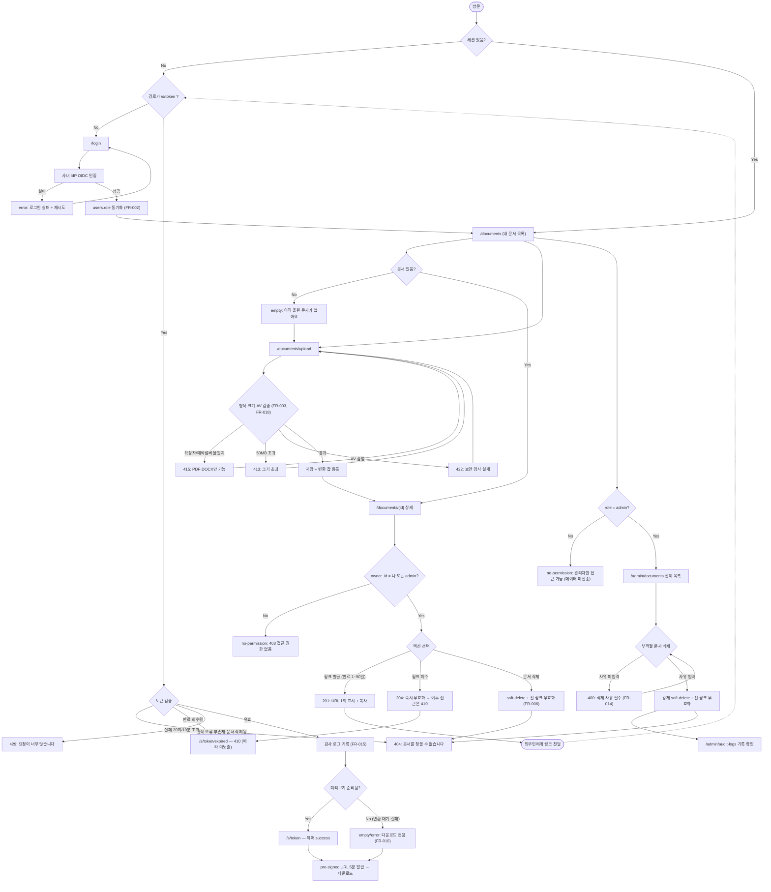

# PRD — 사내 문서 공유 서비스 (Internal Document Sharing)

## 1. Overview

### 1.1 Problem Statement

현재 팀원들은 문서(PDF/DOCX)를 공유할 때 이메일 첨부, 메신저 파일 전송, 개인 클라우드 드라이브 링크를 혼용한다. 이로 인해:

- **버전 혼선** — 같은 문서의 여러 사본이 각기 다른 채널에 흩어져 어느 것이 최신인지 알 수 없다.
- **외부 공유 불가/불안정** — 고객사·협력사 등 사내 계정이 없는 상대에게 문서를 보내려면 매번 개인 드라이브에 올려 "링크 아는 사람 모두" 권한으로 열어야 하고, 이 링크는 회수·감사가 불가능하다.
- **통제 부재** — 부적절하거나 유출성 문서가 올라가도 관리자가 이를 발견해 회수할 수단이 없다.
- **추적 불가** — 누가 언제 무엇을 열람했는지 기록이 없어 사고 시 영향 범위를 산정할 수 없다.

### 1.2 Goals

| # | Goal | 성공의 모습 |
|---|---|---|
| G1 | 사내 팀원이 PDF/DOCX를 30초 안에 업로드하고 공유 링크를 얻는다 | 업로드 → 링크 복사까지 클릭 3회 이내 |
| G2 | 사내 계정이 없는 외부인도 링크만으로 문서를 열람할 수 있다 | 로그인 없이 브라우저에서 문서 확인 가능 |
| G3 | 링크 공유가 통제 가능하다 | 만료·비활성화·삭제로 언제든 접근 차단 |
| G4 | 관리자가 부적절한 문서를 즉시 내릴 수 있다 | 삭제 후 60초 이내 모든 기존 링크가 무효 |
| G5 | 열람 이력이 남는다 | 문서별 열람 로그(시각·IP·링크 토큰) 조회 가능 |

### 1.3 Non-Goals

명시적으로 이번 범위 밖:

- **문서 편집·공동 작업** — 온라인 에디터, 동시 편집, 코멘트/주석 기능 없음. 본 서비스는 read-only 배포 채널이다.
- **버전 관리** — 같은 문서의 리비전 체인, diff, 롤백 없음. 새 버전은 새 문서로 업로드한다.
- **폴더/디렉터리 구조** — 계층형 파일 트리 없음. 소유자 기준 평면 목록 + 검색으로 대체.
- **전문(全文) 검색** — 문서 본문 인덱싱·OCR 없음. 파일명·업로더 기준 검색만.
- **외부 사용자 계정 시스템** — 외부인은 계정을 만들지 않는다. 링크 토큰이 곧 접근 자격이다.
- **DLP/워터마킹/다운로드 차단** — 화면 캡처 방지, 워터마크 삽입, 인쇄 제한 등 강한 유출 통제는 v2 이후.
- **모바일 네이티브 앱** — 반응형 웹으로만 제공.
- **SSO 신규 구축** — 기존 사내 IdP(Google Workspace OIDC)에 연동하며, 자체 비밀번호 계정을 만들지 않는다.

### 1.4 Scope

**포함 (In Scope)**

- 사내 계정(OIDC) 로그인
- PDF/DOCX 업로드 (단일 파일, 최대 50MB)
- 문서 목록 조회 / 삭제 (소유자 본인 문서)
- 공유 링크 생성 — 만료일(기본 7일, 최대 90일) 지정, 링크 비활성화
- 링크를 통한 비로그인 열람 (브라우저 뷰어 + 다운로드)
- 관리자 전용 전체 문서 목록 / 강제 삭제
- 열람 감사 로그 기록 및 조회

**제외 (Out of Scope)**

- 편집, 버전, 폴더, 전문 검색, 워터마킹 (§1.3 참조)
- 링크 비밀번호 보호 → **v1.1로 이연** (v1은 만료일 + 추측 불가 토큰으로 대응)
- 대용량(50MB 초과) 및 기타 포맷(PPTX, XLSX, 이미지, ZIP)
- 문서 공유 알림(이메일/슬랙) 발송

**경계 케이스 처리 원칙** — 사내용이지만 링크 열람은 비로그인이다. 이 둘은 모순이 아니다: **"문서 관리(업로드/목록/삭제/링크발급)는 100% 인증 필수", "문서 열람(콘텐츠 스트리밍)은 유효한 서명 링크 토큰이 인증을 대신한다."** 링크 토큰은 익명 사용자에게 부여되는 1급 자격 증명이며, 리소스 1건 × read 1개 권한으로만 스코프가 한정된다. 이 원칙은 §2.3 / §3 / §4.5 / §5.1에서 동일하게 관철된다.

---

## 2. User Stories

### 2.1 Primary User

**주 사용자 — 문서를 공유하는 팀원 (member)**

> As a **사내 팀원**, I want to **PDF/DOCX 파일을 올리고 만료일이 붙은 공유 링크를 발급받아** so that **사내 계정이 없는 외부 상대에게도 개인 드라이브를 쓰지 않고 안전하게 문서를 전달하고, 필요할 때 회수할 수 있다.**

**보조 사용자**

> As a **링크 수신자(외부인)**, I want to **로그인이나 앱 설치 없이 받은 링크를 열어 문서를 보고 내려받아** so that **자료를 확인하기 위해 별도 계정을 만들 필요가 없다.**

> As a **관리자**, I want to **전체 업로드 문서를 훑어보고 부적절한 문서를 즉시 삭제해** so that **유출·규정 위반 문서가 회사 밖으로 계속 유통되는 것을 막을 수 있다.**

### 2.2 Acceptance Criteria

**정상 경로 (Happy Path)**

```
Scenario: 팀원이 PDF를 업로드하고 공유 링크를 발급한다
  Given 사용자가 member 역할로 로그인되어 있고
    And 12MB 크기의 유효한 PDF 파일을 선택했다
  When 업로드를 실행하고 "공유 링크 만들기"를 누른다
  Then 문서가 저장되고 목록 최상단에 나타나며
    And 만료일이 오늘+7일로 설정된 공유 URL이 발급되고
    And 해당 URL이 클립보드에 복사되었다는 토스트가 표시된다
```

```
Scenario: 외부인이 로그인 없이 공유 링크로 문서를 열람한다
  Given 만료되지 않고 활성 상태인 공유 링크 토큰이 존재하고
    And 방문자는 로그인되어 있지 않다
  When 방문자가 공유 URL에 접속한다
  Then 로그인 화면으로 리다이렉트되지 않고
    And 문서 뷰어에 문서 내용과 파일명·업로더·만료일이 표시되며
    And 열람 이벤트(시각, IP 해시, 토큰 ID)가 감사 로그에 1건 기록된다
```

```
Scenario: 관리자가 부적절한 문서를 삭제한다
  Given 사용자가 admin 역할로 로그인되어 있고
    And 다른 팀원이 올린 문서에 활성 공유 링크 2개가 붙어 있다
  When 관리자가 관리자 콘솔에서 해당 문서를 삭제하고 사유를 입력한다
  Then 문서가 soft-delete 처리되고
    And 연결된 공유 링크 2개가 모두 즉시 무효화되며
    And 삭제 행위(집행자, 대상, 사유, 시각)가 감사 로그에 기록되고
    And 업로더에게 삭제 사실이 알림 없이도 목록 화면에서 "관리자 삭제됨"으로 보인다
```

**실패 / 만료 / 권한부족 경로 (Unhappy Path)**

```
Scenario: 만료된 링크로 접근한다
  Given 공유 링크의 expires_at이 현재 시각보다 과거다
  When 방문자가 해당 URL에 접속한다
  Then 410 Gone 상태와 함께 "이 링크는 만료되었습니다" 페이지가 표시되고
    And 문서 파일명·용량·업로더 등 어떤 메타데이터도 노출되지 않으며
    And 문서 본문 스트리밍 요청은 서버에서 거부된다
```

```
Scenario: 삭제된 문서의 살아있는 링크로 접근한다
  Given 관리자가 문서를 삭제했고
    And 방문자가 삭제 이전에 받아둔 공유 URL을 갖고 있다
  When 방문자가 해당 URL에 접속한다
  Then 404 Not Found와 함께 "문서를 찾을 수 없습니다" 페이지가 표시되고
    And 삭제 사유나 관리자 정보는 노출되지 않는다
```

```
Scenario: 위조·추측된 토큰으로 접근한다
  Given 존재하지 않는 임의의 토큰 문자열을 URL에 넣는다
  When 방문자가 해당 URL에 접속한다
  Then 404 Not Found가 반환되고 (403이 아니다 — 존재 여부를 구분해 알려주지 않는다)
    And 동일 IP에서 10분간 20회 이상 실패하면 429로 차단된다
```

```
Scenario: 일반 팀원이 남의 문서를 삭제하려 한다
  Given 사용자가 member 역할로 로그인되어 있고
    And 대상 문서의 owner_id가 본인이 아니다
  When DELETE /api/documents/{id} 를 직접 호출한다
  Then 403 Forbidden이 반환되고
    And 문서는 그대로 유지되며
    And 인가 실패 시도가 보안 로그에 기록된다
```

```
Scenario: 일반 팀원이 관리자 콘솔에 접근하려 한다
  Given 사용자가 member 역할로 로그인되어 있다
  When /admin/documents 경로로 이동한다
  Then no-permission 상태 화면("관리자만 접근할 수 있습니다")이 렌더되고
    And 하위 API 호출은 403으로 거부되며 다른 팀원의 문서 목록이 클라이언트로 전송되지 않는다
```

```
Scenario: 허용되지 않은 파일 형식·크기를 업로드한다
  Given 사용자가 member 역할로 로그인되어 있다
  When 확장자만 .pdf로 바꾼 60MB 실행 파일을 업로드한다
  Then 클라이언트에서 크기 초과로 1차 차단되고
    And 우회해 직접 API를 호출해도 서버가 magic number 검사로 415 Unsupported Media Type을 반환하며
    And 어떤 파일도 스토리지에 남지 않는다
```

```
Scenario: 링크 발급자가 링크를 조기 회수한다
  Given 만료 전인 활성 공유 링크가 있다
  When 소유자가 해당 링크를 "비활성화"한다
  Then 이후 그 URL 접근은 410 Gone을 반환하고
    And 이미 열려 있던 뷰어 탭에서 새 청크 요청도 거부된다
```

### 2.3 User Roles

역할 키는 영문 소문자 단일 선언이며, §3 FR / §4.5 인가 규칙 / §5.1 API / §5.4 Pages에서 **이 키를 그대로 인용**한다.

| Role Key | 한국어 명칭 | 권한 범위 |
|---|---|---|
| `anonymous` | 링크 수신자(비로그인) | 유효한 공유 토큰을 제시한 경우에만, **해당 1건 문서의 메타 조회 + 콘텐츠 열람/다운로드**. 목록 조회·업로드·삭제·링크 발급 전부 불가. 세션 없음. |
| `member` | 사내 팀원 | 로그인 필수. 업로드, **본인이 소유한** 문서 목록·상세·삭제, 본인 문서의 공유 링크 발급/비활성화, 본인 문서의 열람 로그 조회. 타인 문서 목록 조회 불가. |
| `admin` | 관리자 | `member`의 모든 권한 + **전체 문서 목록 조회**, 타인 문서 강제 삭제(사유 필수), 전체 감사 로그 조회. 타인 문서의 콘텐츠 열람은 감사 로그를 남기고 수행. |

**역할 판정 원칙**
- `member`/`admin`은 사내 IdP(OIDC) 세션에서 유도하며, `admin` 여부는 IdP 그룹 클레임(`groups: doc-share-admin`)을 앱 DB의 `users.role`에 동기화해 판정한다. 클라이언트가 보낸 역할 값은 절대 신뢰하지 않는다.
- `anonymous`는 역할이 아니라 **토큰 스코프**로 취급한다. 서버는 `anonymous` 요청에 대해 "이 토큰이 가리키는 document_id 1건"만 리소스 범위로 인정한다.

---

## 3. Functional Requirements

| ID | Requirement | Priority | Dependencies |
|---|---|---|---|
| FR-001 | 사내 IdP(Google Workspace OIDC)로 로그인/로그아웃한다. 세션은 HttpOnly·Secure·SameSite=Lax 쿠키로 유지하며 유효기간 12시간. | P0 | — |
| FR-002 | IdP의 그룹 클레임을 `users.role`(`member` \| `admin`)로 매핑·동기화한다. 로그인 시마다 갱신한다. | P0 | FR-001 |
| FR-003 | `member`는 PDF/DOCX 단일 파일(≤50MB)을 업로드한다. 서버는 확장자가 아닌 **magic number**로 실제 포맷을 검증하고, 불일치 시 415로 거부한다. | P0 | FR-001 |
| FR-004 | 업로드 파일은 오브젝트 스토리지에 **원본 파일명이 아닌 UUID 키**로 저장하고, 표시용 파일명은 DB 메타데이터로만 보관한다(경로 조작·XSS 차단). | P0 | FR-003 |
| FR-005 | `member`는 **본인이 업로드한** 문서 목록을 최신순으로 조회한다(페이지네이션 20건). 타인 문서는 응답에 포함되지 않는다. | P0 | FR-003 |
| FR-006 | `member`는 본인 문서를 삭제한다(soft-delete). 삭제 즉시 해당 문서에 연결된 **모든 공유 링크가 무효화**된다. | P0 | FR-005 |
| FR-007 | `member`는 본인 문서에 대해 공유 링크를 발급한다. 토큰은 CSPRNG 기반 128비트 이상 URL-safe 문자열이며 **DB에는 해시로 저장**한다. | P0 | FR-005 |
| FR-008 | 공유 링크 발급 시 만료일을 지정한다. 기본 7일, 최대 90일, 무기한 불가. 만료 시각은 서버 시각(UTC) 기준으로 판정한다. | P0 | FR-007 |
| FR-009 | `anonymous`는 유효한 공유 토큰으로 **인증 없이** 해당 문서 1건의 메타(파일명·용량·업로더 표시명·만료일)와 콘텐츠를 열람/다운로드한다. 토큰이 없거나 유효하지 않으면 어떤 정보도 반환하지 않는다. | P0 | FR-007, FR-008 |
| FR-010 | 문서 열람은 브라우저 내 뷰어로 제공한다. PDF는 네이티브 렌더, **DOCX는 업로드 시 서버에서 PDF로 변환한 미리보기본**을 렌더한다(변환 실패 시 다운로드 전용으로 graceful degradation). | P1 | FR-009 |
| FR-011 | 만료·비활성화된 토큰 접근은 **410 Gone**, 삭제·부존재 문서/토큰 접근은 **404 Not Found**를 반환한다. 어느 경우에도 문서 메타데이터를 노출하지 않는다. | P0 | FR-009 |
| FR-012 | `member`는 본인이 발급한 링크를 만료 전에 비활성화(회수)할 수 있다. 비활성화는 즉시(≤60초, 캐시 TTL 포함) 반영된다. | P0 | FR-007 |
| FR-013 | `admin`은 전체 문서 목록(업로더·업로드일·크기·활성 링크 수)을 조회하고 검색(파일명·업로더)할 수 있다. | P0 | FR-002, FR-005 |
| FR-014 | `admin`은 타인 문서를 강제 삭제한다. **삭제 사유 입력이 필수**이며, 문서와 연결된 모든 링크가 무효화된다. | P0 | FR-013 |
| FR-015 | 모든 열람(`anonymous` 포함), 업로드, 삭제, 링크 발급/비활성화, 인가 실패를 감사 로그에 기록한다(행위자, 대상, 시각, IP 해시, User-Agent). | P0 | FR-003, FR-009 |
| FR-016 | `member`는 본인 문서의 열람 로그(시각·대략적 위치 없이 토큰별 카운트)를 조회한다. `admin`은 전체 감사 로그를 조회한다. | P1 | FR-015 |
| FR-017 | 공유 토큰 대입 시도를 방어한다 — 동일 IP 기준 실패 20회/10분 초과 시 429로 차단한다. | P0 | FR-009 |
| FR-018 | 업로드 파일은 저장 전 안티바이러스 스캔을 거치며, 감염 판정 시 저장하지 않고 422로 거부한다. | P1 | FR-003 |
| FR-019 | soft-delete된 문서의 실제 바이트는 30일 후 스토리지에서 영구 파기한다(배치). | P1 | FR-006, FR-014 |
| FR-020 | 문서 목록·상세 화면은 §5.4.1의 5개 상태(loading/empty/error/success/no-permission)를 모두 렌더한다. | P1 | FR-005, FR-013 |

**모순 방지 검증 (FR consistency check)**

- FR-009("인증 없이 열람")와 FR-001/FR-005("로그인 필수")는 **적용 대상이 분리**되어 충돌하지 않는다: FR-001/005/006/007은 *문서 관리 평면*(목록·업로드·삭제·링크발급), FR-009/010/011은 *콘텐츠 열람 평면*(토큰 스코프 단건)이다. 열람 평면에는 목록·변경 작업이 존재하지 않는다.
- FR-006(소유자 삭제)와 FR-014(관리자 강제 삭제)는 동일한 soft-delete 상태 머신을 공유하며, 결과(링크 전면 무효화)가 동일해 분기 충돌이 없다. 차이는 `deleted_by_role`과 사유 필수 여부뿐이다.
- FR-011의 410/404 구분은 FR-009의 "유효하지 않으면 정보 미노출" 원칙과 양립한다 — 두 응답 모두 본문에 문서 메타를 담지 않는다.
- FR-008(최대 90일)과 FR-012(조기 회수)는 상한과 조기 종료로 상호 보완이며, "무기한 링크"를 허용하는 FR은 존재하지 않는다.

---

## 4. Non-Functional Requirements

### 4.0 Scale Grade

**`Startup`**

근거: 사내 팀원 50~200명(1년 내 최대 300명), 일 업로드 100~300건, 링크 열람 일 1,000~3,000회, 피크 동시 사용자 30명 수준 — 단일 리전 관리형 PaaS + 관리형 Postgres 1대(+리드 레플리카 없음)로 충분하며 샤딩·멀티리전은 불필요하다.

### 4.1 Performance

정량 목표 (모두 프로덕션 30일 롤링 기준):

| 대상 | 지표 | 목표 |
|---|---|---|
| 문서 목록 API (`GET /api/documents`) | p95 latency | ≤ 300 ms |
| 문서 목록 API | p99 latency | ≤ 800 ms |
| 공유 링크 검증 (`GET /s/{token}` 메타 해석) | p95 latency | ≤ 200 ms |
| 문서 콘텐츠 첫 바이트 (TTFB, CDN 경유) | p95 | ≤ 500 ms |
| 10MB PDF 전체 다운로드 완료 | p95 | ≤ 5 s (10Mbps 기준) |
| 업로드 (50MB, 사내망) | p95 | ≤ 20 s |
| DOCX→PDF 변환 (비동기 잡) | p95 | ≤ 30 s / 타임아웃 90 s |
| 뷰어 페이지 LCP (데스크톱) | p75 | ≤ 2.5 s |
| 처리량 | 지속 | 50 req/s (피크 150 req/s 5분 버스트 흡수) |
| 동시성 | 동시 열람 세션 | 100 (동시 업로드 10) |

성능 회귀 기준: 위 p95 목표를 연속 3일 초과하면 릴리스 롤백 대상.

### 4.2 Availability

- **가용성 목표**: 월 99.5% (월 다운타임 예산 약 3.6시간). 사내 업무 도구이며 24/7 매출 경로가 아니므로 99.9%를 목표하지 않는다.
- **핵심 경로 우선순위**: 링크 열람(`/s/{token}`) > 업로드 > 관리자 콘솔. 부분 장애 시 열람 경로를 최후까지 유지한다.
- **장애 시 동작 (degradation ladder)**
  - 오브젝트 스토리지 장애 → 업로드 503 + "잠시 후 다시 시도" 배너, 이미 CDN 캐시된 문서 열람은 계속 동작.
  - DB 장애 → 전 경로 503, 상태 페이지 자동 전환. 토큰 검증이 DB 의존이므로 열람도 중단(의도된 fail-closed — 검증 없이 콘텐츠를 열지 않는다).
  - DOCX 변환 워커 장애 → 변환 큐 적체, 뷰어는 "미리보기 준비 중, 다운로드는 가능" 상태로 degrade (FR-010).
  - AV 스캐너 장애 → 업로드 **차단(fail-closed)**. 스캔 없이 저장하지 않는다.
- **모니터링**: 열람 성공률·5xx 비율·큐 적체 길이 알림, 5분 간격 헬스체크, 온콜은 업무시간 대응(비업무시간 베스트에포트).

### 4.3 Data

| 데이터 | 보관 기간 | 비고 |
|---|---|---|
| 문서 원본 바이트 | soft-delete 후 **30일** 뒤 영구 파기 (FR-019) | 오삭제 복구 창구 |
| 문서 메타데이터 | 삭제 후 1년(감사 목적, 파일명은 마스킹) | 법적 분쟁 대비 |
| DOCX→PDF 변환본 | 원본과 동일 수명 | 원본 파기 시 동시 파기 |
| 감사/열람 로그 | **1년** 후 자동 삭제 | 사고 조사 실사용 창 |
| 세션 | 12시간 | FR-001 |
| 공유 토큰 해시 | 만료 후 90일 | 사후 추적용, 이후 파기 |

**개인정보 취급**
- 수집 항목: 사내 사용자 — 이름, 회사 이메일, IdP subject. 링크 열람자(`anonymous`) — **IP는 원본을 저장하지 않고 일별 솔트로 해시**, User-Agent 문자열, 열람 시각.
- 문서 본문에 개인정보가 포함될 수 있으므로 **전 저장소 암호화(§4.5)** 및 **본문 인덱싱 금지**(§1.3 non-goal)를 유지한다.
- 삭제 요청 처리: 퇴사자 계정 비활성화 시 소유 문서는 자동 삭제하지 않고 관리자에게 인계 큐로 이관(무단 자료 소실 방지). 개인정보 삭제 요청은 감사 로그의 식별자를 30일 내 익명화.
- 국외 이전 없음(단일 리전, 국내 리전 고정).

### 4.4 Recovery

- **백업**: Postgres 자동 일 1회 풀 백업 + PITR용 WAL 연속 아카이빙, 보관 14일. 오브젝트 스토리지는 버저닝 + 교차 버킷 복제(동일 리전 내 다른 AZ).
- **RPO ≤ 15분, RTO ≤ 4시간** (Startup 등급에 맞춘 목표. 무중단 페일오버는 목표하지 않는다.)
- **복구 시나리오**
  - 실수로 삭제된 문서 → 30일 파기 유예 창 내에서 관리자가 복원(soft-delete 되돌리기). 링크는 **복원되지 않으며 재발급이 필요**하다(만료된 신뢰를 자동 부활시키지 않는다).
  - DB 손상 → PITR로 사고 직전 시점 복구. 복구 후 스토리지 고아 객체 정리 배치 실행.
  - 랜섬웨어/대량 삭제 → 스토리지 버저닝으로 이전 버전 복원 + 삭제 API에 대한 관리자 대량삭제 rate limit(분당 20건).
- **검증**: 분기 1회 복구 리허설(백업에서 스테이징 복원 후 열람 경로 스모크 테스트)을 수행하고 결과를 기록한다.

### 4.5 Security

**인증 (Authentication)**
- 사내 사용자: 사내 IdP OIDC Authorization Code + PKCE. 자체 비밀번호 저장 없음. 세션은 서버사이드 세션 ID(HttpOnly·Secure·SameSite=Lax), 12시간 만료, 로그아웃 시 서버에서 즉시 폐기.
- 링크 열람자: 세션 없음. **공유 토큰이 곧 자격 증명**이다. 토큰은 CSPRNG 128비트+ URL-safe(예: 22자 base64url), DB에는 SHA-256 해시만 저장하며, 검증은 상수시간 비교로 수행한다. 토큰은 URL path에 두되 `Referrer-Policy: no-referrer`로 외부 유출을 막는다.

**인가 규칙 (Authorization — 어느 역할이 어느 리소스에)**

| 리소스 / 액션 | `anonymous` | `member` | `admin` |
|---|---|---|---|
| 문서 업로드 | ✗ | ✓ | ✓ |
| 내 문서 목록 조회 | ✗ | ✓ (owner_id = self 강제) | ✓ |
| 전체 문서 목록 조회 | ✗ | ✗ (403) | ✓ |
| 문서 메타 상세 조회 | 유효 토큰이 가리키는 **1건만** | 본인 소유만 | 전체 |
| 문서 콘텐츠 열람/다운로드 | 유효 토큰이 가리키는 1건만 | 본인 소유만 | 전체 (감사 로그 필수) |
| 문서 삭제 | ✗ | 본인 소유만 | 전체 (사유 필수) |
| 공유 링크 발급 | ✗ | 본인 문서만 | 본인 문서만 (타인 문서 링크 발급 불가 — 관리자는 회수 권한만 갖는다) |
| 공유 링크 비활성화 | ✗ | 본인 발급분만 | 전체 |
| 열람 로그 조회 | ✗ | 본인 문서분만 | 전체 |
| 관리자 콘솔 진입 | ✗ | ✗ (no-permission 화면) | ✓ |

강제 방식: 모든 데이터 접근은 **서버 측에서 `owner_id`/`role` 조건을 쿼리에 주입**한다. 클라이언트가 보낸 `owner_id`·`role`·`is_admin` 값은 무시한다. IDOR 방지를 위해 문서 ID는 순차 정수가 아닌 UUIDv7을 쓰되, UUID 자체를 접근 통제로 간주하지 않는다(항상 소유권 검사 병행).

**전송·저장 보호**
- 전송: TLS 1.2+ 강제, HSTS(max-age 1년, preload), 평문 HTTP는 308 리다이렉트.
- 저장: 오브젝트 스토리지 SSE(AES-256), DB 저장 시 암호화(at-rest), 백업도 암호화.
- 콘텐츠 서빙: 스토리지 버킷은 **전면 비공개**. 서버가 토큰을 검증한 뒤 **수명 5분짜리 pre-signed URL**을 발급하거나 프록시 스트리밍한다. pre-signed URL은 재사용·공유돼도 5분 후 만료된다.
- 다운로드 응답에 `Content-Disposition: attachment; filename*=UTF-8''...`, `X-Content-Type-Options: nosniff` 적용. 뷰어 페이지는 문서를 **샌드박스 iframe(별도 오리진 또는 `sandbox` 속성)** 에서 렌더해 PDF 내 스크립트로 인한 XSS를 격리한다.
- CSP: `default-src 'self'; object-src 'none'; frame-ancestors 'none'; script-src 'self'`.

**입력 검증**
- 파일: 확장자 화이트리스트(.pdf/.docx) + **magic number 검증** + 크기 상한 50MB(프록시/앱 양쪽). 원본 파일명은 저장 경로에 쓰지 않고(FR-004), 표시 시 이스케이프.
- 파일명 길이 255자 제한, 제어문자·경로 구분자(`/`, `\`, `..`) 제거.
- 토큰 파라미터: 정규식으로 형식 검증 후 조회(형식 불일치는 DB 조회 없이 404).
- 모든 쿼리는 파라미터 바인딩(문자열 결합 금지), 목록 정렬/필터 파라미터는 화이트리스트 매핑.
- 상태 변경 요청(POST/DELETE)에 CSRF 토큰 또는 Origin 헤더 검증. 열람 경로는 GET/idempotent라 CSRF 대상 아님.
- 레이트 리밋: 토큰 검증 실패 20회/10분/IP(FR-017), 업로드 30건/시간/사용자, 관리자 삭제 20건/분.

**남은 리스크 (수용)**
- 링크가 제3자에게 전달되면 만료 전까지 열람 가능하다 — v1은 만료일 + 회수 + 감사 로그로 완화하며, 링크 비밀번호/도메인 제한은 v1.1(§6 Phase 4)로 이연한다. 이 리스크는 브리프의 "링크를 받은 외부인 열람 허용" 요구에서 파생된 **의도된 트레이드오프**다.

---

## 5. Technical Design

### 5.1 API Specification

인가 주체(Authorized principal)는 §2.3 Role Key로 표기한다.

| Method | Endpoint | 인가 주체 | 설명 | 주요 응답 |
|---|---|---|---|---|
| GET | `/api/auth/login` | `anonymous`(미인증 방문자) | OIDC 인가 요청 리다이렉트 | 302 |
| GET | `/api/auth/callback` | IdP 콜백 | 코드 교환, 세션 발급, `users.role` 동기화 (FR-002) | 302 / 401 |
| POST | `/api/auth/logout` | `member`, `admin` | 세션 폐기 | 204 |
| GET | `/api/me` | `member`, `admin` | 현재 사용자·역할 | 200 / 401 |
| POST | `/api/documents` | `member`, `admin` (본인 소유로 생성) | multipart 업로드. magic number·크기·AV 검증 (FR-003, FR-018) | 201 / 413 / 415 / 422 |
| GET | `/api/documents` | `member`(owner_id=self 강제), `admin`(전체는 `/api/admin/documents` 사용) | 내 문서 목록, `?cursor=&limit=20` | 200 / 401 |
| GET | `/api/documents/{id}` | `member`(본인 소유만), `admin`(전체) | 문서 메타 상세 + 링크 목록 | 200 / 403 / 404 |
| DELETE | `/api/documents/{id}` | `member`(본인 소유만) | soft-delete + 링크 전면 무효화 (FR-006) | 204 / 403 / 404 |
| POST | `/api/documents/{id}/links` | `member`(본인 문서만) | 공유 링크 발급, body: `{ expires_in_days: 1..90 }` (FR-007, FR-008) | 201 `{ url, expires_at }` / 400 / 403 |
| GET | `/api/documents/{id}/links` | `member`(본인 문서만), `admin` | 링크 목록(토큰 원문은 재노출하지 않음, 발급 시 1회만 표시) | 200 / 403 |
| POST | `/api/links/{link_id}/revoke` | `member`(본인 발급분), `admin`(전체) | 즉시 비활성화 (FR-012) | 204 / 403 / 404 |
| GET | `/api/documents/{id}/views` | `member`(본인 문서분), `admin`(전체) | 열람 로그 (FR-016) | 200 / 403 |
| GET | `/s/{token}` | `anonymous` (**토큰이 인가 주체**) | 공유 뷰어 페이지. 토큰 검증 후 메타 반환 (FR-009) | 200 / 404(부존재·삭제) / 410(만료·회수) / 429 |
| GET | `/api/public/links/{token}/content` | `anonymous` (**토큰 스코프 = 문서 1건 read**) | 5분 pre-signed URL 발급 또는 스트리밍 (FR-009) | 302/200 / 404 / 410 / 429 |
| GET | `/api/admin/documents` | `admin` **전용** | 전체 문서 목록·검색 (FR-013) | 200 / 403 |
| DELETE | `/api/admin/documents/{id}` | `admin` **전용** | 강제 삭제, body: `{ reason }` 필수 (FR-014) | 204 / 400(사유 누락) / 403 |
| GET | `/api/admin/audit-logs` | `admin` **전용** | 감사 로그 조회·필터 (FR-015, FR-016) | 200 / 403 |

**공통 규칙**
- `/api/public/*` 와 `/s/*` 만이 미인증 접근을 허용하는 경로다. 그 외 전 경로는 세션 미들웨어에서 401로 차단한다(**deny-by-default**).
- 인가 실패는 리소스 존재를 드러내지 않도록: 소유권 위반은 403, 부존재는 404, 토큰 만료/회수는 410으로 통일한다.
- 오류 응답은 `{ code, message }` 형태이며 스택트레이스·내부 경로를 포함하지 않는다.

### 5.2 Database Schema

```sql
-- 사용자 (IdP 미러)
CREATE TABLE users (
  id            UUID PRIMARY KEY,
  idp_subject   TEXT NOT NULL UNIQUE,
  email         CITEXT NOT NULL UNIQUE,
  display_name  TEXT NOT NULL,
  role          TEXT NOT NULL DEFAULT 'member'
                  CHECK (role IN ('member','admin')),   -- §2.3 Role Key
  is_active     BOOLEAN NOT NULL DEFAULT TRUE,
  created_at    TIMESTAMPTZ NOT NULL DEFAULT now(),
  last_login_at TIMESTAMPTZ
);

-- 문서
CREATE TABLE documents (
  id              UUID PRIMARY KEY,               -- UUIDv7
  owner_id        UUID NOT NULL REFERENCES users(id),
  display_name    TEXT NOT NULL,                  -- 원본 파일명(표시 전용)
  storage_key     TEXT NOT NULL UNIQUE,           -- UUID 기반 키 (FR-004)
  preview_key     TEXT,                           -- DOCX→PDF 변환본 (FR-010)
  mime_type       TEXT NOT NULL
                    CHECK (mime_type IN (
                      'application/pdf',
                      'application/vnd.openxmlformats-officedocument.wordprocessingml.document')),
  byte_size       BIGINT NOT NULL CHECK (byte_size > 0 AND byte_size <= 52428800),
  checksum_sha256 TEXT NOT NULL,
  av_status       TEXT NOT NULL DEFAULT 'pending'
                    CHECK (av_status IN ('pending','clean','infected')),   -- FR-018
  preview_status  TEXT NOT NULL DEFAULT 'none'
                    CHECK (preview_status IN ('none','pending','ready','failed')),
  created_at      TIMESTAMPTZ NOT NULL DEFAULT now(),
  deleted_at      TIMESTAMPTZ,                    -- soft-delete
  deleted_by      UUID REFERENCES users(id),
  deleted_reason  TEXT,                           -- admin 삭제 시 필수 (FR-014)
  purge_after     TIMESTAMPTZ                     -- deleted_at + 30d (FR-019)
);
CREATE INDEX idx_documents_owner ON documents(owner_id, created_at DESC) WHERE deleted_at IS NULL;
CREATE INDEX idx_documents_purge ON documents(purge_after) WHERE deleted_at IS NOT NULL;

-- 공유 링크
CREATE TABLE share_links (
  id           UUID PRIMARY KEY,
  document_id  UUID NOT NULL REFERENCES documents(id) ON DELETE CASCADE,
  token_hash   BYTEA NOT NULL UNIQUE,             -- SHA-256(token), 원문 미저장
  created_by   UUID NOT NULL REFERENCES users(id),
  expires_at   TIMESTAMPTZ NOT NULL,              -- ≤ created_at + 90d (FR-008)
  revoked_at   TIMESTAMPTZ,                       -- FR-012
  view_count   INTEGER NOT NULL DEFAULT 0,
  created_at   TIMESTAMPTZ NOT NULL DEFAULT now(),
  CHECK (expires_at > created_at)
);
CREATE INDEX idx_share_links_token ON share_links(token_hash);
CREATE INDEX idx_share_links_doc   ON share_links(document_id);

-- 감사 로그 (FR-015) — 월 파티션
CREATE TABLE audit_logs (
  id            BIGSERIAL,
  occurred_at   TIMESTAMPTZ NOT NULL DEFAULT now(),
  actor_role    TEXT NOT NULL CHECK (actor_role IN ('anonymous','member','admin')),
  actor_user_id UUID REFERENCES users(id),        -- anonymous면 NULL
  share_link_id UUID REFERENCES share_links(id),  -- anonymous 열람 시 채움
  action        TEXT NOT NULL,                    -- upload|view|download|delete|link_create|link_revoke|authz_denied
  document_id   UUID,
  ip_hash       BYTEA,                            -- 일별 솔트 해시 (§4.3)
  user_agent    TEXT,
  detail        JSONB,
  PRIMARY KEY (id, occurred_at)
) PARTITION BY RANGE (occurred_at);
CREATE INDEX idx_audit_doc  ON audit_logs(document_id, occurred_at DESC);
CREATE INDEX idx_audit_time ON audit_logs(occurred_at DESC);
```

**유효 링크 판정 (단일 정의 — 모든 경로가 이 술어를 재사용)**

```sql
-- 410 vs 404 분기 (FR-011)
--   행 없음                          → 404
--   문서 deleted_at IS NOT NULL      → 404
--   revoked_at IS NOT NULL           → 410
--   expires_at <= now()              → 410
--   그 외                             → 200
```

### 5.3 Architecture

```
[Browser: member/admin]        [Browser: anonymous 링크 수신자]
        |                                   |
        | 세션 쿠키                          | /s/{token}
        v                                   v
   +-------------------------------------------------+
   |            CDN / WAF (TLS, rate limit)          |
   +-------------------------------------------------+
                        |
                        v
   +-------------------------------------------------+
   |  Web App (Next.js) — App Router                 |
   |   · /(auth)  인증 필수 라우트 그룹                 |
   |   · /s/*     공개 라우트 (토큰 스코프)             |
   |  API Layer (Route Handlers)                     |
   |   · authn 미들웨어: deny-by-default              |
   |   · authz 서비스: owner_id/role 쿼리 주입         |
   +-------------------------------------------------+
        |                |                  |
        v                v                  v
  [PostgreSQL]     [Object Storage]   [Job Queue]
   users             원본/변경본        · AV 스캔 (FR-018)
   documents         (비공개 버킷,      · DOCX→PDF (FR-010)
   share_links        SSE, 버저닝)      · purge 배치 (FR-019)
   audit_logs                          · 로그 보관 만료 배치
        ^
        |
  [사내 IdP — Google Workspace OIDC]
```

**설계 근거**
- **모놀리식 단일 배포** — Scale Grade `Startup`(§4.0)이고 도메인 경계가 문서 1개뿐이라 MSA 분리 이득이 없다. 큐 워커만 별도 프로세스로 뺀다(변환·스캔이 요청 지연을 오염시키지 않도록).
- **콘텐츠는 앱을 거치지 않는다** — 토큰 검증만 앱이 하고 실제 바이트는 pre-signed URL로 스토리지/CDN이 직접 서빙해 §4.1의 TTFB·다운로드 목표를 만족시킨다.
- **인증 평면 분리** — 라우트 그룹 수준에서 `/s/*` 와 나머지를 갈라, "사내용인데 외부 열람 허용"이 코드 구조에 명시적으로 드러나게 한다(§1.4 경계 원칙).
- **fail-closed 기본** — AV·토큰 검증·DB 장애 시 열지 않는 쪽으로 실패한다(§4.2).

### 5.4 Pages

`Audience`는 §2.3 Role Key를 그대로 사용한다.

| Route | Audience | Auth | Linked FRs | Has FE Components | Primary State | Responsive |
|---|---|---|---|---|---|---|
| `/login` | `anonymous` | 불필요 | FR-001 | Yes | success (IdP 버튼) | Yes |
| `/documents` | `member`, `admin` | 세션 필수 | FR-005, FR-006, FR-020 | Yes | success (목록) | Yes |
| `/documents/upload` | `member`, `admin` | 세션 필수 | FR-003, FR-004, FR-018 | Yes | success (드롭존) | Yes |
| `/documents/{id}` | `member`(본인), `admin` | 세션 필수 + 소유권 | FR-007, FR-008, FR-012, FR-016 | Yes | success (상세+링크 관리) | Yes |
| `/s/{token}` | `anonymous` | **불필요 (토큰이 인가)** | FR-009, FR-010, FR-011, FR-017 | Yes | success (뷰어) | Yes |
| `/s/{token}/expired` | `anonymous` | 불필요 | FR-011 | Yes | error (410 안내) | Yes |
| `/admin/documents` | `admin` | 세션 필수 + role=admin | FR-013, FR-014, FR-020 | Yes | success (전체 목록) | Yes |
| `/admin/audit-logs` | `admin` | 세션 필수 + role=admin | FR-015, FR-016 | Yes | success (로그 테이블) | Yes |

`Has FE Components: Yes` 행이 8개이므로 §5.4.1과 §5.5를 작성한다.

### 5.4.1 Page State Matrix

| Route | loading | empty | error | success | no-permission | 비고 |
|---|---|---|---|---|---|---|
| `/login` | IdP 리다이렉트 스피너 | N/A (항상 로그인 버튼 노출) | "로그인에 실패했습니다. 다시 시도해 주세요" + 재시도 | 사내 계정 로그인 버튼 | N/A (미인증 전용 페이지) | 이미 로그인 상태면 `/documents`로 리다이렉트 |
| `/documents` | 스켈레톤 행 5개 | "아직 올린 문서가 없어요" + [문서 올리기] CTA | "목록을 불러오지 못했습니다" + 재시도 버튼 | 문서 카드/행 목록 + 커서 페이지네이션 | N/A (인증만 통과하면 본인 문서는 항상 허용) | 세션 만료 시 `/login`으로 |
| `/documents/upload` | 진행률 바(%)·취소 버튼 | N/A (입력 폼이라 empty 개념 없음) | 415 "PDF·DOCX만 올릴 수 있어요" / 413 "50MB 이하만 가능해요" / 422 "보안 검사에 걸린 파일이에요" | "업로드 완료" + [공유 링크 만들기] | N/A | 실패 시 선택 파일 유지, 재시도 가능 |
| `/documents/{id}` | 메타·링크 영역 스켈레톤 | "발급된 공유 링크가 없어요" + [링크 만들기] | "문서 정보를 불러오지 못했습니다" + 재시도 | 문서 메타 + 링크 목록(만료일·상태·열람수) + 회수 버튼 | 타인 문서 접근 시 "이 문서에 접근할 권한이 없습니다" (403) | 삭제된 문서는 404 화면 |
| `/s/{token}` | 뷰어 스켈레톤 + "문서를 여는 중" | 변환 대기 시 "미리보기를 준비 중입니다" + [원본 다운로드] | 렌더 실패 시 "미리보기를 표시할 수 없습니다" + [다운로드] / 429 "요청이 너무 많습니다" | 문서 뷰어 + 파일명·업로더·만료일 + 다운로드 | **N/A — `anonymous`에게 부분 권한 개념이 없다.** 토큰이 유효하면 success, 아니면 404/410 | 만료·회수는 `/s/{token}/expired`로 |
| `/s/{token}/expired` | N/A (정적) | N/A | 본 페이지 자체가 error 상태 | N/A | N/A | "링크가 만료되었습니다. 보낸 사람에게 새 링크를 요청하세요" — 문서 메타 미노출 (FR-011) |
| `/admin/documents` | 테이블 스켈레톤 | "조건에 맞는 문서가 없습니다" (검색 결과 0건) | "목록을 불러오지 못했습니다" + 재시도 | 전체 문서 테이블 + 검색 + 삭제(사유 모달) | `member` 접근 시 "관리자만 접근할 수 있습니다" — **데이터 미전송** | 삭제는 확인 모달 + 사유 필수 |
| `/admin/audit-logs` | 테이블 스켈레톤 | "해당 기간의 로그가 없습니다" | "로그를 불러오지 못했습니다" + 재시도 | 로그 테이블 + 기간·행위·역할 필터 | `member` 접근 시 "관리자만 접근할 수 있습니다" | IP는 해시 표시(원본 비노출) |

상태 정의 — `loading`: fetch 중 / `empty`: 정상 응답 0건 / `error`: 4xx·5xx 또는 검증 실패 / `success`: 결과 ≥1건 / `no-permission`: 인증됐으나 권한 부족.

### 5.5 User Flow



---

## 6. Implementation Phases

FR 의존성 순서를 지킨다. **P0 FR은 Phase 3까지 전부 완료**되며, P1만 Phase 4로 넘어간다.

### Phase 1 — 인증 · 저장 기반 (1.5주)

| 태스크 | 관련 FR |
|---|---|
| 프로젝트 스캐폴딩, CI, 스테이징 환경 | — |
| OIDC 로그인/로그아웃, 서버 세션, deny-by-default 미들웨어 | FR-001 |
| IdP 그룹 → `users.role` 동기화 | FR-002 |
| `users`/`documents`/`share_links`/`audit_logs` 스키마 + 마이그레이션 | FR-004, FR-015 |
| 비공개 버킷·SSE·pre-signed URL 발급 유틸 | §4.5 |

**Deliverable**: 스테이징에서 사내 계정으로 로그인해 `/documents` 빈 화면에 도달하고, 미인증 요청이 401로 차단되는 것이 e2e 테스트로 증명된다. 역할 동기화 결과를 `/api/me`로 확인 가능.

### Phase 2 — 업로드 · 목록 · 삭제 (2주)

| 태스크 | 관련 FR |
|---|---|
| 업로드 API (magic number 검증, 크기 제한, UUID 스토리지 키) | FR-003, FR-004 |
| 업로드 UI(드롭존·진행률·에러 4종) | FR-003, FR-020 |
| 내 문서 목록 API/UI (owner_id 강제 주입, 커서 페이지네이션) | FR-005 |
| 문서 상세 + soft-delete (링크 연쇄 무효화 포함) | FR-006 |
| 감사 로그 기록기(upload/delete/authz_denied) | FR-015 |
| 인가 테스트: 타인 문서 조회/삭제 403 | §4.5 |

**Deliverable**: 팀원이 PDF/DOCX를 올려 본인 목록에서 확인하고 삭제할 수 있다. 타인 문서 접근 403, 위조 파일 415가 자동화 테스트로 고정된다. IDOR 테스트 스위트 통과.

### Phase 3 — 공유 링크 · 공개 열람 · 관리자 (2주)

| 태스크 | 관련 FR |
|---|---|
| 링크 발급(CSPRNG 토큰, 해시 저장, 만료 1~90일) | FR-007, FR-008 |
| 링크 회수 API/UI | FR-012 |
| 공개 라우트 `/s/{token}` — 토큰 검증, 404/410 분기, 메타 미노출 | FR-009, FR-011 |
| 콘텐츠 서빙(5분 pre-signed), Referrer-Policy·CSP·nosniff | FR-009, §4.5 |
| 토큰 브루트포스 레이트 리밋 | FR-017 |
| 관리자 전체 목록·검색 | FR-013 |
| 관리자 강제 삭제(사유 필수) + 링크 무효화 | FR-014 |
| 열람 이벤트 감사 로깅(`anonymous` 포함) | FR-015 |

**Deliverable**: 외부인이 로그인 없이 링크로 문서를 열람하고, 만료·회수·삭제된 링크는 각각 410/410/404로 차단된다. 관리자가 부적절 문서를 사유와 함께 삭제하면 60초 내 모든 링크가 죽는다. **여기서 모든 P0 FR이 완료되어 v1 릴리스 가능.**

### Phase 4 — 열람 경험 · 운영 강화 (1.5주, P1)

| 태스크 | 관련 FR |
|---|---|
| DOCX→PDF 변환 워커 + 뷰어 degrade 처리 | FR-010 |
| AV 스캔 파이프라인(fail-closed) | FR-018 |
| 열람 로그 화면(소유자/관리자) | FR-016 |
| 5-상태 렌더 일괄 점검 | FR-020 |
| 30일 purge 배치 + 로그 보관 만료 배치 | FR-019, §4.3 |
| 백업·PITR 설정 및 복구 리허설 1회 | §4.4 |
| 부하 테스트로 §4.1 p95 목표 검증 | §4.1 |

**Deliverable**: DOCX가 브라우저에서 바로 보이고, 변환 실패 시에도 다운로드로 degrade된다. 백업 복구 리허설 보고서와 부하 테스트 리포트가 산출된다.

### Phase 5 — v1.1 후보 (범위 밖, 백로그)

링크 비밀번호 보호, 수신자 이메일 도메인 제한, 워터마킹, 슬랙 알림. Phase 4 종료 후 실사용 데이터를 근거로 우선순위를 재산정한다.

---

## 7. Success Metrics

| Metric | Target | Measurement |
|---|---|---|
| 공유 링크 채택률 | 출시 8주 내 활성 팀원의 60%가 링크를 1회 이상 발급 | `share_links` distinct `created_by` / 활성 `users` (주간 집계) |
| 업로드→링크 발급 소요 시간 | 중앙값 ≤ 60초, p90 ≤ 180초 | 업로드 성공 이벤트 → 첫 링크 발급 이벤트 시각차 (audit_logs) |
| 외부 열람 성공률 | `/s/{token}` 요청 중 200 응답 비율 ≥ 92% (410 만료 제외 시 ≥ 98%) | CDN/앱 상태코드 비율, 주간 |
| 개인 드라이브 이탈 | 출시 12주 후 설문에서 "외부 문서 공유 시 본 서비스 사용" ≥ 70% | 분기 사내 설문(n≥50) |
| 관리자 회수 리드타임 | 부적절 문서 신고→삭제 완료 중앙값 ≤ 4시간 | 신고 티켓 생성 시각 ↔ `documents.deleted_at` |
| 삭제 반영 지연 | 삭제/회수 후 링크 무효화까지 p99 ≤ 60초 | 합성 모니터(삭제 후 재접근 폴링) |
| 열람 경로 가용성 | 월 99.5% 이상 | 5분 간격 합성 체크의 성공률 |
| API 성능 | §4.1의 p95 목표 전 항목 충족 | APM 대시보드 30일 롤링 |
| 보안 사고 | 인가 우회로 인한 문서 노출 0건 | 감사 로그 이상탐지 + 분기 침투 테스트 |
| 토큰 대입 차단 | 브루트포스 시도 중 429 차단율 ≥ 99% | 레이트 리밋 메트릭 주간 |
| 업로드 실패율 | 전체 업로드 중 5xx 실패 ≤ 1% | 업로드 API 상태코드 비율 |
