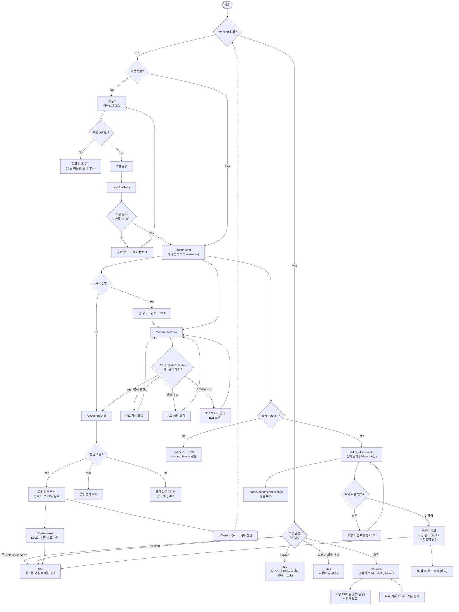

# PRD — 사내 문서 공유 서비스 (Internal Document Sharing)

## 1. Overview

### 1.1 Problem Statement
현재 팀원 간 문서(PDF/DOCX) 전달은 메신저 첨부와 개인 클라우드 드라이브 링크로 흩어져 있다. 이로 인해:
- **버전 혼선** — 같은 문서의 사본이 여러 곳에 존재해 어느 것이 최신인지 알 수 없다.
- **외부 공유의 통제 불가** — 외부 파트너에게 문서를 보낼 때 개인 계정 링크를 쓰므로, 회사가 누가 무엇을 언제까지 볼 수 있는지 파악·회수할 수 없다.
- **부적절 문서 대응 불가** — 대외비 오배포나 부적절한 문서가 올라가도 이를 일괄 확인·차단할 관리 주체와 수단이 없다.
- **감사 추적 부재** — 유출 사고 시 누가 언제 열람했는지 추적할 기록이 없다.

### 1.2 Goals
| # | Goal | 측정 방식 |
|---|---|---|
| G1 | 팀원이 문서를 업로드하고 단일 링크로 공유할 수 있다 | 업로드→링크 생성까지 3클릭 이내 |
| G2 | 링크를 받은 외부인이 로그인 없이 문서를 열람할 수 있다 | 비인증 브라우저에서 링크 열람 성공 |
| G3 | 회사가 공유를 통제할 수 있다 (만료·폐기·관리자 삭제) | 폐기/삭제 후 60초 이내 전 경로에서 접근 차단 |
| G4 | 모든 열람에 감사 로그가 남는다 | 열람 1건당 로그 1건 (IP·시각·토큰) |

### 1.3 Non-Goals
명시적으로 이번 범위 밖:
- **문서 편집·공동 편집** — 열람/다운로드 전용. 편집은 기존 오피스 도구에서 하고 새 버전을 재업로드한다.
- **문서 내용 검색(전문 검색)** — 파일명·업로더·태그 검색만. PDF/DOCX 본문 인덱싱은 하지 않는다.
- **버전 관리 트리** — 같은 문서의 히스토리 관리·diff는 없다. 재업로드는 별개 문서로 취급한다.
- **워터마킹·DRM·다운로드 방지** — 열람 가능 = 다운로드 가능으로 간주한다. 화면 캡처/재배포는 기술적으로 막지 않으며, 통제는 링크 만료·감사 로그로만 한다.
- **외부인 계정 발급** — 외부인은 계정을 만들지 않는다. 링크 소지가 유일한 접근 수단이다.
- **SSO/SCIM 자동 프로비저닝** — Phase 3 이후 검토. 초기에는 이메일 도메인 화이트리스트 + 매직링크.
- **모바일 네이티브 앱** — 반응형 웹으로 커버한다.

### 1.4 Scope
**포함**
- 이메일 매직링크 기반 사내 인증 (허용 도메인 화이트리스트)
- PDF/DOCX 업로드 (단일 파일 ≤ 50MB), 오브젝트 스토리지 저장
- 내 문서 목록 / 문서 상세 / 인라인 뷰어(PDF) + 다운로드
- 공유 링크 생성·만료 설정·폐기 (revoke)
- 비인증 외부 열람 페이지 (`/s/:token`)
- 관리자 전용 전체 문서 목록 + 소프트 삭제 + 삭제 사유 기록
- 열람·다운로드·삭제 감사 로그

**제외 (경계)**
- 폴더/디렉토리 계층 — 플랫 목록 + 태그로 대체
- 문서별 개별 사용자 ACL — 공유는 "링크 소지" 단위로만 이루어진다 (사내 문서는 로그인한 전 구성원 열람 가능)
- 결제·플랜·과금
- 온프레미스 배포

---

## 2. User Stories

### 2.1 Primary User

**P1 — 문서를 공유하는 팀원 (member)**
> As a **사내 팀원**, I want to **PDF/DOCX를 업로드하고 만료 기한이 있는 공유 링크를 만들** so that **외부 파트너에게 개인 드라이브를 쓰지 않고도 안전하게 문서를 전달하고, 필요할 때 회수할 수 있다**.

**P2 — 링크를 받은 외부인 (link_viewer)**
> As a **링크를 받은 외부 협력사 담당자**, I want to **계정 가입 없이 링크만으로 문서를 열람·다운로드하** so that **가입 절차 없이 즉시 내용을 확인할 수 있다**.

**P3 — 관리자 (admin)**
> As a **워크스페이스 관리자**, I want to **전체 문서를 조회하고 부적절한 문서를 사유와 함께 삭제하** so that **대외비 오배포나 정책 위반 문서를 즉시 차단하고 그 조치를 감사 기록으로 남길 수 있다**.

**P4 — 사내 열람자 (member)**
> As a **사내 팀원**, I want to **동료가 올린 사내 문서를 목록에서 찾아 열람하** so that **메신저를 뒤지지 않고 최신 문서를 찾을 수 있다**.

### 2.2 Acceptance Criteria

**정상 경로**

```
Scenario: 팀원이 PDF를 업로드한다
  Given member 역할로 로그인한 사용자가 /documents/new 에 있고
    And 12MB 짜리 유효한 PDF 파일을 선택했다
  When 업로드를 실행하면
  Then 문서가 저장되고 status=active 로 생성되며
    And /documents/{id} 로 이동하고
    And 문서 목록 최상단에 해당 문서가 노출된다
```

```
Scenario: 팀원이 만료 기한이 있는 공유 링크를 생성한다
  Given member 가 자신이 업로드한 문서 상세 페이지에 있다
  When 만료 기한 "7일" 을 선택하고 공유 링크 생성을 누르면
  Then 128비트 엔트로피 토큰이 발급되고
    And https://{host}/s/{token} 형식의 URL 이 클립보드 복사 가능한 형태로 표시되며
    And 링크의 expires_at 이 현재시각 + 7일로 기록된다
```

```
Scenario: 외부인이 로그인 없이 유효한 링크로 문서를 연다
  Given 유효하고 만료되지 않은 공유 토큰 T 가 존재하고
    And 방문자는 인증 세션이 없다
  When 방문자가 /s/T 에 접근하면
  Then 200 응답과 함께 문서 뷰어가 표시되고
    And 다운로드 버튼이 제공되며
    And access_logs 에 (token=T, ip, user_agent, viewed_at) 1건이 기록된다
```

```
Scenario: 관리자가 부적절한 문서를 삭제한다
  Given admin 으로 로그인했고 /admin/documents 에서 문서 D 를 선택했다
  When 삭제 사유 "대외비 오배포" 를 입력하고 삭제를 확정하면
  Then D.status = deleted, deleted_reason 이 기록되고
    And D 에 연결된 모든 공유 링크가 즉시 revoked 상태가 되며
    And 업로더에게 삭제 알림 이메일이 발송된다
```

**실패 / 만료 / 권한부족 시나리오**

```
Scenario: 만료된 공유 링크로 접근한다
  Given 공유 토큰 T 의 expires_at 이 현재시각보다 과거다
  When 비인증 방문자가 /s/T 에 접근하면
  Then 410 Gone 이 반환되고
    And "이 링크는 만료되었습니다. 공유한 담당자에게 재발급을 요청하세요" 화면이 표시되며
    And 문서 제목·파일명·미리보기 등 어떤 내용도 노출되지 않는다
```

```
Scenario: 폐기(revoke)된 링크로 접근한다
  Given member 가 토큰 T 를 revoke 했다
  When 비인증 방문자가 /s/T 에 접근하면
  Then 404 Not Found 가 반환되고 (존재 여부를 감추기 위해 410 이 아닌 404)
    And 다운로드 URL 도 동일하게 404 를 반환한다
```

```
Scenario: 존재하지 않는 토큰 / 토큰 추측 시도
  Given 임의의 무작위 문자열 X 가 어떤 링크와도 일치하지 않는다
  When 방문자가 /s/X 에 접근하면
  Then 404 가 반환되고 응답 시간이 유효 토큰 실패 경로와 통계적으로 구분되지 않으며
    And 동일 IP 가 1분 내 20회 이상 실패하면 429 로 차단된다
```

```
Scenario: 삭제된 문서의 살아있는 링크로 접근한다
  Given 문서 D 가 admin 에 의해 삭제되었고
    And 방문자는 삭제 전에 발급된 토큰 T 를 가지고 있다
  When 방문자가 /s/T 에 접근하면
  Then 404 가 반환되고
    And 스토리지 서명 URL 도 재발급되지 않아 직접 다운로드가 불가능하다
```

```
Scenario: 일반 팀원이 관리자 페이지에 접근한다
  Given member 역할로 로그인한 사용자다
  When /admin/documents 에 접근하면
  Then 403 Forbidden 이 반환되고
    And "접근 권한이 없습니다" no-permission 상태가 표시되며
    And 관리자 전용 데이터는 한 건도 응답 본문에 포함되지 않는다
```

```
Scenario: 다른 팀원의 문서를 삭제하려 한다
  Given member A 가 로그인했고 문서 D 의 소유자는 member B 다
  When A 가 DELETE /api/documents/{D} 를 호출하면
  Then 403 Forbidden 이 반환되고 D 는 변경되지 않는다
```

```
Scenario: 허용되지 않은 파일 형식을 업로드한다
  Given member 가 업로드 화면에 있다
  When 확장자를 .pdf 로 바꾼 실행 파일을 업로드하면
  Then 매직 넘버 검사에서 실패해 422 가 반환되고
    And "PDF 또는 DOCX 파일만 업로드할 수 있습니다" 오류가 표시되며
    And 파일은 스토리지에 저장되지 않는다
```

```
Scenario: 용량 초과 업로드
  Given member 가 60MB 파일을 선택했다
  When 업로드를 실행하면
  Then 클라이언트에서 선차단되고 서버도 413 을 반환하며
    And "최대 50MB 까지 업로드할 수 있습니다" 오류가 표시된다
```

```
Scenario: 외부 도메인 이메일로 로그인 시도
  Given 허용 도메인 화이트리스트에 없는 이메일이다
  When 매직링크 발송을 요청하면
  Then 응답은 성공 여부를 구분하지 않는 동일 메시지("메일을 확인하세요")를 반환하고
    And 실제 메일은 발송되지 않으며 세션도 생성되지 않는다
```

```
Scenario: 업로드 중 스토리지 장애
  Given 오브젝트 스토리지가 5xx 를 반환하는 상태다
  When member 가 업로드를 실행하면
  Then 3회 지수 백오프 재시도 후 실패 시 502 가 반환되고
    And DB 에 고아 레코드가 남지 않으며 (트랜잭션 롤백)
    And "일시적인 오류입니다. 잠시 후 다시 시도해 주세요" 가 표시된다
```

### 2.3 User Roles

| Role Key | 한국어 명칭 | 권한 범위 |
|---|---|---|
| `anonymous` | 비인증 방문자 | 로그인 페이지만 접근 가능. 유효한 공유 토큰을 제시할 때만 `link_viewer` 로 승격된다. 그 외 모든 리소스 거부. |
| `link_viewer` | 링크 소지 열람자 (외부인) | 유효·미만료·미폐기 토큰이 가리키는 **단 하나의 문서**에 대해서만 열람 + 다운로드. 목록 조회·업로드·공유링크 생성·삭제 전부 불가. 계정 없음, 세션 없음. 인가 근거는 토큰 그 자체. |
| `member` | 사내 팀원 | 로그인 필수. 업로드, 사내 문서 목록 조회, 모든 active 문서 열람·다운로드, **자신이 업로드한 문서**에 한해 공유 링크 생성/폐기/문서 삭제. 타인 문서 삭제·수정 불가. 관리자 영역 접근 불가. |
| `admin` | 워크스페이스 관리자 | `member` 의 모든 권한 + 전체 문서(타인 소유 포함) 조회, 사유를 남긴 강제 삭제, 모든 공유 링크 폐기, 감사 로그 조회. 관리자 지정/해제는 초기에는 DB 직접 조작(운영 절차)으로 처리한다. |

> 이 4개 키는 이후 §4.5 인가 규칙, §5.1 API 인가 주체, §5.4 Pages `Audience` 에서 **그대로** 인용한다.

---

## 3. Functional Requirements

| ID | Requirement | Priority | Dependencies |
|---|---|---|---|
| FR-001 | 이메일 매직링크 인증. 허용 도메인 화이트리스트에 속한 이메일만 링크를 수신한다. 세션은 HttpOnly·Secure·SameSite=Lax 쿠키, 유효기간 7일 슬라이딩. | P0 | — |
| FR-002 | 사용자 레코드에 `role` 필드(`member` \| `admin`)를 보유한다. 최초 가입자는 `member`, 시드 관리자 1명은 부트스트랩 스크립트로 `admin` 지정. | P0 | FR-001 |
| FR-003 | `member` 는 PDF/DOCX 단일 파일을 업로드할 수 있다. 검증: 확장자 + MIME + **매직 넘버**(`%PDF-`, `PK\x03\x04` + `word/` 엔트리) 3중 확인, 최대 50MB. | P0 | FR-001 |
| FR-004 | 업로드된 파일은 오브젝트 스토리지의 **비공개** 버킷에 랜덤 키로 저장한다. 원본 파일명은 DB 메타데이터에만 보관하며 스토리지 키에 포함하지 않는다. | P0 | FR-003 |
| FR-005 | `member` 는 워크스페이스의 모든 `active` 문서 목록을 조회할 수 있다(페이지네이션 20건, 최신순). 파일명·업로더·태그 부분일치 검색 지원. | P0 | FR-001, FR-003 |
| FR-006 | `member` 는 문서 상세에서 PDF 를 인라인 뷰어로 열람하고 원본을 다운로드할 수 있다. DOCX 는 인라인 미리보기 없이 다운로드만 제공한다. | P0 | FR-005 |
| FR-007 | 문서 소유자(`member`) 는 해당 문서의 공유 링크를 생성할 수 있다. 토큰은 CSPRNG 128비트, base64url 인코딩. 만료는 **필수 선택**(1일 / 7일 / 30일 중 하나, 기본 7일). 무기한 링크는 허용하지 않는다. | P0 | FR-006 |
| FR-008 | **`link_viewer` 는 인증 없이** `/s/:token` 으로 해당 토큰이 가리키는 단일 문서를 열람·다운로드할 수 있다. 이 경로는 FR-001 의 세션 인증을 요구하지 않으며, **토큰 자체가 인가 근거**다. 문서 목록·검색·다른 문서로의 이동은 노출하지 않는다. | P0 | FR-007 |
| FR-009 | 공유 링크는 다음 중 하나라도 참이면 접근이 거부된다: (a) `expires_at` 경과 → **410**, (b) `revoked_at` 존재 → **404**, (c) 대상 문서 `status != active` → **404**. 검사 순서는 (c) → (b) → (a). | P0 | FR-008 |
| FR-010 | 문서 소유자와 `admin` 은 공유 링크를 즉시 폐기(revoke)할 수 있다. 폐기 후 발급 이력은 유지하되 접근은 60초 이내(캐시 TTL 상한) 전 경로에서 차단된다. | P0 | FR-007 |
| FR-011 | `admin` 은 `/admin/documents` 에서 소유자와 무관하게 전체 문서(삭제된 것 포함)를 조회할 수 있다. | P0 | FR-002, FR-005 |
| FR-012 | `admin` 은 부적절한 문서를 **삭제 사유 필수 입력**과 함께 삭제할 수 있다. 소프트 삭제(`status=deleted`)로 처리하고, 연결된 모든 공유 링크를 즉시 revoke 하며, 업로더에게 알림 메일을 보낸다. | P0 | FR-011 |
| FR-013 | 소프트 삭제 30일 후 배치 작업이 스토리지 원본을 **하드 삭제**한다. 메타데이터와 감사 로그는 유지한다. | P1 | FR-012 |
| FR-014 | 문서 소유자는 자신의 문서를 삭제할 수 있다(사유 입력 불필요). 처리 방식은 FR-012 와 동일한 소프트 삭제이며 알림 메일은 생략한다. | P1 | FR-006 |
| FR-015 | 모든 열람·다운로드·공유링크 생성/폐기·삭제 이벤트를 `access_logs` 에 기록한다. 기록 항목: actor(`user_id` 또는 `token_id`), 역할, 문서 ID, 액션, IP, User-Agent, 시각. | P0 | FR-006, FR-008 |
| FR-016 | `admin` 은 문서별 열람 이력(누가/언제/어느 IP)을 조회할 수 있다. `link_viewer` 열람은 계정이 없으므로 IP·UA·토큰 라벨로만 식별된다. | P1 | FR-015 |
| FR-017 | 파일 다운로드는 서버가 발급한 **TTL 5분 서명 URL**로만 이루어진다. 버킷은 어떤 경우에도 퍼블릭 리드를 허용하지 않는다. 서명 URL 발급 전 FR-009 의 유효성 검사를 매번 재수행한다. | P0 | FR-004, FR-009 |
| FR-018 | `/s/:token` 및 매직링크 발송 엔드포인트에 IP 기준 레이트리밋을 적용한다(토큰 조회 실패 20회/분 → 429, 매직링크 5회/시간 → 429). | P0 | FR-008 |
| FR-019 | 문서에 자유 태그(최대 5개, 각 20자)를 붙일 수 있다. 태그는 `member` 이상에게만 노출되며 공유 링크 페이지에는 표시하지 않는다. | P2 | FR-003 |
| FR-020 | 업로더는 공유 링크의 만료일을 연장할 수 있다(최대 30일 단위 재설정). 만료된 링크의 연장은 불가하며 새 링크를 발급해야 한다. | P2 | FR-007 |

**무모순 검토 (FR 간 충돌 점검)**
- **"사내용인데 외부 열람 허용"의 해소**: 인증 필수 범위는 *문서를 탐색·관리하는 모든 경로*(FR-001, FR-005, FR-006, FR-011)이고, 비인증 허용은 *토큰이 지정한 단일 문서 열람 경로 하나*(FR-008)뿐이다. FR-008 은 "모든 요청 인증 필수" 규칙의 예외가 아니라, **인가 주체가 세션 대신 토큰인 별개 경로**로 정의된다. 따라서 "비로그인 열람 허용" ↔ "모든 조회 인증 필수" 같은 공존 불가 문장은 이 문서에 존재하지 않는다.
- FR-007(만료 필수) 과 FR-020(연장) 은 "만료된 링크는 연장 불가"로 경계를 명시해 무기한 링크가 우회 생성되지 않는다.
- FR-012(소프트 삭제) 와 FR-013(하드 삭제) 는 시점이 분리되어 있고, FR-009(c) 가 그 사이 기간의 접근을 차단하므로 "삭제됐는데 링크로 보임" 상태가 발생하지 않는다.
- FR-005 는 "모든 active 문서"를 전 `member` 에게 공개한다 — 이는 §1.4 에서 문서별 개별 ACL 을 명시적으로 제외했기 때문이며, 상충이 아니라 의도된 설계다. 대외비 문서는 이 서비스에 올리지 않는다는 운영 전제를 §4.5 에 기재한다.

---

## 4. Non-Functional Requirements

### 4.0 Scale Grade
**Startup**

근거: 초기 사내 사용자 50–150명(MAU 기준 100명 내외), 외부 링크 열람자 일 200회 내외, 문서 누적 연 20,000건 / 총 스토리지 500GB 수준을 1년 목표로 상정. 단일 리전·관리형 PaaS 로 충분하며 멀티리전·샤딩은 불필요하다.

### 4.1 Performance
정량 목표 (프로덕션 리전 내 측정, 캐시 워밍 후):

| 항목 | 목표 |
|---|---|
| 문서 목록 조회 `GET /api/documents` | p95 ≤ 300ms, p99 ≤ 700ms |
| 문서 상세 `GET /api/documents/:id` | p95 ≤ 250ms |
| 공유 링크 해석 `GET /api/share/:token` | p95 ≤ 200ms (토큰 인덱스 단일 조회) |
| 서명 URL 발급 | p95 ≤ 150ms |
| 업로드 (10MB 파일, 사내망) | p95 ≤ 8s, 50MB 파일 p95 ≤ 30s |
| PDF 뷰어 첫 페이지 렌더 (LCP) | p95 ≤ 2.5s |
| 처리량 | 정상 30 req/s, 피크 100 req/s 를 오류율 <0.5% 로 처리 |
| 동시성 | 동시 활성 세션 150, 동시 업로드 10건 |
| 페이로드 | 목록 API 응답 ≤ 60KB (20건 기준) |

부하 검증: 배포 전 k6 로 100 req/s × 5분 스모크, 위 p95 기준 초과 시 릴리스 보류.

### 4.2 Availability
- 목표: 월간 가용성 **99.5%** (월 허용 다운타임 약 3.6시간). Startup 등급이므로 99.9% SLA 는 목표로 삼지 않는다.
- 계획 점검: 월 1회, 사내 업무시간 외(23:00–01:00 KST), 최소 3일 전 공지.
- 부분 장애 시 동작:
  - **스토리지 장애** → 업로드는 502 + 재시도 안내, 기존 문서 열람은 서명 URL 캐시(5분)로 잔여 시간 동안 유지. 목록 조회는 정상.
  - **DB 장애** → 전 기능 5xx, 상태 페이지에 공지. 읽기 전용 폴백은 두지 않는다(토큰 유효성 검사를 DB 없이 할 수 없으므로 **접근 허용 폴백 금지**).
  - **메일 발송 장애** → 매직링크 발송 큐에 적재 후 재시도(최대 15분). 삭제 알림 메일 실패는 삭제 자체를 롤백하지 않고 로그만 남긴다.
- 헬스체크 `/healthz`(liveness), `/readyz`(DB·스토리지 연결 확인). 실패 2회 연속 시 알림.

### 4.3 Data
| 데이터 | 보관 기간 | 비고 |
|---|---|---|
| 문서 원본 파일 | 소프트 삭제 후 30일 → 하드 삭제 | FR-013 |
| 문서 메타데이터 | 하드 삭제 후에도 유지 (tombstone) | 감사 연속성 |
| 공유 토큰 | 만료/폐기 후 90일 → 삭제 | 재사용 금지 이력 확인용 |
| 감사 로그(`access_logs`) | **1년** 후 삭제 | 사내 감사 요건 |
| 세션 | 7일 (슬라이딩), 로그아웃 시 즉시 파기 | |
| 메일 발송 로그 | 30일 | |

개인정보:
- 수집 항목: 사내 사용자 — 이메일, 표시 이름. 외부 열람자 — **IP·User-Agent** (계정 정보 없음).
- IP 는 감사 목적의 개인정보로 취급하며 로그 조회는 `admin` 으로 제한한다(FR-016).
- 외부 열람자에게는 `/s/:token` 페이지 하단에 "열람 기록(IP·시각)이 남습니다" 고지를 노출한다.
- 퇴사자 처리: 계정 비활성화 시 세션 즉시 파기, 업로드 문서는 소유권을 `admin` 으로 이관(문서 유실 방지), 개인 식별 정보는 요청 시 30일 내 파기하되 감사 로그의 user_id 는 익명 해시로 치환한다.

### 4.4 Recovery
- DB: 관리형 PostgreSQL 자동 일일 스냅샷 + PITR 7일. **RPO 15분 / RTO 4시간**.
- 스토리지: 버킷 버저닝 활성화, 30일 보존. 실수 삭제는 이전 버전 복원으로 대응.
- 하드 삭제(FR-013)는 버저닝 대상에서 제외 — 삭제 요구가 복구보다 우선한다.
- 분기 1회 복구 리허설: 스냅샷에서 스테이징 복원 후 로그인·업로드·공유 링크 열람 스모크 통과 확인.
- 백업 자체 무결성: 복원 리허설 실패 시 P1 이슈로 즉시 처리.

### 4.5 Security

**인증**
- 사내 사용자: 이메일 매직링크. 토큰 TTL 10분, 1회용, 사용 즉시 무효화. 허용 도메인 화이트리스트 밖 이메일은 발송하지 않되 응답은 동일(사용자 열거 방지).
- 세션 쿠키: `HttpOnly; Secure; SameSite=Lax`, 7일 슬라이딩. 로그아웃 시 서버측 세션 레코드 삭제.
- 외부 열람자: **계정·세션 없음.** 공유 토큰이 곧 bearer credential 이다.

**인가 규칙 (역할 × 리소스)** — 역할 키는 §2.3 그대로.

| 리소스 / 액션 | `anonymous` | `link_viewer` | `member` | `admin` |
|---|---|---|---|---|
| 로그인·매직링크 요청 | 허용 | 해당없음 | 허용 | 허용 |
| 문서 목록 조회 | 거부 | **거부** | 허용 (active 전체) | 허용 (deleted 포함) |
| 문서 상세 열람 | 거부 | **토큰이 지정한 1건만** | 허용 (active 전체) | 허용 |
| 파일 다운로드 | 거부 | **토큰이 지정한 1건만** | 허용 (active 전체) | 허용 |
| 업로드 | 거부 | 거부 | 허용 | 허용 |
| 공유 링크 생성 | 거부 | 거부 | **본인 소유 문서만** | 전체 |
| 공유 링크 폐기 | 거부 | 거부 | **본인 소유 문서만** | 전체 |
| 문서 삭제 | 거부 | 거부 | **본인 소유 문서만** (사유 불필요) | 전체 (**사유 필수**) |
| 감사 로그 조회 | 거부 | 거부 | 거부 | 허용 |
| `/admin/*` | 거부 | 거부 | **403** | 허용 |

인가는 **서버측에서 매 요청 검증**한다. UI 에서 버튼을 숨기는 것은 인가가 아니다. 특히 IDOR 방지를 위해 `documentId` 를 받는 모든 핸들러는 소유권/역할을 재확인한다.

**전송·저장 보호**
- 전 구간 TLS 1.2+ 강제, HSTS(`max-age=31536000; includeSubDomains`).
- 스토리지 서버측 암호화(AES-256), 버킷 퍼블릭 액세스 전면 차단.
- 공유 토큰은 DB 에 **SHA-256 해시로 저장**하고 원본은 생성 시 1회만 반환한다(DB 유출 시 링크 재사용 방지).
- 세션·토큰 값은 로그·APM·에러 리포트에 기록 금지(마스킹 필터).

**입력 검증**
- 업로드: 확장자 + Content-Type + 매직 넘버 3중 검사(FR-003). 파일명은 저장 시 정규화, 다운로드 시 `Content-Disposition: attachment; filename*=UTF-8''...` 로 인코딩.
- PDF 인라인 뷰어는 **샌드박스 iframe**(`sandbox="allow-scripts"` 미부여) 또는 pdf.js 워커에서만 렌더. PDF 내 JavaScript 실행 비활성화.
- 응답 헤더: `Content-Security-Policy`(default-src 'self', object-src 'none'), `X-Content-Type-Options: nosniff`, `Referrer-Policy: no-referrer`(공유 토큰이 리퍼러로 새는 것 방지 — 필수).
- 모든 상태 변경 요청에 CSRF 토큰 (SameSite=Lax 보조).
- 검색·목록 파라미터는 화이트리스트 파싱, ORM 파라미터 바인딩으로 SQLi 차단.
- 업로드 파일 안티바이러스 스캔은 Phase 3 검토 항목으로 남긴다(초기 미적용 — 리스크 수용, §6 에 명시).

**운영 전제 (명시적 리스크 수용)**
- 로그인한 전 `member` 가 모든 문서를 열람할 수 있다(§1.4). 따라서 **인사·법무 대외비 문서는 본 서비스 대상이 아니다**. 이 전제를 온보딩 문구와 업로드 화면 안내로 고지한다.
- 공유 링크는 "URL 을 아는 누구나"이다. 전달 과정의 유출(메일 전달, 캡처)은 막을 수 없으며, 통제 수단은 만료(FR-007)·폐기(FR-010)·감사(FR-015) 뿐이다.

---

## 5. Technical Design

### 5.1 API Specification

기본 경로 `/api`. 응답은 JSON, 오류는 `{ error: { code, message } }`.

**인증**

| Method | Endpoint | 인가 주체 | 설명 |
|---|---|---|---|
| POST | `/api/auth/magic-link` | `anonymous` (인가 없음, 레이트리밋 5/시간/IP) | 매직링크 발송 요청. 도메인 화이트리스트 검사. 응답은 항상 202. |
| GET | `/api/auth/callback?token=` | 매직 토큰 (1회용, TTL 10분) | 세션 쿠키 발급 후 `/documents` 리다이렉트 |
| POST | `/api/auth/logout` | 세션 (`member`\|`admin`) | 세션 파기 |
| GET | `/api/me` | 세션 (`member`\|`admin`) | 현재 사용자·역할 반환 |

**문서 (세션 인증 필수)**

| Method | Endpoint | 인가 주체 | 설명 |
|---|---|---|---|
| GET | `/api/documents?cursor=&q=&tag=` | `member`, `admin` | active 문서 목록. `admin` 은 `?includeDeleted=true` 허용. |
| POST | `/api/documents` | `member`, `admin` | multipart 업로드. 검증 실패 422 / 초과 413 / 스토리지 장애 502. |
| GET | `/api/documents/:id` | `member`, `admin` | 메타데이터. deleted 문서는 `admin` 만 200, 그 외 404. |
| GET | `/api/documents/:id/download-url` | `member`, `admin` | TTL 5분 서명 URL 발급 + 감사 로그 기록 |
| DELETE | `/api/documents/:id` | **소유자 `member`** 또는 `admin` | `admin` 은 body 에 `reason` 필수(누락 시 422). 소유자는 불필요. 타인 문서 + 비관리자 → 403. |
| POST | `/api/documents/:id/shares` | **소유자 `member`** 또는 `admin` | `{ expiresIn: "1d"\|"7d"\|"30d" }`. 토큰 원문은 이 응답에서만 1회 반환. |
| GET | `/api/documents/:id/shares` | **소유자 `member`** 또는 `admin` | 링크 목록(토큰 원문 미포함, 마스킹된 라벨만) |
| DELETE | `/api/shares/:shareId` | **소유자 `member`** 또는 `admin` | 폐기(revoke) |
| PATCH | `/api/shares/:shareId` | **소유자 `member`** 또는 `admin` | 만료 연장(FR-020). 이미 만료된 링크 → 409. |

**공유 링크 (세션 불요 — 인가 주체는 토큰)**

| Method | Endpoint | 인가 주체 | 설명 |
|---|---|---|---|
| GET | `/api/share/:token` | **`link_viewer`** (토큰 소지) | 문서 제목·파일형식·크기만 반환. 업로더 이메일·태그·내부 ID 는 노출하지 않는다. 만료 410 / 폐기·삭제·부재 404 / 레이트리밋 429. |
| GET | `/api/share/:token/download-url` | **`link_viewer`** (토큰 소지) | 유효성 재검사 후 TTL 5분 서명 URL 발급 + 감사 로그 |

**관리자**

| Method | Endpoint | 인가 주체 | 설명 |
|---|---|---|---|
| GET | `/api/admin/documents?status=&owner=&q=` | **`admin` 전용** | 전체 문서(삭제 포함). `member` 접근 시 403. |
| GET | `/api/admin/documents/:id/access-logs` | **`admin` 전용** | 열람 이력 |
| POST | `/api/admin/documents/:id/purge` | **`admin` 전용** | 30일 대기 없이 즉시 하드 삭제(긴급 유출 대응). 되돌릴 수 없음 — 확인 문구 입력 요구. |

**공통 오류 코드**

| 코드 | 의미 |
|---|---|
| 401 | 세션 없음/만료 (세션 필요 경로에서만) |
| 403 | 인증됐으나 권한 부족 → 화면은 `no-permission` 상태 |
| 404 | 부재 / 폐기된 링크 / 삭제된 문서 (존재 은닉) |
| 410 | 만료된 공유 링크 (사용자에게 재발급 요청 안내) |
| 413 | 50MB 초과 |
| 422 | 형식 검증 실패 (매직넘버 불일치, reason 누락 등) |
| 429 | 레이트리밋 |
| 502 | 스토리지·메일 등 업스트림 장애 |

### 5.2 Database Schema

PostgreSQL 15.

```sql
CREATE TYPE user_role     AS ENUM ('member', 'admin');
CREATE TYPE doc_status    AS ENUM ('active', 'deleted', 'purged');
CREATE TYPE audit_action  AS ENUM ('view', 'download', 'share_create',
                                   'share_revoke', 'delete', 'purge', 'login');

CREATE TABLE users (
  id            UUID PRIMARY KEY DEFAULT gen_random_uuid(),
  email         CITEXT UNIQUE NOT NULL,
  display_name  TEXT NOT NULL,
  role          user_role NOT NULL DEFAULT 'member',
  is_active     BOOLEAN NOT NULL DEFAULT TRUE,
  created_at    TIMESTAMPTZ NOT NULL DEFAULT now(),
  deactivated_at TIMESTAMPTZ
);

CREATE TABLE documents (
  id             UUID PRIMARY KEY DEFAULT gen_random_uuid(),
  owner_id       UUID NOT NULL REFERENCES users(id),
  title          TEXT NOT NULL,
  original_name  TEXT NOT NULL,
  mime_type      TEXT NOT NULL CHECK (mime_type IN (
                   'application/pdf',
                   'application/vnd.openxmlformats-officedocument.wordprocessingml.document')),
  size_bytes     BIGINT NOT NULL CHECK (size_bytes > 0 AND size_bytes <= 52428800),
  storage_key    TEXT NOT NULL UNIQUE,   -- 랜덤 키, 원본 파일명 미포함
  checksum_sha256 TEXT NOT NULL,
  tags           TEXT[] NOT NULL DEFAULT '{}' CHECK (array_length(tags,1) IS NULL
                                                     OR array_length(tags,1) <= 5),
  status         doc_status NOT NULL DEFAULT 'active',
  deleted_at     TIMESTAMPTZ,
  deleted_by     UUID REFERENCES users(id),
  deleted_reason TEXT,
  purge_after    TIMESTAMPTZ,            -- deleted_at + 30d
  created_at     TIMESTAMPTZ NOT NULL DEFAULT now(),
  -- admin 삭제는 사유 필수 (소유자 자기삭제는 deleted_by = owner_id 로 예외)
  CONSTRAINT deleted_fields_consistent CHECK (
    (status = 'active'  AND deleted_at IS NULL AND deleted_by IS NULL)
    OR (status <> 'active' AND deleted_at IS NOT NULL AND deleted_by IS NOT NULL)
  )
);
CREATE INDEX idx_documents_active_recent ON documents (created_at DESC)
  WHERE status = 'active';
CREATE INDEX idx_documents_owner  ON documents (owner_id, created_at DESC);
CREATE INDEX idx_documents_tags   ON documents USING GIN (tags);
CREATE INDEX idx_documents_purge  ON documents (purge_after) WHERE status = 'deleted';

CREATE TABLE shares (
  id            UUID PRIMARY KEY DEFAULT gen_random_uuid(),
  document_id   UUID NOT NULL REFERENCES documents(id) ON DELETE CASCADE,
  token_hash    BYTEA NOT NULL UNIQUE,   -- SHA-256(raw token). 원문은 저장하지 않음
  token_label   TEXT NOT NULL,           -- 앞 6자만, UI 식별용
  created_by    UUID NOT NULL REFERENCES users(id),
  expires_at    TIMESTAMPTZ NOT NULL,    -- NULL 불가 = 무기한 링크 원천 차단 (FR-007)
  revoked_at    TIMESTAMPTZ,
  revoked_by    UUID REFERENCES users(id),
  created_at    TIMESTAMPTZ NOT NULL DEFAULT now()
);
CREATE UNIQUE INDEX idx_shares_token_hash ON shares (token_hash);
CREATE INDEX idx_shares_document ON shares (document_id) WHERE revoked_at IS NULL;

CREATE TABLE access_logs (
  id           BIGSERIAL PRIMARY KEY,
  document_id  UUID REFERENCES documents(id) ON DELETE SET NULL,
  actor_user   UUID REFERENCES users(id),   -- member/admin 인 경우
  actor_share  UUID REFERENCES shares(id),  -- link_viewer 인 경우
  actor_role   TEXT NOT NULL,               -- §2.3 role key
  action       audit_action NOT NULL,
  ip           INET,
  user_agent   TEXT,
  occurred_at  TIMESTAMPTZ NOT NULL DEFAULT now(),
  CONSTRAINT actor_exactly_one CHECK (
    (actor_user IS NOT NULL) <> (actor_share IS NOT NULL)
    OR action = 'login'
  )
);
CREATE INDEX idx_logs_doc_time ON access_logs (document_id, occurred_at DESC);
CREATE INDEX idx_logs_retention ON access_logs (occurred_at);  -- 1년 파기 배치

CREATE TABLE sessions (
  id          UUID PRIMARY KEY DEFAULT gen_random_uuid(),
  user_id     UUID NOT NULL REFERENCES users(id) ON DELETE CASCADE,
  token_hash  BYTEA NOT NULL UNIQUE,
  expires_at  TIMESTAMPTZ NOT NULL,
  created_at  TIMESTAMPTZ NOT NULL DEFAULT now()
);

CREATE TABLE magic_links (
  id          UUID PRIMARY KEY DEFAULT gen_random_uuid(),
  email       CITEXT NOT NULL,
  token_hash  BYTEA NOT NULL UNIQUE,
  expires_at  TIMESTAMPTZ NOT NULL,       -- 발급 + 10분
  consumed_at TIMESTAMPTZ,
  created_at  TIMESTAMPTZ NOT NULL DEFAULT now()
);
```

핵심 조회 (공유 링크 해석, p95 200ms 목표):
```sql
SELECT d.id, d.title, d.mime_type, d.size_bytes, s.id AS share_id,
       s.expires_at, s.revoked_at, d.status
  FROM shares s JOIN documents d ON d.id = s.document_id
 WHERE s.token_hash = $1;   -- 유니크 인덱스 단일 조회
-- 애플리케이션에서 status → revoked → expires 순으로 판정 (FR-009)
```

### 5.3 Architecture

```
[Browser]
   │  HTTPS (HSTS)
   ▼
[CDN / Edge]  ── 정적 자산만 캐시. /api/share/* 는 no-store
   │
   ▼
[Next.js App (App Router) — 단일 배포]
   ├── Route Handlers = API (§5.1)
   │     ├── withSession()     : member/admin 경로 미들웨어
   │     ├── withShareToken()  : /api/share/* 전용, 세션 미요구
   │     └── withAdmin()       : /api/admin/* 전용
   ├── Rate limiter (Redis, IP 키)
   └── Audit writer (동기 기록 — 열람 로그 유실 방지)
   │
   ├──► [PostgreSQL 15]  (관리형, PITR 7d)
   ├──► [Object Storage]  비공개 버킷 + 서명 URL(TTL 5m) + 버저닝 30d
   ├──► [Redis]           레이트리밋 · 서명 URL 단기 캐시(≤60s, FR-010 준수)
   ├──► [Mail Provider]   매직링크 · 삭제 알림 (큐 + 재시도)
   └──► [Cron Worker]     purge 배치(FR-013) · 로그 보존 배치(§4.3)
```

설계 판단:
- **모놀리식 단일 배포.** Scale Grade = Startup 이고 도메인이 문서/공유/감사 3개뿐이라 MSA 이득이 없다. 병목이 생기면 업로드 처리만 별도 워커로 분리한다.
- **미들웨어를 3종으로 분리**한 것이 이 서비스의 핵심 안전장치다. `withShareToken` 은 오직 단일 문서 컨텍스트만 주입하며 목록 쿼리 함수에 접근할 수 없다 — 외부 열람자가 다른 문서로 횡이동할 코드 경로 자체를 없앤다.
- 서명 URL 캐시 TTL 은 60초를 넘기지 않는다. FR-010 의 "폐기 후 60초 이내 차단" 보장이 이 값에 묶여 있다.

### 5.4 Pages

| Route | Audience | Auth | Linked FRs | Has FE Components | Primary State | Responsive |
|---|---|---|---|---|---|---|
| `/login` | `anonymous` | 불요 | FR-001 | Yes | success (발송 안내) | Yes |
| `/auth/callback` | `anonymous` | 매직 토큰 | FR-001 | Yes | loading | Yes |
| `/documents` | `member`, `admin` | 세션 필수 | FR-005, FR-019 | Yes | success (목록) | Yes |
| `/documents/new` | `member`, `admin` | 세션 필수 | FR-003, FR-004 | Yes | empty (업로드 대기) | Yes |
| `/documents/:id` | `member`, `admin` | 세션 필수 | FR-006, FR-007, FR-010, FR-014, FR-017, FR-020 | Yes | success (뷰어) | Yes |
| `/s/:token` | `link_viewer` | **불요 (토큰이 인가 근거)** | FR-008, FR-009, FR-017, FR-018 | Yes | success (단일 문서 뷰어) | Yes |
| `/admin/documents` | `admin` | 세션 + admin | FR-011, FR-012 | Yes | success (전체 목록) | Yes (테이블 가로 스크롤) |
| `/admin/documents/:id/logs` | `admin` | 세션 + admin | FR-015, FR-016 | Yes | success (로그 표) | Yes |

### 5.4.1 Page State Matrix

| Route | loading | empty | error | success | no-permission | 비고 |
|---|---|---|---|---|---|---|
| `/login` | 발송 버튼 스피너·중복 클릭 차단 | N/A (입력 폼 고정) | 형식 오류 인라인 / 429 "잠시 후 다시 시도(n분)" | "메일을 확인하세요" 안내 (도메인 허용 여부와 무관하게 동일 문구) | N/A (미인증 전용 페이지) | 이미 로그인 상태면 `/documents` 로 리다이렉트 |
| `/auth/callback` | 전체 화면 스피너 (기본 상태) | N/A | 토큰 만료/사용됨 → "링크가 만료되었습니다, 다시 요청하기" CTA | `/documents` 리다이렉트 | N/A | 실패 시 세션 미생성 |
| `/documents` | 카드 스켈레톤 8개 | "아직 업로드된 문서가 없습니다" + 업로드 CTA / 검색 0건은 "검색 결과 없음 + 검색어 지우기" 로 구분 | 목록 5xx → 인라인 오류 + 재시도 버튼 (레이아웃 유지) | 문서 카드 목록 + 커서 페이지네이션 | N/A (세션 없으면 `/login` 리다이렉트, 401은 화면 아님) | 스켈레톤 높이를 카드와 일치시켜 CLS 방지 |
| `/documents/new` | 업로드 진행률 바 (% 표시, 취소 가능) | 파일 미선택 = 기본 드롭존 상태 | 422 형식 / 413 용량 / 502 스토리지 — 각각 다른 문구, 드롭존 유지 | 완료 → `/documents/:id` 이동 + 토스트 | N/A | 브라우저 이탈 시 업로드 중단 경고 |
| `/documents/:id` | 메타 스켈레톤 → 뷰어 지연 로드 | 공유 링크 0개일 때 "발급된 링크 없음" 서브 상태 | 문서 404 → "문서를 찾을 수 없거나 삭제되었습니다" 전체 화면 / 뷰어 렌더 실패 → 다운로드 폴백 | PDF 인라인 뷰어 + 링크 관리 패널 / DOCX 는 다운로드 카드 | 타인 문서에서 삭제·링크발급 시도 시 403 → 해당 액션 영역만 "권한 없음"(열람은 유지) | 열람 권한과 관리 권한이 분리된 유일한 페이지 |
| `/s/:token` | 문서 메타 로딩 스피너 | N/A — 토큰은 항상 문서 1건을 가리키므로 0건 상태가 존재할 수 없다 | **410**: "링크가 만료되었습니다 (제목 비노출) + 공유자에게 재요청 안내" / **404**: "링크를 찾을 수 없습니다" (폐기·삭제·오타를 동일 문구로 은닉) / **429**: "요청이 많습니다" | 단일 문서 뷰어 + 다운로드 버튼 + 열람기록 고지 | N/A — 이 경로에 "인증됐으나 권한 부족" 상태는 정의상 존재하지 않는다 (토큰이 유효하면 허용, 아니면 404/410) | 네비게이션·검색·다른 문서 링크 일절 미노출 |
| `/admin/documents` | 테이블 스켈레톤 10행 | "문서가 없습니다" | 5xx 인라인 재시도 / 삭제 실패 시 행 단위 오류 + 낙관적 업데이트 롤백 | 전체 문서 테이블 (상태 필터: active/deleted) | `member` 접근 시 403 전체 화면 "관리자만 접근할 수 있습니다" + `/documents` 로 CTA | 삭제는 사유 입력 모달 필수, 사유 공란이면 확정 버튼 비활성 |
| `/admin/documents/:id/logs` | 표 스켈레톤 | "열람 기록이 없습니다" | 5xx 인라인 재시도 | 열람 이력 표 (actor/역할/IP/시각) | `member` 접근 시 403 전체 화면 | 외부 열람자 행은 IP·토큰 라벨로 표기 |

### 5.5 User Flow



---

## 6. Implementation Phases

의존성 규칙: P0 FR 은 Phase 1–2 안에서 모두 완료된다. Phase 3 이후에는 P1/P2 만 배치한다.

### Phase 1 — 인증 · 업로드 · 열람 기반 (P0)
| 태스크 | FR |
|---|---|
| DB 스키마 마이그레이션 (users, documents, sessions, magic_links) | FR-002 |
| 매직링크 인증 + 도메인 화이트리스트 + 세션 미들웨어 `withSession` | FR-001 |
| 오브젝트 스토리지 비공개 버킷 · 서명 URL 발급기 | FR-004, FR-017 |
| 업로드 API + 3중 파일 검증 (매직넘버 포함) | FR-003 |
| 문서 목록 / 상세 / PDF 뷰어 / 다운로드 | FR-005, FR-006 |
| `/login`, `/documents`, `/documents/new`, `/documents/:id` 화면 + 5-상태 구현 | §5.4.1 |

**Deliverable**: 사내 사용자가 로그인해 PDF/DOCX 를 올리고 목록에서 찾아 열람·다운로드할 수 있는 배포본. 외부 공유는 아직 없음. 스테이징 E2E: 로그인→업로드→열람→다운로드 그린.

### Phase 2 — 공유 링크 · 관리자 통제 · 감사 (P0 잔여)
| 태스크 | FR |
|---|---|
| shares 테이블 + 토큰 생성(CSPRNG 128bit, 해시 저장) + 만료 필수 | FR-007 |
| `withShareToken` 미들웨어 + `/api/share/:token` + `/s/:token` 화면 | FR-008 |
| 유효성 판정 로직 (status → revoked → expires, 404/410 분기) | FR-009 |
| 링크 폐기 + 서명 URL 캐시 TTL ≤60초 보장 | FR-010 |
| `withAdmin` + `/admin/documents` 전체 조회 | FR-011 |
| 관리자 삭제(사유 필수) + 연결 링크 일괄 revoke + 업로더 알림 메일 | FR-012 |
| access_logs 기록 (열람·다운로드·공유·삭제) | FR-015 |
| 레이트리밋 (Redis, 토큰 실패 20/분, 매직링크 5/시간) | FR-018 |
| 보안 헤더 세트 (CSP, HSTS, Referrer-Policy: no-referrer) | §4.5 |

**Deliverable**: 브리프의 3개 핵심 요구(팀원 업로드·링크 공유 / 외부인 링크 열람 / 관리자 삭제)가 모두 동작하는 **런칭 가능 버전**. 검증: §2.2 의 실패·만료·권한부족 시나리오 12건 전부 E2E 통과. k6 100 req/s 스모크에서 §4.1 p95 충족.

### Phase 3 — 운영 성숙 (P1)
| 태스크 | FR |
|---|---|
| purge 배치 (소프트 삭제 30일 → 하드 삭제) + 로그 1년 보존 배치 | FR-013, §4.3 |
| 소유자 자기 문서 삭제 | FR-014 |
| 관리자 문서별 열람 이력 화면 | FR-016 |
| 백업 복구 리허설 절차 + `/healthz`·`/readyz` + 알림 | §4.2, §4.4 |
| 퇴사자 처리 절차(세션 파기·소유권 이관·로그 익명화) | §4.3 |

**Deliverable**: 데이터 수명주기와 장애·감사 대응이 자동화된 운영 안정 버전. 복구 리허설 1회 성공 기록.

### Phase 4 — 편의 기능 (P2)
| 태스크 | FR |
|---|---|
| 태그 부여·필터 | FR-019 |
| 공유 링크 만료 연장 | FR-020 |
| 업로드 안티바이러스 스캔 도입 검토 (§4.5 이월 리스크) | — |

**Deliverable**: 문서량 증가에 대응하는 탐색·관리 편의 기능. AV 스캔 도입 여부 결정 문서.

---

## 7. Success Metrics

| Metric | Target | Measurement |
|---|---|---|
| 사내 채택률 | 출시 8주 내 전 구성원의 60% 가 1건 이상 업로드 | `COUNT(DISTINCT owner_id) / 활성 users` |
| 개인 드라이브 이탈 | 출시 12주 후 외부 문서 전달의 70% 가 본 서비스 링크 | 분기 설문 + 발급 링크 수 추이 |
| 외부 열람 성공률 | `/s/:token` 요청 중 2xx 비율 ≥ 92% (410 만료 제외 시 ≥ 98%) | access_logs + 응답코드 집계 |
| 공유→열람 전환 | 발급 링크의 75% 가 만료 전 1회 이상 열람됨 | `shares` ⋈ `access_logs` |
| 통제 실효성 | 관리자 삭제/폐기 후 60초 이내 차단 100% | 합성 모니터: revoke 직후 5·30·60초 재요청 |
| 감사 완전성 | 열람 이벤트 대비 로그 누락 0건 | 일일 대조 배치 (서명 URL 발급 수 vs 로그 수) |
| 성능 | `/api/documents` p95 ≤ 300ms, `/api/share/:token` p95 ≤ 200ms | APM 주간 리포트 |
| 가용성 | 월 99.5% 이상 | 외부 업타임 모니터 (1분 간격) |
| 보안 사고 | 인가 우회·버킷 노출 인시던트 0건 | 분기 침투 점검 + 보안 헤더 자동 스캔 |
| 만료 정책 준수 | 무기한 링크 0건 | `SELECT COUNT(*) FROM shares WHERE expires_at IS NULL` = 0 (스키마상 불가, 회귀 감시용) |
