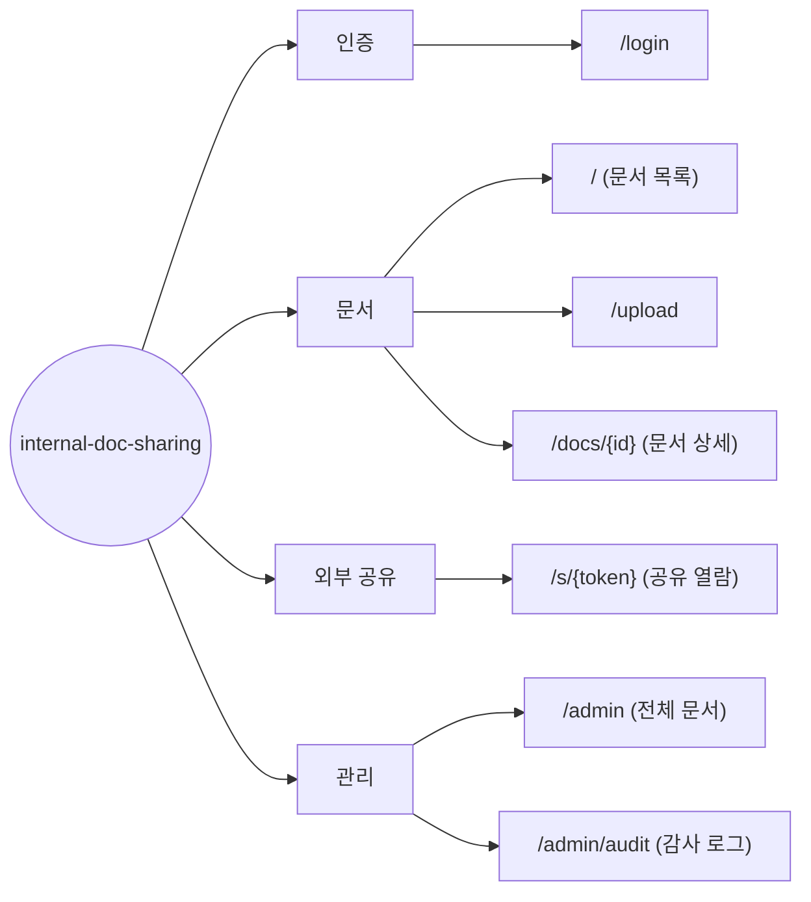

# Information Architecture — internal-doc-sharing (사내 문서 공유 서비스)

> **Generated from**: input-prd.md (사내 문서 공유 서비스 PRD v1.0)
> **Created**: 2026-07-26
> **Status**: Draft
> **Platform**: web (PRD §1.3/§1.4에서 네이티브 모바일 앱은 명시적 Non-Goal — 반응형 웹으로 대응)

> **Mermaid 룰**: 라우트(`/`)/특수문자 포함 텍스트는 `["..."]` 큰따옴표로 감싼다. mindmap은 환경별 지원 편차가 커서 `flowchart LR`로 통일.

## 1. Page Hierarchy



**원칙**:
- 1Depth = 4개 그룹 (인증 / 문서 / 외부 공유 / 관리) ≤ 7 (Miller's Law) ✓
- 모든 페이지는 진입 경로가 있어야 함
  - `/login` → 미인증 진입 시 리다이렉트 대상
  - `/` → 로그인 성공 후 기본 랜딩
  - `/upload`, `/docs/{id}` → `/` 상단 버튼·목록 행 클릭
  - `/s/{token}` → 외부에서 전달받은 공유 URL (앱 내 네비게이션 없음, 의도된 설계)
  - `/admin`, `/admin/audit` → admin 전용 네비게이션 메뉴
- 고아 페이지 없음 ✓ (`/s/{token}`은 외부 URL이 진입 경로)

## 2. Page × Functional Requirement Matrix

| Route | FR Coverage | Primary FR | Secondary FRs |
|-------|------------|-----------|---------------|
| `/login` | FR-001 | 사내 이메일 도메인 화이트리스트 Magic Link 로그인 | - |
| `/` | FR-003 | 문서 목록 조회 + 파일명/업로더/기간 필터 + 20건 페이지네이션 | FR-009 (관리자 삭제 문서의 "관리자에 의해 삭제됨" 표시 — 본인 문서 한정) |
| `/upload` | FR-002, FR-013 | PDF/DOCX 업로드 (≤50MB, 이중 검증, 5GB 쿼터) | FR-013 (업로드 직후 "검사 중" 배지) |
| `/docs/{id}` | FR-004, FR-005, FR-008, FR-013 | 문서 상세 + 다운로드 | FR-005 (공유 링크 생성), FR-008 (본인 문서 삭제), FR-013 (스캔 완료 전 공유 차단 UI) |
| `/s/{token}` | FR-006, FR-007, FR-012, FR-014 | 로그인 없는 공유 열람 뷰어 | FR-007 (무효 링크 안내), FR-012 (비밀번호/열람 횟수), FR-014 (429 안내) |
| `/admin` | FR-009, FR-015 | 전체 문서 조회 + 사유 입력 강제 삭제 | FR-015 (30일 내 복원) |
| `/admin/audit` | FR-011 | 감사 로그 문서별·기간별 조회 | FR-010 (기록된 로그의 표시 스키마) |

**규칙 검증**:
- 모든 페이지가 1+ FR에 연결됨 ✓
- FE 미매핑 FR (Backend/배치 전용 — 별도 명시):
  - FR-010 (감사 로그 **기록**): 서버 측 이벤트 기록. FE 표면은 `/admin/audit` 조회(FR-011)로 커버
  - FR-014 (IP 레이트 리밋): 서버 측 통제. FE 표면은 `/s/{token}`의 429 error 상태로 커버
  - FR-016 (보존 만료 배치 정리): 배치 전용. v1 FE 표면 없음

## 3. Audience × Page Access Matrix

Role Key는 PRD §2.3을 그대로 인용: `guest` / `member` / `admin`

| Route | guest | member | admin |
|-------|-------|--------|-------|
| `/login` | ✓ | ✓ (재로그인) | ✓ (재로그인) |
| `/` | - | ✓ | ✓ |
| `/upload` | - | ✓ | ✓ |
| `/docs/{id}` | - | ✓ (타인 문서는 삭제/공유 버튼 미노출) | ✓ |
| `/s/{token}` | ✓ (유효 토큰 보유 시) | ✓ | ✓ |
| `/admin` | - | - (no-permission) | ✓ |
| `/admin/audit` | - | - (no-permission) | ✓ |

- `✓`: 접근 허용
- `-`: 접근 시 no-permission 상태로 분기 (미인증은 `/login`으로 리다이렉트, member의 `/admin` 접근은 no-permission 안내 후 `/`로 리다이렉트)
- `guest`는 계정이 아닌 "유효 토큰 보유 상태"의 의사 역할 — `/s/{token}` 단일 문서 외 어떤 페이지·목록에도 접근 불가 (PRD §2.3 규칙)

## 4. Navigation Structure

### Primary Navigation (로그인 후, top bar)

```
┌────────────────────────────────────────────────────────────┐
│ Logo  |  문서 목록(/)  |  업로드(/upload)  |  관리(admin만)  │  user@…  로그아웃 │
└────────────────────────────────────────────────────────────┘
```

- `관리` 메뉴는 `admin` role일 때만 렌더링 (서버 판정, 클라이언트 role 값 신뢰 금지 — PRD §4.5)
- `관리` 하위: 전체 문서(`/admin`) / 감사 로그(`/admin/audit`) 탭
- `/s/{token}` 공유 열람 페이지는 **Primary Navigation을 렌더링하지 않음** — 외부인에게 사내 메뉴·목록 존재를 노출하지 않는다

### Secondary Navigation

- Breadcrumb: `홈 > 문서 상세` (`/docs/{id}`), `홈 > 관리 > 감사 로그` (`/admin/audit`)
- Footer: 도움말, 문의, 로그아웃 (`/s/{token}`에는 미노출)

## 5. Open Questions

화면별 명세 진입 전 결정 필요:
- [ ] 업로드 진입점 — `/upload` 별도 페이지 유지 vs `/` 상단 모달 (v1은 PRD §5.4대로 별도 페이지로 명세)
- [ ] `/admin`·`/admin/audit`는 Desktop only (PRD §5.4) — 모바일 접속 시 "PC에서 접속하세요" 안내로 처리할지 확정
- [ ] `/docs/{id}`에서 본인 문서의 "관리자에 의해 삭제됨" 상태(FR-009) 노출 위치 — 목록 배지 vs 상세 배너 (양쪽 모두로 명세)
