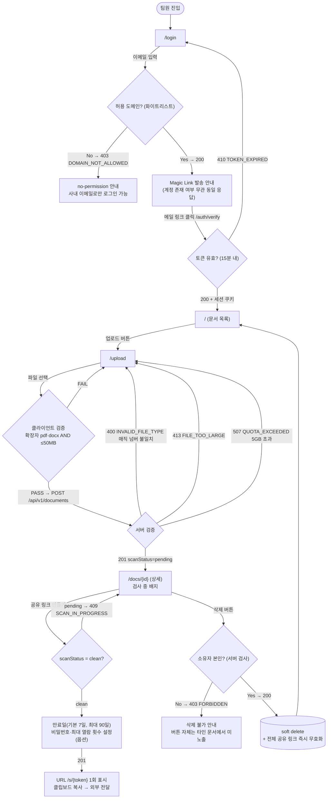
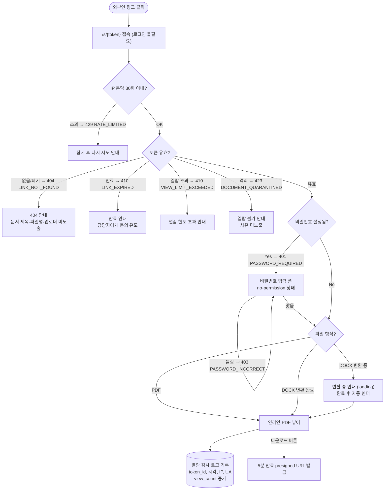
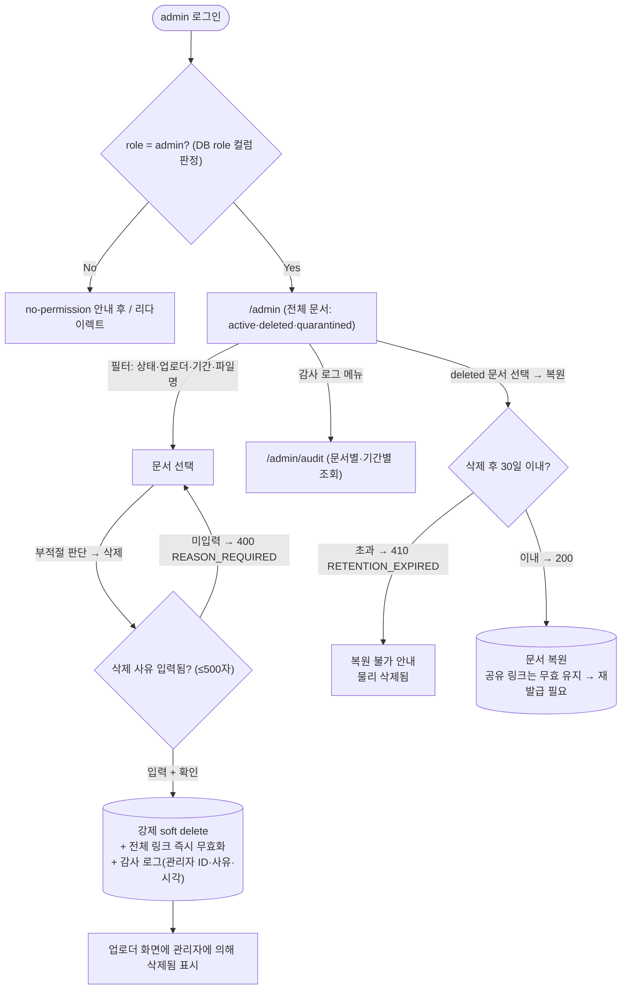

# User Flow — internal-doc-sharing (사내 문서 공유 서비스)

> **Generated from**: input-prd.md §5.5 (Flow A/B/C를 분기 조건까지 확장)
> **Created**: 2026-07-26
> **Status**: Draft

> **Mermaid 룰**: 라우트(`/`)/특수문자(`?`, `=`, `:`)를 포함하는 노드 텍스트는 항상 `["..."]` 큰따옴표로 감싼다. valid한 shape만 사용: `[]` `()` `(())` `{}` `[(...)]`.

## Flow A: member — 로그인 → 업로드 → 공유 링크 생성

> Acceptance Criteria 매핑: Scenario 1(업로드), 2(형식 거부), 3(링크 생성), 7(타인 문서 삭제 거부)

## Flow B: guest — 공유 링크 열람

> Acceptance Criteria 매핑: Scenario 4(외부 열람), 5(만료 링크 차단)

## Flow C: admin — 전체 문서 관리 · 강제 삭제 · 복원

> Acceptance Criteria 매핑: Scenario 6(부적절 문서 삭제)

## Flow Coverage Check

| Acceptance Criteria (PRD §2.2) | Flow |
|--------------------|------|
| Scenario 1: 팀원 문서 업로드 성공 | Flow A (Upload → SV 201 → Detail) |
| Scenario 2: 위장 실행 파일 업로드 거부 | Flow A (SV → 400 INVALID_FILE_TYPE) |
| Scenario 3: 공유 링크 생성 (만료 7일) | Flow A (MakeLink → Copy) |
| Scenario 4: 외부인 링크 열람 + 감사 로그 | Flow B (View → Log) |
| Scenario 5: 만료 링크 차단 (410, 메타데이터 미노출) | Flow B (Token → Expired) |
| Scenario 6: 관리자 강제 삭제 + 링크 즉시 무효화 | Flow C (Reason → Force) |
| Scenario 7: 타인 문서 삭제 403 | Flow A (Own → Forbidden) |

- 모든 Acceptance Criteria가 1+ Flow에 매핑됨 ✓
- 모든 Flow 내 라우트가 01-IA.md 페이지와 일치함 ✓ (`/login`, `/`, `/upload`, `/docs/{id}`, `/s/{token}`, `/admin`, `/admin/audit`)

## Branch Conditions Reference

| 분기 노드 | 조건 | 처리 |
|----------|------|------|
| 허용 도메인 | `email.domain ∈ whitelist` | Magic Link 발송 / 403 DOMAIN_NOT_ALLOWED (no-permission) |
| Magic Link 토큰 | 발급 후 15분 이내 + 미사용 | 세션 발급 / 410 TOKEN_EXPIRED → 재요청 |
| 클라이언트 파일 검증 | 확장자 `.pdf`·`.docx` AND `size ≤ 50MB` | PASS / inline error |
| 서버 파일 검증 | 매직 넘버 일치 + 50MB + 쿼터 5GB | 201 / 400 / 413 / 507 |
| 스캔 상태 | `scanStatus === 'clean'` | 공유 링크 생성 허용 / 409 SCAN_IN_PROGRESS (버튼 비활성 + 안내) |
| 소유자 검사 | `document.uploader_id === session.user_id \|\| role === 'admin'` (서버 측) | 삭제 허용 / 403 FORBIDDEN |
| 공유 토큰 검증 | 해시 일치 + 미폐기 + 미만료 + 열람 횟수 미초과 | 뷰어 / 404 · 410 · 410 · 423 |
| 공유 비밀번호 | `password_hash` 존재 시 `X-Share-Password` 검증 | 뷰어 / 401 → 입력 폼 / 403 → 재입력 |
| 레이트 리밋 | IP 분당 ≤ 30회 | 통과 / 429 RATE_LIMITED |
| admin 판정 | DB `users.role = 'admin'` (요청 파라미터로 승격 불가) | `/admin` 허용 / no-permission → `/` 리다이렉트 |
| 복원 보존 기간 | `deleted_at + 30일 > now` | 복원 / 410 RETENTION_EXPIRED |

## Open Questions

- [ ] 세션 만료(쿠키 만료) 시 처리 — 모든 보호 라우트에서 `/login?next={route}` 리다이렉트로 통일할지
- [ ] DOCX "변환 중" 상태에서 guest 폴링 주기 (수동 새로고침 vs 자동 폴링)
- [ ] 관리자 강제 삭제 시 업로더 알림 채널 — v1은 화면 내 상태 표시만인지, 이메일 알림 포함인지 (PRD Flow C의 Notify 노드)
