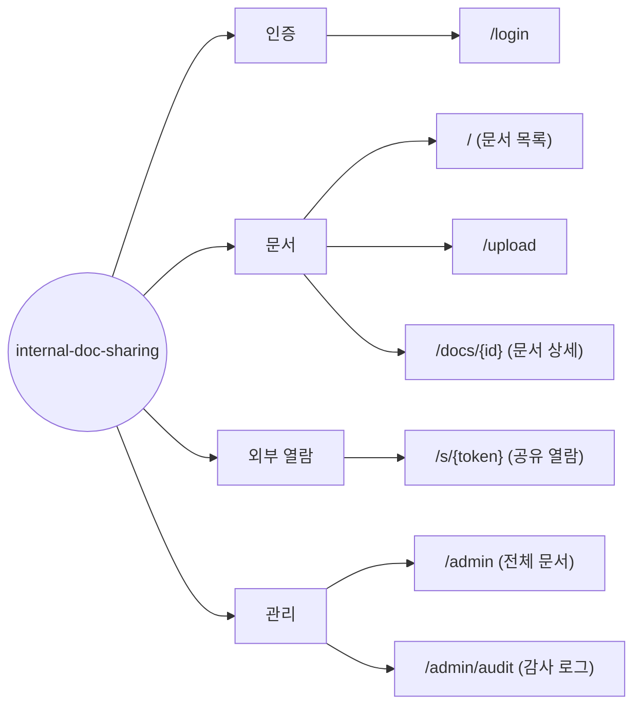

# Information Architecture — internal-doc-sharing (사내 문서 공유)

> **Generated from**: input-prd.md (사내 문서 공유 서비스 PRD v1.0)
> **Created**: 2026-07-26
> **Status**: Draft
> **Platform**: web (PRD §1.3 Non-Goals가 모바일 네이티브 앱을 명시적으로 제외 — 반응형 웹 대응)

> **Mermaid 룰**: 라우트(`/`)/특수문자 포함 텍스트는 `["..."]` 큰따옴표로 감싼다. mindmap은 환경별 지원 편차가 커서 `flowchart LR`로 통일.

## 1. Page Hierarchy



**원칙**:
- 1Depth = 4개 (인증 / 문서 / 외부 열람 / 관리) ≤ 7 (Miller's Law) ✓
- 모든 페이지는 진입 경로가 있어야 함
  - `/login` — 미인증 진입 시 기본 랜딩
  - `/` — 로그인 성공 후 기본 랜딩, 전역 네비
  - `/upload` — `/` 상단 "문서 업로드" 버튼
  - `/docs/{id}` — `/` 목록 행 클릭, 업로드 성공 후 자동 이동
  - `/s/{token}` — 외부 배포된 공유 URL로만 진입 (사이트 내 네비에 노출하지 않음)
  - `/admin` — admin에게만 노출되는 네비 메뉴
  - `/admin/audit` — `/admin` 내 "감사 로그" 탭/링크
- 고아 페이지(어디서도 접근 불가) 없음 ✓

## 2. Page × Functional Requirement Matrix

| Route | FR Coverage | Primary FR | Secondary FRs |
|-------|------------|-----------|---------------|
| `/login` | FR-001 | 사내 이메일 도메인 화이트리스트 + Magic Link 로그인 | - |
| `/` | FR-003 | 문서 목록 조회 (파일명/업로더/기간 필터, 20건 페이지네이션) | FR-009 (관리자 삭제 문서의 "관리자에 의해 삭제됨" 표시) |
| `/upload` | FR-002, FR-013 | PDF/DOCX 업로드 (≤50MB, 확장자+매직 넘버 이중 검증, 5GB 쿼터) | FR-013 (스캔 대기 "검사 중" 배지) |
| `/docs/{id}` | FR-004, FR-005, FR-008 | 문서 상세 조회 + 원본 다운로드 | FR-005 (공유 링크 생성), FR-008 (본인 문서 삭제), FR-012 (링크 비밀번호/열람 횟수 옵션), FR-013 (스캔 완료 전 공유 차단) |
| `/s/{token}` | FR-006, FR-007, FR-012, FR-014 | 로그인 없는 문서 열람 (인라인 뷰어 + 다운로드) | FR-007 (무효 링크 차단), FR-012 (비밀번호/열람 횟수), FR-014 (레이트 리밋 429) |
| `/admin` | FR-009, FR-015 | 전체 문서 조회 + 사유 입력 강제 삭제 | FR-015 (30일 내 복원) |
| `/admin/audit` | FR-010, FR-011 | 감사 로그 문서별·기간별 조회 | - |

**규칙 검증**:
- 모든 페이지가 1+ FR과 연결됨 ✓
- FE 매핑에서 제외되는 Backend 전용 FR (별도 명시):
  - **FR-010** (감사 로그 기록 자체) — 서버 사이드 이벤트 기록. 조회 UI는 `/admin/audit`(FR-011)이 담당
  - **FR-014** (IP 레이트 리밋) — 서버 미들웨어. FE는 `/s/{token}`의 429 에러 상태 표시만 담당
  - **FR-016** (보존 정책 + 만료 배치 정리) — 배치 작업. v1 FE 노출 없음 (업로드 시 만료 정책 입력은 P2)
- 위 3건을 포함해 FR-001~FR-016 전체가 1+ 페이지 또는 Backend 명시로 커버됨 ✓

## 3. Audience × Page Access Matrix

Role Key는 PRD §2.3을 그대로 인용: `guest` / `member` / `admin`

| Route | guest | member | admin |
|-------|-------|--------|-------|
| `/login` | ✓ | ✓ (재로그인) | ✓ (재로그인) |
| `/` | - | ✓ | ✓ |
| `/upload` | - | ✓ | ✓ |
| `/docs/{id}` | - | ✓ | ✓ |
| `/s/{token}` | ✓ (유효 토큰 보유 시) | ✓ | ✓ |
| `/admin` | - | - | ✓ |
| `/admin/audit` | - | - | ✓ |

- `✓`: 접근 허용
- `-`: 접근 시 no-permission 상태로 분기 — 미인증은 `/login` 리다이렉트, `member`의 `/admin*` 접근은 `/` 리다이렉트 + 토스트
- `guest`는 계정이 아닌 **유효 토큰 보유 상태**(PRD §2.3). `/s/{token}` 단일 문서 외 어떤 페이지/목록에도 접근 불가
- `/docs/{id}`에서 타인 문서는 열람 가능하되 삭제/공유 버튼 미노출 (PRD §5.4.1 no-permission)

## 4. Navigation Structure

### Primary Navigation (로그인 후, top 패턴)

```
┌──────────────────────────────────────────────────────────────┐
│ Logo  |  문서 목록(/)  |  업로드(/upload)  |  관리(admin만)  │  user@ ▾ │
└──────────────────────────────────────────────────────────────┘
```

- `관리` 메뉴는 `admin` role에만 렌더링 (`/admin`, `/admin/audit` 하위 링크)
- `/s/{token}` 공유 열람 페이지는 **전역 네비 없음** — 외부인에게 사내 라우트를 노출하지 않는 최소 크롬(문서 제목 + 다운로드 버튼)만 표시

### Secondary Navigation

- Breadcrumb: `홈 > 문서 상세` (`/docs/{id}`), `관리 > 감사 로그` (`/admin/audit`)
- Footer: 도움말, 문의(contact@wigtn.com), 로그아웃
- `/s/{token}`은 breadcrumb/footer 링크 미노출 (외부 노출 최소화)

## 5. Open Questions

화면별 명세 진입 전 결정 필요:
- [ ] `/` 문서 목록의 "나의 문서" 구분 방식 — 탭 분리 vs 목록 내 배지 표시 (PRD §2.2 Scenario 1은 "나의 문서로 표시"만 명시)
- [ ] `/admin`·`/admin/audit`는 Desktop only(PRD §5.4) — 모바일 접속 시 안내 화면 vs 강제 리다이렉트
- [ ] 공유 링크 생성 UI — `/docs/{id}` 내 모달 vs 인라인 패널 (본 명세는 모달 가정)
