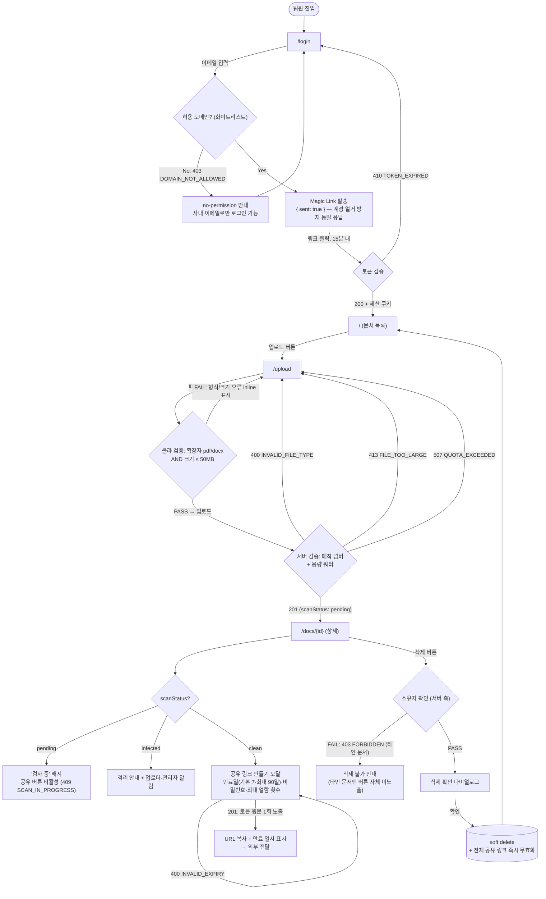
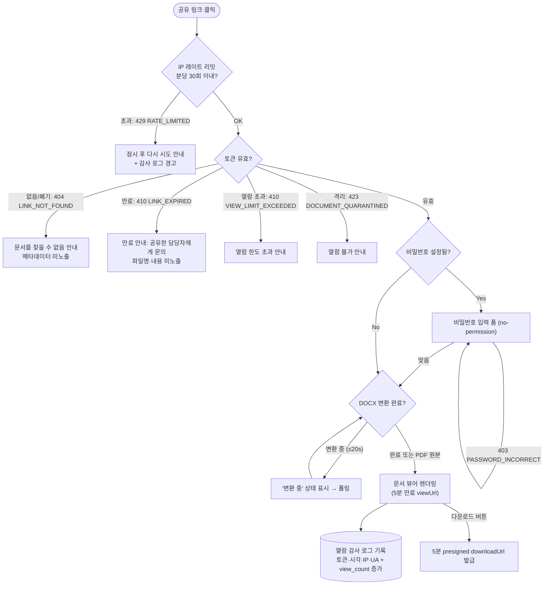
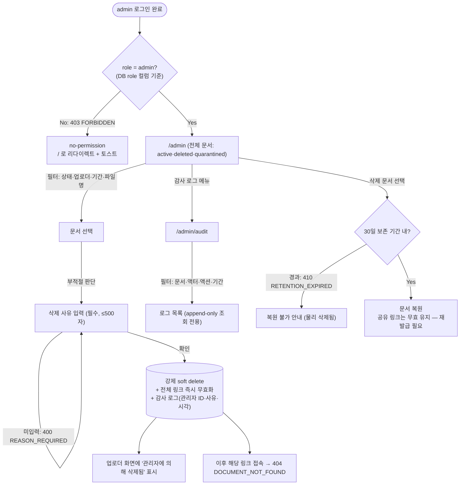

# User Flow — internal-doc-sharing (사내 문서 공유)

> **Generated from**: input-prd.md §5.5
> **Created**: 2026-07-26
> **Status**: Draft

> **Mermaid 룰**: 라우트(`/`)/특수문자(`?`, `=`, `:`)를 포함하는 노드 텍스트는 항상 `["..."]` 큰따옴표로 감싼다. valid한 shape만 사용: `[]` `()` `(())` `{}` `[(...)]`. `{(...)}`는 존재하지 않는다.

## Flow A: member — 로그인 → 업로드 → 공유 → 삭제

> Acceptance Criteria 매핑: Scenario 1(업로드), 2(형식 거부), 3(링크 생성), 7(타인 문서 삭제 거부)

## Flow B: guest — 공유 링크 열람

> Acceptance Criteria 매핑: Scenario 4(외부 열람), 5(만료 링크)

## Flow C: admin — 전체 문서 관리·강제 삭제·복원

> Acceptance Criteria 매핑: Scenario 6(관리자 강제 삭제)

## Flow Coverage Check

| Acceptance Criteria (§2.2) | Flow |
|--------------------|------|
| Scenario 1 — 문서 업로드 성공 | Flow A (Upload → Server 201 → Detail) |
| Scenario 2 — 위장 실행 파일 거부 | Flow A (Server → 400 INVALID_FILE_TYPE) |
| Scenario 3 — 공유 링크 생성 | Flow A (MakeLink → Copy) |
| Scenario 4 — 외부인 링크 열람 | Flow B (Token 유효 → View → Log) |
| Scenario 5 — 만료 링크 차단 | Flow B (Token → 410 Expired) |
| Scenario 6 — 관리자 강제 삭제 | Flow C (Reason → Force → DeadLink) |
| Scenario 7 — 타인 문서 삭제 403 | Flow A (Owner → FAIL 403) |

**규칙**: 모든 Acceptance Criteria가 1+ Flow에 매핑됨 ✓ (7/7)

## Branch Conditions Reference

| 분기 노드 | 조건 | 처리 |
|----------|------|------|
| 허용 도메인 | `email domain ∈ whitelist` | Magic Link 발송 / 403 DOMAIN_NOT_ALLOWED |
| Magic Link 토큰 | 발급 후 15분 이내 + 미사용 | 세션 발급 / 410 TOKEN_EXPIRED |
| 클라이언트 파일 검증 | 확장자 ∈ {pdf, docx} AND size ≤ 50MB | PASS / inline FAIL |
| 서버 파일 검증 | 매직 넘버 일치 AND 쿼터 ≤ 5GB | 201 / 400 · 413 · 507 |
| scanStatus | `pending` \| `clean` \| `infected` | 공유 차단 / 허용 / 격리 |
| 공유 토큰 | 해시 일치 AND 미폐기 AND 미만료 AND 열람 수 미초과 | 뷰어 / 404 · 410 · 410 · 423 |
| 공유 비밀번호 | `password_hash` 존재 시 검증 | 뷰어 / 401 PASSWORD_REQUIRED · 403 PASSWORD_INCORRECT |
| IP 레이트 리밋 | 분당 ≤ 30회 | 통과 / 429 RATE_LIMITED |
| 문서 소유자 | `uploader_id = current_user_id` OR `role = admin` | 삭제 허용 / 403 FORBIDDEN |
| admin 판정 | DB `users.role = 'admin'` (요청 파라미터 승격 불가) | `/admin*` 허용 / `/` 리다이렉트 |
| 복원 보존 기간 | `deleted_at + 30일 > now` | 복원 / 410 RETENTION_EXPIRED |

## Open Questions

- [ ] 세션 만료 시 분기 — 어느 페이지에서든 401 수신 시 `/login` 리다이렉트 + "다시 로그인해주세요" 토스트로 통일하는가?
- [ ] Flow B의 DOCX "변환 중" 폴링 주기 — 폴링 vs 수동 새로고침 안내 (PRD §4.1은 변환 ≤20s 비동기만 명시)
- [ ] 격리(quarantined) 문서의 업로더 알림 채널 — 이메일 vs 화면 내 배너 (FR-013 "알린다"의 채널 미지정)
