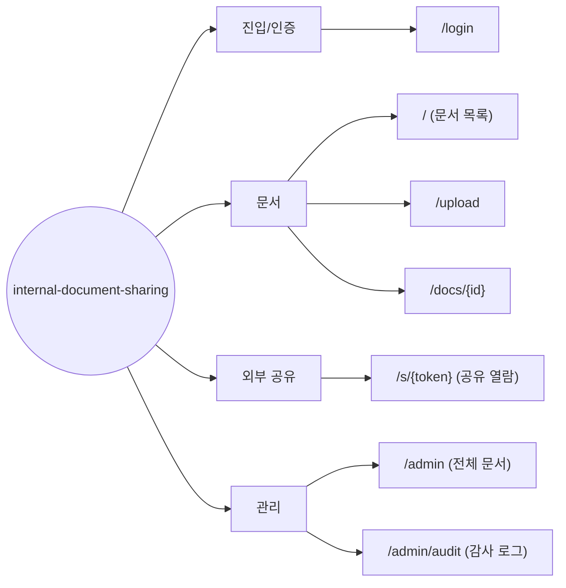

# Information Architecture — internal-document-sharing (사내 문서 공유 서비스)

> **Generated from**: input-prd.md (사내 문서 공유 서비스 PRD v1.0)
> **Created**: 2026-07-26
> **Status**: Draft
> **Platform**: web (반응형 웹 — PRD §1.3에서 모바일 네이티브 앱은 Non-Goal로 명시)

> **Mermaid 룰**: 라우트(`/`)/특수문자 포함 텍스트는 `["..."]` 큰따옴표로 감싼다. mindmap은 환경별 지원 편차가 커서 `flowchart LR`로 통일.

## 1. Page Hierarchy



**원칙**:
- 1Depth ≤ 7개 (Miller's Law) — 현재 4개 그룹(진입/문서/공유/관리), FE 페이지 총 7개
- 모든 페이지는 진입 경로가 있어야 함
- 고아 페이지(어디서도 접근 불가) 금지 — `/s/{token}`은 외부 배포 링크가 유일한 진입점(의도된 설계, PRD §4.5)

## 2. Page × Functional Requirement Matrix

| Route | FR Coverage | Primary FR | Secondary FRs |
|-------|------------|-----------|---------------|
| `/login` | FR-001 | 사내 이메일 도메인 화이트리스트 + Magic Link 로그인 | - |
| `/` (문서 목록) | FR-003 | 조직 문서 목록 조회 + 파일명/업로더/기간 필터 + 20건 페이지네이션 | - |
| `/upload` | FR-002, FR-013 | PDF/DOCX 업로드 (≤50MB, 확장자+매직 넘버 이중 검증, 5GB 쿼터) | 악성코드 스캔 대기 상태("검사 중" 배지) |
| `/docs/{id}` | FR-004, FR-005, FR-008 | 문서 상세 조회 + 원본 다운로드 | 공유 링크 생성(만료일·비밀번호·열람 한도, FR-012 옵션 설정), 링크 폐기(FR-007), 본인 문서 삭제 |
| `/s/{token}` | FR-006, FR-007, FR-012, FR-014 | 로그인 없는 공유 문서 열람(브라우저 뷰어 + 다운로드) | 무효 링크 차단(만료/폐기/삭제), 비밀번호·열람 한도 검사, IP 레이트 리밋 |
| `/admin` | FR-009, FR-015 | 전체 문서 조회(삭제·격리 포함) + 사유 입력 강제 삭제 | 30일 내 문서 복원 |
| `/admin/audit` | FR-010, FR-011 | 감사 로그 문서별·기간별 조회 | - |

**규칙**:
- 모든 FR이 1+ 페이지에 매핑되어야 함
- 페이지가 0개의 FR과 연결되면 → 페이지가 불필요하거나 FR이 누락
- API/Backend 전용 FR은 매핑 테이블에서 제외 (별도 명시)

**API/Backend 전용 FR** (FE 페이지 매핑 제외):
- FR-010 기록 자체(감사 로그 append)는 서버 책임 — FE는 `/admin/audit`에서 조회만 담당
- FR-013 스캔 실행·격리·알림은 백그라운드 워커 — FE는 `/upload`·`/docs/{id}`에서 `scanStatus` 표시만 담당
- FR-014 레이트 리밋 판정은 서버 — FE는 `/s/{token}`에서 429 안내만 담당
- FR-016 보존 만료 배치 정리 — FE 화면 없음 (백엔드 전용)

## 3. Audience × Page Access Matrix

Role Key는 PRD §2.3을 그대로 인용: `guest` / `member` / `admin`

| Route | guest | member | admin |
|-------|-------|--------|-------|
| `/login` | ✓ | ✓ | ✓ |
| `/` (문서 목록) | - | ✓ | ✓ |
| `/upload` | - | ✓ | ✓ |
| `/docs/{id}` | - | ✓ | ✓ |
| `/s/{token}` | ✓ (유효 토큰 필수) | ✓ | ✓ |
| `/admin` | - | - | ✓ |
| `/admin/audit` | - | - | ✓ |

- `✓`: 접근 허용
- `-`: 접근 시 no-permission 상태로 분기 (미인증은 `/login`으로, `member`의 `/admin` 접근은 `/`로 리다이렉트 + 토스트)
- `guest`는 계정이 아닌 **"유효 토큰 보유 상태"**(PRD §2.3) — `/s/{token}` 외 어떤 페이지·목록에도 접근 불가

## 4. Navigation Structure

### Primary Navigation (로그인 후, top 패턴 — 추론 모드 기본값)

```
┌──────────────────────────────────────────────────────────────┐
│ Logo  |  문서 목록(/)  |  업로드(/upload)  |  관리(admin만)  |  로그아웃 │
└──────────────────────────────────────────────────────────────┘
```

- `관리` 메뉴는 `admin` role일 때만 노출 (`/admin` 드롭다운: 전체 문서 / 감사 로그)
- `/s/{token}` 공유 열람 페이지는 **네비게이션 없음** — 문서 뷰어 단독 레이아웃 (외부인에게 내부 메뉴 미노출)

### Secondary Navigation

- Breadcrumb: `홈 > 문서 상세` (`/docs/{id}`), `관리 > 감사 로그` (`/admin/audit`)
- Footer: 도움말, 문의, 로그아웃 (`/s/{token}`에서는 미노출)

## 5. Open Questions

화면별 명세 진입 전 결정 필요:
- [ ] `/docs/{id}` 공유 링크 생성 UI — 페이지 내 인라인 패널 vs 모달 (03에서는 모달로 가정)
- [ ] `/admin` 모바일 접근 시 처리 — PRD §5.4는 Desktop only. "PC에서 접속하세요" 안내로 가정
- [ ] 삭제된 본인 문서("관리자에 의해 삭제됨", FR-009)를 `/` 목록에 표시할지, `/docs/{id}` 직접 진입 시에만 안내할지 (03에서는 상세 직접 진입 시 안내로 가정)
