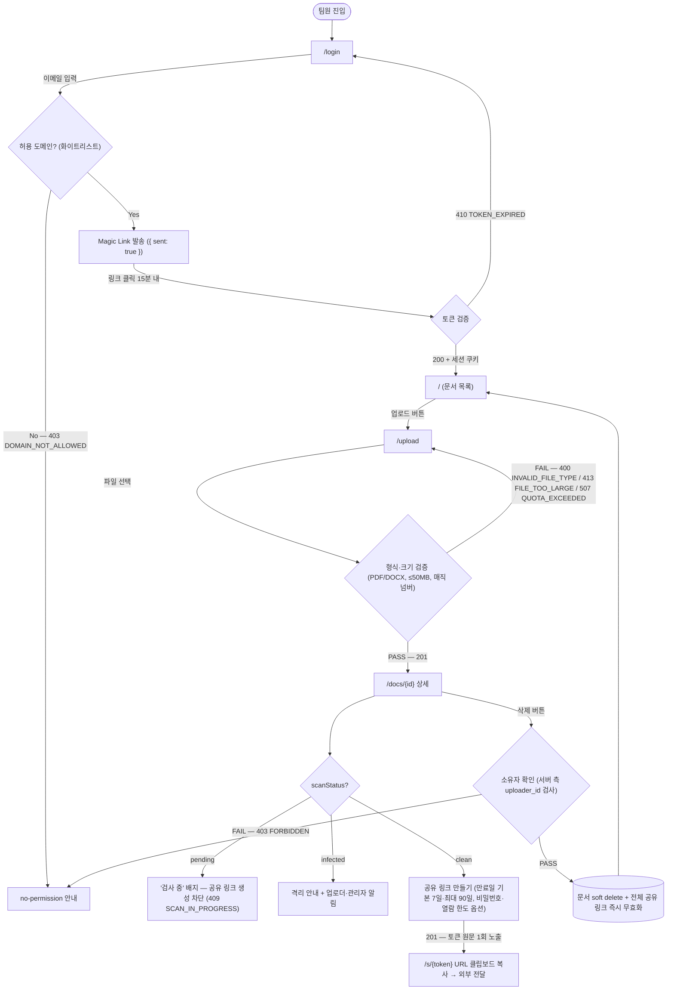
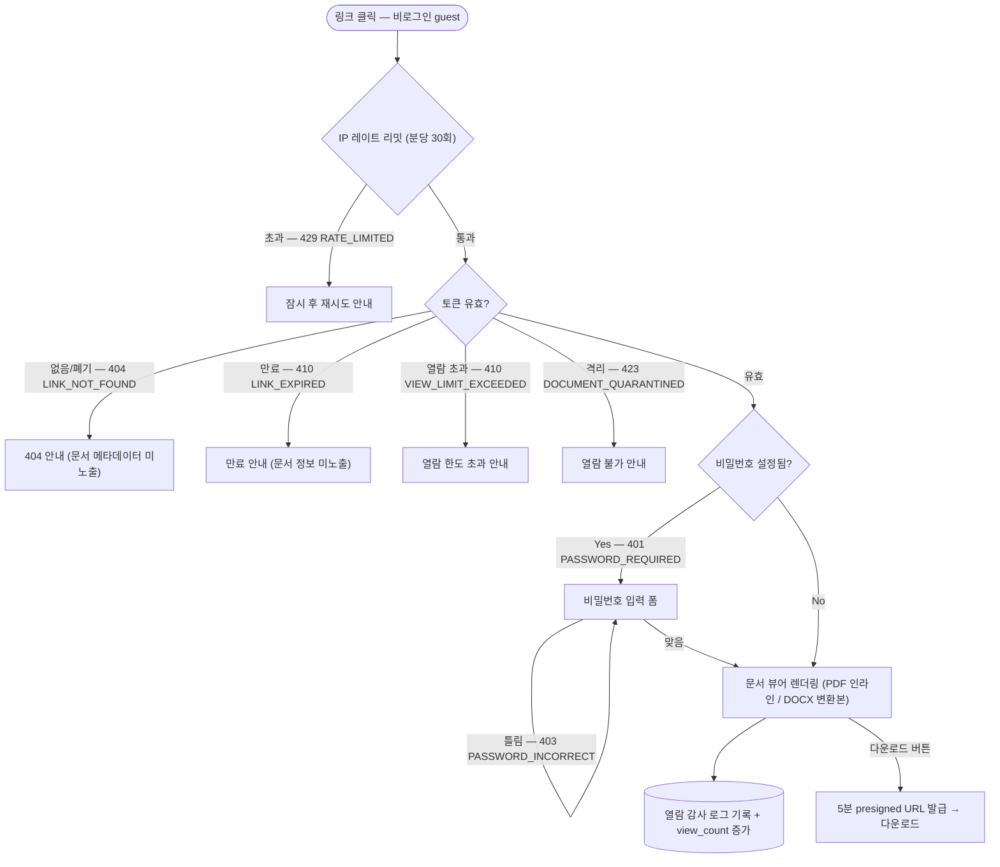
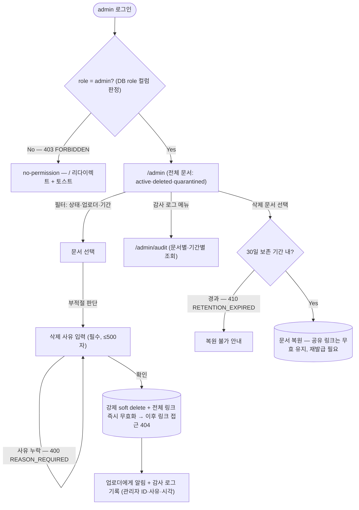

# User Flow — internal-document-sharing (사내 문서 공유 서비스)

> **Generated from**: input-prd.md §5.5 (Flow A/B/C 확장 — 분기 조건 명시)
> **Created**: 2026-07-26
> **Status**: Draft

> **Mermaid 룰**: 라우트(`/`)/특수문자(`?`, `=`, `:`)를 포함하는 노드 텍스트는 항상 `["..."]` 큰따옴표로 감싼다. valid한 shape만 사용: `[]` `()` `(())` `{}` `[(...)]`. `{(...)}`는 존재하지 않는다.

## Flow A: member — 로그인 → 업로드 → 공유 링크 생성

> Acceptance Criteria 매핑: Scenario 1(업로드 성공), Scenario 2(파일 형식 거부), Scenario 3(공유 링크 생성), Scenario 7(타인 문서 삭제 403)

## Flow B: guest — 공유 링크 열람

> Acceptance Criteria 매핑: Scenario 4(외부인 열람), Scenario 5(만료 링크 차단)

## Flow C: admin — 전체 문서 관리·강제 삭제·복원

> Acceptance Criteria 매핑: Scenario 6(관리자 강제 삭제)

## Flow Coverage Check

| Acceptance Criteria (PRD §2.2) | Flow |
|--------------------|------|
| Scenario 1 — 사내 팀원이 문서를 업로드한다 | Flow A |
| Scenario 2 — 허용되지 않은 파일 형식 업로드를 거부한다 | Flow A (Validate FAIL 분기) |
| Scenario 3 — 공유 링크를 생성한다 | Flow A (MakeLink) |
| Scenario 4 — 외부인이 링크로 문서를 열람한다 | Flow B |
| Scenario 5 — 만료된 링크는 열람할 수 없다 | Flow B (Expired 분기) |
| Scenario 6 — 관리자가 부적절한 문서를 삭제한다 | Flow C |
| Scenario 7 — 다른 팀원의 문서는 삭제할 수 없다 | Flow A (Owner FAIL 분기) |

**규칙**:
- 모든 Acceptance Criteria가 1+ Flow에 매핑되어야 함 — ✓ 7/7 매핑 완료
- 매핑되지 않는 시나리오 → Flow를 추가하거나 시나리오가 모호
- 모든 Flow 내 페이지(`/login`, `/`, `/upload`, `/docs/{id}`, `/s/{token}`, `/admin`, `/admin/audit`)는 01-IA.md 페이지와 1:1 매칭 — ✓

## Branch Conditions Reference

| 분기 노드 | 조건 | 처리 |
|----------|------|------|
| 허용 도메인 | 이메일 도메인 ∈ 화이트리스트 | Magic Link 발송 / 403 DOMAIN_NOT_ALLOWED |
| Magic Link 토큰 검증 | 발급 후 15분 이내 + 유효 토큰 | 세션 발급 / 400 INVALID_TOKEN·410 TOKEN_EXPIRED |
| 형식·크기 검증 | 확장자 + 매직 넘버 일치, ≤50MB, 쿼터 ≤5GB | 201 / 400·413·507 |
| scanStatus | `pending` \| `clean` \| `infected` | 공유 차단 / 허용 / 격리 |
| 소유자 확인 | `uploader_id = current_user_id` 또는 `admin` (서버 측 검사) | 삭제 진행 / 403 FORBIDDEN |
| IP 레이트 리밋 | 분당 30회 이하 | 통과 / 429 RATE_LIMITED |
| 토큰 유효성 | 해시 일치 + 미폐기 + 미만료 + 열람 한도 내 | 뷰어 / 404·410·423 |
| 공유 비밀번호 | `password_hash` 존재 시 입력 일치 | 뷰어 / 401·403 |
| admin 판정 | DB `users.role = 'admin'` (요청 파라미터로 승격 불가) | `/admin` 진입 / `/` 리다이렉트 |
| 복원 보존 기간 | soft delete 후 30일 이내 | 복원 / 410 RETENTION_EXPIRED |

## Open Questions

- [ ] 세션 만료 시 어디서 분기되는가? — 보호 라우트 접근 시 `/login` 리다이렉트 + "세션이 만료되었습니다" 안내로 가정
- [ ] 업로드 중 페이지 이탈 시 업로드 취소 확인 다이얼로그 필요 여부
- [ ] DOCX 변환 중(`변환 중` 상태) `/s/{token}` 접근 시 폴링 vs 수동 새로고침
