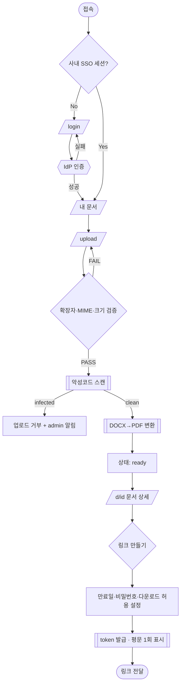
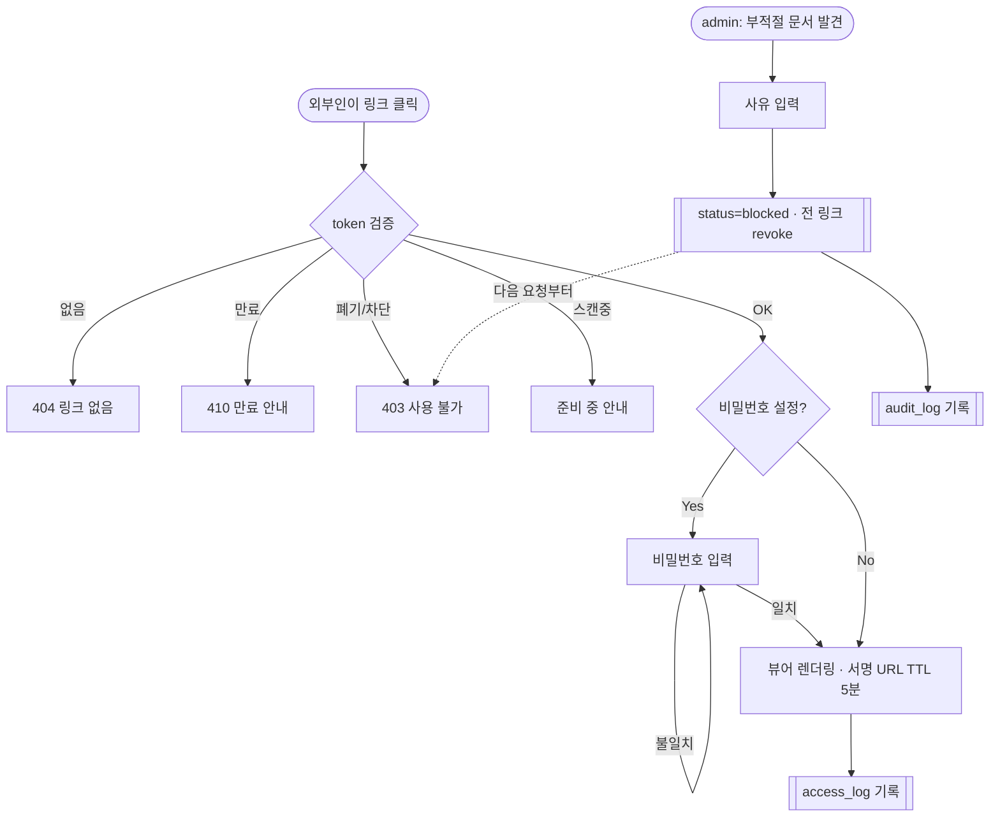

# 사내 문서 공유 서비스 (DocShare) PRD

> **Version**: 1.0
> **Created**: 2026-07-26
> **Status**: Draft
> **Owner**: (미정 — 작성 후 지정 필요)

---

## 1. Overview

### 1.1 Problem Statement

팀원들이 PDF/DOCX 문서를 주고받을 때 현재는 이메일 첨부나 개인 메신저를 사용한다. 이 방식은 세 가지 문제가 있다.

1. **버전 파편화** — 같은 문서의 여러 사본이 각자의 메일함에 흩어져 어떤 게 최신인지 알 수 없다.
2. **외부 공유의 마찰** — 계약사·클라이언트 등 사내 계정이 없는 사람에게 보내려면 매번 첨부를 다시 보내야 하고, 잘못 보낸 뒤 회수할 방법이 없다.
3. **통제 부재** — 부적절하거나 유출성 문서가 돌아다녀도 관리자가 회수·차단할 수단이 없다.

이 서비스는 "올리고 → 링크로 공유하고 → 필요하면 관리자가 내린다"는 최소 루프를 제공한다.

### 1.2 Goals

- G1. 팀원이 30초 안에 문서를 올리고 공유 링크를 얻는다.
- G2. 사내 계정이 없는 외부 사람도 링크만으로 문서를 열람할 수 있다 (앱 설치·회원가입 없이).
- G3. 관리자가 부적절한 문서를 즉시 비공개 처리하고, 그 이력이 남는다.
- G4. "누가 무엇을 언제 봤는가"를 문서 소유자가 확인할 수 있어, 공유가 통제 밖으로 나갔는지 판단할 수 있다.

### 1.3 Non-Goals (Out of Scope)

- 문서 **편집**(공동 편집, 코멘트, 주석) — 열람 전용이다.
- 문서 **본문 전문 검색**(OCR/텍스트 인덱싱) — v1은 파일명·업로더·태그 검색만.
- 폴더 트리, 권한 상속 같은 **파일 시스템형 계층 구조** — v1은 플랫 목록 + 태그.
- **DRM / 다운로드 원천 차단** — 화면에 보이는 것은 캡처 가능하다는 전제를 문서화하고 시도하지 않는다.
- SSO 이외의 **자체 회원가입/비밀번호 관리**.
- 모바일 네이티브 앱 (반응형 웹으로 대응).

### 1.4 Scope

| 포함 | 제외 |
|------|------|
| PDF/DOCX 업로드 (단일·다중) | 그 외 확장자 (v1.1에서 XLSX/PPTX 검토) |
| 공유 링크 생성/만료/폐기 | 이메일 지정 초대(외부인에게 계정 발급) |
| 브라우저 내 문서 뷰어 (PDF 네이티브, DOCX는 PDF 변환 후 표시) | 원본 포맷 그대로의 DOCX 렌더링 |
| 관리자 문서 비공개/삭제 + 감사 로그 | 조직도·부서 기반 세분화 권한 |
| 문서별 열람 로그 | BI 대시보드, 리포트 export |

---

## 2. Users & Roles

### 2.1 User Roles

| Role Key | 명칭 | 인증 | 권한 범위 |
|----------|------|------|----------|
| `viewer` | 외부 열람자 | 없음 (링크 토큰만) | 유효한 링크가 가리키는 문서 1건 열람. 목록·검색·업로드 불가 |
| `member` | 사내 팀원 | 사내 SSO 필수 | 업로드, 본인 문서 관리(링크 발급/폐기/삭제), 사내 공개 문서 열람 |
| `admin` | 관리자 | 사내 SSO + admin 클레임 | `member` 권한 전체 + 모든 문서 열람/비공개/삭제, 감사 로그 조회, 사용자 정지 |

**규칙**
- Role Key는 코드·API·DB에서 그대로 쓰는 단일 키다.
- `viewer`는 계정이 아니라 **상태**다. 로그인하지 않은 요청이 유효한 share token을 들고 오면 그 요청에 한해 `viewer`로 취급한다.
- `admin` 승격은 앱 내부에서 하지 않는다. IdP(SSO) 그룹 멤버십을 신뢰 원천으로 삼는다. → 앱 DB의 role 컬럼을 위조해도 권한이 오르지 않는다.

### 2.2 Primary User Stories

- **US-1** (member) 나는 방금 만든 제안서를 올려 팀 채널에 링크 하나만 붙이고 싶다. 첨부를 개인별로 다시 보내지 않기 위해서.
- **US-2** (member) 나는 외부 파트너에게 보낸 링크를 2주 뒤 자동으로 죽게 하고 싶다. 계약 종료 후에도 문서가 계속 열리는 걸 막기 위해서.
- **US-3** (viewer) 나는 계정을 만들지 않고 받은 링크를 눌러 바로 문서를 보고 싶다. 협업 마찰을 줄이기 위해서.
- **US-4** (admin) 나는 유출성/부적절 문서를 발견하면 즉시 모든 링크를 죽이고 싶다. 사고 확산을 막기 위해서.
- **US-5** (member) 나는 내가 만든 링크가 몇 번, 언제, 대략 어디서 열렸는지 보고 싶다. 링크가 재배포됐는지 판단하기 위해서.

### 2.3 Acceptance Criteria (Gherkin)

```gherkin
Scenario: 사내 팀원이 문서를 업로드하고 링크를 얻는다
  Given member 역할로 로그인한 사용자가 있고
  And 12MB 짜리 유효한 PDF 파일을 선택했을 때
  When 업로드를 완료하면
  Then 문서 상태는 "processing"으로 시작해 스캔 통과 후 "ready"가 되고
  And 문서 상세 화면에서 "링크 만들기" 버튼으로 share token을 발급받을 수 있다

Scenario: 외부인이 유효한 링크로 열람한다
  Given 만료되지 않았고 폐기되지 않은 share token이 있고
  And 요청자가 로그인하지 않았을 때
  When /s/{token} 에 접근하면
  Then 로그인 요구 없이 뷰어가 렌더링되고
  And access_log에 (token, 시각, IP 해시, User-Agent) 1건이 기록된다

Scenario: 만료된 링크
  Given expires_at 이 현재보다 과거인 share token 이 있을 때
  When /s/{token} 에 접근하면
  Then 410 상태와 "이 링크는 만료되었습니다. 공유한 사람에게 다시 요청하세요." 안내가 표시되고
  And 문서 제목·업로더 이름 등 어떤 메타데이터도 노출되지 않는다

Scenario: 관리자가 문서를 내린다
  Given admin 으로 로그인했고 대상 문서가 ready 상태일 때
  When "비공개 처리"를 실행하고 사유를 입력하면
  Then 해당 문서의 모든 share token 이 즉시 revoked 되고
  And 진행 중이던 뷰어 세션의 다음 요청부터 403 이 반환되고
  And audit_log 에 (actor, action=takedown, target, reason, 시각) 이 기록된다

Scenario: 외부 열람자가 목록을 훔쳐보려 시도한다
  Given 유효한 share token 을 가진 비로그인 요청이
  When GET /api/v1/documents (목록) 를 호출하면
  Then 401 이 반환되고 문서가 1건도 노출되지 않는다
```

---

## 3. Functional Requirements

| ID | Requirement | Priority | Dependencies |
|----|-------------|----------|--------------|
| FR-001 | 사내 SSO(OIDC) 로그인. IdP 그룹으로 `member`/`admin` 판별 | P0 | - |
| FR-002 | PDF/DOCX 업로드. 확장자·MIME·매직바이트 3중 검증, 파일당 최대 50MB | P0 | FR-001 |
| FR-003 | 업로드 파일 악성코드 스캔. 통과 전에는 어떤 링크로도 열람 불가 | P0 | FR-002 |
| FR-004 | DOCX → PDF 변환(뷰어용 파생본 생성). 실패 시 원본 다운로드로 폴백 | P0 | FR-003 |
| FR-005 | 내 문서 목록 조회 (파일명/업로더/업로드일/상태, 페이지네이션) | P0 | FR-001 |
| FR-006 | 공유 링크(share token) 발급. 만료일 지정(기본 14일, 최대 90일) | P0 | FR-003 |
| FR-007 | `/s/{token}` 비인증 열람. 만료·폐기·미스캔 상태는 열람 차단 | P0 | FR-006 |
| FR-008 | 브라우저 내 문서 뷰어(페이지 넘김, 확대/축소) | P0 | FR-004 |
| FR-009 | 링크 폐기(revoke). 소유자 또는 admin | P0 | FR-006 |
| FR-010 | 관리자 문서 비공개(takedown) — 사유 필수, 관련 토큰 일괄 폐기 | P0 | FR-001 |
| FR-011 | 감사 로그: 업로드/링크발급/폐기/takedown/삭제, 90일 이상 보존 | P0 | FR-010 |
| FR-012 | 문서 삭제(소유자=소프트 삭제 30일 후 하드 삭제, admin=즉시 하드 삭제 가능) | P0 | FR-005 |
| FR-013 | 열람 로그 조회 — 소유자는 자기 문서의 (시각, 토큰, 대략적 위치) 확인 | P1 | FR-007 |
| FR-014 | 링크에 비밀번호(passphrase) 옵션 | P1 | FR-006 |
| FR-015 | 다운로드 허용/금지 토글 (뷰어 전용 링크) | P1 | FR-007 |
| FR-016 | 파일명·업로더·태그 기반 검색/필터 | P1 | FR-005 |
| FR-017 | 사내 전체 공개(사내 라이브러리) 플래그 — 로그인 사용자면 누구나 열람 | P2 | FR-005 |
| FR-018 | 링크별 열람 횟수 상한 (예: 20회 후 자동 폐기) | P2 | FR-013 |
| FR-019 | Slack 알림 (takedown 발생 시 admin 채널) | P2 | FR-010 |
| FR-020 | 문서 버전 업로드(같은 문서에 새 파일, 링크 유지) | P3 | FR-012 |

### 3.1 명시적으로 결정이 필요한 항목 (Open Questions)

| # | 질문 | 왜 중요한가 | 잠정 기본값 |
|---|------|------------|------------|
| Q1 | share token 을 받은 외부인이 **링크를 제3자에게 다시 보내는 것**을 막을 수단이 필요한가? | 브리프의 "외부인 열람 허용"과 "사내용"이 정면 충돌하는 지점. 막을 수 없다면 그 사실을 UI에 명시해야 한다 | 원천 차단 불가로 간주. 만료(FR-006) + 열람 로그(FR-013) + passphrase(FR-014)로 **완화만** 한다 |
| Q2 | 링크 URL 이 사내 위키·메일에 붙어 검색엔진/보안 스캐너에 수집될 때 | 토큰이 URL 경로에 있으면 Referer·로그·프록시에 남는다 | `noindex`, `Referrer-Policy: no-referrer`, 액세스 로그에서 토큰 마스킹 |
| Q3 | 개인정보/기밀 등급 라벨이 필요한가 | 없으면 "이 문서 외부 공유 금지"를 시스템이 알 수 없다 | v1은 무등급. 대신 업로드 시 "외부 공유 허용" 체크박스 기본 **off** |
| Q4 | 퇴사자 문서의 소유권 이전 | 소유자 계정 비활성화 시 문서가 고아가 된다 | admin 이 소유권 재지정 가능 (v1.1) |
| Q5 | 파일 보존 기간 / 삭제 정책의 법적 요구 | 계약서류는 보존 의무가 있을 수 있다 | 기본 무기한 보존, 법무 확인 필요 |

---

## 4. Non-Functional Requirements

### 4.0 Scale Grade

**Startup (소규모 서비스)** — 브리프의 "초기 스타트업 수준"에 대응.

| 항목 | 가정값 | 근거/비고 |
|------|--------|----------|
| 사내 사용자 | 30~150명 | 초기 스타트업 전사 규모 |
| DAU | 1,000 이하 (외부 열람자 포함) | 링크 열람이 사내 사용자 수보다 많을 수 있음 |
| 동시 접속 | 피크 100 이하 | |
| 업로드량 | 월 500~2,000건, 평균 3MB | 월 스토리지 증가 ~6GB |
| 1년 후 총 데이터 | 50~100GB (원본 + PDF 파생본) | 파생본 때문에 원본의 약 1.6배 |

> **경계 주의**: 외부 열람자는 사내 인원 수와 무관하게 늘 수 있다. 인기 있는 링크 1개가 트래픽의 대부분을 차지하는 롱테일이 흔하므로, 뷰어 경로는 처음부터 CDN 캐시(서명 URL 기반)를 전제로 설계한다.

### 4.1 Performance SLA

| 지표 | 목표값 | 측정 |
|------|--------|------|
| 문서 목록 API p95 | < 400ms | APM |
| 뷰어 첫 페이지 표시 (10MB PDF, 유선) | < 3s | RUM |
| 업로드 → `ready` 전환 (10MB) | p95 < 60s (스캔+변환 포함) | 워커 메트릭 |
| 지속 처리량 | 50 RPS | 부하 테스트 1회 (출시 전) |

> 업로드는 **비동기**다. 사용자에게 "업로드 완료"와 "열람 가능"을 구분해 보여준다 (스캔·변환 중에는 링크가 열리지 않음).

### 4.2 Availability SLA

| 항목 | 값 |
|------|-----|
| 목표 Uptime | 99% (월 허용 다운타임 약 7.3시간) |
| 정기 점검 창 | 주중 심야 1회, 사전 공지 |
| 저하 모드 | 변환 워커 장애 시에도 **기존 문서 열람은 계속 가능**해야 한다 (업로드만 중단) |

### 4.3 Data Requirements

| 항목 | 값 |
|------|-----|
| 파일당 최대 크기 | 50MB |
| 1년 예상 총량 | 50~100GB |
| 백업 | 스토리지 버킷 버저닝 + 일 1회 스냅샷, 30일 보관 |
| 소프트 삭제 유예 | 30일 |
| 감사 로그 보존 | 1년 |
| 열람 로그 보존 | 90일 (그 후 집계값만 유지) |

### 4.4 Recovery

| 항목 | 목표 | 비고 |
|------|------|------|
| RTO | 8시간 | 사내 도구 수준 |
| RPO | 24시간 | 스냅샷 주기 기준. 메타데이터 DB는 PITR 가능하면 1시간으로 상향 |
| 복구 훈련 | 분기 1회 복원 리허설 | 백업은 복원해 본 적 있을 때만 백업이다 |

### 4.5 Security

이 서비스의 위험은 전부 **"링크 하나가 곧 권한"** 이라는 설계에서 나온다. 아래는 그에 대한 방어다.

| # | 항목 | 요구사항 |
|---|------|----------|
| S1 | Token 엔트로피 | share token 은 CSPRNG 128비트 이상, URL-safe base64. 순차 ID·UUIDv1 금지 |
| S2 | Token 저장 | DB에는 토큰 **해시**(SHA-256)만 저장. DB 유출로 유효 링크가 즉시 만들어지지 않도록 |
| S3 | 기본 만료 | 만료 없는 링크 발급 불가. 기본 14일, 최대 90일 |
| S4 | 즉시 폐기 | revoke/takedown 은 **즉시** 유효. 서명 URL TTL 을 5분 이하로 잡아 CDN 캐시 잔존 시간을 제한 |
| S5 | 열거 방지 | 잘못된 토큰은 404/410 만 반환, 존재 여부·문서명 비노출. IP당 분당 20회 초과 시 429 |
| S6 | 업로드 검증 | 확장자 + MIME + 매직바이트 일치. PDF 내 JavaScript/임베디드 파일은 sanitize 또는 경고 |
| S7 | 악성코드 스캔 | 스캔 전 상태의 문서는 어떤 경로로도 서빙하지 않음 (fail-closed) |
| S8 | 저장/전송 암호화 | 전송 TLS 1.2+, 저장 서버사이드 암호화(SSE). 원본 버킷은 **퍼블릭 접근 완전 차단**, 서빙은 서명 URL 경유 |
| S9 | 인가 | 모든 문서 접근은 서버에서 (요청자 role, 문서 소유자, 토큰 유효성) 3항목을 매 요청 재검증. 프론트 숨김은 인가가 아니다 |
| S10 | 렌더링 격리 | DOCX→PDF 변환은 네트워크 차단된 샌드박스에서. 변환기(LibreOffice 등)는 알려진 RCE 표면이다 |
| S11 | 파일명 처리 | 원본 파일명은 표시용으로만. 저장 경로는 서버 생성 UUID (경로 traversal·중복 차단) |
| S12 | 감사 무결성 | audit_log 는 append-only. 앱 계정에 UPDATE/DELETE 권한 없음 |
| S13 | 로그 위생 | 액세스 로그·APM·Referer 에서 토큰 마스킹. `Referrer-Policy: no-referrer` |
| S14 | 관리자 권한 | takedown/하드삭제는 사유 필수 + 감사 기록. 관리자 계정도 로그에서 예외 없음 |
| S15 | 브라우저 헤더 | 뷰어 페이지에 CSP(`frame-ancestors 'none'` 또는 허용 도메인 화이트리스트), `X-Content-Type-Options: nosniff`, `noindex` |
| S16 | PII | 열람 로그의 IP 는 원문 대신 솔트 해시 저장 (외부인 IP 는 개인정보) |

> **명시적으로 받아들이는 리스크**: 링크를 가진 사람은 그 링크를 남에게 전달할 수 있고, 화면 캡처를 막을 수 없다. 이 서비스는 **접근 통제가 아니라 접근 추적·회수**를 제공한다. 이 문장은 제품 UI(링크 생성 화면)에도 그대로 노출한다.

### 4.6 Quality

- 인가 로직(FR-007/FR-009/FR-010)은 **테스트 필수**: 만료·폐기·미스캔·타 사용자 문서 각각의 거부 케이스.
- 업로드 파이프라인은 손상 파일·확장자 위장 파일 픽스처로 회귀 테스트.
- 접근성: 뷰어는 키보드 탐색 가능, 이미지형 PDF 는 "텍스트 추출 불가" 안내.

---

## 5. Technical Design

### 5.1 Architecture

```
[Browser]
   │  (SSO/OIDC)
   ├──> [Web App / API]  ── 메타데이터 ──> [PostgreSQL]
   │         │
   │         ├── 업로드 서명 URL 발급 ──> [Object Storage: raw/  (비공개)]
   │         └── 작업 등록 ──> [Queue] ──> [Worker: 스캔 → DOCX→PDF 변환 → derived/]
   │
   └──> /s/{token} ──> [API: 토큰 검증] ──> 단기 서명 URL ──> [CDN] ──> derived/
```

**설계 근거**
- 파일 바이트는 앱 서버를 통과하지 않는다(업로드·다운로드 모두 서명 URL). Startup 규모에서 앱 인스턴스를 파일 크기에 맞춰 키우지 않기 위해서.
- 스캔·변환은 워커로 분리한다. 변환기가 죽어도 열람은 살아 있어야 한다(§4.2 저하 모드).
- 토큰 검증은 **항상 앱에서** 한다. CDN 은 이미 검증된 요청에 대한 단기 서명 URL 만 캐시한다 (TTL ≤ 5분, §4.5 S4).

### 5.2 Database Schema

```sql
-- 사용자 (IdP 미러)
users(
  id uuid pk,
  email citext unique not null,
  display_name text not null,
  role text not null default 'member',   -- member | admin (IdP 그룹에서 동기화)
  status text not null default 'active', -- active | suspended | offboarded
  created_at timestamptz not null default now()
)

-- 문서
documents(
  id uuid pk,
  owner_id uuid not null references users(id),
  title text not null,                -- 표시용(원본 파일명 기반, sanitize)
  original_filename text not null,
  mime_type text not null,            -- application/pdf | ...wordprocessingml.document
  byte_size bigint not null,
  sha256 text not null,               -- 중복 업로드 감지
  storage_key text not null,          -- raw/{uuid}
  derived_key text,                   -- derived/{uuid}.pdf (변환 결과)
  status text not null,               -- uploading|scanning|converting|ready|blocked|failed
  scan_result text,                   -- clean | infected | error
  internal_public boolean not null default false,  -- FR-017
  external_share_allowed boolean not null default false, -- Q3 기본 off
  deleted_at timestamptz,             -- 소프트 삭제
  created_at timestamptz not null default now()
)
create index on documents(owner_id, created_at desc) where deleted_at is null;

-- 공유 링크
share_links(
  id uuid pk,
  document_id uuid not null references documents(id) on delete cascade,
  token_hash text not null unique,    -- SHA-256(token). 평문 토큰은 저장하지 않음
  created_by uuid not null references users(id),
  expires_at timestamptz not null,    -- NOT NULL: 무기한 링크 금지 (S3)
  passphrase_hash text,               -- FR-014 (argon2id)
  allow_download boolean not null default true, -- FR-015
  max_views int,                      -- FR-018
  view_count int not null default 0,
  revoked_at timestamptz,
  revoked_reason text,
  created_at timestamptz not null default now()
)
create index on share_links(document_id) where revoked_at is null;

-- 열람 로그 (FR-013)
access_logs(
  id bigserial pk,
  share_link_id uuid references share_links(id) on delete set null,
  document_id uuid not null,
  viewer_user_id uuid,                -- 로그인 열람이면 채워짐, 외부인이면 null
  ip_hash text not null,              -- salted hash (S16)
  user_agent text,
  country text,                       -- 대략 위치만
  outcome text not null,              -- allowed | expired | revoked | wrong_passphrase | not_found
  created_at timestamptz not null default now()
)
create index on access_logs(document_id, created_at desc);

-- 감사 로그 (FR-011) — append-only
audit_logs(
  id bigserial pk,
  actor_id uuid references users(id),
  action text not null,               -- upload|link_create|link_revoke|takedown|delete|role_change
  target_type text not null,          -- document | share_link | user
  target_id uuid not null,
  reason text,                        -- takedown/삭제 시 필수
  metadata jsonb,
  created_at timestamptz not null default now()
)
```

### 5.3 API Specification

베이스: `/api/v1`. 인증: SSO 세션 쿠키(SameSite=Lax, HttpOnly, Secure). 상태 변경 요청은 CSRF 토큰 필수.

공통 에러 포맷:
```json
{ "error": { "code": "FORBIDDEN", "message": "권한이 없습니다." } }
```

#### `POST /api/v1/documents/upload-intent`
- **Description**: 업로드용 단기 서명 URL 발급. 실제 바이트는 스토리지로 직접 PUT.
- **Auth**: Required (`member`)
- **Request**: `{ filename: string(≤255, required), mime_type: string(required), byte_size: number(required) }`
- **Response 201**: `{ document_id: uuid, upload_url: string, upload_expires_at: iso8601 }`
- **Errors**:
  - 400 `INVALID_MIME` — PDF/DOCX 아님
  - 400 `FILE_TOO_LARGE` — 50MB 초과
  - 401 `UNAUTHENTICATED`
  - 429 `RATE_LIMITED` — 시간당 업로드 60건 초과

#### `POST /api/v1/documents/{id}/complete`
- **Description**: 업로드 완료 통지 → 스캔/변환 파이프라인 시작.
- **Auth**: Required (소유자)
- **Response 202**: `{ id, status: "scanning" }`
- **Errors**: 404 `NOT_FOUND`, 409 `ALREADY_COMPLETED`, 422 `UPLOAD_MISSING`(스토리지에 객체 없음)

#### `GET /api/v1/documents`
- **Description**: 내 문서 + 사내 공개 문서 목록. `admin` 은 `?scope=all` 로 전체 조회.
- **Auth**: Required
- **Request(query)**: `q`(파일명 검색), `status`, `scope`(mine|internal|all), `cursor`, `limit`(≤50)
- **Response 200**: `{ items: [{ id, title, owner, status, byte_size, created_at, active_link_count }], next_cursor }`
- **Errors**: 401 `UNAUTHENTICATED`, 403 `FORBIDDEN`(scope=all 인데 admin 아님)

#### `GET /api/v1/documents/{id}`
- **Auth**: Required — 소유자 | `internal_public=true` | `admin`
- **Response 200**: `{ id, title, status, owner, links: [...], created_at }`
- **Errors**: 401, 403 `FORBIDDEN`, 404 `NOT_FOUND`(권한 없는 문서는 403 대신 404 로 존재 은닉)

#### `POST /api/v1/documents/{id}/links`
- **Description**: 공유 링크 발급. 응답에 **평문 토큰이 담기는 유일한 지점** (이후 재조회 불가).
- **Auth**: Required (소유자 또는 `admin`)
- **Request**: `{ expires_in_days: 1..90 (default 14), passphrase?: string(≥8), allow_download?: boolean, max_views?: number }`
- **Response 201**: `{ link_id, url: "https://docs.example.com/s/{token}", expires_at }`
- **Errors**:
  - 409 `DOCUMENT_NOT_READY` — 스캔/변환 미완료
  - 403 `EXTERNAL_SHARE_DISABLED` — `external_share_allowed=false` (Q3)
  - 403 `DOCUMENT_BLOCKED` — takedown 된 문서
  - 400 `EXPIRY_TOO_LONG`

#### `DELETE /api/v1/links/{link_id}`
- **Description**: 링크 폐기 (FR-009).
- **Auth**: Required (소유자 또는 `admin`)
- **Response 204**
- **Errors**: 403, 404

#### `GET /s/{token}` (HTML) / `GET /api/v1/share/{token}` (JSON)
- **Description**: 외부 열람 진입점 (FR-007). 인증 없음.
- **Auth**: None — 토큰 자체가 자격증명
- **Request**: header `X-Share-Passphrase`(FR-014 설정 시)
- **Response 200**: `{ title, mime_type, view_url(서명 URL, TTL 5분), allow_download }`
- **Errors**:
  - 401 `PASSPHRASE_REQUIRED` / `PASSPHRASE_INVALID`
  - 403 `LINK_REVOKED` / `DOCUMENT_BLOCKED`
  - 404 `NOT_FOUND` — 존재하지 않는 토큰 (문서 존재 여부 비노출)
  - 410 `LINK_EXPIRED` / `VIEW_LIMIT_REACHED`
  - 429 `RATE_LIMITED` — IP당 분당 20회 (S5)
- **Side effect**: 모든 결과(성공/실패)를 `access_logs` 에 기록

#### `GET /api/v1/documents/{id}/access-logs`
- **Auth**: Required (소유자 또는 `admin`)
- **Response 200**: `{ items: [{ at, outcome, country, link_id }], next_cursor }`
- **Errors**: 403, 404

#### `POST /api/v1/admin/documents/{id}/takedown`
- **Description**: 관리자 비공개 처리 (FR-010). 문서 `status=blocked`, 모든 링크 revoke.
- **Auth**: Required (`admin`)
- **Request**: `{ reason: string(required, ≥10자) }`
- **Response 200**: `{ id, status: "blocked", revoked_links: number }`
- **Errors**: 400 `REASON_REQUIRED`, 403 `FORBIDDEN`, 404

#### `DELETE /api/v1/documents/{id}`
- **Description**: 소유자 → 소프트 삭제(30일 후 하드 삭제). `admin` + `?hard=true` → 즉시 하드 삭제.
- **Auth**: Required (소유자 또는 `admin`)
- **Request(query)**: `hard`(admin 전용), `reason`(hard 시 필수)
- **Response 204**
- **Errors**: 403 `FORBIDDEN`(hard 인데 admin 아님), 404

#### `GET /api/v1/admin/audit-logs`
- **Auth**: Required (`admin`)
- **Request(query)**: `action`, `actor_id`, `from`, `to`, `cursor`
- **Response 200**: `{ items: [...], next_cursor }`
- **Errors**: 401, 403

### 5.4 Pages

| Route | Audience | Auth | Linked FRs | FE 필요 | 반응형 |
|-------|----------|------|-----------|---------|--------|
| `/login` | 비로그인 | None | FR-001 | Yes | Desktop / Mobile |
| `/` (내 문서) | member, admin | Required | FR-005, FR-016 | Yes | Desktop / Mobile |
| `/upload` | member, admin | Required | FR-002~004 | Yes | Desktop / Mobile |
| `/d/{id}` (문서 상세 + 링크 관리) | member(소유자), admin | Required | FR-006, FR-009, FR-013, FR-015 | Yes | Desktop / Mobile |
| `/s/{token}` (공유 뷰어) | viewer, member, admin | None(토큰) | FR-007, FR-008, FR-014 | Yes | Desktop / Mobile |
| `/admin` (문서 관리) | admin | Required | FR-010, FR-012 | Yes | Desktop 우선 |
| `/admin/audit` (감사 로그) | admin | Required | FR-011 | Yes | Desktop only |
| `/api/v1/*` | - | 각 명세 | 전체 | No (API) | - |

### 5.4.1 Page State Matrix

| Route | loading | empty | error | success | no-permission | 비고 |
|-------|:---:|:---:|:---:|:---:|:---:|------|
| `/` | ✓ | ✓ | ✓ | ✓ | - | 문서 0건 시 "첫 문서를 올려보세요" + 업로드 CTA |
| `/upload` | ✓ | - | ✓ | ✓ | ✓ | 진행률 + "스캔 중" 중간 상태 별도 표시 |
| `/d/{id}` | ✓ | ✓ | ✓ | ✓ | ✓ | 링크 0건 시 empty. 타인 문서 → 404 처리 |
| `/s/{token}` | ✓ | - | ✓ | ✓ | ✓ | 만료/폐기/비밀번호 필요를 **서로 다른 화면**으로 구분 |
| `/admin` | ✓ | ✓ | ✓ | ✓ | ✓ | member 접근 시 no-permission |
| `/admin/audit` | ✓ | ✓ | ✓ | ✓ | ✓ | 필터 결과 0건 시 empty |

**뷰어(`/s/{token}`)의 상태별 문구 — 정보 노출 최소화**

| 상태 | 표시 | 노출 금지 |
|------|------|----------|
| 만료 | "이 링크는 만료되었습니다. 공유한 분께 새 링크를 요청하세요." | 문서명, 업로더 |
| 폐기/차단 | "이 링크는 더 이상 사용할 수 없습니다." | 폐기 사유, 문서명 |
| 없음 | "링크를 찾을 수 없습니다." (만료와 다른 문구여도 문서 존재는 비노출) | 일체 |
| 비밀번호 필요 | "비밀번호를 입력하세요." | 문서명 (입력 성공 후 표시) |
| 스캔 중 | "문서를 준비 중입니다. 잠시 후 다시 시도해 주세요." | - |

### 5.5 User Flow





---

## 6. Implementation Phases

### Phase 1 — MVP (열람 루프 성립)
- [ ] SSO(OIDC) 로그인 + role 동기화 (FR-001)
- [ ] 업로드 서명 URL + 3중 파일 검증 (FR-002)
- [ ] 스캔 워커 + fail-closed 게이팅 (FR-003)
- [ ] DOCX→PDF 변환 워커 (샌드박스) (FR-004)
- [ ] 내 문서 목록 (FR-005)
- [ ] 링크 발급/만료/폐기 (FR-006, FR-009)
- [ ] `/s/{token}` 비인증 열람 + 뷰어 (FR-007, FR-008)
- [ ] 인가 거부 케이스 테스트 (만료/폐기/미스캔/타인 문서)

**Deliverable**: 사내 팀원이 문서를 올려 외부인에게 링크로 공유할 수 있고, 만료·폐기가 작동한다.

### Phase 2 — 통제 (관리자 루프)
- [ ] admin takedown + 사유 필수 (FR-010)
- [ ] 감사 로그 + admin 조회 화면 (FR-011)
- [ ] 소프트/하드 삭제 (FR-012)
- [ ] 열람 로그 + 소유자 조회 (FR-013)
- [ ] 레이트 리밋 / 토큰 열거 방지 (S5)

**Deliverable**: 사고가 나도 회수·추적할 수 있다.

### Phase 3 — 실사용 편의
- [ ] 링크 비밀번호 (FR-014)
- [ ] 다운로드 금지 링크 (FR-015)
- [ ] 검색/필터 (FR-016)
- [ ] 사내 전체 공개 플래그 (FR-017)

### Phase 4 — 확장 (조건부)
- [ ] 열람 횟수 상한 (FR-018)
- [ ] Slack 알림 (FR-019)
- [ ] 문서 버전 관리 (FR-020)
- [ ] 소유권 이전 (Q4)

---

## 7. Success Metrics

| Metric | Target (출시 후 8주) | 측정 방법 |
|--------|---------------------|----------|
| 주간 활성 업로더 | 사내 인원의 40% 이상 | `audit_logs(action=upload)` distinct actor / week |
| 업로드→링크 생성 전환율 | ≥ 80% | 링크 1개 이상 발급된 문서 / 전체 ready 문서 |
| 업로드 소요 시간 (선택→ready) | p95 < 60s | 워커 메트릭 |
| 외부 열람 성공률 | ≥ 95% | `access_logs.outcome=allowed` / 전체 |
| 만료 링크 접근 비율 | < 10% | outcome=expired 비율 (높으면 기본 만료 14일이 짧다는 신호) |
| takedown 처리 시간 | 신고 접수 → 차단 완료 중앙값 < 30분 | audit_logs 타임스탬프 차 |
| 메일 첨부 대체율 (정성) | 팀 설문 "첨부 대신 링크를 쓴다" ≥ 70% | 8주차 설문 |
| 보안 사고 | 0건 (미인가 문서 접근) | 인시던트 기록 |

---

## 8. Risks

| # | 리스크 | 영향 | 완화 |
|---|--------|------|------|
| R1 | 링크 재배포로 기밀 유출 | 높음 | 구조적으로 막을 수 없음 → 짧은 기본 만료, 열람 로그, 비밀번호, "외부 공유 허용" 기본 off. UI에 한계 명시 (Q1) |
| R2 | DOCX 변환기(LibreOffice 등) 취약점으로 RCE | 높음 | 네트워크 차단 샌드박스, 워커 최소 권한, 변환 실패 시 원본 다운로드 폴백 (S10) |
| R3 | 악성 PDF 배포 경로화 | 높음 | 업로드 스캔 fail-closed, PDF JS sanitize (S6, S7) |
| R4 | 스토리지 버킷 오설정으로 전체 공개 | 치명적 | 퍼블릭 접근 차단을 IaC 로 강제 + 주기 점검, 서빙은 서명 URL만 (S8) |
| R5 | 변환 워커 큐 적체로 업로드 체감 지연 | 중간 | 큐 깊이 알림, 워커 수평 확장, "준비 중" 상태 UI 로 기대치 관리 |
| R6 | 퇴사자 문서 고아화 | 중간 | offboarding 시 admin 알림 + 소유권 이전 (Q4) |
| R7 | 스토리지 비용이 예상보다 빠르게 증가 | 낮음 | 파생본 수명주기 정책(180일 미열람 시 콜드 스토리지), 중복 sha256 감지 |
| R8 | 보존 의무 문서를 사용자가 삭제 | 중간 | 소프트 삭제 30일 유예 + 감사 로그. 법무 확인 후 정책 확정 (Q5) |
