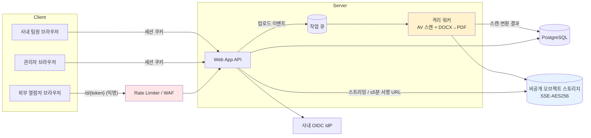
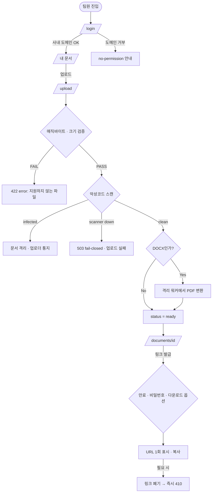
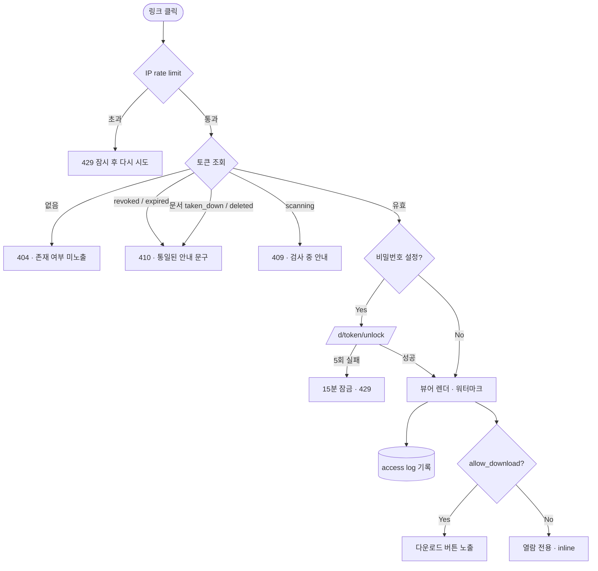
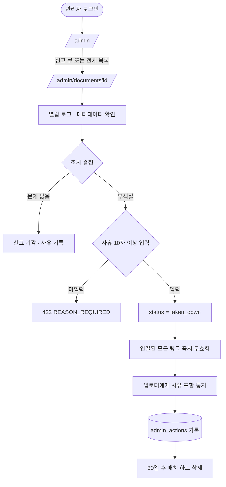

# 사내 문서 공유 서비스 (DocShare) PRD

> **Version**: 1.0
> **Created**: 2026-07-26
> **Status**: Draft
> **Type**: product-feature

---

## 1. Overview

### 1.1 Problem Statement

팀원이 작성한 PDF/DOCX 문서를 외부 협력사·고객에게 전달할 때, 현재는 이메일 첨부나 개인 클라우드 드라이브 공유에 의존한다. 이로 인해 세 가지 문제가 발생한다:

1. **통제 불가**: 한 번 첨부로 나간 파일은 회수·만료·열람 추적이 불가능하다. 누가 언제 봤는지 알 수 없고, 잘못 보낸 문서를 되돌릴 수 없다.
2. **책임 소재 불명**: 개인 계정 드라이브에 흩어져 있어 퇴사 시 문서가 유실되거나, 반대로 퇴사자 계정에 사내 문서가 남는다.
3. **관리자 개입 수단 부재**: 부적절하거나 유출 위험이 있는 문서를 발견해도 조직 차원에서 즉시 내릴 방법이 없다.

**핵심 긴장**: "사내용"이면서 동시에 "링크를 받은 외부인도 열람 가능"해야 한다. 이는 곧 **인증되지 않은 열람 경로가 설계상 존재**한다는 뜻이며, 링크 토큰 자체가 사실상의 자격증명(bearer credential)이 된다. 본 PRD는 이 경로를 "편의 기능"이 아니라 **1급 보안 표면**으로 다룬다.

### 1.2 Goals

- **G1**: 팀원이 PDF/DOCX를 업로드하고 30초 이내에 공유 가능한 링크를 얻는다.
- **G2**: 공유 링크는 **추측 불가**하고, **만료·폐기·비밀번호**로 통제 가능하다. 링크 발급자는 언제든 링크를 죽일 수 있다.
- **G3**: 모든 열람(사내/외부)이 감사 로그로 남아, "누가 언제 어디서 이 문서를 봤는가"에 답할 수 있다.
- **G4**: 관리자는 부적절한 문서를 즉시 비공개 처리하고, 그 행위 자체도 감사 로그에 남는다.
- **G5**: 외부 열람자는 계정 생성 없이, 링크만으로 브라우저에서 문서를 볼 수 있다.

### 1.3 Non-Goals (Out of Scope)

- **문서 편집·공동 작성**: 뷰어 전용. Google Docs / Notion 대체가 아니다.
- **문서 내 전문 검색(full-text search)**: v1은 파일명·업로더·태그 메타데이터 검색만. 본문 색인은 Phase 3.
- **PDF/DOCX 외 포맷**: XLSX/PPTX/이미지/동영상은 v1 제외 (FR 확장 여지만 남김).
- **DRM·화면 캡처 방지**: 워터마크(가시적)까지만. 스크린샷 차단은 기술적으로 불가능하므로 약속하지 않는다.
- **외부 사용자 계정 시스템**: 외부인은 익명 링크 열람자로만 존재. 초대·조직 관리 기능 없음.
- **버전 관리(diff, 롤백 히스토리)**: 새 버전 업로드 시 이전 파일 교체만. 버전 트리 없음.
- **모바일 네이티브 앱**: 반응형 웹만.

### 1.4 Scope

| 포함 | 제외 |
|------|------|
| PDF/DOCX 업로드 (매직바이트 검증, 50MB 제한) | XLSX/PPTX/이미지/ZIP 등 기타 포맷 |
| 업로드 시 악성코드 스캔 | 콘텐츠 자동 분류/DLP 정책 엔진 |
| 공유 링크 발급 (128bit 토큰, 만료·비밀번호·다운로드 허용 옵션) | 개별 외부 이메일 초대·권한 매트릭스 |
| 브라우저 내 뷰어 (PDF 네이티브 / DOCX→PDF 서버 변환) | 문서 편집, 코멘트, 실시간 협업 |
| 링크 폐기(revoke) 및 만료 | DRM, 스크린샷 차단, 오프라인 라이선스 |
| 열람 감사 로그 (IP/UA/시각/토큰) | BI 대시보드, 리포트 자동 발송 |
| 관리자 문서 비공개/삭제 + 사유 기록 | 승인 워크플로(업로드 전 결재) |
| 문서 신고(사내 사용자) | 외부 열람자 신고 |
| 사내 SSO(OIDC) 또는 이메일 도메인 화이트리스트 로그인 | 자체 비밀번호 회원가입 |

---

## 2. User Stories

### 2.1 Primary User

- **팀원 (`member`)**
  As a 사내 팀원, I want to 문서를 올리고 만료 기한이 붙은 공유 링크를 받고 싶다, so that 외부 협력사에 안전하게 자료를 전달하고 필요할 때 회수할 수 있다.

- **외부 열람자 (`guest`)**
  As a 링크를 받은 외부인, I want to 회원가입 없이 브라우저에서 바로 문서를 열람하고 싶다, so that 별도 절차 없이 필요한 자료를 확인할 수 있다.

- **관리자 (`admin`)**
  As a 관리자, I want to 부적절한 문서를 즉시 비공개 처리하고 그 이력을 남기고 싶다, so that 조직의 정보 유출 리스크를 통제하고 사후 감사에 대응할 수 있다.

### 2.2 Acceptance Criteria (Gherkin)

```gherkin
Scenario: 팀원이 PDF를 업로드하고 공유 링크를 발급한다
  Given 나는 사내 계정으로 로그인한 member이다
  When 20MB짜리 PDF 파일을 업로드하고 만료 7일 옵션으로 링크 발급을 요청한다
  Then 악성코드 스캔이 clean으로 끝난 뒤 문서 상태가 `ready`가 되고
  And 128bit 엔트로피 토큰이 포함된 `/d/{token}` 링크가 반환되며
  And 링크의 `expires_at`이 발급 시각 + 7일로 설정된다

Scenario: 스캔 중인 문서는 공유되지 않는다
  Given 문서가 업로드되었고 스캔 상태가 `scanning`이다
  When 해당 문서의 공유 링크로 접근한다
  Then 409 DOCUMENT_NOT_READY 를 반환하고 "문서를 검사 중입니다" 안내를 표시한다

Scenario: 악성 파일 업로드가 차단된다
  Given 나는 로그인한 member이다
  When 확장자는 .pdf 이지만 매직바이트가 PDF가 아닌 파일을 업로드한다
  Then 422 INVALID_FILE_TYPE 을 반환하고 파일은 저장소에서 즉시 삭제되며
  And 보안 이벤트가 감사 로그에 `upload_rejected` 로 기록된다

Scenario: 외부인이 유효한 링크로 문서를 연다
  Given 만료되지 않고 폐기되지 않은 공유 링크가 있다
  When 비로그인 상태에서 `/d/{token}` 에 접근한다
  Then 문서 뷰어가 렌더링되고
  And `document_access_logs` 에 (token_id, ip_hash, user_agent, viewed_at) 이 1건 기록되며
  And 응답 헤더에 `X-Robots-Tag: noindex, nofollow` 가 포함된다

Scenario: 폐기된 링크는 즉시 죽는다
  Given 발급자가 공유 링크를 revoke 했다
  When 외부인이 그 링크에 접근한다
  Then 410 LINK_REVOKED 를 반환하고 문서 내용·파일명·업로더 정보를 노출하지 않는다

Scenario: 만료된 링크는 접근할 수 없다
  Given 공유 링크의 expires_at 이 과거 시각이다
  When 외부인이 그 링크에 접근한다
  Then 410 LINK_EXPIRED 를 반환한다

Scenario: 비밀번호 보호 링크
  Given 링크에 비밀번호가 설정되어 있다
  When 외부인이 링크에 접근한다
  Then 비밀번호 입력 화면이 표시되고
  And 5회 연속 실패 시 해당 IP에 대해 15분간 429 TOO_MANY_ATTEMPTS 를 반환한다

Scenario: 관리자가 부적절한 문서를 내린다
  Given 나는 admin이고 문제 문서를 발견했다
  When 사유를 입력하고 해당 문서를 비공개 처리한다
  Then 문서 상태가 `taken_down` 이 되고
  And 연결된 모든 공유 링크가 즉시 무효화되며
  And `admin_actions` 에 (admin_id, document_id, action, reason, created_at) 이 기록되고
  And 업로더에게 알림이 발송된다

Scenario: 토큰 무차별 대입 방어
  Given 익명 클라이언트가 존재하지 않는 토큰으로 반복 접근한다
  When 같은 IP에서 1분 내 30회 이상 404가 발생한다
  Then 429 TOO_MANY_REQUESTS 를 반환하고 해당 IP를 10분간 차단한다

Scenario: 일반 팀원은 남의 문서를 관리할 수 없다
  Given 나는 member이고 다른 사람이 올린 문서가 있다
  When 그 문서의 삭제 API를 호출한다
  Then 403 FORBIDDEN 을 반환한다
```

### 2.3 User Roles

> **목적**: 역할을 영문 문자열로 통일 선언. 이후 페이지 권한·API authorization·`/screen-spec` Audience 매핑의 단일 키로 사용.

| Role Key | 한국어 명칭 | 권한 범위 | 비고 |
|----------|------------|----------|------|
| `guest` | 링크 보유 외부 열람자 | 유효한 공유 링크의 문서 **열람만** (다운로드는 링크 옵션에 따름) | 비로그인. 토큰이 곧 자격증명 |
| `member` | 사내 팀원 | 본인 문서 업로드/조회/수정/삭제, 본인 문서의 링크 발급·폐기, 사내 문서 목록 조회, 신고 | 사내 SSO 또는 도메인 화이트리스트 인증 |
| `admin` | 관리자 | `member` 전체 권한 + 전체 문서 조회/비공개 처리/삭제, 감사 로그 조회, 신고 처리 | 사내 인증 + admin 플래그 |

**규칙**:
- Role Key는 영문 소문자 단일 단어 사용
- 이후 모든 페이지/API 명세에서 이 키를 그대로 인용
- `guest`는 세션이 없으며, 권한 판정은 **토큰 유효성 검사**로 대체된다 (토큰 = 자격증명)
- `admin` 승격은 앱 UI가 아니라 운영자 콘솔/DB 직접 조작으로만 가능 (권한 상승 표면 최소화)

---

## 3. Functional Requirements

| ID | Requirement | Priority | Dependencies |
|----|------------|----------|--------------|
| FR-001 | 사내 인증: OIDC SSO 우선, 미구축 시 이메일 도메인 화이트리스트 + Magic Link 로그인 | P0 (Must) | - |
| FR-002 | 문서 업로드: PDF/DOCX만 허용. 확장자·MIME이 아닌 **매직바이트**로 판정. 최대 50MB | P0 (Must) | FR-001 |
| FR-003 | 업로드 파일 악성코드 스캔. 스캔 완료 전에는 `scanning` 상태로 공유·열람 차단 | P0 (Must) | FR-002 |
| FR-004 | 문서 메타데이터 저장 및 본인 문서 목록 조회 (파일명, 크기, 업로더, 업로드 시각, 상태) | P0 (Must) | FR-002 |
| FR-005 | 공유 링크 발급: CSPRNG 128bit 토큰(base62 ≈ 22자). 문서당 복수 링크 발급 가능 | P0 (Must) | FR-004 |
| FR-006 | 링크 옵션: 만료일(기본 7일, 최대 90일), 비밀번호(선택), 다운로드 허용 여부(기본 불가) | P0 (Must) | FR-005 |
| FR-007 | 링크 폐기(revoke): 발급자 또는 admin이 즉시 무효화. 폐기된 링크는 410 반환 | P0 (Must) | FR-005 |
| FR-008 | 브라우저 뷰어: PDF는 pdf.js 렌더링, DOCX는 **서버에서 PDF로 변환 후** 동일 뷰어로 제공 | P0 (Must) | FR-003 |
| FR-009 | 열람 감사 로그: 문서/링크/IP 해시/User-Agent/시각/성공여부를 모든 열람 시도에 기록 | P0 (Must) | FR-008 |
| FR-010 | 관리자 문서 비공개(take-down): 사유 필수 입력, 연결된 모든 링크 즉시 무효화, 업로더 알림 | P0 (Must) | FR-004 |
| FR-011 | 익명 엔드포인트 rate limiting 및 토큰 무차별 대입 방어 (IP 기준 슬라이딩 윈도우) | P0 (Must) | FR-005 |
| FR-012 | 검색엔진 색인 차단: 공유 뷰어 페이지에 `X-Robots-Tag: noindex, nofollow` + `robots.txt` Disallow | P0 (Must) | FR-008 |
| FR-013 | 파일 저장소 직접 접근 차단: 오브젝트 스토리지는 비공개, 애플리케이션 경유 스트리밍 또는 단기(≤5분) 서명 URL만 | P0 (Must) | FR-002 |
| FR-014 | 소유자 문서 삭제 (소프트 삭제) 및 새 버전 파일 교체 | P1 (Should) | FR-004 |
| FR-015 | 관리자 대시보드: 전체 문서 목록, 상태 필터, 신고 큐, 문서별 열람 로그 조회 | P1 (Should) | FR-009, FR-010 |
| FR-016 | 사내 문서 신고 (member → admin 큐) | P1 (Should) | FR-004 |
| FR-017 | 보존 정책: 소프트 삭제/take-down 문서는 30일 후 배치로 원본 하드 삭제. 감사 로그는 1년 보존 | P1 (Should) | FR-010, FR-014 |
| FR-018 | 외부 열람 시 가시적 워터마크(문서 ID + 열람 시각 + IP 일부) 오버레이 | P1 (Should) | FR-008 |
| FR-019 | 사내 문서 목록 검색 (파일명/업로더/태그 메타데이터 기준) | P1 (Should) | FR-004 |
| FR-020 | 링크 열람 알림: 최초 열람 시 발급자에게 알림 | P2 (Could) | FR-009 |
| FR-021 | 문서 본문 전문 검색(full-text) | P3 (Won't) | FR-019 |
| FR-022 | XLSX/PPTX 등 포맷 확장 | P3 (Won't) | FR-002 |

---

## 4. Non-Functional Requirements

### 4.0 Scale Grade (규모 등급)

**선택 등급: `Startup` (소규모 서비스)**

브리프의 "초기 스타트업 수준"에 근거. 사내 팀원 규모는 작지만, **외부 열람자가 링크로 유입**되므로 익명 트래픽은 사내 인원 수와 무관하게 증가할 수 있다는 점을 반영했다.

| 항목 | 값 | 근거 |
|------|-----|------|
| 사내 활성 사용자 | 20-100명 | 초기 스타트업 사내 인원 |
| 일일 활성 사용자(DAU, 외부 열람 포함) | 1,000-3,000 | 문서 1건당 외부 열람자 수 명 가정 |
| 피크 동시접속 | ~200 | 업무시간대 집중 |
| 월간 업로드 문서 | 500-2,000건 | 인당 주 2-5건 |
| 데이터량 | 초기 5GB, 월 10-20% 증가 | 평균 문서 3MB × 누적 |
| 인프라 예산 | $50-150/월 | Startup 등급 기준 |

| 등급 | 일일 사용자(DAU) | 동시접속 | 데이터량 | 인프라 비용 |
|------|-----------------|---------|---------|------------|
| **Startup (선택)** | 1,000 ≤ DAU < 10,000 | 100 ≤ CC < 1,000 | 1-10GB | $20-100/월 |

### 4.1 Performance SLA

| 지표 | 목표값 | 비고 |
|------|--------|------|
| API Response Time (p95) | < 400ms | 파일 전송 제외 메타데이터 API |
| 공유 링크 첫 렌더 (p95) | < 3s | 10MB PDF 기준, 첫 페이지 표시까지 |
| 업로드 처리 (50MB) | < 30s | 업로드 + 스캔 + (필요 시) 변환 완료까지 |
| DOCX → PDF 변환 (p95) | < 20s | 비동기 처리, 사용자는 대기 화면 |
| Throughput | 50 RPS | Startup 등급 기준 |

> Startup 등급 가이드: p95 < 500ms, RPS < 100이면 충분.

### 4.2 Availability SLA

| 항목 | 값 |
|------|-----|
| 목표 Uptime | **99%** (Startup 등급) |
| 허용 다운타임 | 월 7.3시간 |
| 계획 점검 | 업무시간 외, 사전 공지 |

> 서비스 중단 시 영향: 외부 협력사 자료 전달이 지연된다. 매출 직결은 아니나 대외 신뢰도에 영향. 24시간 이상 중단은 허용하지 않는다.

### 4.3 Data Requirements

| 항목 | 값 |
|------|-----|
| 초기 데이터량 | ~5GB |
| 월간 증가율 | 10-20% (약 1-2GB/월) |
| 문서 원본 보존 기간 | 업로더 삭제 전까지 무기한 (조직 정책 변경 시 조정) |
| 삭제/take-down 문서 원본 | 30일 유예 후 하드 삭제 |
| 감사 로그 보존 | **1년** (열람 로그, 관리자 조치 로그) |
| 백업 | 일 1회 스냅샷, 7일 보관 |

### 4.4 Recovery

| 항목 | 값 | 설명 |
|------|-----|------|
| RTO | 8시간 | 장애 후 서비스 복구 목표 |
| RPO | 24시간 | 일 1회 백업 기준 최대 데이터 손실 범위 |

### 4.5 Security

이 서비스의 보안 핵심은 **"인증 없는 열람 경로가 설계상 존재한다"**는 점이다. 아래 항목은 선택이 아니라 P0 요구사항이다.

#### 4.5.1 인증 / 인가

| 항목 | 정책 |
|------|------|
| 사내 인증 | OIDC SSO 우선. 미구축 시 이메일 도메인 화이트리스트 + Magic Link |
| 세션 | HttpOnly + Secure + SameSite=Lax 쿠키, 만료 12시간, 슬라이딩 갱신 |
| 인가 | 모든 문서 API에서 `owner_id == session.user_id OR role == admin` 서버 측 검증. 클라이언트 분기 신뢰 금지 |
| 권한 상승 | `admin` 부여는 UI 노출 없음 (운영자 직접 조작) |
| IDOR 방어 | 문서 ID는 UUIDv4. 순차 ID 금지 |

#### 4.5.2 공유 링크 = Bearer 자격증명

| 위협 | 대응 |
|------|------|
| 토큰 추측 | CSPRNG **128bit 이상**, base62 인코딩. 순차/타임스탬프 기반 금지 |
| 무차별 대입 | 익명 엔드포인트 IP 기준 rate limit (1분 30회 초과 시 10분 차단). 실패/성공 응답 시간 균일화 |
| 링크 무한 유효 | **기본 만료 7일**, 최대 90일. 무기한 옵션 없음 |
| 링크 유출 후 회수 불가 | `revoke` 즉시 반영 (캐시 우회, 발급된 서명 URL도 ≤5분 만료라 최대 5분 내 차단) |
| Referer 헤더로 토큰 유출 | 뷰어 페이지에 `Referrer-Policy: no-referrer` |
| 토큰이 로그·APM에 평문 저장 | 토큰은 **해시(SHA-256)로 DB 저장**, 서버 로그에는 `token_id`만 기록 |
| 검색엔진 색인 | `X-Robots-Tag: noindex, nofollow`, `robots.txt`에 `/d/` Disallow |
| 링크 공유 확산 | 워터마크(FR-018) + 열람 로그로 사후 추적. 확산 자체는 기술적으로 막을 수 없음을 명시 |

#### 4.5.3 파일 업로드 (악성 파일 유입 경로)

| 위협 | 대응 |
|------|------|
| 악성 매크로 DOCX / 악성 PDF | 업로드 시 안티바이러스 스캔(ClamAV 또는 관리형 스캔 API). 스캔 전 `scanning` 상태로 공유 차단 |
| 확장자 위장 | **매직바이트 검사** (`%PDF-`, DOCX는 ZIP 헤더 + `[Content_Types].xml` 확인). Content-Type 헤더 신뢰 금지 |
| 파일명 기반 XSS / 경로 조작 | 원본 파일명은 메타데이터로만 저장, 저장소 키는 서버 생성 UUID. 표시 시 HTML 이스케이프 |
| Zip bomb / 대용량 DoS | 50MB 하드 제한, DOCX 압축 해제 비율 상한 100:1, 변환 프로세스 타임아웃 60s + 메모리 제한 |
| 변환기 취약점 (LibreOffice 등) | 변환은 **격리된 워커/컨테이너**에서 네트워크 아웃바운드 차단 상태로 실행 |
| 스토리지 직접 접근 | 버킷 비공개. public-read 금지. 앱 경유 스트리밍 또는 ≤5분 서명 URL |

#### 4.5.4 뷰어 / 렌더링

| 항목 | 정책 |
|------|------|
| PDF 렌더링 | pdf.js, JS 실행·외부 링크 자동 실행 비활성화 |
| CSP | `default-src 'self'; object-src 'none'; frame-ancestors 'none'; script-src 'self'` |
| 파일 응답 헤더 | `X-Content-Type-Options: nosniff`, `Content-Disposition: inline; filename="..."` (파일명 RFC 5987 인코딩) |
| 클릭재킹 | `frame-ancestors 'none'` |

#### 4.5.5 데이터 보호

| 항목 | 정책 |
|------|------|
| 전송 중 암호화 | TLS 1.2+ 전 구간 필수, HSTS |
| 저장 시 암호화 | 오브젝트 스토리지 SSE (AES-256), DB 암호화 저장 |
| PII 최소화 | 열람 로그의 IP는 **해시 + 솔트** 저장 (원본 IP 미보관), 지역 판정만 별도 컬럼 |
| 정보 노출 최소화 | 무효 토큰 응답에 파일명·업로더·존재 여부 힌트 금지 (404/410 응답 본문 균일화) |
| 감사 로그 위변조 | 로그 테이블은 append-only, 앱 계정에 UPDATE/DELETE 권한 미부여 |

#### 4.5.6 관리자 권한 (특권 오남용 방어)

| 항목 | 정책 |
|------|------|
| take-down 사유 필수 | 사유 없이 삭제 불가 (API 레벨 강제) |
| 관리자 행위 감사 | 모든 admin 조치는 `admin_actions`에 기록, 관리자 본인도 삭제 불가 |
| 하드 삭제 | 관리자 UI에서 즉시 하드 삭제 불가. 30일 유예 후 배치만 (실수·악의 복구 창구) |
| 업로더 통지 | take-down 시 업로더에게 사유 포함 알림 (조용한 삭제 금지) |

#### 4.5.7 컴플라이언스 / 오픈 이슈

- 사내 문서가 **개인정보를 포함할 수 있으므로**, 개인정보보호법상 처리 근거·보존기간·파기 절차를 §4.3/FR-017과 정합해야 한다.
- 외부 열람자 IP는 개인정보로 해석될 수 있어 **해시 저장 + 1년 보존**으로 설계했다. 법무 검토 필요 (Open Question OQ-3).

### 4.6 Quality

| 항목 | 기준 |
|------|------|
| 테스트 커버리지 | 인증·인가·토큰 검증 경로는 **분기 커버리지 90%+** 필수, 그 외 70%+ |
| 보안 회귀 테스트 | 만료/폐기/비밀번호/rate limit/매직바이트 각각에 대한 자동화 테스트 필수 |
| 의존성 | CI에서 취약점 스캔(SCA), Critical 발견 시 빌드 실패 |
| 로깅 | 구조화 로그. 토큰 원문·파일 본문·세션 쿠키는 절대 로깅 금지 |

---

## 5. Technical Design

### 5.1 API Specification

Base: `/api/v1`. 인증 방식: 사내 사용자 = 세션 쿠키 / 외부 열람자 = URL 경로 토큰.

#### `POST /api/v1/documents`
- **Description**: 문서 업로드 (multipart). 업로드 즉시 `scanning` 상태로 생성되고, 스캔·변환은 비동기 진행.
- **Auth**: Required (`member`, `admin`)
- **Request** (`multipart/form-data`):
  | 필드 | 타입 | 필수 | 설명 |
  |------|------|------|------|
  | `file` | binary | Y | PDF 또는 DOCX, ≤ 50MB |
  | `title` | string(200) | N | 미지정 시 원본 파일명 사용 |
  | `tags` | string[] | N | 최대 10개 |
- **Response 201**:
  ```json
  {
    "id": "3f2a...uuid",
    "title": "2026 파트너 제안서",
    "original_filename": "proposal.pdf",
    "mime_type": "application/pdf",
    "size_bytes": 20971520,
    "status": "scanning",
    "owner_id": "8c1e...uuid",
    "created_at": "2026-07-26T04:11:00Z"
  }
  ```
- **Errors**:
  | Status | Code | 조건 |
  |--------|------|------|
  | 401 | `UNAUTHORIZED` | 세션 없음/만료 |
  | 413 | `FILE_TOO_LARGE` | 50MB 초과 |
  | 422 | `INVALID_FILE_TYPE` | 매직바이트가 PDF/DOCX가 아님 |
  | 429 | `TOO_MANY_REQUESTS` | 사용자당 업로드 rate limit 초과 (10/분) |
  | 503 | `SCANNER_UNAVAILABLE` | 스캐너 장애 — **업로드를 허용하지 않고 실패 처리**(fail-closed) |

#### `GET /api/v1/documents`
- **Description**: 본인 문서 목록 (admin은 `?scope=all`로 전체 조회)
- **Auth**: Required (`member`, `admin`)
- **Request (query)**: `q`(검색어), `status`, `scope`(`mine`|`all`, `all`은 admin만), `cursor`, `limit`(기본 20, 최대 100)
- **Response 200**:
  ```json
  {
    "items": [
      { "id": "…", "title": "…", "status": "ready", "size_bytes": 20971520,
        "owner": { "id": "…", "name": "김현만" },
        "link_count": 2, "view_count": 17, "created_at": "2026-07-26T04:11:00Z" }
    ],
    "next_cursor": "eyJpZCI6…"
  }
  ```
- **Errors**: 401 `UNAUTHORIZED` / 403 `FORBIDDEN`(비-admin이 `scope=all` 요청)

#### `GET /api/v1/documents/{id}`
- **Description**: 문서 상세 (메타데이터 + 링크 목록 요약)
- **Auth**: Required — `owner` 또는 `admin`만
- **Response 200**: 문서 객체 + `links: [{ id, token_preview, expires_at, revoked_at, has_password, allow_download, view_count }]`
  > `token_preview`는 앞 6자만. 원문 토큰은 발급 시 1회만 반환하고 이후 재조회 불가.
- **Errors**: 401 `UNAUTHORIZED` / 403 `FORBIDDEN` / 404 `NOT_FOUND`(타인 문서도 404로 통일, 존재 여부 노출 금지)

#### `DELETE /api/v1/documents/{id}`
- **Description**: 소유자 소프트 삭제. 연결된 모든 링크 즉시 무효화.
- **Auth**: Required — `owner` 또는 `admin`
- **Response 204**: (본문 없음)
- **Errors**: 401 / 403 `FORBIDDEN` / 404 `NOT_FOUND` / 409 `ALREADY_DELETED`

#### `POST /api/v1/documents/{id}/links`
- **Description**: 공유 링크 발급. **원문 토큰은 이 응답에서만 반환된다.**
- **Auth**: Required — `owner` 또는 `admin`
- **Request**:
  | 필드 | 타입 | 필수 | 기본값 | 설명 |
  |------|------|------|--------|------|
  | `expires_in_days` | int (1-90) | N | 7 | 만료. 무기한 불가 |
  | `password` | string(8-72) | N | null | 설정 시 bcrypt 해시 저장 |
  | `allow_download` | boolean | N | false | false면 뷰어 열람만 |
  | `label` | string(50) | N | null | "A사 제안용" 등 발급자 메모 |
- **Response 201**:
  ```json
  {
    "id": "b7d2...uuid",
    "url": "https://docshare.example.com/d/9xK2mQ7fTn4pRb1sZv8cWd",
    "expires_at": "2026-08-02T04:20:00Z",
    "has_password": true,
    "allow_download": false
  }
  ```
- **Errors**: 401 / 403 / 404 / 409 `DOCUMENT_NOT_READY`(스캔 미완/감염/take-down) / 422 `INVALID_EXPIRY`(90일 초과) / 429 `TOO_MANY_REQUESTS`

#### `DELETE /api/v1/links/{link_id}`
- **Description**: 링크 폐기(revoke). 즉시 반영.
- **Auth**: Required — 링크 발급자, 문서 owner, 또는 `admin`
- **Response 204**
- **Errors**: 401 / 403 / 404 / 409 `ALREADY_REVOKED`

#### `GET /d/{token}` (페이지) / `GET /api/v1/shared/{token}` (메타)
- **Description**: 외부 열람 진입점. 토큰 유효성 검사 후 문서 메타 반환.
- **Auth**: None (토큰 자체가 자격증명)
- **Response 200**:
  ```json
  {
    "title": "2026 파트너 제안서",
    "page_count": 12,
    "allow_download": false,
    "requires_password": false,
    "content_url": "/api/v1/shared/9xK2…/content"
  }
  ```
- **Errors**:
  | Status | Code | 조건 |
  |--------|------|------|
  | 401 | `PASSWORD_REQUIRED` | 비밀번호 링크에 미인증 접근 |
  | 404 | `NOT_FOUND` | 토큰 없음 (존재하지 않는 토큰과 잘못된 토큰을 구분하지 않음) |
  | 409 | `DOCUMENT_NOT_READY` | 스캔 중 |
  | 410 | `LINK_EXPIRED` / `LINK_REVOKED` / `DOCUMENT_REMOVED` | 만료/폐기/문서 삭제·take-down |
  | 429 | `TOO_MANY_REQUESTS` | IP rate limit 초과 |

#### `POST /api/v1/shared/{token}/unlock`
- **Description**: 비밀번호 보호 링크 잠금 해제. 성공 시 해당 토큰 한정 단기 세션 쿠키(30분) 발급.
- **Auth**: None
- **Request**: `{ "password": "string" }`
- **Response 200**: `{ "unlocked": true }`
- **Errors**: 401 `INVALID_PASSWORD` / 410 `LINK_EXPIRED`/`LINK_REVOKED` / 429 `TOO_MANY_ATTEMPTS`(IP+토큰 기준 5회 실패 시 15분)

#### `GET /api/v1/shared/{token}/content`
- **Description**: 문서 바이트 스트리밍 (뷰어용). `allow_download=false`면 `Content-Disposition: inline` + 다운로드 버튼 미제공.
- **Auth**: None (토큰 + 필요 시 unlock 쿠키)
- **Response 200**: `application/pdf` 바이너리. 헤더: `X-Robots-Tag: noindex, nofollow`, `Referrer-Policy: no-referrer`, `X-Content-Type-Options: nosniff`, `Cache-Control: private, no-store`
- **Side effect**: `document_access_logs` 1건 기록
- **Errors**: 401 `PASSWORD_REQUIRED` / 404 / 410 / 429

#### `POST /api/v1/admin/documents/{id}/takedown`
- **Description**: 관리자 비공개 처리. 사유 필수.
- **Auth**: Required — `admin` only
- **Request**: `{ "reason": "string(10-500)", "notify_owner": true }`
- **Response 200**: `{ "id": "…", "status": "taken_down", "revoked_link_count": 3 }`
- **Errors**: 401 / 403 `FORBIDDEN` / 404 / 422 `REASON_REQUIRED`(사유 10자 미만)

#### `GET /api/v1/admin/documents/{id}/access-logs`
- **Description**: 문서별 열람 로그 조회
- **Auth**: Required — `admin` 또는 문서 `owner`
- **Response 200**: `{ "items": [{ "link_id", "ip_region", "user_agent", "viewed_at", "result" }], "next_cursor" }`
  > 원본 IP는 반환하지 않는다 (해시 저장, 지역만 노출).
- **Errors**: 401 / 403 / 404

#### `POST /api/v1/documents/{id}/reports`
- **Description**: 사내 사용자 문서 신고
- **Auth**: Required (`member`, `admin`)
- **Request**: `{ "reason_code": "inappropriate|confidential_leak|copyright|other", "detail": "string(0-500)" }`
- **Response 201**: `{ "id": "…", "status": "open" }`
- **Errors**: 401 / 404 / 409 `ALREADY_REPORTED`(동일 사용자 중복) / 429

### 5.2 Database Schema

```sql
-- 사용자 (사내)
CREATE TABLE users (
  id            UUID PRIMARY KEY DEFAULT gen_random_uuid(),
  email         CITEXT UNIQUE NOT NULL,
  name          TEXT NOT NULL,
  role          TEXT NOT NULL DEFAULT 'member',  -- 'member' | 'admin'
  is_active     BOOLEAN NOT NULL DEFAULT TRUE,
  created_at    TIMESTAMPTZ NOT NULL DEFAULT now(),
  CONSTRAINT users_role_chk CHECK (role IN ('member','admin'))
);

-- 문서
CREATE TABLE documents (
  id                 UUID PRIMARY KEY DEFAULT gen_random_uuid(),
  owner_id           UUID NOT NULL REFERENCES users(id),
  title              TEXT NOT NULL,
  original_filename  TEXT NOT NULL,
  storage_key        TEXT NOT NULL,          -- 서버 생성 UUID 경로 (원본 파일명 미사용)
  rendered_key       TEXT,                   -- DOCX → PDF 변환 결과
  mime_type          TEXT NOT NULL,          -- 매직바이트 판정 결과
  size_bytes         BIGINT NOT NULL,
  checksum_sha256    TEXT NOT NULL,
  page_count         INT,
  status             TEXT NOT NULL DEFAULT 'scanning',
     -- 'scanning' | 'converting' | 'ready' | 'infected' | 'failed' | 'deleted' | 'taken_down'
  scan_result        TEXT,                   -- 'clean' | 'infected' | 'error'
  deleted_at         TIMESTAMPTZ,
  purge_after        TIMESTAMPTZ,            -- 하드 삭제 예정 시각 (deleted/taken_down + 30d)
  created_at         TIMESTAMPTZ NOT NULL DEFAULT now(),
  updated_at         TIMESTAMPTZ NOT NULL DEFAULT now(),
  CONSTRAINT documents_status_chk CHECK (status IN
    ('scanning','converting','ready','infected','failed','deleted','taken_down')),
  CONSTRAINT documents_size_chk CHECK (size_bytes > 0 AND size_bytes <= 52428800)
);
CREATE INDEX idx_documents_owner ON documents(owner_id, created_at DESC);
CREATE INDEX idx_documents_status ON documents(status);
CREATE INDEX idx_documents_purge ON documents(purge_after) WHERE purge_after IS NOT NULL;

-- 공유 링크 (토큰은 해시로만 저장)
CREATE TABLE share_links (
  id              UUID PRIMARY KEY DEFAULT gen_random_uuid(),
  document_id     UUID NOT NULL REFERENCES documents(id) ON DELETE CASCADE,
  created_by      UUID NOT NULL REFERENCES users(id),
  token_hash      TEXT NOT NULL UNIQUE,     -- SHA-256(token). 원문 미저장
  token_preview   TEXT NOT NULL,            -- 앞 6자 (UI 식별용)
  password_hash   TEXT,                     -- bcrypt, NULL이면 비밀번호 없음
  allow_download  BOOLEAN NOT NULL DEFAULT FALSE,
  label           TEXT,
  expires_at      TIMESTAMPTZ NOT NULL,     -- NOT NULL: 무기한 링크 금지
  revoked_at      TIMESTAMPTZ,
  revoked_by      UUID REFERENCES users(id),
  view_count      INT NOT NULL DEFAULT 0,
  created_at      TIMESTAMPTZ NOT NULL DEFAULT now()
);
CREATE INDEX idx_share_links_doc ON share_links(document_id);
CREATE INDEX idx_share_links_expiry ON share_links(expires_at) WHERE revoked_at IS NULL;

-- 열람 감사 로그 (append-only)
CREATE TABLE document_access_logs (
  id           BIGSERIAL PRIMARY KEY,
  document_id  UUID NOT NULL,
  link_id      UUID,
  actor_type   TEXT NOT NULL,   -- 'guest' | 'member' | 'admin'
  actor_id     UUID,            -- 사내 사용자일 때만
  ip_hash      TEXT NOT NULL,   -- SHA-256(ip + server_salt). 원본 IP 미보관
  ip_region    TEXT,
  user_agent   TEXT,
  result       TEXT NOT NULL,   -- 'ok' | 'expired' | 'revoked' | 'password_fail' | 'not_found' | 'rate_limited'
  viewed_at    TIMESTAMPTZ NOT NULL DEFAULT now()
);
CREATE INDEX idx_access_logs_doc ON document_access_logs(document_id, viewed_at DESC);
CREATE INDEX idx_access_logs_retention ON document_access_logs(viewed_at);
-- 앱 DB 계정에는 UPDATE/DELETE 권한 미부여 (파기 배치는 별도 계정)

-- 관리자 조치 감사
CREATE TABLE admin_actions (
  id           BIGSERIAL PRIMARY KEY,
  admin_id     UUID NOT NULL REFERENCES users(id),
  document_id  UUID NOT NULL,
  action       TEXT NOT NULL,   -- 'takedown' | 'restore' | 'hard_delete' | 'report_resolve'
  reason       TEXT NOT NULL,
  created_at   TIMESTAMPTZ NOT NULL DEFAULT now(),
  CONSTRAINT admin_actions_reason_chk CHECK (char_length(reason) >= 10)
);
CREATE INDEX idx_admin_actions_doc ON admin_actions(document_id, created_at DESC);

-- 신고
CREATE TABLE document_reports (
  id           UUID PRIMARY KEY DEFAULT gen_random_uuid(),
  document_id  UUID NOT NULL REFERENCES documents(id) ON DELETE CASCADE,
  reporter_id  UUID NOT NULL REFERENCES users(id),
  reason_code  TEXT NOT NULL,
  detail       TEXT,
  status       TEXT NOT NULL DEFAULT 'open',  -- 'open' | 'resolved' | 'dismissed'
  resolved_by  UUID REFERENCES users(id),
  created_at   TIMESTAMPTZ NOT NULL DEFAULT now(),
  UNIQUE (document_id, reporter_id)
);
```

### 5.3 Architecture Diagram



**핵심 설계 결정**:
1. **fail-closed 스캔**: 스캐너 장애 시 업로드를 통과시키지 않는다. 가용성보다 안전을 택한다.
2. **격리 워커**: DOCX→PDF 변환기는 파싱 취약점의 표적이므로 네트워크 아웃바운드 차단 컨테이너에서 실행.
3. **버킷 비공개 고정**: 스토리지 public URL을 절대 발급하지 않는다. 링크 폐기가 즉시 유효하려면 앱이 모든 접근의 관문이어야 한다.

### 5.4 Pages

| Route | Audience | Auth | Linked FRs | Has FE Components | Primary State | Responsive |
|-------|----------|------|-----------|-------------------|---------------|-----------|
| `/login` | guest(사내 미인증) | None | FR-001 | **Yes** | success / error | Desktop / Mobile |
| `/` (내 문서) | member, admin | Required | FR-004, FR-019 | **Yes** | success / empty | Desktop / Mobile |
| `/upload` | member, admin | Required | FR-002, FR-003 | **Yes** | success / error / loading | Desktop / Mobile |
| `/documents/[id]` | member(owner), admin | Required | FR-004, FR-005, FR-006, FR-007, FR-009, FR-014 | **Yes** | success / error | Desktop / Mobile |
| `/d/[token]` (외부 뷰어) | guest | None (토큰) | FR-008, FR-012, FR-018 | **Yes** | loading / success / error | Desktop / Mobile |
| `/d/[token]/unlock` | guest | None (토큰) | FR-006 | **Yes** | success / error | Desktop / Mobile |
| `/admin` | admin | Required | FR-015, FR-016 | **Yes** | success / empty / no-permission | Desktop only |
| `/admin/documents/[id]` | admin | Required | FR-010, FR-015 | **Yes** | success / no-permission | Desktop only |
| `/api/v1/*` | - | Required/None | FR-001~FR-020 | **No** (API) | - | - |
| 파기 배치 (cron) | - | - | FR-017 | **No** (Job) | - | - |

**규칙**:
- `Audience`는 §2.3 Role Key를 그대로 사용
- `Has FE Components: Yes` 행이 1개 이상이므로 §5.4.1·§5.5를 작성한다

### 5.4.1 Page State Matrix

| Route | loading | empty | error | success | no-permission | 비고 |
|-------|---------|-------|-------|---------|---------------|------|
| `/login` | ✓ | - | ✓ | ✓ | ✓ | 도메인 화이트리스트 외 이메일 → no-permission |
| `/` | ✓ | ✓ | ✓ | ✓ | - | 업로드 0건 시 empty (첫 업로드 유도 CTA) |
| `/upload` | ✓ | - | ✓ | ✓ | - | 스캔 중 loading 유지, 감염 판정 시 error |
| `/documents/[id]` | ✓ | ✓ | ✓ | ✓ | ✓ | 링크 0개 시 empty, 타인 문서는 404로 통일 |
| `/d/[token]` | ✓ | - | ✓ | ✓ | ✓ | 만료/폐기/삭제는 error, 비밀번호 필요 시 no-permission → unlock 이동 |
| `/d/[token]/unlock` | ✓ | - | ✓ | ✓ | - | 5회 실패 시 error(잠금 안내 + 남은 시간) |
| `/admin` | ✓ | ✓ | ✓ | ✓ | ✓ | 신고 큐 0건 시 empty, member 접근 시 no-permission |
| `/admin/documents/[id]` | ✓ | ✓ | ✓ | ✓ | ✓ | 열람 로그 0건 시 empty |

**상태 정의**:
- `loading`: 데이터 fetch/스캔/변환 진행 중 (스켈레톤 또는 진행 안내)
- `empty`: 정상 응답이지만 결과 0건
- `error`: 4xx/5xx 응답 또는 클라이언트 검증 실패
- `success`: 정상 응답 + 결과 ≥1건
- `no-permission`: 권한 부족 또는 토큰 잠금 상태

**외부 뷰어 에러 마이크로카피 원칙**: `/d/[token]`의 모든 실패 상태는 **문서 존재 여부·파일명·업로더를 노출하지 않는다.** "링크가 만료되었거나 더 이상 사용할 수 없습니다. 링크를 공유한 담당자에게 문의해 주세요." 로 통일한다.

### 5.5 User Flow

#### Flow A: 팀원 — 업로드부터 링크 공유까지



#### Flow B: 외부 열람자 — 링크 열람



#### Flow C: 관리자 — 부적절 문서 처리



---

## 6. Implementation Phases

### Phase 1: MVP — 안전한 업로드와 공유

- [ ] 사내 인증 (OIDC 또는 도메인 화이트리스트 Magic Link) — FR-001
- [ ] 업로드 파이프라인: 매직바이트 검증 + 50MB 제한 + 비공개 스토리지 저장 — FR-002, FR-013
- [ ] 악성코드 스캔 워커 (fail-closed) — FR-003
- [ ] DOCX → PDF 변환 워커 (격리 컨테이너) — FR-008
- [ ] 문서 목록/상세 + 소유권 기반 인가 — FR-004
- [ ] 공유 링크 발급 (128bit 토큰, 해시 저장, 만료 필수) — FR-005, FR-006
- [ ] 링크 폐기 — FR-007
- [ ] 외부 뷰어 페이지 + noindex + CSP 헤더 — FR-008, FR-012
- [ ] 익명 엔드포인트 rate limiting — FR-011
- [ ] 열람 감사 로그 — FR-009
- [ ] 관리자 take-down (사유 필수 + 링크 무효화 + 통지 + 감사) — FR-010

**Deliverable**: 팀원이 문서를 올려 만료·폐기 가능한 링크로 외부에 공유할 수 있고, 관리자가 문제 문서를 즉시 내릴 수 있는 배포 가능한 서비스.

### Phase 2: Enhancement — 운영 편의와 추적성

- [ ] 관리자 대시보드 (전체 목록, 상태 필터, 신고 큐, 문서별 열람 로그) — FR-015
- [ ] 문서 신고 — FR-016
- [ ] 소유자 삭제 및 버전 교체 — FR-014
- [ ] 보존 정책 배치 (30일 후 하드 삭제, 감사 로그 1년 파기) — FR-017
- [ ] 외부 열람 워터마크 — FR-018
- [ ] 메타데이터 검색 — FR-019
- [ ] 링크 비밀번호 옵션 UI 고도화 — FR-006

**Deliverable**: 관리자가 조직 전체 문서 상태를 파악하고 감사에 대응할 수 있는 운영 콘솔.

### Phase 3: Later

- [ ] 최초 열람 알림 — FR-020
- [ ] 본문 전문 검색 — FR-021
- [ ] 포맷 확장 (XLSX/PPTX) — FR-022

**Deliverable**: 사용성 확장. Phase 1-2 보안 기반이 안정화된 이후에만 착수.

---

## 7. Success Metrics

| Metric | Target | Measurement |
|--------|--------|-------------|
| 업로드 → 링크 발급 완료 시간 (p50) | < 30초 | 클라이언트 이벤트 타임스탬프 |
| 외부 링크 첫 렌더 성공률 | ≥ 98% | `document_access_logs.result = 'ok'` / 전체 유효 토큰 접근 |
| 만료 없는 링크 비율 | **0%** | `share_links.expires_at IS NULL` 카운트 (스키마상 0이어야 함) |
| 악성 파일 차단률 | 100% (알려진 시그니처 기준) | 스캔 로그 `infected` 건수 / 테스트 세트 |
| take-down 반영 지연 | ≤ 5분 | take-down 시각 → 마지막 성공 열람 시각 차이 (서명 URL 만료 상한) |
| 감사 로그 커버리지 | 100% | 열람 응답 수 대비 로그 레코드 수 |
| 사내 채택률 (이메일 첨부 대체) | 3개월 내 활성 팀원의 60% 이상 월 1회+ 업로드 | 월간 고유 업로더 / 전체 활성 사용자 |
| 토큰 무차별 대입 탐지 | 주 1회 리포트 | `result = 'not_found'` 급증 IP 집계 |

---

## 8. Open Questions

| ID | 질문 | 영향 | 기본 가정 (미해결 시) |
|----|------|------|---------------------|
| OQ-1 | 사내 OIDC IdP(Google Workspace / Okta 등)가 이미 있는가? | 인증 구현 방식 결정 (FR-001) | 없다고 보고 이메일 도메인 화이트리스트 + Magic Link로 구현 |
| OQ-2 | "부적절한 문서"의 판단 기준·에스컬레이션 주체가 정해져 있는가? | 관리자 정책·신고 사유 코드 (FR-010, FR-016) | 사유 자유 기입 + 관리자 재량. 정책 문서는 별도 작성 |
| OQ-3 | 외부 열람자 IP 해시 1년 보존이 개인정보 처리방침에 반영되어 있는가? | 컴플라이언스 (§4.5.7, FR-017) | 법무 검토 전까지 90일 보존으로 축소 운영 |
| OQ-4 | DOCX 서식 재현도 요구 수준은? (변환 시 폰트·레이아웃 깨짐 허용 범위) | 변환 엔진 선택 및 비용 (FR-008) | LibreOffice 헤드리스로 시작, 재현도 불만 발생 시 상용 변환 API 검토 |
| OQ-5 | 링크 최대 만료 90일이 실무에 충분한가? (장기 협업 케이스) | FR-006 정책 | 90일 유지. 초과 필요 시 재발급으로 대응 |
| OQ-6 | 퇴사자 문서의 소유권 이전 정책이 필요한가? | 계정 비활성화 시 문서 처리 | v1은 문서 유지 + 소유자 계정 비활성화. 이전 기능은 백로그 |

---

## Appendix A. 설계상 인정하는 한계 (명시적 리스크 수용)

이 서비스는 "링크만 있으면 누구나 열람 가능"을 요구사항으로 받았으므로, 아래는 **막을 수 없는 것**이다. 사용자에게 과장된 안전을 약속하지 않기 위해 명문화한다.

1. **링크 재전달(forwarding)은 막을 수 없다.** 외부 열람자가 링크를 제3자에게 전달하면 그 제3자도 열람한다. 대응은 사전 차단이 아니라 **만료·폐기·워터마크·열람 로그를 통한 사후 억제**다.
2. **화면 캡처·재촬영은 막을 수 없다.** 다운로드를 금지해도 콘텐츠 유출 자체는 방지되지 않는다. `allow_download=false`는 "실수로 파일이 유통되는 것"을 줄일 뿐이다.
3. **비밀번호 없는 링크는 토큰 유출 = 문서 유출이다.** 기밀도 높은 문서에는 비밀번호 + 짧은 만료를 사용하도록 UI에서 권장한다.
4. **DOCX 변환 재현도는 100%가 아니다.** 복잡한 서식·폰트는 깨질 수 있으며, 원본 그대로가 중요하면 PDF 업로드를 권장한다.
